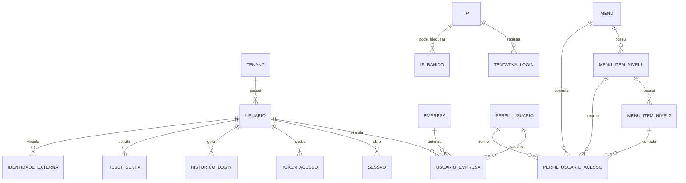

# EF 0_APLICATIVO IDENTIDADE_E_CONTEXTO_TENANT V1

**Projeto:** Epros  
**Empresa:** Siser  
**Tipo de documento:** Especificacao Funcional definitiva  
**Versao:** V1  
**Modulo:** APLICATIVO  
**Submodulo:** IDENTIDADE_E_CONTEXTO_TENANT  
**ID funcional:** APP-TEN-001  
**Status:** Pronto para validacao humana  
**Data:** 2026-06-06

## 1. Controle do documento

| Item | Conteudo |
|---|---|
| Responsavel pela elaboracao | Agente de analise e refinamento funcional |
| Responsavel pela validacao funcional | Siser |
| Responsavel pela validacao tecnica | Siser |
| Area dona do processo | Plataforma SaaS / Identidade e contexto operacional |
| Publico-alvo | Produto, negocio, dados, desenvolvimento, seguranca, QA, implantacao e suporte |
| Fonte de verdade | Esta EF descreve o comportamento funcional esperado do Epros para identidade, autenticacao, sessao e contexto tenant |

## 2. Objetivo funcional

O submodulo Identidade e Contexto Tenant define quem acessa o Epros, como a sessao e autenticada, qual tenant e empresa estao ativos, quais acessos sao carregados, como a senha e gerida, como tokens e sessoes sao emitidos, como tentativas e acessos sao auditados e como canais web, API, mobile, PDV e integracoes de identidade se comportam.

| Pergunta | Resposta |
|---|---|
| Para que o submodulo existe? | Para autenticar usuarios, estabelecer contexto tenant/empresa, emitir sessao/token, carregar acessos e garantir que cada requisicao opere no escopo correto. |
| Que problema de negocio resolve? | Evita acesso indevido, mistura de dados entre clientes, uso sem empresa selecionada, permissoes incorretas e perda de auditoria de login. |
| Qual resultado operacional deve produzir? | Usuario autenticado com tenant, empresa ativa, perfil, menu, limites e sessao validos para uso do Epros. |
| Quais areas dependem dele? | Todos os modulos operacionais, Dashboard e Layout, Usuarios e Papeis, Permissoes de Menu, Onboarding e Empresa, Assinatura e Planos, Limites de Plano, Operacao Super Admin, API Gateway, Compliance e modulos de dominio. |

## 3. Escopo funcional

### 3.1 Dentro do escopo

| Capacidade | Descricao | Observacao |
|---|---|---|
| Login web | Autenticacao por identificador e senha. | Identificador principal e email/login conforme contrato final. |
| Sessao autenticada | Emissao, persistencia, expiracao, renovacao e encerramento de sessao. | Inclui tratamento de 401/sessao expirada. |
| Contexto tenant | Identificacao do tenant ativo em token, claim, sessao ou estrutura equivalente. | TenantId e obrigatorio para dados tenantizados. |
| Selecao de empresa | Escolha de empresa quando usuario possui mais de uma empresa. | Gera contexto completo. |
| Token basico e token completo | Primeiro token identifica usuario/tenant; segundo inclui empresa, perfil e acessos. | Modelo exato deve seguir politica de seguranca da Siser. |
| Recuperacao e reset de senha | Solicitar recuperacao, validar token, trocar senha e invalidar token. | Janela unica de validade precisa decisao. |
| Troca de senha autenticada | Usuario logado altera senha mediante senha atual e confirmacao. | Pode exigir permissao especifica. |
| Verificacao de email | Validar email de novo cadastro ou conta quando configurado. | Reenvio deve ser limitado. |
| Cadastro inicial de tenant | Acionar onboarding com empresa, usuario admin e dados iniciais. | Manutencao de empresa pertence a Onboarding/Cadastros. |
| Login API/mobile/PDV | Autenticacao de canais nao web com token ou contrato proprio. | Regras inseguras identificadas ficam na MC. |
| Auditoria de login | Registrar sucesso, falha, IP, data, navegador, origem, usuario e owner/contexto quando disponivel. | Geolocalizacao externa e opcional e deve respeitar privacidade. |
| Protecao contra tentativa abusiva | Rate limit, lockout, banimento temporario ou bloqueio por falhas. | Politica final deve ser centralizada. |
| Impersonacao controlada | Acesso temporario por perfil autorizado para suporte/operacao. | Requer politica forte, trilha e justificativa. |
| Login social e provedores externos | Capacidade de autenticar por provedor externo quando configurado. | Exige decisao de produto e seguranca. |
| Diretórios corporativos e SSO | Capacidade de autenticar por provedor corporativo quando configurado. | Exige governanca IAM. |
| Estado da conta | Ativo, inativo, pendente, suspenso, bloqueado e forcar troca de senha quando aplicavel. | Estados devem ser unificados. |

### 3.2 Fora do escopo

| Item fora do escopo | Motivo | Destino correto |
|---|---|---|
| CRUD completo de usuarios, papeis e perfis | Este submodulo usa os dados para autenticar e carregar contexto. | USUARIOS_E_PAPEIS; PERMISSOES_DE_MENU |
| Modelo completo de empresa, grupos, fiscal, CFOP e plano de contas | Cadastro inicial aciona seeds, mas manutencao pertence aos dominios donos. | ONBOARDING_E_EMPRESA; CADASTROS_BASE; FINANCEIRO; FISCAL |
| Regra financeira de bloqueio por inadimplencia | Identidade apenas aplica o bloqueio recebido. | ASSINATURA_E_PLANOS; PEDIDOS_E_COBRANCA_SAAS |
| Relatorios operacionais | Identidade nao produz relatorios de negocio. | RELATORIOS |
| Autorizacao granular de cada modulo de negocio | O mecanismo e descrito aqui; cada modulo define seus recursos. | PERMISSOES_DE_MENU e modulos de dominio |
| API key de integracoes tecnicas | Citada como campo relacionado, mas nao detalhada neste submodulo. | API_GATEWAY_E_OPENAPI; INTEGRACOES_E_CONECTORES |

## 4. Glossario e conceitos funcionais

| Termo | Definicao funcional | Observacoes |
|---|---|---|
| Identidade | Registro que representa quem pode acessar o Epros. | Pode ser usuario humano, conta tecnica ou contexto autorizado. |
| Tenant | Identificador logico do cliente/ambiente de dados. | Deve acompanhar toda operacao tenantizada. |
| Empresa ativa | Empresa selecionada para a sessao operacional. | Necessaria quando usuario possui acesso a multiplas empresas. |
| Token basico | Credencial temporaria apos login, antes de selecionar empresa completa. | Permite obter acessos quando autorizado. |
| Token completo | Credencial com tenant, empresa, perfil, admin e contexto operacional. | Usada para navegar e operar. |
| Acesso | Conjunto de menus e permissoes carregado para o usuario. | Inclui ver, editar e excluir quando aplicavel. |
| Perfil | Grupo funcional de permissoes. | Um usuario pode ter perfil por empresa. |
| Usuario administrador | Usuario com permissao administrativa na empresa/contexto. | Pode dispensar perfil conforme regra material. |
| Sessao expirada | Sessao/token invalido ou vencido. | Deve limpar contexto e direcionar ao login. |
| Impersonacao | Acesso temporario em nome de outro usuario/cliente. | Deve ser altamente auditado. |
| Verificacao de email | Confirmacao de posse do email informado. | Pode ser exigida no cadastro. |
| Rate limit | Controle de quantidade de tentativas por periodo. | Protege contra ataques de senha. |
| Banimento de IP | Bloqueio temporario de login a partir de IP. | Capacidade identificada, politica final na MC. |

## 5. Atores, papeis e responsabilidades

| Ator/Papel | Responsabilidade | Permissoes esperadas | Restricoes |
|---|---|---|---|
| Usuario anonimo | Acessar login, registro e recuperacao de senha quando habilitados. | Enviar credenciais, solicitar reset, cadastrar tenant se permitido. | Sem acesso a dados internos. |
| Usuario autenticado | Operar o Epros dentro do tenant/empresa autorizados. | Sessao valida e acessos carregados. | Restrito ao contexto ativo. |
| Administrador da empresa | Administrar acesso operacional da empresa quando autorizado. | Acessar empresas/perfis conforme permissao. | Sem acesso a tenants de terceiros. |
| Administrador Siser | Suportar plataforma, validar acesso, operar bloqueios e suporte controlado. | Acessos administrativos conforme governanca. | Impersonacao exige trilha e justificativa. |
| Cliente SaaS em cadastro | Criar conta/tenant inicial quando registro estiver habilitado. | Preencher dados da empresa e usuario admin. | Deve confirmar email e aceitar termos quando exigido. |
| Canal API/mobile | Autenticar e consumir servicos protegidos. | Token valido e escopo autorizado. | Deve respeitar modulo ativo e tenant. |
| Provedor externo de identidade | Autenticar usuario quando habilitado. | Retornar identidade validada. | Deve estar configurado e aprovado. |
| Sistema | Emitir tokens, validar contexto, bloquear, auditar e limpar sessoes. | Execucao automatica. | Deve preservar seguranca e rastreabilidade. |

## 6. Visao operacional do submodulo

1. Usuario informa email/login e senha na tela de login.
2. Epros valida preenchimento, formato e protecao contra tentativas abusivas.
3. Epros valida credenciais, estado da conta, bloqueios e configuracoes de login.
4. Em caso de sucesso, Epros registra auditoria e emite sessao ou token basico.
5. Se houver bloqueio SaaS ativo, Epros direciona para regularizacao sem liberar uso operacional.
6. Se o usuario tiver mais de uma empresa, Epros solicita selecao de empresa.
7. Ao selecionar empresa, Epros valida se a empresa pertence ao conjunto autorizado.
8. Epros emite token completo, carrega empresa, tenant, perfil, permissoes, menus, limites e dados de contexto.
9. Todas as chamadas protegidas validam token/sessao e aplicam tenant/empresa/permissao.
10. Sessao expirada ou resposta nao autorizada limpa contexto local e retorna ao login.
11. Recuperacao de senha gera token temporario, envia instrucao por email, valida token e aplica nova senha conforme politica.
12. Logout encerra sessao/token e remove contexto ativo.

## 7. Capacidades funcionais

### 7.1 Login web com contexto inicial

| Item | Especificacao |
|---|---|
| Objetivo | Autenticar usuario por credenciais e iniciar sessao segura. |
| Acionamento | Usuario submete login. |
| Pre-condicoes | Registro de usuario existente e ativo, salvo excecoes de cadastro pendente. |
| Dados de entrada | Email/login, senha, opcao lembrar-me quando aplicavel, captcha quando configurado. |
| Processamento | Validar entrada, rate limit, credenciais, estado da conta, bloqueios e permissao de login. |
| Resultado esperado | Sessao/token inicial, auditoria de sucesso e proximo passo definido. |
| Pos-condicoes | Usuario segue para selecao de empresa, dashboard, verificacao de email ou bloqueio. |
| Excecoes | Credencial invalida, usuario inativo, excesso de tentativas, IP banido, email nao verificado, cliente bloqueado. |
| Auditoria | Registrar sucesso e falha com usuario/identificador, IP, data, origem e motivo quando disponivel. |

### 7.2 Selecao de empresa e emissao de contexto completo

| Item | Especificacao |
|---|---|
| Objetivo | Definir a empresa ativa e carregar acessos operacionais. |
| Acionamento | Pos-login quando usuario possui empresas autorizadas. |
| Pre-condicoes | Token/sessao inicial valida. |
| Dados de entrada | EmpresaId, tenantId, usuario, empresas autorizadas. |
| Processamento | Validar pertencimento da empresa ao usuario, carregar perfil/acessos e emitir contexto completo. |
| Resultado esperado | Token completo, empresa ativa, menus e permissoes carregados. |
| Pos-condicoes | Usuario navega para acesso rapido ou home definida. |
| Excecoes | Empresa sem acesso, usuario sem empresa, perfil duplicado ou invalido. |
| Auditoria | Registrar selecao de empresa e emissao de contexto. |

### 7.3 Recuperacao, reset e troca de senha

| Item | Especificacao |
|---|---|
| Objetivo | Permitir recuperacao segura de senha e troca autenticada. |
| Acionamento | Usuario solicita recuperacao, abre link de reset ou troca senha logado. |
| Pre-condicoes | Email/usuario existente, token valido para reset ou sessao valida para troca. |
| Dados de entrada | Email, token, senha atual, nova senha e confirmacao. |
| Processamento | Gerar token temporario, enviar email, validar token e politica de senha, atualizar senha, limpar token e renovar credenciais necessarias. |
| Resultado esperado | Senha alterada com seguranca. |
| Pos-condicoes | Usuario retorna ao login ou permanece autenticado conforme regra. |
| Excecoes | Email inexistente, token expirado, senha fraca, confirmacao divergente, senha igual a atual, falta de permissao. |
| Auditoria | Registrar solicitacao, reset concluido, falha e troca autenticada. |

### 7.4 Registro e onboarding inicial do tenant

| Item | Especificacao |
|---|---|
| Objetivo | Criar tenant inicial com empresa e usuario administrador quando registro estiver habilitado. |
| Acionamento | Cadastro self-service ou processo autorizado. |
| Pre-condicoes | Registro habilitado, dados obrigatorios preenchidos e duplicidades verificadas. |
| Dados de entrada | Tipo de cadastro, CNPJ/CPF, razao social, contato, endereco, plano, usuario, login, email e senha. |
| Processamento | Validar duplicidade de documento/email, criar identificador de tenant, empresa, grupos iniciais, parametros iniciais, usuario admin e registrar cliente quando aplicavel. |
| Resultado esperado | Tenant criado e usuario administrador disponivel para login. |
| Pos-condicoes | Usuario e direcionado ao login ou verificacao. |
| Excecoes | Documento duplicado, email duplicado, municipio nao localizado, tipo de telefone invalido, falha de transacao. |
| Auditoria | Registrar criacao do tenant, empresa, usuario admin e falhas. |

### 7.5 Login API, mobile e PDV

| Item | Especificacao |
|---|---|
| Objetivo | Autenticar canais nao web com escopo seguro. |
| Acionamento | Chamada de login por API, mobile ou PDV. |
| Pre-condicoes | Usuario/canal autorizado e modulo ativo quando aplicavel. |
| Dados de entrada | Credenciais, modulo, empresa/contexto ou identificador de vendedor/operador quando aplicavel. |
| Processamento | Validar credenciais, estado, modulo, empresa e emitir token de canal. |
| Resultado esperado | Token/cabecalho de acesso valido para o canal. |
| Pos-condicoes | Chamadas seguintes usam token e contexto. |
| Excecoes | Canal sem senha forte, login por CPF sem senha ou credencial em texto claro devem ser tratados como lacuna ate decisao. |
| Auditoria | Registrar login de canal, renovacao e logout. |

### 7.6 Auditoria, lockout e banimento

| Item | Especificacao |
|---|---|
| Objetivo | Registrar acessos e proteger contra abuso. |
| Acionamento | Tentativas de login, sucesso, falha, reset, logout, impersonacao e bloqueios. |
| Pre-condicoes | Politica de seguranca configurada. |
| Dados de entrada | Usuario, IP, user agent, referer/origem, data, tipo, owner/contexto, status. |
| Processamento | Registrar evento, limpar falhas em sucesso, aplicar limite, bloquear conta/IP se necessario e limpar bloqueios expirados. |
| Resultado esperado | Trilhas auditaveis e protecao ativa. |
| Pos-condicoes | Falhas e sucessos ficam rastreaveis. |
| Excecoes | Falha de geolocalizacao externa nao deve bloquear login. |
| Auditoria | A propria capacidade e trilha de auditoria. |

### 7.7 Provedores externos, SSO e login social

| Item | Especificacao |
|---|---|
| Objetivo | Permitir autenticacao por provedores externos quando produto e seguranca aprovarem. |
| Acionamento | Usuario escolhe provedor ou tenant exige provedor corporativo. |
| Pre-condicoes | Provedor configurado, chaves protegidas, dominio/tenant aprovado e politica de conta definida. |
| Dados de entrada | Provedor, token/resposta, email, identidade externa, dominio, atributos. |
| Processamento | Validar resposta, mapear para usuario local, criar ou bloquear auto-provisionamento conforme politica e emitir sessao. |
| Resultado esperado | Usuario autenticado ou rejeitado com motivo funcional. |
| Pos-condicoes | Sessao segue mesmas regras de tenant, empresa e permissoes. |
| Excecoes | Provedor indisponivel, usuario externo sem mapeamento, usuario com autenticacao externa obrigatoria. |
| Auditoria | Registrar provedor, usuario, tenant, sucesso/falha e auto-provisionamento. |

### 7.8 Impersonacao controlada

| Item | Especificacao |
|---|---|
| Objetivo | Permitir suporte ou operacao autorizada em nome de outro usuario/cliente. |
| Acionamento | Administrador autorizado solicita acesso temporario. |
| Pre-condicoes | Politica aprovada, justificativa, usuario alvo elegivel e dupla restricao de permissao. |
| Dados de entrada | Administrador, usuario alvo, motivo, destino e duracao. |
| Processamento | Criar sessao temporaria, preservar usuario original, bloquear alvos proibidos e permitir retorno seguro. |
| Resultado esperado | Acesso temporario auditado. |
| Pos-condicoes | Encerramento retorna ao usuario original. |
| Excecoes | Usuario alvo administrador, chave expirada, ausencia de justificativa, destino invalido. |
| Auditoria | Registrar inicio, acoes, fim, usuario original, usuario alvo e motivo. |

## 8. Regras de negocio

| Regra | Descricao | Condicao | Resultado | Severidade | Observacoes |
|---|---|---|---|---|---|
| REG-001 | Toda operacao autenticada deve possuir identidade de usuario valida. | Ao acessar recurso protegido. | Epros permite ou bloqueia. | Bloqueante | Usuario anonimo so acessa recursos publicos. |
| REG-002 | Toda operacao tenantizada deve possuir TenantId valido. | Ao consultar ou gravar dados de tenant. | Epros aplica contexto tenant. | Bloqueante | Insercao sem tenant deve ser bloqueada. |
| REG-003 | O identificador de tenant deve ser propagado no token, claim, sessao ou estrutura equivalente. | Ao autenticar ou selecionar empresa. | Requisicoes posteriores conseguem resolver o tenant. | Bloqueante | O nome fisico da claim nao deve dirigir o produto. |
| REG-004 | Login exige email/login e senha preenchidos. | Ao submeter credenciais. | Epros valida antes de autenticar. | Bloqueante | Email deve ter formato valido quando for usado como credencial. |
| REG-005 | Credenciais invalidas nao devem informar qual campo falhou. | Em falha de login. | Mensagem generica de falha. | Bloqueante | Evita enumeracao. |
| REG-006 | Usuario inativo, suspenso, pendente ou bloqueado nao pode autenticar para uso operacional. | Ao validar login. | Epros rejeita acesso. | Bloqueante | Estados finais devem ser unificados. |
| REG-007 | Login bem-sucedido deve registrar historico de acesso. | Ao autenticar. | Evento de sucesso gravado. | Bloqueante | IP, data e origem quando disponiveis. |
| REG-008 | Falha de login deve registrar tentativa. | Ao falhar autenticacao. | Evento de falha gravado. | Bloqueante | Deve alimentar rate limit/lockout. |
| REG-009 | Excesso de tentativas deve bloquear novas tentativas temporariamente. | Ao ultrapassar limite configurado. | Epros aplica lockout/rate limit. | Bloqueante | Parametros finais na MC. |
| REG-010 | IP banido para login nao pode autenticar enquanto o bloqueio estiver vigente. | Ao tentar login. | Epros rejeita tentativa. | Bloqueante | Banimento total do site precisa politica propria. |
| REG-011 | Sucesso de login deve limpar contadores de falha aplicaveis. | Quando credencial valida. | Falhas anteriores deixam de bloquear. | Informativa | Conforme politica final. |
| REG-012 | Sessao web deve ser regenerada apos login. | Ao autenticar por sessao. | Reduz risco de fixacao de sessao. | Bloqueante | Regra de seguranca. |
| REG-013 | Logout deve invalidar sessao/token e limpar contexto local. | Ao sair. | Usuario retorna ao estado anonimo. | Bloqueante | Inclui token API atual quando aplicavel. |
| REG-014 | Sessao expirada ou nao autorizada deve limpar dados locais e direcionar ao login. | Ao receber falha de autorizacao. | Epros encerra contexto local. | Bloqueante | Mensagem padrao deve ser definida. |
| REG-015 | Usuario com mais de uma empresa deve selecionar empresa antes de operar. | Apos login. | Epros solicita empresa. | Bloqueante | Uma empresa pode seguir direto. |
| REG-016 | Empresa selecionada deve pertencer ao conjunto autorizado do usuario. | Ao obter acessos. | Epros emite token completo ou bloqueia. | Bloqueante | Sem acesso gera erro funcional. |
| REG-017 | Usuario sem empresa autorizada nao pode operar. | Apos login. | Epros bloqueia e informa erro. | Bloqueante | Deve haver encaminhamento de suporte. |
| REG-018 | Usuario administrador pode operar sem perfil quando regra de admin estiver ativa. | Ao carregar acessos. | Epros aplica bypass administrativo. | Bloqueante | Restringir ao escopo da empresa. |
| REG-019 | Usuario nao administrador deve possuir perfil por empresa. | Ao carregar acessos. | Epros aplica permissao do perfil. | Bloqueante | Mais de um perfil por empresa deve ser bloqueado. |
| REG-020 | Perfil deve carregar arvore de menu com permissoes ver, editar e excluir. | Ao obter acessos. | Epros retorna acessos operacionais. | Bloqueante | Detalhe pertence a Permissoes de Menu. |
| REG-021 | Acesso de leitura, edicao e exclusao deve respeitar perfil ou admin. | Ao executar acao protegida. | Epros permite ou nega. | Bloqueante | Cache de permissao precisa invalidacao. |
| REG-022 | Menus devem ser ordenados por ordem configurada. | Ao montar arvore de acesso. | Menu apresentado em ordem funcional. | Informativa | Campos `Ordem`, `Icon` e `To` preservados. |
| REG-023 | Menu especifico pode ser ocultado por regime/parametro da empresa. | Ao montar acesso. | Item nao elegivel fica oculto. | Parcial | Regras por regime devem ir para permissao/menu. |
| REG-024 | Token basico deve expirar em prazo configurado. | Ao emitir token inicial. | Token perde validade. | Bloqueante | Material indica 10h em uma fonte; validar politica. |
| REG-025 | Token completo deve conter empresa e perfil/acessos necessarios ao uso operacional. | Ao selecionar empresa. | Cliente recebe contexto operacional. | Bloqueante | Conteudo exato no dicionario. |
| REG-026 | Token API deve ser rotacionavel e revogavel. | Em login, refresh e logout API. | Tokens antigos sao invalidados conforme regra. | Bloqueante | Escopo final na MC. |
| REG-027 | Login API pode validar modulo ativo antes de liberar acesso. | Quando canal informa modulo. | Epros libera ou rejeita. | Bloqueante | Depende de Catalogos/Limites. |
| REG-028 | Recuperacao de senha deve gerar token temporario e uso unico. | Ao solicitar reset. | Token enviado e armazenado de forma segura. | Bloqueante | Janela de validade na MC. |
| REG-029 | Reset de senha deve exigir token, usuario/email, nova senha e confirmacao. | Ao redefinir senha. | Epros troca senha ou rejeita. | Bloqueante | Token expirado bloqueia. |
| REG-030 | Troca de senha autenticada deve exigir senha atual valida. | Usuario logado altera senha. | Epros troca senha ou rejeita. | Bloqueante | Pode exigir permissao. |
| REG-031 | Nova senha nao deve ser igual a senha atual. | Ao trocar senha. | Epros bloqueia. | Bloqueante | Regra identificada. |
| REG-032 | Senha deve obedecer politica corporativa de complexidade, tamanho, historico e bloqueio. | Em cadastro/reset/troca. | Epros aceita apenas senha conforme politica. | Bloqueante | Parametros finais na MC. |
| REG-033 | Senha nunca deve ser enviada em texto claro por email. | Em recuperacao ou cadastro. | Epros envia link/token seguro. | Bloqueante | Regra corretiva. |
| REG-034 | Verificacao de email pode ser exigida no cadastro. | Quando configurada. | Usuario deve confirmar email antes de operar ou conforme regra. | Bloqueante | Reenvio deve ter limite. |
| REG-035 | Reenvio de verificacao de email deve ser limitado por tempo/quantidade. | Ao reenviar. | Epros evita abuso. | Bloqueante | Material indica throttle em uma fonte. |
| REG-036 | Cadastro inicial de tenant deve validar duplicidade de CNPJ, CPF e email. | Ao cadastrar tenant. | Epros bloqueia duplicidade. | Bloqueante | Consulta deve considerar registros excluidos logicamente quando necessario. |
| REG-037 | Cadastro inicial de tenant deve ocorrer em transacao. | Ao criar tenant/empresa/admin/seeds. | Falha deve reverter dados dependentes. | Bloqueante | Pontos externos podem exigir compensacao. |
| REG-038 | Usuario admin inicial deve ser criado ativo e vinculado a primeira empresa. | Ao concluir cadastro tenant. | Admin pode acessar apos fluxo definido. | Bloqueante | Verificacao de email pode alterar disponibilidade. |
| REG-039 | Bloqueio SaaS recebido no login deve impedir acesso operacional. | Ao consultar status do cliente. | Epros direciona para regularizacao. | Bloqueante | Regra detalhada em assinatura/cobranca. |
| REG-040 | Conta com autenticacao externa obrigatoria nao pode autenticar por senha local. | Ao validar credencial local. | Epros bloqueia senha local. | Bloqueante | Se a politica estiver ativa. |
| REG-041 | Provedor externo so pode autenticar quando habilitado e aprovado. | Ao iniciar login externo. | Epros permite ou bloqueia. | Bloqueante | Inclui social/SSO/diretorio. |
| REG-042 | Auto-provisionamento por provedor externo deve ser decisao explicita. | Ao receber usuario externo sem cadastro local. | Criar ou rejeitar conforme politica. | Bloqueante | Deve gerar auditoria. |
| REG-043 | Impersonacao deve exigir administrador autorizado, usuario alvo valido, motivo e trilha. | Ao iniciar impersonacao. | Epros cria sessao temporaria ou bloqueia. | Bloqueante | Usuario alvo admin pode ser bloqueado. |
| REG-044 | Encerramento de impersonacao deve restaurar usuario original. | Ao sair da sessao temporaria. | Epros retorna ao administrador. | Bloqueante | Acoes durante impersonacao devem ser marcadas. |
| REG-045 | Usuario demo/protegido nao pode ter senha alterada ou conta usada em producao. | Ao trocar/resetar senha. | Epros bloqueia em ambiente onde existir conta demo. | Decisao | Preferivel remover demo em producao. |
| REG-046 | Leitura de menu deve exigir autenticacao e politica de acesso definida. | Ao consultar catalogo de menu. | Epros retorna apenas permitido ou catalogo controlado. | Parcial | Leitura aberta autenticada fica na MC. |
| REG-047 | Cache de permissoes deve ter duracao e invalidacao definidas. | Ao validar permissoes. | Alteracoes refletem em prazo controlado. | Bloqueante | Material indica cache de 30 min. |
| REG-048 | Dados de sessao persistidos localmente devem ser somente os necessarios. | Ao salvar contexto no cliente. | Epros evita exposicao indevida. | Bloqueante | Campos sensiveis devem ser protegidos. |
| REG-049 | Geolocalizacao externa para auditoria nao deve bloquear login se falhar. | Ao registrar historico. | Login segue e evento registra dados disponiveis. | Informativa | Uso externo exige privacidade. |
| REG-050 | Todo erro de autenticacao deve usar mensagem funcional padronizada. | Em login/reset/acesso. | Usuario recebe retorno consistente. | Informativa | Textos finais na MC. |

## 9. Parametros de configuracao

| Parametro | Finalidade | Tipo/formato | Valor padrao | Obrigatorio | Nivel | Quem pode alterar | Impacto |
|---|---|---|---|---|---|---|---|
| Expiracao do token basico | Definir validade do token inicial. | Duracao | 10h em material informado | Sim | Global | Siser | Afeta seguranca e UX. |
| Expiracao de sessao web | Definir duracao da sessao. | Duracao | 30 min ou 120 min em materiais diferentes | Sim | Global | Siser | Precisa unificacao. |
| Sliding session | Renovar sessao por atividade. | Booleano | Informado em um material | Nao informado no material | Global | Siser | Afeta permanencia logada. |
| Tentativas maximas de login | Controlar rate limit. | Inteiro | 5, 50/30min ou parametro de seguranca em materiais diferentes | Sim | Global/Tenant | Siser | Precisa unificacao. |
| Janela de reset de senha | Validade do token de reset. | Duracao | 3h e conflito com validacao menor | Sim | Global | Siser | Critico para seguranca. |
| Verificacao de email obrigatoria | Exigir confirmacao de email. | Booleano | Nao informado no material | Condicional | Global/Tenant | Siser | Afeta cadastro e login. |
| Registro publico habilitado | Permitir cadastro self-service. | Booleano | Nao informado no material | Condicional | Global | Siser | Afeta onboarding. |
| Captcha no login | Exigir desafio antiabuso. | Booleano | Nao informado no material | Nao | Global/Tenant | Siser | Afeta seguranca. |
| Captcha no cadastro | Exigir desafio em signup. | Booleano | Nao informado no material | Nao | Global/Tenant | Siser | Afeta seguranca. |
| Politica de senha | Tamanho, complexidade, historico, bloqueio. | Conjunto de parametros | Nao informado no material | Sim | Global/Tenant | Siser | Critico para seguranca. |
| Bloqueio de compartilhamento de conta | Encerrar sessoes anteriores no login. | Booleano | Nao informado no material | Nao | Global/Tenant | Siser | Afeta uso simultaneo. |
| Login social habilitado | Permitir provedores sociais. | Booleano/lista | Nao informado no material | Nao | Global/Tenant | Siser | Exige compliance. |
| SSO corporativo habilitado | Permitir provedor corporativo. | Booleano/lista | Nao informado no material | Nao | Tenant | Siser/Admin | Afeta login. |
| Impersonacao habilitada | Permitir suporte em nome do usuario. | Booleano | Nao informado no material | Nao | Global/Tenant | Siser | Alto risco. |
| Idioma de sessao | Definir idioma do usuario. | Codigo de idioma | Nao informado no material | Nao | Usuario/Tenant | Usuario/Admin | Afeta interface. |

## 10. Modelo de dados funcional e implantavel

### 10.1 Visao geral do modelo

O modelo de identidade combina entidades persistentes de usuario, vinculo usuario-empresa, perfil, acessos, menu, tokens, sessoes, historico, tentativas e banimentos. Entidades de empresa e onboarding sao consumidas pelo submodulo, mas sua manutencao pertence a outros submodulos. O Epros deve consolidar uma estrutura unica de identidade, preservando os campos funcionais comprovados e marcando lacunas de algoritmo, politica e cardinalidade.

| Grupo de dados | Entidades/tabelas | Papel funcional | Observacoes |
|---|---|---|---|
| Identidade principal | Usuario | Autenticar e representar usuario. | Inclui login, email, senha, ativo, tenant. |
| Contexto operacional | UsuarioEmpresa, Empresa, Tenant | Vincular usuario a empresas e contexto. | Empresa completa pertence a Onboarding/Cadastros. |
| Autorizacao | PerfilUsuario, PerfilUsuarioAcesso, Menu, MenuItemNivel1, MenuItemNivel2 | Definir acessos por perfil/menu. | Detalhe tambem em Permissoes de Menu. |
| Sessao e token | Sessao, Token de acesso, Token API, Token de reset, token de verificacao | Manter autenticacao vigente e renovavel. | Modelo final precisa politica de expiracao. |
| Auditoria | HistoricoLogin, LoginFailure, LoginSuccess | Registrar tentativas e acessos. | Campos de IP/navegador/origem preservados. |
| Bloqueio | BannedIp, Lockout, AccountLock | Controlar abuso e estado bloqueado. | Politica final na MC. |
| Provedores externos | ProvedorIdentidade, IdentidadeExterna | Mapear SSO/social/diretorio. | Capacidade depende de aprovacao. |
| Contratos | LoginDto, AuthResponse, AcessosResponse, SessionReturn, EmpresaAuth, Acesso | Transportar dados para telas/API. | Campos preservados do material. |

### 10.2 Entidades e tabelas

| Entidade funcional | Tabela/estrutura | Tipo | Finalidade | Chave primaria | Observacoes de implantacao |
|---|---|---|---|---|---|
| Usuario | usuario/users/AspNetUsers equivalente canonico | Mestre | Autenticar usuarios e manter estado. | Id | Campos variam nos materiais; canonico deve ser unico. |
| Usuario empresa | usuario_empresa | Relacionamento | Vincular usuario a empresa e perfil. | Nao informado no material | EmpresaId e PerfilUsuarioId possuem validacao > 0 quando aplicavel. |
| Perfil de usuario | perfil_usuario | Mestre | Agrupar permissoes. | Id | Descricao com tamanho mapeado. |
| Acesso do perfil | perfil_usuario_acesso | Relacionamento | Relacionar perfil, menu e permissoes. | Id | TenantId, MenuId e PerfilUsuarioId obrigatorios. |
| Menu | menu | Mestre | Catalogar primeiro nivel de navegacao. | Id | Descricao/Icon/To/Ordem. |
| Menu item nivel 1 | menu_item_nivel1 | Mestre/relacionamento | Catalogar segundo nivel de navegacao. | Id | FK MenuId. |
| Menu item nivel 2 | menu_item_nivel2 | Mestre/relacionamento | Catalogar terceiro nivel de navegacao. | Id | FK MenuItemNivel1Id. |
| Sessao | sessions/Sessao | Movimento/estado | Persistir sessao quando aplicavel. | id | user_id, ip, user_agent e payload identificados. |
| Token de acesso | personal_access_tokens/Token | Movimento/estado | Permitir autenticacao API. | id | Token hashado e ultimo uso. |
| Historico de login | login_histories | Auditoria | Registrar acessos. | id | user_id, ip, data, detalhes, tipo, created_by. |
| Tentativa de login | login_failure | Auditoria | Registrar falhas. | id | ip, data, username. |
| Sucesso de login | login_success | Auditoria | Registrar sucessos. | id | ip, data, user_id, country_code. |
| IP banido | banned_ips | Bloqueio | Bloquear login ou acesso por IP. | id | banType, banExpiry. |
| Reset de senha | password_reset_tokens/passwordResetHash | Token temporario | Redefinir senha. | Nao informado no material | Email/token ou user/hash. |
| Configuracao de seguranca | site_config/settings | Configuracao | Parametros de login, senha, sessao, captcha e registro. | Nao informado no material | Campos finais precisam unificacao. |
| Identidade externa | IdentidadeExterna | Relacionamento | Mapear usuario local a provedor externo. | Nao informado no material | Nao ha tabela final fechada. |
| Empresa no contexto auth | EmpresaAuth | Contrato | Transportar empresa selecionavel/autorizada. | id | Campos extensos preservados em dicionario. |
| Acesso no contexto auth | Acesso/AcessoItem | Contrato | Transportar arvore de menu permitida. | Nao informado no material | Inclui flags r/u/d e icon/to/ordem. |

### 10.3 Relacionamentos, cardinalidade e dependencia

| Origem | Relacionamento | Destino | Cardinalidade | Obrigatorio | Regra de integridade |
|---|---|---|---|---|---|
| Usuario | possui | UsuarioEmpresa | 1:N | Sim para operar | Usuario sem empresa nao opera. |
| UsuarioEmpresa | referencia | Empresa | N:1 | Sim | EmpresaId deve pertencer ao usuario. |
| UsuarioEmpresa | referencia | PerfilUsuario | N:0..1 | Condicional | Admin pode dispensar perfil; usuario comum nao. |
| PerfilUsuario | possui | PerfilUsuarioAcesso | 1:N | Sim | Acessos definem ver/editar/excluir. |
| PerfilUsuarioAcesso | referencia | Menu | N:1 | Sim | MenuId obrigatorio. |
| PerfilUsuarioAcesso | referencia | MenuItemNivel1 | N:1 | Sim quando houver nivel 1 | MenuItemNivel1Id validado. |
| PerfilUsuarioAcesso | referencia | MenuItemNivel2 | N:0..1 | Nao | Terceiro nivel opcional. |
| Menu | possui | MenuItemNivel1 | 1:N | Condicional | Ordenar por Ordem. |
| MenuItemNivel1 | possui | MenuItemNivel2 | 1:N | Condicional | Ordenar por Ordem. |
| Usuario | possui | HistoricoLogin | 1:N | Nao para falha anonima | Sucesso deve vincular usuario. |
| Usuario | possui | Token de acesso | 1:N | Condicional | Login API pode revogar tokens antigos. |
| Usuario | possui | Sessao | 1:N | Condicional | Politica de compartilhamento pode limpar sessoes. |
| Usuario | possui | Reset de senha | 1:N | Condicional | Token deve expirar e ser uso unico. |
| IP | possui | Tentativas de login | 1:N | Condicional | Alimenta lockout/banimento. |
| IP | pode possuir | IP banido | 1:0..N | Condicional | Banimento expira ou e removido. |
| Usuario | pode possuir | Identidade externa | 1:N | Condicional | Depende de provedor habilitado. |
| Tenant | possui | Configuracao de seguranca | 1:1/N | Condicional | Nivel final a definir. |

### 10.4 Chaves, unicidade, indices e constraints funcionais

| Entidade/tabela | Tipo de restricao | Campo(s) | Regra | Comportamento esperado |
|---|---|---|---|---|
| Usuario | Unico | Email | Email duplicado deve ser bloqueado no escopo definido. | Bloquear cadastro/alteracao. |
| Usuario | Unico | Login | Login deve ser unico no escopo definido. | Bloquear duplicidade. |
| Usuario | Check | Login | Maximo 20 caracteres quando usado no canonico. | Bloquear valor maior. |
| Usuario | Check | Senha hash | Maximo 100 caracteres em tabela canonica informada. | Validar tamanho persistente. |
| Usuario | Check | Email | 1 a 120 caracteres em tabela canonica informada; 150 em variante DFe. | Consolidar na MC. |
| Usuario | Check | Ativo/status | Somente estados permitidos. | Bloquear login se nao ativo. |
| UsuarioEmpresa | FK funcional | EmpresaId | Deve ser maior que zero e pertencer ao tenant. | Bloquear vinculo invalido. |
| UsuarioEmpresa | FK funcional | PerfilUsuarioId | Deve ser maior que zero quando informado. | Bloquear perfil invalido. |
| UsuarioEmpresa | Unico funcional | UsuarioId + EmpresaId | Nao pode haver mais de um perfil por empresa para o mesmo usuario. | Bloquear duplicidade. |
| PerfilUsuario | Unico funcional | Descricao | Descricao duplicada deve ser bloqueada no tenant. | Bloquear duplicidade. |
| PerfilUsuarioAcesso | FK | PerfilUsuarioId, MenuId | Obrigatorios. | Bloquear acesso incompleto. |
| PerfilUsuarioAcesso | Check | Ver, Editar, Excluir | Booleanos de permissao. | Aplicar autorizacao. |
| Menu | Ordenacao/indice | Ordem | Menu deve ser apresentado ordenado. | Ordenar arvore. |
| Token de acesso | Unico | token | Token persistido deve ser unico. | Bloquear colisao. |
| HistoricoLogin | Indice | user_id, created_by, date | Facilitar auditoria por usuario/contexto. | Consultar trilha. |
| Tentativa de login | Indice | ip_address, date_added | Alimentar rate limit. | Bloquear abuso. |
| IP banido | Indice | ipAddress, banType, banExpiry | Verificar bloqueio vigente. | Bloquear ou liberar. |
| Reset de senha | Unico/indice | token/hash/email/user | Token deve ser localizavel e uso unico. | Bloquear reutilizacao. |

### 10.5 Regras de persistencia, exclusao e historico

| Entidade/tabela | Criacao | Alteracao | Exclusao/inativacao | Historico/auditoria | Retencao |
|---|---|---|---|---|---|
| Usuario | Por cadastro tenant, admin ou provedor aprovado. | Email, login, senha, ativo e vinculos conforme permissao. | Preferir inativacao/soft delete. | Criacao, alteracao, senha e status. | Nao informado no material |
| UsuarioEmpresa | Ao vincular usuario a empresa. | Sincronizar lista removendo vinculos ausentes. | Remover/inativar conforme usuario. | Alteracao de acesso deve ser auditada. | Nao informado no material |
| PerfilUsuario | Por administrador autorizado. | Descricao e acessos. | Soft delete com acessos. | Alteracoes de perfil devem ser auditadas. | Nao informado no material |
| PerfilUsuarioAcesso | Ao salvar perfil. | Ver/editar/excluir e itens de menu. | Remover acessos removidos. | Obrigatorio auditar alteracao. | Nao informado no material |
| Menu | Por configuracao Siser. | Descricao, icon, rota e ordem. | Inativar quando removido. | Alteracoes devem ser auditadas. | Nao informado no material |
| Sessao | Ao autenticar. | Renovar conforme politica. | Invalidar no logout/expiracao. | Eventos de login/logout. | 14 dias em material de sessao DB; validar. |
| Token de acesso | Ao login API ou selecao de empresa. | Refresh rotaciona. | Revogar no logout ou troca. | Emissao/revogacao. | Nao informado no material |
| HistoricoLogin | A cada sucesso e eventos relevantes. | Nao alterar. | Nao excluir salvo retencao. | E trilha de auditoria. | Nao informado no material |
| Tentativa de login | A cada falha. | Limpeza periodica. | Purga por politica. | Falhas ficam rastreaveis. | 24h em material; validar. |
| Sucesso de login | A cada sucesso. | Limpeza periodica. | Purga por politica. | Sucessos ficam rastreaveis. | 1 mes em material; validar. |
| IP banido | Ao atingir limite ou decisao admin. | Prorrogar/alterar motivo. | Remover ao expirar ou por admin. | Banimento deve ser auditado. | 24h em auto-ban informado; validar. |
| Reset de senha | Ao solicitar reset. | Consumir/expirar. | Limpar apos uso ou expiracao. | Solicitar e concluir reset. | 3h em materiais; conflito na MC. |
| Identidade externa | Ao vincular provedor. | Atualizar atributos. | Desvincular/inativar. | Vinculo e login externo. | Conforme privacidade. |

### 10.6 Diagrama logico funcional

### 10.7 Lacunas de modelo de dados

| Lacuna | Entidade/tabela afetada | Impacto | Encaminhamento para MC |
|---|---|---|---|
| Campo Email possui tamanho 120 em uma estrutura e 150 em outra. | Usuario | Impede padronizacao fisica. | Sim |
| Sessao tem duracoes diferentes nos materiais. | Sessao/token | Risco de comportamento inconsistente. | Sim |
| Politica de senha nao esta fechada. | Usuario, Reset de senha | Risco de seguranca. | Sim |
| Modelo final de identidade externa nao esta definido. | IdentidadeExterna | Impede SSO/social seguro. | Sim |
| Janela de reset possui conflito. | Reset de senha | Risco de token valido/invalido indevido. | Sim |
| Retencao de auditoria nao esta definida. | HistoricoLogin, LoginFailure, LoginSuccess | Risco de compliance. | Sim |

## 11. Dicionario de dados implantavel

### 11.1 Entidade: Usuario

**Finalidade:** representar a identidade autenticavel do Epros.

| Campo | Tipo/formato | Tamanho/precisao/dominio | Obrigatorio | Chave/relacionamento | Regra funcional/observacao |
|---|---|---|---|---|---|
| Id | Identificador | Nao informado no material; variante 450 e variante varchar(200) informadas | Sim | PK | Identificador do usuario. |
| TenantId | Texto | varchar(200) informado | Sim para usuario tenantizado | FK funcional | Identifica tenant. |
| SequenciaTenantId | Numero | Nao informado no material | Nao informado no material | Informativo | Campo de contexto transportado. |
| Login | Texto | maximo 20 | Sim quando usado | Unico funcional | Login do usuario. |
| UserName | Texto | nvarchar(256) | Condicional | Unico funcional | Variante de login. |
| NormalizedUserName | Texto | nvarchar(256) | Condicional | Indice | Versao normalizada. |
| Name/Nome/DisplayName | Texto | nvarchar(256), varchar(100) ou nvarchar(100) | Sim em materiais | Informativo | Nome exibido. |
| Email | Email/texto | nvarchar(256), varchar(120), varchar(150) ou varchar(65) conforme material | Sim | Unico funcional | Credencial e contato de recuperacao. |
| NormalizedEmail | Texto | nvarchar(256) | Condicional | Indice | Email normalizado. |
| EmailConfirmed/email_verified_at | Booleano/data | bit ou timestamp | Condicional | Estado | Indica email verificado. |
| Senha/PasswordHash/password | Hash/texto | varchar(100), nvarchar(max), varchar(86) ou varchar(100) conforme material | Sim quando senha local | Segredo | Deve armazenar hash seguro, nunca senha clara. |
| PasswordSalt | Texto | nvarchar(10) em material | Condicional | Segredo | Salt quando algoritmo exigir. |
| SecurityStamp | Texto | nvarchar(max) | Condicional | Controle | Usado para invalidacao quando aplicavel. |
| ConcurrencyStamp | Texto | nvarchar(max) | Condicional | Controle | Controle de concorrencia quando aplicavel. |
| PhoneNumber/Telefone | Texto | nvarchar(max) ou string | Nao informado no material | Informativo | Telefone do usuario/contato. |
| PhoneNumberConfirmed | Booleano | bit | Nao informado no material | Estado | Confirmacao de telefone. |
| TwoFactorEnabled | Booleano | bit | Nao informado no material | Estado | 2FA citado, ativacao final na MC. |
| LockoutEnd | Data/hora | datetimeoffset | Nao informado no material | Estado | Fim de lockout. |
| LockoutEnabled | Booleano | bit | Nao informado no material | Estado | Permite lockout. |
| AccessFailedCount | Inteiro | Nao informado no material | Nao informado no material | Contador | Tentativas falhas. |
| Ativo/IsActive/status | Booleano/status | active, pending, disabled, suspended; ou smallint | Sim | Estado | Apenas ativo autentica. |
| type | Texto | company, team, client etc. | Condicional | Classificacao | Tipo de ator. |
| is_enable_login | Booleano/inteiro | 0/1 | Condicional | Estado | Bloqueia login quando falso. |
| created_by | Identificador | Nao informado no material | Condicional | FK usuario/owner | Dono logico. |
| creator_id | Identificador | Nao informado no material | Condicional | FK usuario | Criador. |
| remember_token | Texto | Nao informado no material | Nao | Sessao | Persistencia de lembrar-me. |
| forgot_password_token | Texto | 50 chars em material | Condicional | Token | Token recuperacao. |
| forgot_password_token_expiry | Data/hora | +3h em material | Condicional | Expiracao | Janela em conflito. |
| force_password_change | Booleano | Nao informado no material | Condicional | Estado | Forca troca de senha. |
| lastlogindate | Data/hora | timestamp | Nao | Auditoria | Ultimo login. |
| lastloginip | IP/texto | varchar(45) | Nao | Auditoria | Ultimo IP. |
| accountLockStatus | Inteiro | int(1) | Nao | Estado | Conta bloqueada para edicao. |
| accountLockHash | Texto | varchar(16) | Nao | Token | Codigo de desbloqueio. |
| apikey | Texto | varchar(32) | Nao | Integracao | Detalhe pertence a API. |
| Source | Texto | nvarchar(4) | Condicional | Origem auth | site, sign, ldap em material. |
| LastDirectoryUpdate | Data/hora | datetime | Condicional | Auditoria/cache | Atualizacao de diretorio externo. |
| UserImage | Texto | nvarchar(100) | Nao | Perfil | Imagem do usuario. |
| InsertDate/InsertUserId | Data/identificador | Nao informado no material | Nao informado no material | Auditoria | Criacao. |
| UpdateDate/UpdateUserId | Data/identificador | Nao informado no material | Nao informado no material | Auditoria | Alteracao. |

| Item | Especificacao |
|---|---|
| Chave primaria | Id |
| Chaves unicas | Email e Login/UserName conforme escopo final |
| Relacionamentos | Tenant, UsuarioEmpresa, Sessoes, Tokens, HistoricoLogin, ResetSenha |
| Cardinalidade | Usuario 1:N UsuarioEmpresa; Usuario 1:N HistoricoLogin |
| Historico/auditoria | Criacao, alteracao, login, falha, senha, status e bloqueios |
| Regras de exclusao | Preferir inativacao/soft delete |
| Retencao de dados | Nao informado no material |

### 11.2 Entidade: UsuarioEmpresa

**Finalidade:** vincular usuario a empresa, perfil e permissao administrativa.

| Campo | Tipo/formato | Tamanho/precisao/dominio | Obrigatorio | Chave/relacionamento | Regra funcional/observacao |
|---|---|---|---|---|---|
| Id | Identificador | Nao informado no material | Nao informado no material | PK | Identificador do vinculo. |
| UsuarioId | Identificador | Nao informado no material | Sim | FK Usuario | Usuario vinculado. |
| EmpresaId | Numero | > 0 | Sim | FK Empresa | Empresa autorizada. |
| PerfilUsuarioId | Numero | > 0 quando informado | Condicional | FK Perfil | Obrigatorio para nao admin. |
| IsAdmin | Booleano | true/false | Sim | Permissao | Admin dispensa perfil conforme material. |

| Item | Especificacao |
|---|---|
| Chave primaria | Id ou UsuarioId+EmpresaId, nao informado no material |
| Chaves unicas | UsuarioId + EmpresaId recomendado; nao informado explicitamente |
| Relacionamentos | Usuario, Empresa, PerfilUsuario |
| Cardinalidade | Usuario 1:N UsuarioEmpresa; Empresa 1:N UsuarioEmpresa |
| Historico/auditoria | Alteracoes de vinculo e perfil devem ser auditadas |
| Regras de exclusao | Remover/inativar vinculo quando retirado do usuario |
| Retencao de dados | Nao informado no material |

### 11.3 Entidade: PerfilUsuario

**Finalidade:** agrupar permissoes de acesso por empresa/tenant.

| Campo | Tipo/formato | Tamanho/precisao/dominio | Obrigatorio | Chave/relacionamento | Regra funcional/observacao |
|---|---|---|---|---|---|
| Id | Identificador | Nao informado no material | Sim | PK | Identificador do perfil. |
| TenantId | Texto | varchar(200) | Sim | FK funcional | Perfil tenantizado. |
| Descricao | Texto | varchar(100); validacao de dominio maximo 20 em material | Sim | Unico funcional | Nome do perfil. |
| Acessos | Lista | Nao informado no material | Condicional | Relacionamento | Lista de PerfilUsuarioAcesso. |

| Item | Especificacao |
|---|---|
| Chave primaria | Id |
| Chaves unicas | Descricao por tenant, a validar |
| Relacionamentos | PerfilUsuarioAcesso, UsuarioEmpresa |
| Cardinalidade | Perfil 1:N Acessos |
| Historico/auditoria | Alteracoes devem ser auditadas |
| Regras de exclusao | Soft delete com acessos |
| Retencao de dados | Nao informado no material |

### 11.4 Entidade: PerfilUsuarioAcesso

**Finalidade:** definir permissoes ver, editar e excluir por item de menu.

| Campo | Tipo/formato | Tamanho/precisao/dominio | Obrigatorio | Chave/relacionamento | Regra funcional/observacao |
|---|---|---|---|---|---|
| Id | Identificador | Nao informado no material | Sim | PK | Identificador do acesso. |
| TenantId | Texto | varchar(200) | Sim | FK funcional | Tenant do acesso. |
| PerfilUsuarioId | Identificador | NOT NULL | Sim | FK PerfilUsuario | Perfil dono. |
| MenuId | Identificador | NOT NULL | Sim | FK Menu | Menu principal. |
| MenuItemNivel1Id | Identificador | Nao informado no material | Sim em validacao material | FK MenuItemNivel1 | Segundo nivel. |
| MenuItemNivel2Id | Identificador | Nao informado no material | Nao | FK MenuItemNivel2 | Terceiro nivel opcional. |
| Ver | Booleano | true/false | Sim | Permissao | Permite leitura. |
| Editar | Booleano | true/false | Sim | Permissao | Permite inclusao/alteracao. |
| Excluir | Booleano | true/false | Sim | Permissao | Permite exclusao. |

| Item | Especificacao |
|---|---|
| Chave primaria | Id |
| Chaves unicas | PerfilUsuarioId + MenuId + MenuItemNivel1Id + MenuItemNivel2Id recomendado |
| Relacionamentos | PerfilUsuario, Menu, MenuItemNivel1, MenuItemNivel2 |
| Cardinalidade | Perfil 1:N Acessos |
| Historico/auditoria | Alteracoes de permissao devem ser auditadas |
| Regras de exclusao | Remover quando perfil perder acesso |
| Retencao de dados | Nao informado no material |

### 11.5 Entidade: Menu e itens de menu

**Finalidade:** catalogar arvore de navegacao autorizavel.

| Campo | Tipo/formato | Tamanho/precisao/dominio | Obrigatorio | Chave/relacionamento | Regra funcional/observacao |
|---|---|---|---|---|---|
| Id | Identificador | Nao informado no material | Sim | PK | Menu ou item. |
| MenuId | Identificador | Nao informado no material | Sim em nivel 1 | FK Menu | Pai do nivel 1. |
| MenuItemNivel1Id | Identificador | Nao informado no material | Sim em nivel 2 | FK MenuItemNivel1 | Pai do nivel 2. |
| Descricao | Texto | varchar(150) | Sim | Informativo | Texto do menu. |
| Icon | Texto | varchar(50) | Nao | Apresentacao | Icone visual. |
| To | Texto/rota | varchar(500) | Nao | Rota | Destino funcional. |
| Ordem | Inteiro | Nao informado no material | Sim | Ordenacao | Ordenacao da arvore. |
| Itens | Lista | Nao informado no material | Nao | Relacionamento | Subitens. |

| Item | Especificacao |
|---|---|
| Chave primaria | Id |
| Chaves unicas | Nao informado no material |
| Relacionamentos | Menu 1:N nivel 1; nivel 1 1:N nivel 2 |
| Cardinalidade | 1:N por nivel |
| Historico/auditoria | Alteracoes de menu devem ser auditadas |
| Regras de exclusao | Preferir inativacao |
| Retencao de dados | Nao informado no material |

### 11.6 Entidade: HistoricoLogin

**Finalidade:** registrar acessos bem-sucedidos e metadados de auditoria.

| Campo | Tipo/formato | Tamanho/precisao/dominio | Obrigatorio | Chave/relacionamento | Regra funcional/observacao |
|---|---|---|---|---|---|
| id | Identificador | bigint | Sim | PK | Identificador do evento. |
| user_id | Identificador | nullable index | Condicional | FK Usuario | Usuario autenticado. |
| ip | Texto/IP | string(45) | Sim | Auditoria | IP da requisicao. |
| date | Data | date | Sim | Auditoria | Data do evento. |
| details | JSON/estrutura | Nao informado no material | Nao | Auditoria | Geo, navegador, status e referer. |
| type | Texto | string(50), default login | Sim | Classificacao | Tipo do evento. |
| created_by | Identificador | nullable index | Condicional | Owner/contexto | Dono logico. |
| timestamps | Data/hora | Nao informado no material | Nao | Auditoria | Criacao/alteracao tecnica. |

| Item | Especificacao |
|---|---|
| Chave primaria | id |
| Chaves unicas | Nao informado no material |
| Relacionamentos | Usuario, owner/contexto |
| Cardinalidade | Usuario 1:N HistoricoLogin |
| Historico/auditoria | Propria entidade de auditoria |
| Regras de exclusao | Nao excluir salvo retencao aprovada |
| Retencao de dados | Nao informado no material |

### 11.7 Entidade: Token de acesso API

**Finalidade:** permitir autenticacao de API e canais nao web.

| Campo | Tipo/formato | Tamanho/precisao/dominio | Obrigatorio | Chave/relacionamento | Regra funcional/observacao |
|---|---|---|---|---|---|
| id | Identificador | bigint | Sim | PK | Identificador do token. |
| tokenable_type | Texto | Nao informado no material | Sim | Relacionamento | Tipo do dono do token. |
| tokenable_id | Identificador | Nao informado no material | Sim | Relacionamento | Dono do token. |
| name | Texto | text | Sim | Informativo | Nome do token. |
| token | Hash/texto | string(64), unique | Sim | Unico | Token persistido hashado. |
| abilities | Texto/lista | text nullable | Nao | Escopo | Escopos/abilities. |
| last_used_at | Data/hora | timestamp nullable | Nao | Auditoria | Ultimo uso. |
| expires_at | Data/hora | timestamp nullable index | Nao | Expiracao | Expiracao opcional. |
| timestamps | Data/hora | Nao informado no material | Nao | Auditoria | Criacao/alteracao. |

| Item | Especificacao |
|---|---|
| Chave primaria | id |
| Chaves unicas | token |
| Relacionamentos | Usuario ou identidade autenticavel |
| Cardinalidade | Usuario 1:N tokens |
| Historico/auditoria | Emissao, refresh, logout e ultimo uso |
| Regras de exclusao | Revogar no logout/refresh conforme politica |
| Retencao de dados | Nao informado no material |

### 11.8 Entidade: Sessao

**Finalidade:** persistir sessao de usuario quando usada pelo canal.

| Campo | Tipo/formato | Tamanho/precisao/dominio | Obrigatorio | Chave/relacionamento | Regra funcional/observacao |
|---|---|---|---|---|---|
| id | Texto | varchar(255) ou equivalente | Sim | PK | Identificador da sessao. |
| data/payload | Texto/estrutura | text | Sim | Dados sessao | Deve evitar segredo exposto. |
| updated_on | Inteiro/data | int(10) Unix time | Condicional | Auditoria | Atualizacao da sessao. |
| user_id | Identificador | int(11) nullable | Condicional | FK Usuario | Usuario logado. |
| ip_address | IP/texto | Nao informado no material | Nao | Auditoria | IP da sessao. |
| user_agent | Texto | Nao informado no material | Nao | Auditoria | Navegador/dispositivo. |

| Item | Especificacao |
|---|---|
| Chave primaria | id |
| Chaves unicas | Nao informado no material |
| Relacionamentos | Usuario |
| Cardinalidade | Usuario 1:N sessoes |
| Historico/auditoria | Login/logout e expiracao |
| Regras de exclusao | Invalidar no logout, expiracao e bloqueio |
| Retencao de dados | 14 dias informado em um material; validar |

### 11.9 Entidade: Tentativa, sucesso e banimento de login

**Finalidade:** proteger autenticacao e auditar eventos por IP/usuario.

| Campo | Tipo/formato | Tamanho/precisao/dominio | Obrigatorio | Chave/relacionamento | Regra funcional/observacao |
|---|---|---|---|---|---|
| login_failure.id | Identificador | int | Sim | PK | Tentativa falha. |
| login_failure.ip_address | IP/texto | varchar(15) | Sim | Indice | IP da falha. |
| login_failure.date_added | Data/hora | datetime | Sim | Auditoria | Data da falha. |
| login_failure.username | Texto | varchar(65) | Nao | Auditoria | Usuario tentado. |
| login_success.id | Identificador | int | Sim | PK | Login bem-sucedido. |
| login_success.ip_address | IP/texto | varchar(15) | Sim | Auditoria | IP do sucesso. |
| login_success.date_added | Data/hora | datetime | Sim | Auditoria | Data do sucesso. |
| login_success.user_id | Identificador | int(11) | Sim | FK Usuario | Usuario autenticado. |
| login_success.country_code | Texto | varchar(2) | Nao | Auditoria | Pais quando disponivel. |
| banned_ips.id | Identificador | int | Sim | PK | IP banido. |
| banned_ips.ipAddress | IP/texto | varchar(45) | Sim | Indice | IP bloqueado. |
| banned_ips.dateBanned | Data/hora | datetime | Sim | Auditoria | Data do bloqueio. |
| banned_ips.banType | Texto | varchar(30) | Sim | Dominio | Login ou bloqueio mais amplo. |
| banned_ips.banNotes | Texto | text | Nao | Auditoria | Motivo/observacao. |
| banned_ips.banExpiry | Data/hora | datetime nullable | Nao | Expiracao | Fim do banimento. |

| Item | Especificacao |
|---|---|
| Chave primaria | id por tabela |
| Chaves unicas | Nao informado no material |
| Relacionamentos | Usuario e IP |
| Cardinalidade | IP 1:N tentativas; Usuario 1:N sucessos |
| Historico/auditoria | Propria entidade |
| Regras de exclusao | Purga por politica; falhas 24h e sucessos 1 mes informados |
| Retencao de dados | Validar politica Siser |

### 11.10 Entidade: Contrato de login e sessao

**Finalidade:** transportar dados entre telas, API e sessao local.

| Campo | Tipo/formato | Tamanho/precisao/dominio | Obrigatorio | Chave/relacionamento | Regra funcional/observacao |
|---|---|---|---|---|---|
| Email/email | string | Nao informado no material | Sim | Entrada | Credencial principal. |
| Senha/senha | string | Nao informado no material | Sim | Entrada sensivel | Nunca persistir em claro. |
| EmpresaId | number | Nao informado no material | Condicional | FK Empresa | Usado para obter acessos. |
| token | string | Nao informado no material | Sim no retorno | Token | Basico ou completo. |
| authToken | string | Nao informado no material | Condicional | Token | Campo de sessao. |
| empresas | Empresa[] | Nao informado no material | Condicional | Lista | Empresas autorizadas. |
| login | string | Nao informado no material | Sim no retorno | Identificador | Login retornado. |
| tenantId | string | Nao informado no material | Sim | Contexto | Tenant ativo. |
| empresaId | number | Nao informado no material | Condicional | Contexto | Empresa ativa. |
| empresa | Empresa | Nao informado no material | Condicional | Contexto | Empresa selecionada. |
| acessos | Acesso[] | Nao informado no material | Condicional | Permissoes | Arvore de menu. |
| isAdmin | boolean | true/false | Condicional | Permissao | Admin no contexto. |
| planoContasFinanceiroId | number | Nao informado no material | Condicional | Contexto financeiro | Usado por modulos. |
| regimeTributario | number | Nao informado no material | Condicional | Contexto fiscal | Usado por menus/regras. |
| tributarioGrupoId | number | Nao informado no material | Condicional | Contexto fiscal | Grupo tributario. |
| qtdeCadastroEmpresa | number | Nao informado no material | Condicional | Limite | Quantidade/limite de empresa. |
| qtdeCadastroUsuario | number | Nao informado no material | Condicional | Limite | Quantidade/limite de usuario. |
| block | boolean | true/false | Condicional | Bloqueio | Indica bloqueio SaaS. |
| data | Empresa | Nao informado no material | Condicional | Contexto | Campo duplicado/ambivalente, validar. |

| Item | Especificacao |
|---|---|
| Chave primaria | Nao aplicavel para contrato |
| Chaves unicas | Nao aplicavel |
| Relacionamentos | Usuario, empresa, tenant, perfil, acessos |
| Cardinalidade | Nao aplicavel |
| Historico/auditoria | Emissao/uso de token deve ser auditavel |
| Regras de exclusao | Limpar ao logout/expiracao |
| Retencao de dados | Nao informado no material |

### 11.11 Entidade: Empresa no contexto de autenticacao

**Finalidade:** transportar empresa autorizada/selecionada no contexto de login.

| Campo | Tipo/formato | Tamanho/precisao/dominio | Obrigatorio | Chave/relacionamento | Regra funcional/observacao |
|---|---|---|---|---|---|
| id | number | Nao informado no material | Sim | PK/FK Empresa | Identificador da empresa. |
| sequenciaTenantId | number | Nao informado no material | Nao informado no material | Contexto | Sequencia do tenant. |
| pessoaGrupoId | number | Nao informado no material | Condicional | FK | Grupo de pessoas. |
| produtoGrupoId | number | Nao informado no material | Condicional | FK | Grupo de produtos. |
| planoContasFinanceiroId | number | Nao informado no material | Condicional | FK | Plano financeiro. |
| tributarioGrupoId | number | Nao informado no material | Condicional | FK | Grupo tributario. |
| ncmTributacaoId | number | Nao informado no material | Condicional | FK | Tributacao. |
| certificadoDigitalId | number | Nao informado no material | Condicional | FK | Certificado. |
| contadorId | number | Nao informado no material | Condicional | FK | Contador. |
| razaoSocial | string | Nao informado no material | Sim em cadastro PJ | Informativo | Razao social. |
| nomeFantasia | string | Nao informado no material | Nao | Informativo | Nome fantasia. |
| regimeApuracao | number | Nao informado no material | Condicional | Contexto fiscal | Regime apuracao. |
| regimeTributario | number | Nao informado no material | Condicional | Contexto fiscal | Regime tributario. |
| cnpj | string | Nao informado no material | Condicional | Documento | Obrigatorio para PJ. |
| cpf | string | Nao informado no material | Condicional | Documento | Obrigatorio para PF. |
| inscricaoMunicipal | string | Nao informado no material | Nao | Fiscal | Inscricao municipal. |
| inscricaoEstadual | string | Nao informado no material | Nao | Fiscal | Inscricao estadual. |
| cnae | number | Nao informado no material | Nao | Fiscal | CNAE. |
| inscricaoSuframa | string | Nao informado no material | Nao | Fiscal | SUFRAMA. |
| linkWebApiAppVendas | string | Nao informado no material | Nao | Integracao | Link app vendas. |
| tokenMercadoPagoPix | string | Nao informado no material | Nao | Segredo/integracao | Deve ser protegido. |
| logo | string | Nao informado no material | Nao | Midia | Logo. |
| ehIndustria | boolean | true/false | Nao | Contexto | Define comportamento de industria. |
| certificadoDigitalDataValidade | string/null | Nao informado no material | Nao | Validade | Usado para aviso/controle. |
| endereco | EmpresaEndereco | Nao informado no material | Condicional | Composicao | Endereco da empresa. |
| empresaParametrosDfe | EmpresaParametrosDfe | Nao informado no material | Condicional | Composicao | Parametros fiscais. |
| ieSts | EmpresaIeSt[] | Nao informado no material | Nao | Lista | Inscricoes por UF. |
| contatos | EmpresaContato[] | Nao informado no material | Nao | Lista | Contatos da empresa. |

| Item | Especificacao |
|---|---|
| Chave primaria | id |
| Chaves unicas | CNPJ/CPF no escopo definido |
| Relacionamentos | UsuarioEmpresa, tenant, grupos, fiscal e financeiro |
| Cardinalidade | Empresa 1:N UsuarioEmpresa |
| Historico/auditoria | Pertence a Onboarding/Cadastros |
| Regras de exclusao | Pertence ao modulo dono |
| Retencao de dados | Nao informado no material |

### 11.12 Entidade: Acesso no contexto de autenticacao

**Finalidade:** transportar menu autorizado ao usuario.

| Campo | Tipo/formato | Tamanho/precisao/dominio | Obrigatorio | Chave/relacionamento | Regra funcional/observacao |
|---|---|---|---|---|---|
| menu | string | Nao informado no material | Condicional | Informativo | Nome do menu. |
| icon | string | Nao informado no material | Nao | Apresentacao | Icone. |
| to | string/null | Nao informado no material | Nao | Rota | Destino. |
| ordem | number | Nao informado no material | Sim | Ordenacao | Ordem visual. |
| itens | AcessoItem[] | Nao informado no material | Nao | Relacionamento | Subitens. |
| sub | string | Nao informado no material | Nao | Informativo | Nome do subitem. |
| r/ver | boolean | true/false | Sim | Permissao | Pode ler/ver. |
| u/editar | boolean | true/false | Sim | Permissao | Pode alterar. |
| d/excluir | boolean | true/false | Sim | Permissao | Pode excluir. |

| Item | Especificacao |
|---|---|
| Chave primaria | Nao aplicavel para contrato |
| Chaves unicas | Nao aplicavel |
| Relacionamentos | PerfilUsuarioAcesso, Menu |
| Cardinalidade | Arvore 1:N |
| Historico/auditoria | Alteracoes na origem devem ser auditadas |
| Regras de exclusao | Limpar no logout/expiracao |
| Retencao de dados | Nao informado no material |

## 12. Estados, situacoes e ciclos de vida

| Entidade/processo | Estado | Significado | Estado inicial | Pode ir para | Quem altera | Regra de transicao |
|---|---|---|---|---|---|---|
| Usuario | Pendente | Conta criada aguardando ativacao/verificacao. | Sim em signup configurado | Ativo, inativo | Sistema/admin | Email/verificacao ativa. |
| Usuario | Ativo | Pode autenticar se demais condicoes validas. | Condicional | Inativo, suspenso, bloqueado | Admin/sistema | Alteracao administrativa ou bloqueio. |
| Usuario | Inativo | Nao pode autenticar. | Nao | Ativo | Admin | Reativacao autorizada. |
| Usuario | Suspenso | Acesso bloqueado por motivo operacional. | Nao | Ativo | Admin/sistema | Regularizacao. |
| Usuario | Bloqueado | Bloqueio por tentativas ou seguranca. | Nao | Ativo | Sistema/admin | Expiracao ou liberacao. |
| Sessao | Anonima | Sem usuario autenticado. | Sim | Autenticada | Usuario/sistema | Login valido. |
| Sessao | Autenticada basica | Usuario validado sem empresa completa. | Nao | Contexto completo, expirada | Sistema | Selecionar empresa. |
| Sessao | Contexto completo | Tenant, empresa e acessos carregados. | Nao | Expirada, encerrada, bloqueada | Sistema/usuario | Logout, expiracao ou bloqueio. |
| Sessao | Expirada | Token/sessao vencida. | Nao | Anonima | Sistema | Limpar contexto e login. |
| Reset senha | Solicitado | Token emitido. | Sim | Consumido, expirado | Sistema/usuario | Link usado ou expira. |
| Reset senha | Consumido | Senha alterada. | Nao | Encerrado | Sistema | Token invalidado. |
| Impersonacao | Ativa | Admin opera em nome de usuario. | Nao | Encerrada | Admin/sistema | Logout/retorno. |
| IP banido | Vigente | Login bloqueado. | Nao | Expirado, removido | Sistema/admin | Fim da validade ou remocao. |

## 13. Fluxos funcionais

### 13.1 Fluxo principal: login e selecao de empresa

| Passo | Ator | Acao | Entrada | Validacao | Saida | Proximo passo |
|---:|---|---|---|---|---|---|
| 1 | Usuario | Informa credenciais | Email/login e senha | Obrigatoriedade e formato | Solicita autenticacao | 2 |
| 2 | Sistema | Valida protecoes | IP, tentativas, captcha | Sem bloqueio | Continua | 3 |
| 3 | Sistema | Valida credenciais | Usuario e senha | Credenciais e estado | Sucesso ou falha | 4 |
| 4 | Sistema | Registra auditoria | Resultado, IP, origem | Nao aplicavel | Evento gravado | 5 |
| 5 | Sistema | Consulta bloqueio/limites | Tenant/cliente | Status operacional | Bloqueia ou segue | 6 |
| 6 | Sistema | Retorna empresas | Usuario | Empresas autorizadas | Lista de empresas | 7 |
| 7 | Usuario | Seleciona empresa | EmpresaId | Pertencimento | Empresa aceita | 8 |
| 8 | Sistema | Carrega acessos | Perfil, menus, admin | Permissoes | Token completo e contexto | Fim |

### 13.2 Fluxo principal: recuperacao e reset de senha

| Passo | Ator | Acao | Entrada | Validacao | Saida | Proximo passo |
|---:|---|---|---|---|---|---|
| 1 | Usuario | Solicita recuperacao | Email | Formato e existencia conforme politica | Token gerado | 2 |
| 2 | Sistema | Envia instrucao | Email e token | Configuracao de envio | Mensagem enviada | 3 |
| 3 | Usuario | Abre reset | Token | Validade e uso | Tela de nova senha | 4 |
| 4 | Usuario | Informa nova senha | Senha e confirmacao | Politica e divergencia | Senha aceita | 5 |
| 5 | Sistema | Atualiza senha | Usuario e hash | Token valido | Senha trocada, token limpo | Fim |

### 13.3 Fluxo principal: cadastro inicial de tenant

| Passo | Ator | Acao | Entrada | Validacao | Saida | Proximo passo |
|---:|---|---|---|---|---|---|
| 1 | Cliente | Inicia cadastro | Tipo, plano e dados empresa | Registro habilitado | Formulario aceito | 2 |
| 2 | Cliente | Informa endereco/contato | CEP, UF, municipio, telefone | Municipio e tipo telefone | Dados aceitos | 3 |
| 3 | Cliente | Informa admin | Login, email, senha | Duplicidade e senha | Admin preparado | 4 |
| 4 | Sistema | Cria tenant em transacao | Dados validados | CNPJ/CPF/email unicos | Tenant, empresa, grupos, admin | 5 |
| 5 | Sistema | Executa seeds e registro externo | Dados iniciais | Sucesso/falha | Cadastro concluido | Fim |

### 13.4 Fluxos alternativos e excecoes

| Cenario | Condicao | Comportamento esperado | Mensagem/retorno | Registro necessario |
|---|---|---|---|---|
| Credencial invalida | Email/login ou senha incorretos | Rejeitar login. | E-mail ou senha invalidos. | Falha de login. |
| Usuario inativo | Estado diferente de ativo. | Rejeitar login. | Conta inativa ou sem permissao. | Falha com motivo. |
| Empresa sem acesso | EmpresaId nao pertence ao usuario. | Bloquear obter acessos. | Usuario nao tem acesso a essa empresa. | Tentativa de acesso. |
| Bloqueio SaaS | Cliente bloqueado por regra comercial. | Direcionar para regularizacao. | Nao informado no material. | Evento de bloqueio. |
| Token invalido | Sessao/token vencido ou invalido. | Limpar sessao e voltar ao login. | Token invalido ou sessao expirada. | Evento de sessao. |
| Reset expirado | Token fora da janela. | Bloquear troca. | Token invalido/expirado. | Falha de reset. |
| Email duplicado | Cadastro/alteracao com email existente. | Bloquear. | Ha usuario cadastrado com mesmo email. | Tentativa de cadastro. |
| Documento duplicado | CNPJ/CPF ja cadastrado. | Bloquear. | CNPJ/CPF ja cadastrado. | Tentativa de cadastro. |
| Perfil duplicado por empresa | Mais de um perfil para mesma empresa. | Bloquear. | Nao pode haver mais de um perfil por empresa. | Evento de validacao. |
| Menu sem permissao | Usuario acessa rota sem direito. | Bloquear. | Acesso proibido. | Tentativa de acesso. |

## 14. Validacoes, consistencias e bloqueios

| Validacao | Onde ocorre | Condicao verificada | Comportamento quando valido | Comportamento quando invalido | Mensagem esperada |
|---|---|---|---|---|---|
| Email/login obrigatorio | Login | Campo preenchido | Continua | Bloqueia envio | Campo obrigatorio |
| Senha obrigatoria | Login | Campo preenchido | Continua | Bloqueia envio | Campo obrigatorio |
| Email formato | Login/reset/cadastro | Email valido | Continua | Bloqueia | Email invalido |
| Usuario ativo | Login | Estado ativo | Continua | Rejeita | Conta inativa ou sem permissao |
| Rate limit | Login | Tentativas abaixo do limite | Continua | Bloqueia | Muitas tentativas |
| IP banido | Login | Sem banimento vigente | Continua | Bloqueia | IP bloqueado |
| Empresa autorizada | Obter acessos | Empresa pertence ao usuario | Emite contexto | Rejeita | Usuario nao tem acesso a essa empresa |
| Perfil por empresa | UsuarioEmpresa | Sem duplicidade | Salva | Bloqueia | Nao pode ser cadastrado mais de um perfil por empresa |
| Admin sem perfil | UsuarioEmpresa | IsAdmin verdadeiro | Permite PerfilUsuarioId nulo | Nao aplicavel | Nao informado |
| Email duplicado | Cadastro usuario/tenant | Email nao existe no escopo | Salva | Bloqueia | Ha usuario cadastrado com mesmo email |
| Documento duplicado | Cadastro tenant | CNPJ/CPF nao existe | Salva | Bloqueia | CNPJ/CPF ja cadastrado |
| Municipio | Cadastro tenant | Municipio localizado na UF | Salva | Bloqueia | Municipio nao localizado na UF |
| Tipo telefone | Cadastro tenant | Tipo valido | Salva | Bloqueia | Tipo telefone invalido |
| Nova senha | Troca/reset | Politica e confirmacao | Troca | Bloqueia | Senha invalida ou confirmacao divergente |
| Senha igual atual | Nova senha | Nova difere da atual | Troca | Bloqueia | A senha nao pode ser a mesma ja cadastrada |
| Permissao ler | Recurso protegido | Ver ou admin | Permite | Bloqueia | Acesso proibido |
| Permissao editar | Recurso protegido | Editar ou admin | Permite | Bloqueia | Acesso proibido |
| Permissao excluir | Recurso protegido | Excluir ou admin | Permite | Bloqueia | Acesso proibido |

## 15. Permissoes, seguranca e segregacao

| Recurso/acao | Permissao necessaria | Papel autorizado | Restricao de dados | Auditoria obrigatoria |
|---|---|---|---|---|
| Login | Publico | Usuario anonimo | Sem dados internos | Sim para sucesso/falha |
| Registro tenant | Registro habilitado | Cliente/usuario anonimo | Dados informados no cadastro | Sim |
| Recuperar senha | Publico | Usuario anonimo | Email informado | Sim |
| Reset senha | Token valido | Dono do token | Usuario do token | Sim |
| Trocar senha | Sessao valida e permissao quando aplicavel | Usuario autenticado | Proprio usuario | Sim |
| Obter sessao | Token valido | Usuario autenticado | Proprio contexto | Sim se sensivel |
| Selecionar empresa | Token basico valido | Usuario autenticado | Empresas autorizadas | Sim |
| Obter acessos | Empresa autorizada | Usuario autenticado | Perfil/empresa do usuario | Sim |
| Consultar menu | Autenticacao e politica definida | Usuario autenticado | Menus autorizados ou catalogo controlado | Sim se acesso direto |
| Login API/mobile | Credencial/token de canal | Canal autorizado | Tenant/empresa/modulo | Sim |
| Refresh token | Token atual valido | Usuario/canal autorizado | Token atual | Sim |
| Logout | Sessao/token valido | Usuario/canal autorizado | Proprio token/sessao | Sim |
| Impersonar | Permissao super administrativa | Administrador Siser autorizado | Usuario alvo e tenant autorizados | Sim, obrigatoria |
| Configurar provedor externo | Permissao administrativa | Siser/admin autorizado | Tenant/provedor | Sim |

## 16. Telas, consultas e operacao visual

### 16.1 Tela/consulta: Login

| Item | Especificacao |
|---|---|
| Objetivo | Autenticar usuario. |
| Atores | Usuario anonimo. |
| Campos exibidos | Email/login, senha, lembrar-me quando aplicavel. |
| Filtros | Nao aplicavel. |
| Acoes | Entrar, recuperar senha, registrar quando habilitado. |
| Regras | Credenciais invalidas geram falha generica; sucesso segue para selecao de empresa ou home. |
| Estados | Inicial, validando, erro, bloqueado, sucesso. |
| Mensagens | E-mail ou senha invalidos; sessao expirada; acesso proibido conforme caso. |

### 16.2 Tela/consulta: Selecao de empresa

| Item | Especificacao |
|---|---|
| Objetivo | Definir empresa ativa quando houver mais de uma. |
| Atores | Usuario autenticado. |
| Campos exibidos | Lista de empresas autorizadas com identificador, nome/documento quando disponivel. |
| Filtros | Nao informado no material. |
| Acoes | Selecionar empresa. |
| Regras | Empresa deve pertencer ao usuario. |
| Estados | Sem empresa, uma empresa, multiplas empresas, erro. |
| Mensagens | Usuario nao tem acesso a essa empresa; usuario sem empresa cadastrada. |

### 16.3 Tela/consulta: Recuperacao e reset de senha

| Item | Especificacao |
|---|---|
| Objetivo | Solicitar link/token e definir nova senha. |
| Atores | Usuario anonimo ou autenticado conforme fluxo. |
| Campos exibidos | Email, token oculto/URL, nova senha, confirmacao. |
| Filtros | Nao aplicavel. |
| Acoes | Solicitar reset, redefinir senha. |
| Regras | Token temporario, confirmacao obrigatoria, politica de senha. |
| Estados | Solicitado, enviado, token invalido, senha alterada. |
| Mensagens | Email nao encontrado; token invalido; senha alterada. |

### 16.4 Tela/consulta: Troca de senha autenticada

| Item | Especificacao |
|---|---|
| Objetivo | Alterar senha do usuario logado. |
| Atores | Usuario autenticado. |
| Campos exibidos | Senha atual, nova senha, confirmacao. |
| Filtros | Nao aplicavel. |
| Acoes | Salvar nova senha. |
| Regras | Senha atual valida, nova senha confirmada e diferente. |
| Estados | Inicial, validando, erro, alterada. |
| Mensagens | Changed ou mensagem padronizada equivalente; erros de senha. |

### 16.5 Tela/consulta: Registro de tenant

| Item | Especificacao |
|---|---|
| Objetivo | Criar tenant, empresa e usuario administrador inicial. |
| Atores | Cliente/usuario anonimo quando registro habilitado. |
| Campos exibidos | Tipo cadastro, CNPJ/CPF, razao social, contato, endereco, plano, usuario, login, senha e email. |
| Filtros | UF/municipio e enums auxiliares. |
| Acoes | Avancar etapas, consultar municipio, cadastrar. |
| Regras | Duplicidade de documento/email, municipio valido, transacao de cadastro. |
| Estados | Em preenchimento, validando, erro, concluido. |
| Mensagens | Cadastro realizado, CNPJ/CPF ja cadastrado, email duplicado. |

### 16.6 Tela/consulta: Usuarios, perfis e menus

| Tela/consulta | Objetivo | Campos principais | Acoes | Observacao |
|---|---|---|---|---|
| Usuarios | Manter usuarios multiempresa. | login, email, senha, ativo, empresa, isAdmin, perfil. | Criar, alterar, nova senha, excluir. | Pertence tambem a Usuarios e Papeis. |
| Perfil de usuario | Manter perfis e acessos. | descricao, acessos, ver, editar, excluir. | Criar, alterar, excluir, selecionar todos. | Pertence tambem a Permissoes de Menu. |
| Menu | Consultar arvore de navegacao. | descricao, icon, rota, ordem, itens. | Consultar. | Leitura precisa politica. |
| Acesso rapido | Entrada pos-login. | Menus filtrados. | Navegar. | Integrado a Dashboard/Layout. |

### 16.7 Telas/capacidades adicionais identificadas

| Capacidade visual | Situacao funcional | Encaminhamento |
|---|---|---|
| Login social | Capacidade identificada, contrato final pendente. | MC |
| SSO/diretorio corporativo | Capacidade identificada, governanca pendente. | MC |
| Verificacao de email | Capacidade incorporada. | Validar regra de exigencia. |
| Confirmacao de senha | Capacidade identificada. | Validar uso no Epros. |
| Acesso negado | Capacidade incorporada. | Padronizar mensagem. |
| Lockout | Capacidade incorporada. | Parametros na MC. |
| Banimento de IP | Capacidade incorporada. | Politica na MC. |
| Impersonacao | Capacidade incorporada com controles. | Validar se sera habilitada. |

## 17. Relatorios, consultas e indicadores

| Relatorio/indicador | Objetivo | Filtros | Saida | Observacoes |
|---|---|---|---|---|
| Historico de login | Auditar acessos. | Usuario, periodo, IP, tipo, contexto. | Lista de eventos. | Campos identificados. |
| Tentativas falhas | Monitorar abuso. | IP, usuario, periodo. | Lista/contador. | Retencao a definir. |
| IPs banidos | Administrar bloqueios. | IP, tipo, validade. | Lista/CRUD controlado. | Requer permissao Siser. |
| Sessoes ativas | Controlar sessoes por usuario. | Usuario, tenant, periodo. | Lista de sessoes. | Capacidade inferida a partir de sessoes; validar. |
| Tokens ativos | Controlar tokens API. | Usuario, canal, ultimo uso. | Lista de tokens. | Campos identificados. |

## 18. Integracoes internas e externas

| Integracao | Tipo | Origem/Destino | Dados trocados | Regra |
|---|---|---|---|---|
| Dashboard/Layout | Interna | Identidade -> Dashboard | Sessao, usuario, empresa, acessos, bloqueio. | Define entrada visual. |
| Usuarios e Papeis | Interna | Usuarios -> Identidade | Usuario, ativo, admin, senha, vinculos. | Identidade consome dados. |
| Permissoes de Menu | Interna | Permissoes -> Identidade | Perfil, acessos, menus. | Define autorizacao. |
| Assinatura/Cobranca | Interna | Cobranca -> Identidade | Bloqueio, limites, status. | Identidade aplica bloqueio. |
| Onboarding e Empresa | Interna | Identidade -> Onboarding | Dados tenant, empresa, usuario admin. | Cadastro inicial. |
| API Gateway | Interna | Identidade -> APIs | Token, claims/contexto, 401. | Protege chamadas. |
| Email | Interna/externa | Identidade -> servico de email | Reset, verificacao, boas-vindas. | Nunca enviar senha clara. |
| Provedor externo | Externa | SSO/social/diretorio -> Identidade | Identidade externa e atributos. | Somente se aprovado. |
| Geolocalizacao de IP | Externa | Auditoria -> servico externo | IP. | Opcional, falha nao bloqueia login. |

## 19. Automacoes, eventos e jobs

| Automacao/evento | Acionamento | Entrada | Processamento | Saida | Observacao |
|---|---|---|---|---|---|
| Limpeza de tentativas falhas | Periodica | Data de corte | Excluir/arquivar falhas antigas. | Auditoria limpa conforme retencao. | 24h informado em material. |
| Limpeza de sucessos antigos | Periodica | Data de corte | Excluir/arquivar sucessos antigos. | Auditoria conforme retencao. | 1 mes informado em material. |
| Limpeza de sessoes antigas | Periodica | Data de corte | Remover sessoes expiradas. | Sessoes antigas removidas. | 14 dias informado em material. |
| Limpeza de IPs expirados | Periodica ou antes do login | Banimentos vencidos | Remover bloqueios vencidos. | IP liberado. | Identificado no material. |
| Envio de reset | Solicitacao de usuario | Email e token | Enviar instrucao segura. | Email enviado. | Exige configuracao. |
| Envio de verificacao | Cadastro/reenvio | Usuario/email | Enviar link. | Email enviado. | Rate limit requerido. |
| Bloqueio por falhas | Falha de login | IP/usuario/tentativas | Aplicar lockout/banimento. | Login bloqueado. | Parametros finais na MC. |
| Renovacao de token | Refresh API | Token atual | Revogar atual e emitir novo. | Novo token. | Escopo final a definir. |

## 20. Auditoria, rastreabilidade e controles

| Evento | O que registrar | Retencao | Criticidade |
|---|---|---|---|
| Login com sucesso | Usuario, IP, data/hora, tipo, origem, owner/contexto, navegador quando disponivel. | Nao informado no material | Alta |
| Falha de login | Identificador tentado, IP, data/hora, motivo funcional. | 24h informado para falhas; validar | Alta |
| Logout | Usuario, token/sessao, data/hora. | Nao informado no material | Media |
| Selecao de empresa | Usuario, empresa, tenant, data/hora. | Nao informado no material | Alta |
| Emissao de token | Usuario, tipo token, expiracao, canal. | Nao informado no material | Alta |
| Refresh/revogacao token | Usuario, token, data/hora. | Nao informado no material | Alta |
| Recuperacao de senha | Email/usuario, data/hora, resultado. | Nao informado no material | Alta |
| Reset/troca de senha | Usuario, data/hora, resultado. | Nao informado no material | Alta |
| Bloqueio/lockout | Usuario/IP, motivo, validade, data/hora. | Nao informado no material | Alta |
| Impersonacao | Admin, usuario alvo, tenant, motivo, inicio, fim, acoes. | Nao informado no material | Critica |
| Configuracao provedor externo | Provedor, tenant, usuario admin, data/hora. | Conforme compliance | Critica |

## 21. Mensagens, excecoes e tratamento de erro

| Situacao | Mensagem esperada | Comportamento | Observacao |
|---|---|---|---|
| Login invalido | E-mail ou senha invalidos. | Rejeitar e auditar falha. | Mensagem generica. |
| Usuario sem empresa | Usuario sem empresa cadastrada. | Bloquear operacao. | Texto final a padronizar. |
| Empresa sem acesso | Usuario nao tem acesso a essa empresa. | Bloquear obter acessos. | Mensagem identificada. |
| Token invalido | Token invalido. | Limpar sessao e voltar ao login. | Mensagem identificada. |
| Email invalido | Email do usuario invalido. | Bloquear login/reset. | Mensagem identificada. |
| Email nao encontrado | Email nao encontrado. | Nao revelar enumeracao em producao, validar politica. | Conflito seguranca/UX. |
| Email duplicado | Ha usuario cadastrado com mesmo email. | Bloquear cadastro/alteracao. | Mensagem identificada. |
| CNPJ duplicado | CNPJ ja cadastrado. | Bloquear cadastro. | Mensagem identificada. |
| CPF duplicado | CPF ja cadastrado. | Bloquear cadastro. | Mensagem identificada. |
| Senha igual atual | A senha nao pode ser a mesma ja cadastrada. | Bloquear troca. | Mensagem identificada. |
| Acesso proibido | Acesso proibido. | Bloquear recurso. | Mensagem identificada. |
| Reset invalido | Token invalido ou expirado. | Bloquear reset. | Padronizar. |
| Conta bloqueada | Conta temporariamente bloqueada. | Bloquear login. | Padronizar. |

## 22. Importacao, exportacao e impressao

| Operacao | Formato | Conteudo | Regra | Auditoria |
|---|---|---|---|---|
| Exportar historico de login | Nao informado no material | Eventos de acesso. | Somente administrador autorizado. | Sim |
| Exportar IPs banidos | Nao informado no material | Lista de bloqueios. | Somente Siser/admin autorizado. | Sim |
| Importar usuarios | Nao informado no material | Fora do escopo detalhado. | Encaminhar para Usuarios e Papeis. | Sim se existir |

## 23. Buscas, filtros e ordenacoes

| Recurso | Campos/filtros | Regra | Lacuna |
|---|---|---|---|
| Lista de usuarios | Login, email, paginacao | Consultar usuarios autorizados. | Pertence a Usuarios e Papeis. |
| Historico de login | Usuario, IP, periodo, tipo | Permitir auditoria. | Tela final nao detalhada. |
| IPs banidos | IP, tipo, validade | Mostrar bloqueios vigentes/expirados. | Governanca final. |
| Menu | Ordem, niveis | Ordenar por Ordem. | Politica de leitura aberta. |
| Empresas do usuario | Usuario, tenant | Exibir empresas autorizadas. | Colunas visuais finais nao informadas. |

## 24. Requisitos nao funcionais aplicaveis

| Requisito | Especificacao | Prioridade |
|---|---|---|
| Seguranca de senha | Hash moderno, salt, politica forte, nunca enviar senha em claro. | P0 |
| Segregacao tenant | Toda operacao tenantizada exige TenantId. | P0 |
| Controle de sessao | Expiracao, logout, refresh e invalidacao definidos. | P0 |
| Auditoria | Login, falhas, tokens, senha, empresa e impersonacao rastreaveis. | P0 |
| Privacidade | Geolocalizacao e provedores externos devem respeitar LGPD. | P0 |
| Performance | Validacao de permissoes pode usar cache com invalidacao clara. | P1 |
| Disponibilidade | Falha em geolocalizacao nao deve impedir login. | P2 |
| Usabilidade | Mensagens padronizadas e fluxo claro de empresa/recuperacao. | P1 |

## 25. Criterios de aceite

| Criterio | Validacao esperada |
|---|---|
| Login valido | Usuario ativo autentica e gera sessao/token inicial. |
| Login invalido | Falha e registrada e mensagem generica e exibida. |
| Usuario inativo | Acesso e bloqueado. |
| Multempresa | Usuario com mais de uma empresa deve selecionar empresa. |
| Empresa invalida | Empresa nao autorizada e bloqueada. |
| Token completo | Selecao de empresa gera contexto com tenant, empresa e acessos. |
| Acesso | Permissoes ver, editar e excluir sao aplicadas. |
| Sessao expirada | Contexto e limpo e usuario retorna ao login. |
| Reset de senha | Token valido permite troca e token e invalidado. |
| Senha fraca | Politica bloqueia senha invalida. |
| Auditoria | Sucesso, falha, reset, logout e impersonacao ficam rastreaveis. |
| Cadastro tenant | Duplicidade de CNPJ/CPF/email e bloqueada. |
| Impersonacao | So ocorre com autorizacao, motivo e trilha. |
| Provedor externo | So autentica quando configurado e aprovado. |

## 26. Checklist de completude

| Item | Status | Observacao |
|---|---|---|
| Objetivo e escopo | Completo | Consolidado para Epros. |
| Regras de negocio | Parcial | 50 regras consolidadas; politicas finais na MC. |
| Modelo de dados funcional | Parcial | Entidades, relacionamentos, constraints e lacunas mapeados. |
| Dicionario de dados | Parcial | Campos preservados; tamanhos divergentes marcados. |
| Fluxos | Completo para validacao | Login, empresa, reset, cadastro, API e excecoes. |
| Telas | Completo para validacao | Login, empresa, reset, registro, usuarios/perfis e capacidades adicionais. |
| Permissoes | Parcial | Mecanismo coberto; matriz detalhada em submodulos de permissao. |
| Integracoes | Parcial | Internas mapeadas; externas exigem decisao. |
| Testes | Parcial | Cenarios derivados; automacao ainda lacuna. |

## 27. Decisoes encaminhadas para MC

| Decisao | Motivo |
|---|---|
| Definir politica corporativa de senha. | Materiais mostram politicas divergentes e fracas. |
| Escolher expiracao unica de sessao/token. | Ha duracoes diferentes nos materiais. |
| Definir janela unica de reset. | Ha conflito entre gravacao e validacao. |
| Decidir login social/SSO/diretorio. | Capacidade existe, mas governanca nao esta fechada. |
| Decidir impersonacao. | Alto risco e requer controles formais. |
| Corrigir claim/campo de login para representar login real. | Material indica campo preenchido com identificador errado. |
| Definir leitura de menu com RBAC. | Leitura aberta autenticada foi identificada. |
| Definir retencao de auditoria. | Prazos variam e nao cobrem compliance completo. |

## 28. Notas de rodape

[^agente-001]: Organizacao de secoes, agrupamento do modelo de dados, criterios de aceite, requisitos nao funcionais, controles de seguranca e backlog refinado foram estruturados pelo agente a partir do material disponivel. Informacoes sem detalhe explicito foram marcadas como `Nao informado no material` ou encaminhadas para a MC.

