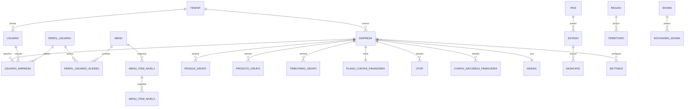

# EF 0_APLICATIVO ONBOARDING_E_EMPRESA V1

**Projeto:** Epros  
**Empresa:** Siser  
**Tipo de documento:** Especificacao Funcional definitiva  
**Versao:** V1  
**Modulo:** APLICATIVO  
**Submodulo:** ONBOARDING_E_EMPRESA  
**ID funcional:** APP-TEN-002  
**Status:** Pronto para validacao humana  
**Data:** 2026-06-06

## 1. Controle do documento

| Item | Conteudo |
|---|---|
| Responsavel pela elaboracao | Agente de analise e refinamento funcional |
| Responsavel pela validacao funcional | Siser |
| Responsavel pela validacao tecnica | Siser |
| Area dona do processo | Plataforma SaaS / Onboarding / Cadastros iniciais |
| Publico-alvo | Produto, negocio, implantacao, desenvolvimento, QA, suporte, financeiro, fiscal e operacao Siser |
| Fonte de verdade | Esta EF descreve o comportamento funcional esperado do Epros para cadastro inicial de tenant, empresa, usuario administrador, contexto operacional e configuracoes iniciais |

## 2. Objetivo funcional

O submodulo Onboarding e Empresa cria o ambiente inicial de um cliente no Epros, cadastrando tenant, primeira empresa, usuario administrador, contexto de acesso, cadastros estruturais minimos, configuracoes iniciais e vinculos necessarios para que o cliente consiga entrar no sistema e iniciar a operacao.

| Pergunta | Resposta |
|---|---|
| Para que o submodulo existe? | Para transformar uma contratacao ou cadastro inicial em um ambiente Epros operacional, com empresa, usuario administrador, grupos, parametros e acessos minimos. |
| Que problema de negocio resolve? | Evita ambientes incompletos, empresa sem grupos-base, usuario sem vinculo, cadastro sem plano, falta de configuracao fiscal inicial, falta de contexto de login e erros na primeira experiencia do cliente. |
| Qual resultado operacional deve produzir? | Ao concluir o onboarding, o cliente deve possuir tenant, primeira empresa, usuario administrador, vinculos de acesso, plano/base comercial, cadastros iniciais e configuracoes suficientes para autenticar e operar. |
| Quais areas dependem dele? | Identidade, Isolamento de Dados, Limites de Plano, Permissoes, Cadastros Base, Financeiro, Fiscal, Estoque, Vendas, Compras, Configuracao, Area do Cliente e Suporte. |

## 3. Escopo funcional

### 3.1 Dentro do escopo

| Capacidade | Descricao | Observacao |
|---|---|---|
| Registro publico de cliente/tenant | Receber dados iniciais de usuario, plano e empresa para iniciar cadastro do ambiente. | Campos minimos e obrigatorios precisam estar completos. |
| Cadastro transacional de tenant | Criar tenant com identificador unico e fronteira de dados. | Operacao deve ser atomica. |
| Cadastro da primeira empresa | Criar empresa operacional inicial do cliente com dados fiscais, contato, endereco, regime e parametros basicos. | Manutencao posterior pertence ao cadastro de empresas. |
| Criacao de grupos iniciais | Criar grupos-base de pessoas, produtos e tributacao associados a razao social. | Seeds pertencem ao onboarding; manutencao pertence aos modulos donos. |
| Criacao do plano financeiro inicial | Importar/criar plano de contas financeiro e configuracao de natureza financeira inicial. | Modelo de origem precisa ser governado pela Siser. |
| Criacao de CFOPs iniciais | Carregar lista padrao de CFOPs necessaria para operacao inicial. | Manutencao detalhada pertence ao modulo fiscal/cadastros. |
| Criacao de usuario administrador | Criar usuario administrador do tenant e vinculo com a primeira empresa. | Deve possuir acesso inicial suficiente para operar. |
| Vinculo usuario-empresa | Vincular usuario, empresa, perfil e indicador de administrador. | Campo EmpresaId e PerfilUsuarioId possuem validacoes. |
| Definicao de plano/base comercial | Associar plano comercial ao cadastro inicial quando informado. | Conflito entre plano da rota e plano fixo foi enviado a MC. |
| Registro em gestao comercial Siser | Registrar cliente/tenant no controle comercial da Siser quando aplicavel. | IDs fixos devem ser parametrizados. |
| Configuracoes iniciais de empresa | Manter nome, endereco, telefone, email, moeda, fuso, formato de data, logos e preferencias iniciais. | Parte fica em configuracao. |
| Configuracoes de idioma | Gerenciar catalogo de idiomas, idioma do usuario, dicionarios e selecao global. | Fronteira final com plataforma de traducao na MC. |
| Catalogos auxiliares de geografia | Consultar UF, municipio, pais, estado e cidade para cadastro inicial. | Manutencao completa pertence a Cadastros Base. |
| Armazem inicial | Permitir armazem/deposito como cadastro auxiliar para operacao inicial quando usado por estoque. | Manutencao completa pertence a Estoque/Cadastros. |
| Consulta de sessao e contexto | Retornar empresas autorizadas, token, tenant, limites, bloqueio e acessos. | Integra com Identidade e Limites. |
| Area publica e landing | Exibir area publica, planos, conteudo institucional e fluxo de aquisicao quando habilitado. | Conteudo CMS completo fica em modulo de sites/configuracao. |
| Notificacao de boas-vindas | Enviar notificacao para novo cliente e alerta interno quando configurado. | Templates e canais finais precisam governanca. |

### 3.2 Fora do escopo

| Item fora do escopo | Motivo | Destino correto |
|---|---|---|
| CRUD completo de empresa operacional | Este submodulo cria a primeira empresa e parametros iniciais; manutencao completa e outro dominio. | CADASTROS_BASE / EMPRESAS |
| CRUD completo de usuarios, perfis e menus | Onboarding cria usuario admin e vinculos iniciais; gestao completa pertence a identidade/permissoes. | IDENTIDADE_E_CONTEXTO_TENANT; USUARIOS_E_PAPEIS; PERMISSOES_DE_MENU |
| Regra comercial completa de planos, faturas e bloqueios | Onboarding consome plano e registra chamada; regras detalhadas ficam em limites/cobranca. | LIMITES_DE_PLANO; PEDIDOS_E_COBRANCA_SAAS |
| Manutencao completa de plano de contas e natureza financeira | Onboarding importa seed inicial. | FINANCEIRO |
| Manutencao completa de CFOP, NFe, NFCe e parametros fiscais | Onboarding cria parametros iniciais de emissao. | CADASTROS_BASE / FISCAL quando definido |
| Gestao completa de pais, UF, municipio, cidade, regiao e territorio | Onboarding consulta e pode semear; manutencao pertence ao catalogo. | CADASTROS_BASE |
| Gestao completa de armazens e transportadoras | Onboarding pode inicializar/consultar, mas operacao pertence a estoque/logistica. | ESTOQUE; CADASTROS_BASE |
| Configuracao tecnica de armazenamento, e-mail e provedores | Onboarding referencia settings, mas runtime tecnico pertence a plataforma/configuracao. | PLATAFORMA_COMPARTILHADA / CONFIGURACAO |

## 4. Glossario e conceitos funcionais

| Termo | Definicao funcional | Observacoes |
|---|---|---|
| Tenant | Fronteira logica principal do ambiente do cliente no Epros. | Todo cadastro inicial deve nascer tenantizado. |
| Primeira empresa | Empresa operacional criada no onboarding para permitir uso inicial. | Pode ser pessoa juridica ou pessoa fisica quando suportado. |
| Empresa operacional | Empresa usada pelo cliente dentro do Epros. | Nao confundir com empresa comercial Siser. |
| Usuario administrador | Primeiro usuario do tenant, com permissao administrativa inicial. | Deve estar vinculado a primeira empresa. |
| Grupo-base | Agrupamento inicial criado para pessoas, produtos ou tributacao. | Nome derivado da razao social quando informado. |
| Plano financeiro inicial | Plano de contas financeiro criado/importado no nascimento do tenant. | Modelo deve ser governado pela Siser. |
| Natureza financeira inicial | Configuracoes iniciais de entrada/saida vinculadas ao plano financeiro. | Importadas por modelo. |
| CFOP inicial | Codigo fiscal padrao criado para viabilizar operacao inicial. | Lista identificada no material. |
| Contexto de acesso | Conjunto de tenant, empresa, usuario, permissao, menu, plano e bloqueios usado apos login. | Retornado por sessao e selecao de empresa. |
| Configuracao de empresa | Dados como nome, endereco, telefone, email, moeda, fuso, formato de data, logos e preferencias. | Parte pode ficar em chave-valor. |
| Idioma habilitado | Idioma disponivel para interface e traducoes. | Ingles nao deve ser excluido/desabilitado conforme material. |
| Area publica | Paginas publicas de apresentacao, planos, conteudo e aquisicao. | Exibicao pode ser ligada/desligada. |
| Bloqueio operacional | Indicador de que o cliente nao pode operar por pendencia comercial/financeira. | Regra detalhada em Limites de Plano. |

## 5. Atores, papeis e responsabilidades

| Ator/Papel | Responsabilidade | Permissoes esperadas | Restricoes |
|---|---|---|---|
| Visitante | Acessar area publica, planos e iniciar registro. | Consultar conteudo publico e iniciar cadastro quando habilitado. | Nao pode acessar dados de tenant. |
| Cliente SaaS | Informar dados de cadastro, empresa, usuario e plano. | Criar ambiente inicial. | Deve fornecer campos obrigatorios. |
| Usuario administrador do cliente | Primeiro usuario criado no ambiente. | Acesso administrativo inicial na primeira empresa. | Restrito ao proprio tenant/empresa. |
| Administrador Siser | Configurar modelos, parametros, planos, seeds e acompanhar cadastros. | Governar onboarding, parametrizacoes e excecoes. | Deve auditar alteracoes sensiveis. |
| Sistema | Criar tenant, empresa, grupos, usuario, plano financeiro, CFOP, natureza, contexto e notificacoes. | Execucao automatica transacional. | Nao pode deixar ambiente parcial sem tratamento. |
| Integracao comercial Siser | Registrar cliente em controle comercial e retornar limites/bloqueios. | Acesso por contrato autorizado. | Deve ter parametros e token governados. |
| Suporte/Implantacao | Validar cadastros iniciais e corrigir pendencias. | Consultar status e reprocessar quando permitido. | Reprocessamento deve ser auditado. |

## 6. Visao operacional do submodulo

1. O visitante ou operador Siser inicia cadastro informando plano, dados do usuario e dados da empresa.
2. O Epros valida dados obrigatorios, duplicidade de documento e consistencia minima de senha/confirmacao quando aplicavel.
3. O Epros gera identificador do tenant e inicia transacao de cadastro.
4. O Epros cria grupos-base de pessoas, produtos e tributacao.
5. O Epros cria a primeira empresa com documento, razao social, nome fantasia, regime, endereco, contatos, parametros fiscais e logo quando informados.
6. O Epros importa ou cria plano de contas financeiro inicial.
7. O Epros cria configuracoes de natureza financeira vinculadas ao plano financeiro.
8. O Epros carrega CFOPs padrao para permitir operacao fiscal inicial.
9. O Epros cria o usuario administrador, senha inicial conforme politica aprovada, e vincula usuario a empresa com indicador de administrador.
10. O Epros associa plano comercial, limites e registro comercial Siser quando aplicavel.
11. O Epros envia notificacao de boas-vindas ao cliente e aviso interno quando configurado.
12. O cliente acessa login; o Epros retorna token/sessao, empresas autorizadas, limites e indicador de bloqueio.
13. Ao selecionar empresa, o Epros retorna contexto completo com menus e permissoes.
14. Configuracoes de empresa, moeda, fuso, data, idioma, tema e logos podem ser ajustadas conforme permissao.

## 7. Capacidades funcionais

### 7.1 Registro inicial de tenant

| Item | Especificacao |
|---|---|
| Objetivo | Criar ambiente inicial do cliente no Epros. |
| Acionamento | Registro publico, contratacao por plano ou acao do backoffice Siser. |
| Pre-condicoes | Plano/fluxo habilitado e dados obrigatorios preenchidos. |
| Dados de entrada | Razao social, CNPJ ou CPF, plano, endereco, contato, usuario, login, senha, email e dados fiscais quando informados. |
| Processamento | Validar entrada, gerar TenantId, iniciar transacao e executar seeds obrigatorios. |
| Resultado esperado | Tenant criado com primeira empresa e usuario administrador. |
| Pos-condicoes | Cliente pode autenticar e selecionar empresa. |
| Excecoes | Duplicidade de CNPJ/CPF, campos obrigatorios ausentes ou falha de seed devem bloquear ou reverter. |
| Auditoria | Registrar tentativa, sucesso, falha, usuario/processo e identificador do tenant. |

### 7.2 Criacao da primeira empresa

| Item | Especificacao |
|---|---|
| Objetivo | Criar empresa operacional inicial vinculada ao tenant. |
| Acionamento | Cadastro do tenant. |
| Pre-condicoes | TenantId gerado e grupos-base criados ou em criacao transacional. |
| Dados de entrada | RazaoSocial, NomeFantasia, CNPJ, CPF, regime de apuracao, regime tributario, inscricoes, CNAE, logo, endereco, contatos, parametros fiscais e indicadores. |
| Processamento | Validar documento unico, preencher grupos, parametros e endereco, e persistir empresa tenantizada. |
| Resultado esperado | Empresa criada e apta a ser selecionada no login. |
| Pos-condicoes | Usuario administrador e vinculado a empresa. |
| Excecoes | CNPJ/CPF ja cadastrado bloqueia cadastro. |
| Auditoria | Registrar criacao da empresa e parametros iniciais. |

### 7.3 Seed estrutural inicial

| Item | Especificacao |
|---|---|
| Objetivo | Criar dados minimos para operacao inicial do tenant. |
| Acionamento | Dentro do cadastro transacional. |
| Pre-condicoes | Tenant e empresa em criacao. |
| Dados de entrada | Razao social, modelos oficiais e parametros padrao. |
| Processamento | Criar PessoaGrupo, ProdutoGrupo, TributarioGrupo, plano financeiro, naturezas financeiras e CFOPs padrao. |
| Resultado esperado | Ambiente possui cadastros-base minimos. |
| Pos-condicoes | Modulos de cadastro, financeiro e fiscal podem completar manutencao. |
| Excecoes | Falha em seed obrigatorio deve impedir ambiente parcial. |
| Auditoria | Registrar versao do modelo usado e itens criados. |

### 7.4 Criacao de usuario administrador

| Item | Especificacao |
|---|---|
| Objetivo | Garantir primeiro acesso administrativo do cliente. |
| Acionamento | Cadastro do tenant. |
| Pre-condicoes | Empresa inicial criada. |
| Dados de entrada | Nome, login, email, senha, ativo e vinculo empresa. |
| Processamento | Criar usuario ativo, aplicar politica de senha, criar usuario-empresa com IsAdmin=true. |
| Resultado esperado | Usuario administrador consegue autenticar e acessar a primeira empresa. |
| Pos-condicoes | Menus e permissoes iniciais ficam disponiveis. |
| Excecoes | Email duplicado ou senha invalida bloqueiam criacao. |
| Auditoria | Registrar criacao do usuario administrador. |

### 7.5 Configuracao inicial de empresa

| Item | Especificacao |
|---|---|
| Objetivo | Definir dados institucionais e preferencias iniciais da empresa. |
| Acionamento | Setup inicial ou tela de configuracao. |
| Pre-condicoes | Empresa existente e permissao administrativa. |
| Dados de entrada | Nome, endereco, telefone, email, moeda, fuso, formato de data, site, logo, tema, rodape, impostos e preferencias. |
| Processamento | Salvar configuracoes, atualizar cache quando existir e refletir em documentos/menus. |
| Resultado esperado | Empresa exibe dados e preferencias corretas. |
| Pos-condicoes | Documentos, relatorios e interface usam configuracao atual. |
| Excecoes | Moeda inativa ou ausente deve ser tratada. |
| Auditoria | Registrar alteracoes de configuracao. |

### 7.6 Idioma e localizacao

| Item | Especificacao |
|---|---|
| Objetivo | Permitir selecao e gestao de idiomas disponiveis no Epros. |
| Acionamento | Configuracao de idioma, seletor global ou carregamento da interface. |
| Pre-condicoes | Catalogo de idiomas existente. |
| Dados de entrada | Codigo do idioma, nome, pais, status habilitado e traducoes. |
| Processamento | Validar idioma, impedir duplicidade, proteger idioma base, salvar preferencia do usuario e entregar dicionario da interface. |
| Resultado esperado | Usuario ve interface no idioma permitido. |
| Pos-condicoes | Preferencia persiste no usuario ou sessao conforme regra. |
| Excecoes | Idioma base nao pode ser excluido ou desabilitado. |
| Auditoria | Registrar criacao, alteracao, exclusao e alternancia de status de idioma. |

### 7.7 Consulta de contexto de sessao

| Item | Especificacao |
|---|---|
| Objetivo | Retornar dados necessarios para continuar sessao e selecionar empresa. |
| Acionamento | Login ou restauracao de sessao. |
| Pre-condicoes | Usuario autenticado e ativo. |
| Dados de entrada | Email/senha ou token de sessao. |
| Processamento | Validar usuario, buscar empresas autorizadas, limites de cadastro, bloqueio e tenant. |
| Resultado esperado | Sessao retorna token, empresas, login, tenantId, qtdeCadastroEmpresa, qtdeCadastroUsuario e block. |
| Pos-condicoes | Usuario seleciona empresa ou segue para tela apropriada. |
| Excecoes | Usuario sem empresa ou bloqueado recebe retorno funcional. |
| Auditoria | Registrar login e empresa selecionada quando aplicavel. |

### 7.8 Selecionar empresa e montar acessos

| Item | Especificacao |
|---|---|
| Objetivo | Transformar sessao basica em contexto operacional completo. |
| Acionamento | Usuario escolhe empresa. |
| Pre-condicoes | Empresa pertence ao usuario. |
| Dados de entrada | EmpresaId, usuario, tenant e perfil. |
| Processamento | Validar acesso a empresa, gerar token completo, carregar menu, permissoes, grupos e parametros da empresa. |
| Resultado esperado | Usuario recebe contexto completo para operar. |
| Pos-condicoes | Menus e acoes respeitam perfil e IsAdmin. |
| Excecoes | Empresa nao autorizada retorna erro funcional. |
| Auditoria | Registrar selecao de empresa. |

## 8. Regras de negocio

| Regra | Descricao | Condicao | Resultado | Severidade | Observacoes |
|---|---|---|---|---|---|
| REG-001 | Cadastro de tenant deve ser transacional. | Ao criar ambiente inicial. | Sucesso cria todos os seeds obrigatorios; falha deve impedir ambiente parcial. | Bloqueante | Falha de registro comercial nao pode ficar silenciosa sem tratamento aprovado. |
| REG-002 | TenantId deve ser gerado antes de criar registros tenantizados. | Cadastro inicial. | Todos os registros iniciais recebem fronteira correta. | Bloqueante | Identificador deve ser unico. |
| REG-003 | CNPJ ja cadastrado deve bloquear novo tenant/empresa. | Cadastro com CNPJ. | Cadastro rejeitado. | Bloqueante | Consulta deve considerar registros relevantes. |
| REG-004 | CPF ja cadastrado deve bloquear novo tenant/empresa quando cadastro PF for usado. | Cadastro com CPF. | Cadastro rejeitado. | Bloqueante | |
| REG-005 | Primeira empresa deve possuir razao social ou nome equivalente. | Cadastro de empresa. | Cadastro sem identificacao e bloqueado. | Bloqueante | Nome obrigatorio sem campo em uma tela foi para MC. |
| REG-006 | Cadastro inicial deve criar grupos-base de pessoa, produto e tributacao. | Cadastro concluido. | Grupos vinculados a empresa/tenant ficam disponiveis. | Bloqueante | Nome derivado da razao social. |
| REG-007 | Cadastro inicial deve criar ou importar plano financeiro. | Cadastro concluido. | Empresa possui PlanoContasFinanceiroId. | Bloqueante | Modelo oficial precisa governanca. |
| REG-008 | Cadastro inicial deve criar configuracoes de natureza financeira. | Cadastro concluido. | Naturezas de pagamento/recebimento ficam vinculadas. | Bloqueante | Modelo oficial precisa governanca. |
| REG-009 | Cadastro inicial deve carregar CFOPs padrao. | Cadastro concluido. | CFOPs iniciais ficam disponiveis. | Bloqueante | Lista preservada na EF. |
| REG-010 | Primeira empresa deve nascer com parametros fiscais de homologacao quando aplicavel. | Cadastro fiscal inicial. | Parametros de NFe/NFCe ficam em ambiente seguro. | Bloqueante | Producao exige decisao posterior. |
| REG-011 | Usuario administrador deve ser criado ativo. | Cadastro concluido. | Usuario consegue autenticar. | Bloqueante | Senha deve seguir politica aprovada. |
| REG-012 | Usuario administrador deve estar vinculado a primeira empresa. | Cadastro concluido. | Empresa aparece no login. | Bloqueante | IsAdmin=true no vinculo inicial. |
| REG-013 | UsuarioEmpresa exige EmpresaId maior que zero. | Criacao/alteracao de vinculo. | Vinculo invalido e bloqueado. | Bloqueante | Campo preservado. |
| REG-014 | UsuarioEmpresa exige PerfilUsuarioId maior que zero quando o usuario nao for administrador. | Criacao/alteracao de vinculo. | Vinculo sem perfil e bloqueado. | Bloqueante | Admin pode dispensar perfil conforme regra de identidade. |
| REG-015 | PerfilUsuario deve possuir descricao. | Cadastro de perfil. | Perfil sem descricao e bloqueado. | Bloqueante | Mensagem incorreta de origem nao foi preservada como regra. |
| REG-016 | PerfilUsuarioAcesso exige MenuId maior que zero. | Cadastro de acesso. | Acesso invalido e bloqueado. | Bloqueante | |
| REG-017 | PerfilUsuarioAcesso exige MenuItemNivel1Id maior que zero quando aplicavel. | Cadastro de acesso. | Acesso invalido e bloqueado. | Bloqueante | |
| REG-018 | Menu deve ser entregue em arvore ordenada. | Montagem de contexto. | Interface recebe menus, itens nivel 1 e itens nivel 2. | Bloqueante | Ordenacao preservada por campo Ordem. |
| REG-019 | Usuario administrador tem permissao ampla dentro do tenant/empresa. | Verificacao de permissao. | Permissao concedida quando IsAdmin=true. | Bloqueante | Respeita fronteira de dados. |
| REG-020 | Usuario comum depende de perfil e acessos. | Verificacao de permissao. | Ver, editar e excluir dependem do perfil. | Bloqueante | |
| REG-021 | Cadastro por plano deve usar o plano escolhido pelo usuario quando validado. | Registro publico por plano. | Plano correto e associado. | Decisao | Material traz conflito de plano fixo; MC. |
| REG-022 | Registro comercial Siser deve usar parametros governados. | Ao registrar cliente na operacao Siser. | Empresa comercial, revenda, vendedor e plano nao ficam fixos. | Bloqueante | Parametros pendentes na MC. |
| REG-023 | Fatura/bloqueio comercial pode impedir uso operacional. | Login ou middleware de acesso. | Cliente bloqueado e direcionado a regularizacao. | Bloqueante | Regra detalhada em Limites de Plano. |
| REG-024 | CompanyName/razao social de configuracao administrativa e obrigatoria quando essa entidade for usada. | Configuracao de empresa. | Cadastro sem nome e bloqueado. | Bloqueante | Tamanho 250 quando informado. |
| REG-025 | Moeda da empresa deve referenciar moeda ativa quando informada. | Configuracao de empresa. | Moeda inativa nao deve ser selecionavel. | Bloqueante | CurrencyId pode estar nulo em uma estrutura; MC. |
| REG-026 | Percentual de imposto da empresa e obrigatorio quando esse modelo tributario for usado. | Configuracao de empresa. | Valor ausente e bloqueado. | Bloqueante | Campo VatPercentage. |
| REG-027 | Posicao da moeda deve ser esquerda ou direita. | Configuracao de moeda. | Valor fora do dominio e bloqueado. | Bloqueante | Left=1, Right=2 preservado. |
| REG-028 | Tipo de imposto deve ser inclusivo ou exclusivo quando esse modelo for usado. | Configuracao de empresa. | Tipo invalido e bloqueado. | Bloqueante | Inclusive=1, Exclusive=2. |
| REG-029 | Identificador fiscal Vat deve ser unico quando esse campo for usado. | Cadastro de empresa administrativa. | Duplicidade bloqueia salvamento. | Bloqueante | Campo distinto de CNPJ/CPF final se a Siser assim definir. |
| REG-030 | Logos e favicon devem aceitar armazenamento com historico quando suportado. | Upload de imagem. | Imagem fica disponivel para interface/documentos. | Informativa | Tamanho e formato final na MC. |
| REG-031 | Pais deve possuir nome obrigatorio. | Cadastro de pais. | Cadastro sem nome e bloqueado. | Bloqueante | Tamanho 250 quando informado. |
| REG-032 | Estado deve possuir pais obrigatorio. | Cadastro de estado. | Estado sem pais e bloqueado. | Bloqueante | |
| REG-033 | Cidade deve possuir pais e estado obrigatorios. | Cadastro de cidade. | Cidade sem hierarquia e bloqueada. | Bloqueante | |
| REG-034 | Armazem deve possuir nome obrigatorio. | Cadastro de armazem. | Armazem sem nome e bloqueado. | Bloqueante | Endereco pode ser opcional no material. |
| REG-035 | Cadastros geograficos e armazem devem filtrar registros ativos em seletores. | Escolha em formulario. | Apenas registros ativos aparecem. | Informativa | |
| REG-036 | Ingles nao pode ser excluido nem desabilitado como idioma base. | Gestao de idiomas. | Operacao bloqueada. | Bloqueante | |
| REG-037 | Codigo de idioma deve ser unico. | Criacao de idioma. | Duplicidade rejeitada. | Bloqueante | Maximo 10 caracteres quando informado. |
| REG-038 | Codigo de pais do idioma deve possuir 2 caracteres. | Criacao de idioma. | Valor invalido rejeitado. | Bloqueante | |
| REG-039 | Seletor global deve exibir apenas idiomas habilitados. | Renderizacao da interface. | Idiomas desabilitados ficam ocultos. | Informativa | |
| REG-040 | Preferencia de idioma deve persistir no usuario ou sessao conforme politica. | Troca de idioma. | Proxima interface usa idioma escolhido. | Informativa | |
| REG-041 | Configuracoes por owner/tenant devem ser isoladas. | Leitura/gravação de settings. | Um cliente nao sobrescreve configuracao de outro. | Bloqueante | Campo created_by identificado. |
| REG-042 | Alteracao de configuracao deve invalidar cache do escopo afetado. | Salvar setting. | Leituras posteriores usam valor atualizado. | Bloqueante | |
| REG-043 | Consentimento de cookies deve ser persistido em estrutura transacional. | Captura de consentimento. | Consentimento fica auditavel. | Decisao | Material aponta persistencia fragil; MC. |
| REG-044 | Area publica pode ser desabilitada. | Acesso publico. | Quando desabilitada, exibe bloqueio/nao encontrado conforme regra final. | Informativa | |
| REG-045 | Notificacao de boas-vindas deve usar dados do negocio/cliente. | Cadastro concluido. | Cliente recebe comunicacao inicial quando habilitada. | Informativa | Templates na MC. |

## 9. Parametros de configuracao

| Parametro | Finalidade | Tipo/formato | Valor padrao | Obrigatorio | Nivel | Quem pode alterar | Impacto |
|---|---|---|---|---|---|---|---|
| Plano padrao de onboarding | Plano usado quando cadastro nao trouxer plano valido. | Identificador | Nao informado no material | Sim | Global/Siser | Administrador Siser | Evita plano fixo indevido. |
| Empresa comercial Siser padrao | Empresa da operacao Siser usada no registro comercial. | Identificador | Nao informado no material | Condicional | Global/Siser | Administrador Siser | Integra registro comercial. |
| Revenda padrao | Revenda usada em cadastro publico quando nao houver canal informado. | Identificador | Nao informado no material | Condicional | Global/Siser | Administrador Siser | Integra com comercial. |
| Vendedor padrao | Vendedor usado em cadastro publico quando nao houver canal informado. | Identificador | Nao informado no material | Condicional | Global/Siser | Administrador Siser | Integra com comercial. |
| Modelo de plano financeiro | Fonte oficial para seed de plano financeiro. | Arquivo/modelo governado | Nao informado no material | Sim | Global/Siser | Administrador Siser | Cria plano inicial. |
| Modelo de natureza financeira | Fonte oficial para seed de naturezas. | Arquivo/modelo governado | Nao informado no material | Sim | Global/Siser | Administrador Siser | Cria natureza inicial. |
| Lista de CFOPs padrao | Lista oficial carregada no onboarding. | Lista de codigos | 1102, 1202, 1411, 5101, 5102, 5405, 6101, 6102, 6108, 6404 | Sim | Global/Siser | Administrador Siser | Fiscal inicial. |
| Fuso horario padrao | Fuso inicial da empresa. | Identificador | 1 quando informado | Sim | Global/Siser/Empresa | Administrador | Datas e exibicoes. |
| Moeda padrao | Moeda inicial da empresa. | Identificador | 1 quando informado | Sim | Global/Siser/Empresa | Administrador | Valores e documentos. |
| Formato de data padrao | Mascara de data inicial. | Dominio | MM-DD-YYYY; DD-MM-YYYY; YYYY-MM-DD | Sim | Empresa | Administrador | Interface e relatorios. |
| Idioma padrao | Idioma inicial da interface. | Codigo | Nao informado no material | Sim | Global/Usuario | Administrador/Usuario | Localizacao. |
| Area publica habilitada | Liga/desliga area publica. | Booleano | Nao informado no material | Sim | Global/Siser | Administrador Siser | Aquisição e marketing. |
| Notificacao de boas-vindas | Liga/desliga email de boas-vindas. | Booleano | Nao informado no material | Nao | Global/Siser | Administrador Siser | Comunicacao com cliente. |
| Captcha no cadastro publico | Protege cadastro publico. | Booleano/configuracao | Nao informado no material | Condicional | Global/Siser | Administrador Siser | Seguranca de signup. |

## 10. Modelo de dados funcional e implantavel

### 10.1 Visao geral do modelo

O modelo do onboarding combina entidades de nascimento do tenant, empresa inicial, usuario administrador, vinculo usuario-empresa, permissoes iniciais, configuracoes, catalogos auxiliares e contratos de contexto. A EF preserva as estruturas de dados necessarias para implantacao inicial, mas a manutencao completa de algumas entidades pertence aos modulos donos.

| Grupo de dados | Entidades/tabelas | Papel funcional | Observacoes |
|---|---|---|---|
| Nascimento do tenant | tenant, RegistroTenant, RegistroViewModel | Criar fronteira do cliente e receber dados iniciais. | Campos finais de tenant precisam consolidacao com Identidade. |
| Empresa inicial | Empresa, Company, Companies | Criar/parametrizar empresa operacional e administrativa. | Ha mais de uma estrutura de empresa; consolidacao na MC. |
| Seed operacional | PessoaGrupo, ProdutoGrupo, TributarioGrupo, PlanoDeContasFinanceiro, ConfiguracaoCodigoNaturezaFinanceira, Cfop | Criar base minima para operar. | Detalhe completo nos modulos donos. |
| Acesso inicial | usuario, usuario_empresa, perfil_usuario, perfil_usuario_acesso, menu, menu_item_nivel1, menu_item_nivel2 | Criar admin e contexto de acesso. | Gestao completa fica em identidade/permissoes. |
| Configuracoes | settings, configuracao de empresa, preferencias de usuario, consentimento de cookies | Guardar preferencias, branding, moeda, fuso, idioma, tema e parametros. | Modelo final de configuracao precisa padronizacao. |
| Idiomas | idioma_catalogo, dicionario_idioma, traducao_pacote, preferencia_idioma_usuario | Gerenciar idiomas e traducoes. | Fronteira com plataforma de traducao. |
| Geografia e auxiliares | pais, estado, municipio/cidade, regiao, territorio, armazem, transportadora, moeda | Apoiar cadastro inicial e seletores. | Manutencao completa em Cadastros Base/Estoque. |
| Contratos de contexto | AuthResponse, SessionReturn, AcessosResponse, EmpresaContexto, CnpjOnlineResponse | Retornar sessao, empresa, menu, limites e dados publicos. | Estruturas devem ser saneadas e versionadas. |

### 10.2 Entidades e tabelas

| Entidade funcional | Tabela/estrutura | Tipo | Finalidade | Chave primaria | Observacoes de implantacao |
|---|---|---|---|---|---|
| Tenant | tenant | Mestre | Fronteira do ambiente do cliente. | TenantId/Id | Consolidar com modelo de Identidade. |
| Registro de tenant | RegistroTenant / RegistroViewModel | Contrato | Entrada do cadastro inicial. | Nao se aplica | Deve conter todos os campos obrigatorios da UI e do dominio. |
| Empresa operacional | Empresa | Mestre | Primeira empresa do cliente e contexto operacional. | Id | Campos preservados em contrato de empresa. |
| Empresa configuracao | Company / Companies | Mestre/Configuracao | Configuracoes administrativas, moeda, fuso, logos e impostos. | CompanyId ou Id | Estruturas devem ser unificadas pela Siser. |
| Ano financeiro | FinancialYear | Auxiliar | Criar periodo financeiro inicial. | FinancialYearId | FromDate = StartDate; ToDate +365 dias no material. |
| Plano de uso inicial | PlanUpgrade | Auxiliar | Associar plano ativo ao tenant. | Nao informado no material | Plano fixo conflita com plano escolhido; MC. |
| Vinculo usuario-empresa | UserCompany / usuario_empresa | Relacionamento | Relacionar usuario, empresa, perfil e admin. | UserCompId ou Id | Modelo final deve ser unico. |
| Usuario | usuario | Mestre | Usuario administrador inicial e usuarios posteriores. | Id | Dicionario detalhado tambem em identidade. |
| Perfil de usuario | perfil_usuario | Mestre | Perfil de acesso. | Id | Descricao varchar(100) em material complementar. |
| Acesso do perfil | perfil_usuario_acesso / perfil_acesso | Relacionamento | Permissoes ver/editar/excluir por menu. | Id | Duplicidade de estrutura na MC. |
| Menu | menu | Mestre | Agrupador de menu. | Id | Descricao, Icon, To, Ordem. |
| Menu item nivel 1 | menu_item_nivel1 | Mestre | Item intermediario de menu. | Id | FK MenuId. |
| Menu item nivel 2 | menu_item_nivel2 | Mestre | Item final de menu. | Id | FK MenuItemNivel1Id. |
| Configuracao chave-valor | settings | Auxiliar | Guardar configuracoes por chave, valor, publico e owner. | Nao informado no material | Isolamento por created_by. |
| Moeda | Currency / Currencies | Mestre | Catalogo de moeda. | CurrencyId/Id | Nome e simbolo obrigatorios quando informado. |
| Pais | Country / Countries / Pais | Mestre | Catalogo de pais. | Id/codigo | Nome obrigatorio. |
| Estado/UF | State / States / UF | Mestre | Unidade federativa/estado. | Id | Relaciona com pais. |
| Municipio/Cidade | Municipio / City / Cities | Mestre | Municipio/cidade para endereco. | Id/codigoIbge | Relaciona com estado/UF e pais. |
| Regiao | Regions | Mestre | Regiao comercial/territorial. | Id | Pai de territorio. |
| Territorio | Territories | Mestre | Territorio vinculado a regiao. | Id | RegionId obrigatorio. |
| Armazem | Warehouses | Mestre | Deposito/armazem operacional. | Id | Consumido por estoque; endereco opcional no material. |
| Transportadora | Shippers | Mestre | Transportadora/cadastro auxiliar. | Id | Sem FK consumidora identificada no material. |
| Idioma | language_catalog | Mestre/Arquivo governado | Catalogo de idiomas. | code | Code, name, countryCode, enabled. |
| Dicionario de idioma | language_dictionary | Auxiliar | Traducoes por chave/valor. | locale+key | Estrutura final de persistencia na MC. |
| Newsletter | newsletter_subscribers | Movimento | Assinatura publica de newsletter. | Nao informado no material | Relacao com area publica. |
| Add-on publico | add_ons | Mestre | Modulos adicionais exibidos/publicados. | Nao informado no material | Tambem usado para traducao por pacote. |

### 10.3 Relacionamentos, cardinalidade e dependencia

| Origem | Relacionamento | Destino | Cardinalidade | Obrigatorio | Regra de integridade |
|---|---|---|---|---|---|
| Tenant | possui | Empresa operacional | 1:N | Sim | Primeira empresa criada no onboarding. |
| Tenant | possui | Usuario | 1:N | Sim | Usuario admin inicial. |
| Empresa operacional | possui | PessoaGrupo | 1:N | Sim | Seed inicial. |
| Empresa operacional | possui | ProdutoGrupo | 1:N | Sim | Seed inicial. |
| Empresa operacional | possui | TributarioGrupo | 1:N | Sim | Seed inicial. |
| Empresa operacional | referencia | PlanoDeContasFinanceiro | N:1 | Sim | Criado/importado no onboarding. |
| Empresa operacional | possui | ConfiguracaoCodigoNaturezaFinanceira | 1:N | Sim | Criada a partir de modelo. |
| Empresa operacional | possui | Cfop | 1:N | Sim | Lista padrao carregada. |
| Usuario | vincula | Empresa operacional | N:N | Sim | Via usuario_empresa. |
| UsuarioEmpresa | referencia | PerfilUsuario | N:1 | Condicional | Obrigatorio para nao-admin. |
| PerfilUsuario | possui | PerfilUsuarioAcesso | 1:N | Condicional | Acessos por menu. |
| PerfilUsuarioAcesso | referencia | Menu | N:1 | Sim | MenuId obrigatorio. |
| Menu | possui | MenuItemNivel1 | 1:N | Condicional | Arvore de menu. |
| MenuItemNivel1 | possui | MenuItemNivel2 | 1:N | Condicional | Arvore de menu. |
| Company/Empresa configuracao | referencia | Moeda | N:1 | Condicional | Moeda ativa quando informada. |
| Estado/UF | pertence a | Pais | N:1 | Sim | CountryId obrigatorio em uma estrutura. |
| Cidade/Municipio | pertence a | Estado/UF | N:1 | Sim | StateId/EstadoId obrigatorio. |
| Territorio | pertence a | Regiao | N:1 | Sim | RegionId obrigatorio. |
| Armazem | referencia | Pais/Estado/Cidade | N:1 | Nao | Endereco opcional no material. |
| Usuario | possui | Preferencia de idioma | 1:1 | Condicional | Campo lang identificado. |
| Add-on | participa | Dicionario de idioma | 1:N | Condicional | Traducoes por pacote habilitado. |

### 10.4 Chaves, unicidade, indices e constraints funcionais

| Entidade/tabela | Tipo de restricao | Campo(s) | Regra | Comportamento esperado |
|---|---|---|---|---|
| Tenant | Unico | TenantId | Identificador unico do ambiente. | Bloquear duplicidade. |
| Empresa operacional | Unico funcional | CNPJ ou CPF por tenant/base | Documento ja cadastrado bloqueia. | Bloquear cadastro duplicado. |
| Company/Companies | Unico | Vat | Identificador fiscal unico quando usado. | Bloquear duplicidade. |
| usuario | Unico funcional | Email/Login | Email duplicado deve bloquear cadastro. | Bloquear duplicidade. |
| usuario_empresa | Constraint | EmpresaId | Deve ser maior que zero. | Bloquear vinculo invalido. |
| usuario_empresa | Constraint | PerfilUsuarioId | Deve ser maior que zero quando nao-admin. | Bloquear vinculo invalido. |
| perfil_usuario | Constraint | Descricao | Deve ser informada. | Bloquear perfil sem descricao. |
| perfil_usuario_acesso | FK/Constraint | MenuId | Deve ser maior que zero. | Bloquear acesso invalido. |
| perfil_usuario_acesso | FK/Constraint | MenuItemNivel1Id | Deve ser maior que zero quando aplicavel. | Bloquear acesso invalido. |
| menu/menu itens | Ordenacao | Ordem | Arvore deve ser exibida ordenada. | Ordenar menu. |
| idioma | Unico | code | Codigo duplicado bloqueia. | Rejeitar criacao. |
| idioma | Check | countryCode | Deve possuir 2 caracteres quando informado. | Rejeitar valor invalido. |
| idioma | Constraint funcional | code base | Idioma base nao pode ser excluido/desabilitado. | Bloquear. |
| moeda | FK funcional | CurrencyId | Empresa deve referenciar moeda ativa quando informada. | Bloquear/alertar moeda inativa. |
| estado | FK | CountryId | Estado exige pais. | Bloquear sem pais. |
| cidade | FK | CountryId, StateId | Cidade exige pais e estado. | Bloquear sem hierarquia. |
| territorio | FK | RegionId | Territorio exige regiao. | Bloquear sem regiao. |
| armazem | Constraint | Name | Nome obrigatorio. | Bloquear sem nome. |
| settings | Unico funcional | key + owner | Configuracao deve ser segregada por dono. | Evitar sobrescrita cross-tenant. |

### 10.5 Regras de persistencia, exclusao e historico

| Entidade/tabela | Criacao | Alteracao | Exclusao/inativacao | Historico/auditoria | Retencao |
|---|---|---|---|---|---|
| Tenant | Criado no onboarding. | Alteracao governada pela Siser. | Nao informado no material. | Registrar criacao/falha. | Nao informado no material. |
| Empresa operacional | Criada na transacao de onboarding. | Manutencao no modulo dono. | Nao informado no material. | Auditoria de criacao e alteracoes. | Nao informado no material. |
| Company/Companies | Criada/alterada em configuracao. | Permissao administrativa. | Soft delete/undelete identificado. | InsertDate, InsertUserId, DeleteDate, IsActive quando suportado. | Nao informado no material. |
| Usuario | Criado ativo no onboarding. | Manutencao por identidade. | Soft delete identificado. | Auditoria de usuario. | Nao informado no material. |
| UsuarioEmpresa | Criado com empresa e admin/perfil. | Sincronizar vinculos. | Remover vinculos excluidos conforme regra de identidade. | Auditoria nao detalhada. | Nao informado no material. |
| Perfil/Acesso/Menu | Seeds ou manutencao de permissao. | Alteracoes atualizam contexto. | Soft delete para perfil/acessos identificado. | Auditoria nao detalhada. | Nao informado no material. |
| Plano financeiro/natureza/CFOP | Criados por modelo no onboarding. | Modulos donos mantem. | Modulos donos definem. | Registrar versao do seed. | Nao informado no material. |
| Settings | Criado/alterado por owner. | Invalidar cache. | Nao informado no material. | Auditoria recomendada. | Nao informado no material. |
| Idioma/dicionario | Criar com validacao. | Atualizar traducoes. | Excluir idioma exceto idioma base. | Registrar alteracoes. | Nao informado no material. |
| Geografia | Criada/alterada por cadastros. | Filtrar ativos. | Soft delete identificado em algumas estruturas. | Auditoria em LoggingRow quando suportado. | Nao informado no material. |
| Armazem/Transportadora | Criada/alterada por cadastros. | Filtrar ativos. | Soft delete quando suportado. | Auditoria quando suportado. | Nao informado no material. |

### 10.6 Diagrama logico funcional

### 10.7 Lacunas de modelo de dados

| Lacuna | Entidade/tabela afetada | Impacto | Encaminhamento para MC |
|---|---|---|---|
| Mais de uma estrutura de empresa aparece no material. | Empresa, Company, Companies | Risco de duplicar empresa operacional e configuracao. | Sim |
| Plano da rota conflita com plano fixo em seed. | PlanUpgrade/Plano | Cliente pode receber plano errado. | Sim |
| Campo Name obrigatorio nao aparece em uma tela de registro. | RegistroViewModel/RegistroTenant | Cadastro pode falhar ou gravar nome ausente. | Sim |
| Registro comercial Siser possui parametros fixos no material. | Cliente SaaS/registro comercial | Implantacao nao pode depender de IDs fixos. | Sim |
| Persistencia de consentimento de cookies nao esta transacional. | ConsentimentoCookie | Baixa rastreabilidade. | Sim |
| Campo de idioma/dicionario depende de arquivo/estrutura nao definida como tabela final. | Idioma/dicionario | Modelo final precisa decisao. | Sim |
| Campos ShowVatOnPDF, ShowVatOnPurchase e AllowNegativeInventory aparecem sem mapeamento funcional. | Companies | Nao inferir uso sem validacao. | Sim |
| CompanyId fixo em consumo de moeda foi identificado. | Empresa/Moeda | Risco multiempresa. | Sim |
| Consulta de moeda deve ser parametrizada e segura. | GetDefaultCurrency funcional | Risco se entrada nao validada. | Sim |
| Duplicidade entre perfil_usuario_acesso e perfil_acesso. | Permissoes | Modelo de permissao precisa consolidacao. | Sim |

## 11. Dicionario de dados implantavel

### 11.1 Entidade: Registro de Tenant

**Finalidade:** entrada funcional para cadastro inicial do ambiente.

| Campo | Tipo/formato | Tamanho/precisao/dominio | Obrigatorio | Chave/relacionamento | Regra funcional/observacao |
|---|---|---|---|---|---|
| RazaoSocial | Texto | Nao informado no material | Sim | Informativo | Nome legal da empresa. |
| Cnpj | Texto | Nao informado no material | Condicional | Unico funcional | Obrigatorio para pessoa juridica. |
| Cpf | Texto | Nao informado no material | Condicional | Unico funcional | Obrigatorio para pessoa fisica quando aplicavel. |
| PlanoId | Identificador | Nao informado no material | Condicional | FK | Plano escolhido; conflito com plano fixo na MC. |
| Endereco | Objeto | EmpresaEndereco | Condicional | Relacionamento | Dados de endereco inicial. |
| Contato | Objeto/lista | Nao informado no material | Condicional | Relacionamento | Dados de contato. |
| Usuario | Objeto | Usuario inicial | Sim | Relacionamento | Usuario administrador inicial. |
| Login | Texto | Nao informado no material | Condicional | Unico funcional | Login inicial quando separado de email. |
| Senha | Texto seguro | Nao informado no material | Sim | Credencial | Deve seguir politica aprovada. |
| Email | Texto | Nao informado no material | Sim | Unico funcional | Email de acesso e contato. |
| Name | Texto | Nao informado no material | Sim em uma estrutura | Informativo | Obrigatorio em estrutura, ausente em uma tela; MC. |

| Item | Especificacao |
|---|---|
| Chave primaria | Nao se aplica |
| Chaves unicas | CNPJ/CPF/email conforme regra |
| Relacionamentos | Tenant, Empresa, Usuario, Plano |
| Cardinalidade | Cria 1 tenant, 1 empresa inicial e 1 usuario admin |
| Historico/auditoria | Tentativa, sucesso e falha do onboarding |
| Regras de exclusao | Nao se aplica |
| Retencao de dados | Nao informado no material |

### 11.2 Entidade: Empresa Operacional

**Finalidade:** representar a empresa inicial do cliente no contexto de operacao do Epros.

| Campo | Tipo/formato | Tamanho/precisao/dominio | Obrigatorio | Chave/relacionamento | Regra funcional/observacao |
|---|---|---|---|---|---|
| id | Numero | number | Sim | PK | Identificador da empresa no contrato. |
| sequenciaTenantId | Numero | number | Nao informado no material | Informativo | Sequencia interna do tenant. |
| pessoaGrupoId | Numero | number | Sim | FK | Grupo de pessoas criado no onboarding. |
| produtoGrupoId | Numero | number | Sim | FK | Grupo de produtos criado no onboarding. |
| planoContasFinanceiroId | Numero | number | Sim | FK | Plano financeiro inicial. |
| tributarioGrupoId | Numero | number | Sim | FK | Grupo tributario inicial. |
| ncmTributacaoId | Numero | number | Nao informado no material | FK | Cadastro tributario. |
| certificadoDigitalId | Numero | number | Nao informado no material | FK | Certificado digital. |
| contadorId | Numero | number | Nao informado no material | FK | Contador. |
| razaoSocial | Texto | string | Sim | Informativo | Razao social. |
| nomeFantasia | Texto | string | Nao informado no material | Informativo | Nome fantasia. |
| regimeApuracao | Numero/dominio | number | Sim | Dominio | Regime de apuracao. |
| regimeTributario | Numero/dominio | number | Sim | Dominio | Regime tributario. |
| cnpj | Texto | string | Condicional | Unico funcional | Documento PJ. |
| cpf | Texto | string | Condicional | Unico funcional | Documento PF. |
| inscricaoMunicipal | Texto | string | Nao informado no material | Informativo | Inscricao municipal. |
| inscricaoEstadual | Texto | string | Nao informado no material | Informativo | Inscricao estadual. |
| cnae | Numero | number | Nao informado no material | Informativo | CNAE principal. |
| inscricaoSuframa | Texto | string | Nao informado no material | Informativo | SUFRAMA. |
| linkWebApiAppVendas | Texto/URL | string | Nao informado no material | Integracao | Link de app de vendas quando usado. |
| tokenMercadoPagoPix | Texto seguro | string | Nao informado no material | Credencial | Deve ser tratado como token de pagamento; nome funcional final deve ser saneado. |
| logo | Texto/arquivo | string | Nao informado no material | Arquivo | Logo da empresa. |
| ehIndustria | Booleano | boolean | Nao informado no material | Indicador | Indica empresa industrial. |
| endereco | Objeto | EmpresaEndereco | Condicional | Relacionamento | Endereco principal. |
| empresaParametrosDfe | Objeto | EmpresaParametrosDfe | Condicional | Relacionamento | Parametros fiscais iniciais. |
| ieSts | Lista | EmpresaIeSt[] | Nao informado no material | Relacionamento | Inscricoes ST por UF. |
| contatos | Lista | EmpresaContato[] | Nao informado no material | Relacionamento | Contatos da empresa. |
| certificadoDigitalDataValidade | Data/texto | string ou nulo | Nao | Informativo | Validade do certificado. |

| Item | Especificacao |
|---|---|
| Chave primaria | id |
| Chaves unicas | CNPJ/CPF conforme regra |
| Relacionamentos | Tenant, grupos, plano financeiro, endereco, parametros fiscais, contatos |
| Cardinalidade | Tenant 1:N Empresa |
| Historico/auditoria | Criacao e alteracoes devem ser auditadas |
| Regras de exclusao | Nao informado no material |
| Retencao de dados | Nao informado no material |

### 11.3 Entidade: Endereco da Empresa

**Finalidade:** registrar endereco principal informado no onboarding.

| Campo | Tipo/formato | Tamanho/precisao/dominio | Obrigatorio | Chave/relacionamento | Regra funcional/observacao |
|---|---|---|---|---|---|
| tipoEndereco | Numero/dominio | number | Sim | Dominio | Tipo do endereco. |
| cep | Texto | string | Nao informado no material | Informativo | CEP. |
| uf | Texto | string | Sim | FK/Dominio | UF. |
| municipioId | Numero | number | Sim | FK | Municipio. |
| logradouro | Texto | string | Nao informado no material | Informativo | Logradouro. |
| complemento | Texto | string | Nao | Informativo | Complemento. |
| numero | Texto | string | Nao informado no material | Informativo | Numero. |
| bairro | Texto | string | Nao informado no material | Informativo | Bairro. |

| Item | Especificacao |
|---|---|
| Chave primaria | Nao informado no material |
| Chaves unicas | Nao informado no material |
| Relacionamentos | Empresa, Municipio/UF |
| Cardinalidade | Empresa 1:1 ou 1:N nao informado no material |
| Historico/auditoria | Nao informado no material |
| Regras de exclusao | Nao informado no material |
| Retencao de dados | Nao informado no material |

### 11.4 Entidade: Parametros Fiscais da Empresa

**Finalidade:** guardar parametros iniciais para documentos fiscais da empresa.

| Campo | Tipo/formato | Tamanho/precisao/dominio | Obrigatorio | Chave/relacionamento | Regra funcional/observacao |
|---|---|---|---|---|---|
| id | Numero | number | Sim | PK | Identificador. |
| destacarIcmsSt | Booleano | boolean | Nao informado no material | Indicador | Destacar ICMS ST. |
| tipoAmbienteNfce | Numero/dominio | number | Sim | Dominio | Ambiente NFCe. |
| tipoAmbienteNfe | Numero/dominio | number | Sim | Dominio | Ambiente NFe. |
| nFeSerieProducao | Numero | number | Nao informado no material | Parametro | Serie NFe producao. |
| nFeProximoNrProducao | Numero | number | Nao informado no material | Parametro | Proximo numero NFe producao. |
| nFeSerieHomologacao | Numero | number | Nao informado no material | Parametro | Serie NFe homologacao. |
| nFeProximoNrHomologacao | Numero | number | Nao informado no material | Parametro | Proximo numero NFe homologacao. |
| valorAliquotaCreditoIcms | Numero | number | Nao informado no material | Parametro | Aliquota de credito ICMS. |
| nfeGerarContingenciaEmHomologacao | Booleano | boolean | Nao informado no material | Indicador | Contingencia em homologacao. |
| indicadorSt | Booleano | boolean | Nao informado no material | Indicador | ST. |
| emitirNfeConjugada | Booleano | boolean | Nao informado no material | Indicador | NFe conjugada. |
| nfceCscHomologacao | Texto seguro | string | Nao informado no material | Credencial | CSC homologacao. |
| nfceIdCscHomologacao | Texto | string | Nao informado no material | Parametro | Id CSC homologacao. |
| nfceSerieHomologacao | Numero | number | Nao informado no material | Parametro | Serie NFCe homologacao. |
| nfceProximoNrHomologacao | Numero | number | Nao informado no material | Parametro | Proximo numero NFCe homologacao. |
| nfceGerarContingenciaEmHomologacao | Booleano | boolean | Nao informado no material | Indicador | Contingencia NFCe homologacao. |
| nfceCscProducao | Texto seguro | string | Nao informado no material | Credencial | CSC producao. |
| nfceIdCscProducao | Texto | string | Nao informado no material | Parametro | Id CSC producao. |
| nfceSerieProducao | Numero | number | Nao informado no material | Parametro | Serie NFCe producao. |
| nfceProximoNrProducao | Numero | number | Nao informado no material | Parametro | Proximo numero NFCe producao. |

| Item | Especificacao |
|---|---|
| Chave primaria | id |
| Chaves unicas | Nao informado no material |
| Relacionamentos | Empresa |
| Cardinalidade | Empresa 1:1 ou 1:N nao informado no material |
| Historico/auditoria | Alteracoes fiscais devem ser auditadas |
| Regras de exclusao | Nao informado no material |
| Retencao de dados | Nao informado no material |

### 11.5 Entidade: Company / Empresa de Configuracao

**Finalidade:** manter dados administrativos de empresa, preferencias, moeda, fuso, data, logos e imposto quando essa estrutura for usada.

| Campo | Tipo/formato | Tamanho/precisao/dominio | Obrigatorio | Chave/relacionamento | Regra funcional/observacao |
|---|---|---|---|---|---|
| CompanyId | Inteiro | int IDENTITY | Sim | PK | Identificador em uma estrutura. |
| Id | Inteiro longo | bigint IDENTITY | Sim | PK | Identificador em outra estrutura. |
| CompanyName | Texto | nvarchar(250) ou nvarchar(max) | Sim | Nome/Busca | Nome da empresa/configuracao. |
| CompanyEmail | Texto | nvarchar(250) | Nao | Informativo | Email em uma estrutura. |
| Email | Texto | nvarchar(max) | Sim | Informativo | Email em outra estrutura. |
| Address | Texto | nvarchar(500) ou nvarchar(max) | Sim/Condicional | Informativo | Obrigatorio em uma estrutura. |
| Phone | Texto | nvarchar(250) | Nao | Informativo | Telefone. |
| PhoneNo | Texto | nvarchar(max) | Sim | Informativo | Telefone em outra estrutura. |
| City | Texto | nvarchar(max) | Nao | Informativo | Cidade textual. |
| CountryName | Texto | nvarchar(max) | Nao | Informativo | Pais textual. |
| TaxId | Texto | nvarchar(max) | Nao | Informativo | Identificador fiscal. |
| TimeZoneId | Inteiro | int | Nao | FK/Dominio | Default 1 informado. |
| DateFormat | Texto/dominio | nvarchar(50) | Nao | Dominio | MM-DD-YYYY / DD-MM-YYYY / YYYY-MM-DD. |
| CurrencyId | Inteiro | int ou bigint | Condicional | FK | Moeda. |
| StartDate | Data/hora | datetime | Nao | Data inicial | Inicio operacional. |
| FinancialYearId | Inteiro | int | Nao | FK | Default 0 no registro. |
| Website | Texto | nvarchar(max) | Sim no codigo | Informativo | Pode vazio no seed. |
| Logo | Texto/arquivo | nvarchar(250) ou nvarchar(max) | Sim/Condicional | Arquivo | Logo, base64 ou arquivo. |
| SaleLogo | Texto/arquivo | nvarchar(250) | Nao | Arquivo | Logo de documento. |
| Favicon | Texto/arquivo | nvarchar(250) | Nao | Arquivo | Favicon. |
| TenantId | Texto | nvarchar(450) | Sim | Fronteira | Tenant dono. |
| AddedDate | Data/hora | datetime2 | Nao | Auditoria | Criacao. |
| ModifyDate | Data/hora | datetime2 | Nao | Auditoria | Alteracao. |
| VatPercentage | Numero | float | Sim | Parametro | Percentual de imposto. |
| CurrencyPosition | Inteiro/dominio | Left=1; Right=2 | Sim | Dominio | Posicao da moeda. |
| FooterText | Texto | nvarchar(4000) | Nao | Informativo | Rodape. |
| VatType | Inteiro/dominio | Inclusive=1; Exclusive=2 | Sim | Dominio | Tipo de imposto. |
| Vat | Texto | nvarchar(50) | Nao | Unico | Identificador fiscal textual. |
| ShowVatOnPDF | Booleano | bit default 0 | Sim no banco | Lacuna | Sem mapeamento funcional. |
| ShowVatOnPurchase | Booleano | bit default 0 | Sim no banco | Lacuna | Sem mapeamento funcional. |
| AllowNegativeInventory | Booleano | bit default 1 | Sim no banco | Lacuna | Sem mapeamento funcional. |
| InsertDate, InsertUserId, UpdateDate, DeleteDate, IsActive | Auditoria/status | Nao informado no material | Condicional | Auditoria | Logging/soft delete em estrutura administrativa. |

| Item | Especificacao |
|---|---|
| Chave primaria | CompanyId ou Id |
| Chaves unicas | Vat quando usado |
| Relacionamentos | Tenant, Currency, FinancialYear |
| Cardinalidade | Tenant 1:N ou 1:1 nao definido |
| Historico/auditoria | AddedDate/ModifyDate e auditoria de insert/update/delete quando suportado |
| Regras de exclusao | Soft delete/undelete em estrutura administrativa |
| Retencao de dados | Nao informado no material |

### 11.6 Entidade: Ano Financeiro

**Finalidade:** criar periodo financeiro inicial do tenant/empresa.

| Campo | Tipo/formato | Tamanho/precisao/dominio | Obrigatorio | Chave/relacionamento | Regra funcional/observacao |
|---|---|---|---|---|---|
| FinancialYearId | Inteiro | int IDENTITY | Sim | PK | Identificador. |
| FromDate | Data/hora | datetime2 | Sim | Vigencia | Igual a StartDate no seed. |
| ToDate | Data/hora | datetime2 | Sim | Vigencia | +365 dias no seed informado. |
| TenantId | Texto | nvarchar(450) | Sim | Fronteira | Tenant. |
| FiscalYear | Texto | nvarchar(max) | Nao | Informativo | Vazio no seed. |
| AddedDate | Data/hora | datetime2 | Nao | Auditoria | Criacao. |
| ModifyDate | Data/hora | datetime2 | Nao | Auditoria | Alteracao. |

| Item | Especificacao |
|---|---|
| Chave primaria | FinancialYearId |
| Chaves unicas | Nao informado no material |
| Relacionamentos | Tenant, Company |
| Cardinalidade | Tenant 1:N ou 1:1 nao informado |
| Historico/auditoria | AddedDate, ModifyDate |
| Regras de exclusao | Nao informado no material |
| Retencao de dados | Nao informado no material |

### 11.7 Entidade: Usuario e Vinculo com Empresa

**Finalidade:** criar usuario administrador inicial e manter vinculo entre usuario, empresa, perfil e permissao administrativa.

| Entidade | Campo | Tipo/formato | Tamanho/precisao/dominio | Obrigatorio | Chave/relacionamento | Regra funcional/observacao |
|---|---|---|---|---|---|---|
| usuario | Id | Identificador | varchar(200) em uma estrutura; number em contrato | Sim | PK | Identificador do usuario. |
| usuario | TenantId | Texto | varchar(200) | Sim | Fronteira | Tenant do usuario. |
| usuario | Nome | Texto | varchar(100) | Sim | Informativo | Nome. |
| usuario | Login | Texto | varchar(20) | Nao informado no material | Unico funcional | Login. |
| usuario | Email | Texto | varchar(120) ou varchar(150) | Sim | Unico funcional | Email. |
| usuario | Senha | Texto seguro | varchar(100) | Sim | Credencial | Hash/politica final na MC. |
| usuario | Ativo | Booleano | Sim/Nao | Sim | Status | Usuario ativo. |
| usuario_empresa | UserCompId | Inteiro | int IDENTITY | Sim | PK | Estrutura complementar. |
| usuario_empresa | EmpresaId | Numero | number | Sim | FK | Deve ser maior que zero. |
| usuario_empresa | UsuarioId | Identificador | Nao informado no material | Sim | FK | Usuario vinculado. |
| usuario_empresa | PerfilUsuarioId | Numero | number ou nulo | Condicional | FK | Obrigatorio para nao-admin. |
| usuario_empresa | IsAdmin | Booleano | boolean | Sim | Indicador | Admin inicial true. |
| usuario_empresa | Name | Texto | nvarchar | Nao informado no material | Informativo | Estrutura complementar. |
| usuario_empresa | Email | Texto | nvarchar | Nao informado no material | Informativo | Estrutura complementar. |
| usuario_empresa | RoleName | Texto | nvarchar | Nao informado no material | Dominio | Role inicial Company quando aplicavel. |
| usuario_empresa | TenantId | Texto | nvarchar(450) | Sim | Fronteira | Tenant. |

| Item | Especificacao |
|---|---|
| Chave primaria | usuario.Id; usuario_empresa.Id/UserCompId |
| Chaves unicas | Email/Login conforme regra |
| Relacionamentos | Tenant, Empresa, PerfilUsuario |
| Cardinalidade | Usuario N:N Empresa via usuario_empresa |
| Historico/auditoria | Criacao, alteracao e soft delete devem ser auditados |
| Regras de exclusao | Soft delete para usuario identificado |
| Retencao de dados | Nao informado no material |

### 11.8 Entidade: Perfil, Acesso e Menu

**Finalidade:** permitir que o primeiro contexto do usuario contenha menu e permissoes.

| Entidade | Campo | Tipo/formato | Tamanho/precisao/dominio | Obrigatorio | Chave/relacionamento | Regra funcional/observacao |
|---|---|---|---|---|---|---|
| perfil_usuario | Id | Identificador | Nao informado no material | Sim | PK | Identificador. |
| perfil_usuario | TenantId | Texto | varchar(200) | Sim | Fronteira | Tenant. |
| perfil_usuario | Descricao | Texto | varchar(100) | Sim | Informativo | Descricao do perfil. |
| perfil_usuario_acesso | Id | Identificador | Nao informado no material | Sim | PK | Identificador. |
| perfil_usuario_acesso | TenantId | Texto | varchar(200) | Sim | Fronteira | Tenant. |
| perfil_usuario_acesso | PerfilUsuarioId | Identificador | Nao informado no material | Sim | FK | Perfil. |
| perfil_usuario_acesso | MenuId | Identificador | Nao informado no material | Sim | FK | Menu. |
| perfil_usuario_acesso | MenuItemNivel1Id | Identificador | Nao informado no material | Condicional | FK | Item nivel 1. |
| perfil_usuario_acesso | MenuItemNivel2Id | Identificador | Nao informado no material | Condicional | FK | Item nivel 2. |
| perfil_usuario_acesso | Ver | Booleano | Sim/Nao | Sim | Permissao | Permite leitura. |
| perfil_usuario_acesso | Editar | Booleano | Sim/Nao | Sim | Permissao | Permite inclusao/alteracao. |
| perfil_usuario_acesso | Excluir | Booleano | Sim/Nao | Sim | Permissao | Permite exclusao. |
| menu | Id | Identificador | Nao informado no material | Sim | PK | Menu. |
| menu | Descricao | Texto | varchar(150) | Sim | Informativo | Descricao. |
| menu | Icon | Texto | varchar(50) | Nao | Informativo | Icone. |
| menu | To | Texto | varchar(500) | Nao | Rota | Destino. |
| menu | Ordem | Numero | Nao informado no material | Sim | Ordenacao | Ordem de exibicao. |
| menu_item_nivel1 | MenuId | Identificador | Nao informado no material | Sim | FK | Menu pai. |
| menu_item_nivel1 | Descricao/Icon/To/Ordem | Campos de menu | varchar(150)/varchar(50)/varchar(500) | Condicional | Informativo | Item nivel 1. |
| menu_item_nivel2 | MenuItemNivel1Id | Identificador | Nao informado no material | Sim | FK | Item nivel 1 pai. |
| menu_item_nivel2 | Descricao/Icon/To/Ordem | Campos de menu | varchar(150)/varchar(50)/varchar(500) | Condicional | Informativo | Item nivel 2. |

| Item | Especificacao |
|---|---|
| Chave primaria | Id por entidade |
| Chaves unicas | Nao informado no material |
| Relacionamentos | PerfilUsuario, Menu, MenuItemNivel1, MenuItemNivel2 |
| Cardinalidade | Perfil 1:N Acessos; Menu 1:N Nivel1; Nivel1 1:N Nivel2 |
| Historico/auditoria | Alteracoes devem invalidar cache de permissoes |
| Regras de exclusao | Soft delete de perfil/acessos identificado |
| Retencao de dados | Nao informado no material |

### 11.9 Entidade: Configuracao Chave-Valor

**Finalidade:** guardar configuracoes de empresa, sistema, moeda, tema, cookie, email, SEO, storage e preferencias por owner/tenant.

| Campo | Tipo/formato | Tamanho/precisao/dominio | Obrigatorio | Chave/relacionamento | Regra funcional/observacao |
|---|---|---|---|---|---|
| key | Texto | Nao informado no material | Sim | Chave | Nome da configuracao. |
| value | Texto/JSON | Nao informado no material | Nao informado no material | Valor | Valor serializado. |
| is_public | Booleano | Sim/Nao | Nao informado no material | Visibilidade | Define leitura publica. |
| created_by | Identificador | Nao informado no material | Sim | Owner | Isolamento por owner/tenant. |

| Item | Especificacao |
|---|---|
| Chave primaria | Nao informado no material |
| Chaves unicas | key + created_by recomendado pelo material funcional |
| Relacionamentos | Usuario/Owner/Tenant |
| Cardinalidade | Owner 1:N settings |
| Historico/auditoria | Alteracoes devem ser auditadas |
| Regras de exclusao | Nao informado no material |
| Retencao de dados | Nao informado no material |

### 11.10 Entidades: Moeda e Geografia

**Finalidade:** apoiar empresa inicial, endereco, seletores e configuracoes regionais.

| Entidade | Campo | Tipo/formato | Tamanho/precisao/dominio | Obrigatorio | Chave/relacionamento | Regra funcional/observacao |
|---|---|---|---|---|---|---|
| moeda | Id/CurrencyId | Inteiro | int/bigint | Sim | PK | Identificador. |
| moeda | CurrencyName | Texto | 250 | Sim | Nome | Nome da moeda. |
| moeda | CurrencySymbol | Texto | 50 | Sim | Simbolo | Simbolo da moeda. |
| pais | Id/codigo | Numero | number | Sim | PK | Identificador. |
| pais | Name/nome | Texto | 250 quando informado | Sim | Nome | Nome do pais. |
| pais | capital | Texto | string | Nao informado no material | Informativo | Campo de contrato. |
| estado | Id | Numero | number | Sim | PK | Identificador. |
| estado | Name/descricao | Texto | 250 quando informado | Sim | Nome | Nome/UF. |
| estado | CountryId | Identificador | Nao informado no material | Sim | FK | Pais. |
| municipio/cidade | Id | Numero | number | Sim | PK | Identificador. |
| municipio/cidade | codigoIbge | Texto | string | Nao informado no material | Identificador | Codigo IBGE quando informado. |
| municipio/cidade | estadoId | Numero | number | Sim | FK | Estado. |
| municipio/cidade | nome | Texto | string | Sim | Nome | Nome do municipio. |
| municipio/cidade | nomeUp | Texto | string | Nao informado no material | Busca | Nome normalizado. |
| cidade | CountryId | Identificador | Nao informado no material | Sim | FK | Pais. |
| regiao | Id | Identificador | Nao informado no material | Sim | PK | Identificador. |
| regiao | Name | Texto | 250 | Sim | Nome | Nome da regiao. |
| territorio | Id | Identificador | Nao informado no material | Sim | PK | Identificador. |
| territorio | TerritoryDescription | Texto | 250 | Sim | Nome | Descricao. |
| territorio | RegionId | Identificador | Nao informado no material | Sim | FK | Regiao. |

| Item | Especificacao |
|---|---|
| Chave primaria | Id/codigo conforme entidade |
| Chaves unicas | Nao informado no material |
| Relacionamentos | Pais > Estado > Municipio; Regiao > Territorio |
| Cardinalidade | 1:N em cada hierarquia |
| Historico/auditoria | Auditoria quando suportada por entidade |
| Regras de exclusao | Soft delete quando suportado; registros ativos filtrados |
| Retencao de dados | Nao informado no material |

### 11.11 Entidades: Armazem e Transportadora

**Finalidade:** disponibilizar cadastros auxiliares iniciais para operacao de estoque/logistica.

| Entidade | Campo | Tipo/formato | Tamanho/precisao/dominio | Obrigatorio | Chave/relacionamento | Regra funcional/observacao |
|---|---|---|---|---|---|---|
| armazem | Id | Identificador | Nao informado no material | Sim | PK | Identificador. |
| armazem | Name | Texto | 250 | Sim | Nome | Nome obrigatorio. |
| armazem | Description | Texto | 500 | Nao | Informativo | Descricao. |
| armazem | CountryId | Identificador | Nao informado no material | Nao | FK | Pais opcional. |
| armazem | StateId | Identificador | Nao informado no material | Nao | FK | Estado opcional. |
| armazem | CityId | Identificador | Nao informado no material | Nao | FK | Cidade opcional. |
| armazem | Phone | Texto | Nao informado no material | Nao | Informativo | Telefone. |
| armazem | Address | Texto | Nao informado no material | Nao | Informativo | Endereco. |
| transportadora | Id | Identificador | Nao informado no material | Sim | PK | Identificador. |
| transportadora | CompanyName | Texto | Nao informado no material | Sim | Nome | Nome obrigatorio. |
| transportadora | Phone | Texto | Nao informado no material | Nao | Informativo | Telefone. |
| ambas | auditoria | Auditoria/status | Nao informado no material | Condicional | Auditoria | Logging/ativo quando suportado. |

| Item | Especificacao |
|---|---|
| Chave primaria | Id |
| Chaves unicas | Nao informado no material |
| Relacionamentos | Armazem com geografia; transportadora sem FK consumidora identificada |
| Cardinalidade | Nao informado no material |
| Historico/auditoria | Auditoria quando suportada |
| Regras de exclusao | Soft delete quando suportado |
| Retencao de dados | Nao informado no material |

### 11.12 Entidade: Idioma e Dicionario

**Finalidade:** controlar idiomas habilitados, preferencia de usuario e traducoes.

| Campo | Tipo/formato | Tamanho/precisao/dominio | Obrigatorio | Chave/relacionamento | Regra funcional/observacao |
|---|---|---|---|---|---|
| code | Texto | maximo 10 | Sim | PK/Unico | Codigo do idioma. |
| name | Texto | maximo 255 | Sim | Nome | Nome do idioma. |
| countryCode | Texto | 2 caracteres | Sim | Dominio | Pais/flag. |
| enabled | Booleano | Sim/Nao; default true quando ausente | Nao | Status | Habilita no seletor. |
| flag | Texto/arquivo | Nao informado no material | Nao | Informativo | Bandeira no payload. |
| translations | Objeto | chave/valor | Condicional | Dicionario | Traducoes da interface. |
| layoutDirection | Texto/dominio | Nao informado no material | Nao | Layout | Direcao do layout. |
| locale | Texto | Nao informado no material | Sim | FK | Idioma entregue. |
| users.lang | Texto | Nao informado no material | Nao | Preferencia | Idioma preferido do usuario. |

| Item | Especificacao |
|---|---|
| Chave primaria | code |
| Chaves unicas | code |
| Relacionamentos | Usuario, traducoes, add-ons |
| Cardinalidade | Idioma 1:N traducoes; usuario N:1 idioma preferido |
| Historico/auditoria | Criacao, edicao, exclusao e status devem ser auditados |
| Regras de exclusao | Idioma base nao pode ser excluido |
| Retencao de dados | Nao informado no material |

## 12. Estados, situacoes e ciclos de vida

| Entidade/processo | Estado | Significado | Estado inicial | Pode ir para | Quem altera | Regra de transicao |
|---|---|---|---|---|---|---|
| Onboarding | Iniciado | Dados recebidos, transacao ainda nao concluida. | Sim | Em processamento, Falhou | Sistema | Ao iniciar cadastro. |
| Onboarding | Em processamento | Seeds em execucao. | Nao | Concluido, Falhou | Sistema | Durante transacao. |
| Onboarding | Concluido | Tenant, empresa e admin criados. | Nao | Nao informado no material | Sistema | Ao concluir todos os passos obrigatorios. |
| Onboarding | Falhou | Um passo obrigatorio falhou. | Nao | Reprocessamento | Sistema/Siser | Deve preservar erro e evitar ambiente parcial. |
| Empresa | Ativa | Empresa disponivel para selecao. | Sim | Inativa | Administrador | Conforme manutencao do modulo dono. |
| Usuario | Ativo | Usuario pode autenticar. | Sim | Inativo, Excluido logicamente | Administrador | Conforme identidade. |
| Plano inicial | Ativo | Plano associado permite uso inicial. | Sim | Inativo/Alterado | Sistema/Siser | Conforme limites/cobranca. |
| Idioma | Habilitado | Idioma aparece no seletor. | Sim quando sem enabled informado | Desabilitado | Administrador | Exceto idioma base. |
| Idioma | Desabilitado | Idioma nao aparece no seletor. | Nao | Habilitado | Administrador | Idioma base nao pode ir para esse estado. |
| Fatura/bloqueio | Bloqueado | Uso operacional impedido por regra comercial. | Nao | Regularizado | Sistema/Siser | Regra em Limites de Plano. |

## 13. Fluxos funcionais

### 13.1 Fluxo principal: cadastro de tenant e primeira empresa

| Passo | Ator | Acao | Entrada | Validacao | Saida | Proximo passo |
|---|---|---|---|---|---|---|
| 1 | Cliente/Siser | Inicia cadastro. | Plano, empresa, usuario, contato. | Campos obrigatorios. | Pedido de cadastro. | 2 |
| 2 | Sistema | Valida duplicidade. | CNPJ/CPF/email. | Documento/email nao cadastrado. | Cadastro validado. | 3 |
| 3 | Sistema | Gera TenantId. | Pedido validado. | Identificador unico. | TenantId. | 4 |
| 4 | Sistema | Cria grupos-base. | Razao social/TenantId. | Grupos obrigatorios. | Grupos criados. | 5 |
| 5 | Sistema | Cria empresa inicial. | Dados fiscais/endereco/contato. | Empresa valida. | Empresa criada. | 6 |
| 6 | Sistema | Cria plano financeiro e naturezas. | Modelos oficiais. | Modelo disponivel. | Dados financeiros iniciais. | 7 |
| 7 | Sistema | Carrega CFOPs padrao. | Lista oficial. | Codigos validos. | CFOPs criados. | 8 |
| 8 | Sistema | Cria usuario admin e vinculo. | Usuario, empresa. | Usuario valido. | Admin criado. | 9 |
| 9 | Sistema | Registra plano/comercial. | Plano e parametros Siser. | Parametros validos. | Cliente registrado. | 10 |
| 10 | Sistema | Finaliza e notifica. | Resultado da transacao. | Todos passos ok. | Ambiente ativo. | Fim |

### 13.2 Fluxo principal: login, sessao e selecao de empresa

| Passo | Ator | Acao | Entrada | Validacao | Saida | Proximo passo |
|---|---|---|---|---|---|---|
| 1 | Usuario | Entra com email/senha. | Email, senha. | Usuario ativo e credencial valida. | Token basico e empresas. | 2 |
| 2 | Sistema | Consulta limites/bloqueio. | Tenant/cliente. | Situacao comercial. | qtdeCadastroEmpresa, qtdeCadastroUsuario, block. | 3 |
| 3 | Usuario | Seleciona empresa. | EmpresaId. | Empresa pertence ao usuario. | Empresa selecionada. | 4 |
| 4 | Sistema | Monta contexto. | Empresa, usuario, perfil. | Permissoes e menus. | Token completo, acessos, empresa, grupos. | Fim |

### 13.3 Fluxo principal: configuracao inicial de empresa

| Passo | Ator | Acao | Entrada | Validacao | Saida | Proximo passo |
|---|---|---|---|---|---|---|
| 1 | Administrador | Acessa configuracoes. | Empresa atual. | Permissao administrativa. | Formulario carregado. | 2 |
| 2 | Administrador | Edita dados. | Nome, endereco, moeda, fuso, data, logos. | Campos obrigatorios e dominios. | Dados validados. | 3 |
| 3 | Sistema | Salva configuracao. | Dados validados. | Moeda ativa/cache. | Configuracao atualizada. | 4 |
| 4 | Sistema | Atualiza contexto. | Configuracao nova. | Cache invalidado. | Interface/documentos atualizados. | Fim |

### 13.4 Fluxos alternativos e excecoes

| Cenario | Condicao | Comportamento esperado | Mensagem/retorno | Registro necessario |
|---|---|---|---|---|
| CNPJ duplicado | Documento ja cadastrado. | Bloquear cadastro. | CNPJ ja cadastrado. | Tentativa e documento. |
| CPF duplicado | Documento ja cadastrado. | Bloquear cadastro. | CPF ja cadastrado. | Tentativa e documento. |
| Nome ausente | Campo obrigatorio nao informado. | Bloquear cadastro. | Nao informado no material final. | Erro de validacao. |
| Plano invalido | Plano escolhido ausente/inativo. | Bloquear ou usar regra aprovada. | Nao informado no material. | Plano e tentativa. |
| Falha no seed | Modelo financeiro/CFOP/natureza falha. | Reverter transacao ou marcar falha para reparo. | Nao informado no material. | Passo e erro. |
| Registro comercial falha | Controle Siser nao confirma registro. | Aplicar politica aprovada: reverter, bloquear ou pendenciar. | Nao informado no material. | Tentativa e retorno. |
| Usuario sem empresa | Login sem empresa autorizada. | Bloquear contexto operacional. | Nenhuma empresa informada para o novo usuario quando aplicavel. | Usuario. |
| Empresa nao autorizada | Usuario seleciona empresa fora do escopo. | Rejeitar acesso. | Usuario nao tem acesso a essa empresa. | Usuario/empresa. |
| Cliente bloqueado | block=true. | Direcionar para regularizacao. | Nao informado no material final. | Cliente/fatura. |

## 14. Validacoes, consistencias e bloqueios

| Validacao | Onde ocorre | Condicao verificada | Comportamento quando valido | Comportamento quando invalido | Mensagem esperada |
|---|---|---|---|---|---|
| CNPJ unico | Cadastro tenant | CNPJ nao cadastrado. | Prossegue. | Bloqueia cadastro. | CNPJ ja cadastrado. |
| CPF unico | Cadastro tenant | CPF nao cadastrado. | Prossegue. | Bloqueia cadastro. | CPF ja cadastrado. |
| Plano escolhido | Cadastro por plano | Plano existe e esta ativo. | Associa plano. | Bloqueia ou aplica politica aprovada. | Nao informado no material. |
| Nome/razao social | Cadastro tenant | Campo preenchido. | Prossegue. | Bloqueia. | Nao informado no material. |
| Senha e confirmacao | Registro publico | Senha valida e confirmada. | Prossegue. | Bloqueia. | Nao informado no material. |
| EmpresaId | UsuarioEmpresa | Maior que zero. | Salva vinculo. | Bloqueia. | Empresa obrigatoria. |
| PerfilUsuarioId | UsuarioEmpresa | Maior que zero quando nao-admin. | Salva vinculo. | Bloqueia. | Perfil obrigatorio. |
| Email duplicado | Usuario | Email nao existe para outro usuario. | Salva. | Bloqueia. | Email ja cadastrado. |
| Acesso menu | PerfilUsuarioAcesso | MenuId e item obrigatorio validos. | Salva acesso. | Bloqueia. | Nao informado no material. |
| Moeda ativa | Configuracao empresa | Moeda ativa. | Salva. | Bloqueia/alerta. | Nao informado no material. |
| Pais/estado/cidade | Cadastros auxiliares | Hierarquia valida. | Salva. | Bloqueia. | Nao informado no material. |
| Idioma duplicado | Gestao de idioma | Codigo nao existe. | Cria idioma. | Bloqueia. | Nao informado no material. |
| Idioma base protegido | Gestao de idioma | Nao excluir/desabilitar idioma base. | Bloqueia operacao indevida. | Bloqueia. | Nao informado no material. |
| Bloqueio comercial | Login/rota | block=false. | Libera uso. | Direciona para regularizacao. | Nao informado no material final. |

## 15. Permissoes, seguranca e segregacao

| Recurso/acao | Permissao necessaria | Papel autorizado | Restricao de dados | Auditoria obrigatoria |
|---|---|---|---|---|
| Cadastro publico de tenant | Fluxo publico habilitado | Visitante/cliente | Sem acesso a dados existentes | Sim |
| Cadastro por backoffice | Administrar onboarding | Administrador Siser | Escopo Siser | Sim |
| Configurar empresa | Administrar configuracoes da empresa | Administrador do cliente/Siser | Proprio tenant/empresa | Sim |
| Criar usuario administrador | Execucao automatica | Sistema | Tenant em criacao | Sim |
| Alterar usuario/perfil | Permissao de usuarios/perfis | Administrador do cliente/Siser | Tenant/empresa autorizados | Sim |
| Consultar municipio/enums publicos | Consulta publica | Visitante/cliente | Dados publicos | Nao |
| Consultar sessao | Usuario autenticado | Usuario | Proprio tenant | Sim |
| Obter acessos | Usuario autenticado | Usuario | Empresas autorizadas | Sim |
| Manter idiomas | Gerenciar idiomas | Administrador autorizado | Escopo de plataforma/tenant conforme decisao | Sim |
| Manter pais/estado/cidade/armazem | Permissoes de cadastros | Administrador autorizado | Escopo do cadastro | Sim |
| Registrar consentimento | Usuario/visitante | Visitante/usuario | Sessao/tenant quando houver | Sim |

## 16. Interfaces, telas e experiencia

| Interface | Objetivo | Campos/acoes preservados | Observacoes |
|---|---|---|---|
| Registro publico | Criar tenant por plano. | Email, Password, ConfirmPassword; plano vindo da URL/parametro. | Nome obrigatorio ausente em uma tela; MC. |
| Setup organizacao | Criar ou editar configuracao inicial. | Logo, moeda, fuso, formato de data, dados de empresa. | Auto-criacao sem empresa precisa regra aprovada. |
| Registro completo | Criar tenant com stepper PJ/PF. | Razao social, CNPJ/CPF, planoId, endereco, usuario, senha, email, municipio, UF. | Deve validar duplicidade e campos obrigatorios. |
| Login | Autenticar usuario. | Email, senha. | Retorna empresas, limites e bloqueio. |
| Selecao de empresa/acesso | Montar contexto. | EmpresaId, empresa, acessos, menu, token completo. | Bloqueia empresa nao autorizada. |
| Configuracao de empresa | Manter dados institucionais. | Nome, endereco, telefone, customfields, moeda, tema, logo. | Campos finais por configuracao. |
| Configuracao de moeda | Manter moeda e exibicao. | Codigo, simbolo, posicao, separadores, ocultar decimal. | Pertence a configuracao/cadastros. |
| Gestao de idiomas | Criar, editar, excluir, habilitar e traduzir idioma. | code, name, countryCode, enabled, busca, paginacao, traducoes. | Idioma base protegido. |
| Seletor global de idioma | Alterar idioma do usuario. | lang. | Exibe apenas habilitados. |
| Empresas/configuracao administrativa | Manter company/configuracao. | CompanyName, CompanyEmail, Address, Phone, CurrencyId, VatPercentage, Logo, SaleLogo, Favicon, CurrencyPosition, FooterText, VatType, Vat. | Estrutura precisa consolidacao. |
| Moedas | Manter catalogo de moedas. | CurrencyName, CurrencySymbol. | Tamanho preservado. |
| Pais/Estado/Cidade | Manter geografia. | Name, CountryId, StateId. | Hierarquia com cascata. |
| Regiao/Territorio | Manter regioes comerciais/territoriais. | Name, TerritoryDescription, RegionId. | Consumidores em RH/comercial. |
| Armazem | Manter armazem. | Name, Description, CountryId, StateId, CityId, Phone, Address. | Consumido por estoque. |
| Transportadora | Manter transportadora. | CompanyName, Phone. | Sem FK consumidora identificada. |
| Area publica | Exibir home, planos, conteudo, faq, arquivos, menu e newsletter. | Conteudo publico, arquivos, planos, captcha, signup, newsletter. | Conteudo CMS completo fora do escopo principal. |

## 17. Integracoes e contratos

| Contrato funcional | Direcao | Entrada | Saida | Regra |
|---|---|---|---|---|
| Consultar sessao | Saida | Token basico | Empresas, login, tenant, limites e block | Usuario ativo. |
| Login | Entrada/Saida | Email, senha | Token, empresas, tenant, limites e block | Credencial valida e usuario ativo. |
| Obter acessos | Entrada/Saida | EmpresaId e token basico | Token completo, empresa, menu, acessos e grupos | Empresa deve pertencer ao usuario. |
| Gerar nova senha | Entrada | Email | Envio de nova senha ou fluxo aprovado | Politica final de senha na MC. |
| Consultar municipios por UF | Saida | UF | Municipios | Consulta publica. |
| Consultar tipo de endereco | Saida | Nenhuma | Dominio de tipo de endereco | Consulta publica. |
| Consultar estados/UF | Saida | Nenhuma | UFs | Consulta publica. |
| Consultar tipo de telefone | Saida | Nenhuma | Dominio de telefone | Consulta publica. |
| Cadastrar tenant | Entrada | Registro de tenant | Tenant/empresa/admin criados | Transacional. |
| Manter usuario | Entrada/Saida | Usuario e vinculos | Usuario criado/alterado/listado | Permissao por perfil/admin. |
| Manter perfil | Entrada/Saida | Perfil e acessos | Perfil criado/alterado/listado | Permissao por perfil/admin. |
| Consultar menu | Saida | Usuario/empresa | Arvore de menu | Deve respeitar permissao no contexto final. |
| Registrar cliente na operacao Siser | Entrada/Saida | Dados do tenant, plano e parametros comerciais | Cliente comercial criado/atualizado | Parametros governados. |
| Consultar dados de CNPJ | Saida | CNPJ | Nome, nome fantasia, natureza juridica, email, telefone, endereco, atividade principal | Provedor final nao definido. |

## 18. Relatorios e consultas

| Consulta/relatorio | Objetivo | Filtros | Campos esperados | Observacoes |
|---|---|---|---|---|
| Status de onboarding | Acompanhar cadastros iniciados/concluidos/falhos. | Data, cliente, status, etapa. | Tenant, empresa, usuario, etapa, erro. | Necessario para suporte; nao detalhado no material. |
| Empresas do usuario | Listar empresas autorizadas no login. | Usuario. | Id, CNPJ/CPF, nome, grupos, parametros, logo, bloqueio. | Preservado em contratos. |
| Acessos do usuario | Exibir menu/permissoes. | Usuario, empresa, perfil. | Menu, itens, Ver, Editar, Excluir, Ordem. | |
| Configuracoes de empresa | Conferir dados institucionais. | Empresa/tenant. | Nome, endereco, moeda, fuso, data, logo, imposto. | |
| Idiomas | Gerenciar localizacao. | Busca, idioma, status. | Codigo, nome, pais, habilitado. | |
| Geografia | Consultar pais/UF/municipio. | Pais, UF, busca. | Id, nome, codigo. | |
| Armazens | Consultar armazens. | Nome, localidade, ativo. | Nome, descricao, pais, estado, cidade, telefone, endereco. | Dono final em estoque/cadastros. |

## 19. Requisitos nao funcionais

| Categoria | Requisito | Criterio |
|---|---|---|
| Atomicidade | Onboarding deve evitar ambiente parcial. | Falha em etapa obrigatoria reverte ou marca pendencia controlada. |
| Seguranca | Senha inicial e recuperacao devem seguir politica moderna aprovada. | Nao usar algoritmo fraco como regra definitiva. |
| Segregacao | Todos os dados iniciais devem carregar tenant/empresa corretos. | Nao criar registros orfaos. |
| Auditoria | Cadastro, falhas, seeds, usuario admin e alteracoes devem ser auditaveis. | Trilhas consultaveis por suporte. |
| Governanca | Modelos de seed devem ter versao e dono. | Reprocessamento rastreavel. |
| Performance | Login e montagem de contexto devem retornar empresas e menus rapidamente. | Metricas nao informadas no material. |
| Resiliencia | Integracao comercial Siser deve ter tratamento de erro. | Falha nao pode ficar silenciosa. |
| Privacidade | Dados fiscais, credenciais e tokens devem ser protegidos. | Mascaramento e criptografia conforme politica. |

## 20. Criterios de aceite

| Criterio | Dado um contexto | Quando | Entao |
|---|---|---|---|
| Cadastro cria ambiente completo | Cliente informa dados validos | Conclui onboarding | Tenant, empresa, admin, grupos, plano financeiro, natureza e CFOPs existem. |
| Cadastro bloqueia CNPJ duplicado | CNPJ ja existe | Cliente tenta cadastrar | Epros bloqueia com mensagem funcional. |
| Cadastro bloqueia CPF duplicado | CPF ja existe | Cliente tenta cadastrar | Epros bloqueia com mensagem funcional. |
| Plano escolhido nao e ignorado | Cadastro possui plano valido | Ambiente e criado | Plano associado corresponde a decisao aprovada. |
| Admin acessa empresa inicial | Onboarding concluido | Usuario faz login | Empresa inicial aparece e pode ser selecionada. |
| Usuario sem empresa nao opera | Usuario nao possui empresa autorizada | Tenta obter contexto | Epros bloqueia selecao. |
| Menu respeita perfil | Usuario comum seleciona empresa | Contexto e montado | Retorna somente acessos permitidos. |
| Bloqueio comercial direciona | Cliente com block=true | Tenta operar | Epros direciona para regularizacao. |
| Idioma base protegido | Admin tenta excluir/desabilitar idioma base | Executa acao | Epros bloqueia. |
| Configuracao invalida de moeda bloqueia | Empresa seleciona moeda inativa | Salva configuracao | Epros rejeita ou alerta conforme regra final. |
| Falha de seed nao deixa ambiente parcial | Plano financeiro/CFOP falha | Onboarding executa | Transacao reverte ou status fica pendente controlado. |

## 21. Notas de rodape

[^agente-001]: A separacao entre empresa operacional, empresa de configuracao, empresa comercial Siser, seed de dominio e manutencao posterior foi organizada pelo agente para evitar duplicidade funcional entre submodulos. Os itens sem regra fechada foram enviados para a MC.
