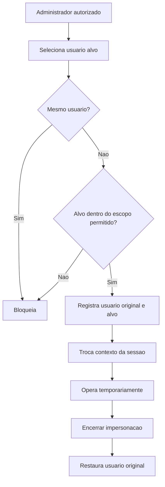
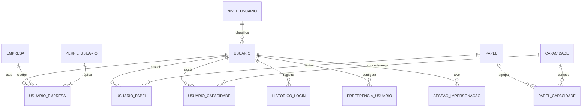

# EF 0 Aplicativo — Usuarios e Papeis V1

## 1. Identificacao

| Item | Valor |
|---|---|
| Sistema | Epros |
| Empresa | Siser |
| Modulo | Aplicativo |
| Submodulo | Usuarios e Papeis |
| Versao | V1 |
| Status | Especificacao funcional para validacao humana |
| Data | 2026-06-06 |

## 2. Objetivo funcional

O submodulo Usuarios e Papeis governa o ciclo de vida dos usuarios do Epros, seus vinculos com empresas, papeis, perfis, credenciais, status, preferencias, historico de acesso, troca de senha, administracao de conta e capacidades complementares. Ele garante que cada usuario opere somente no tenant e nas empresas permitidas, com papel e permissoes coerentes com o contexto selecionado.

Este submodulo complementa Permissoes de Menu. A matriz Ver/Editar/Excluir e a arvore de menu ficam no submodulo de permissoes; aqui ficam usuario, vinculo, papel, perfil aplicado, administracao de senha, historico, preferencias e controles de conta.

## 3. Escopo

### 3.1 Dentro do escopo

| Capacidade | Descricao |
|---|---|
| Cadastro de usuario | Criar, consultar, alterar, excluir logicamente e listar usuarios do tenant. |
| Usuario multiempresa | Relacionar usuario a uma ou mais empresas com perfil ou indicador de administrador. |
| Papel e perfil | Registrar papel funcional, perfil aplicado e capacidades complementares quando necessarias. |
| Troca de senha | Permitir troca administrativa e troca com validacao de senha atual quando aplicavel. |
| Recuperacao de senha | Solicitar nova senha por e-mail existente. |
| Historico de login | Registrar e consultar data, IP, detalhes e usuario do acesso. |
| Impersonacao controlada | Permitir acesso administrativo temporario em nome de outro usuario quando autorizado. |
| Preferencias do usuario | Guardar idioma, tema, notificacoes, avatar e preferencias de interface quando informadas. |
| Contatos e membros | Diferenciar usuario interno, contato de cliente, cliente e membro de equipe quando o dominio exigir. |
| Nivel/Plano de usuario | Registrar nivel de conta e quotas quando o usuario estiver sujeito a pacote/limite. |
| Estado da conta | Controlar ativo, pendente, desabilitado, suspenso, bloqueado e exclusao logica. |

### 3.2 Fora do escopo

| Tema | Tratamento |
|---|---|
| Montagem completa da arvore de menu | Pertence a Permissoes de Menu. |
| Cadastro completo de empresa | Pertence a Onboarding e Cadastros Base. |
| Regras comerciais de assinatura e cobranca | Pertencem a Assinatura, Limites e Pedidos/Cobranca SaaS. |
| Login tecnico externo e provedores externos | Devem ser especificados em identidade/autenticacao, mas impactos no usuario ficam registrados aqui. |
| Detalhe de quotas de armazenamento/download | Fica em Limites de Plano quando aplicado ao Epros. |
| Permissoes especificas de cada modulo de negocio | Devem ser especificadas no modulo dono. |

## 4. Principios funcionais

| Codigo | Regra |
|---|---|
| REG-001 | Usuario pertence a um tenant e deve respeitar isolamento de tenant. |
| REG-002 | Usuario so opera empresa em que possui vinculo ativo. |
| REG-003 | Usuario comum deve possuir perfil ou papel valido no contexto da empresa. |
| REG-004 | Usuario administrador da empresa pode dispensar perfil no vinculo da empresa. |
| REG-005 | E-mail de usuario deve ser unico conforme escopo final definido pelo Epros. |
| REG-006 | Login de usuario deve ser unico conforme escopo final definido pelo Epros. |
| REG-007 | Senha nunca deve ser exibida em telas, relatorios ou respostas de API. |
| REG-008 | Alteracao de senha deve ser fluxo separado da edicao cadastral quando o material assim exigir. |
| REG-009 | Excluir usuario deve preservar historico e bloquear acesso futuro. |
| REG-010 | Impersonacao deve ser temporaria, auditada e reversivel. |
| REG-011 | Usuario inativo, bloqueado, suspenso ou excluido logicamente nao deve autenticar. |
| REG-012 | Preferencias do usuario nao podem alterar permissoes efetivas. |

## 5. Tipos de usuario e papeis

| Tipo/papel | Uso funcional | Regras |
|---|---|---|
| Usuario operacional | Usuario comum do tenant. | Exige empresa vinculada e perfil quando nao admin. |
| Administrador da empresa | Usuario com IsAdmin=true no vinculo da empresa. | Acessa a matriz completa da empresa, respeitando plano e tenant. |
| Operador Siser | Usuario interno da Siser para operacao administrativa. | Deve ter trilha de auditoria e escopo administrativo separado. |
| Membro de equipe | Usuario interno de uma organizacao com papel funcional. | Pode ter permissoes de equipe, mensagens, relatorios e escopo proprio/global. |
| Contato de cliente | Pessoa vinculada a cliente/conta, com acesso restrito. | Pode ser promovida a cliente quando regra funcional assim definir. |
| Cliente | Usuario de portal/cliente, quando habilitado. | Escopo restrito ao proprio relacionamento. |
| Grupo | Registro agrupador de acesso quando adotado. | Nao deve autenticar como usuario humano sem regra explicita. |
| Papel | Conjunto nomeado de permissoes/capacidades. | Pode ter permissoes por modulo, escopo proprio/global e flags de administracao. |

## 6. Regras funcionais detalhadas

### 6.1 Cadastro de usuario

| Codigo | Regra |
|---|---|
| REG-013 | Criacao de usuario deve receber login, e-mail, senha, ativo e ao menos um vinculo de empresa quando for usuario operacional. |
| REG-014 | Login deve ter no maximo 20 caracteres no modelo principal do Epros. |
| REG-015 | Senha armazenada deve ter no maximo 100 caracteres no modelo principal do Epros. |
| REG-016 | E-mail deve ter ate 120 caracteres no modelo principal do Epros; material complementar informa 150, pendente na MC. |
| REG-017 | Nome deve ter ate 100 caracteres quando usado no cadastro complementar. |
| REG-018 | Criacao deve bloquear e-mail duplicado. |
| REG-019 | Quando houver regra de login unico global, login duplicado deve ser bloqueado. |
| REG-020 | Criacao de usuario sem empresa deve ser bloqueada para usuario operacional. |
| REG-021 | Usuario criado no onboarding inicial deve ser administrador da primeira empresa. |
| REG-022 | Usuario criado por administracao deve respeitar o tenant corrente. |
| REG-023 | Listagem de usuarios deve permitir filtro por login e e-mail. |
| REG-024 | Listagem deve ser paginada; o material informa limite padrao de 200 registros em listagens transversais. |
| REG-025 | Excluir usuario deve ser exclusao logica quando o modelo do Epros assim suportar. |
| REG-026 | Excluir usuario deve remover ou inativar vinculos usuario-empresa associados. |

### 6.2 Vinculo usuario-empresa

| Codigo | Regra |
|---|---|
| REG-027 | Usuario pode possuir multiplos vinculos de empresa. |
| REG-028 | Cada vinculo deve informar EmpresaId maior que zero. |
| REG-029 | Usuario comum deve informar PerfilUsuarioId maior que zero. |
| REG-030 | Usuario administrador pode gravar PerfilUsuarioId nulo quando IsAdmin=true. |
| REG-031 | Nao deve existir mais de um perfil para a mesma empresa no mesmo usuario. |
| REG-032 | Alteracao de usuario deve sincronizar a lista de empresas: incluir novos vinculos, atualizar existentes e remover retirados. |
| REG-033 | Usuario nao pode selecionar empresa fora de seus vinculos. |
| REG-034 | O token completo deve refletir a empresa selecionada. |

### 6.3 Papel, perfil e capacidades

| Codigo | Regra |
|---|---|
| REG-035 | Papel deve possuir nome identificavel e rotulo quando exibido. |
| REG-036 | Papel pode ser editavel ou protegido. |
| REG-037 | Papel pode ter owner/criador para segregacao por tenant ou organizacao. |
| REG-038 | Papel pode possuir vinculo com capacidades. |
| REG-039 | Usuario pode receber papel por vinculo direto ou pelo perfil da empresa, conforme decisao final. |
| REG-040 | Permissao direta no usuario pode conceder ou negar capacidade especifica quando o modelo adotado suportar grant/deny. |
| REG-041 | Negacao explicita no usuario deve prevalecer sobre papel quando esse modelo for adotado. |
| REG-042 | Papel de administrador global nao deve ser confundido com administrador da empresa. |
| REG-043 | Papeis protegidos do sistema nao devem ser excluidos ou rebaixados sem regra de governanca. |

### 6.4 Senha e recuperacao

| Codigo | Regra |
|---|---|
| REG-044 | Troca de senha administrativa deve exigir autorizacao de edicao de usuario. |
| REG-045 | Troca da propria senha deve validar senha atual quando aplicavel. |
| REG-046 | Nova senha nao pode ser igual a senha atual. |
| REG-047 | Recuperacao de senha por e-mail deve ocorrer apenas se o e-mail existir. |
| REG-048 | Alteracao de senha deve registrar data/hora da ultima troca quando campo estiver disponivel. |
| REG-049 | Politica final de hash, complexidade, expiracao e historico de senha nao esta completa no material e fica na MC. |
| REG-050 | Falhas de login devem alimentar controle de tentativa quando o modelo estiver habilitado. |
| REG-051 | Conta pode ser bloqueada apos excesso de tentativas, conforme politica final. |

### 6.5 Estado e seguranca de conta

| Codigo | Regra |
|---|---|
| REG-052 | Usuario ativo pode autenticar se possuir credencial valida e vinculo permitido. |
| REG-053 | Usuario inativo nao deve autenticar. |
| REG-054 | Usuario pendente pode exigir ativacao antes de autenticar. |
| REG-055 | Usuario desabilitado ou suspenso nao deve autenticar. |
| REG-056 | Usuario excluido logicamente nao deve autenticar. |
| REG-057 | Usuario de grupo nao deve autenticar como pessoa sem regra explicita. |
| REG-058 | Usuario exclusivo de portal deve respeitar fluxo proprio quando habilitado. |
| REG-059 | Usuario com autenticacao externa obrigatoria nao deve autenticar por senha local. |
| REG-060 | Mudanca significativa de IP pode encerrar sessao quando politica de seguranca estiver habilitada. |

### 6.6 Impersonacao

| Codigo | Regra |
|---|---|
| REG-061 | Impersonacao deve exigir permissao administrativa especifica. |
| REG-062 | Usuario nao deve impersonar a si mesmo. |
| REG-063 | Impersonacao deve respeitar owner/tenant/empresa do usuario alvo. |
| REG-064 | Inicio da impersonacao deve registrar usuario original, usuario alvo, data/hora e motivo quando informado. |
| REG-065 | Encerrar impersonacao deve restaurar a sessao do usuario original. |
| REG-066 | Acoes realizadas durante impersonacao devem ser auditaveis como usuario original atuando em nome do usuario alvo. |

### 6.7 Historico de login

| Codigo | Regra |
|---|---|
| REG-067 | Cada login deve poder registrar usuario, data, IP e detalhes. |
| REG-068 | Historico de login deve ser consultavel com filtro, paginacao e ordenacao. |
| REG-069 | Historico deve respeitar tenant/owner/empresa autorizada. |
| REG-070 | Falhas de login devem poder ser registradas para seguranca. |
| REG-071 | Ultimo login e ultimo IP podem ser gravados no cadastro do usuario quando campos estiverem disponiveis. |

### 6.8 Preferencias de usuario

| Codigo | Regra |
|---|---|
| REG-072 | Usuario pode possuir avatar/imagem quando habilitado. |
| REG-073 | Usuario pode possuir idioma preferencial. |
| REG-074 | Usuario pode possuir tema/preferencia visual. |
| REG-075 | Usuario pode configurar notificacoes. |
| REG-076 | Preferencias de e-mail, assinatura, formato regional, timezone e atalhos aparecem no material, mas a persistencia final fica na MC. |
| REG-077 | Preferencias devem ser separadas de permissoes e nao podem elevar acesso. |

### 6.9 Nivel de usuario, quotas e API key

| Codigo | Regra |
|---|---|
| REG-078 | Usuario pode possuir nivel de conta quando sujeito a pacote/limite. |
| REG-079 | Nivel de conta pode controlar upload, download, armazenamento, anuncios, expiracao de arquivos, concorrencia e tamanho maximo, quando aplicavel ao Epros. |
| REG-080 | Conta paga expirada pode sofrer downgrade para nivel gratuito quando regra comercial existir. |
| REG-081 | Upgrade por pagamento deve atualizar nivel e validade de conta quando regra comercial existir. |
| REG-082 | Usuario pode possuir chave de API quando habilitado. |
| REG-083 | Chave de API deve distinguir uso de usuario comum e uso administrativo. |
| REG-084 | Detalhe comercial de quota pertence a Limites de Plano; aqui fica apenas o vinculo de usuario/nivel. |

## 7. Fluxos funcionais

### 7.1 Criar usuario operacional

| Passo | Acao | Resultado |
|---:|---|---|
| 1 | Informar login, e-mail, senha e ativo | Dados basicos preenchidos. |
| 2 | Informar uma ou mais empresas | Vinculos iniciados. |
| 3 | Para cada empresa, marcar IsAdmin ou selecionar perfil | Vinculo fica valido. |
| 4 | Validar duplicidade de e-mail/login e empresa duplicada | Erros bloqueiam salvamento. |
| 5 | Salvar | Usuario e vinculos sao gravados no tenant. |

### 7.2 Alterar usuario

| Passo | Acao | Resultado |
|---:|---|---|
| 1 | Abrir cadastro | Epros carrega usuario e empresas vinculadas. |
| 2 | Alterar dados permitidos | Login, e-mail, ativo e vinculos podem ser ajustados conforme permissao. |
| 3 | Sincronizar empresas | Vinculos removidos sao retirados/inativados; novos sao criados. |
| 4 | Salvar | Cadastro atualizado sem alterar senha, salvo fluxo proprio de senha. |

### 7.3 Trocar senha

| Passo | Acao | Resultado |
|---:|---|---|
| 1 | Abrir troca de senha | Usuario alvo identificado. |
| 2 | Informar nova senha | Epros valida politica e diferenca da senha atual. |
| 3 | Confirmar | Senha e data da troca sao atualizadas. |

### 7.4 Impersonar usuario

### 7.5 Consultar historico de login

| Passo | Acao | Resultado |
|---:|---|---|
| 1 | Abrir historico | Lista eventos permitidos pelo escopo. |
| 2 | Aplicar filtros | Filtra por usuario, data, IP ou detalhes quando disponivel. |
| 3 | Ordenar/paginar | Retorna pagina solicitada. |

## 8. Telas e experiencia

| Tela | Rota funcional | Conteudo esperado |
|---|---|---|
| Usuarios | `/configuracoes/permissoes/usuarios` | Lista, filtros, paginacao, criar, editar e excluir usuario. |
| Edicao de usuario | `/configuracoes/permissoes/usuarios/[id]` | Login, e-mail, senha quando novo, ativo, empresas, perfil e IsAdmin. |
| Nova senha | Fluxo da edicao de usuario | Troca administrativa de senha. |
| Perfis | `/configuracoes/permissoes/perfil-usuarios` | Lista e manutencao de perfis, consumida por usuarios. |
| Login | `/login` | Autenticacao e selecao de empresa. |
| Cadastro publico | `/register` | Cria tenant e usuario administrador inicial. |
| Historico de login | Rota nao padronizada no Epros | Deve consultar eventos de acesso. |
| Perfil do usuario logado | Rota nao padronizada no Epros | Avatar, notificacoes, idioma, tema e preferencias. |

## 9. APIs funcionais

### 9.1 Usuarios

| Metodo | Rota funcional | Permissao | Resultado |
|---|---|---|---|
| GET | `usuarios/{id}` | Ver | Retorna usuario com vinculos de empresa. |
| GET | `usuarios` | Ver | Lista usuarios com filtros de login/e-mail e paginacao. |
| POST | `usuarios` | Editar | Cria usuario e vinculos. |
| PUT | `usuarios` | Editar | Atualiza usuario e sincroniza vinculos. |
| PUT | `usuarios/nova-senha` | Editar | Atualiza senha do usuario. |
| DELETE | `usuarios/{id}` | Excluir | Exclui logicamente usuario e vinculos. |

### 9.2 Account e sessao

| Metodo | Rota funcional | Uso neste submodulo |
|---|---|---|
| POST | `account/login` | Autentica usuario e retorna empresas. |
| GET | `account/session` | Recupera sessao, empresas, login e tenant. |
| POST | `account/obter-acessos` | Seleciona empresa e monta contexto. |
| POST | `account/gerar-nova-senha/{email}` | Envia nova senha por e-mail. |

### 9.3 Perfis e menus consumidos

| Metodo | Rota funcional | Uso neste submodulo |
|---|---|---|
| GET | `perfil-usuarios` | Selecionar perfil no vinculo usuario-empresa. |
| GET | `menus` | Montar arvore de perfil, no submodulo de permissoes. |

## 10. Modelo de dados funcional e implantavel

### 10.1 Visao conceitual

O modelo de Usuarios e Papeis e formado por:

1. Usuario: credencial, identidade, estado e preferencias.
2. Vinculo: relacao usuario-empresa-perfil e indicador de administrador.
3. Perfil/papel: perfil de permissao aplicado e papel/capacidade complementar.
4. Historico: login, IP, data, detalhes e owner/tenant.
5. Nivel de usuario: plano/nivel e quotas quando aplicavel.
6. Seguranca: senha, reset, bloqueio, chave de API e impersonacao.

### 10.2 Entidades implantaveis

| Entidade | Tipo | Responsabilidade | Tenant | Empresa | Observacao |
|---|---|---|---|---|---|
| `usuario` | Cadastro transacional | Identidade, credencial e status. | Sim | Indireta | Pode ter multiplos vinculos. |
| `usuario_empresa` | Vinculo transacional | Empresa, perfil e IsAdmin por usuario. | Indireto | Sim | Um perfil por empresa. |
| `perfil_usuario` | Cadastro de perfil | Perfil aplicado ao usuario. | Sim | Indireta | Dicionario compartilhado com Permissoes de Menu. |
| `papel` | Cadastro complementar | Papel funcional/capacidade. | Sim/owner | Nao informado | Complementa perfil quando adotado. |
| `usuario_papel` | Relacionamento | Papeis atribuidos ao usuario. | Sim/owner | Nao informado | Necessario se papel direto for adotado. |
| `capacidade` | Cadastro complementar | Permissao granular por chave/acao. | Nao informado | Nao informado | Complementar ao menu. |
| `papel_capacidade` | Relacionamento | Capacidades do papel. | Sim/owner | Nao informado | Usado em papeis. |
| `usuario_capacidade` | Relacionamento | Grant/deny direto do usuario. | Sim/owner | Nao informado | Suporta negacao explicita. |
| `historico_login` | Movimento/auditoria | Eventos de login e detalhes. | Sim/owner | Nao informado | Deve respeitar escopo. |
| `preferencia_usuario` | Configuracao | Idioma, tema, notificacoes e preferencias. | Sim | Nao informado | Modelo final pendente. |
| `nivel_usuario` | Cadastro de nivel | Quotas/limites por nivel. | Nao informado | Nao informado | Pode ser absorvido por Limites de Plano. |
| `preco_nivel_usuario` | Cadastro comercial | Preco/periodo por nivel. | Nao informado | Nao informado | Pode pertencer a cobranca SaaS. |
| `sessao_impersonacao` | Auditoria | Usuario original, alvo e periodo. | Sim | Sim/indireta | Criada como estrutura necessaria para auditoria. |

### 10.3 Relacionamentos

| Relacionamento | Cardinalidade | Regra |
|---|---|---|
| `usuario` -> `usuario_empresa` | 1:N | Usuario pode atuar em varias empresas. |
| `empresa` -> `usuario_empresa` | 1:N | Empresa pode ter varios usuarios. |
| `perfil_usuario` -> `usuario_empresa` | 1:N | Perfil pode ser aplicado em varios vinculos. |
| `usuario` -> `usuario_papel` | 1:N | Usuario pode receber varios papeis se o modelo direto for adotado. |
| `papel` -> `usuario_papel` | 1:N | Papel pode ser aplicado a varios usuarios. |
| `papel` -> `papel_capacidade` | 1:N | Papel agrupa capacidades. |
| `capacidade` -> `papel_capacidade` | 1:N | Capacidade pode estar em varios papeis. |
| `usuario` -> `usuario_capacidade` | 1:N | Usuario pode ter grant/deny direto. |
| `capacidade` -> `usuario_capacidade` | 1:N | Capacidade pode ser concedida/negada diretamente. |
| `usuario` -> `historico_login` | 1:N | Usuario possui eventos de login. |
| `usuario` -> `preferencia_usuario` | 1:1 ou 1:N | Modelo final nao informado. |
| `nivel_usuario` -> `usuario` | 1:N | Nivel pode ser aplicado a usuarios quando habilitado. |

### 10.4 Chaves e unicidades

| Entidade | Restricao | Campos | Objetivo | Status |
|---|---|---|---|---|
| `usuario` | Unico funcional | TenantId + Email ou Email global | Evitar duplicidade. | Escopo final pendente. |
| `usuario` | Unico funcional | TenantId + Login ou Login global | Evitar login duplicado. | Escopo final pendente. |
| `usuario_empresa` | Unico funcional | UsuarioId + EmpresaId | Impedir mais de um perfil por empresa. | Material informa regra. |
| `papel` | Unico funcional | owner/tenant + name | Evitar papel duplicado. | Necessario se papel direto for adotado. |
| `capacidade` | Unico funcional | name ou chave | Evitar capacidade duplicada. | Necessario se capacidade for adotada. |
| `usuario_capacidade` | Unico funcional | UsuarioId + CapacidadeId | Evitar grant/deny duplicado. | Pendente. |
| `historico_login` | Indice | UsuarioId + Data | Consulta de historico. | Pendente. |

### 10.5 Diagrama logico funcional

## 11. Dicionario de dados implantavel

### 11.1 `usuario`

| Campo | Tipo/formato | Tamanho/dominio | Obrigatorio | Chave/relacionamento | Regra/observacao |
|---|---|---|---|---|---|
| Id | Nao informado no material; complemento indica varchar | 200 quando informado em contexto complementar | Sim | PK | Identificador do usuario. |
| TenantId | varchar | 200 | Sim | Indice de tenant | Isolamento. |
| SequenciaTenantId | Nao informado no material | Nao informado no material | Nao informado no material |  | Campo citado no modelo principal. |
| Login | varchar | 20 | Nao informado no material | Unico funcional pendente | Login do usuario. |
| Nome | varchar | 100 | Sim em contexto complementar |  | Nome exibido. |
| Senha | varchar | 100 | Sim |  | Senha armazenada. |
| Email | varchar | 120 no modelo principal; 150 no complementar | Sim | Unico funcional pendente | Divergencia na MC. |
| Ativo | booleano | true/false | Nao informado no material |  | Controla acesso. |
| Username | varchar | 65 | Sim quando adotado | Unico funcional | Campo de usuario alternativo identificado. |
| Firstname | varchar | 150 | Sim quando adotado |  | Primeiro nome. |
| Lastname | varchar | 150 | Sim quando adotado |  | Sobrenome. |
| Title | varchar | 10 ou 50 conforme contexto | Nao informado no material |  | Titulo/cargo. |
| Department | varchar | 50 | Nao informado no material |  | Departamento. |
| PhoneHome | varchar | 50 | Nao informado no material |  | Telefone residencial. |
| PhoneMobile | varchar | 50 | Nao informado no material |  | Celular. |
| PhoneWork | varchar | 50 | Nao informado no material |  | Telefone comercial. |
| PhoneOther | varchar | 50 | Nao informado no material |  | Telefone alternativo. |
| PhoneFax | varchar | 50 | Nao informado no material |  | Fax. |
| Status | enum/string | active, pending, disabled, suspended; tambem user_status_dom em outro contexto | Sim quando adotado | Indice funcional | Estado de conta. |
| Deleted | booleano | true/false | Nao informado no material |  | Exclusao logica. |
| IsAdmin | booleano | true/false | Nao informado no material |  | Administracao global/registro; nao confundir com IsAdmin da empresa. |
| ExternalAuthOnly | booleano | true/false | Nao informado no material |  | Obriga autenticacao externa. |
| ReceiveNotifications | booleano | true/false | Nao informado no material |  | Notificacoes. |
| Description | texto | Nao informado no material | Nao informado no material |  | Observacao. |
| DateEntered | data/hora | Nao informado no material | Sim quando adotado |  | Criacao. |
| DateModified | data/hora | Nao informado no material | Sim quando adotado |  | Alteracao. |
| CreatedBy | id | Nao informado no material | Nao informado no material | FK usuario | Criador/owner. |
| ModifiedUserId | id | Nao informado no material | Nao informado no material | FK usuario | Ultimo modificador. |
| ReportsToId | id | Nao informado no material | Nao informado no material | FK usuario | Gestor; deve impedir ciclo. |
| PortalOnly | booleano | true/false | Nao informado no material |  | Usuario exclusivo de portal. |
| IsGroup | booleano | true/false | Nao informado no material |  | Registro agrupador. |
| EmailVerifiedAt | data/hora | Nao informado no material | Nao informado no material |  | Verificacao de e-mail. |
| Slug | string | Nao informado no material | Nao informado no material |  | Identificador amigavel. |
| CreatorId | number/string | Nao informado no material | Nao informado no material |  | Owner. |
| CreatedByOwner | number/string | Nao informado no material | Nao informado no material |  | Segregacao por owner. |
| Type | enum/string | team, client, contact | Nao informado no material |  | Classificacao operacional. |
| ClientId | number/string | Nao informado no material | Nao informado no material | FK cliente | Vinculo a cliente quando contato. |
| AccountOwner | booleano | true/false | Nao informado no material |  | Dono da conta/cliente. |
| PrimaryAdmin | booleano | true/false | Nao informado no material |  | Administrador primario protegido. |
| LastLoginDate | timestamp | Nao informado no material | Nao informado no material |  | Ultimo login. |
| LastLoginIp | varchar | 45 | Nao informado no material |  | Ultimo IP. |
| LanguageId | number | Nao informado no material | Nao informado no material | FK idioma | Idioma. |
| DateCreated | timestamp | Nao informado no material | Nao informado no material |  | Data de criacao alternativa. |
| CreatedIp | varchar | 45 | Nao informado no material |  | IP de criacao. |
| PasswordResetHash | varchar | 32 | Nao informado no material |  | Reset de senha; politica final pendente. |
| Identifier | varchar | 32 | Sim em contexto alternativo |  | Identificador de conta. |
| ApiKey | varchar | 32 | Nao informado no material |  | Chave de API. |
| AccountLockStatus | int/booleano | 0/1 | Sim em contexto alternativo |  | Bloqueio de conta. |
| AccountLockHash | varchar | 16 | Sim em contexto alternativo |  | Ativacao/desbloqueio. |
| Profile | text | Nao informado no material | Nao informado no material |  | Perfil textual. |
| IsPublic | int/booleano | 0/1 | Sim em contexto alternativo |  | Publicidade de perfil. |

### 11.2 `usuario_empresa`

| Campo | Tipo/formato | Tamanho/dominio | Obrigatorio | Chave/relacionamento | Regra/observacao |
|---|---|---|---|---|---|
| Id | Nao informado no material | Nao informado no material | Nao informado no material | PK | Identificador do vinculo. |
| UsuarioId | Nao informado no material | Nao informado no material | Sim | FK `usuario.Id` | Usuario vinculado. |
| EmpresaId | number | Maior que zero; pode ser nulo em contrato antes da selecao | Sim | FK empresa | Empresa vinculada. |
| PerfilUsuarioId | number | Maior que zero quando nao admin; pode ser nulo quando IsAdmin=true | Condicional | FK `perfil_usuario.Id` | Perfil aplicado. |
| IsAdmin | booleano | true/false | Sim |  | Administrador da empresa. |

### 11.3 `perfil_usuario`

| Campo | Tipo/formato | Tamanho/dominio | Obrigatorio | Chave/relacionamento | Regra/observacao |
|---|---|---|---|---|---|
| Id | Nao informado no material | Nao informado no material | Sim | PK | Identificador do perfil. |
| TenantId | varchar | 200 | Sim | Indice de tenant | Isolamento. |
| Descricao | varchar | 100; validacao alternativa ate 20 | Nao informado no material | Unico funcional pendente | Divergencia na MC. |
| IsAdmin | booleano | true/false | Nao informado no material |  | Material identifica perfil admin liberando acessos em outro modelo. |

### 11.4 `papel`

| Campo | Tipo/formato | Tamanho/dominio | Obrigatorio | Chave/relacionamento | Regra/observacao |
|---|---|---|---|---|---|
| Id | Nao informado no material | Nao informado no material | Sim | PK | Identificador do papel. |
| Name | string | ate 100 em contexto com RoleName | Sim | Unico funcional | Nome interno. |
| Label | string | Nao informado no material | Nao informado no material |  | Rotulo exibido. |
| GuardName | string | Nao informado no material | Nao informado no material |  | Guard/contexto, se adotado. |
| Editable | booleano | true/false | Nao informado no material |  | Indica se pode ser editado. |
| CreatedBy | number/string | Nao informado no material | Nao informado no material | Indice owner | Segregacao por owner. |
| RoleSystem | booleano/int | Nao informado no material | Nao informado no material |  | Papel de sistema protegido. |
| RoleType | enum/string | team/client | Nao informado no material |  | Tipo do papel. |
| RoleHomepage | string | Nao informado no material | Nao informado no material |  | Home padrao do papel. |
| Modules | JSON | Nao informado no material | Nao informado no material |  | Modulos/capacidades; decisao final na MC. |
| CountUsers | number | Inteiro | Nao informado no material |  | Contagem exibida. |

### 11.5 `capacidade`

| Campo | Tipo/formato | Tamanho/dominio | Obrigatorio | Chave/relacionamento | Regra/observacao |
|---|---|---|---|---|---|
| Id | Nao informado no material | Nao informado no material | Sim | PK | Identificador da capacidade. |
| Name | string | Nao informado no material | Sim | Unico funcional | Chave da capacidade. |
| Label | string | Nao informado no material | Nao informado no material |  | Rotulo. |
| Module | string | Nao informado no material | Nao informado no material |  | Modulo dono. |
| AddOn | string | Nao informado no material | Nao informado no material |  | Pacote/complemento quando aplicavel. |
| PermissionKey | varchar | 100 | Nao informado no material | Unico funcional | Chave granular quando adotada. |

### 11.6 `usuario_papel`

| Campo | Tipo/formato | Tamanho/dominio | Obrigatorio | Chave/relacionamento | Regra/observacao |
|---|---|---|---|---|---|
| Id | Nao informado no material | Nao informado no material | Nao informado no material | PK | Identificador. |
| UsuarioId | Nao informado no material | Nao informado no material | Sim | FK `usuario.Id` | Usuario. |
| PapelId | Nao informado no material | Nao informado no material | Sim | FK `papel.Id` | Papel. |
| ModelType | string | Nao informado no material | Nao informado no material |  | Campo aparece em pivots genericos; adotar apenas se necessario. |

### 11.7 `papel_capacidade`

| Campo | Tipo/formato | Tamanho/dominio | Obrigatorio | Chave/relacionamento | Regra/observacao |
|---|---|---|---|---|---|
| Id | Nao informado no material | Nao informado no material | Nao informado no material | PK | Identificador. |
| PapelId | Nao informado no material | Nao informado no material | Sim | FK `papel.Id` | Papel. |
| CapacidadeId | Nao informado no material | Nao informado no material | Sim | FK `capacidade.Id` | Capacidade. |

### 11.8 `usuario_capacidade`

| Campo | Tipo/formato | Tamanho/dominio | Obrigatorio | Chave/relacionamento | Regra/observacao |
|---|---|---|---|---|---|
| Id | Nao informado no material | Nao informado no material | Sim | PK | Identificador. |
| UsuarioId | Nao informado no material | Nao informado no material | Sim | FK `usuario.Id` | Usuario. |
| CapacidadeId | Nao informado no material | Nao informado no material | Sim | FK `capacidade.Id` | Capacidade. |
| Granted | bit/booleano | default true em contexto identificado | Nao informado no material |  | Permite grant/deny direto. |

### 11.9 `historico_login`

| Campo | Tipo/formato | Tamanho/dominio | Obrigatorio | Chave/relacionamento | Regra/observacao |
|---|---|---|---|---|---|
| Id | Nao informado no material | Nao informado no material | Sim | PK | Identificador. |
| UserId | Nao informado no material | Nao informado no material | Sim | FK `usuario.Id` | Usuario. |
| Ip | varchar | 45 | Nao informado no material | Indice funcional | IP de acesso. |
| Date | data/hora | Nao informado no material | Nao informado no material | Indice funcional | Data do evento. |
| Details | texto/string | Nao informado no material | Nao informado no material |  | Detalhes do login. |
| CreatedBy | number/string | Nao informado no material | Nao informado no material | Indice owner | Segregacao por owner. |

### 11.10 `preferencia_usuario`

| Campo | Tipo/formato | Tamanho/dominio | Obrigatorio | Chave/relacionamento | Regra/observacao |
|---|---|---|---|---|---|
| Id | Nao informado no material | Nao informado no material | Sim | PK | Identificador. |
| UsuarioId | Nao informado no material | Nao informado no material | Sim | FK `usuario.Id` | Usuario. |
| Idioma | string/number | Nao informado no material | Nao informado no material |  | Idioma preferencial. |
| Tema | string | Nao informado no material | Nao informado no material |  | Tema/interface. |
| Avatar | string/blob | Nao informado no material | Nao informado no material |  | Imagem/avatar. |
| RecebeNotificacoes | booleano | true/false | Nao informado no material |  | Notificacoes. |
| Timezone | string | Nao informado no material | Nao informado no material |  | Fuso horario. |
| FormatoData | string | Nao informado no material | Nao informado no material |  | Preferencia regional. |
| FormatoHora | string | Nao informado no material | Nao informado no material |  | Preferencia regional. |
| FormatoNumero | string | Nao informado no material | Nao informado no material |  | Preferencia regional. |
| PreferenciasJson | JSON | Nao informado no material | Nao informado no material |  | Container de preferencias ainda nao modeladas. |

### 11.11 `nivel_usuario`

| Campo | Tipo/formato | Tamanho/dominio | Obrigatorio | Chave/relacionamento | Regra/observacao |
|---|---|---|---|---|---|
| Id | int | Nao informado no material | Sim | PK | Identificador. |
| LevelId | int | 5 digitos em contexto identificado | Sim | Unico funcional | Nivel. |
| Label | varchar | 20 | Sim |  | Rotulo do nivel. |
| CanUpload | int/booleano | 0/1 | Sim |  | Pode fazer upload quando aplicavel. |
| WaitBetweenDownloads | int | Default 0 | Sim |  | Espera entre downloads. |
| DownloadSpeed | int | Default 0 | Sim |  | Velocidade. |
| MaxStorageBytes | bigint | 18 digitos; default 0 | Sim |  | Armazenamento maximo. |
| ShowSiteAdverts | int/booleano | 0/1 | Sim |  | Exibir anuncios quando aplicavel. |
| ShowUpgradeScreen | int/booleano | 0/1 | Sim |  | Exibir upgrade. |
| DaysToKeepInactiveFiles | int | Default 360 | Sim |  | Retencao de arquivos inativos. |
| ConcurrentUploads | int | Default 50 | Sim |  | Uploads simultaneos. |
| ConcurrentDownloads | int | Default 5 | Sim |  | Downloads simultaneos. |
| DownloadsPer24Hours | int | Default 0 | Sim |  | Downloads por 24 horas. |
| MaxDownloadFilesizeAllowed | bigint | 18 digitos; default 0 | Sim |  | Tamanho maximo de download. |
| MaxRemoteDownloadUrls | int | Default 0 | Sim |  | URLs remotas. |
| MaxUploadSize | bigint | 18 digitos; default 0 | Sim |  | Tamanho maximo de upload. |
| LevelType | enum | admin, free, paid, moderator, nonuser | Sim |  | Tipo de nivel. |
| OnUpgradePage | int/booleano | 0/1 | Sim |  | Exibicao em pagina de upgrade. |

### 11.12 `preco_nivel_usuario`

| Campo | Tipo/formato | Tamanho/dominio | Obrigatorio | Chave/relacionamento | Regra/observacao |
|---|---|---|---|---|---|
| Id | int | Nao informado no material | Sim | PK | Identificador. |
| UserLevelId | int | Nao informado no material | Sim | FK `nivel_usuario.Id` | Nivel. |
| PricingLabel | varchar | 50 | Sim |  | Rotulo de preco. |
| PackagePricingType | varchar | 10; default period | Sim |  | Tipo de cobranca. |
| Period | varchar | 10; default 1M | Nao informado no material |  | Periodo. |
| DownloadAllowance | bigint | Nao informado no material | Nao informado no material |  | Franquia. |
| Price | decimal | 10,2 | Sim |  | Preco. |

### 11.13 `sessao_impersonacao`

| Campo | Tipo/formato | Tamanho/dominio | Obrigatorio | Chave/relacionamento | Regra/observacao |
|---|---|---|---|---|---|
| Id | Nao informado no material | Nao informado no material | Sim | PK | Identificador. |
| TenantId | varchar | 200 | Sim | Indice tenant | Isolamento. |
| UsuarioOriginalId | Nao informado no material | Nao informado no material | Sim | FK `usuario.Id` | Administrador/origem. |
| UsuarioAlvoId | Nao informado no material | Nao informado no material | Sim | FK `usuario.Id` | Usuario impersonado. |
| EmpresaId | Nao informado no material | Nao informado no material | Nao informado no material | FK empresa | Empresa da sessao. |
| InicioEm | data/hora | Nao informado no material | Sim |  | Inicio. |
| FimEm | data/hora | Nao informado no material | Nao informado no material |  | Encerramento. |
| Motivo | texto | Nao informado no material | Nao informado no material |  | Justificativa. |
| IpOrigem | varchar | 45 | Nao informado no material |  | IP da acao. |

## 12. Mensagens e validacoes

| Situacao | Mensagem/resultado identificado |
|---|---|
| Usuario criado | User created successfully. |
| Falha transacional | Transaction failed. |
| Usuario atualizado | Updated successfully. |
| Falha ao salvar | Failed. |
| Usuario excluido | The user has been deleted. |
| E-mail duplicado | Ha usuario cadastrado com mesmo email. |
| Usuario sem empresa | Nenhuma empresa informada para o novo usuario. |
| Perfil duplicado por empresa | Nao pode ser cadastrado mais de um perfil por empresa. |
| Perfil inexistente | Id do perfil do usuario nao cadastrado. |
| Senha igual a atual | A senha nao pode ser a mesma ja cadastrada. |
| Empresa sem acesso | Usuario nao tem acesso a essa empresa. |

## 13. Seguranca, auditoria e privacidade

| Tema | Regra |
|---|---|
| Senha | Politica final de hash e complexidade deve ser definida antes da implantacao. |
| Dados sensiveis | Senha, reset hash, chave de API e tokens devem ser protegidos e mascarados. |
| Impersonacao | Deve registrar origem, alvo, empresa, inicio, fim, IP e motivo. |
| Ultimo administrador | O Epros deve impedir que o ultimo administrador valido seja removido ou rebaixado sem substituto. |
| Hierarquia | Relacao de gestor deve impedir auto-referencia e ciclo. |
| Preferencias | Preferencias nao podem elevar permissao. |
| Chave de API | Deve ter rotacao, revogacao, escopo e distincao usuario/admin. |
| Historico | Login e falhas devem ser auditaveis. |

## 14. Relatorios e consultas

| Consulta | Campos minimos |
|---|---|
| Usuarios | login, nome, e-mail, ativo, empresas, perfis, IsAdmin. |
| Usuarios por empresa | empresa, usuario, perfil, IsAdmin, status. |
| Papeis | nome, rotulo, editavel, owner, usuarios vinculados. |
| Historico de login | usuario, data, IP, detalhes, resultado. |
| Impersonacoes | usuario original, usuario alvo, empresa, inicio, fim, motivo. |
| Contas bloqueadas | usuario, status, motivo, data, acao pendente. |

## 15. Cenarios de validacao

| ID | Cenario | Resultado esperado |
|---|---|---|
| CT-001 | Criar usuario com e-mail novo e empresa valida | Usuario criado. |
| CT-002 | Criar usuario com e-mail duplicado | Bloqueia criacao. |
| CT-003 | Criar usuario sem empresa | Bloqueia criacao. |
| CT-004 | Criar vinculo comum sem perfil | Bloqueia criacao. |
| CT-005 | Criar vinculo admin sem perfil | Permite. |
| CT-006 | Adicionar duas vezes a mesma empresa | Bloqueia. |
| CT-007 | Alterar usuario sem senha | Mantem senha. |
| CT-008 | Trocar senha para a mesma senha | Bloqueia. |
| CT-009 | Excluir usuario | Remove acesso futuro e preserva historico. |
| CT-010 | Login de usuario inativo | Bloqueia. |
| CT-011 | Obter acessos para empresa fora do vinculo | Bloqueia. |
| CT-012 | Iniciar impersonacao sem permissao | Bloqueia. |
| CT-013 | Iniciar impersonacao de si mesmo | Bloqueia. |
| CT-014 | Encerrar impersonacao | Restaura usuario original. |
| CT-015 | Consultar historico de login fora do escopo | Bloqueia. |

## 16. Interligacoes

| Modulo/submodulo | Relacao |
|---|---|
| Identidade e contexto tenant | Fornece tenant, sessao, token e empresa selecionada. |
| Permissoes de Menu | Aplica perfis e matriz Ver/Editar/Excluir aos usuarios. |
| Onboarding e empresa | Cria usuario administrador inicial e primeira empresa. |
| Limites de plano | Define quantidade de usuarios e bloqueio por plano. |
| Pedidos e cobranca SaaS | Alimenta bloqueio financeiro que afeta login. |
| Cadastros Base | Fornece empresa e dados auxiliares usados no vinculo. |
| Todos os modulos operacionais | Consomem usuario, empresa, perfil e permissoes efetivas. |

## 17. Notas de rodape

1. As entidades `sessao_impersonacao`, `capacidade`, `usuario_capacidade` e `preferencia_usuario` foram estruturadas nesta especificacao para tornar implantaveis capacidades identificadas no material; quando o material nao trouxe nome final de tabela, o nome funcional foi criado para validacao.
2. Campos de quota e nivel de usuario foram preservados porque o material traz tabelas completas; a decisao de absorver isso por Limites de Plano fica na MC.
