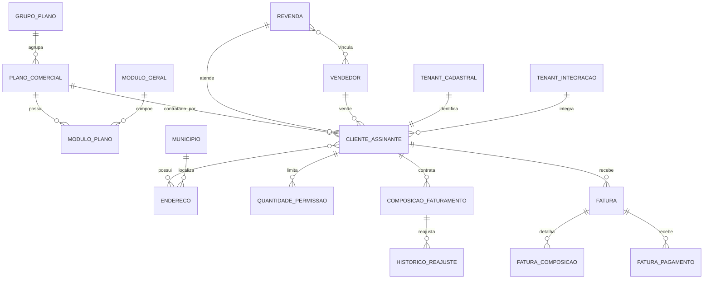

# EF 0_APLICATIVO ASSINATURA_E_PLANOS V1

**Projeto:** Epros  
**Empresa:** Siser  
**Modulo:** 0_APLICATIVO  
**Submodulo:** ASSINATURA_E_PLANOS  
**ID funcional:** APP-TEN-004  
**Versao:** V1  
**Status:** Pronto para validacao humana  
**Data:** 2026-06-05  

## 1. Objetivo funcional

O submodulo de Assinatura e Planos administra o catalogo comercial de planos do Epros, os grupos de planos, os modulos incluídos em cada plano, os limites contratados, a vinculacao do cliente ao plano vigente, a composicao de cobranca recorrente, a consulta de faturas pelo cliente, a geracao de cobranca PIX e o bloqueio operacional por inadimplencia.

Este submodulo tambem sustenta o backoffice da Siser para cadastrar planos, clientes, revendas, vendedores, composicoes de faturamento, permissoes quantitativas e usuarios operadores.

## 2. Escopo

Fazem parte deste submodulo:

- Catalogo de planos comerciais.
- Agrupamento de planos.
- Cadastro de modulos gerais disponiveis para comercializacao.
- Vinculo entre plano e modulos.
- Definicao de valor base do plano.
- Definicao de limites de usuarios e empresas por plano.
- Definicao de recursos inclusos no plano.
- Cadastro do cliente assinante.
- Vinculo do cliente a plano, revenda e vendedor.
- Composicoes de cobranca do cliente.
- Quantidades de permissao contratadas.
- Consulta de faturas pelo cliente.
- Geracao de cobranca PIX.
- Bloqueio de acesso por fatura vencida.
- Backoffice de administracao de planos, clientes, faturas, revendas, vendedores, modulos e usuarios operadores.
- API externa de comunicacao segura entre o Epros e os servicos de gestao de clientes.
- Ciclo de assinatura ativa, expirada, futura, aguardando aprovacao e recusada.
- Encadeamento de vigencias quando uma nova assinatura deve iniciar apos o termino da assinatura vigente.
- Habilitacao de modulos por plano contratado.
- Exibicao comercial de pricing e jornada de assinatura.
- Alertas operacionais de expiracao de assinatura.
- Integracao com configuracoes de gateways de pagamento usadas na contratacao.

Ficam fora deste submodulo:

- Cadastro operacional completo de empresas usuarias do ERP, tratado em cadastros base.
- Regras fiscais, emissao de documentos fiscais e consumo tributario, tratados nos modulos fiscais e DFe.
- Regras completas de pedidos e cobranca SaaS, tratadas no submodulo de pedidos e cobranca.
- Permissoes de menu do ERP em profundidade, tratadas no submodulo de usuarios, papeis e permissoes.

## 2.1 Fronteira com submodulos vizinhos

| Submodulo | Fronteira funcional |
|---|---|
| ASSINATURA_E_PLANOS | Define catalogo de planos, modulos comercializaveis, cliente assinante, vinculos comerciais, composicoes de cobranca, consulta de planos e ciclo base de assinatura. |
| LIMITES_DE_PLANO | Detalha enforcement de limites, cotas, quantidades contratadas e comportamento quando o cliente atinge o limite. |
| PEDIDOS_E_COBRANCA_SAAS | Detalha pedidos, cobranca recorrente, status financeiro, gateways, conciliacao, cancelamento financeiro e cobranca SaaS completa. |
| IDENTIDADE_E_CONTEXTO_TENANT | Detalha login, onboarding, contexto tenant e selecao de empresa. |
| FATURAMENTO_FISCAL_ELETRONICO | Detalha enumeracoes e dados fiscais quando nao forem apenas apoio da empresa operadora. |

## 3. Conceitos e definicoes

| Conceito | Definicao |
|---|---|
| Plano | Oferta comercial contratavel pelo cliente, com nome, descricao, valor, vigencia, limites e modulos associados. |
| Grupo de plano | Classificacao comercial usada para agrupar planos semelhantes. |
| Modulo geral | Capacidade funcional do Epros que pode ser comercializada ou habilitada em um plano. |
| Modulo do plano | Vinculo entre um plano e um modulo geral, podendo conter descricao, valor e status ativo. |
| Cliente assinante | Pessoa juridica ou organizacao cliente da Siser que utiliza o Epros mediante plano contratado. |
| Tenant | Identificador logico do ambiente do cliente no Epros. |
| Composicao de fatura | Item que compoe a cobranca recorrente ou avulsa do cliente. |
| Quantidade de permissao | Limite quantitativo aplicado ao cliente, como quantidade de empresas ou usuarios. |
| Fatura | Documento de cobranca associado ao cliente assinante. |
| Pagamento | Registro financeiro associado a uma fatura, incluindo PIX, pagamento manual e dados de liquidacao. |
| Revenda | Parceiro comercial vinculado ao cliente ou a vendedor, com percentual de comissao. |
| Vendedor | Usuario comercial vinculado a revenda, com percentual de comissao. |
| Operador Siser | Usuario interno autorizado a operar o backoffice de gestao de clientes, planos, faturas e canais. |

## 4. Atores

| Ator | Responsabilidades |
|---|---|
| Cliente assinante | Consulta planos, registra adesao, consulta faturas, gera cobranca PIX e regulariza pendencias. |
| Operador Siser | Cadastra e mantem planos, clientes, faturas, revendas, vendedores, modulos, composicoes e usuarios. |
| Administrador Siser | Administra tokens externos, acessos, configuracoes criticas e operacoes de alto impacto. |
| Sistema Epros | Aplica limites contratados, consulta situacao financeira, redireciona clientes bloqueados e registra clientes no ciclo de onboarding. |
| Gateway de pagamento | Recebe cobrancas PIX e envia notificacoes de pagamento. |

## 5. Entidades funcionais

### 5.1 Plano

| Campo | Regra |
|---|---|
| Identificador | Identifica unicamente o plano. |
| Grupo do plano | Obrigatorio. |
| Nome | Obrigatorio, ate 100 caracteres. |
| Descricao curta | Obrigatoria, ate 200 caracteres. |
| Descricao completa | Obrigatoria, texto longo. |
| Valor | Obrigatorio, decimal com 2 casas. |
| Quantidade de usuarios | Obrigatoria. |
| Quantidade de empresas | Obrigatoria. |
| Data de inicio | Obrigatoria. |
| Data de fim | Opcional; quando preenchida, delimita fim de disponibilidade. |
| Ativo | Obrigatorio; controla disponibilidade operacional. |
| Recursos inclusos | Texto opcional descrevendo recursos contemplados. |
| Modulos | Lista de modulos associados ao plano. |
| Opcao de assinatura | Deve indicar se o plano e gratuito ou pago quando esse modelo estiver ativo. |
| Valor mensal | Valor mensal do plano quando houver cobranca mensal. |
| Valor anual | Valor anual do plano quando houver cobranca anual. |
| IDs de plano em gateways | Identificadores do plano nos gateways de pagamento integrados. |
| Limite de clientes | Limite funcional de clientes quando aplicavel. |
| Limite de equipes | Limite funcional de equipes quando aplicavel. |
| Limite de projetos | Limite funcional de projetos quando aplicavel. |
| Destaque | Indica se o plano aparece como destacado. |
| Status de sincronizacao | Indica se o plano esta sincronizado ou aguardando sincronizacao. |

Quando um limite numerico for representado por `-1`, o Epros deve tratar o limite como ilimitado somente se essa convencao for confirmada pela Siser.

### 5.1.1 Catalogo global de plano

O Epros deve manter um catalogo global de planos SaaS usado para exibicao comercial e contratacao. Esse catalogo nao deve depender do tenant do cliente para listar planos disponiveis.

| Campo | Regra |
|---|---|
| Identificador do plano | Identificador numerico unico do plano no catalogo global. |
| Nome | Obrigatorio; no modelo de catalogo global possui tamanho maximo de 50 caracteres. |
| Valor | Obrigatorio, decimal com 2 casas. |
| Duracao | Obrigatoria; valores previstos: vitalicia, mensal e anual. |
| Limite de usuarios | Obrigatorio. |
| Limite de clientes | Obrigatorio. |
| Limite de fornecedores | Obrigatorio. |
| Limite de produtos | Obrigatorio. |
| Limite de faturas | Obrigatorio. |
| Descricao | Descreve o plano para exibicao administrativa e comercial. |
| Flag CRM | Indica se recursos de CRM estao habilitados no plano. |
| Flag Projetos | Indica se recursos de projetos estao habilitados no plano. |
| Flag RH | Indica se recursos de recursos humanos estao habilitados no plano. |
| Flag Contas | Indica se recursos financeiros/contabeis estao habilitados no plano. |
| Flag PDV | Indica se recursos de ponto de venda estao habilitados no plano. |
| Data de inclusao | Deve ser preenchida no cadastro do plano. |
| Data de alteracao | Deve ser preenchida na edicao do plano. |

### 5.1.2 Planos iniciais

O material indica a existencia de planos iniciais de catalogo:

| Plano | Regra conhecida |
|---|---|
| Free Plan | Valor 0, duracao vitalicia e limites iniciais identificados no material. |
| Platinum | Plano inicial do catalogo. |
| Gold | Plano inicial do catalogo. |
| Silver | Plano inicial do catalogo. |

Os limites completos de cada plano inicial devem ser validados contra a configuracao vigente antes de construcao definitiva.

### 5.2 Grupo de plano

| Campo | Regra |
|---|---|
| Identificador | Identifica unicamente o grupo. |
| Descricao | Obrigatoria. |

### 5.2.1 Assinatura do cliente

| Campo | Regra |
|---|---|
| Cliente | Identifica o cliente assinante. |
| Plano/pacote | Identifica o plano contratado. |
| Status | Deve permitir, no minimo, aprovado, aguardando e recusado. |
| Data de inicio | Define inicio da vigencia; pode ficar vazia quando a assinatura aguarda aprovacao. |
| Data de fim | Define fim da vigencia; pode ficar vazia quando a assinatura aguarda aprovacao. |
| Detalhes do pacote | Snapshot dos limites, modulos, permissoes e dados comerciais do plano no momento da assinatura. |
| Gateway | Indica o meio usado para pagamento ou aprovacao da assinatura. |
| Transacao | Identificador funcional da transacao quando houver pagamento online ou assinatura gratuita. |
| Trial ate | Data final do periodo de trial quando aplicavel. |
| Arquivada | Indica se a assinatura foi arquivada para preservar historico. |
| Checkout | Dados de checkout quando a assinatura envolver pagamento externo. |
| Identificadores de gateway | Dados da assinatura nos provedores de pagamento. |

### 5.2.2 Snapshot da assinatura

O snapshot da assinatura deve preservar os dados vigentes no momento da contratacao ou alteracao:

| Dado preservado | Regra |
|---|---|
| Nome do plano | Mantem historico comercial mesmo que o plano seja alterado depois. |
| Limite de unidades/localidades | Preserva cota contratada quando existir no produto. |
| Limite de usuarios | Preserva cota contratada. |
| Limite de produtos | Preserva cota contratada. |
| Limite de faturas | Preserva cota contratada. |
| Permissoes customizadas | Devem ser agregadas ao snapshot quando existirem. |
| Modulos habilitados | Devem refletir os modulos contratados ou aprovados para o cliente. |

### 5.3 Modulo geral

| Campo | Regra |
|---|---|
| Identificador | Identifica unicamente o modulo geral. |
| Descricao | Obrigatoria, ate 200 caracteres. |
| Ativo | Obrigatorio. |

### 5.4 Modulo do plano

| Campo | Regra |
|---|---|
| Plano | Obrigatorio. |
| Modulo geral | Obrigatorio. |
| Descricao | Obrigatoria, ate 200 caracteres. |
| Valor | Obrigatorio, decimal com 2 casas. |
| Ativo | Obrigatorio. |

### 5.5 Cliente assinante

| Campo | Regra |
|---|---|
| Identificador | GUID do cliente no ecossistema Epros. |
| TenantId | Obrigatorio, ate 100 caracteres. |
| Revenda | Obrigatoria. |
| Vendedor | Obrigatorio. |
| Plano | Obrigatorio. |
| Nome | Obrigatorio, ate 100 caracteres. |
| Documento | Obrigatorio, ate 20 caracteres. |
| Email | Obrigatorio, ate 150 caracteres. |
| Telefone | Opcional, ate 20 caracteres. |
| Dia de vencimento | Obrigatorio. |
| Nome da empresa | Opcional, ate 150 caracteres. |
| Ativo | Obrigatorio. |
| Data de cadastro | Obrigatoria. |
| Data de alteracao | Opcional. |
| Enderecos | Um ou mais enderecos vinculados. |
| Composicoes | Itens que compoem a cobranca do cliente. |
| Quantidades de permissao | Limites de empresas, usuarios ou outras quantidades controladas. |

### 5.6 Endereco do cliente

| Campo | Regra |
|---|---|
| Pais | Deve ser maior que zero. |
| Municipio | Deve ser maior que zero. |
| Tipo de endereco | Deve pertencer a lista valida. |
| CEP | Deve ser armazenado quando informado no cadastro do endereco. |
| UF | Deve pertencer a lista valida. |
| Logradouro | Ate 60 caracteres. |
| Complemento | Ate 60 caracteres. |
| Numero | Ate 60 caracteres. |
| Bairro | Ate 60 caracteres. |
| Referencia | Ate 250 caracteres. |
| Principal | Apenas um endereco principal pode existir por cliente. |

### 5.7 Fatura

| Campo | Regra |
|---|---|
| Cliente | Obrigatorio. |
| Data de vencimento | Obrigatoria. |
| Valor total | Obrigatorio, decimal com 2 casas. |
| Status da fatura | Obrigatorio. |
| Percentual de comissao da revenda | Obrigatorio, decimal com 2 casas. |
| Percentual de comissao do vendedor | Obrigatorio, decimal com 2 casas. |
| Quitada | Obrigatorio. |
| Data de pagamento | Opcional. |
| Valor pago | Obrigatorio, decimal com 2 casas. |
| Valor de comissao da revenda | Obrigatorio, decimal com 2 casas. |
| Valor de comissao do vendedor | Obrigatorio, decimal com 2 casas. |
| Composicoes | Itens financeiros que formam o valor da fatura. |

### 5.8 Pagamento de fatura

| Campo | Regra |
|---|---|
| Fatura | Obrigatoria. |
| Tipo de pagamento | Obrigatorio. |
| Data de pagamento | Opcional. |
| Data de expiracao | Opcional. |
| Pago manualmente | Opcional. |
| Status | Opcional. |
| Valor pago | Obrigatorio, decimal com 2 casas. |
| Valor recebido | Opcional, decimal com 2 casas. |
| Valor da tarifa | Opcional, decimal com 3 casas. |
| Identificador do pagamento | Opcional, ate 100 caracteres. |
| Data de liberacao dos fundos | Opcional. |

### 5.9 Composicao de faturamento

| Campo | Regra |
|---|---|
| Descricao | Obrigatoria, ate 200 caracteres. |
| Data inicial | Obrigatoria. |
| Data final | Opcional. |
| Valor | Obrigatorio, decimal com 2 casas. |
| Pode reajustar | Obrigatorio. |

### 5.10 Historico de reajuste

| Campo | Regra |
|---|---|
| Composicao | Obrigatoria. |
| Descricao | Obrigatoria, ate 200 caracteres. |
| Valor atual | Obrigatorio, decimal com 2 casas. |
| Valor novo | Obrigatorio, decimal com 2 casas. |
| Percentual de reajuste | Obrigatorio, decimal com 2 casas. |
| Tipo de reajuste | Obrigatorio. |

### 5.11 Quantidade de permissao

| Campo | Regra |
|---|---|
| Tipo | Obrigatorio. O tipo 0 controla limite de empresas e o tipo 1 controla limite de usuarios. |
| Quantidade | Obrigatoria. |

### 5.12 Revenda

| Campo | Regra |
|---|---|
| Nome | Obrigatorio, ate 100 caracteres. |
| Percentual de comissao | Obrigatorio, decimal com 2 casas. |
| Ativo | Obrigatorio. |

### 5.13 Vendedor

| Campo | Regra |
|---|---|
| Nome | Obrigatorio, ate 100 caracteres. |
| Email | Obrigatorio, ate 150 caracteres. |
| Telefone | Opcional, ate 20 caracteres. |
| Percentual de comissao | Obrigatorio, decimal com 2 casas. |
| Ativo | Obrigatorio. |
| Revendas | Pode estar vinculado a uma ou mais revendas. |

### 5.14 Empresa operadora

A empresa operadora representa o cadastro administrativo usado pela Siser no backoffice de gestao de assinatura, sem substituir o cadastro operacional de empresas do cliente.

| Campo | Regra |
|---|---|
| Razao social | Deve conter entre 2 e 60 caracteres. |
| Nome fantasia | Pode conter no maximo 60 caracteres. |
| CNPJ/documento | Deve identificar a empresa operadora. |
| Plano/grupo | Pode vincular a empresa operadora a grupo de plano quando aplicavel. |
| Regime de apuracao | Deve ser compativel com o regime tributario. |
| Regime tributario | Deve pertencer a lista valida. |
| Inscricao municipal | Pode conter no maximo 20 caracteres. |
| Inscricao estadual | Pode conter no maximo 20 caracteres. |
| Inscricao Suframa | Pode conter no maximo 20 caracteres. |
| CNAE | Pode ser informado quando aplicavel. |
| Logo | Pode conter no maximo 500 caracteres ou referencia equivalente. |
| Endereco | Deve seguir validacoes de endereco do cliente. |

### 5.15 Municipio

| Campo | Regra |
|---|---|
| Identificador | Deve ser igual ao codigo IBGE do municipio. |
| Nome | Deve conter entre 2 e 60 caracteres. |
| Estado | Deve pertencer a lista valida de UF. |

### 5.16 Perfil e acesso operacional

| Campo | Regra |
|---|---|
| Menu | Deve ser maior que zero quando informado em perfil de acesso. |
| Item de menu nivel 1 | Deve ser maior que zero quando informado em perfil de acesso. |
| Documento do perfil de usuario | Pode conter no maximo 20 caracteres. |
| Empresa do usuario | Deve ser maior que zero no vinculo usuario-empresa. |
| Perfil do usuario | Deve ser maior que zero no vinculo usuario-empresa. |

### 5.16.1 Tenant de integracao

| Campo | Regra |
|---|---|
| TenantId | Obrigatorio, ate 200 caracteres quando usado em integracoes compartilhadas. |
| Nome | Obrigatorio; pode possuir ate 150 caracteres no cadastro de integracao e ate 100 caracteres no cadastro de controle de tenant. |
| Contato | Opcional, ate 150 caracteres. |
| Telefone | Opcional, ate 20 caracteres. |
| Token | Obrigatorio, ate 500 caracteres quando usado em integracao de sistema. |
| Documento | Obrigatorio, ate 20 caracteres quando o tenant for representado como entidade cadastral. |
| Ativo | Obrigatorio. |
| Data de cadastro | Obrigatoria. |
| Data de alteracao | Opcional. |
| Deletado | Indicador de exclusao logica quando aplicavel. |

### 5.16.2 Contexto SaaS do cliente

| Campo | Regra |
|---|---|
| Dominio | Identifica dominio associado ao cliente quando a arquitetura usar dominio por cliente. |
| Subdominio | Identifica subdominio associado ao cliente quando a arquitetura usar subdominio por cliente. |
| Banco de dados | Identifica banco ou ambiente de dados associado ao cliente quando houver provisionamento dedicado. |
| Status SaaS | Deve permitir, no minimo, sem assinatura, trial gratuito, aguardando pagamento, falha, ativo e cancelado. |
| Identificadores de cliente em gateway | Guardam IDs externos de cliente nos gateways de pagamento. |
| Configuracoes de email | Guardam configuracoes e pendencias de email do cliente. |
| Versao/atualizacao do tenant | Guardam estado de versao e processo de atualizacao do ambiente do cliente. |

## 5.17 Requisitos funcionais macro

| ID | Requisito funcional |
|---|---|
| RF-APP-TEN-004-001 | O Epros deve manter catalogo administrativo de planos SaaS com operacoes de consulta, inclusao, edicao e exclusao controlada. |
| RF-APP-TEN-004-002 | O Epros deve disponibilizar catalogo publico de planos para clientes em processo de contratacao ou registro. |
| RF-APP-TEN-004-003 | O Epros deve permitir criar e manter grupos de planos para organizacao comercial. |
| RF-APP-TEN-004-004 | O Epros deve permitir criar e manter modulos comercializaveis. |
| RF-APP-TEN-004-005 | O Epros deve permitir associar modulos aos planos, com descricao, valor e status ativo. |
| RF-APP-TEN-004-006 | O Epros deve permitir criar e manter clientes assinantes vinculados a plano, revenda e vendedor. |
| RF-APP-TEN-004-007 | O Epros deve permitir criar e manter revendas e vendedores, incluindo percentuais de comissao. |
| RF-APP-TEN-004-008 | O Epros deve controlar a assinatura vigente do cliente, incluindo plano, vigencia, status e limites contratados. |
| RF-APP-TEN-004-009 | O Epros deve permitir assinatura gratuita quando a politica comercial permitir plano de valor zero. |
| RF-APP-TEN-004-010 | O Epros deve permitir periodo de trial quando a politica comercial permitir avaliacao temporaria. |
| RF-APP-TEN-004-011 | O Epros deve impedir reuso indevido de trial quando a politica comercial definir trial unico por cliente. |
| RF-APP-TEN-004-012 | O Epros deve permitir que uma nova assinatura seja programada para iniciar apos a vigencia da assinatura atual, quando aplicavel. |
| RF-APP-TEN-004-013 | O Epros deve sincronizar limites e modulos contratados para o contexto operacional do cliente. |
| RF-APP-TEN-004-014 | O Epros deve registrar eventos relevantes do ciclo do cliente, incluindo criacao, atualizacao, troca de plano, sincronizacao e alteracoes de assinatura. |
| RF-APP-TEN-004-015 | O Epros deve separar capacidades de assinatura e planos das capacidades financeiras completas de cobranca SaaS. |
| RF-APP-TEN-004-016 | O Epros deve separar capacidades de assinatura e planos das capacidades administrativas globais de operacao super admin. |
| RF-APP-TEN-004-017 | O Epros deve listar planos do catalogo global sem filtro por tenant para exibicao administrativa e publica. |
| RF-APP-TEN-004-018 | O Epros deve permitir consultar plano por identificador. |
| RF-APP-TEN-004-019 | O Epros deve impedir duplicidade de nome de plano no cadastro e na edicao. |
| RF-APP-TEN-004-020 | O Epros deve retornar o identificador do plano apos cadastro bem-sucedido. |
| RF-APP-TEN-004-021 | O Epros deve permitir remover plano quando as regras de dependencia permitirem. |
| RF-APP-TEN-004-022 | O Epros deve listar planos associados ao cliente/tenant informando nome, status ativo, ordem e identificador. |
| RF-APP-TEN-004-023 | O Epros deve exibir planos em cards comerciais contendo nome, descricao, valor, duracao e limites. |
| RF-APP-TEN-004-024 | O Epros deve controlar assinaturas aprovadas, aguardando aprovacao, recusadas e futuras. |
| RF-APP-TEN-004-025 | O Epros deve permitir pagamento por gateway online e pagamento offline sujeito a aprovacao. |
| RF-APP-TEN-004-026 | O Epros deve permitir assinatura de plano gratuito com transacao de valor zero quando aplicavel. |
| RF-APP-TEN-004-027 | O Epros deve bloquear recontratacao de plano de uso unico quando o cliente ja tiver usado esse plano. |
| RF-APP-TEN-004-028 | O Epros deve impedir contratacao direta de plano privado por cliente sem autorizacao administrativa. |
| RF-APP-TEN-004-029 | O Epros deve propagar alteracoes de plano para snapshots de assinaturas vigentes ou futuras quando a operacao administrativa determinar atualizacao. |
| RF-APP-TEN-004-030 | O Epros deve emitir notificacao de nova assinatura quando a configuracao operacional estiver habilitada. |
| RF-APP-TEN-004-031 | O Epros deve gerar alertas de expiracao de assinatura conforme quantidade de dias configurada. |
| RF-APP-TEN-004-032 | O Epros deve ignorar alerta de expiracao quando ja existir assinatura futura programada que substitui a atual. |
| RF-APP-TEN-004-033 | O Epros deve permitir busca paginada de clientes assinantes. |
| RF-APP-TEN-004-034 | O Epros deve retornar nao encontrado quando o cliente assinante solicitado nao existir. |
| RF-APP-TEN-004-035 | O Epros deve exibir no detalhe do cliente se ele possui assinatura e qual o status da assinatura. |
| RF-APP-TEN-004-036 | O Epros deve permitir filtrar pagamentos/faturas pelo cliente assinante. |
| RF-APP-TEN-004-037 | O Epros deve permitir criar cliente assinante a partir de pacote/plano ativo. |
| RF-APP-TEN-004-038 | O Epros deve permitir envio opcional de email de boas-vindas no cadastro do cliente. |
| RF-APP-TEN-004-039 | O Epros deve permitir atualizar dados de cliente assinante, incluindo nome, email, dominio e subdominio quando esses conceitos estiverem ativos. |
| RF-APP-TEN-004-040 | O Epros deve permitir marcar configuracao de email do cliente como concluida. |
| RF-APP-TEN-004-041 | O Epros deve permitir agendar exclusao do ambiente do cliente quando o cliente for destruido/cancelado. |
| RF-APP-TEN-004-042 | O Epros deve permitir agendar cancelamento de assinatura em gateway quando o cliente for destruido/cancelado. |
| RF-APP-TEN-004-043 | O Epros deve permitir atualizar senha do usuario inicial do cliente quando essa operacao administrativa for autorizada. |
| RF-APP-TEN-004-044 | O Epros deve permitir ativar cliente e assinatura de forma controlada. |
| RF-APP-TEN-004-045 | O Epros deve permitir sincronizar conta do cliente com limites e modulos do plano. |
| RF-APP-TEN-004-046 | O Epros deve manter timeline de eventos do cliente. |
| RF-APP-TEN-004-047 | O Epros deve permitir troca de plano do cliente, cancelando ou arquivando assinatura anterior e criando nova assinatura. |
| RF-APP-TEN-004-048 | O Epros deve permitir arquivar, restaurar e bloquear exclusao de pacote/plano conforme dependencia de assinaturas. |
| RF-APP-TEN-004-049 | O Epros deve executar rotina periodica para sincronizar pacotes/planos marcados como aguardando sincronizacao. |
| RF-APP-TEN-004-050 | O Epros deve permitir consultar vendedores por revenda. |
| RF-APP-TEN-004-051 | O Epros deve disponibilizar versao da API para verificacao operacional. |
| RF-APP-TEN-004-052 | O Epros deve exigir email e senha no login operacional. |
| RF-APP-TEN-004-053 | O Epros deve redirecionar inadimplencia SaaS para a area de regularizacao. |
| RF-APP-TEN-004-054 | O Epros deve permitir que a pagina de planos encaminhe o cliente para registro com identificador do plano selecionado. |

## 6. Regras de negocio

### 6.0 Cobertura obrigatoria deste submodulo

O refinamento funcional deste submodulo deve cobrir, no minimo, as seguintes familias de regra identificadas no material de origem:

| Familia funcional | Obrigacao de cobertura |
|---|---|
| Nucleo de assinatura | Validar assinatura ativa, assinatura expirada, ausencia de assinatura e permissao de uso. |
| Pacote/plano | Manter planos, visibilidade, status ativo, privacidade, valor, recursos, modulos e permissoes customizadas. |
| Assinatura do cliente | Controlar status, vigencia, plano, snapshot de limites e historico de contratacao. |
| Gestao administrativa | Permitir que operador autorizado crie, edite, exclua, aprove e visualize planos e assinaturas. |
| Fluxo do cliente | Permitir selecao de plano, assinatura gratuita, pagamento, confirmacao e consulta de assinatura. |
| Encadeamento | Permitir que assinatura futura inicie apos a assinatura atual quando aplicavel. |
| Modulos habilitados | Copiar e aplicar modulos contratados ao contexto do cliente. |
| Pricing | Exibir planos contrataveis e encaminhar para registro ou assinatura. |
| Alertas | Gerar alerta de expiracao conforme configuracao operacional. |
| Gateways | Considerar gateways online e pagamentos offline conforme configuracao do produto. |
| Telas do cliente | Cobrir consulta de planos, registro, consulta de faturas, faturas vencidas e geracao de PIX quando vinculadas ao ciclo de assinatura. |
| Telas operacionais | Cobrir operacao administrativa de clientes, planos, grupos, faturas, revendas, vendedores, modulos, usuarios e tarefas. |
| Administracao SaaS | Cobrir clientes, planos, assinaturas, provisionamento, sincronizacao de limites, sincronizacao de modulos e eventos do ciclo do cliente. |

### 6.0.1 Status de assinatura e permissao de uso

1. Um cliente sem assinatura ativa deve ser tratado como nao assinado.
2. Uma assinatura ativa deve possuir data de inicio menor ou igual a data atual, data final maior ou igual a data atual e status aprovado.
3. Quando o modulo de controle de assinatura estiver desligado por configuracao, o Epros pode permitir uso sem bloquear por assinatura.
4. Operadores administradores autorizados podem ter bypass de verificacao de permissao de assinatura.
5. Permissoes e limites associados ao plano devem ser avaliados a partir de um snapshot da assinatura ou do pacote contratado.
6. Quando nao houver assinatura ativa, o Epros deve apresentar mensagem de assinatura inexistente ou expirada e conduzir o usuario para regularizacao.
7. Em interacoes assincronas, o Epros deve permitir resposta estruturada para modal ou componente de assinatura expirada.

### 6.1 Catalogo de planos

1. O Epros mantem catalogo de planos disponiveis para contratacao.
2. Cada plano deve possuir nome, descricao curta, descricao completa, valor, grupo, data de inicio, status ativo, quantidade de usuarios e quantidade de empresas.
3. O nome do plano deve ser unico entre planos ativos do mesmo contexto operacional.
4. Planos inativos nao devem ser apresentados para nova contratacao.
5. Planos com data de fim preenchida nao devem ser contratados apos essa data.
6. Planos podem possuir modulos associados, cada um com valor, descricao e status ativo.
7. O catalogo publico de planos deve retornar apenas planos disponiveis para contratacao.
8. O cadastro administrativo de planos deve permitir criar, consultar, alterar e excluir registros conforme permissao do operador.
9. O catalogo administrativo deve cobrir planos, modulos e grupos de planos.
10. O catalogo publico deve permitir que o cliente selecione um plano e siga para registro ou contratacao.
11. O catalogo global de planos deve listar todos os planos disponiveis sem filtro por tenant.
12. A consulta por identificador deve retornar apenas o plano solicitado.
13. Na inclusao, os limites numericos podem iniciar com zero quando o operador ainda nao preencheu a oferta final.
14. Na inclusao, a duracao padrao identificada no material e vitalicia.
15. Na inclusao, as flags de modulos identificadas no material iniciam habilitadas.
16. Ao salvar um plano com sucesso, o Epros deve informar sucesso ao operador e retornar para a listagem de planos.
17. Ao falhar o salvamento, o Epros deve informar invalidade da operacao e impedir continuidade silenciosa.
18. Na edicao, o Epros deve carregar o plano por identificador.
19. Na edicao, a alteracao de nome deve ser permitida quando o nome pertence ao proprio plano ou quando nao existe outro plano com o mesmo nome.
20. Na edicao, a data de alteracao deve ser atualizada.
21. A listagem administrativa deve exibir nome, descricao, valor, duracao e limites do plano.
22. A listagem administrativa deve permitir acessar a edicao do plano.
23. O catalogo publico deve exibir limites de usuarios, clientes, fornecedores, produtos e faturas.
24. O catalogo publico deve permitir registro a partir do plano selecionado.
25. Planos ativos devem poder ser filtrados para exibicao.
26. Planos privados nao devem aparecer em listagens publicas quando a politica de privacidade do plano estiver ativa.
27. Planos visiveis devem ser ordenados de forma consistente para apresentacao comercial.
28. O valor do plano deve ser formatado conforme moeda e localidade definidos para a operacao.

### 6.2 Limites do plano

1. A quantidade de usuarios e a quantidade de empresas fazem parte do contrato funcional do plano.
2. O Epros deve consultar as quantidades de permissao do cliente antes de permitir cadastros que ultrapassem o limite contratado.
3. O tipo 0 de quantidade de permissao representa limite de empresas.
4. O tipo 1 de quantidade de permissao representa limite de usuarios.
5. Quando uma quantidade contratada estiver ausente, o comportamento deve ser tratado como lacuna de configuracao e impedir validacao silenciosa.
6. A sincronizacao de limites deve refletir a assinatura atual do cliente.
7. A sincronizacao de modulos deve refletir os modulos associados ao plano contratado.

### 6.2.1 Trial e plano gratuito

1. O Epros pode oferecer trial quando houver politica comercial ativa para avaliacao temporaria.
2. O trial deve possuir duracao definida.
3. O trial deve registrar data de expiracao.
4. Quando a politica comercial determinar trial unico, o cliente nao pode iniciar novo trial apos ja ter utilizado esse direito.
5. O plano gratuito, quando existir, deve permitir contratacao de valor zero.
6. A adesao a plano gratuito deve registrar a contratacao para fins de historico, mesmo sem valor financeiro a cobrar.
7. Se a duracao da assinatura nao for reconhecida ou nao estiver definida, o comportamento deve ser tratado como decisao funcional pendente antes da construcao definitiva.
8. Quando nenhum plano for informado na atribuicao de assinatura, o Epros pode usar o plano gratuito padrao se essa politica estiver ativa.
9. A atribuicao de plano deve exigir plano valido e usuario ou cliente valido.
10. A atribuicao de plano deve retornar resultado padronizado de sucesso ou erro.
11. Para vigencia mensal, a assinatura deve expirar em um mes e limpar eventual trial.
12. Para vigencia anual, a assinatura deve expirar em um ano e limpar eventual trial.
13. Para vigencia de trial, a assinatura deve preencher data final do trial conforme a quantidade de dias configurada.
14. Quando a duracao for invalida, a vigencia deve ser tratada como pendencia funcional e nao como regra silenciosa de assinatura sem expiracao.

### 6.3 Cliente assinante

1. Todo cliente assinante deve estar vinculado a plano, revenda e vendedor.
2. Todo cliente deve ter documento, nome, email, dia de vencimento e status ativo.
3. O identificador do cliente deve ser usado como chave de comunicacao entre o ambiente do cliente e a gestao de assinatura.
4. O cliente pode possuir composicoes de cobranca, quantidades de permissao e enderecos.
5. O cliente nao pode ter mais de um endereco principal.
6. A criacao de cliente deve registrar os dados necessarios para faturamento, limite contratual e operacao do ambiente.
7. A administracao de clientes assinantes deve permitir consulta, detalhamento, criacao, alteracao, troca de plano, sincronizacao de limites/modulos, alteracao de senha operacional quando aplicavel e ativacao controlada.
8. O provisionamento do contexto do cliente deve inicializar configuracoes, usuario inicial, limites e modulos de acordo com o plano contratado.
9. A listagem de clientes deve permitir pesquisa e paginacao.
10. O detalhe do cliente deve apresentar se existe assinatura e qual e o status da assinatura.
11. O detalhe do cliente deve permitir filtrar pagamentos ou faturas pelo proprio cliente.
12. A criacao de cliente deve validar dados antes de gravar.
13. Quando o pacote/plano for gratuito, o cliente pode iniciar ativo, com valor zero e data de inicio imediata.
14. Quando o pacote/plano for pago mensal ou anual, a assinatura deve registrar valor do ciclo contratado.
15. Quando o plano pago incluir trial, a assinatura deve registrar data final do trial.
16. Quando o plano pago nao incluir trial, o cliente deve ficar em situacao de aguardando pagamento quando ainda nao houver pagamento aprovado.
17. A senha inicial do cliente deve ser gerada de forma segura, exceto em ambientes demonstrativos explicitamente configurados.
18. A chave de autenticacao inicial deve ser aleatoria e possuir comprimento adequado; o material indica 30 caracteres.
19. Se a criacao do ambiente do cliente falhar, o Epros deve desfazer o cadastro parcial e retornar conflito operacional.
20. O cliente deve receber URL de acesso inicial quando o fluxo de ativacao exigir chave de autenticacao.
21. A criacao da assinatura deve registrar tipo, valor, trial, pacote/plano, status, ciclo e metodo.
22. A criacao do cliente deve registrar evento de conta criada.
23. O email de boas-vindas deve ser opcional e depender de consentimento/configuracao do operador.
24. O status SaaS do cliente deve distinguir sem assinatura, trial gratuito, aguardando pagamento, falha, ativo e cancelado quando esses estados forem mantidos.
25. IDs externos de cliente em gateways devem ser preservados para reconciliacao e gestao de pagamentos.
26. Configuracoes de email do cliente devem ser mantidas separadas dos dados cadastrais principais.
27. Informacoes de versao e atualizacao do ambiente do cliente devem ser mantidas para operacao e suporte.

### 6.3.1 Manutencao e cancelamento do cliente assinante

1. A atualizacao do cliente pode alterar nome, email, dominio e subdominio quando esses campos forem usados pela configuracao SaaS.
2. A atualizacao do cliente deve registrar evento de conta atualizada.
3. Configuracoes de email do cliente podem ser tratadas em pagina dedicada ou modal de listagem.
4. Ao concluir configuracao de email, o Epros deve marcar a pendencia como concluida e atualizar o contador de pendencias.
5. O cancelamento/destruicao do cliente deve agendar exclusao do ambiente quando aplicavel.
6. O cancelamento/destruicao do cliente deve agendar cancelamento da assinatura no gateway quando aplicavel.
7. O cancelamento/destruicao do cliente deve remover ou arquivar assinaturas vinculadas conforme regra financeira.
8. A atualizacao de senha do usuario inicial deve registrar evento de senha atualizada.
9. A ativacao do cliente deve permitir ativar assinatura e status SaaS do cliente.
10. A sincronizacao de conta deve atualizar limites e modulos do plano no contexto do cliente.
11. A sincronizacao de conta deve registrar evento de conta sincronizada.
12. O acesso administrativo como cliente deve usar chave de acesso temporaria e auditavel.
13. A timeline deve unir eventos relevantes do cliente, usuario e assinatura.

### 6.4 Faturas e pagamentos

1. A fatura pertence a um cliente e possui vencimento, valor total, status, valor pago, indicador de quitacao e percentuais de comissao.
2. Uma fatura nao pode ser paga manualmente quando estiver quitada, paga ou cancelada.
3. A fatura pode receber pagamento manual quando seu status permitir.
4. A fatura pode gerar cobranca PIX.
5. A geracao de PIX deve retornar identificador de pagamento, data de expiracao, URL de pagamento, QR Code e QR Code em base64 quando o gateway fornecer esses dados.
6. O webhook do gateway deve atualizar o status da fatura conforme notificacao recebida.
7. A composicao da fatura deve detalhar os itens que formam o valor cobrado.

### 6.4.1 Gateways na assinatura

1. O Epros deve permitir configuracao de gateway online para cobranca de assinatura.
2. O Epros deve permitir pagamento offline quando a configuracao operacional estiver habilitada.
3. Pagamentos offline devem criar assinatura aguardando aprovacao e sem datas de vigencia ate aprovacao.
4. Gateways configurados para aprovacao imediata podem criar assinatura aprovada com datas de vigencia calculadas.
5. O Epros deve suportar, como referencia funcional de cobertura internacional, gateways como Mercado Pago, Stripe, PayPal, Razorpay e Pesapal, desde que a Siser confirme quais ficarao ativos no produto.
6. Pagamento offline deve informar ao cliente que a assinatura aguarda aprovacao.
7. Ambientes de demonstracao nao devem permitir confirmacao real de pagamento quando essa restricao estiver ativa.

### 6.5 Bloqueio por inadimplencia

1. Durante o login do cliente, o Epros consulta a situacao de faturas do tenant.
2. Fatura em status de aguardando pagamento com mais de 15 dias corridos de atraso bloqueia o acesso operacional.
3. Quando o acesso estiver bloqueado, o cliente deve ser direcionado para a area de faturas vencidas.
4. A area de faturas vencidas deve permitir que o cliente visualize a pendencia e inicie a regularizacao.
5. O bloqueio deve preservar acesso suficiente para pagamento e regularizacao.

### 6.6 Registro de cliente no onboarding

1. Apos o cadastro inicial do tenant no Epros, o sistema deve registrar o cliente no dominio de gestao de assinatura.
2. O registro deve enviar identificador, plano, dados do cliente, dados da empresa, contato, dia de vencimento, endereco, revenda e vendedor.
3. Revenda, vendedor, empresa operadora e plano utilizados no registro inicial devem ser parametros de configuracao, nao valores fixos.

### 6.7 Backoffice Siser

1. O backoffice deve permitir operacao de clientes, planos, grupos de planos, modulos, faturas, composicoes, revendas, vendedores, empresas operadoras, usuarios e tarefas agendadas.
2. O operador deve autenticar-se antes de acessar funcoes administrativas.
3. Acoes destrutivas devem exigir confirmacao.
4. Listagens administrativas devem permitir busca por termo quando o material indicar campo de pesquisa.
5. O backoffice deve expor cadastros de apoio para enums de fatura, pagamento, endereco e documentos fiscais quando usados pelas telas.

### 6.8 API externa e seguranca

1. A comunicacao externa entre componentes do Epros deve usar token de sistema separado do token do usuario logado.
2. Apenas administradores podem gerar, listar ou revogar tokens externos.
3. A API externa deve validar token e escopo antes de permitir acesso a clientes, faturas e planos.
4. A API deve rejeitar requisicoes com token ausente, sistema nao autorizado ou dados invalidos.
5. Tokens externos devem poder ser revogados individualmente ou por sistema.

### 6.11 Estados da assinatura

| Estado | Regra |
|---|---|
| Aprovada | Assinatura valida para uso quando tambem estiver dentro do periodo de vigencia. |
| Aguardando | Assinatura sem aprovacao final; pode nao possuir datas de inicio e fim. |
| Recusada | Assinatura rejeitada para uso. |
| Futura | Assinatura com inicio posterior a data atual. |
| Expirada | Assinatura fora da vigencia e sem substituta ativa aplicavel. |

### 6.12 Encadeamento de assinatura

1. Quando uma nova assinatura for criada para iniciar apos a assinatura vigente, a data inicial deve considerar a maior data final existente acrescida de um dia.
2. Assinaturas futuras devem aparecer separadamente da assinatura ativa.
3. Assinaturas futuras nao devem bloquear a assinatura ativa atual.
4. Assinaturas aguardando aprovacao por pagamento offline devem receber datas de vigencia apenas no momento da aprovacao.

### 6.13 Administracao de pacotes e assinaturas

1. Apenas operadores autorizados podem acessar a administracao de pacotes, planos e assinaturas.
2. O cadastro administrativo de pacote/plano deve permitir marcar ativo, visivel, privado e uso unico.
3. Link customizado de contratacao so deve ser aceito quando a configuracao de link customizado estiver habilitada.
4. Valores monetarios informados com virgula decimal devem ser normalizados para formato decimal antes do salvamento.
5. Ao alterar um plano, o operador pode propagar alteracoes de detalhes do pacote para assinaturas vigentes ou futuras.
6. A exclusao de pacote/plano deve preservar historico quando houver dependencia funcional, usando exclusao logica.
7. Na edicao, a lista de modulos habilitados deve ser carregada para manutencao.
8. A listagem de assinaturas deve permitir visualizar assinaturas ativas, futuras e aguardando.
9. A listagem geral de assinaturas deve permitir visao administrativa por cliente/empresa.
10. O detalhe da assinatura deve permitir visualizar fatura ou documento de cobranca vinculado quando existir.
11. O cliente deve possuir permissao para acessar a propria area de assinaturas.
12. Planos privados so podem ser contratados diretamente por operadores autorizados.
13. Planos de uso unico nao podem ser contratados novamente pelo mesmo cliente quando ja houver contratacao anterior.

### 6.14 Pricing e registro publico

1. A pagina publica de pricing deve ser acessivel sem autenticacao adicional.
2. Planos privados devem ser excluidos da lista publica.
3. O registro publico pode iniciar a assinatura a partir do plano selecionado.
4. Quando o plano selecionado for gratuito, o Epros deve registrar o cliente e a assinatura gratuita conforme politica comercial ativa.

### 6.15 Alertas e notificacoes de assinatura

1. O Epros deve poder disparar notificacao de nova assinatura quando a configuracao operacional estiver habilitada.
2. O Epros deve calcular alerta de expiracao com base na diferenca entre a data final da assinatura e a data atual.
3. A quantidade de dias para alerta de expiracao deve ser configuravel.
4. Se existir assinatura futura programada para substituir a atual, o alerta de expiracao da assinatura atual pode ser ignorado.
5. Alertas e notificacoes devem ser enviados por canal configurado pela Siser.

### 6.16 Modulos habilitados pela assinatura

1. O plano/pacote deve possuir lista de modulos habilitados.
2. Ao atribuir assinatura administrativamente, o Epros deve copiar os modulos contratados para o contexto do cliente.
3. A criacao inicial do contexto do cliente nao deve criar modulos padrao independentes do plano sem regra funcional validada.
4. O servico de assinatura ativa por tenant deve ser o ponto funcional de verificacao de acesso contratado.
5. O servico de limites por snapshot de plano deve ser o ponto funcional de verificacao de cotas contratadas.

### 6.17 Provisionamento do ambiente do cliente

1. O Epros deve criar o ambiente do cliente conforme metodo de provisionamento configurado.
2. O ambiente inicial deve receber dados e configuracoes padrao aprovadas pela Siser.
3. Apos a criacao do ambiente, o Epros deve direcionar o cliente conforme situacao da assinatura: pagamento pendente ou area inicial.
4. O seed do ambiente deve aplicar modulos do pacote/plano e configuracoes padrao.
5. Configuracoes de onboarding devem ser inicializadas a partir de parametros globais.
6. O usuario inicial deve ser criado com nome, email, senha e indicador de envio de boas-vindas.
7. Espacos iniciais de usuario, equipe, projetos ou arquivos devem ser criados apenas quando pertencem aos modulos contratados ou a configuracao padrao validada.

### 6.18 Pacotes/planos administrativos

1. A listagem de pacotes/planos administrativos pode ordenar por valor mensal crescente.
2. O cadastro de pacote/plano deve permitir selecionar modulos por marcadores de selecao.
3. Apenas um pacote/plano deve ser marcado como destaque quando a regra de destaque unico estiver ativa.
4. Alteracoes em pacote/plano podem marcar o item como aguardando sincronizacao.
5. Alteracao de nome de plano pode agendar sincronizacao com gateways.
6. Alteracao de preco mensal pode agendar sincronizacao com gateways, evitando duplicidade de agendamento.
7. Alteracao de preco anual pode agendar sincronizacao com gateways.
8. A exclusao de pacote/plano deve ser bloqueada quando houver assinaturas vinculadas.
9. O pacote/plano pode ser arquivado.
10. Ao restaurar pacote/plano arquivado, ele deve voltar ativo e nao destacado, salvo decisao comercial diferente.
11. Planos gratuitos e pagos devem ser diferenciados quando a politica comercial suportar ambas as opcoes.
12. Planos pagos podem possuir valores mensais e anuais.
13. Planos podem possuir identificadores externos nos gateways para sincronizacao de nome e preco.
14. Limites de clientes, equipes e projetos devem ser tratados como cotas do plano quando esses limites forem usados no produto.
15. O valor `-1` pode representar limite ilimitado somente quando essa convencao for aprovada como regra do Epros.

### 6.19 Troca e cancelamento de assinatura

1. A listagem de assinaturas deve permitir pesquisa.
2. Na troca de plano, o plano atual deve ser excluido da lista de planos elegiveis.
3. Quando houver trial na troca de plano, a quantidade de dias de trial deve ser obrigatoria se o novo plano exigir essa informacao.
4. A troca de plano deve cancelar ou arquivar a assinatura anterior, criar nova assinatura e atualizar o status do cliente.
5. Assinatura paga com pagamentos deve ser arquivada e marcada como cancelada, nao removida fisicamente.
6. Assinatura gratuita ou sem pagamento pode ser removida quando a politica de auditoria permitir.
7. A troca de plano deve atualizar limites e modulos no contexto do cliente.
8. O cancelamento de assinatura deve agendar cancelamento no gateway, marcar cliente como sem assinatura e arquivar assinatura.
9. O cancelamento deve zerar limites SaaS no contexto do cliente quando a politica de acesso assim exigir.
10. A destruicao de assinatura deve executar cancelamento e remover o registro somente quando permitido pela politica de auditoria.
11. Assinaturas devem guardar dados de checkout e identificadores de gateway quando houver pagamento externo.
12. Assinaturas arquivadas devem permanecer disponiveis para historico, auditoria e suporte.

### 6.20 Sincronizacao periodica de pacotes

1. Pacotes/planos com status aguardando sincronizacao devem ser processados por rotina periodica.
2. A rotina deve executar em intervalo definido pela Siser; o material indica verificacao a cada cinco minutos.
3. A rotina deve evitar duplicidade de tarefas de sincronizacao para o mesmo pacote/plano e mesmo tipo de alteracao.

### 6.9 Revendas e vendedores

1. Revendas possuem nome, percentual de comissao e status ativo.
2. Vendedores possuem nome, email, telefone, percentual de comissao e status ativo.
3. Vendedores podem se vincular a revendas.
4. Faturas devem armazenar percentuais de comissao aplicaveis a revenda e vendedor.

### 6.10 Reajuste de composicoes

1. Composicoes marcadas como reajustaveis podem gerar historico de reajuste.
2. O historico deve guardar descricao, valor atual, valor novo, percentual e tipo de reajuste.
3. Reajustes devem preservar rastreabilidade financeira do valor anterior e do novo valor.

### 6.10.1 Persistencia e relacionamentos funcionais

| Entidade | Regras de persistencia e relacionamento |
|---|---|
| Cliente | TenantId obrigatorio ate 100 caracteres; revenda, vendedor, plano, nome, documento, email, dia de vencimento, ativo e data de cadastro obrigatorios; relacionamentos restritivos com entidades comerciais; relacionamento muitos-para-muitos com enderecos. |
| Fatura | TenantId obrigatorio ate 200 caracteres; vencimento, valor total, status, percentuais de comissao, quitacao, valor pago e valores de comissao obrigatorios; composicoes e pagamentos vinculados podem ser removidos em cascata conforme politica tecnica validada. |
| Fatura composicao | TenantId, fatura, descricao ate 200 caracteres e valor obrigatorios. |
| Fatura pagamento | TenantId, fatura, tipo de pagamento e valor pago obrigatorios. |
| Historico de reajuste | TenantId, composicao, descricao ate 200 caracteres, valor atual, valor novo, percentual e tipo de reajuste obrigatorios. |
| Composicao de faturamento | TenantId, descricao ate 200 caracteres, data inicial, valor e indicador de reajuste obrigatorios. |
| Modulo geral | TenantId, descricao ate 200 caracteres e ativo obrigatorios. |
| Modulo do plano | TenantId, plano, modulo geral, descricao ate 200 caracteres, valor e ativo obrigatorios; relacionamento com plano pode ser em cascata conforme politica de exclusao validada. |
| Plano | TenantId, grupo, nome ate 100 caracteres, descricao curta ate 200 caracteres, descricao completa, valor, quantidade de usuarios, quantidade de empresas, data de inicio e ativo obrigatorios. |
| Quantidade de permissao | TenantId, tipo e quantidade obrigatorios; relacionamento restritivo. |
| Revenda | TenantId, nome ate 100 caracteres, percentual de comissao e ativo obrigatorios. |
| Vendedor | TenantId, nome ate 100 caracteres, email ate 150 caracteres, percentual de comissao e ativo obrigatorios; relacionamento muitos-para-muitos com revenda. |

## 7. Fluxos funcionais

### 7.1 Contratacao ou selecao de plano

1. Cliente consulta catalogo de planos disponiveis.
2. Cliente seleciona um plano.
3. Epros conduz o cliente ao registro ou atualizacao contratual.
4. Sistema valida contexto e aplica o plano com duracao mensal, anual ou trial quando aplicavel.
5. Sistema registra o plano escolhido no cadastro do cliente.
6. Sistema aplica vigencia e cotas.
7. Em plano gratuito, sistema registra contratacao de valor zero com status aprovado quando a politica comercial permitir.

### 7.2 Cadastro administrativo de plano

1. Operador acessa a area de planos.
2. Sistema lista planos existentes.
3. Operador cria ou altera plano.
4. Sistema valida campos obrigatorios, unicidade de nome e dados numericos.
5. Operador vincula modulos ao plano.
6. Sistema salva plano e o disponibiliza conforme status ativo e datas de vigencia.

### 7.2.1 Trial

1. Cliente solicita inicio de trial.
2. Sistema valida se o trial ja foi utilizado quando a politica determinar trial unico.
3. Se permitido, sistema aplica plano em duracao de trial.
4. Sistema registra data final de trial e marca o direito de trial como utilizado.

### 7.3 Cadastro de cliente assinante

1. Operador informa empresa operadora, revenda, plano, vendedor, documento, nome, empresa, email, telefone, dia de vencimento e status.
2. Operador informa enderecos do cliente.
3. Sistema valida endereco principal unico.
4. Operador informa composicoes de cobranca.
5. Operador informa quantidades de permissao.
6. Sistema grava cliente, relacoes e limites.

### 7.4 Consulta e pagamento de fatura pelo cliente

1. Cliente acessa a area de faturas.
2. Sistema lista faturas do cliente autenticado.
3. Cliente filtra faturas por situacao, incluindo aguardando pagamento e vencidas.
4. Cliente solicita geracao de PIX.
5. Sistema retorna dados de cobranca.
6. Cliente realiza pagamento.
7. Gateway envia notificacao.
8. Sistema atualiza status da fatura.

### 7.5 Bloqueio no login

1. Cliente informa credenciais.
2. Epros autentica o usuario.
3. Sistema consulta faturas aguardando pagamento.
4. Se houver fatura com mais de 15 dias corridos de atraso, o login operacional e bloqueado.
5. Cliente e redirecionado para a area de faturas vencidas.
6. O menu da area do cliente deve manter acesso a faturas para regularizacao.

### 7.6 Pagamento manual de fatura

1. Operador acessa faturas.
2. Operador seleciona fatura elegivel.
3. Sistema impede pagamento manual de faturas quitadas, pagas ou canceladas.
4. Operador informa valor, forma de pagamento e data.
5. Sistema grava pagamento e atualiza a fatura.

### 7.7 Onboarding do cliente para gestao de assinatura

1. Cliente inicia cadastro selecionando ou informando plano.
2. O Epros grava empresa, usuario e dados iniciais do tenant em transacao.
3. Apos confirmacao do cadastro inicial, o Epros registra o cliente na gestao de assinatura.
4. O registro deve enviar cliente, empresa operadora, revenda, vendedor e plano.
5. Valores padrao de empresa operadora, revenda, vendedor e plano devem ser parametrizados.

### 7.8 Sincronizacao manual da conta

1. Operador solicita sincronizacao da conta do cliente.
2. Sistema consulta plano vigente.
3. Sistema atualiza limites e modulos no contexto do cliente.
4. Sistema registra evento de conta sincronizada.

### 7.9 Sincronizacao de pacotes com gateways

1. Alteracao de pacote/plano marca o item como aguardando sincronizacao quando impactar gateways.
2. Rotina operacional identifica pacotes/planos aguardando sincronizacao.
3. Sistema agenda ou executa sincronizacao de nome e precos nos gateways.
4. Sistema deve evitar duplicidade de tarefas equivalentes.

## 8. Telas e consultas

| Area | Funcao |
|---|---|
| Planos | Listar, buscar, criar, editar, excluir e ativar/inativar planos. |
| Formulario de plano | Informar grupo, nome, descricoes, valor, usuarios, empresas, status, recursos e modulos. |
| Grupos de planos | Listar, buscar e manter grupos. |
| Modulos gerais | Listar, buscar e manter modulos comercializaveis. |
| Clientes | Listar, buscar e manter clientes assinantes. |
| Formulario de cliente | Informar dados do cliente, endereco, composicoes e quantidades de permissao. |
| Faturas | Listar, buscar, criar, alterar, pagar manualmente e gerar PIX. |
| Revendas | Listar, buscar e manter revendas. |
| Vendedores | Listar, buscar, manter vendedores e consultar vendedores por revenda. |
| Empresas operadoras | Manter dados da empresa operadora usada pelo backoffice Siser. |
| Area de faturas do cliente | Consultar faturas, filtrar pendencias e gerar PIX. |
| Faturas vencidas | Exibir pendencias que bloqueiam acesso operacional. |
| Login operador | Autenticar operadores Siser. |
| Tarefas agendadas | Acompanhar tarefas operacionais de faturamento e manutencao. |

## 8.2 Mapa de navegacao funcional

| Area | Rota funcional | Finalidade |
|---|---|---|
| Area do cliente | `/area-cliente/minhas-faturas` | Listar faturas, filtrar pendencias e gerar PIX. |
| Area do cliente bloqueado | `/area-cliente/faturas-vencidas` | Exibir faturas vencidas e permitir regularizacao. |
| Catalogo publico | `/planos` | Apresentar planos e encaminhar para registro com plano selecionado. |
| Comparacao de planos | A definir | Permitir comparar planos e destacar diferencas comerciais. |
| Jornada de assinatura | A definir | Conduzir selecao, confirmacao, pagamento ou ativacao do plano. |
| Administracao | `/administracao/tarefas-agendadas` | Acompanhar tarefas agendadas. |
| Clientes | `/cadastros/clientes` | Listar clientes assinantes. |
| Novo cliente | `/cadastros/clientes/novo` | Cadastrar cliente assinante. |
| Dashboard | `/dashboard` | Exibir indicadores operacionais. |
| Empresas operadoras | `/cadastros/empresas` | Listar empresas operadoras. |
| Nova empresa operadora | `/cadastros/empresas/nova` | Cadastrar empresa operadora. |
| Faturas | `/faturamento/faturas` | Operar faturas, pagamentos e PIX. |
| Login operador | `/login` | Autenticar operador Siser. |
| Diagnostico de menu | `/menu-test` | Testar rota/menu operacional. |
| Modulos gerais | `/cadastros/modulos-gerais` | Manter catalogo de modulos. |
| Planos | `/comercial/planos` | Listar planos comerciais. |
| Novo plano | `/comercial/planos/novo` | Cadastrar plano comercial. |
| Grupos de planos | `/comercial/planos-grupos` | Manter grupos de planos. |
| Revendas | `/cadastros/revendas` | Manter revendas. |
| Selecao de empresa | `/selecionar-empresa` | Selecionar empresa operadora/contexto. |
| Vendedores | `/cadastros/vendedores` | Manter vendedores. |

## 8.3 Experiencias e modais administrativos esperados

| Experiencia | Finalidade |
|---|---|
| Detalhe do cliente | Exibir dados cadastrais, assinatura, status, pagamentos/faturas e eventos. |
| Inclusao/edicao de cliente | Criar ou alterar dados do cliente assinante. |
| Edicao basica do cliente | Alterar dados essenciais sem abrir o cadastro completo. |
| Troca de plano | Alterar pacote/plano do cliente com validacao de assinatura, trial, pagamentos e limites. |
| Atualizacao de senha | Redefinir ou atualizar senha inicial/operacional conforme permissao. |
| Ativacao manual | Ativar cliente ou assinatura quando houver aprovacao administrativa. |
| Sincronizacao de conta | Reaplicar limites, modulos e dados do plano no contexto do cliente. |
| Configuracoes de email do cliente | Configurar e marcar como concluida a pendencia de email. |
| Detalhe de assinatura | Exibir status, plano, vigencia, fatura e informacoes de pagamento. |
| Inclusao/edicao de pacote/plano | Manter dados comerciais, limites, modulos, visibilidade, destaque e sincronizacao. |
| Lista de assinaturas | Pesquisar e acompanhar assinaturas por cliente/status. |
| Informacoes da assinatura | Exibir resumo em modal ou detalhe operacional. |
| Timeline de eventos | Apresentar eventos de conta criada, atualizada, senha alterada, plano alterado, assinatura paga e sincronizacao. |

## 8.1 Campos esperados por formulario operacional

| Tela/Formulario | Campos esperados |
|---|---|
| Cliente | Empresa operadora, revenda, plano, vendedor, documento, nome, nome da empresa, email, telefone, dia de vencimento e ativo. |
| Endereco do cliente | Tipo de endereco, CEP, logradouro, numero, bairro, municipio, complemento e referencia. |
| Composicao do cliente | Descricao, valor e indicador de reajuste. |
| Quantidade de permissao | Tipo e quantidade. |
| Busca de clientes | Termo de pesquisa. |
| Empresa operadora | Razao social, nome fantasia, CNPJ/documento, grupo de plano, regime de apuracao, regime tributario, inscricoes municipal/estadual/Suframa, CNAE, logo e endereco. |
| Busca de empresas | Termo de pesquisa. |
| Fatura | Termo de pesquisa, vencimento, valor total, percentuais de comissao da revenda e do vendedor, valor pago, forma de pagamento, data de pagamento, vencimento alterado e valor total alterado. |
| Login operador | Email e senha obrigatorios. |
| Diagnostico de menu | Rota de teste. |
| Modulo geral | Termo de pesquisa, descricao e ativo. |
| Plano | Grupo de plano, nome, descricao curta, descricao completa, valor, quantidade de usuarios, quantidade de empresas, ativo, recurso personalizado e dados do modulo vinculado. |
| Busca de planos | Termo de pesquisa. |
| Grupo de plano | Termo de pesquisa e descricao. |
| Revenda | Termo de pesquisa, nome, percentual de comissao e ativo. |
| Vendedor | Termo de pesquisa, nome, email, telefone, percentual de comissao e ativo. |

## 9. Integracoes

| Integracao | Finalidade |
|---|---|
| API de planos | Disponibilizar catalogo de planos para contratacao. |
| API de clientes | Registrar e consultar cliente assinante. |
| API de faturas | Consultar faturas, gerar PIX e atualizar situacao financeira. |
| API de tokens externos | Gerar, autenticar e revogar tokens de sistema. |
| Gateway de pagamento | Processar cobrancas e enviar notificacoes de pagamento. |
| Login do Epros | Aplicar bloqueio por inadimplencia e limites contratados. |
| Onboarding do tenant | Registrar cliente assinante apos cadastro inicial. |

## 9.0 Fronteira de integracoes

| Integracao | Pertence a este submodulo | Fronteira |
|---|---|---|
| Consulta de planos | Sim | Listar planos contrataveis e consultar plano por identificador. |
| Registro de cliente assinante | Sim | Registrar cliente, plano, revenda, vendedor, empresa operadora, limites e composicoes iniciais. |
| Consulta de faturas pelo cliente | Parcial | A consulta e necessaria para bloqueio e area do cliente; regras financeiras completas pertencem a cobranca SaaS. |
| Geracao de PIX | Parcial | O gatilho e exibicao ao cliente aparecem aqui; conciliacao, checkout completo e financeiro pertencem a cobranca SaaS/servicos financeiros. |
| Webhook de pagamento | Parcial | O impacto em status do cliente e fatura e relevante aqui; seguranca, conciliacao e contabilidade pertencem a cobranca/financeiro. |
| Gateways internacionais | Parcial | A assinatura precisa conhecer meios disponiveis; configuracao operacional e checkout detalhado pertencem a operacao/cobranca. |
| Permissoes administrativas | Parcial | Este submodulo define necessidades de acesso; matriz final de papeis pertence a usuarios e permissoes. |
| Hooks de criacao de ambiente | Parcial | Este submodulo exige sincronizacao de modulos/limites; provisionamento detalhado pertence a onboarding/identidade tenant. |
| Rotinas agendadas | Parcial | Alertas de expiracao e sincronizacao de plano sao deste contexto; painel, monitoramento e jobs globais pertencem a operacao super admin. |
| IBPT e fiscal | Nao | Deve ser tratado no dominio fiscal/DFe, mantendo apenas referencia de dependencia quando afetar empresa operadora. |
| Fonte de regras de fatura/plano | Sim | As regras de fatura e plano devem ter uma fonte funcional unica, evitando duplicacao entre area do cliente, backoffice e API externa. |

## 9.1 Catalogo funcional de APIs e operacoes

### 9.1.1 Area do cliente

| Recurso | Operacoes esperadas |
|---|---|
| Faturas do cliente | Consultar fatura por identificador, listar faturas do cliente, gerar cobranca PIX. |
| Planos publicos | Listar planos contrataveis sem exigir autenticacao previa. |
| Registro por plano | Receber plano selecionado e continuar cadastro do cliente. |
| Faturas vencidas | Redirecionar cliente bloqueado para regularizacao. |

Operacoes de criacao, alteracao e exclusao de fatura pela area do cliente nao fazem parte da fronteira ativa deste submodulo; a area do cliente deve atuar com consulta e geracao de cobranca quando permitido.

### 9.1.2 Backoffice Siser

| Recurso | Operacoes esperadas |
|---|---|
| Clientes | Listar, consultar por identificador, criar, alterar e excluir. |
| Faturas | Listar, consultar por identificador, pagar manualmente, gerar PIX, alterar e excluir quando permitido. |
| Planos | Listar, consultar por identificador, criar, alterar e excluir quando permitido. |
| Grupos de planos | Listar, consultar por identificador, criar, alterar e excluir quando permitido. |
| Revendas | Listar, consultar por identificador, criar, alterar e excluir quando permitido. |
| Vendedores | Listar, consultar por identificador, criar, alterar e excluir quando permitido. |
| Vendedores por revenda | Listar vendedores vinculados a uma revenda. |
| Empresas operadoras | Listar, consultar por identificador, criar, alterar, alterar logo e excluir quando permitido. |
| Modulos | Listar, consultar por identificador, criar, alterar e excluir quando permitido. |
| Modulos gerais | Listar, consultar por identificador, criar, alterar e excluir quando permitido. |
| Composicoes de faturamento | Listar, consultar por identificador, criar, alterar e excluir quando permitido. |
| Historico de reajuste | Listar historicos e tratar ausencia de historico. |
| Usuarios operadores | Listar, consultar por identificador, criar, alterar e excluir quando permitido. |
| Conta operacional | Autenticar operador, manter sessao e obter acessos. |
| Municipios | Consultar por identificador, por UF e por identificador de UF. |
| Tarefas agendadas | Autenticar acesso ao painel de tarefas operacionais. |
| Versao da API | Consultar versao do servico para diagnostico operacional. |

O fluxo de conta operacional do backoffice Siser deve permanecer separado do fluxo de conta/login do cliente tenant, mesmo que ambos compartilhem conceitos de autenticacao, menus e perfis.

### 9.1.3 APIs externas entre componentes do Epros

| Recurso | Operacoes esperadas |
|---|---|
| Autenticacao externa | Gerar token, listar tokens ativos, revogar token, revogar todos os tokens de um sistema e autenticar sistema. |
| Clientes externos | Consultar cliente por identificador e registrar novo cliente. |
| Faturas externas | Consultar fatura por cliente, listar faturas do cliente e gerar cobranca PIX. |
| Planos externos | Listar planos e consultar plano por identificador. |

### 9.1.4 Enumeracoes e listas auxiliares

| Lista | Uso |
|---|---|
| Tipo de pagamento simplificado | Apoiar cadastro e pagamento de fatura. |
| Status de pagamento | Apoiar controle de pagamentos. |
| Status de fatura | Apoiar controle de faturas. |
| Tipo de quantidade de permissao | Apoiar limites de usuarios, empresas e outras cotas. |
| Tipo de endereco | Apoiar cadastro de endereco. |
| UF | Apoiar cadastro de endereco e municipio. |
| Tipo de ambiente fiscal | Apoio compartilhado quando usado por configuracoes da empresa operadora. |
| Finalidade fiscal | Apoio compartilhado quando usado por configuracoes da empresa operadora. |
| Atendimento fiscal | Apoio compartilhado quando usado por configuracoes da empresa operadora. |
| Tipo de frete | Apoio compartilhado quando usado por configuracoes da empresa operadora. |
| Tipo de movimento | Apoio compartilhado quando usado por configuracoes da empresa operadora. |
| Regime de apuracao | Validar empresa operadora. |
| Regime tributario | Validar empresa operadora. |

### 9.1.5 Webhook e pagamentos

| Recurso | Regra |
|---|---|
| Webhook de pagamento | Deve receber notificacao de pagamento e permitir consulta por identificador de pagamento. |
| Identificador de pagamento | Deve ser obrigatorio para processar notificacao. |
| Fatura quitada, paga ou cancelada | Nao pode receber pagamento manual. |
| Erro inesperado de fatura | Deve retornar erro controlado, sem perda de consistencia. |

### 9.1.6 Configuracoes tecnicas tratadas como parametros funcionais

| Parametro | Finalidade |
|---|---|
| URL/base da API de gestao de clientes | Permitir comunicacao entre componentes do Epros. |
| Token da API de gestao de clientes | Autenticar comunicacao de sistema. |
| Timeout de APIs externas | Controlar tempo maximo de espera em chamadas externas. |

## 9.2 Mensagens e erros funcionais

| Contexto | Mensagem/regra funcional |
|---|---|
| Login operacional sem modelo de entrada | Dados invalidos: modelo nao fornecido. |
| Login operacional sem empresas associadas | Token invalido ou sem empresas associadas. |
| Login operacional com usuario inativo | Usuario nao encontrado ou inativo. |
| Login operacional sem acesso a empresa | Usuario nao possui acesso a essa empresa. |
| Login operacional com empresa inexistente | Empresa nao encontrada. |
| Login operacional sem tenant | Tenant nao encontrado. |
| Login operacional com email invalido | Email do usuario invalido. |
| Login operacional com credenciais invalidas | Email ou senha invalidos. |
| Login operacional sem email | Email obrigatorio. |
| Login operacional sem senha | Senha obrigatoria. |
| Token externo com dados invalidos | Rejeitar geracao/autenticacao/revogacao. |
| Geracao de token por usuario nao administrador | Apenas administradores podem gerar tokens externos. |
| Listagem de tokens por usuario nao administrador | Apenas administradores podem visualizar tokens ativos. |
| Revogacao por usuario nao administrador | Apenas administradores podem revogar tokens. |
| Token nao fornecido | Requisicao externa deve ser rejeitada. |
| Sistema nao autorizado | Autenticacao de sistema deve ser rejeitada. |
| Fatura externa sem cliente | Cliente nao informado. |
| Fatura externa com tenant invalido | Tenant invalido. |
| Fatura externa sem tenant | Tenant nao informado. |
| Fatura externa inexistente | Fatura nao encontrada para o cliente informado. |
| Composicao inexistente | Composicao de faturamento nao encontrada. |
| Historico inexistente | Historico de reajuste nao encontrado. |
| Modulo inexistente | Modulo nao encontrado. |
| Modulo geral inexistente | Modulo geral nao encontrado. |
| Municipio inexistente | Municipio nao encontrado. |

## 9.3 Contratos funcionais de dados

### 9.3.1 Cliente resumido em fatura

| Campo | Uso |
|---|---|
| Id | Identifica o cliente. |
| Documento | Documento do cliente. |
| Nome | Nome do cliente. |

### 9.3.2 Fatura consultada

| Campo | Uso |
|---|---|
| Id | Identifica a fatura. |
| Numero | Numero ou referencia da fatura quando disponivel. |
| Data de vencimento | Vencimento da fatura. |
| Valor total / valor | Valor cobrado. |
| Status da fatura / status | Situacao da fatura. |
| Cliente | Dados resumidos do cliente. |
| ClienteId | Identificador do cliente. |
| Data de pagamento | Data de pagamento quando houver. |
| Valor pago | Valor pago quando houver. |
| Observacoes | Observacoes operacionais da fatura. |

### 9.3.3 Resultado de cobranca PIX

| Campo | Uso |
|---|---|
| FaturaId | Identifica fatura associada a cobranca. |
| PaymentId | Identificador do pagamento no gateway. |
| Data de expiracao | Expiracao da cobranca. |
| TicketUrl | URL de pagamento quando fornecida pelo gateway. |
| QR Code | Conteudo do QR Code. |
| QR Code Base64 | Representacao em imagem/base64 do QR Code. |
| Dados da fatura | Numero, vencimento, valor, status, cliente, pagamento e observacoes devem acompanhar o retorno quando disponiveis. |

### 9.3.4 Plano consultado

| Campo | Uso |
|---|---|
| Id | Identifica o plano. |
| Grupo do plano | Identifica grupo comercial do plano. |
| Nome | Nome do plano. |
| Descricao curta | Resumo comercial. |
| Descricao completa | Descricao detalhada. |
| Valor | Valor do plano. |
| Quantidade de usuarios | Limite de usuarios. |
| Quantidade de empresas | Limite de empresas. |
| Data de inicio | Inicio da disponibilidade. |
| Data de fim | Fim da disponibilidade quando houver. |
| Ativo | Status operacional. |
| Recursos inclusos | Texto de recursos inclusos. |
| Data de cadastro | Data de criacao. |
| Data de alteracao | Data de alteracao. |
| Modulos | Lista de modulos vinculados com identificador, modulo geral, descricao, valor e ativo. |

### 9.3.5 Quantidade de permissao

| Campo | Uso |
|---|---|
| Id | Identifica a quantidade de permissao. |
| Tipo | Tipo de limite controlado. |
| Quantidade | Quantidade autorizada. |

### 9.3.6 Registro de novo cliente

| Campo | Uso |
|---|---|
| Id | Identificador do cliente/tenant. |
| Empresa operadora | Empresa operadora vinculada. |
| Revenda | Revenda vinculada. |
| Vendedor | Vendedor vinculado. |
| Plano | Plano contratado. |
| Nome | Nome do cliente. |
| Documento | Documento do cliente. |
| Email | Email do cliente. |
| Telefone | Telefone do cliente. |
| Dia de vencimento | Dia de vencimento para cobranca. |
| Ativo | Status do cliente. |
| Nome da empresa | Nome empresarial informado. |
| Enderecos | Enderecos com municipio, tipo, CEP, UF, logradouro, complemento, numero, bairro e referencia. |

### 9.3.7 Tenant consultado

| Campo | Uso |
|---|---|
| Id | Identificador do tenant/cliente. |
| Empresa operadora | Empresa operadora vinculada. |
| Revenda | Revenda vinculada. |
| Vendedor | Vendedor vinculado. |
| Plano | Plano contratado. |
| Nome | Nome do cliente. |
| Documento | Documento do cliente. |
| Email | Email do cliente. |
| Telefone | Telefone do cliente. |
| Dia de vencimento | Dia de vencimento. |
| Ativo | Status do cliente. |
| Enderecos | Enderecos vinculados. |
| Composicoes | Composicoes de cobranca. |
| Quantidades de permissao | Limites contratados. |

### 9.3.8 Login e menu operacional

| Campo | Uso |
|---|---|
| Email | Credencial obrigatoria. |
| Senha | Credencial obrigatoria. |
| Empresa | Empresa selecionada/acessada. |
| CNPJ/documento | Documento da empresa quando aplicavel. |
| Nome | Nome exibido. |
| Plano de contas financeiro | Identificador de plano financeiro quando aplicavel. |
| Menu | Estrutura de navegacao autorizada. |
| Icone | Icone associado ao item de menu. |
| Destino | Rota ou destino do item. |
| Ordem | Ordem de exibicao. |
| Itens/subitens | Hierarquia do menu. |
| R/U/D | Indicadores de permissao de leitura, alteracao e exclusao quando usados na matriz de acesso. |

## 10. Modelo de dados funcional e implantavel

Esta secao define o modelo de dados funcional do submodulo de Assinatura e Planos do Epros. Ela deve ser lida antes do dicionario de dados, pois apresenta os objetos persistentes, seus papeis, relacionamentos, cardinalidades, regras de integridade e comportamento esperado de persistencia.

### 10.1 Visao geral do modelo

| Grupo de dados | Entidades/tabelas | Papel funcional | Observacoes |
|---|---|---|---|
| Cadastros mestres comerciais | Catalogo global de planos, plano comercial, grupo de plano, modulo geral, modulo do plano | Definem o que a Siser comercializa, quais limites existem e quais modulos compoem cada plano. | Ha dois conceitos no material: catalogo global e plano comercial contextualizado. A decisao final de fronteira permanece na MC. |
| Cliente assinante | Cliente assinante, tenant cadastral, tenant de integracao, endereco, municipio | Identificam o cliente SaaS, seu contexto operacional, enderecos e chaves de integracao. | Cliente assinante e tenant devem manter consistencia de identificacao. |
| Contrato e limites | Quantidade de permissao, composicao de faturamento, historico de reajuste | Definem limites de uso, itens recorrentes de cobranca e reajustes. | Tipo de permissao 0 representa empresas; tipo 1 representa usuarios. |
| Faturamento da assinatura | Fatura, fatura composicao, fatura pagamento | Registram cobrancas, itens cobrados, pagamentos manuais ou por gateway e status financeiro. | O ciclo financeiro detalhado depende de `PEDIDOS_E_COBRANCA_SAAS` e financeiro. |
| Canal comercial | Revenda, vendedor, vinculo revenda-vendedor | Modela canais, vendedores e percentuais de comissao. | Obrigatoriedade em venda direta Siser precisa de decisao de negocio. |
| Operacao Siser | Empresa operadora, usuario operacional, perfil, acesso, menu | Sustenta o backoffice da Siser para operar planos, clientes, faturas e canais. | Permissoes detalhadas pertencem tambem a `USUARIOS_E_PAPEIS` e `PERMISSOES_DE_MENU`. |
| Contratos de integracao | Contratos funcionais de fatura, PIX, plano, quantidade, registro de cliente, tenant e login/menu | Estruturas trafegadas entre componentes do Epros e area do cliente. | Duplicidades encontradas em propriedades de contratos devem ser resolvidas no contrato final da API. |

### 10.2 Entidades e tabelas

| Entidade funcional | Tabela/estrutura | Tipo | Finalidade | Chave primaria | Observacoes de implantacao |
|---|---|---|---|---|---|
| Catalogo global de planos | Catalogo global de planos | Mestre | Manter planos SaaS globais com preco, duracao, limites e flags de modulos. | `PlanId` | Modelo sem tenant indicado no material; fronteira com plano comercial contextualizado deve ser validada. |
| Grupo de plano | Grupo de plano | Mestre | Agrupar planos comerciais. | Nao informado no material | Usado pelo plano comercial e pela empresa operadora quando aplicavel. |
| Plano comercial | Plano comercial | Mestre | Definir plano contratado com descricoes, valor, limites, vigencia, status e recursos inclusos. | `Id` | Possui relacao com grupo e modulos do plano. |
| Modulo geral | Modulo geral | Mestre | Catalogar modulos funcionais comercializaveis. | Nao informado no material | Cada modulo pode ser ativado/inativado. |
| Modulo do plano | Modulo do plano | Relacionamento | Vincular plano comercial a modulo geral, com descricao, valor e status. | Nao informado no material | Relacao funcional plano-modulo. |
| Cliente assinante | Cliente | Mestre operacional | Representar o cliente SaaS da Siser, seu plano, canal, dados cadastrais, composicoes e limites. | `Id` | `Id` deve corresponder ao tenant quando usado em integracao. |
| Tenant cadastral | Tenant | Mestre operacional | Identificar tenant cadastral com nome, documento, status e datas. | `Id` | Deve ser reconciliado com cliente assinante e tenant de integracao. |
| Tenant de integracao | Tenant de integracao | Integracao | Armazenar identificador, nome, token e dados para comunicacao entre componentes. | `TenantId` | Token e governanca de credenciais exigem regra de seguranca. |
| Endereco | Endereco | Auxiliar | Registrar enderecos de cliente ou empresa operadora. | Nao informado no material | Relacionado a municipio; endereco principal do cliente deve ser unico. |
| Municipio | Municipio | Auxiliar | Catalogar municipio por codigo IBGE, nome e UF. | `Id` codigo IBGE | Id deve ser igual ao codigo IBGE. |
| ClienteEndereco | ClienteEndereco | Relacionamento | Relacionar cliente e enderecos. | Composta nao informada no material | Material indica indices para clientes e enderecos; cardinalidade N:N. |
| Quantidade de permissao | Quantidade de permissao | Auxiliar de contrato | Registrar limite contratado por tipo. | `Id` | Tipo 0 empresas; tipo 1 usuarios. |
| Composicao de faturamento | Gera fatura composicao | Mestre de cobranca recorrente | Definir itens recorrentes, valor, vigencia e possibilidade de reajuste. | `Id` | Deve existir antes da geracao da fatura quando aplicavel. |
| Historico de reajuste | Historico de reajuste de composicao | Historico | Preservar reajustes aplicados em composicoes. | `Id` | Guarda valor atual, novo valor, percentual e tipo de reajuste. |
| Fatura | Fatura | Movimento financeiro | Registrar cobranca emitida para o cliente. | `Id` | Possui composicoes e pagamentos. |
| Fatura composicao | Fatura composicao | Detalhe de movimento | Registrar itens que compoem uma fatura. | Nao informado no material | Relacionada obrigatoriamente a fatura. |
| Fatura pagamento | Fatura pagamento | Movimento financeiro | Registrar pagamentos, gateway, valores, tarifas e datas. | Nao informado no material | Relacionada obrigatoriamente a fatura. |
| Revenda | Revenda | Mestre comercial | Registrar canal comercial e percentual de comissao. | Nao informado no material | Pode ter vinculo com vendedores. |
| Vendedor | Vendedor | Mestre comercial | Registrar vendedor, contato, percentual e status. | Nao informado no material | Material apresenta duplicidade de `TenantId`, pendente de validacao. |
| RevendaVendedor | RevendaVendedor | Relacionamento | Relacionar revendas e vendedores. | Composta nao informada no material | Cardinalidade N:N. |
| Empresa operadora | Empresa operadora | Mestre operacional | Registrar empresa da operacao Siser/backoffice. | Nao informado no material | Nao deve ser confundida com empresa operacional do cliente. |
| Usuario operacional | Usuario | Mestre de seguranca | Registrar usuarios do backoffice Siser. | Nao informado no material | Permissoes detalhadas pertencem ao modelo de usuarios e papeis. |
| Perfil de acesso | Perfil/perfil acesso | Seguranca | Definir acesso do usuario operacional a menus e acoes. | Nao informado no material | Menu e itens exigem matriz final de permissoes. |

### 10.3 Relacionamentos, cardinalidade e dependencia

| Origem | Relacionamento | Destino | Cardinalidade | Obrigatorio | Regra de integridade |
|---|---|---|---|---|---|
| Grupo de plano | agrupa | Plano comercial | 1:N | Sim para plano comercial | Todo plano comercial deve possuir grupo quando informado no material. |
| Plano comercial | possui | Modulo do plano | 1:N | Nao informado no material | Modulos definem recursos comercializados no plano. |
| Modulo geral | compoe | Modulo do plano | 1:N | Sim para modulo do plano | Modulo do plano deve referenciar modulo geral. |
| Cliente assinante | contrata | Plano comercial | N:1 | Sim | Cliente deve possuir plano. |
| Cliente assinante | pertence ao canal | Revenda | N:1 | Sim no material | Venda direta Siser exige decisao: revenda padrao ou dispensa. |
| Cliente assinante | e atendido por | Vendedor | N:1 | Sim no material | Venda direta Siser exige decisao: vendedor padrao ou dispensa. |
| Cliente assinante | possui | Endereco | N:N | Nao informado no material | Relacao via `ClienteEndereco`; apenas um endereco principal por cliente. |
| Endereco | referencia | Municipio | N:1 | Sim | MunicipioId deve ser maior que zero e existir. |
| Cliente assinante | possui | Quantidade de permissao | 1:N | Nao informado no material | Tipos de permissao controlam empresas e usuarios. |
| Cliente assinante | possui | Composicao de faturamento | 1:N | Nao informado no material | Composicoes formam base de cobranca recorrente. |
| Composicao de faturamento | registra | Historico de reajuste | 1:N | Nao | Historico preserva alteracoes de valor. |
| Cliente assinante | gera | Fatura | 1:N | Nao informado no material | Faturas pertencem ao cliente/tenant. |
| Fatura | contem | Fatura composicao | 1:N | Nao informado no material | Exclusao de fatura impacta itens conforme politica funcional. |
| Fatura | recebe | Fatura pagamento | 1:N | Nao informado no material | Fatura paga/cancelada/quitada nao deve receber pagamento manual. |
| Revenda | possui | Vendedor | N:N | Nao informado no material | Relacao via `RevendaVendedor`. |
| Tenant cadastral | representa | Cliente assinante | 1:1 ou 1:N nao fechado | Nao informado no material | Material exige reconciliar identidade tenant e cliente assinante. |
| Tenant de integracao | autentica/comunica | Componentes do Epros | 1:N | Sim para integracao | Token deve ser valido e possuir escopo. |
| Usuario operacional | possui | Perfil de acesso | N:1 ou N:N nao fechado | Nao informado no material | Acesso a backoffice depende de matriz de permissoes. |

### 10.4 Chaves, unicidade, indices e constraints funcionais

| Entidade/tabela | Tipo de restricao | Campo(s) | Regra | Comportamento esperado |
|---|---|---|---|---|
| Catalogo global de planos | PK | `PlanId` | Identificador sequencial do plano global. | Gerar identificador na inclusao. |
| Catalogo global de planos | Unicidade funcional | `Name` | Nome de plano nao pode duplicar no contexto aplicavel. | Bloquear inclusao/alteracao duplicada. |
| Plano comercial | PK | `Id` | Identifica plano comercial. | Obrigatorio. |
| Plano comercial | FK | `PlanoGrupoId` | Plano deve pertencer a grupo. | Bloquear plano sem grupo quando grupo for obrigatorio. |
| Modulo do plano | FK | `PlanoId` | Modulo do plano deve pertencer a plano. | Bloquear modulo sem plano. |
| Modulo do plano | FK | `ModuloGeralId` | Modulo do plano deve referenciar modulo geral. | Bloquear modulo sem modulo geral. |
| Cliente assinante | PK | `Id` | Identifica cliente assinante e deve reconciliar com tenant quando usado em integracao. | Obrigatorio. |
| Cliente assinante | FK | `PlanoId` | Cliente deve estar vinculado a plano. | Bloquear cliente sem plano. |
| Cliente assinante | FK | `RevendaId` | Cliente deve estar vinculado a revenda conforme material. | Validar politica de venda direta na MC. |
| Cliente assinante | FK | `VendedorId` | Cliente deve estar vinculado a vendedor conforme material. | Validar politica de venda direta na MC. |
| ClienteEndereco | Constraint funcional | Cliente + endereco principal | Cliente nao pode possuir mais de um endereco principal. | Bloquear duplicidade de endereco principal. |
| Municipio | PK | `Id` | Id do municipio deve ser igual ao codigo IBGE. | Bloquear municipio com codigo invalido. |
| Endereco | FK/check | `PaisId`, `MunicipioId`, `Uf`, `TipoEndereco` | Pais e municipio devem ser maiores que zero; UF e tipo devem pertencer a listas validas. | Bloquear endereco invalido. |
| Fatura | PK | `Id` | Identifica fatura. | Obrigatorio. |
| Fatura | FK funcional | `TenantId` | Fatura deve pertencer ao tenant/cliente. | Bloquear fatura sem tenant. |
| Fatura | Constraint funcional | Status e pagamento | Fatura quitada, paga ou cancelada nao pode receber pagamento manual. | Bloquear pagamento manual. |
| Fatura composicao | FK | `FaturaId` | Item deve pertencer a fatura. | Bloquear item sem fatura. |
| Fatura pagamento | FK | `FaturaId` | Pagamento deve pertencer a fatura. | Bloquear pagamento sem fatura. |
| Fatura pagamento | Identificador externo | `PaymentId` | Identifica pagamento no gateway quando aplicavel. | Usar para conciliacao e idempotencia; regra detalhada pendente na MC. |
| Composicao de faturamento | PK | `Id` | Identifica composicao recorrente. | Obrigatorio. |
| Historico de reajuste | FK | `GeraFaturaComposicaoId` | Historico deve pertencer a composicao. | Bloquear historico sem composicao. |
| Quantidade de permissao | Check funcional | `Tipo` | Tipo 0 representa empresas; tipo 1 representa usuarios. | Bloquear tipo invalido quando enum final estiver definido. |
| Vendedor | Revisao de modelo | `TenantId` | Material apresenta duplicidade do campo. | Validar modelo final antes de construcao. |
| Token de integracao | Seguranca | `Token` e escopos | API externa deve aceitar apenas token valido e escopo autorizado. | Rejeitar chamadas invalidas. |

### 10.5 Regras de persistencia, exclusao e historico

| Entidade/tabela | Criacao | Alteracao | Exclusao/inativacao | Historico/auditoria | Retencao |
|---|---|---|---|---|---|
| Catalogo global de planos | Criado por operador autorizado. | Nome duplicado deve ser bloqueado; data de alteracao deve ser registrada. | Regra final de exclusao exige validacao quando houver assinatura vinculada. | Registrar inclusao e alteracao. | Nao informado no material. |
| Plano comercial | Criado com grupo, nome, descricoes, valor, limites, vigencia e status. | Alteracao pode afetar contratos vigentes; propagacao exige decisao na MC. | Arquivar/inativar quando houver uso historico. | Alteracoes criticas devem ser auditadas. | Nao informado no material. |
| Modulo geral | Criado como catalogo de modulo comercializavel. | Pode ser ativado/inativado. | Inativar quando vinculado a plano historico. | Registrar alteracoes. | Nao informado no material. |
| Modulo do plano | Criado vinculado a plano e modulo geral. | Alteracao de valor/status pode impactar assinatura. | Excluir/inativar conforme politica do plano. | Registrar alteracoes. | Nao informado no material. |
| Cliente assinante | Criado no onboarding ou backoffice com plano, dados cadastrais, canal e limites. | Alteracoes de plano, status, senha, email e sincronizacao devem gerar evento/auditoria. | Cancelamento/exclusao deve preservar faturas, pagamentos e historico conforme politica final. | Eventos de criacao, atualizacao, senha, sincronizacao e troca de plano devem ser auditaveis. | Nao informado no material. |
| Endereco | Criado vinculado ao cliente ou empresa operadora. | Substituicao de endereco principal deve respeitar unicidade. | Nao informado no material. | Registrar alteracao quando usado como dado cadastral critico. | Nao informado no material. |
| Fatura | Criada por rotina, backoffice ou processo de cobranca. | Alteracao deve respeitar status; fatura quitada/paga/cancelada tem restricoes. | Exclusao/cancelamento deve preservar trilha financeira. | Registrar pagamentos, status, gateway e usuario/origem. | Nao informado no material. |
| Fatura composicao | Criada como detalhe da fatura. | Alteracao depende do status da fatura. | Pode acompanhar ciclo da fatura conforme politica final. | Registrar quando alterar valor ou descricao. | Nao informado no material. |
| Fatura pagamento | Criado por pagamento manual, gateway ou webhook. | Alteracao deve preservar origem e conciliar status. | Nao deve ser apagado sem politica de auditoria financeira. | Obrigatorio auditar pagamento manual, gateway e webhook. | Nao informado no material. |
| Composicao de faturamento | Criada como item recorrente de contrato. | Reajuste deve gerar historico quando aplicavel. | Inativar/encerrar por DataFinal quando houver historico. | Historico de reajuste obrigatorio para alteracao de valor. | Nao informado no material. |
| Historico de reajuste | Criado ao aplicar reajuste. | Alteracao posterior deve ser restrita. | Nao deve ser removido sem regra de auditoria. | Preserva valor atual, novo, percentual e tipo. | Nao informado no material. |
| Quantidade de permissao | Criada a partir do plano/contrato do cliente. | Alteracao impacta limites operacionais. | Preservar historico ou auditar mudanca de limite. | Registrar alteracao de limites. | Nao informado no material. |
| Revenda | Criada por operador autorizado. | Percentual e status devem ser auditados. | Inativar quando houver clientes/faturas historicas. | Registrar alteracoes. | Nao informado no material. |
| Vendedor | Criado por operador autorizado e vinculado a revenda. | Percentual, email e status devem ser auditados. | Inativar quando houver clientes/faturas historicas. | Registrar alteracoes. | Nao informado no material. |
| Tenant de integracao | Criado para comunicacao entre componentes. | Token deve permitir governanca de rotacao/revogacao. | Revogar/inativar, nao apagar sem trilha. | Registrar emissao e revogacao. | Nao informado no material. |

### 10.6 Diagrama logico funcional

### 10.7 Lacunas de modelo de dados

| Lacuna | Entidade/tabela afetada | Impacto | Encaminhamento para MC |
|---|---|---|---|
| Fronteira entre catalogo global de planos e plano comercial contextualizado. | Catalogo global de planos; plano comercial | Pode gerar duplicidade de modelo e erro de isolamento por tenant. | Sim |
| Obrigatoriedade de revenda e vendedor em venda direta Siser. | Cliente assinante; revenda; vendedor | Pode forcar cadastros artificiais ou impedir cliente direto. | Sim |
| Politica de exclusao/inativacao de planos com assinaturas/faturas historicas. | Plano comercial; catalogo global; cliente; fatura | Risco de perda de historico contratual e financeiro. | Sim |
| Cardinalidade final entre tenant cadastral, tenant de integracao e cliente assinante. | Tenant; cliente assinante | Pode comprometer identidade e isolamento de dados. | Sim |
| Chaves primarias nao informadas para algumas tabelas. | Endereco, modulo geral, modulo plano, revenda, vendedor, fatura composicao, pagamento | Afeta desenho fisico e integridade referencial. | Sim |
| Duplicidade de `TenantId` no vendedor. | Vendedor | Pode indicar erro de modelo ou extracao. | Sim |
| Idempotencia de pagamento e webhook por `PaymentId`. | Fatura pagamento; fatura | Pode causar duplicidade financeira. | Sim |
| Historico obrigatorio para alteracao de limites e plano. | Cliente, quantidade de permissao, plano | Sem historico, suporte e auditoria ficam frágeis. | Sim |

## 11. Dicionario de dados implantavel

Esta secao consolida campos, formatos, tamanhos, obrigatoriedade e regras de dados identificadas no material do submodulo. Quando o material nao informa tipo, tamanho ou obrigatoriedade, a coluna correspondente fica marcada como **Nao informado no material**.

### 11.1 Catalogo global de planos

| Campo | Tipo/formato | Tamanho/precisao/dominio | Obrigatorio | Chave/relacionamento | Observacao/regra |
|---|---|---|---|---|---|
| PlanId | Numerico sequencial | Identity | Sim | Chave primaria | Identifica plano no catalogo global. |
| Name | Texto | 50 caracteres | Sim | Unico por regra de negocio | Nome do plano; duplicidade deve ser bloqueada. |
| Price | Decimal | 18,2 | Sim | - | Valor comercial do plano. |
| Duration | Lista controlada | vitalicia, mensal, anual | Sim | - | Valores funcionais identificados: vitalicia, mensal, anual. |
| MaximumUser | Inteiro | Nao informado no material | Sim | - | Limite de usuarios. |
| MaximumCustomer | Inteiro | Nao informado no material | Sim | - | Limite de clientes. |
| MaximumSupplier | Inteiro | Nao informado no material | Sim | - | Limite de fornecedores. |
| MaximumProduct | Inteiro | Nao informado no material | Sim | - | Limite de produtos. |
| MaximumInvoice | Inteiro | Nao informado no material | Sim | - | Limite de faturas. |
| Description | Texto | Nao informado no material | Nao informado no material | - | Descricao administrativa/comercial. |
| Crm | Booleano | true/false | Nao informado no material | - | Flag de modulo; enforcement pendente de validacao. |
| Project | Booleano | true/false | Nao informado no material | - | Flag de modulo; enforcement pendente de validacao. |
| Hrm | Booleano | true/false | Nao informado no material | - | Flag de modulo; enforcement pendente de validacao. |
| Account | Booleano | true/false | Nao informado no material | - | Flag de modulo; enforcement pendente de validacao. |
| Pos | Booleano | true/false | Nao informado no material | - | Flag de modulo; enforcement pendente de validacao. |
| AddedDate | Data/hora | UTC | Sim na inclusao | - | Data de inclusao do plano. |
| ModifyDate | Data/hora | UTC | Sim na alteracao | - | Data de alteracao do plano. |

### 11.2 Tenant de integracao

| Campo | Tipo/formato | Tamanho/precisao/dominio | Obrigatorio | Chave/relacionamento | Observacao/regra |
|---|---|---|---|---|---|
| TenantId | Texto | 200 caracteres | Sim | Identificador de integracao | Usado em integracoes compartilhadas. |
| Nome | Texto | 150 caracteres | Sim | - | Nome do tenant na integracao. |
| Contato | Texto | 150 caracteres | Nao | - | Contato do tenant. |
| Telefone | Texto | 20 caracteres | Nao | - | Telefone do tenant. |
| Token | Texto | 500 caracteres | Sim | Credencial de integracao | Token de sistema ou integracao. |
| Ativo | Booleano | true/false | Nao informado no material | - | Status operacional. |

### 11.3 Tenant cadastral

| Campo | Tipo/formato | Tamanho/precisao/dominio | Obrigatorio | Chave/relacionamento | Observacao/regra |
|---|---|---|---|---|---|
| Id | GUID | uniqueidentifier | Sim | Chave primaria | Identifica tenant cadastral. |
| Nome | Texto | 100 caracteres | Sim | - | Nome do tenant. |
| Documento | Texto | 20 caracteres | Sim | - | Documento do tenant. |
| Ativo | Booleano | true/false | Sim | - | Status operacional. |
| DataCadastro | Data/hora | Nao informado no material | Sim | - | Data de cadastro. |
| DataAlteracao | Data/hora | Nao informado no material | Nao | - | Data de alteracao. |
| Deletado | Booleano | true/false | Nao | - | Indicador de exclusao logica. |

### 11.4 Cliente assinante

| Campo | Tipo/formato | Tamanho/precisao/dominio | Obrigatorio | Chave/relacionamento | Observacao/regra |
|---|---|---|---|---|---|
| Id | GUID | uniqueidentifier | Sim | Chave primaria | Deve corresponder ao identificador do tenant quando usado na integracao. |
| TenantId | Texto | 100 caracteres | Sim | Identificador tenant | Chave de comunicacao entre ambiente do cliente e assinatura. |
| RevendaId | Identificador | Nao informado no material | Sim | FK Revenda | Vincula cliente a revenda. |
| VendedorId | Identificador | Nao informado no material | Sim | FK Vendedor | Vincula cliente a vendedor. |
| PlanoId | Identificador | Nao informado no material | Sim | FK Plano | Vincula cliente ao plano contratado. |
| Nome | Texto | 100 caracteres | Sim | - | Nome do cliente assinante. |
| Documento | Texto | 20 caracteres | Sim | - | Documento do cliente. |
| Email | Texto/email | 150 caracteres | Sim | - | Email principal do cliente. |
| Telefone | Texto | 20 caracteres | Nao | - | Telefone do cliente. |
| DiaVencimento | Inteiro | Dia do mes | Sim | - | Dia de vencimento das cobrancas. |
| EmpresaNome | Texto | 150 caracteres | Nao | - | Nome empresarial informado. |
| Ativo | Booleano | true/false | Sim | - | Status do cliente. |
| DataCadastro | Data/hora | Nao informado no material | Sim | - | Data de cadastro. |
| DataAlteracao | Data/hora | Nao informado no material | Nao | - | Data de alteracao. |
| Deletado | Booleano | true/false | Nao | - | Indicador de exclusao logica. |
| Enderecos | Lista | N:N | Nao informado no material | Relacionamento ClienteEndereco | Cliente pode possuir enderecos; endereco principal deve ser unico. |
| Composicoes | Lista | Nao informado no material | Nao informado no material | Relacao com composicoes | Itens de cobranca do contrato. |
| QtdePermissoes | Lista | Tipo/quantidade | Nao informado no material | Relacao com quantidades | Limites contratados. |

### 11.5 Endereco

| Campo | Tipo/formato | Tamanho/precisao/dominio | Obrigatorio | Chave/relacionamento | Observacao/regra |
|---|---|---|---|---|---|
| PaisId | Identificador numerico | Maior que zero | Sim | FK Pais | Deve ser maior que zero. |
| MunicipioId | Identificador numerico | Maior que zero | Sim | FK Municipio | Deve ser maior que zero. |
| TipoEndereco | Lista controlada | Tipos validos | Sim | - | Deve pertencer a lista valida. |
| Cep | Texto | Nao informado no material | Nao informado no material | - | CEP do endereco. |
| Uf | Lista controlada | UF valida | Sim | - | Deve pertencer a lista valida. |
| Logradouro | Texto | 60 caracteres | Nao informado no material | - | Logradouro do endereco. |
| Complemento | Texto | 60 caracteres | Nao | - | Complemento do endereco. |
| Numero | Texto | 60 caracteres | Nao informado no material | - | Numero do endereco. |
| Bairro | Texto | 60 caracteres | Nao informado no material | - | Bairro do endereco. |
| Referencia | Texto | 250 caracteres | Nao | - | Referencia do endereco. |
| Principal | Booleano | true/false | Nao informado no material | - | Apenas um endereco principal por cliente. |

### 11.6 Municipio

| Campo | Tipo/formato | Tamanho/precisao/dominio | Obrigatorio | Chave/relacionamento | Observacao/regra |
|---|---|---|---|---|---|
| Id | Numerico | Codigo IBGE | Sim | Chave primaria | Deve ser igual ao codigo IBGE do municipio. |
| Nome | Texto | 2 a 60 caracteres | Sim | - | Nome do municipio. |
| Estado | Lista controlada | UF valida | Sim | - | Estado deve ser valido. |

### 11.7 Fatura

| Campo | Tipo/formato | Tamanho/precisao/dominio | Obrigatorio | Chave/relacionamento | Observacao/regra |
|---|---|---|---|---|---|
| TenantId | Texto | 200 caracteres | Sim | Identificador tenant | Vincula fatura ao tenant/cliente. |
| Id | Identificador | Nao informado no material | Sim | Chave primaria | Identifica fatura. |
| DataVencimento | Data | Nao informado no material | Sim | - | Vencimento da fatura. |
| ValorTotal | Decimal | 18,2 | Sim | - | Valor total da fatura. |
| StatusFatura | Lista controlada | Enum a definir | Sim | - | Status da fatura. |
| PercentualComissaoRevenda | Decimal | 18,2 | Sim | - | Percentual de comissao da revenda. |
| PercentualComissaoRevendaVendedor | Decimal | 18,2 | Sim | - | Percentual de comissao do vendedor. |
| Quitada | Booleano | true/false | Sim | - | Indica quitacao. |
| DataPagamento | Data | Nao informado no material | Nao | - | Data de pagamento. |
| ValorPago | Decimal | 18,2 | Sim | - | Valor pago. |
| ValorAPagorComissaoRevenda | Decimal | 18,2 | Sim | - | Valor de comissao da revenda. |
| ValorAPagorComissaoRevendaVendedor | Decimal | 18,2 | Sim | - | Valor de comissao do vendedor. |
| Composicoes | Lista | Cascade conforme politica | Nao informado no material | Relacao com fatura_composicao | Itens da fatura. |
| Pagamentos | Lista | Cascade conforme politica | Nao informado no material | Relacao com fatura_pagamento | Pagamentos da fatura. |

### 11.8 Fatura composicao

| Campo | Tipo/formato | Tamanho/precisao/dominio | Obrigatorio | Chave/relacionamento | Observacao/regra |
|---|---|---|---|---|---|
| TenantId | Texto | 200 caracteres | Sim | Identificador tenant | Vincula item ao tenant. |
| FaturaId | Identificador | Nao informado no material | Sim | FK Fatura | Fatura da composicao. |
| Descricao | Texto | 200 caracteres | Sim | - | Descricao do item. |
| Valor | Decimal | 18,2 | Sim | - | Valor do item. |

### 11.9 Fatura pagamento

| Campo | Tipo/formato | Tamanho/precisao/dominio | Obrigatorio | Chave/relacionamento | Observacao/regra |
|---|---|---|---|---|---|
| TenantId | Texto | 200 caracteres | Sim | Identificador tenant | Vincula pagamento ao tenant. |
| FaturaId | Identificador | Nao informado no material | Sim | FK Fatura | Fatura paga. |
| TipoPagamento | Lista controlada | Enum a definir | Sim | - | Tipo do pagamento. |
| DataPagamento | Data | Nao informado no material | Nao | - | Data do pagamento. |
| DataExpiracao | Data/hora | Nao informado no material | Nao | - | Expiracao da cobranca. |
| PagoManualmente | Booleano | true/false | Nao | - | Indica pagamento manual. |
| Status | Lista controlada | Enum a definir | Nao | - | Status do pagamento. |
| ValorPago | Decimal | 18,2 | Sim | - | Valor pago. |
| ValorRecebido | Decimal | 18,2 | Nao | - | Valor recebido liquido/bruto conforme regra financeira. |
| ValorTarifa | Decimal | 18,3 | Nao | - | Tarifa do gateway. |
| PaymentId | Texto | 100 caracteres | Nao | Identificador gateway | Identificador externo do pagamento. |
| DataLiberacaoFundos | Data | Nao informado no material | Nao | - | Data de liberacao dos fundos. |

### 11.10 Composicao de faturamento

| Campo | Tipo/formato | Tamanho/precisao/dominio | Obrigatorio | Chave/relacionamento | Observacao/regra |
|---|---|---|---|---|---|
| TenantId | Texto | 200 caracteres | Sim | Identificador tenant | Vincula composicao ao tenant. |
| Id | Identificador | Nao informado no material | Sim | Chave primaria | Identifica composicao. |
| Descricao | Texto | 200 caracteres | Sim | - | Descricao da composicao. |
| DataInicial | Data | Nao informado no material | Sim | - | Inicio de vigencia da composicao. |
| DataFinal | Data | Nao informado no material | Nao | - | Fim de vigencia da composicao. |
| Valor | Decimal | 18,2 | Sim | - | Valor da composicao. |
| PodeReajustar | Booleano | true/false | Sim | - | Indica se pode sofrer reajuste. |

### 11.11 Historico de reajuste da composicao

| Campo | Tipo/formato | Tamanho/precisao/dominio | Obrigatorio | Chave/relacionamento | Observacao/regra |
|---|---|---|---|---|---|
| TenantId | Texto | 200 caracteres | Sim | Identificador tenant | Vincula historico ao tenant. |
| Id | Identificador | Nao informado no material | Sim | Chave primaria | Identifica historico. |
| GeraFaturaComposicaoId | Identificador | Nao informado no material | Sim | FK Composicao | Composicao reajustada. |
| Descricao | Texto | 200 caracteres | Sim | - | Descricao do reajuste. |
| ValorAtual | Decimal | 18,2 | Sim | - | Valor antes do reajuste. |
| ValorNovo | Decimal | 18,2 | Sim | - | Valor apos reajuste. |
| PercentualReajuste | Decimal | 18,2 | Sim | - | Percentual aplicado. |
| TipoReajuste | Lista controlada | Enum a definir | Sim | - | Tipo de reajuste. |

### 11.12 Modulo geral

| Campo | Tipo/formato | Tamanho/precisao/dominio | Obrigatorio | Chave/relacionamento | Observacao/regra |
|---|---|---|---|---|---|
| TenantId | Texto | 200 caracteres | Sim | Identificador tenant | Vincula modulo ao tenant/contexto. |
| Descricao | Texto | 200 caracteres | Sim | - | Descricao do modulo geral. |
| Ativo | Booleano | true/false | Sim | - | Status do modulo. |

### 11.13 Modulo do plano

| Campo | Tipo/formato | Tamanho/precisao/dominio | Obrigatorio | Chave/relacionamento | Observacao/regra |
|---|---|---|---|---|---|
| TenantId | Texto | 200 caracteres | Sim | Identificador tenant | Vincula modulo do plano ao tenant/contexto. |
| PlanoId | Identificador | Nao informado no material | Sim | FK Plano | Plano vinculado. |
| ModuloGeralId | Identificador | Nao informado no material | Sim | FK Modulo geral | Modulo incluido. |
| Descricao | Texto | 200 caracteres | Sim | - | Descricao do modulo no plano. |
| Valor | Decimal | 18,2 | Sim | - | Valor do modulo no plano. |
| Ativo | Booleano | true/false | Sim | - | Status do modulo no plano. |

### 11.14 Plano comercial

| Campo | Tipo/formato | Tamanho/precisao/dominio | Obrigatorio | Chave/relacionamento | Observacao/regra |
|---|---|---|---|---|---|
| TenantId | Texto | 200 caracteres | Sim | Identificador tenant | Vincula plano ao contexto. |
| Id | Identificador | Nao informado no material | Sim | Chave primaria | Identifica plano comercial. |
| PlanoGrupoId | Identificador | Nao informado no material | Sim | FK Grupo de plano | Grupo comercial. |
| Nome | Texto | 100 caracteres | Sim | - | Nome do plano. |
| DescricaoCurta | Texto | 200 caracteres | Sim | - | Descricao resumida. |
| DescricaoCompleta | Texto longo | text | Sim | - | Descricao completa. |
| Valor | Decimal | 18,2 | Sim | - | Valor do plano. |
| QtdeUsuarios | Inteiro | Nao informado no material | Sim | - | Limite de usuarios. |
| QtdeEmpresas | Inteiro | Nao informado no material | Sim | - | Limite de empresas. |
| DataInicio | Data | Nao informado no material | Sim | - | Inicio de disponibilidade. |
| DataFim | Data | Nao informado no material | Nao | - | Fim de disponibilidade. |
| Ativo | Booleano | true/false | Sim | - | Status do plano. |
| RecursosInclusos | Texto longo | text | Nao | - | Recursos inclusos. |
| Modulos | Lista | Nao informado no material | Nao informado no material | Relacao com modulo_plano | Modulos vinculados ao plano. |

### 11.15 Quantidade de permissao

| Campo | Tipo/formato | Tamanho/precisao/dominio | Obrigatorio | Chave/relacionamento | Observacao/regra |
|---|---|---|---|---|---|
| TenantId | Texto | 200 caracteres | Sim | Identificador tenant | Vincula quantidade ao tenant. |
| Id | Identificador | Nao informado no material | Sim | Chave primaria | Identifica quantidade. |
| Tipo | Lista controlada | 0 empresas, 1 usuarios; demais a definir | Sim | - | Tipo de limite controlado. |
| Qtde | Inteiro | Nao informado no material | Sim | - | Quantidade permitida. |

### 11.16 Revenda

| Campo | Tipo/formato | Tamanho/precisao/dominio | Obrigatorio | Chave/relacionamento | Observacao/regra |
|---|---|---|---|---|---|
| TenantId | Texto | 200 caracteres | Sim | Identificador tenant | Vincula revenda ao contexto. |
| Nome | Texto | 100 caracteres | Sim | - | Nome da revenda. |
| PercentualComissao | Decimal | 18,2 | Sim | - | Percentual de comissao. |
| Ativo | Booleano | true/false | Sim | - | Status da revenda. |

### 11.17 Vendedor

| Campo | Tipo/formato | Tamanho/precisao/dominio | Obrigatorio | Chave/relacionamento | Observacao/regra |
|---|---|---|---|---|---|
| TenantId | Texto | 200 caracteres | Sim | Identificador tenant | Material apresenta duplicidade deste campo; validar modelo final. |
| Nome | Texto | 100 caracteres | Sim | - | Nome do vendedor. |
| Email | Texto/email | 150 caracteres | Sim | - | Email do vendedor. |
| Telefone | Texto | 20 caracteres | Nao | - | Telefone do vendedor. |
| PercentualComissao | Decimal | 18,2 | Sim | - | Percentual de comissao. |
| Ativo | Booleano | true/false | Sim | - | Status do vendedor. |
| Revendas | Lista | N:N | Nao informado no material | Relacao RevendaVendedor | Revendas vinculadas. |

### 11.18 Empresa operadora

| Campo | Tipo/formato | Tamanho/precisao/dominio | Obrigatorio | Chave/relacionamento | Observacao/regra |
|---|---|---|---|---|---|
| RazaoSocial | Texto | 2 a 60 caracteres | Sim | - | Razao social da empresa operadora. |
| NomeFantasia | Texto | 60 caracteres | Nao informado no material | - | Nome fantasia. |
| CNPJ | Texto/documento | Nao informado no material | Nao informado no material | - | Documento da empresa operadora. |
| PlanoGrupoId | Identificador | Nao informado no material | Nao informado no material | FK Grupo de plano | Grupo de plano vinculado quando aplicavel. |
| RegimeApuracao | Lista controlada | Enum a definir | Nao informado no material | - | Deve ser compativel com regime tributario. |
| RegimeTributario | Lista controlada | Enum a definir | Nao informado no material | - | Regime tributario. |
| InscricaoMunicipal | Texto | 20 caracteres | Nao | - | Inscricao municipal. |
| InscricaoEstadual | Texto | 20 caracteres | Nao | - | Inscricao estadual. |
| InscricaoSuframa | Texto | 20 caracteres | Nao | - | Inscricao Suframa. |
| CNAE | Texto/lista | Nao informado no material | Nao | - | CNAE quando aplicavel. |
| Logo | Texto/referencia | 500 caracteres | Nao | - | Logo da empresa operadora. |
| Endereco | Composto | Ver endereco | Nao informado no material | Relacao endereco | Endereco da empresa operadora. |

### 11.19 Contrato funcional de fatura consultada

| Campo | Tipo/formato | Tamanho/precisao/dominio | Obrigatorio | Chave/relacionamento | Observacao/regra |
|---|---|---|---|---|---|
| Id | Identificador | Nao informado no material | Sim | Chave da fatura | Identifica fatura. |
| Numero | Texto/numero | Nao informado no material | Nao informado no material | - | Numero ou referencia da fatura. |
| DataVencimento | Data | Nao informado no material | Sim | - | Vencimento. |
| ValorTotal | Decimal | Nao informado no contrato; entidade usa 18,2 | Sim | - | Valor total quando retornado. |
| Valor | Decimal | Nao informado no contrato | Nao informado no material | - | Valor retornado em contratos resumidos. |
| StatusFatura | Lista controlada | Enum a definir | Nao informado no material | - | Status da fatura quando retorno detalhado. |
| Status | Lista controlada | Enum a definir | Nao informado no material | - | Status em retorno resumido. |
| Cliente | Objeto | Cliente resumido | Nao informado no material | Relacao cliente | Dados resumidos do cliente. |
| ClienteId | Identificador | Nao informado no material | Nao informado no material | FK Cliente | Cliente da fatura. |
| DataPagamento | Data | Nao informado no material | Nao | - | Data de pagamento. |
| ValorPago | Decimal | Nao informado no contrato; entidade usa 18,2 | Nao informado no material | - | Valor pago. |
| Observacoes | Texto | Nao informado no material | Nao | - | Observacoes. |

### 11.20 Contrato funcional de cobranca PIX

| Campo | Tipo/formato | Tamanho/precisao/dominio | Obrigatorio | Chave/relacionamento | Observacao/regra |
|---|---|---|---|---|---|
| FaturaId | Identificador | Nao informado no material | Sim | FK Fatura | Fatura cobrada. |
| PaymentId | Texto | 100 caracteres na entidade de pagamento | Nao informado no material | Identificador gateway | Identificador externo. |
| DataExpiracao | Data/hora | Nao informado no material | Nao informado no material | - | Expiracao da cobranca. |
| TicketUrl | URL | Nao informado no material | Nao informado no material | - | URL de pagamento. |
| QrCode | Texto | Nao informado no material | Nao informado no material | - | Conteudo do QR Code. |
| QrCodeBase64 | Texto/base64 | Nao informado no material | Nao informado no material | - | Imagem/base64 do QR Code. |
| Dados de fatura | Objeto | Ver fatura consultada | Nao informado no material | Relacao fatura | Material apresenta repeticao de campos; contrato final deve normalizar. |

### 11.21 Contrato funcional de login e menu

| Campo | Tipo/formato | Tamanho/precisao/dominio | Obrigatorio | Chave/relacionamento | Observacao/regra |
|---|---|---|---|---|---|
| Email | Texto/email | Nao informado no material | Sim | Credencial | Email obrigatorio. |
| Senha | Texto secreto | Nao informado no material | Sim | Credencial | Senha obrigatoria. |
| EmpresaId | Identificador | Nao informado no material | Nao informado no material | Empresa selecionada | Empresa/contexto acessado. |
| CNPJ | Texto/documento | Nao informado no material | Nao informado no material | - | Documento da empresa. |
| Nome | Texto | Nao informado no material | Nao informado no material | - | Nome exibido. |
| PlanoContasFinanceiroId | Identificador | Nao informado no material | Nao informado no material | Plano financeiro | Campo compartilhado com contexto financeiro. |
| Menu | Lista | Hierarquico | Nao informado no material | Relacao com permissoes | Estrutura de menu autorizada. |
| Icon | Texto | Nao informado no material | Nao informado no material | - | Icone do item. |
| To | Texto/rota | Nao informado no material | Nao informado no material | - | Destino do item. |
| Ordem | Inteiro | Nao informado no material | Nao informado no material | - | Ordem de exibicao. |
| Itens/Sub | Lista | Hierarquico | Nao informado no material | - | Subitens do menu. |
| R | Booleano/permissao | Leitura | Nao informado no material | Permissao | Indicador de leitura, a validar. |
| U | Booleano/permissao | Alteracao | Nao informado no material | Permissao | Indicador de alteracao, a validar. |
| D | Booleano/permissao | Exclusao | Nao informado no material | Permissao | Indicador de exclusao, a validar. |

## 12. Validacoes

1. Nome de plano obrigatorio e unico.
2. Valor de plano obrigatorio.
3. Quantidade de usuarios obrigatoria.
4. Quantidade de empresas obrigatoria.
5. Grupo do plano obrigatorio.
6. Descricao curta e descricao completa obrigatorias.
7. Cliente deve possuir plano, revenda e vendedor.
8. Cliente deve possuir documento, nome, email e dia de vencimento.
9. Endereco deve respeitar tipo, UF, municipio e limites de tamanho.
10. Cliente nao pode ter mais de um endereco principal.
11. Fatura deve possuir vencimento, valor total e status.
12. Pagamento deve possuir fatura, tipo e valor pago.
13. Fatura quitada, paga ou cancelada nao pode receber pagamento manual.
14. Token externo ausente, invalido ou sem escopo deve bloquear acesso a API externa.
15. Login deve bloquear operacao quando houver fatura aguardando pagamento com atraso superior a 15 dias.

## 13. Permissoes e segregacao

1. Operacoes administrativas de plano, cliente, fatura, revenda, vendedor, modulo e usuario exigem operador autenticado.
2. Geracao, listagem e revogacao de tokens externos exigem perfil administrador.
3. Cliente autenticado so pode consultar faturas associadas ao seu proprio tenant.
4. A API externa deve validar token de sistema e escopo de recurso.
5. Acoes destrutivas devem exigir confirmacao visual e permissao adequada.

## 14. Auditoria e rastreabilidade

1. Entidades principais devem registrar data de cadastro.
2. Entidades alteraveis devem registrar data de alteracao quando aplicavel.
3. Faturas devem preservar historico financeiro de pagamento.
4. Reajustes de composicao devem preservar valor anterior, valor novo, percentual e tipo de reajuste.
5. Tokens externos devem permitir rastrear emissao, uso ativo e revogacao.
6. Eventos criticos de cliente, plano, fatura e acesso devem ser auditaveis.

## 15. Criterios de aceite

1. Um operador Siser consegue cadastrar um plano ativo com grupo, descricoes, valor, limites e modulos.
2. O catalogo publico apresenta apenas planos disponiveis.
3. Um cliente pode ser registrado com plano, revenda, vendedor, endereco, composicoes e limites.
4. O sistema impede mais de um endereco principal por cliente.
5. O sistema consulta limites de usuarios e empresas antes de permitir uso acima do contratado.
6. O cliente consulta suas faturas e gera cobranca PIX.
7. O webhook de pagamento atualiza a fatura.
8. O login bloqueia cliente com fatura aguardando pagamento vencida ha mais de 15 dias.
9. O cliente bloqueado consegue acessar a area necessaria para regularizar faturas vencidas.
10. O operador consegue registrar pagamento manual apenas para faturas elegiveis.
11. Administradores conseguem gerar e revogar tokens externos.
12. APIs externas rejeitam chamadas sem token valido e escopo apropriado.
13. O cadastro inicial do tenant registra o cliente assinante apos a conclusao do cadastro principal.
14. O login bloqueia acesso operacional quando houver fatura aguardando pagamento com atraso superior a 15 dias.
15. Os limites de empresas e usuarios sao consultados e aplicados no uso operacional.
16. A geracao de PIX retorna dialogo ou dados equivalentes com QR Code e URL de pagamento quando fornecidos.
17. O webhook de pagamento atualiza o status da fatura.
18. A autenticacao externa por token de sistema permite acesso apenas aos recursos autorizados.
19. A geracao de fatura valida duplicidade de periodo e composicoes obrigatorias de forma efetiva.
20. Empresa operadora Siser e empresa operacional do cliente permanecem separadas.
21. Backoffice Siser e area do cliente possuem fluxos, perfis e acessos distintos.
22. A area do cliente permite consulta e regularizacao de faturas, sem expor CRUD administrativo de faturas.
23. O formulario de cliente contempla empresa operadora, revenda, plano, vendedor, documento, nome, empresa, email, telefone, dia de vencimento, status, endereco, composicoes e quantidades.

## 16. Estrategia de validacao

| Tipo | Validacao esperada |
|---|---|
| Smoke do submodulo | Executar cadastro, consulta, alteracao e validacao basica de planos, clientes, faturas e acesso. |
| Regras de assinatura | Validar assinatura ativa, ausente, expirada, aguardando, recusada e futura. |
| Dados iniciais | Validar planos iniciais e configuracoes padrao aprovadas pela Siser. |
| Onboarding | Validar registro de cliente assinante apos cadastro principal. |
| Bloqueio | Validar fatura aguardando pagamento vencida ha mais de 15 dias e redirecionamento para regularizacao. |
| Limites | Validar cotas de usuarios e empresas. |
| PIX | Validar geracao de cobranca, exibicao de QR Code/URL e atualizacao por webhook. |
| Token externo | Validar geracao, autenticacao, escopo e revogacao. |
| Faturamento | Validar que fatura nao e gerada sem composicao obrigatoria ou duplicada no periodo. |
| Fronteiras | Validar separacao entre empresa operadora e empresa do cliente, backoffice e area do cliente, assinatura e cobranca completa. |

## 17. Requisitos nao funcionais aplicaveis ao submodulo

| Categoria | Requisito | Criterio objetivo | Observacao |
|---|---|---|---|
| Seguranca | As APIs externas devem exigir token de sistema valido e escopo autorizado. | Chamadas sem token, com token invalido ou sem escopo devem ser rejeitadas. | A matriz de escopos detalhada fica pendente na MC. |
| Auditoria | Operacoes criticas de plano, cliente, assinatura, fatura, token e pagamento devem ser auditaveis. | Registrar origem, usuario/sistema, data/hora e objeto afetado quando a informacao existir no evento. | Campos de auditoria completos exigem validacao transversal. |
| Disponibilidade operacional | Cliente inadimplente deve manter acesso ao fluxo necessario para regularizacao financeira. | O bloqueio nao deve impedir consulta e regularizacao de faturas vencidas. | A extensao exata do modo restrito depende de decisao da Siser. |
| Consistencia financeira | Webhooks e geracao de PIX devem evitar duplicidade de pagamento e divergencia de status. | Eventos repetidos devem resultar em estado financeiro consistente. | Idempotencia detalhada esta na MC como lacuna P0. |
| Escalabilidade SaaS | Planos, limites, modulos e clientes devem operar por contexto de cliente assinante. | O uso operacional deve consultar plano, limites e status aplicaveis ao cliente. | Fronteira com identidade, isolamento e limites fica registrada na MC. |

## 18. Regras de importacao, exportacao e carga

| Operacao | Formato | Campos obrigatorios | Validacoes | Duplicidade | Resultado | Log |
|---|---|---|---|---|---|---|
| Importacao de dados do submodulo | Nao informado no material | Nao informado no material | Nao informado no material | Nao informado no material | Nao informado no material | Nao informado no material |
| Exportacao de planos, clientes, faturas ou relatorios | Nao informado no material | Nao informado no material | Nao informado no material | Nao informado no material | Nao informado no material | Nao informado no material |
| Carga inicial de planos comerciais | Dados iniciais informados parcialmente no material | Nome, valor, duracao e limites quando disponiveis | Nome duplicado deve ser rejeitado | Nome de plano deve ser unico conforme criterio final validado | Planos iniciais disponiveis para operacao | Nao informado no material |

## 19. Regras de busca, filtros e ordenacao

| Consulta | Campos pesquisaveis | Filtros | Ordenacao padrao | Paginacao | Restricao de acesso |
|---|---|---|---|---|---|
| Planos | Nome e campos de exibicao do plano quando disponiveis | Ativo, grupo e disponibilidade publica quando aplicavel | Nao informado no material | Nao informado no material | Operador Siser para backoffice; publico apenas para catalogo publicado. |
| Clientes assinantes | Termo de busca operacional | Status, plano, revenda e vendedor quando implementados | Nao informado no material | Material indica busca paginada | Operador Siser autorizado. |
| Faturas do cliente | Dados da fatura associados ao cliente | Aguardando pagamento e vencidas | Nao informado no material | Nao informado no material | Cliente visualiza apenas faturas do proprio contexto. |
| Faturas administrativas | Termo de busca operacional | Status, vencimento, cliente e pagamento quando disponiveis | Nao informado no material | Nao informado no material | Operador Siser autorizado. |
| Revendas e vendedores | Nome, email e termo operacional quando disponivel | Ativo e vinculo com revenda quando aplicavel | Nao informado no material | Nao informado no material | Operador Siser autorizado. |

## 20. Checklist de completude da EF

| Verificacao | Status | Observacao |
|---|---|---|
| Todos os arquivos do submodulo foram processados um a um | Sim | Ver `PROCESSAMENTO_PADRAO_MUNDIAL.md`. |
| Modelo de dados funcional foi explicitado antes do dicionario | Sim | A secao 10 traz entidades, tabelas, relacionamentos, cardinalidades, constraints, persistencia e diagrama logico. |
| Relacionamentos, cardinalidades e chaves foram mapeados | Sim | Itens sem informacao suficiente foram enviados para a MC como lacuna de modelo. |
| Todas as tabelas relevantes foram refletidas no dicionario de dados | Sim | Campos sem metadados completos foram marcados ou enviados para MC. |
| Campos possuem tipo, tamanho/dominio e obrigatoriedade quando informados | Sim | Informacoes ausentes permanecem como `Nao informado no material` ou lacuna de MC. |
| Regras de negocio foram numeradas e tornadas testaveis | Sim | A EF consolida regras por dominio funcional e a MC preserva decisoes pendentes. |
| Fluxos principais e excecoes foram descritos | Sim | Contratacao, trial, cliente, fatura, PIX, bloqueio e backoffice foram descritos. |
| Estados e transicoes foram descritos | Sim | Status de assinatura, fatura, pagamento e cliente aparecem na EF/MC. |
| Integracoes internas foram mapeadas | Sim | Limites, onboarding, identidade, cobranca, permissoes e operacao foram mapeados. |
| Integracoes externas foram mapeadas | Sim | Token de sistema, APIs externas, PIX e webhook foram descritos funcionalmente. |
| Permissoes e segregacao foram avaliadas | Sim | Segregacao entre operador Siser, cliente e API externa foi incorporada. |
| Relatorios e consultas foram descritos | Parcial | O material traz consultas e telas; relatorios formais permanecem pouco detalhados. |
| Auditoria e rastreabilidade foram descritas | Parcial | Historicos e eventos existem; trilha completa fica pendente na MC. |
| Lacunas foram enviadas para a MC | Sim | A MC lista decisoes, riscos e capacidades pendentes. |
| Termos historicos, tecnologias e nomes proibidos foram removidos | Sim | A EF final deve permanecer sem narrativa historica ou referencia tecnica de origem. |

## 21. Decisoes pendentes encaminhadas para MC

| Item | Descricao | Impacto se nao decidir | Prioridade |
|---|---|---|---|
| Catalogo global versus contexto tenantizado | Definir fronteira final entre planos globais e dados operacionais por cliente. | Pode gerar duplicidade de plano ou isolamento incorreto de dados. | Alta |
| Trial, plano gratuito, plano privado e plano vitalicio | Validar quais ofertas comerciais existirão no Epros. | Afeta precificacao, onboarding, cobranca e bloqueio. | Alta |
| Upgrade, downgrade, prorrata e encadeamento | Definir regras de troca de plano e vigencia. | Pode gerar cobranca incorreta e conflito contratual. | Alta |
| Enforcement de modulos e limites | Definir se o bloqueio ocorre em menu, API, cadastro, uso ou todos. | Cliente pode usar recurso fora do plano contratado. | Alta |
| PIX, webhook e conciliacao | Definir idempotencia, expiracao, retentativa, cancelamento e conciliacao. | Risco de duplicidade financeira e status inconsistente. | Alta |
| Matriz de permissoes do backoffice Siser | Definir acoes por papel. | Risco operacional e de seguranca. | Alta |
| Politica de exclusao, arquivamento e retencao | Definir comportamento para planos, clientes, faturas, revendas e vendedores. | Risco de perda de historico e problemas de auditoria. | Alta |
| Internacionalizacao | Definir moeda, idioma, impostos e localidade. | Limita operacao em padrao internacional. | Media |

## 22. Notas de rodape

[^agente-001]: O agrupamento das secoes, a redacao em linguagem definitiva do Epros e a organizacao dos criterios de aceite foram criados pelo agente a partir do material disponivel para facilitar validacao e construcao. Nao foram adicionadas regras de negocio externas sem identificacao na MC.
