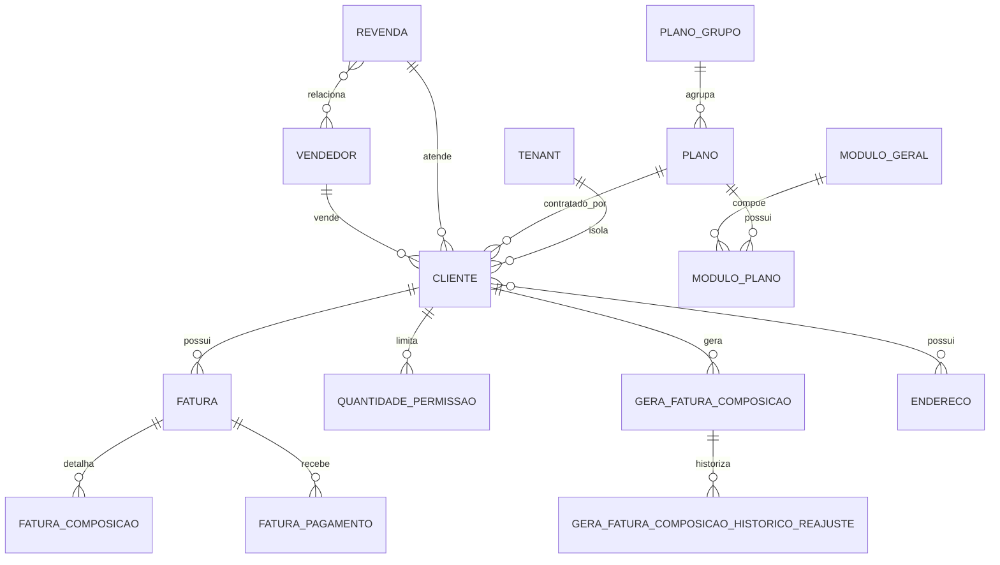

# EF 0_APLICATIVO LIMITES_DE_PLANO V1

**Projeto:** Epros  
**Empresa:** Siser  
**Tipo de documento:** Especificacao Funcional definitiva  
**Versao:** V1  
**Modulo:** APLICATIVO  
**Submodulo:** LIMITES_DE_PLANO  
**ID funcional:** APP-TEN-005  
**Status:** Pronto para validacao humana  
**Data:** 2026-06-06

## 1. Controle do documento

| Item | Conteudo |
|---|---|
| Responsavel pela elaboracao | Agente de analise e refinamento funcional |
| Responsavel pela validacao funcional | Siser |
| Responsavel pela validacao tecnica | Siser |
| Area dona do processo | Plataforma SaaS / Comercial / Cobranca |
| Publico-alvo | Produto, negocio, implantacao, desenvolvimento, QA, suporte, financeiro, comercial e operacao Siser |
| Fonte de verdade | Esta EF descreve o comportamento funcional esperado do Epros para limites de plano, quotas, modulos contratados, faturas SaaS e bloqueios de uso |

## 2. Objetivo funcional

O submodulo Limites de Plano controla quais capacidades cada cliente pode utilizar no Epros, conforme plano contratado, modulos ativos, limites quantitativos, situacao financeira e status da assinatura.

| Pergunta | Resposta |
|---|---|
| Para que o submodulo existe? | Para garantir que usuarios, empresas, locais, produtos, fornecedores, clientes, documentos, compras, armazenamento, modulos e acesso operacional respeitem o plano contratado. |
| Que problema de negocio resolve? | Evita uso acima do contratado, uso com plano inativo, uso por cliente inadimplente, ativacao indevida de modulo e perda de controle entre plano comercial, fatura e permissao operacional. |
| Qual resultado operacional deve produzir? | O Epros deve liberar, bloquear ou orientar upgrade antes da criacao de recurso ou acesso a funcionalidade, mantendo cobranca SaaS e permissao operacional consistentes. |
| Quais areas dependem dele? | Onboarding, Identidade, Permissoes, Area do Cliente, Financeiro SaaS, Vendas, Compras, Estoque, Cadastro de Pessoas, Cadastro de Produtos, Empresas, Usuarios, Modulos e Relatorios. |

## 3. Escopo funcional

### 3.1 Dentro do escopo

| Capacidade | Descricao | Observacao |
|---|---|---|
| Cadastro de planos comerciais | Manter plano, grupo de plano, valor, descricao, periodo de vigencia, quantidade de usuarios, quantidade de empresas, modulos e recursos inclusos. | Campos identificados no material. |
| Controle de modulos por plano | Definir quais modulos gerais compoem cada plano e se estao ativos. | Modulo inativo nao deve ficar disponivel ao cliente. |
| Controle de limites quantitativos | Controlar limites de usuario, empresa, local, produto, cliente, fornecedor, fatura/documento, compra e armazenamento. | O material traz mais de uma semantica para ilimitado; a decisao final esta na MC. |
| Projecao de limites no cliente/owner | Projetar limites efetivos de usuario e armazenamento no dono logico do ambiente. | Usado para validacoes rapidas. |
| Verificacao antes da criacao | Validar assinatura, modulo e quota antes de criar recurso controlado. | Deve ocorrer antes da persistencia. |
| Bloqueio por plano inativo | Impedir uso operacional quando o plano estiver inativo. | Mensagens finais precisam padronizacao. |
| Bloqueio por assinatura expirada ou inexistente | Restringir rotas e uso operacional quando assinatura nao estiver valida. | Subusuarios podem ser direcionados a encerramento de sessao conforme regra aprovada. |
| Bloqueio por inadimplencia | Bloquear uso quando houver fatura aguardando pagamento com atraso superior ao prazo de tolerancia informado. | Prazo identificado: 15 dias. |
| Area do cliente | Exibir faturas, faturas vencidas, QR code PIX, planos disponiveis e fluxo de registro por plano. | Inclui filtros por status e acao de pagamento. |
| Backoffice Siser | Administrar clientes SaaS, planos, modulos, revendas, vendedores, faturas, pagamentos, grupos de planos e composicoes. | Telas e campos foram preservados. |
| Geracao de faturas SaaS | Criar cobrancas mensais com composicoes, vencimento, valores, comissoes, pagamentos e historico de reajuste. | Duplicidade de mes/ano e composicao obrigatoria precisam validacao efetiva. |
| Geracao de cobranca PIX | Solicitar geracao de cobranca para fatura e armazenar dados de pagamento e QR code. | Contrato funcional preservado. |
| Integracao por token de sistema | Permitir consulta/inclusao controlada de clientes, planos, faturas e cobrancas por sistema autorizado. | Deve exigir token valido. |
| Webhook de pagamento | Receber confirmacao de pagamento e atualizar fatura/pagamento. | Detalhe de idempotencia esta na MC. |
| Canal comercial | Controlar revenda, vendedor, comissoes e vinculos comerciais do cliente. | Campos preservados. |

### 3.2 Fora do escopo

| Item fora do escopo | Motivo | Destino correto |
|---|---|---|
| Cadastro completo de usuarios | Este submodulo valida limite; o cadastro e permissoes pertencem a identidade/permissoes. | IDENTIDADE_E_CONTEXTO_TENANT; USUARIOS_E_PAPEIS |
| Cadastro completo de empresa operacional do cliente | Este submodulo limita quantidade e registra vinculo comercial; os detalhes fiscais e operacionais pertencem a cadastros base. | ONBOARDING_E_EMPRESA; CADASTROS_BASE |
| Cadastro completo de produto, cliente e fornecedor operacional | Este submodulo valida quotas; os cadastros pertencem aos modulos donos. | CADASTROS_BASE; ESTOQUE; VENDAS; COMPRAS |
| Processamento contabil e financeiro operacional | Este submodulo trata cobranca SaaS da Siser. | FINANCEIRO |
| Documento fiscal, documento de venda e compra operacional | Este submodulo limita quantidades quando aplicavel; o processo de documento pertence aos modulos donos. | VENDAS; COMPRAS; FISCAL quando existir |
| Politica fiscal de tabelas tributarias | O material cita rotinas de apoio, mas o dominio pertence a fiscal/cadastros. | CADASTROS_BASE ou modulo fiscal definido pela Siser |

## 4. Glossario e conceitos funcionais

| Termo | Definicao funcional | Observacoes |
|---|---|---|
| Plano | Pacote comercial contratado pelo cliente, com valor, vigencia, modulos, recursos e limites. | Entidade central do submodulo. |
| Grupo de plano | Agrupador comercial de planos. | Campo identificado; estrutura completa nao informada. |
| Modulo geral | Recurso funcional que pode ser incluido em um plano. | Pode estar ativo ou inativo. |
| Modulo do plano | Vinculo entre plano e modulo geral, com descricao, valor e status. | Entidade de relacionamento. |
| Limite de plano | Quantidade maxima permitida para um recurso controlado. | Usuarios, empresas, produtos, locais, clientes, fornecedores, documentos, compras, armazenamento. |
| Quota | Limite numerico consumido por uso ou cadastro. | Termo usado nesta EF como sinonimo funcional de limite quantitativo. |
| Recurso ilimitado | Recurso que nao possui limite numerico de consumo. | O material usa `0` e `-1`; decisao final na MC. |
| Cliente SaaS | Cliente da Siser que possui assinatura, plano, faturas e ambiente Epros. | Nao confundir com cliente comercial cadastrado pelo cliente dentro do Epros. |
| Empresa cliente | Empresa operacional vinculada ao cliente SaaS dentro do Epros. | Pode ter limite de quantidade. |
| Empresa comercial Siser | Empresa usada pela operacao comercial Siser. | Aparece em telas e cadastro interno. |
| Revenda | Parceiro comercial associado ao cliente SaaS. | Possui percentual de comissao. |
| Vendedor | Pessoa comercial vinculada a uma ou mais revendas. | Possui percentual de comissao. |
| Fatura SaaS | Cobranca da Siser contra o cliente SaaS. | Possui composicoes, status, pagamento e vencimento. |
| Composicao de fatura | Item que compoe valor de uma fatura SaaS. | Pode ser reajustavel quando gerado por regra recorrente. |
| Fatura vencida bloqueante | Fatura aguardando pagamento com atraso superior ao prazo de tolerancia. | Prazo identificado: 15 dias. |
| Area do cliente | Interface do cliente SaaS para consultar faturas, pagar, ver vencidas e escolher plano. | Inclui QR code PIX. |
| Backoffice Siser | Interface interna da Siser para manter clientes, faturas, planos, modulos, revendas e vendedores. | Requer permissao interna. |
| Token de sistema | Credencial usada por sistema autorizado para consultar ou registrar dados SaaS. | Deve ser validada em toda chamada protegida. |

## 5. Atores, papeis e responsabilidades

| Ator/Papel | Responsabilidade | Permissoes esperadas | Restricoes |
|---|---|---|---|
| Cliente SaaS | Contratar plano, acessar area do cliente, consultar faturas e realizar pagamento. | Ver seus planos, faturas e dados de pagamento. | Restrito ao proprio tenant/cliente. |
| Usuario administrador do cliente | Administrar usuarios, empresas e recursos dentro dos limites do plano. | Criar recursos permitidos. | Nao pode exceder limite contratado. |
| Usuario operacional do cliente | Usar modulos contratados e recursos permitidos. | Acesso conforme perfil e plano. | Pode ser bloqueado se plano/assinatura/fatura estiver invalida. |
| Administrador Siser | Manter planos, clientes SaaS, faturas, modulos, revendas, vendedores e configuracoes comerciais. | CRUD administrativo e ajuste de cobranca conforme politica. | Deve respeitar segregacao e auditoria. |
| Financeiro Siser | Acompanhar faturas, pagamentos, vencidas, PIX e comissoes. | Consultar e registrar pagamentos. | Alteracoes financeiras devem ser auditaveis. |
| Comercial Siser | Gerenciar revendas, vendedores, planos, clientes e comissoes. | Manter dados comerciais. | Nao deve alterar pagamento sem permissao financeira. |
| Sistema | Verificar assinatura, modulo, limite, status financeiro e registrar bloqueios. | Execucao automatica. | Nao pode criar recurso controlado sem validacao previa. |
| Integracao autorizada | Consultar planos/faturas/clientes e gerar cobrancas conforme contrato. | Acesso por token de sistema. | Requer token valido e escopo permitido. |

## 6. Visao operacional do submodulo

1. A Siser cadastra grupos de planos, planos, modulos gerais, modulos do plano, limites e valores.
2. A Siser cadastra ou recebe o cadastro de um cliente SaaS, associando plano, revenda, vendedor, dados cadastrais, dia de vencimento, composicoes e quantidades permitidas.
3. O Epros cria ou identifica o ambiente do cliente e projeta limites efetivos para uso operacional.
4. Ao iniciar sessao ou acessar rota protegida, o Epros verifica se existe assinatura/plano valido, se o plano esta ativo e se ha bloqueio financeiro.
5. Antes de criar recurso controlado, o Epros calcula o consumo atual do recurso dentro do tenant/cliente e compara com o limite aplicavel.
6. Se a criacao solicitada ultrapassar o limite, o Epros bloqueia a operacao e orienta regularizacao ou upgrade.
7. Se o recurso for ilimitado conforme padrao aprovado, o Epros permite a criacao sem bloquear por quantidade.
8. Se o modulo nao estiver ativo no plano, o Epros nao permite uso funcional do modulo.
9. A area do cliente exibe faturas, faturas vencidas e cobrancas PIX, permitindo iniciar pagamento.
10. O backoffice Siser mantem faturas, registra pagamento manual quando permitido, altera vencimento/valor quando autorizado e acompanha comissoes.
11. Quando uma fatura aguardando pagamento ultrapassa 15 dias de atraso, o Epros bloqueia uso operacional e direciona o cliente para regularizacao.
12. Webhooks ou consultas de pagamento atualizam fatura e pagamento, liberando o uso quando a regra financeira permitir.

## 7. Capacidades funcionais

### 7.1 Cadastro e manutencao de planos

| Item | Especificacao |
|---|---|
| Objetivo | Manter planos comerciais do Epros com valor, descricao, vigencia, quantidade de usuarios, quantidade de empresas, recursos inclusos e modulos vinculados. |
| Acionamento | Manual pelo backoffice Siser ou por integracao autorizada quando aprovado. |
| Pre-condicoes | Grupo de plano existente quando exigido. |
| Dados de entrada | Nome, descricao curta, descricao completa, valor, quantidade de usuarios, quantidade de empresas, data inicio, data fim, ativo, recursos inclusos e modulos. |
| Processamento | Validar obrigatoriedade, associar grupo, gravar plano, gravar modulos do plano e expor plano ativo para contratacao. |
| Resultado esperado | Plano disponivel para associacao a cliente SaaS e para validacao de limites. |
| Pos-condicoes | Alteracoes devem refletir em novas contratacoes e em clientes conforme regra comercial aprovada. |
| Excecoes | Plano inativo nao deve permitir nova contratacao. |
| Auditoria | Registrar criacao, alteracao, usuario responsavel, data e campos alterados. |

### 7.2 Cadastro de cliente SaaS e plano contratado

| Item | Especificacao |
|---|---|
| Objetivo | Registrar cliente SaaS com plano, revenda, vendedor, dados cadastrais, dia de vencimento, composicoes e quantidades permitidas. |
| Acionamento | Backoffice Siser, registro de cliente novo ou fluxo de contratacao por plano. |
| Pre-condicoes | Plano ativo, revenda e vendedor definidos quando obrigatorios. |
| Dados de entrada | Empresa comercial Siser, revenda, plano, vendedor, documento, nome, empresa nome, email, telefone, dia de vencimento, ativo, endereco, composicoes e quantidades de permissao. |
| Processamento | Validar dados obrigatorios, criar cliente SaaS, vincular plano, registrar enderecos, composicoes e quantidades de permissao, e disponibilizar ambiente. |
| Resultado esperado | Cliente SaaS apto a acessar o Epros conforme plano e situacao financeira. |
| Pos-condicoes | O cliente passa a possuir faturas, limites e modulos vinculados. |
| Excecoes | IDs comerciais fixos nao devem ser usados sem parametrizacao aprovada. |
| Auditoria | Registrar responsavel pela criacao e alteracoes cadastrais. |

### 7.3 Verificacao de plano ativo

| Item | Especificacao |
|---|---|
| Objetivo | Impedir uso operacional quando o plano do cliente estiver inativo. |
| Acionamento | Login, carregamento de layout, acesso a rota protegida ou criacao de recurso. |
| Pre-condicoes | Cliente SaaS identificado. |
| Dados de entrada | Tenant/cliente, plano contratado e indicador de ativo. |
| Processamento | Verificar status ativo antes das demais validacoes de uso. |
| Resultado esperado | Plano ativo permite seguir para validacao de modulo e limite; plano inativo bloqueia. |
| Pos-condicoes | Uso operacional fica liberado ou bloqueado. |
| Excecoes | Mensagem final de bloqueio deve ser padronizada pela Siser. |
| Auditoria | Registrar bloqueios por plano inativo. |

### 7.4 Verificacao de modulo contratado

| Item | Especificacao |
|---|---|
| Objetivo | Garantir que somente modulos ativos e contratados estejam disponiveis ao cliente. |
| Acionamento | Acesso a funcionalidade, menu, rota, tela ou operacao de modulo. |
| Pre-condicoes | Plano e tenant/cliente identificados. |
| Dados de entrada | Modulo geral, modulo do plano, status ativo e cliente. |
| Processamento | Confirmar existencia do modulo, status ativo e vinculacao ao plano do cliente. |
| Resultado esperado | Modulo liberado quando contratado e ativo; indisponivel quando ausente ou inativo. |
| Pos-condicoes | Menus e operacoes devem refletir disponibilidade do modulo. |
| Excecoes | Usuario interno da Siser pode ter excecao operacional apenas se aprovada e auditada. |
| Auditoria | Registrar tentativas de acesso a modulo nao contratado quando relevante. |

### 7.5 Verificacao de limite antes da criacao

| Item | Especificacao |
|---|---|
| Objetivo | Bloquear criacao de recurso quando a nova criacao ultrapassar o limite do plano. |
| Acionamento | Criacao de usuario, empresa, local, produto, cliente, fornecedor, fatura/documento, compra ou outro recurso controlado. |
| Pre-condicoes | Plano ativo, cliente identificado, modulo aplicavel ativo e consumo atual calculavel. |
| Dados de entrada | Tipo de recurso, limite contratado, consumo atual e quantidade solicitada. |
| Processamento | Calcular consumo atual do recurso no tenant/cliente, somar a criacao solicitada e comparar com limite aplicavel. |
| Resultado esperado | Criacao permitida quando dentro do limite ou bloqueada quando ultrapassar. |
| Pos-condicoes | Consumo passa a refletir o novo recurso quando a criacao for aceita. |
| Excecoes | Recurso ilimitado ignora bloqueio numerico conforme padrao aprovado. |
| Auditoria | Registrar bloqueios por limite excedido com recurso, consumo, limite e usuario. |

### 7.6 Projecao de limites no owner

| Item | Especificacao |
|---|---|
| Objetivo | Manter no dono logico do ambiente os limites efetivos de usuarios e armazenamento para consulta rapida. |
| Acionamento | Atribuicao ou alteracao de plano. |
| Pre-condicoes | Plano existente e owner identificado. |
| Dados de entrada | Numero de usuarios do plano, limite de armazenamento e owner. |
| Processamento | Atualizar limite total de usuarios e armazenamento efetivo do owner; quando houver folga, reativar usuarios conforme regra aprovada. |
| Resultado esperado | Owner passa a refletir limites do plano atual. |
| Pos-condicoes | Validacoes de criacao usam limite atualizado. |
| Excecoes | Desativacao automatica de usuarios excedentes exige validacao humana. |
| Auditoria | Registrar troca de plano, limites anteriores e novos. |

### 7.7 Controle financeiro de fatura SaaS

| Item | Especificacao |
|---|---|
| Objetivo | Gerar, manter, consultar e liquidar faturas SaaS do cliente. |
| Acionamento | Rotina de geracao, acao do backoffice Siser, area do cliente ou integracao autorizada. |
| Pre-condicoes | Cliente SaaS ativo, composicoes validas e vencimento definido. |
| Dados de entrada | Cliente, vencimento, composicoes, valor total, percentuais de comissao, status, pagamento e observacoes. |
| Processamento | Criar fatura, calcular valor, vincular composicoes, registrar pagamentos e atualizar status conforme pagamento. |
| Resultado esperado | Fatura SaaS consistente, consultavel e pagavel. |
| Pos-condicoes | Status financeiro do cliente fica atualizado. |
| Excecoes | Duplicidade de fatura no mesmo periodo e falta de composicao devem bloquear geracao quando regra for aprovada. |
| Auditoria | Registrar criacao, alteracoes, pagamento manual, webhook e mudancas de status. |

### 7.8 Bloqueio por inadimplencia

| Item | Especificacao |
|---|---|
| Objetivo | Bloquear uso operacional quando houver fatura aguardando pagamento com atraso superior ao prazo de tolerancia. |
| Acionamento | Login, verificacao de rota, carregamento de contexto ou rotina de status financeiro. |
| Pre-condicoes | Cliente SaaS identificado e faturas consultaveis. |
| Dados de entrada | Status da fatura, data de vencimento e data atual. |
| Processamento | Identificar faturas aguardando pagamento com atraso superior a 15 dias. |
| Resultado esperado | Cliente bloqueado e direcionado para area de regularizacao. |
| Pos-condicoes | Uso operacional volta a ser avaliado apos pagamento/regularizacao. |
| Excecoes | Prazo de tolerancia parametrizavel nao foi informado; a MC registra decisao. |
| Auditoria | Registrar bloqueio, fatura relacionada e data de avaliacao. |

### 7.9 Area do cliente

| Item | Especificacao |
|---|---|
| Objetivo | Permitir que o cliente SaaS consulte faturas, faturas vencidas, detalhes de pagamento e planos. |
| Acionamento | Acesso do cliente autenticado. |
| Pre-condicoes | Cliente SaaS identificado. |
| Dados de entrada | Cliente, filtros de status, faturas e planos disponiveis. |
| Processamento | Exibir faturas, filtrar aguardando pagamento/vencidas, exibir QR code PIX e permitir iniciar contratacao por plano. |
| Resultado esperado | Cliente consegue entender sua situacao financeira e realizar pagamento. |
| Pos-condicoes | Pagamento iniciado gera ou consulta cobranca associada. |
| Excecoes | Falha ao gerar cobranca deve exibir retorno claro e manter fatura intacta. |
| Auditoria | Registrar solicitacao de cobranca e acesso a faturas quando exigido. |

### 7.10 Geracao de cobranca PIX

| Item | Especificacao |
|---|---|
| Objetivo | Gerar cobranca PIX vinculada a uma fatura SaaS. |
| Acionamento | Area do cliente, backoffice Siser ou integracao autorizada. |
| Pre-condicoes | Fatura existente, valor valido e cliente identificado. |
| Dados de entrada | FaturaId, numero, data de vencimento, valor, cliente e observacoes quando existirem. |
| Processamento | Solicitar cobranca ao provedor de pagamento, armazenar identificador, expiracao, URL, QR code e dados de retorno. |
| Resultado esperado | Fatura passa a ter cobranca PIX disponivel para pagamento. |
| Pos-condicoes | Webhook ou consulta posterior pode confirmar pagamento. |
| Excecoes | Reprocessamento da mesma fatura exige idempotencia definida. |
| Auditoria | Registrar solicitacao, retorno, identificador de pagamento e usuario/processo. |

## 8. Regras de negocio

| Regra | Descricao | Condicao | Resultado | Severidade | Observacoes |
|---|---|---|---|---|---|
| REG-001 | O Epros deve validar plano ativo antes de liberar uso operacional. | Login, rota protegida ou criacao de recurso. | Plano inativo bloqueia uso. | Bloqueante | Mensagem final deve ser padronizada. |
| REG-002 | O Epros deve validar modulo ativo antes de liberar funcionalidade do modulo. | Acesso a recurso modular. | Modulo ausente ou inativo fica indisponivel. | Bloqueante | Inclui menu e operacao direta. |
| REG-003 | Toda criacao de recurso controlado deve verificar limite antes de gravar. | Criacao de recurso com quota. | Criacao acima do limite e bloqueada. | Bloqueante | O consumo deve considerar a criacao solicitada. |
| REG-004 | O limite de usuarios deve ser aplicado de forma efetiva. | Criacao ou ativacao de usuario com acesso. | Epros permite dentro do limite e bloqueia acima. | Bloqueante | Em uma fonte o limite aparece apenas exibido; lacuna na MC. |
| REG-005 | O limite de empresas deve ser aplicado por cliente SaaS. | Criacao de empresa cliente. | Bloqueia quando nova empresa ultrapassar o limite. | Bloqueante | Tipo de permissao 0 tambem representa limite de empresas. |
| REG-006 | O limite de usuarios por permissao deve considerar usuarios com login habilitado. | Criacao/ativacao de usuario. | Bloqueia quando quantidade com login ultrapassar limite. | Bloqueante | Tipo de permissao 1 representa limite de usuarios. |
| REG-007 | O limite de produtos deve contar produtos do tenant/cliente. | Criacao de produto. | Bloqueia quando novo produto ultrapassar limite. | Bloqueante | Consumo por TenantId. |
| REG-008 | O limite de clientes comerciais deve contar pessoas do tipo cliente. | Criacao de cliente comercial. | Bloqueia quando novo cliente ultrapassar limite. | Bloqueante | Consumo por tipo e tenant/cliente. |
| REG-009 | O limite de fornecedores deve contar pessoas do tipo fornecedor. | Criacao de fornecedor. | Bloqueia quando novo fornecedor ultrapassar limite. | Bloqueante | Consumo por tipo e tenant/cliente. |
| REG-010 | O limite de faturas/documentos deve contar documentos vinculados ao tenant/cliente conforme semantica aprovada. | Criacao de documento controlado. | Bloqueia quando novo documento ultrapassar limite. | Bloqueante | O material apresenta divergencia de semantica; MC. |
| REG-011 | O limite de locais deve bloquear novo local quando o total ultrapassar a quota. | Criacao de local. | Bloqueia e orienta upgrade. | Bloqueante | `0` como ilimitado aparece no material; decisao na MC. |
| REG-012 | O limite de compras deve ser avaliado antes de registrar nova compra quando o plano controlar compras. | Criacao de compra. | Bloqueia se ultrapassar limite. | Bloqueante | Relaciona-se com Compras. |
| REG-013 | O limite de armazenamento deve ser convertido para unidade operacional unica antes da comparacao. | Upload/uso de armazenamento. | Bloqueia quando uso ultrapassar limite. | Bloqueante | Conversao identificada em bytes; padrao final na MC. |
| REG-014 | Recurso ilimitado nao deve bloquear por quantidade. | Limite marcado como ilimitado. | Criacao permitida se demais regras estiverem validas. | Bloqueante | Padrao `0` ou `-1` esta em decisao. |
| REG-015 | Atribuicao de novo plano deve atualizar limites efetivos do owner/cliente. | Troca ou atribuicao de plano. | Limites ficam sincronizados. | Bloqueante | Usuarios e armazenamento identificados. |
| REG-016 | Quando o limite de usuarios diminuir abaixo do uso atual, o comportamento deve ser aprovado pela Siser. | Downgrade de plano. | Epros deve bloquear novas criacoes ou aplicar politica aprovada. | Decisao | Material cita desativacao automatica de usuarios recentes. |
| REG-017 | Fatura aguardando pagamento com atraso superior a 15 dias deve bloquear uso operacional. | Verificacao de status financeiro. | Cliente e direcionado para regularizacao. | Bloqueante | Prazo identificado no material. |
| REG-018 | Area do cliente deve exibir faturas aguardando pagamento e vencidas. | Consulta de faturas pelo cliente. | Cliente visualiza pendencias. | Informativa | Inclui filtros por status. |
| REG-019 | Geracao de cobranca PIX deve vincular retorno a fatura. | Solicitacao de cobranca. | Fatura possui PaymentId, expiracao, URL e QR code quando retornados. | Bloqueante | Campo PaymentId identificado. |
| REG-020 | Webhook de pagamento deve atualizar fatura e pagamento de forma rastreavel. | Recebimento de confirmacao. | Status e valores sao atualizados. | Bloqueante | Idempotencia nao informada. |
| REG-021 | Fatura SaaS deve possuir cliente, vencimento, valor total e status. | Criacao de fatura. | Fatura fica valida para cobranca. | Bloqueante | Campos obrigatorios preservados. |
| REG-022 | Fatura SaaS quitada deve registrar data de pagamento e valor pago. | Liquidacao. | Fatura e pagamento refletem quitacao. | Bloqueante | Valor pago obrigatorio no material. |
| REG-023 | Composicao de fatura deve possuir descricao e valor. | Criacao de item de fatura. | Item fica apto a compor valor total. | Bloqueante | Campos obrigatorios preservados. |
| REG-024 | Regra recorrente de composicao pode possuir data final. | Cadastro de composicao recorrente. | Composicao deixa de valer apos data final quando informada. | Informativa | Campo DataFinal identificado. |
| REG-025 | Reajuste de composicao deve preservar valor atual, valor novo, percentual e tipo. | Reajuste de composicao. | Historico de reajuste fica registrado. | Bloqueante | Campos obrigatorios preservados. |
| REG-026 | Cliente SaaS deve ter plano, revenda e vendedor quando esses campos forem obrigatorios. | Cadastro de cliente. | Cadastro sem dados obrigatorios e bloqueado. | Bloqueante | Obrigatoriedade preservada. |
| REG-027 | Cliente SaaS deve ter documento e email obrigatorios. | Cadastro de cliente. | Cadastro sem documento/email e bloqueado. | Bloqueante | Campos obrigatorios preservados. |
| REG-028 | Dia de vencimento do cliente deve ser informado. | Cadastro de cliente. | Epros consegue gerar faturas. | Bloqueante | Tipo/dominio nao informado. |
| REG-029 | Quantidade de permissao deve informar tipo e quantidade. | Cadastro de permissao/limite. | Limite pode ser interpretado. | Bloqueante | Tipo 0 empresa; tipo 1 usuario. |
| REG-030 | Revenda deve possuir percentual de comissao. | Cadastro de revenda. | Comissao pode ser calculada. | Bloqueante | Decimal(18,2). |
| REG-031 | Vendedor deve possuir email e percentual de comissao. | Cadastro de vendedor. | Contato e comissao ficam definidos. | Bloqueante | Relacao N:N com revenda. |
| REG-032 | Plano ativo pode ser exibido para contratacao. | Consulta publica de planos. | Cliente pode iniciar registro por plano. | Informativa | Fluxo por planoId identificado. |
| REG-033 | Token de sistema deve ser obrigatorio para contratos protegidos. | Chamadas de integracao protegidas. | Chamada sem token valido e rejeitada. | Bloqueante | Escopos finais na MC. |
| REG-034 | Cadastro de cliente novo nao deve depender de identificadores fixos sem parametrizacao. | Onboarding/registro. | Parametros comerciais devem ser definidos. | Bloqueante | Item enviado a MC. |
| REG-035 | Mensagens de limite, plano inativo e inadimplencia devem ser distintas. | Bloqueios de uso. | Usuario entende a causa correta. | Alerta | Material apresenta mensagem unica. |

## 9. Parametros de configuracao

| Parametro | Finalidade | Tipo/formato | Valor padrao | Obrigatorio | Nivel | Quem pode alterar | Impacto |
|---|---|---|---|---|---|---|---|
| Prazo de tolerancia de fatura vencida | Define apos quantos dias de atraso o uso e bloqueado. | Inteiro em dias | 15 | Sim | Global/Siser | Administrador Siser | Bloqueio por inadimplencia. |
| Padrao de recurso ilimitado | Define se ilimitado sera representado por 0, -1 ou outro marcador. | Inteiro/dominio | Nao informado no material | Sim | Global/Siser | Administrador Siser | Evita interpretacao divergente de quotas. |
| Unidade de armazenamento | Define unidade oficial para limite e consumo de armazenamento. | Dominio | Nao informado no material | Sim | Global/Siser | Administrador Siser | Comparacao de storage. |
| Politica de downgrade de usuarios | Define comportamento quando plano novo suporta menos usuarios que o uso atual. | Dominio | Nao informado no material | Sim | Global/Siser | Administrador Siser | Pode bloquear novas criacoes ou desativar usuarios. |
| Mensagem de plano inativo | Texto exibido quando plano estiver inativo. | Texto | Nao informado no material | Sim | Global/Siser | Administrador Siser | Experiencia e suporte. |
| Mensagem de limite excedido | Texto exibido quando recurso ultrapassar limite. | Texto | Nao informado no material | Sim | Global/Siser | Administrador Siser | Experiencia e suporte. |
| Mensagem de inadimplencia | Texto exibido quando cliente estiver bloqueado por fatura vencida. | Texto | Nao informado no material | Sim | Global/Siser | Administrador Siser | Regularizacao financeira. |
| Parametros comerciais de onboarding | Empresa comercial Siser, revenda, vendedor e plano padrao quando aplicavel. | Identificadores | Nao informado no material | Sim | Global/Siser | Administrador Siser | Cadastro de cliente novo. |
| Token de sistema | Credencial para contratos protegidos. | Texto seguro | Nao informado no material | Sim | Global/Siser | Administrador Siser | Seguranca de integracoes. |

## 10. Modelo de dados funcional e implantavel

### 10.1 Visao geral do modelo

O modelo do submodulo combina cadastros comerciais SaaS, tabelas de plano/modulo, tabelas de limite, movimentos de fatura/pagamento, historico de reajuste, contratos de area do cliente e estruturas de integracao.

| Grupo de dados | Entidades/tabelas | Papel funcional | Observacoes |
|---|---|---|---|
| Cadastros mestres | tenant, cliente, plano, plano_grupo, modulo_geral, revenda, vendedor | Sustentam cliente SaaS, plano contratado, catalogo comercial e canal de venda. | plano_grupo aparece por campo, mas tabela completa nao foi detalhada. |
| Movimentos/transacoes | fatura, fatura_pagamento | Controlam cobranca SaaS, pagamento, status, vencimento e valores. | Fatura esta associada a cliente e tenant. |
| Itens e historico | fatura_composicao, gera_fatura_composicao, gera_fatura_composicao_historico_reajuste | Compõem valores de fatura, regras recorrentes e historico de reajuste. | Campos com precisao monetaria preservados. |
| Tabelas auxiliares | quantidade_permissao, modulo_plano | Guardam limites e modulos vinculados ao plano. | Tipo 0 empresa; Tipo 1 usuario. |
| Relacionamentos comerciais | ClienteEndereco, RevendaVendedor, EmpresaRevenda | Associam cliente a enderecos, vendedor a revenda e empresa comercial a revenda. | Campos completos dos relacionamentos nao informados. |
| Contratos de integracao | FaturaCliente, Fatura, GerarPix, PixCobranca, Plano, QuantidadePermissao, RegistroClienteNovo, Endereco | Estruturas de consulta/entrada/saida para area do cliente e integracoes. | Alguns contratos possuem duplicidade de campos no material. |

### 10.2 Entidades e tabelas

| Entidade funcional | Tabela/estrutura | Tipo | Finalidade | Chave primaria | Observacoes de implantacao |
|---|---|---|---|---|---|
| Tenant SaaS | tenant | Mestre | Identificar ambiente/cliente e status base. | Id; TenantId quando informado em estrutura complementar | Existem duas estruturas de tenant no material; consolidacao na MC. |
| Cliente SaaS | cliente | Mestre | Registrar cliente, plano, revenda, vendedor, contato, vencimento e status. | Id | TenantId obrigatorio e vinculos comerciais obrigatorios. |
| Plano comercial | plano | Mestre | Definir pacote comercial, valores, vigencia, usuarios, empresas e recursos. | Id | PlanoGrupoId obrigatorio. |
| Grupo de plano | plano_grupo | Mestre | Agrupar planos comerciais. | Nao informado no material | Campo PlanoGrupoId aparece em plano e telas. |
| Modulo geral | modulo_geral | Mestre | Catalogar modulos contrataveis. | Id | Descricao e Ativo obrigatorios. |
| Modulo do plano | modulo_plano | Relacionamento | Vincular plano a modulo geral com descricao, valor e ativo. | Id | FK com exclusao em cascata. |
| Quantidade de permissao | quantidade_permissao | Auxiliar | Controlar limite por tipo para cliente/plano. | Id | Tipo 0 empresa; Tipo 1 usuario. |
| Revenda | revenda | Mestre | Registrar parceiro comercial e percentual de comissao. | Id | TenantId, Nome, PercentualComissao e Ativo obrigatorios. |
| Vendedor | vendedor | Mestre | Registrar vendedor, email, telefone, comissao e status. | Id | Material traz TenantId duplicado; MC. |
| Fatura SaaS | fatura | Movimento | Registrar cobranca mensal, vencimento, valores, status, comissoes e pagamento. | Id | FK com exclusao em cascata. |
| Pagamento de fatura | fatura_pagamento | Movimento | Registrar dados de pagamento, tipo, valores, tarifa, expiracao e identificador. | Id | FK com exclusao em cascata. |
| Item de fatura | fatura_composicao | Movimento/Item | Registrar composicao individual da fatura. | Id | Descricao e Valor obrigatorios. |
| Composicao recorrente | gera_fatura_composicao | Auxiliar | Guardar regra de geracao de composicao para faturas futuras. | Id | FK com exclusao restrita. |
| Historico de reajuste | gera_fatura_composicao_historico_reajuste | Historico | Registrar reajustes de composicoes recorrentes. | Id | Valor atual, novo, percentual e tipo obrigatorios. |
| Endereco do cliente | endereco / ClienteEndereco | Relacionamento | Registrar enderecos do cliente e definir principal. | Nao informado no material | Um endereco principal por cliente citado. |
| Contrato de fatura do cliente | FaturaCliente | Contrato | Retornar dados resumidos do cliente vinculado a fatura. | Nao se aplica | Estrutura de integracao/consulta. |
| Contrato de cobranca PIX | GerarPix / PixCobranca | Contrato | Gerar e consultar dados de cobranca PIX. | Nao se aplica | PaymentId, QrCode e QrCodeBase64 identificados. |
| Limites de plano complementares | PlanUpgrade / PlanMaster / package_details | Auxiliar/Contrato | Representar plano ativo e limites maximos de usuario, cliente, fornecedor, produto e fatura. | Nao informado no material | Conteudo funcional incorporado, nomes mantidos apenas quando sao estrutura de dado citada. |

### 10.3 Relacionamentos, cardinalidade e dependencia

| Origem | Relacionamento | Destino | Cardinalidade | Obrigatorio | Regra de integridade |
|---|---|---|---|---|---|
| Cliente SaaS | contrata | Plano comercial | N:1 | Sim | Cliente exige PlanoId. |
| Cliente SaaS | pertence a | Tenant SaaS | N:1 | Sim | TenantId obrigatorio em cliente. |
| Cliente SaaS | vincula | Revenda | N:1 | Sim | RevendaId obrigatorio. |
| Cliente SaaS | vincula | Vendedor | N:1 | Sim | VendedorId obrigatorio. |
| Cliente SaaS | possui | Fatura SaaS | 1:N | Sim | Fatura pertence ao cliente/tenant. |
| Fatura SaaS | possui | Item de fatura | 1:N | Condicional | Composicao deve existir para fatura gerada por composicao; bloqueio na MC. |
| Fatura SaaS | possui | Pagamento de fatura | 1:N | Condicional | Pagamento existe quando houve tentativa/confirmacao. |
| Plano comercial | pertence a | Grupo de plano | N:1 | Sim | PlanoGrupoId obrigatorio. |
| Plano comercial | possui | Modulo do plano | 1:N | Condicional | Modulos vinculados definem disponibilidade. |
| Modulo do plano | referencia | Modulo geral | N:1 | Sim | ModuloGeralId obrigatorio. |
| Cliente SaaS | possui | Quantidade de permissao | 1:N | Condicional | Tipos determinam limite de empresa/usuario. |
| Cliente SaaS | possui | Endereco | N:N | Condicional | Um endereco principal por cliente. |
| Revenda | relaciona | Vendedor | N:N | Condicional | Relacao RevendaVendedor identificada. |
| Revenda | relaciona | Empresa comercial Siser | N:N | Condicional | Relacao EmpresaRevenda identificada. |
| Composicao recorrente | possui | Historico de reajuste | 1:N | Condicional | Historico registra reajustes. |

### 10.4 Chaves, unicidade, indices e constraints funcionais

| Entidade/tabela | Tipo de restricao | Campo(s) | Regra | Comportamento esperado |
|---|---|---|---|---|
| cliente | FK | RevendaId, VendedorId, PlanoId | Vinculos comerciais e plano sao obrigatorios. | Bloquear cadastro incompleto. |
| cliente | Relacionamento | ClienteEndereco | Cliente pode ter enderecos. | Permitir associacao e validar principal. |
| fatura | FK | ClienteId / TenantId | Fatura pertence ao cliente/tenant. | Bloquear fatura sem cliente. |
| fatura | Constraint funcional | Cliente, mes/ano de vencimento | Material indica necessidade de evitar duplicidade mensal. | Bloquear quando regra final for aprovada. |
| fatura_composicao | FK | FaturaId | Item pertence a fatura. | Excluir em cascata conforme material. |
| fatura_pagamento | FK | FaturaId | Pagamento pertence a fatura. | Excluir em cascata conforme material. |
| gera_fatura_composicao | FK | ClienteId / TenantId | Regra recorrente pertence ao cliente/tenant. | Exclusao restrita conforme material. |
| modulo_plano | FK | PlanoId, ModuloGeralId | Modulo do plano depende do plano e modulo geral. | Excluir em cascata conforme material. |
| quantidade_permissao | FK | ClienteId / TenantId | Limite pertence ao cliente/tenant. | Exclusao restrita conforme material. |
| vendedor | Relacionamento | RevendaVendedor | Vendedor pode se vincular a revendas. | N:N. |
| revenda | Relacionamento | EmpresaRevenda | Revenda pode se vincular a empresas comerciais. | N:N. |
| plano | Constraint funcional | Ativo, DataInicio, DataFim | Plano ativo e vigente pode ser ofertado/contratado. | Bloquear oferta quando inativo. |
| fatura_pagamento | Indice funcional | PaymentId | Identificador de pagamento deve permitir conciliacao. | Evitar duplicidade/idempotencia; regra final na MC. |
| todas as tabelas tenantizadas | Indice funcional | TenantId | Consultas e validacoes devem ser por tenant/cliente. | Garantir segregacao e desempenho. |

### 10.5 Regras de persistencia, exclusao e historico

| Entidade/tabela | Criacao | Alteracao | Exclusao/inativacao | Historico/auditoria | Retencao |
|---|---|---|---|---|---|
| cliente | Exige dados obrigatorios e plano. | Alteracao deve preservar rastreabilidade. | Inativar preferencialmente; exclusao nao detalhada. | DataCadastro, DataAlteracao e Deletado citados. | Nao informado no material. |
| tenant | Exige nome, documento e ativo. | Alteracao deve registrar DataAlteracao quando informada. | Deletado citado. | DataCadastro/DataAlteracao. | Nao informado no material. |
| plano | Exige campos comerciais obrigatorios. | Mudancas impactam contratacoes e clientes. | Inativar plano; exclusao fisica nao detalhada. | DataCadastro/DataAlteracao em contrato. | Nao informado no material. |
| modulo_geral | Exige descricao e ativo. | Alteracao impacta disponibilidade. | Inativar modulo. | Auditoria nao informada. | Nao informado no material. |
| modulo_plano | Criado dentro do plano. | Altera valor/descricao/status do modulo no plano. | Exclusao em cascata com plano. | Auditoria nao informada. | Nao informado no material. |
| fatura | Exige vencimento, valor total, status e percentuais. | Alteracao de vencimento/valor identificada em tela. | Exclusao nao detalhada. | Pagamento e status devem ser auditados. | Nao informado no material. |
| fatura_pagamento | Criado por pagamento manual, PIX ou retorno de pagamento. | Atualiza status, valores e datas. | Exclusao em cascata com fatura. | PaymentId, datas e valores preservados. | Nao informado no material. |
| fatura_composicao | Criada como item de fatura. | Alteracao deve recalcular valor total se aplicavel. | Exclusao em cascata com fatura. | Auditoria nao informada. | Nao informado no material. |
| gera_fatura_composicao | Criada para composicao recorrente. | Reajustes devem gerar historico. | Exclusao restrita. | Historico de reajuste separado. | Nao informado no material. |
| quantidade_permissao | Criada por tipo e quantidade. | Alteracao impacta bloqueios imediatamente. | Exclusao restrita. | Auditoria nao informada. | Nao informado no material. |
| revenda | Exige nome, comissao e ativo. | Alteracao impacta calculo de comissao. | Inativar preferencialmente. | Auditoria nao informada. | Nao informado no material. |
| vendedor | Exige nome, email, comissao e ativo. | Alteracao impacta contato/comissao. | Inativar preferencialmente. | Auditoria nao informada. | Nao informado no material. |

### 10.6 Diagrama logico funcional

### 10.7 Lacunas de modelo de dados

| Lacuna | Entidade/tabela afetada | Impacto | Encaminhamento para MC |
|---|---|---|---|
| Duas estruturas de tenant aparecem no material. | tenant | Risco de duplicidade de conceito e chave. | Sim |
| Tabela de grupo de plano nao foi detalhada. | plano_grupo | PlanoGrupoId obrigatorio sem dicionario completo. | Sim |
| Campos completos dos relacionamentos N:N nao foram informados. | ClienteEndereco, RevendaVendedor, EmpresaRevenda | Implantacao precisa chaves e regras. | Sim |
| Padrao unico para recurso ilimitado nao foi definido. | plano, limites complementares, quantidade_permissao | Regras podem divergir. | Sim |
| Semantica final de limite de fatura/documento/compra diverge. | limites de documento | Bloqueio pode mirar recurso errado. | Sim |
| Idempotencia de pagamento e webhook nao foi detalhada. | fatura_pagamento | Risco de pagamento duplicado. | Sim |
| Obrigatoriedade de composicao para gerar fatura precisa regra efetiva. | fatura, fatura_composicao, gera_fatura_composicao | Risco de fatura sem base de valor. | Sim |
| Politica de downgrade de usuarios nao esta fechada. | usuario/owner/plano | Pode desativar usuario indevidamente. | Sim |

## 11. Dicionario de dados implantavel

### 11.1 Entidade: Tenant SaaS

**Finalidade:** identificar ambiente/cliente e permitir isolamento, autenticacao por token e status ativo.

| Campo | Tipo/formato | Tamanho/precisao/dominio | Obrigatorio | Chave/relacionamento | Regra funcional/observacao |
|---|---|---|---|---|---|
| Id | Identificador | uniqueidentifier | Sim | PK | Campo identificado em uma estrutura de tenant. |
| TenantId | Texto | varchar(200) | Sim | Indice/Fronteira | Campo identificado em estrutura complementar. |
| Nome | Texto | varchar(100) ou varchar(150) | Sim | Informativo | Tamanho divergente entre estruturas; MC. |
| Documento | Texto | varchar(20) | Sim | Informativo | Identificacao fiscal/documental quando aplicavel. |
| Contato | Texto | varchar(150) | Nao informado no material | Informativo | Campo identificado em estrutura complementar. |
| Telefone | Texto | varchar(20) | Nao | Informativo | Contato telefonico. |
| Token | Texto seguro | varchar(500) | Sim | Credencial | Usado para integracao/sistema autorizado quando aplicavel. |
| Ativo | Booleano | Sim/Nao | Sim | Status | Define disponibilidade. |
| DataCadastro | Data/hora | Nao informado no material | Sim | Auditoria | Campo obrigatorio em uma estrutura. |
| DataAlteracao | Data/hora | Nao informado no material | Nao | Auditoria | Alteracao cadastral. |
| Deletado | Booleano | Sim/Nao | Nao informado no material | Status | Exclusao logica citada. |

| Item | Especificacao |
|---|---|
| Chave primaria | Id; TenantId em estrutura complementar |
| Chaves unicas | Nao informado no material |
| Relacionamentos | Cliente SaaS, faturas e tabelas tenantizadas |
| Cardinalidade | 1:N com cliente/faturas/tabelas tenantizadas |
| Historico/auditoria | DataCadastro, DataAlteracao, Deletado |
| Regras de exclusao | Nao informado no material; Deletado sugere exclusao logica |
| Retencao de dados | Nao informado no material |

### 11.2 Entidade: Cliente SaaS

**Finalidade:** registrar cliente contratante da Siser, plano, canal comercial, contato, vencimento, enderecos, composicoes e quantidades de permissao.

| Campo | Tipo/formato | Tamanho/precisao/dominio | Obrigatorio | Chave/relacionamento | Regra funcional/observacao |
|---|---|---|---|---|---|
| Id | Identificador | uniqueidentifier | Sim | PK | Identificador do cliente. |
| TenantId | Texto | varchar(100) | Sim | Fronteira/FK | Tenant do cliente SaaS. |
| EmpresaId | Identificador | Nao informado no material | Sim nas telas | FK | Empresa comercial Siser associada quando aplicavel. |
| RevendaId | Identificador | Nao informado no material | Sim | FK | Revenda do cliente. |
| VendedorId | Identificador | Nao informado no material | Sim | FK | Vendedor do cliente. |
| PlanoId | Identificador | Nao informado no material | Sim | FK | Plano contratado. |
| Nome | Texto | varchar(100) | Sim | Informativo | Nome do cliente. |
| Documento | Texto | varchar(20) | Sim | Informativo | Documento do cliente. |
| Email | Texto | varchar(150) | Sim | Informativo | Email principal. |
| Telefone | Texto | varchar(20) | Nao | Informativo | Telefone. |
| DiaVencimento | Inteiro/Data parcial | Nao informado no material | Sim | Regra de faturamento | Dia usado para gerar cobrancas. |
| EmpresaNome | Texto | varchar(150) | Nao | Informativo | Nome de empresa exibido no cadastro. |
| Ativo | Booleano | Sim/Nao | Sim | Status | Cliente ativo ou inativo. |
| DataCadastro | Data/hora | Nao informado no material | Sim | Auditoria | Criacao do cliente. |
| DataAlteracao | Data/hora | Nao informado no material | Nao | Auditoria | Ultima alteracao. |
| Deletado | Booleano | Sim/Nao | Nao informado no material | Status | Exclusao logica citada. |
| Enderecos | Lista | Nao informado no material | Condicional | Relacionamento | Relacao N:N ClienteEndereco. |
| Composicoes | Lista | Nao informado no material | Condicional | Relacionamento | Composicoes de cobranca. |
| QtdePermissoes | Lista | Tipo 0 empresa; Tipo 1 usuario | Condicional | Relacionamento | Limites comerciais associados. |

| Item | Especificacao |
|---|---|
| Chave primaria | Id |
| Chaves unicas | Nao informado no material |
| Relacionamentos | Plano, Revenda, Vendedor, Tenant, Endereco, Fatura, QuantidadePermissao, Composicoes |
| Cardinalidade | N:1 com plano/revenda/vendedor; 1:N com faturas e permissoes; N:N com enderecos |
| Historico/auditoria | DataCadastro, DataAlteracao, Deletado |
| Regras de exclusao | FK OnDelete=Restrict identificada para cliente em vinculos especificos |
| Retencao de dados | Nao informado no material |

### 11.3 Entidade: Plano Comercial

**Finalidade:** definir pacote comercial contratado, valores, vigencia, recursos, usuarios, empresas e modulos.

| Campo | Tipo/formato | Tamanho/precisao/dominio | Obrigatorio | Chave/relacionamento | Regra funcional/observacao |
|---|---|---|---|---|---|
| Id | Identificador | Nao informado no material | Sim | PK | Identificador do plano. |
| TenantId | Texto | varchar(200) | Sim | Fronteira | Tenant associado. |
| PlanoGrupoId | Identificador | Nao informado no material | Sim | FK | Grupo de plano. |
| Nome | Texto | varchar(100) | Sim | Informativo | Nome comercial. |
| DescricaoCurta | Texto | varchar(200) | Sim | Informativo | Resumo comercial. |
| DescricaoCompleta | Texto longo | text | Sim | Informativo | Descricao completa. |
| Valor | Decimal | decimal(18,2) | Sim | Monetario | Valor do plano. |
| QtdeUsuarios | Inteiro | Nao informado no material | Sim | Limite | Limite de usuarios. |
| QtdeEmpresas | Inteiro | Nao informado no material | Sim | Limite | Limite de empresas. |
| DataInicio | Data | Nao informado no material | Sim | Vigencia | Inicio de vigencia. |
| DataFim | Data | Nao informado no material | Nao | Vigencia | Fim de vigencia. |
| Ativo | Booleano | Sim/Nao | Sim | Status | Define oferta/uso. |
| RecursosInclusos | Texto longo | text | Nao informado no material | Informativo | Recursos descritos no plano. |

| Item | Especificacao |
|---|---|
| Chave primaria | Id |
| Chaves unicas | Nao informado no material |
| Relacionamentos | PlanoGrupo, Cliente, ModuloPlano |
| Cardinalidade | N:1 com grupo; 1:N com clientes; 1:N com modulos do plano |
| Historico/auditoria | DataCadastro/DataAlteracao aparecem em contrato de plano |
| Regras de exclusao | FK OnDelete=Cascade em relacao identificada |
| Retencao de dados | Nao informado no material |

### 11.4 Entidade: Modulo Geral

**Finalidade:** catalogar modulos funcionais contrataveis pela Siser.

| Campo | Tipo/formato | Tamanho/precisao/dominio | Obrigatorio | Chave/relacionamento | Regra funcional/observacao |
|---|---|---|---|---|---|
| Id | Identificador | Nao informado no material | Sim | PK | Identificador do modulo. |
| TenantId | Texto | varchar(200) | Sim | Fronteira | Tenant associado. |
| Descricao | Texto | varchar(200) | Sim | Informativo | Nome/descricao do modulo. |
| Ativo | Booleano | Sim/Nao | Sim | Status | Modulo ativo pode ser associado/validado. |

| Item | Especificacao |
|---|---|
| Chave primaria | Id |
| Chaves unicas | Nao informado no material |
| Relacionamentos | ModuloPlano |
| Cardinalidade | 1:N com modulos do plano |
| Historico/auditoria | Nao informado no material |
| Regras de exclusao | Nao informado no material |
| Retencao de dados | Nao informado no material |

### 11.5 Entidade: Modulo do Plano

**Finalidade:** vincular modulo geral a um plano, com descricao, valor e status.

| Campo | Tipo/formato | Tamanho/precisao/dominio | Obrigatorio | Chave/relacionamento | Regra funcional/observacao |
|---|---|---|---|---|---|
| Id | Identificador | Nao informado no material | Sim | PK | Identificador do vinculo. |
| TenantId | Texto | varchar(200) | Sim | Fronteira | Tenant associado. |
| PlanoId | Identificador | Nao informado no material | Sim | FK | Plano dono. |
| ModuloGeralId | Identificador | Nao informado no material | Sim | FK | Modulo geral vinculado. |
| Descricao | Texto | varchar(200) | Sim | Informativo | Descricao do modulo no plano. |
| Valor | Decimal | decimal(18,2) | Sim | Monetario | Valor do modulo no plano. |
| Ativo | Booleano | Sim/Nao | Sim | Status | Define disponibilidade do modulo no plano. |

| Item | Especificacao |
|---|---|
| Chave primaria | Id |
| Chaves unicas | Nao informado no material |
| Relacionamentos | Plano, ModuloGeral |
| Cardinalidade | N:1 com plano; N:1 com modulo geral |
| Historico/auditoria | Nao informado no material |
| Regras de exclusao | FK OnDelete=Cascade |
| Retencao de dados | Nao informado no material |

### 11.6 Entidade: Quantidade de Permissao

**Finalidade:** registrar limites quantitativos do cliente SaaS por tipo.

| Campo | Tipo/formato | Tamanho/precisao/dominio | Obrigatorio | Chave/relacionamento | Regra funcional/observacao |
|---|---|---|---|---|---|
| Id | Identificador | Nao informado no material | Sim | PK | Identificador do limite. |
| TenantId | Texto | varchar(200) | Sim | Fronteira | Tenant associado. |
| Tipo | Inteiro/dominio | 0 = empresas; 1 = usuarios | Sim | Dominio | Tipo funcional de permissao. |
| Qtde | Inteiro | Nao informado no material | Sim | Limite | Quantidade permitida. |

| Item | Especificacao |
|---|---|
| Chave primaria | Id |
| Chaves unicas | Nao informado no material |
| Relacionamentos | Cliente SaaS/Tenant |
| Cardinalidade | N:1 com cliente/tenant |
| Historico/auditoria | Nao informado no material |
| Regras de exclusao | FK OnDelete=Restrict |
| Retencao de dados | Nao informado no material |

### 11.7 Entidade: Fatura SaaS

**Finalidade:** registrar cobranca mensal do cliente SaaS, valores, vencimento, comissoes, status e liquidacao.

| Campo | Tipo/formato | Tamanho/precisao/dominio | Obrigatorio | Chave/relacionamento | Regra funcional/observacao |
|---|---|---|---|---|---|
| Id | Identificador | Nao informado no material | Sim | PK | Identificador da fatura. |
| TenantId | Texto | varchar(200) | Sim | Fronteira | Tenant associado. |
| ClienteId | Identificador | Nao informado no material | Sim | FK | Cliente SaaS da fatura. |
| DataVencimento | Data | Nao informado no material | Sim | Vencimento | Base para inadimplencia. |
| ValorTotal | Decimal | decimal(18,2) | Sim | Monetario | Valor total da fatura. |
| StatusFatura | Dominio | Nao informado no material | Sim | Status | Status financeiro. |
| PercentualComissaoRevenda | Decimal | decimal(18,2) | Sim | Comissao | Percentual da revenda. |
| PercentualComissaoRevendaVendedor | Decimal | decimal(18,2) | Sim | Comissao | Percentual do vendedor. |
| Quitada | Booleano | Sim/Nao | Sim | Status | Indicador de quitacao. |
| DataPagamento | Data | Nao informado no material | Nao | Pagamento | Data de pagamento. |
| ValorPago | Decimal | decimal(18,2) | Sim | Monetario | Valor pago. |
| ValorAPagorComissaoRevenda | Decimal | decimal(18,2) | Sim | Comissao | Nome preservado conforme material; grafia deve ser saneada na implementacao. |
| ValorAPagorComissaoRevendaVendedor | Decimal | decimal(18,2) | Sim | Comissao | Nome preservado conforme material; grafia deve ser saneada na implementacao. |
| Numero | Texto/numero | Nao informado no material | Nao informado no material | Informativo | Campo aparece em contratos. |
| Valor | Decimal | Nao informado no material | Nao informado no material | Monetario | Campo aparece em contratos junto a ValorTotal; consolidacao na MC. |
| Status | Dominio | Nao informado no material | Nao informado no material | Status | Campo aparece em contratos junto a StatusFatura; consolidacao na MC. |
| Observacoes | Texto | Nao informado no material | Nao informado no material | Informativo | Campo de contrato. |

| Item | Especificacao |
|---|---|
| Chave primaria | Id |
| Chaves unicas | Nao informado no material; duplicidade mensal por cliente deve ser definida |
| Relacionamentos | Cliente SaaS, FaturaComposicao, FaturaPagamento |
| Cardinalidade | N:1 com cliente; 1:N com composicoes; 1:N com pagamentos |
| Historico/auditoria | Pagamento, status e alteracoes financeiras devem ser auditados |
| Regras de exclusao | FK OnDelete=Cascade em relacionamentos de itens/pagamentos |
| Retencao de dados | Nao informado no material |

### 11.8 Entidade: Pagamento de Fatura

**Finalidade:** registrar transacao de pagamento da fatura SaaS.

| Campo | Tipo/formato | Tamanho/precisao/dominio | Obrigatorio | Chave/relacionamento | Regra funcional/observacao |
|---|---|---|---|---|---|
| Id | Identificador | Nao informado no material | Sim | PK | Identificador do pagamento. |
| TenantId | Texto | varchar(200) | Sim | Fronteira | Tenant associado. |
| FaturaId | Identificador | Nao informado no material | Sim | FK | Fatura paga. |
| TipoPagamento | Dominio | Nao informado no material | Sim | Dominio | Tipo de pagamento. |
| DataPagamento | Data | Nao informado no material | Nao | Pagamento | Data em que ocorreu pagamento. |
| DataExpiracao | Data/hora | Nao informado no material | Nao | Pagamento | Expiracao da cobranca. |
| PagoManualmente | Booleano | Sim/Nao | Nao informado no material | Status | Indica baixa manual. |
| Status | Dominio | Nao informado no material | Nao informado no material | Status | Status do pagamento. |
| ValorPago | Decimal | decimal(18,2) | Sim | Monetario | Valor pago. |
| ValorRecebido | Decimal | decimal(18,2) | Nao | Monetario | Valor liquido recebido. |
| ValorTarifa | Decimal | decimal(18,3) | Nao | Monetario | Tarifa do pagamento. |
| PaymentId | Texto | varchar(100) | Nao | Identificador externo | Identificador da cobranca/transacao. |
| DataLiberacaoFundos | Data | Nao informado no material | Nao | Pagamento | Liberacao de fundos. |

| Item | Especificacao |
|---|---|
| Chave primaria | Id |
| Chaves unicas | PaymentId deveria ser avaliado; nao informado no material |
| Relacionamentos | Fatura SaaS |
| Cardinalidade | N:1 com fatura |
| Historico/auditoria | Registro de criacao, retorno e alteracoes de status |
| Regras de exclusao | FK OnDelete=Cascade |
| Retencao de dados | Nao informado no material |

### 11.9 Entidade: Item de Fatura

**Finalidade:** detalhar itens que compoem uma fatura SaaS.

| Campo | Tipo/formato | Tamanho/precisao/dominio | Obrigatorio | Chave/relacionamento | Regra funcional/observacao |
|---|---|---|---|---|---|
| Id | Identificador | Nao informado no material | Sim | PK | Identificador do item. |
| TenantId | Texto | varchar(200) | Sim | Fronteira | Tenant associado. |
| FaturaId | Identificador | Nao informado no material | Sim | FK | Fatura dona do item. |
| Descricao | Texto | varchar(200) | Sim | Informativo | Descricao do item. |
| Valor | Decimal | decimal(18,2) | Sim | Monetario | Valor do item. |

| Item | Especificacao |
|---|---|
| Chave primaria | Id |
| Chaves unicas | Nao informado no material |
| Relacionamentos | Fatura SaaS |
| Cardinalidade | N:1 com fatura |
| Historico/auditoria | Nao informado no material |
| Regras de exclusao | FK OnDelete=Cascade |
| Retencao de dados | Nao informado no material |

### 11.10 Entidade: Composicao Recorrente

**Finalidade:** definir itens recorrentes para geracao de faturas SaaS.

| Campo | Tipo/formato | Tamanho/precisao/dominio | Obrigatorio | Chave/relacionamento | Regra funcional/observacao |
|---|---|---|---|---|---|
| Id | Identificador | Nao informado no material | Sim | PK | Identificador da composicao. |
| TenantId | Texto | varchar(200) | Sim | Fronteira | Tenant associado. |
| Descricao | Texto | varchar(200) | Sim | Informativo | Descricao da composicao. |
| DataInicial | Data | Nao informado no material | Sim | Vigencia | Inicio de validade. |
| DataFinal | Data | Nao informado no material | Nao | Vigencia | Fim de validade quando houver. |
| Valor | Decimal | decimal(18,2) | Sim | Monetario | Valor recorrente. |
| PodeReajustar | Booleano | Sim/Nao | Sim | Regra | Indica se pode sofrer reajuste. |

| Item | Especificacao |
|---|---|
| Chave primaria | Id |
| Chaves unicas | Nao informado no material |
| Relacionamentos | Cliente SaaS/Tenant, Historico de reajuste |
| Cardinalidade | 1:N com historico |
| Historico/auditoria | Historico de reajuste separado |
| Regras de exclusao | FK OnDelete=Restrict |
| Retencao de dados | Nao informado no material |

### 11.11 Entidade: Historico de Reajuste

**Finalidade:** registrar mudancas de valor em composicoes recorrentes.

| Campo | Tipo/formato | Tamanho/precisao/dominio | Obrigatorio | Chave/relacionamento | Regra funcional/observacao |
|---|---|---|---|---|---|
| Id | Identificador | Nao informado no material | Sim | PK | Identificador do historico. |
| TenantId | Texto | varchar(200) | Sim | Fronteira | Tenant associado. |
| GeraFaturaComposicaoId | Identificador | Nao informado no material | Sim | FK | Composicao reajustada. |
| Descricao | Texto | varchar(200) | Sim | Informativo | Descricao do reajuste. |
| ValorAtual | Decimal | decimal(18,2) | Sim | Monetario | Valor antes do reajuste. |
| ValorNovo | Decimal | decimal(18,2) | Sim | Monetario | Valor apos reajuste. |
| PercentualReajuste | Decimal | decimal(18,2) | Sim | Percentual | Percentual aplicado. |
| TipoReajuste | Dominio | Nao informado no material | Sim | Dominio | Tipo de reajuste. |

| Item | Especificacao |
|---|---|
| Chave primaria | Id |
| Chaves unicas | Nao informado no material |
| Relacionamentos | Composicao recorrente |
| Cardinalidade | N:1 |
| Historico/auditoria | A propria entidade e historico |
| Regras de exclusao | Nao informado no material |
| Retencao de dados | Nao informado no material |

### 11.12 Entidade: Revenda

**Finalidade:** registrar parceiro comercial associado ao cliente SaaS.

| Campo | Tipo/formato | Tamanho/precisao/dominio | Obrigatorio | Chave/relacionamento | Regra funcional/observacao |
|---|---|---|---|---|---|
| Id | Identificador | Nao informado no material | Sim | PK | Identificador da revenda. |
| TenantId | Texto | varchar(200) | Sim | Fronteira | Tenant associado. |
| Nome | Texto | varchar(100) | Sim | Informativo | Nome da revenda. |
| PercentualComissao | Decimal | decimal(18,2) | Sim | Comissao | Percentual de comissao. |
| Ativo | Booleano | Sim/Nao | Sim | Status | Revenda ativa. |

| Item | Especificacao |
|---|---|
| Chave primaria | Id |
| Chaves unicas | Nao informado no material |
| Relacionamentos | Cliente SaaS, Vendedor, Empresa comercial Siser |
| Cardinalidade | 1:N com clientes; N:N com vendedores; N:N com empresas comerciais |
| Historico/auditoria | Nao informado no material |
| Regras de exclusao | Nao informado no material |
| Retencao de dados | Nao informado no material |

### 11.13 Entidade: Vendedor

**Finalidade:** registrar vendedor vinculado a canal comercial.

| Campo | Tipo/formato | Tamanho/precisao/dominio | Obrigatorio | Chave/relacionamento | Regra funcional/observacao |
|---|---|---|---|---|---|
| Id | Identificador | Nao informado no material | Sim | PK | Identificador do vendedor. |
| TenantId | Texto | varchar(200) | Sim | Fronteira | Campo aparece duplicado no material; consolidar uma vez. |
| Nome | Texto | varchar(100) | Sim | Informativo | Nome do vendedor. |
| Email | Texto | varchar(150) | Sim | Informativo | Email do vendedor. |
| Telefone | Texto | varchar(20) | Nao | Informativo | Telefone do vendedor. |
| PercentualComissao | Decimal | decimal(18,2) | Sim | Comissao | Percentual de comissao. |
| Ativo | Booleano | Sim/Nao | Sim | Status | Vendedor ativo. |

| Item | Especificacao |
|---|---|
| Chave primaria | Id |
| Chaves unicas | Nao informado no material |
| Relacionamentos | Cliente SaaS, Revenda |
| Cardinalidade | 1:N com clientes; N:N com revendas |
| Historico/auditoria | Nao informado no material |
| Regras de exclusao | Nao informado no material |
| Retencao de dados | Nao informado no material |

### 11.14 Contratos funcionais principais

**Finalidade:** padronizar dados trocados pela area do cliente, backoffice Siser e integracoes autorizadas.

| Estrutura | Campo | Tipo/formato | Tamanho/precisao/dominio | Obrigatorio | Observacao |
|---|---|---|---|---|---|
| FaturaCliente | Id | Identificador | Nao informado no material | Nao informado no material | Cliente vinculado. |
| FaturaCliente | Documento | Texto | Nao informado no material | Nao informado no material | Documento do cliente. |
| FaturaCliente | Nome | Texto | Nao informado no material | Nao informado no material | Nome do cliente. |
| Fatura | Id | Identificador | Nao informado no material | Nao informado no material | Fatura. |
| Fatura | DataVencimento | Data | Nao informado no material | Nao informado no material | Vencimento. |
| Fatura | ValorTotal | Decimal | Nao informado no material | Nao informado no material | Valor total. |
| Fatura | DataPagamento | Data | Nao informado no material | Nao informado no material | Pagamento. |
| Fatura | ValorPago | Decimal | Nao informado no material | Nao informado no material | Valor pago. |
| Fatura | StatusFatura | Dominio | Nao informado no material | Nao informado no material | Status da fatura. |
| Fatura | Cliente | Objeto | FaturaCliente | Nao informado no material | Dados do cliente. |
| Fatura | Numero | Texto/numero | Nao informado no material | Nao informado no material | Numero da fatura. |
| Fatura | Valor | Decimal | Nao informado no material | Nao informado no material | Duplicidade funcional com ValorTotal; MC. |
| Fatura | Status | Dominio | Nao informado no material | Nao informado no material | Duplicidade funcional com StatusFatura; MC. |
| Fatura | ClienteId | Identificador | Nao informado no material | Nao informado no material | Cliente associado. |
| Fatura | Observacoes | Texto | Nao informado no material | Nao informado no material | Observacoes. |
| GerarPix | PaymentId | Texto | varchar(100) quando persistido | Nao informado no material | Identificador de pagamento. |
| GerarPix | DataExpiracao | Data/hora | Nao informado no material | Nao informado no material | Expiracao. |
| GerarPix | TicketUrl | URL/texto | Nao informado no material | Nao informado no material | Link de pagamento. |
| GerarPix | QrCode | Texto | Nao informado no material | Nao informado no material | QR code. |
| GerarPix | QrCodeBase64 | Texto longo | Nao informado no material | Nao informado no material | QR code em Base64. |
| PixCobranca | FaturaId | Identificador | Nao informado no material | Nao informado no material | Fatura da cobranca. |
| Plano | Id | Identificador | Nao informado no material | Nao informado no material | Plano. |
| Plano | Nome | Texto | varchar(100) quando persistido | Nao informado no material | Nome. |
| Plano | Valor | Decimal | decimal(18,2) quando persistido | Nao informado no material | Valor. |
| Plano | QtdeUsuarios | Inteiro | Nao informado no material | Nao informado no material | Limite de usuarios. |
| Plano | QtdeEmpresas | Inteiro | Nao informado no material | Nao informado no material | Limite de empresas. |
| QuantidadePermissao | Tipo | Inteiro/dominio | 0 empresas; 1 usuarios | Sim | Tipo de limite. |
| QuantidadePermissao | Qtde | Inteiro | Nao informado no material | Sim | Quantidade. |
| RegistroClienteNovo | EmpresaId | Identificador | Nao informado no material | Sim no material | Parametrizacao pendente. |
| RegistroClienteNovo | RevendaId | Identificador | Nao informado no material | Sim | Parametrizacao pendente. |
| RegistroClienteNovo | VendedorId | Identificador | Nao informado no material | Sim | Parametrizacao pendente. |
| RegistroClienteNovo | PlanoId | Identificador | Nao informado no material | Sim | Plano contratado. |
| RegistroClienteNovo | Nome | Texto | Nao informado no material | Sim | Cliente. |
| RegistroClienteNovo | Documento | Texto | Nao informado no material | Sim | Documento. |
| RegistroClienteNovo | Email | Texto | Nao informado no material | Sim | Email. |
| RegistroClienteNovo | Telefone | Texto | Nao informado no material | Nao informado no material | Telefone. |
| RegistroClienteNovo | DiaVencimento | Inteiro/Data parcial | Nao informado no material | Sim | Vencimento. |
| Endereco | MunicipioId | Identificador | Nao informado no material | Nao informado no material | Municipio. |
| Endereco | TipoEndereco | Dominio | Nao informado no material | Nao informado no material | Tipo. |
| Endereco | Cep | Texto | Nao informado no material | Nao informado no material | CEP. |
| Endereco | Uf | Texto | Nao informado no material | Nao informado no material | UF. |
| Endereco | Logradouro | Texto | Nao informado no material | Nao informado no material | Logradouro. |
| Endereco | Complemento | Texto | Nao informado no material | Nao informado no material | Complemento. |
| Endereco | Numero | Texto | Nao informado no material | Nao informado no material | Numero. |
| Endereco | Bairro | Texto | Nao informado no material | Nao informado no material | Bairro. |
| Endereco | Referencia | Texto | Nao informado no material | Nao informado no material | Referencia. |

## 12. Estados, situacoes e ciclos de vida

| Entidade/processo | Estado | Significado | Estado inicial | Pode ir para | Quem altera | Regra de transicao |
|---|---|---|---|---|---|---|
| Plano | Ativo | Plano disponivel para uso/oferta. | Condicional | Inativo | Administrador Siser | Alteracao manual/auditada. |
| Plano | Inativo | Plano nao deve liberar nova contratacao/uso conforme regra. | Condicional | Ativo | Administrador Siser | Reativacao auditada. |
| Assinatura | Aprovada | Assinatura valida. | Condicional | Aguardando, Recusada, Expirada | Sistema/Siser | Conforme pagamento/contratacao. |
| Assinatura | Aguardando | Assinatura pendente de aprovacao/pagamento. | Condicional | Aprovada, Recusada | Sistema/Siser | Conforme confirmacao. |
| Assinatura | Recusada | Assinatura nao aprovada. | Nao | Aguardando/Aprovada | Sistema/Siser | Conforme nova tentativa. |
| Fatura | Aguardando pagamento | Fatura aberta e pendente. | Sim | Quitada, Vencida, Cancelada | Sistema/Siser | Conforme pagamento ou vencimento. |
| Fatura | Vencida | Fatura pendente apos vencimento. | Nao | Quitada, Bloqueante, Cancelada | Sistema | Atraso avaliado diariamente/acesso. |
| Fatura | Bloqueante | Fatura aguardando pagamento com atraso superior a 15 dias. | Nao | Quitada/Regularizada | Sistema | Bloqueia uso operacional. |
| Fatura | Quitada | Fatura paga. | Nao | Nao informado no material | Sistema/Siser | Pagamento confirmado/manual. |
| Pagamento | Gerado | Cobranca criada. | Sim | Pago, Expirado, Falhou | Sistema | Conforme retorno. |
| Pagamento | Pago | Pagamento confirmado. | Nao | Nao informado no material | Sistema/Siser | Atualiza fatura. |
| Cliente SaaS | Ativo | Cliente pode usar se plano/fatura permitirem. | Sim | Inativo/Bloqueado | Siser/Sistema | Conforme cadastro ou financeiro. |
| Cliente SaaS | Bloqueado | Cliente impedido de operar. | Nao | Ativo | Sistema/Siser | Regularizacao financeira/plano. |

## 13. Fluxos funcionais

### 13.1 Fluxo principal: contratacao e ativacao do plano

| Passo | Ator | Acao | Entrada | Validacao | Saida | Proximo passo |
|---|---|---|---|---|---|---|
| 1 | Cliente SaaS/Siser | Seleciona plano. | PlanoId | Plano ativo. | Plano escolhido. | 2 |
| 2 | Siser/Sistema | Registra cliente SaaS. | Dados cadastrais, plano, revenda, vendedor, vencimento. | Campos obrigatorios. | Cliente criado. | 3 |
| 3 | Sistema | Associa quantidades e modulos. | Plano, modulos, permissoes. | Modulos ativos e limites informados. | Limites disponiveis. | 4 |
| 4 | Sistema | Projeta limites efetivos. | Usuario, empresa, armazenamento quando informados. | Owner/cliente identificado. | Quotas prontas para validacao. | 5 |
| 5 | Cliente SaaS | Acessa Epros. | Login/contexto. | Plano, assinatura e financeiro. | Uso liberado ou bloqueado. | Fim |

### 13.2 Fluxo principal: criacao de recurso controlado

| Passo | Ator | Acao | Entrada | Validacao | Saida | Proximo passo |
|---|---|---|---|---|---|---|
| 1 | Usuario | Solicita criacao de recurso. | Tipo de recurso e dados do cadastro. | Permissao e modulo. | Pedido recebido. | 2 |
| 2 | Sistema | Verifica plano/assinatura. | Cliente/plano. | Plano ativo e assinatura valida. | Prossegue ou bloqueia. | 3 |
| 3 | Sistema | Calcula consumo atual. | Tenant/cliente e tipo de recurso. | Contagem por escopo correto. | Consumo atual. | 4 |
| 4 | Sistema | Compara consumo + solicitacao com limite. | Consumo, solicitacao, limite. | Ultrapassa ou nao ultrapassa. | Permitido/bloqueado. | 5 |
| 5 | Sistema | Grava ou rejeita. | Dados do cadastro. | Resultado da validacao. | Recurso criado ou mensagem. | Fim |

### 13.3 Fluxo principal: fatura vencida bloqueante

| Passo | Ator | Acao | Entrada | Validacao | Saida | Proximo passo |
|---|---|---|---|---|---|---|
| 1 | Sistema | Verifica faturas do cliente. | Cliente/Tenant. | Status aguardando pagamento. | Faturas pendentes. | 2 |
| 2 | Sistema | Calcula atraso. | DataVencimento e data atual. | Atraso superior a 15 dias. | Bloqueio ou liberacao. | 3 |
| 3 | Sistema | Direciona cliente. | Resultado da verificacao. | Bloqueado ou livre. | Area do cliente ou uso normal. | Fim |

### 13.4 Fluxos alternativos e excecoes

| Cenario | Condicao | Comportamento esperado | Mensagem/retorno | Registro necessario |
|---|---|---|---|---|
| Plano inativo | Plano do cliente com ativo falso. | Bloquear uso operacional. | Nao informado no material final. | Registrar bloqueio. |
| Modulo inativo | Modulo nao contratado ou inativo. | Ocultar/bloquear recurso. | Nao informado no material. | Registrar tentativa quando relevante. |
| Limite excedido | Criacao solicitada ultrapassa limite. | Bloquear criacao e orientar upgrade/regularizacao. | Nao informado no material final. | Recurso, consumo, limite, usuario. |
| Fatura vencida bloqueante | Atraso superior a 15 dias. | Bloquear uso e direcionar para area do cliente. | Nao informado no material final. | Fatura, cliente, data. |
| Falha ao gerar PIX | Provedor de pagamento nao retorna cobranca valida. | Manter fatura e exibir erro. | Nao informado no material. | Erro e tentativa. |
| Token invalido | Integracao protegida sem token valido. | Rejeitar chamada. | Nao informado no material. | Auditoria de seguranca. |

## 14. Validacoes, consistencias e bloqueios

| Validacao | Onde ocorre | Condicao verificada | Comportamento quando valido | Comportamento quando invalido | Mensagem esperada |
|---|---|---|---|---|---|
| Plano ativo | Login, rota, criacao | Plano ativo. | Prossegue. | Bloqueia uso. | Nao informado no material. |
| Assinatura valida | Login, rota, criacao | Assinatura aprovada/vigente. | Prossegue. | Bloqueia/restringe. | Nao informado no material. |
| Modulo contratado | Menu/funcionalidade | Modulo vinculado e ativo. | Recurso disponivel. | Recurso indisponivel. | Nao informado no material. |
| Limite de usuario | Criacao/ativacao de usuario | Total com acesso + solicitacao <= limite. | Permite. | Bloqueia. | Nao informado no material final. |
| Limite de empresa | Criacao de empresa | Total de empresas + solicitacao <= limite. | Permite. | Bloqueia. | Nao informado no material. |
| Limite de produto | Criacao de produto | Total de produtos + solicitacao <= limite. | Permite. | Bloqueia. | Nao informado no material final. |
| Limite de cliente comercial | Criacao de cliente comercial | Total do tipo cliente + solicitacao <= limite. | Permite. | Bloqueia. | Nao informado no material final. |
| Limite de fornecedor | Criacao de fornecedor | Total do tipo fornecedor + solicitacao <= limite. | Permite. | Bloqueia. | Nao informado no material final. |
| Limite de documento/fatura | Criacao de documento controlado | Total + solicitacao <= limite. | Permite. | Bloqueia. | Nao informado no material final. |
| Fatura vencida | Login/rota | Aguardando pagamento ha mais de 15 dias. | Uso bloqueado para regularizacao. | Prossegue quando nao houver bloqueio. | Nao informado no material. |
| Cliente obrigatorio na fatura | Criacao de fatura | Cliente informado. | Fatura criada. | Bloqueia. | Nao informado no material. |
| Valor e vencimento da fatura | Criacao/alteracao | DataVencimento e ValorTotal informados. | Salva. | Bloqueia. | Nao informado no material. |
| Composicao de fatura | Geracao de fatura | Composicoes existentes quando aplicavel. | Gera fatura. | Deve bloquear; regra efetiva na MC. | Nao informado no material. |
| Token de sistema | Integracao | Token valido. | Permite chamada. | Rejeita. | Nao informado no material. |

## 15. Permissoes, seguranca e segregacao

| Recurso/acao | Permissao necessaria | Papel autorizado | Restricao de dados | Auditoria obrigatoria |
|---|---|---|---|---|
| Manter planos | Administrar planos SaaS | Administrador Siser | Dados comerciais Siser | Sim |
| Manter modulos gerais | Administrar modulos SaaS | Administrador Siser | Dados comerciais Siser | Sim |
| Manter clientes SaaS | Administrar clientes SaaS | Administrador Siser | Cliente/tenant autorizado | Sim |
| Manter faturas | Administrar faturas SaaS | Financeiro Siser | Cliente/tenant autorizado | Sim |
| Registrar pagamento manual | Baixar fatura manualmente | Financeiro Siser | Fatura autorizada | Sim |
| Gerar PIX | Gerar cobranca | Cliente SaaS, Financeiro Siser, integracao autorizada | Fatura do proprio cliente ou escopo Siser | Sim |
| Consultar faturas na area do cliente | Consultar minhas faturas | Cliente SaaS | Apenas proprio cliente/tenant | Condicional |
| Consultar planos publicos | Consultar planos | Publico/cliente | Somente planos ofertaveis | Nao |
| Criar recurso controlado | Permissao do modulo + plano valido | Usuario do cliente | Proprio tenant/empresa | Sim quando bloqueado |
| Chamar contratos protegidos | Token de sistema valido | Sistema autorizado | Escopo do token | Sim |

## 16. Interfaces, telas e experiencia

| Interface | Objetivo | Campos/acoes preservados | Observacoes |
|---|---|---|---|
| Area do cliente - minhas faturas | Exibir faturas do cliente. | Filtros por aguardando pagamento e vencidas; lista de faturas; QR code PIX. | Deve restringir ao cliente autenticado. |
| Area do cliente - faturas vencidas | Direcionar cliente bloqueado para regularizacao. | Lista de faturas vencidas/bloqueantes e pagamento. | Vinculada ao bloqueio financeiro. |
| Area do cliente - planos | Exibir planos disponiveis. | Plano, valor, descricao e acao de registro por plano. | Apenas planos ativos/ofertaveis. |
| Cliente SaaS - formulario | Cadastrar/editar cliente. | EmpresaId, RevendaId, PlanoId, VendedorId, Documento, Nome, EmpresaNome, Email, Telefone, DiaVencimento, Ativo, endereco, composicoes, quantidadePermissao. | Separar empresa comercial Siser de empresa cliente. |
| Clientes - lista | Pesquisar clientes. | searchTerm. | Campos de coluna nao informados. |
| Faturas - lista/formulario | Criar, alterar e pagar faturas. | searchTerm, DataVencimento, ValorTotal, PercentualComissaoRevenda, PercentualComissaoRevendaVendedor, ValorPago, FormaPagamento, DataPagamento, alteracao de vencimento/valor. | Grafia `FormaPamento` no material deve ser saneada para FormaPagamento. |
| Plano - formulario | Manter plano e modulos. | PlanoGrupoId, Nome, DescricaoCurta, DescricaoCompleta, Valor, QtdeUsuarios, QtdeEmpresas, Ativo, recursoPersonalizado, ModuloGeralId, Descricao, Valor, Ativo. | Recursos inclusos e modulos do plano. |
| Planos - lista | Pesquisar planos. | searchTerm. | Colunas nao informadas. |
| Grupos de planos | Manter grupo de plano. | searchTerm, Descricao. | Dicionario completo nao informado. |
| Modulos gerais | Manter catalogo de modulos. | searchTerm, Descricao, Ativo. | Base para modulos do plano. |
| Revendas | Manter revendas. | searchTerm, Nome, PercentualComissao, Ativo. | Canal comercial. |
| Vendedores | Manter vendedores. | searchTerm, Nome, Email, Telefone, PercentualComissao, Ativo. | Canal comercial. |
| Login backoffice Siser | Autenticar operador interno. | Email, Senha. | Detalhe de autenticacao pertence a identidade. |
| Teste de menu/rota | Validar disponibilidade de rota/modulo. | testRoute. | Deve virar ferramenta interna ou teste, nao tela de usuario final sem decisao. |

## 17. Integracoes e contratos

| Contrato funcional | Direcao | Entrada | Saida | Regra |
|---|---|---|---|---|
| Consultar fatura por identificador | Entrada/Saida | FaturaId | Dados da fatura e cliente | Restrito ao cliente/escopo autorizado. |
| Listar faturas do cliente | Saida | ClienteId/Tenant | Lista de faturas | Deve permitir filtros de status. |
| Gerar cobranca PIX | Entrada/Saida | FaturaId/dados da fatura | PaymentId, expiracao, TicketUrl, QrCode, QrCodeBase64 | Deve registrar pagamento/cobranca. |
| Listar planos publicos | Saida | Nenhuma ou filtros | Planos ativos/ofertaveis | Usado para contratacao. |
| Registrar cliente novo | Entrada | Dados cadastrais, plano, revenda, vendedor, vencimento, endereco, composicoes, quantidades | Cliente SaaS criado | Parametros comerciais devem ser governados. |
| Consultar clientes por integracao | Saida | Token e filtros | Clientes autorizados | Token obrigatorio. |
| Consultar faturas por integracao | Saida | Token e filtros | Faturas autorizadas | Token obrigatorio. |
| Consultar planos por integracao | Saida | Token/filtros | Planos autorizados | Token conforme escopo. |
| Receber webhook de pagamento | Entrada | Identificador de pagamento e status | Fatura/pagamento atualizado | Idempotencia pendente. |

## 18. Relatorios e consultas

| Consulta/relatorio | Objetivo | Filtros | Campos esperados | Observacoes |
|---|---|---|---|---|
| Clientes SaaS | Acompanhar carteira de clientes. | searchTerm, status, plano, revenda/vendedor quando implementado. | Nome, documento, email, plano, ativo, vencimento. | Campos de coluna nao detalhados. |
| Faturas SaaS | Acompanhar cobrancas. | searchTerm, status, vencimento, cliente. | Cliente, vencimento, valor total, status, pagamento. | Base para financeiro Siser. |
| Faturas vencidas | Identificar bloqueios financeiros. | Cliente, status, atraso. | Fatura, vencimento, dias de atraso, valor. | Regra de 15 dias. |
| Planos | Acompanhar catalogo comercial. | searchTerm, ativo, grupo. | Nome, valor, usuarios, empresas, ativo. | |
| Modulos gerais | Acompanhar catalogo de modulos. | searchTerm, ativo. | Descricao, ativo. | |
| Revendas | Acompanhar parceiros. | searchTerm, ativo. | Nome, percentual, ativo. | |
| Vendedores | Acompanhar vendedores. | searchTerm, ativo. | Nome, email, telefone, percentual, ativo. | |
| Consumo de limites | Mostrar uso atual contra limite contratado. | Cliente, recurso, periodo quando aplicavel. | Recurso, consumo, limite, saldo. | Nao detalhado no material; necessario para operacao. |

## 19. Requisitos nao funcionais

| Categoria | Requisito | Critério |
|---|---|---|
| Seguranca | Chamadas protegidas devem exigir token valido. | Rejeitar acesso sem credencial. |
| Segregacao | Cliente SaaS deve ver apenas suas faturas e planos aplicaveis. | Nao retornar dados de outro tenant/cliente. |
| Consistencia | Validacao de limite deve ocorrer antes da persistencia. | Nao criar recurso acima do limite. |
| Auditoria | Bloqueios e alteracoes financeiras devem ser registradas. | Permitir suporte e rastreabilidade. |
| Idempotencia | Webhook e geracao de cobranca devem evitar duplicidade. | Criterio final pendente na MC. |
| Disponibilidade | Validacao de plano/modulo deve ser rapida o suficiente para login e criacao. | Metricas nao informadas no material. |
| Usabilidade | Mensagens de bloqueio devem indicar causa correta. | Diferenciar plano inativo, limite e inadimplencia. |

## 20. Criterios de aceite

| Criterio | Dado um contexto | Quando | Entao |
|---|---|---|---|
| Plano inativo bloqueia | Cliente com plano inativo | Usuario tenta acessar recurso operacional | Epros bloqueia uso e registra motivo. |
| Modulo nao contratado bloqueia | Cliente sem modulo ativo | Usuario tenta acessar funcionalidade | Recurso nao fica disponivel. |
| Limite de usuario bloqueia | Cliente no limite de usuarios | Administrador tenta criar novo usuario | Epros bloqueia antes de gravar. |
| Limite de empresa bloqueia | Cliente no limite de empresas | Administrador tenta criar nova empresa | Epros bloqueia antes de gravar. |
| Limite de produto bloqueia | Cliente no limite de produtos | Usuario tenta criar produto | Epros bloqueia antes de gravar. |
| Fatura vencida bloqueia | Cliente com fatura aguardando pagamento ha mais de 15 dias | Usuario tenta acessar Epros | Epros direciona para regularizacao. |
| PIX e gerado | Cliente solicita pagamento de fatura | Fatura e valida | Epros retorna dados de cobranca e QR code. |
| Pagamento atualiza fatura | Pagamento confirmado | Epros recebe confirmacao | Fatura e pagamento ficam atualizados. |
| Cliente so ve suas faturas | Cliente acessa area do cliente | Consulta faturas | Apenas faturas do proprio cliente aparecem. |
| Token invalido e rejeitado | Integracao sem token valido | Chama contrato protegido | Epros rejeita chamada. |

## 21. Notas de rodape

[^agente-001]: A separacao entre `empresa comercial Siser` e `empresa cliente`, a recomendacao de mensagens distintas, a exigencia de relatorio de consumo de limites, a idempotencia de pagamento e os requisitos nao funcionais foram organizados pelo agente a partir das lacunas e conflitos do material. Onde o material nao traz regra completa, a decisao foi registrada na MC.
