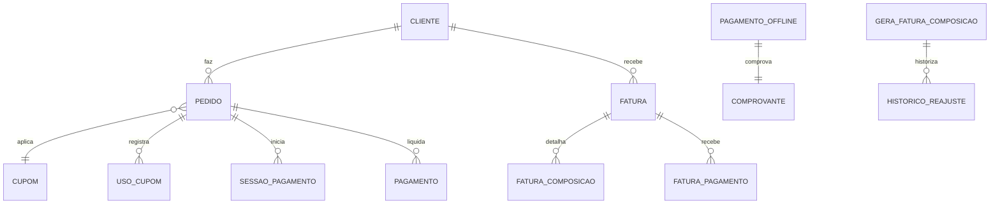

# EF 0_APLICATIVO PEDIDOS_E_COBRANCA_SAAS V1

**Projeto:** Epros  
**Empresa:** Siser  
**Tipo de documento:** Especificacao Funcional definitiva  
**Versao:** V1  
**Modulo:** APLICATIVO  
**Submodulo:** PEDIDOS_E_COBRANCA_SAAS  
**ID funcional:** APP-TEN-006  
**Status:** Pronto para validacao humana  
**Data:** 2026-06-06

## 1. Controle do documento

| Item | Conteudo |
|---|---|
| Responsavel pela elaboracao | Agente de analise e refinamento funcional |
| Responsavel pela validacao funcional | Siser |
| Responsavel pela validacao tecnica | Siser |
| Area dona do processo | Financeiro SaaS / Plataforma / Area do Cliente |
| Publico-alvo | Produto, financeiro Siser, operacao Siser, desenvolvimento, QA, suporte, implantacao e seguranca |
| Fonte de verdade | Esta EF descreve o comportamento funcional esperado do Epros para pedidos, cobranca e pagamentos SaaS |

## 2. Objetivo funcional

O submodulo Pedidos e Cobranca SaaS controla o ciclo financeiro da assinatura do Epros: pedido de plano, aplicacao de cupom, checkout, pagamento online, transferencia/offline, comprovante, fatura SaaS, cobranca PIX, webhook, liquidacao, bloqueio financeiro e historico de pagamentos do cliente.

| Pergunta | Resposta |
|---|---|
| Para que o submodulo existe? | Para transformar contratacoes, upgrades e faturas em cobrancas rastreaveis e pagamentos conciliaveis. |
| Que problema de negocio resolve? | Evita pedido sem pagamento, fatura sem status, comprovante sem aprovacao, gateway sem conciliacao, PIX duplicado e cliente operando com atraso financeiro. |
| Qual resultado operacional deve produzir? | Cada pedido/fatura deve ter valor, desconto, metodo, status, cobranca, pagamento, comprovante e bloqueio/liberacao consistentes. |
| Quais areas dependem dele? | Limites de Plano, Assinatura e Planos, Onboarding, Operacao Super Admin, Area do Cliente, Financeiro Siser, Identidade e Suporte. |

## 3. Escopo funcional

### 3.1 Dentro do escopo

| Capacidade | Descricao | Observacao |
|---|---|---|
| Pedido de assinatura | Registrar pedido de plano com valor, desconto, moeda, metodo e status de pagamento. | Entidade orders preservada. |
| Aplicacao de cupom | Validar cupom, calcular desconto e registrar uso. | Entidades coupons e user_coupons. |
| Checkout online | Iniciar pagamento por gateway habilitado e retornar sessao/link/status. | Gateway final parametrizado. |
| Transferencia bancaria/offline | Registrar solicitacao com comprovante, moeda, valor e aprovacao/rejeicao. | Status pending/approved/rejected. |
| Fatura SaaS | Gerar e manter faturas mensais, composicoes, vencimento, valores, status e comissoes. | Campos preservados. |
| Pagamento de fatura | Registrar tipo, data, valores, tarifa, identificador de pagamento e liberacao de fundos. | Entidade fatura_pagamento. |
| PIX | Gerar cobranca vinculada a fatura, QR code, link e identificador. | Idempotencia na MC. |
| Webhook de pagamento | Receber retorno do provedor e atualizar pagamento/fatura. | Autenticidade e retry na MC. |
| Area do cliente | Permitir ver faturas, filtrar vencidas/aguardando pagamento e pagar. | Minhas faturas e faturas vencidas. |
| Backoffice Siser | Criar/alterar faturas, registrar pagamento manual, consultar clientes, planos, revendas e vendedores. | Campos preservados. |
| Bloqueio financeiro | Informar bloqueio quando fatura aguardando pagamento ultrapassar tolerancia. | 15 dias identificado. |
| Sessao de pagamento | Registrar sessao pendente/concluida vinculada a assinatura. | payment_sessions. |
| Historico de pagamento | Exibir pagamentos e comprovantes para cliente/Siser. | payments e proof_of_payments. |

### 3.2 Fora do escopo

| Item fora do escopo | Motivo | Destino correto |
|---|---|---|
| Desenho comercial de planos e limites | Este submodulo cobra; o catalogo e limites pertencem a outros submodulos. | ASSINATURA_E_PLANOS; LIMITES_DE_PLANO |
| Cadastro completo do cliente SaaS | Usado na cobranca, mas dono e onboarding/limites. | ONBOARDING_E_EMPRESA; LIMITES_DE_PLANO |
| Contas a receber operacional do cliente | Faturas aqui sao da Siser contra cliente SaaS. | FINANCEIRO |
| Configuracao tecnica de segredo de gateway | Este submodulo usa configuracao; guarda segura e plataforma/seguranca. | OPERACAO_SUPER_ADMIN; PLATAFORMA_COMPARTILHADA |

## 4. Glossario e conceitos funcionais

| Termo | Definicao funcional | Observacoes |
|---|---|---|
| Pedido SaaS | Registro transacional de contratacao ou pagamento de plano. | Pode nascer antes do pagamento. |
| Fatura SaaS | Cobranca da Siser contra o cliente SaaS. | Base para bloqueio e pagamento. |
| Composicao de fatura | Item que compoe valor de uma fatura. | Pode ter reajuste. |
| Cupom | Regra promocional que reduz valor do pedido. | Exige controle de uso. |
| Comprovante offline | Arquivo/dados enviados para pagamento manual/transferencia. | Exige aprovacao/rejeicao. |
| Sessao de pagamento | Registro temporario do checkout em gateway. | Status pending/completed identificado. |
| Gateway | Provedor de pagamento online. | Configurado pela Siser. |
| PIX | Metodo de cobranca instantanea com QR code/link. | Vinculado a fatura. |
| Webhook | Retorno automatico de pagamento. | Precisa idempotencia. |
| Bloqueio financeiro | Indicador de que cliente deve regularizar fatura antes de operar. | Regra de 15 dias. |

## 5. Atores, papeis e responsabilidades

| Ator/Papel | Responsabilidade | Permissoes esperadas | Restricoes |
|---|---|---|---|
| Cliente SaaS | Escolher plano, pagar faturas, enviar comprovante e consultar historico. | Ver e pagar suas faturas. | Restrito ao proprio tenant/cliente. |
| Financeiro Siser | Acompanhar faturas, pagamentos, comprovantes, PIX e baixas manuais. | Manter cobrancas e aprovar/rejeitar comprovantes. | Acoes financeiras auditadas. |
| Operador Siser | Consultar clientes, planos, faturas e regularizacoes. | Operacao conforme papel. | Sem alterar pagamento sem permissao. |
| Sistema | Calcular valores, gerar cobrancas, processar retornos e bloquear/liberar. | Execucao automatica. | Deve ser idempotente. |
| Provedor de pagamento | Autorizar/confirmar pagamento. | Enviar retorno de pagamento. | Nao acessa dados fora do contrato. |

## 6. Visao operacional do submodulo

1. Cliente escolhe plano ou recebe fatura SaaS gerada pela Siser.
2. O Epros calcula valor, desconto e total, aplicando cupom quando valido.
3. O Epros registra pedido ou fatura com status inicial.
4. Cliente escolhe metodo de pagamento: gateway online, PIX ou transferencia/offline.
5. Para gateway, o Epros cria sessao de pagamento e aguarda retorno.
6. Para PIX, o Epros gera cobranca com QR code/link e identificador de pagamento.
7. Para transferencia/offline, cliente envia comprovante e a Siser aprova ou rejeita.
8. Webhook/baixa manual atualiza pagamento, fatura e status da assinatura.
9. Cliente inadimplente por mais de 15 dias em fatura aguardando pagamento recebe bloqueio operacional.
10. Area do cliente exibe faturas, vencidas, QR code, historico e comprovantes conforme permissao.

## 7. Capacidades funcionais

### 7.1 Pedido e checkout de assinatura

| Item | Especificacao |
|---|---|
| Objetivo | Registrar pedido de assinatura e iniciar pagamento. |
| Acionamento | Cliente escolhe plano, upgrade ou renovacao. |
| Pre-condicoes | Plano ativo e cliente identificado. |
| Dados de entrada | Cliente, plano, valor, moeda, cupom, metodo de pagamento. |
| Processamento | Calcular desconto, total, registrar pedido, iniciar checkout ou pagamento offline. |
| Resultado esperado | Pedido criado com status rastreavel. |
| Pos-condicoes | Pagamento atualiza assinatura/fatura. |
| Excecoes | Cupom invalido ou metodo indisponivel bloqueia. |
| Auditoria | Registrar origem, valor, desconto, metodo e status. |

### 7.2 Cupom e desconto

| Item | Especificacao |
|---|---|
| Objetivo | Aplicar desconto promocional ao pedido. |
| Acionamento | Cliente informa cupom. |
| Pre-condicoes | Cupom existente, ativo e dentro dos limites. |
| Dados de entrada | Codigo, usuario/cliente, plano/pedido e valor base. |
| Processamento | Validar tipo, faixa, limites de uso e registrar consumo. |
| Resultado esperado | Desconto aplicado e uso registrado. |
| Pos-condicoes | Pedido mostra valor original, desconto e total. |
| Excecoes | Cupom expirado, esgotado ou invalido nao aplica. |
| Auditoria | Registrar cupom e usuario/pedido. |

### 7.3 Fatura SaaS e composicoes

| Item | Especificacao |
|---|---|
| Objetivo | Controlar cobrancas mensais e itens cobrados. |
| Acionamento | Rotina de faturamento, backoffice Siser ou cadastro de cliente. |
| Pre-condicoes | Cliente SaaS, plano e composicoes validas. |
| Dados de entrada | Cliente, vencimento, valor total, status, percentuais de comissao, composicoes. |
| Processamento | Criar fatura, itens, pagamentos e historico de reajuste quando aplicavel. |
| Resultado esperado | Fatura pronta para consulta e pagamento. |
| Pos-condicoes | Bloqueio financeiro passa a considerar vencimento/status. |
| Excecoes | Duplicidade mensal e fatura sem composicao precisam regra final. |
| Auditoria | Registrar criacao, alteracao, baixa e reajuste. |

### 7.4 PIX e webhook

| Item | Especificacao |
|---|---|
| Objetivo | Gerar cobranca PIX e atualizar fatura pelo retorno de pagamento. |
| Acionamento | Cliente ou operador solicita PIX; provedor envia retorno. |
| Pre-condicoes | Fatura existente e valor valido. |
| Dados de entrada | FaturaId, valor, vencimento, cliente, identificador de pagamento. |
| Processamento | Gerar cobranca, salvar QR code/link/PaymentId, receber retorno e liquidar quando confirmado. |
| Resultado esperado | Fatura paga ou pendente com rastreabilidade. |
| Pos-condicoes | Cliente e liberado quando regra financeira permitir. |
| Excecoes | Webhook duplicado deve ser idempotente. |
| Auditoria | Registrar solicitacao, retorno e alteracao de status. |

### 7.5 Pagamento offline e comprovante

| Item | Especificacao |
|---|---|
| Objetivo | Permitir pagamento por transferencia ou comprovante manual. |
| Acionamento | Cliente escolhe pagamento offline ou envia comprovante. |
| Pre-condicoes | Metodo habilitado e fatura/pedido existente. |
| Dados de entrada | Valor, data, moeda, comprovante, tenant, assinatura/fatura. |
| Processamento | Registrar comprovante pendente, permitir leitura/aprovacao/rejeicao pela Siser. |
| Resultado esperado | Pagamento aprovado liquida pedido/fatura; rejeitado permanece pendente. |
| Pos-condicoes | Historico fica disponivel. |
| Excecoes | Valor divergente ou comprovante invalido exige rejeicao/ajuste. |
| Auditoria | Registrar envio, leitura, aprovacao/rejeicao e operador. |

## 8. Regras de negocio

| Regra | Descricao | Condicao | Resultado | Severidade | Observacoes |
|---|---|---|---|---|---|
| REG-001 | Pedido de assinatura deve registrar cliente, plano, valor, moeda e status. | Criacao de pedido. | Pedido rastreavel. | Bloqueante | |
| REG-002 | Pedido deve guardar desconto quando cupom for aplicado. | Cupom valido. | Total considera desconto. | Bloqueante | |
| REG-003 | Uso de cupom deve ser registrado por usuario/pedido. | Aplicacao de cupom. | Evita abuso de uso. | Bloqueante | |
| REG-004 | Cupom invalido nao deve alterar o total. | Cupom ausente, expirado ou fora do limite. | Pedido segue sem desconto ou bloqueia conforme UX. | Bloqueante | |
| REG-005 | Metodo de pagamento deve estar habilitado antes do checkout. | Escolha do metodo. | Metodo indisponivel bloqueia. | Bloqueante | |
| REG-006 | Pedido online deve criar sessao de pagamento. | Checkout gateway. | Sessao pending criada. | Bloqueante | |
| REG-007 | Sessao concluida deve atualizar pedido e assinatura/fatura. | Retorno confirmado. | Status financeiro atualizado. | Bloqueante | |
| REG-008 | Transferencia bancaria deve gerar comprovante pendente. | Cliente envia comprovante. | Status pending. | Bloqueante | |
| REG-009 | Comprovante aprovado deve liquidar pagamento conforme valor aprovado. | Aprovacao Siser. | Pedido/fatura pago. | Bloqueante | |
| REG-010 | Comprovante rejeitado deve manter pendencia e registrar motivo quando informado. | Rejeicao Siser. | Status rejected. | Bloqueante | |
| REG-011 | Fatura SaaS exige vencimento, valor total e status. | Criacao de fatura. | Fatura valida. | Bloqueante | |
| REG-012 | Fatura deve possuir TenantId quando persistida como cobranca SaaS. | Criacao/alteracao. | Segregacao garantida. | Bloqueante | varchar(200) em varias tabelas. |
| REG-013 | Fatura aguardando pagamento por mais de 15 dias bloqueia uso operacional. | Login/acesso. | Block=true. | Bloqueante | Detalhe compartilhado com Limites. |
| REG-014 | PIX deve guardar PaymentId quando retornado. | Geracao de cobranca. | Conciliacao possivel. | Bloqueante | varchar(100). |
| REG-015 | PIX deve guardar QR code/link quando retornados. | Geracao de cobranca. | Cliente consegue pagar. | Bloqueante | |
| REG-016 | Webhook deve ser idempotente. | Retorno repetido. | Nao duplica baixa. | Bloqueante | Lacuna detalhada na MC. |
| REG-017 | Pagamento manual deve registrar valor, data e forma/tipo. | Baixa manual. | Historico financeiro completo. | Bloqueante | |
| REG-018 | Valor recebido e tarifa devem ser preservados quando informados. | Conciliacao. | Receita liquida rastreavel. | Informativa | decimal(18,2) e decimal(18,3). |
| REG-019 | Reajuste de composicao deve registrar valor atual, novo, percentual e tipo. | Reajuste. | Historico completo. | Bloqueante | |
| REG-020 | Cliente so pode ver suas faturas. | Area do cliente. | Consulta segregada. | Bloqueante | |
| REG-021 | Backoffice Siser pode alterar vencimento/valor apenas com permissao e auditoria. | Edicao de fatura. | Alteracao rastreavel. | Bloqueante | |
| REG-022 | Pagamento nao deve depender apenas de retorno visual de checkout. | Checkout. | Confirmacao precisa retorno confiavel/webhook/consulta. | Bloqueante | |
| REG-023 | Configuracao de gateway deve tratar credenciais como segredo. | Salvar gateway. | Valores protegidos. | Bloqueante | |
| REG-024 | Pagamento recorrente deve gerar rotina com status rastreavel. | Recorrencia. | Rotina new/processing/failed/completed. | Bloqueante | |
| REG-025 | Fatura duplicada por cliente/competencia deve ser impedida quando regra final for aprovada. | Geracao mensal. | Bloqueio. | Decisao | MC. |

## 9. Parametros de configuracao

| Parametro | Finalidade | Tipo/formato | Valor padrao | Obrigatorio | Nivel | Quem pode alterar | Impacto |
|---|---|---|---|---|---|---|---|
| Gateway habilitado | Permitir metodo de pagamento online. | Booleano por gateway | Nao informado no material | Sim | Global/Siser | Financeiro/Super admin | Checkout. |
| Modo do gateway | Sandbox/producao ou equivalente. | Dominio | Nao informado no material | Sim | Global/Siser | Financeiro/Super admin | Pagamentos reais/teste. |
| Credenciais do gateway | Chaves e segredos. | Texto seguro | Nao informado no material | Condicional | Global/Siser | Financeiro/Super admin | Conciliacao. |
| Transferencia bancaria habilitada | Permitir pagamento offline. | Booleano | Nao informado no material | Condicional | Global/Siser | Financeiro/Super admin | Comprovantes. |
| Instrucoes de transferencia | Orientar cliente. | Texto | Nao informado no material | Condicional | Global/Siser | Financeiro/Super admin | UX pagamento. |
| Tolerancia de atraso | Bloqueio apos vencimento. | Inteiro em dias | 15 | Sim | Global/Siser | Financeiro/Super admin | Bloqueio. |
| Moeda padrao | Moeda de pedido/cobranca. | Identificador | Nao informado no material | Sim | Global/Siser | Financeiro/Super admin | Valores. |
| Politica de cupom | Limites, tipo e validade. | Regras | Nao informado no material | Condicional | Global/Siser | Comercial/Financeiro | Descontos. |

## 10. Modelo de dados funcional e implantavel

### 10.1 Visao geral do modelo

O modelo combina pedido, cupom, uso de cupom, fatura, composicao, pagamento, comprovante, sessao de checkout, configuracoes de pagamento, cliente SaaS e contratos de integracao.

| Grupo de dados | Entidades/tabelas | Papel funcional | Observacoes |
|---|---|---|---|
| Pedido/checkout | orders, payment_sessions | Registrar pedido e sessao de pagamento. | Status pending/succeeded/failed/refunded e pending/completed. |
| Desconto | coupons, user_coupons | Validar cupom e registrar consumo. | Campos completos nao informados. |
| Pagamento offline | bank_transfer_payments, proof_of_payments | Registrar transferencia e comprovante. | Status pending/approved/rejected e unread/read. |
| Fatura SaaS | fatura, fatura_pagamento, fatura_composicao | Cobrar cliente SaaS e registrar pagamentos. | Campos detalhados preservados. |
| Reajuste | gera_fatura_composicao, gera_fatura_composicao_historico_reajuste | Gerar composicoes e historizar reajustes. | |
| Cliente/plano | cliente, plano, modulo_plano, quantidade_permissao | Apoiar cobranca e plano contratado. | Dono primario em Limites/Assinatura. |
| Configuracao | settings de pagamento | Habilitar metodos e credenciais. | Segredos na MC. |
| Rotinas | scheduled_gateway, filas de recorrencia | Recorrencia e tarefas financeiras. | Status new/processing/failed/completed. |

### 10.2 Entidades e tabelas

| Entidade funcional | Tabela/estrutura | Tipo | Finalidade | Chave primaria | Observacoes de implantacao |
|---|---|---|---|---|---|
| Pedido SaaS | orders | Movimento | Registrar pedido de assinatura, valor, desconto, moeda e status. | Nao informado no material | payment_status: pending/succeeded/failed/refunded. |
| Cupom | coupons | Mestre | Regra promocional. | Nao informado no material | Tipo, faixa e limites citados. |
| Uso de cupom | user_coupons | Movimento | Historico de consumo por usuario/pedido. | Nao informado no material | |
| Pagamento por transferencia | bank_transfer_payments | Movimento | Solicitacao offline com comprovante/status/moeda. | Nao informado no material | status pending/approved/rejected. |
| Pagamento global | payments | Movimento | Registro de pagamento de assinatura/fatura. | Nao informado no material | payment_tenant_id, subscription_id, date, amount, gateway, transaction_id. |
| Comprovante | proof_of_payments | Movimento/Arquivo | Comprovante offline. | Nao informado no material | proof_status unread/read. |
| Sessao de pagamento | payment_sessions | Movimento | Sessao de checkout. | Nao informado no material | gateway_ref, status, subscription_id. |
| Fatura SaaS | fatura | Movimento | Cobranca mensal da Siser. | Id | Campos detalhados. |
| Pagamento de fatura | fatura_pagamento | Movimento | Baixa/retorno de pagamento. | Id | PaymentId varchar(100). |
| Item de fatura | fatura_composicao | Item | Item de cobranca. | Id | Descricao varchar(200), Valor decimal(18,2). |
| Composicao recorrente | gera_fatura_composicao | Auxiliar | Geracao de itens recorrentes. | Id | Valor decimal(18,2). |
| Historico de reajuste | gera_fatura_composicao_historico_reajuste | Historico | Reajuste de composicao. | Id | Valores decimal(18,2). |
| Cliente SaaS | cliente | Mestre | Cliente cobrado. | Id | TenantId varchar(100), documento/email. |

### 10.3 Relacionamentos, cardinalidade e dependencia

| Origem | Relacionamento | Destino | Cardinalidade | Obrigatorio | Regra de integridade |
|---|---|---|---|---|---|
| Cliente SaaS | possui | Pedido SaaS | 1:N | Condicional | Pedido pertence ao cliente/tenant. |
| Cliente SaaS | possui | Fatura SaaS | 1:N | Sim | Fatura deve ter cliente. |
| Pedido SaaS | pode usar | Cupom | N:1 | Condicional | Cupom valido gera user_coupon. |
| Pedido SaaS | possui | Sessao de pagamento | 1:N | Condicional | Checkout online. |
| Pedido SaaS/Fatura | possui | Pagamento | 1:N | Condicional | Pagamento atualiza status. |
| Fatura SaaS | possui | Item de fatura | 1:N | Condicional | Itens compoem valor. |
| Fatura SaaS | possui | Pagamento de fatura | 1:N | Condicional | Pagamentos e retornos. |
| Pagamento offline | possui | Comprovante | 1:1/N:1 | Sim | Comprovante para aprovacao. |
| Composicao recorrente | possui | Historico de reajuste | 1:N | Condicional | Reajustes. |

### 10.4 Chaves, unicidade, indices e constraints funcionais

| Entidade/tabela | Tipo de restricao | Campo(s) | Regra | Comportamento esperado |
|---|---|---|---|---|
| orders | Status | payment_status | pending/succeeded/failed/refunded. | Controlar ciclo de pagamento. |
| bank_transfer_payments | Status | status | pending/approved/rejected. | Controlar aprovacao. |
| proof_of_payments | Status | proof_status | unread/read. | Controlar leitura. |
| payment_sessions | Status | session_status | pending/completed. | Controlar checkout. |
| fatura | FK | Cliente/TenantId | Fatura pertence a cliente/tenant. | Bloquear fatura orfa. |
| fatura_pagamento | FK | FaturaId | Pagamento pertence a fatura. | Bloquear pagamento orfao. |
| fatura_pagamento | Indice/Unico recomendado | PaymentId | Evitar baixa duplicada. | Idempotencia. |
| coupons | Unico recomendado | codigo | Evitar cupom duplicado. | Bloquear duplicidade. |
| user_coupons | Unico funcional | usuario + cupom + pedido | Controlar uso. | Evitar abuso. |
| fatura | Unico funcional | cliente + competencia | Evitar fatura duplicada. | Decisao na MC. |

### 10.5 Regras de persistencia, exclusao e historico

| Entidade/tabela | Criacao | Alteracao | Exclusao/inativacao | Historico/auditoria | Retencao |
|---|---|---|---|---|---|
| orders | Criado no checkout. | Status por retorno/baixa. | Nao informado no material. | Registrar valor/desconto/metodo/status. | Nao informado no material. |
| coupons | Criado por backoffice. | Alteracao afeta novos pedidos. | Inativar recomendado. | Registrar uso. | Nao informado no material. |
| bank_transfer_payments | Criado no envio offline. | Aprovar/rejeitar. | Nao informado no material. | Obrigatoria. | Nao informado no material. |
| proof_of_payments | Criado no upload. | Marcar lido/aprovado indiretamente. | Nao informado no material. | Obrigatoria. | Nao informado no material. |
| payment_sessions | Criada no gateway. | Atualizar completed/falha. | Nao informado no material. | Obrigatoria. | Nao informado no material. |
| fatura | Criada por rotina/backoffice. | Valor/vencimento/status. | Delete aparece em backoffice, mas regra final na MC. | Obrigatoria. | Nao informado no material. |
| fatura_pagamento | Criado por PIX/webhook/manual. | Atualizar status/valores. | Nao informado no material. | Obrigatoria. | Nao informado no material. |
| fatura_composicao | Criada com fatura. | Alteracao recalcula total quando aplicavel. | Cascata identificada. | Nao informado no material. | Nao informado no material. |

### 10.6 Diagrama logico funcional

### 10.7 Lacunas de modelo de dados

| Lacuna | Entidade/tabela afetada | Impacto | Encaminhamento para MC |
|---|---|---|---|
| Campos completos de orders/coupons/user_coupons nao foram detalhados. | Pedido/cupom | Implantacao precisa dicionario final. | Sim |
| Idempotencia de webhook/PaymentId nao esta completa. | fatura_pagamento/payment_sessions | Risco de baixa duplicada. | Sim |
| Status final de pedido, fatura e assinatura precisa mapa unico. | orders/fatura/assinatura | Estados divergentes. | Sim |
| Gateway e segredos precisam modelo seguro. | settings pagamento | Risco de exposicao. | Sim |
| Fatura duplicada por competencia precisa constraint final. | fatura | Risco de cobranca duplicada. | Sim |

## 11. Dicionario de dados implantavel

### 11.1 Entidade: Pedido SaaS

**Finalidade:** registrar pedido de assinatura/checkout.

| Campo | Tipo/formato | Tamanho/precisao/dominio | Obrigatorio | Chave/relacionamento | Regra funcional/observacao |
|---|---|---|---|---|---|
| id | Identificador | Nao informado no material | Sim | PK | Pedido. |
| tenant_id/cliente_id | Identificador | Nao informado no material | Sim | FK | Cliente/tenant. |
| plan_id | Identificador | Nao informado no material | Sim | FK | Plano. |
| amount | Decimal | Nao informado no material | Sim | Monetario | Valor base/total conforme regra final. |
| discount | Decimal | Nao informado no material | Nao | Monetario | Desconto aplicado. |
| currency | Texto | Nao informado no material | Sim | Dominio | Moeda. |
| payment_method | Dominio | gateway, transferencia, offline, PIX | Sim | Dominio | Metodo. |
| payment_status | Dominio | pending, succeeded, failed, refunded | Sim | Status | Status do pagamento. |
| receipt | Arquivo/texto | Nao informado no material | Condicional | Comprovante | Quando offline. |
| created_at/updated_at | Data/hora | Nao informado no material | Nao informado no material | Auditoria | Datas. |

| Item | Especificacao |
|---|---|
| Chave primaria | id |
| Chaves unicas | Nao informado no material |
| Relacionamentos | Cliente, plano, cupom, pagamento, sessao |
| Cardinalidade | Cliente 1:N pedidos |
| Historico/auditoria | Valor, desconto, metodo e status |
| Regras de exclusao | Nao informado no material |
| Retencao de dados | Nao informado no material |

### 11.2 Entidade: Cupom e Uso de Cupom

**Finalidade:** aplicar desconto e controlar consumo.

| Entidade | Campo | Tipo/formato | Tamanho/precisao/dominio | Obrigatorio | Chave/relacionamento | Regra funcional/observacao |
|---|---|---|---|---|---|---|
| coupon | id | Identificador | Nao informado no material | Sim | PK | Cupom. |
| coupon | code | Texto | Nao informado no material | Sim | Unico recomendado | Codigo. |
| coupon | type | Dominio | Nao informado no material | Sim | Dominio | Tipo de desconto. |
| coupon | discount | Decimal/percentual | Nao informado no material | Sim | Regra | Valor/percentual. |
| coupon | limit | Inteiro | Nao informado no material | Condicional | Limite | Limite de uso. |
| user_coupon | id | Identificador | Nao informado no material | Sim | PK | Uso. |
| user_coupon | user_id/cliente_id | Identificador | Nao informado no material | Sim | FK | Usuario/cliente. |
| user_coupon | coupon_id | Identificador | Nao informado no material | Sim | FK | Cupom. |
| user_coupon | order_id | Identificador | Nao informado no material | Sim | FK | Pedido. |

| Item | Especificacao |
|---|---|
| Chave primaria | id |
| Chaves unicas | code; usuario+cupom+pedido recomendado |
| Relacionamentos | Pedido, cliente/usuario |
| Cardinalidade | Cupom 1:N usos |
| Historico/auditoria | Uso deve ser registrado |
| Regras de exclusao | Inativar recomendado |
| Retencao de dados | Nao informado no material |

### 11.3 Entidade: Fatura SaaS

**Finalidade:** registrar cobranca SaaS da Siser contra cliente.

| Campo | Tipo/formato | Tamanho/precisao/dominio | Obrigatorio | Chave/relacionamento | Regra funcional/observacao |
|---|---|---|---|---|---|
| Id | Identificador | Nao informado no material | Sim | PK | Fatura. |
| TenantId | Texto | varchar(200) | Sim | Fronteira | Tenant. |
| ClienteId | Identificador | Nao informado no material | Sim | FK | Cliente. |
| DataVencimento | Data | Nao informado no material | Sim | Vencimento | Base para bloqueio. |
| ValorTotal | Decimal | decimal(18,2) | Sim | Monetario | Valor total. |
| StatusFatura | Dominio | Nao informado no material | Sim | Status | Status. |
| PercentualComissaoRevenda | Decimal | decimal(18,2) | Sim | Comissao | Revenda. |
| PercentualComissaoRevendaVendedor | Decimal | decimal(18,2) | Sim | Comissao | Vendedor. |
| Quitada | Booleano | Sim/Nao | Sim | Status | Quitacao. |
| DataPagamento | Data | Nao informado no material | Nao | Pagamento | Data. |
| ValorPago | Decimal | decimal(18,2) | Sim | Monetario | Valor pago. |
| ValorAPagorComissaoRevenda | Decimal | decimal(18,2) | Sim | Comissao | Grafia a sanear. |
| ValorAPagorComissaoRevendaVendedor | Decimal | decimal(18,2) | Sim | Comissao | Grafia a sanear. |

| Item | Especificacao |
|---|---|
| Chave primaria | Id |
| Chaves unicas | Cliente + competencia recomendado; nao informado no material |
| Relacionamentos | Cliente, composicoes, pagamentos |
| Cardinalidade | Cliente 1:N faturas |
| Historico/auditoria | Criacao, alteracao, pagamento e baixa |
| Regras de exclusao | Nao informado no material final |
| Retencao de dados | Nao informado no material |

### 11.4 Entidade: Pagamento de Fatura

**Finalidade:** registrar pagamento/retorno associado a fatura.

| Campo | Tipo/formato | Tamanho/precisao/dominio | Obrigatorio | Chave/relacionamento | Regra funcional/observacao |
|---|---|---|---|---|---|
| Id | Identificador | Nao informado no material | Sim | PK | Pagamento. |
| TenantId | Texto | varchar(200) | Sim | Fronteira | Tenant. |
| FaturaId | Identificador | Nao informado no material | Sim | FK | Fatura. |
| TipoPagamento | Dominio | Nao informado no material | Sim | Dominio | Tipo. |
| DataPagamento | Data | Nao informado no material | Nao | Pagamento | Data. |
| DataExpiracao | Data/hora | Nao informado no material | Nao | Expiracao | Expiracao de cobranca. |
| PagoManualmente | Booleano | Sim/Nao | Nao informado no material | Status | Baixa manual. |
| Status | Dominio | Nao informado no material | Nao informado no material | Status | Status do pagamento. |
| ValorPago | Decimal | decimal(18,2) | Sim | Monetario | Valor pago. |
| ValorRecebido | Decimal | decimal(18,2) | Nao | Monetario | Valor liquido. |
| ValorTarifa | Decimal | decimal(18,3) | Nao | Monetario | Tarifa. |
| PaymentId | Texto | varchar(100) | Nao | Identificador externo | Usado para conciliacao. |
| DataLiberacaoFundos | Data | Nao informado no material | Nao | Pagamento | Liberacao. |

| Item | Especificacao |
|---|---|
| Chave primaria | Id |
| Chaves unicas | PaymentId recomendado |
| Relacionamentos | Fatura |
| Cardinalidade | Fatura 1:N pagamentos |
| Historico/auditoria | Obrigatoria |
| Regras de exclusao | Nao informado no material |
| Retencao de dados | Nao informado no material |

### 11.5 Entidades: Composicao e Reajuste

**Finalidade:** detalhar cobranca e reajuste de itens recorrentes.

| Entidade | Campo | Tipo/formato | Tamanho/precisao/dominio | Obrigatorio | Chave/relacionamento | Regra funcional/observacao |
|---|---|---|---|---|---|---|
| fatura_composicao | TenantId | Texto | varchar(200) | Sim | Fronteira | Tenant. |
| fatura_composicao | FaturaId | Identificador | Nao informado no material | Sim | FK | Fatura. |
| fatura_composicao | Descricao | Texto | varchar(200) | Sim | Informativo | Item. |
| fatura_composicao | Valor | Decimal | decimal(18,2) | Sim | Monetario | Valor item. |
| gera_fatura_composicao | Descricao | Texto | varchar(200) | Sim | Informativo | Regra recorrente. |
| gera_fatura_composicao | DataInicial | Data | Nao informado no material | Sim | Vigencia | Inicio. |
| gera_fatura_composicao | DataFinal | Data | Nao informado no material | Nao | Vigencia | Fim. |
| gera_fatura_composicao | Valor | Decimal | decimal(18,2) | Sim | Monetario | Valor. |
| gera_fatura_composicao | PodeReajustar | Booleano | Sim/Nao | Sim | Regra | Reajustavel. |
| historico_reajuste | ValorAtual | Decimal | decimal(18,2) | Sim | Monetario | Antes. |
| historico_reajuste | ValorNovo | Decimal | decimal(18,2) | Sim | Monetario | Depois. |
| historico_reajuste | PercentualReajuste | Decimal | decimal(18,2) | Sim | Percentual | Percentual. |
| historico_reajuste | TipoReajuste | Dominio | Nao informado no material | Sim | Dominio | Tipo. |

| Item | Especificacao |
|---|---|
| Chave primaria | Id nao detalhado nas tabelas desta secao |
| Chaves unicas | Nao informado no material |
| Relacionamentos | Fatura e composicao recorrente |
| Cardinalidade | Fatura 1:N composicoes; composicao recorrente 1:N historicos |
| Historico/auditoria | Historico de reajuste obrigatorio |
| Regras de exclusao | Cascata/restricao conforme tabela; detalhe final na MC |
| Retencao de dados | Nao informado no material |

### 11.6 Entidades: Comprovante, Sessao e Rotina

**Finalidade:** controlar transferencia/offline, checkout e recorrencias.

| Entidade | Campo | Tipo/formato | Tamanho/precisao/dominio | Obrigatorio | Chave/relacionamento | Regra funcional/observacao |
|---|---|---|---|---|---|---|
| proof_of_payments | proof_tenant_id | Identificador | Nao informado no material | Sim | FK | Tenant. |
| proof_of_payments | proof_amount | Decimal | Nao informado no material | Sim | Monetario | Valor comprovado. |
| proof_of_payments | proof_date | Data | Nao informado no material | Sim | Data | Data do comprovante. |
| proof_of_payments | proof_directory/filename | Arquivo | Nao informado no material | Sim | Arquivo | Comprovante. |
| proof_of_payments | proof_status | Dominio | unread/read | Sim | Status | Leitura. |
| payment_sessions | session_gateway_ref | Texto | Nao informado no material | Sim | Identificador externo | Referencia gateway. |
| payment_sessions | session_status | Dominio | pending/completed | Sim | Status | Status checkout. |
| payment_sessions | session_subscription_id | Identificador | Nao informado no material | Sim | FK | Assinatura. |
| scheduled_gateway | payload | JSON/texto | Nao informado no material | Sim | Rotina | Dados recorrencia. |
| scheduled_gateway | status | Dominio | new/processing/failed/completed | Sim | Status | Rotina. |

## 12. Estados, situacoes e ciclos de vida

| Entidade/processo | Estado | Significado | Estado inicial | Pode ir para | Quem altera | Regra de transicao |
|---|---|---|---|---|---|---|
| Pedido | pending | Aguardando pagamento. | Sim | succeeded, failed, refunded | Sistema/Gateway/Siser | Conforme retorno. |
| Pedido | succeeded | Pago. | Nao | refunded | Sistema/Siser | Pagamento confirmado. |
| Pedido | failed | Falhou. | Nao | pending | Sistema/Cliente | Nova tentativa. |
| Pedido | refunded | Reembolsado. | Nao | Nao informado | Siser/Gateway | Reembolso. |
| Transferencia | pending | Comprovante aguardando analise. | Sim | approved, rejected | Siser | Analise manual. |
| Transferencia | approved | Aprovada. | Nao | Nao informado | Siser | Liquida pedido/fatura. |
| Transferencia | rejected | Rejeitada. | Nao | pending | Siser/Cliente | Novo envio. |
| Sessao pagamento | pending | Checkout aberto. | Sim | completed | Gateway/Sistema | Retorno confirmado. |
| Sessao pagamento | completed | Checkout concluido. | Nao | Nao informado | Gateway/Sistema | |
| SaaS cliente | active | Cliente liberado. | Condicional | awaiting-payment, cancelled, failed | Sistema/Siser | Conforme financeiro. |
| SaaS cliente | awaiting-payment | Cliente aguardando pagamento. | Condicional | active, cancelled, failed | Sistema/Siser | |
| SaaS cliente | cancelled/failed | Cliente sem uso regular. | Nao | active | Siser/Sistema | Regularizacao. |

## 13. Fluxos funcionais

### 13.1 Fluxo principal: pedido com cupom

| Passo | Ator | Acao | Entrada | Validacao | Saida | Proximo passo |
|---|---|---|---|---|---|---|
| 1 | Cliente | Escolhe plano. | Plano. | Plano ativo. | Pedido iniciado. | 2 |
| 2 | Cliente | Informa cupom. | Codigo. | Cupom valido. | Desconto calculado. | 3 |
| 3 | Sistema | Registra pedido. | Plano, valor, desconto, moeda. | Campos obrigatorios. | Pedido pending. | 4 |
| 4 | Cliente | Escolhe metodo. | Metodo. | Metodo habilitado. | Checkout/comprovante/PIX. | Fim |

### 13.2 Fluxo principal: PIX de fatura

| Passo | Ator | Acao | Entrada | Validacao | Saida | Proximo passo |
|---|---|---|---|---|---|---|
| 1 | Cliente | Lista faturas. | Cliente/Tenant. | Proprio cliente. | Faturas. | 2 |
| 2 | Cliente | Solicita PIX. | FaturaId. | Fatura valida. | Cobranca gerada. | 3 |
| 3 | Sistema | Exibe QR/link. | Retorno pagamento. | PaymentId salvo. | QR/link disponivel. | 4 |
| 4 | Provedor | Envia retorno. | PaymentId/status. | Autenticidade/idempotencia. | Fatura atualizada. | Fim |

### 13.3 Fluxo principal: comprovante offline

| Passo | Ator | Acao | Entrada | Validacao | Saida | Proximo passo |
|---|---|---|---|---|---|---|
| 1 | Cliente | Envia comprovante. | Arquivo, valor, data. | Metodo habilitado. | Comprovante pending. | 2 |
| 2 | Financeiro Siser | Analisa. | Comprovante. | Valor/documento. | Aprovado ou rejeitado. | 3 |
| 3 | Sistema | Atualiza financeiro. | Resultado. | Aprovacao. | Pedido/fatura liquidado ou pendente. | Fim |

### 13.4 Fluxos alternativos e excecoes

| Cenario | Condicao | Comportamento esperado | Mensagem/retorno | Registro necessario |
|---|---|---|---|---|
| Gateway indisponivel | Metodo desabilitado ou falha. | Bloquear metodo ou permitir nova tentativa. | Nao informado no material. | Pedido/sessao. |
| Webhook duplicado | Mesmo PaymentId/status recebido novamente. | Ignorar ou confirmar sem duplicar baixa. | Nao se aplica. | Log idempotente. |
| Comprovante rejeitado | Valor/arquivo invalido. | Manter pendencia. | Nao informado no material. | Motivo/operador. |
| Fatura vencida | Atraso > 15 dias. | Bloquear uso e direcionar para faturas vencidas. | Nao informado no material final. | Fatura/cliente. |

## 14. Validacoes, consistencias e bloqueios

| Validacao | Onde ocorre | Condicao verificada | Comportamento quando valido | Comportamento quando invalido | Mensagem esperada |
|---|---|---|---|---|---|
| Plano ativo | Pedido | Plano disponivel. | Prossegue. | Bloqueia. | Nao informado no material. |
| Cupom valido | Pedido | Codigo, limite, validade. | Aplica desconto. | Nao aplica/bloqueia. | Nao informado no material. |
| Metodo habilitado | Checkout | Gateway/offline ativo. | Prossegue. | Bloqueia. | Nao informado no material. |
| Fatura propria | Area cliente | Cliente dono da fatura. | Exibe. | Bloqueia. | Nao informado no material. |
| PaymentId unico | Webhook/PIX | Nao processado antes. | Baixa. | Ignora. | Nao se aplica. |
| Valor comprovante | Offline | Valor coerente com pedido/fatura. | Permite aprovar. | Rejeita/pendencia. | Nao informado no material. |
| Fatura vencida | Login/acesso | Atraso > 15 dias. | Block=true. | Libera quando regular. | Nao informado no material. |

## 15. Permissoes, seguranca e segregacao

| Recurso/acao | Permissao necessaria | Papel autorizado | Restricao de dados | Auditoria obrigatoria |
|---|---|---|---|---|
| Consultar minhas faturas | Cliente autenticado | Cliente SaaS | Proprio tenant | Condicional |
| Gerar PIX | Pagar fatura | Cliente/Financeiro Siser | Fatura propria/autorizada | Sim |
| Registrar pagamento manual | Baixar fatura | Financeiro Siser | Fatura autorizada | Sim |
| Aprovar comprovante | Aprovar pagamento offline | Financeiro Siser | Comprovante autorizado | Sim |
| Configurar gateway | Administrar cobranca | Financeiro/Super admin | Global Siser | Sim |
| Criar/alterar fatura | Administrar fatura SaaS | Financeiro Siser | Cliente autorizado | Sim |
| Consultar planos publicos | Publico/cliente | Visitante/cliente | Planos ativos | Nao |
| Processar webhook | Sistema | Provedor autorizado | Contrato assinado/seguro | Sim |

## 16. Interfaces, telas e experiencia

| Interface | Objetivo | Campos/acoes preservados | Observacoes |
|---|---|---|---|
| Area do cliente - minhas faturas | Listar e pagar faturas. | Filtros aguardando pagamento/vencidas, gerar PIX, QR code, ticketUrl. | |
| Area do cliente - faturas vencidas | Regularizar cliente bloqueado. | Lista de vencidas e pagamento. | |
| Planos publicos | Iniciar contratacao. | Plano, valor, acao registrar com planoId. | |
| Backoffice faturas | Criar, alterar e baixar fatura. | searchTerm, DataVencimento, ValorTotal, PercentualComissaoRevenda, PercentualComissaoRevendaVendedor, ValorPago, FormaPagamento, DataPagamento. | Grafia de FormaPagamento deve ser saneada. |
| Backoffice cliente | Manter cliente cobrado. | EmpresaId, RevendaId, PlanoId, VendedorId, Documento, Nome, EmpresaNome, Email, Telefone, DiaVencimento, Ativo, endereco, composicoes, permissoes. | |
| Backoffice planos | Manter planos/modulos. | PlanoGrupoId, Nome, DescricaoCurta, DescricaoCompleta, Valor, QtdeUsuarios, QtdeEmpresas, Ativo, modulos. | Dono em Limites/Assinatura. |
| Comprovante offline | Enviar/analisar comprovante. | Arquivo, valor, data, status. | Campos de tela detalhados parcialmente. |
| Historico de pagamentos | Consultar pagamentos. | Data, valor, gateway/metodo, status, comprovante. | |

## 17. Integracoes e contratos

| Contrato funcional | Direcao | Entrada | Saida | Regra |
|---|---|---|---|---|
| Consultar fatura por id | Saida | FaturaId, tenant/cliente | Fatura | Escopo autorizado. |
| Listar faturas do cliente | Saida | Cliente/Tenant, filtros | Lista faturas | Proprio cliente. |
| Gerar cobranca PIX | Entrada/Saida | FaturaId | PaymentId, expiracao, link, QR code | Idempotencia. |
| Listar planos | Saida | Filtros/publico | Planos ativos | Publico quando permitido. |
| Autenticar integracao | Entrada/Saida | Credencial de sistema | Token | Escopo faturas/planos/clientes. |
| Webhook pagamento | Entrada | PaymentId/status/valor | Pagamento/fatura atualizado | Assinatura e idempotencia. |
| Configurar transferencia | Entrada | Dados bancarios/instrucoes | Metodo habilitado | Permissao Siser. |

## 18. Relatorios e consultas

| Consulta/relatorio | Objetivo | Filtros | Campos esperados | Observacoes |
|---|---|---|---|---|
| Pedidos SaaS | Acompanhar checkout. | Status, plano, cliente, periodo. | Valor, desconto, moeda, status, metodo. | |
| Faturas SaaS | Acompanhar cobrancas. | Cliente, status, vencimento. | Vencimento, valor, status, pago. | |
| Pagamentos | Conciliar recebimentos. | Periodo, metodo, status. | Valor pago, recebido, tarifa, PaymentId. | |
| Comprovantes | Analisar offline. | Status, cliente, periodo. | Valor, data, arquivo, status. | |
| Cupons | Acompanhar uso. | Codigo, periodo, cliente. | Cupom, uso, pedido, desconto. | |
| Bloqueios financeiros | Identificar inadimplencia. | Atraso, status, cliente. | Fatura, vencimento, dias, valor. | |

## 19. Requisitos nao funcionais

| Categoria | Requisito | Critério |
|---|---|---|
| Seguranca | Credenciais de gateway devem ser protegidas. | Mascarar e armazenar como segredo. |
| Idempotencia | Webhook e PIX nao podem duplicar baixa. | PaymentId/processamento unico. |
| Auditoria | Baixas, aprovacao de comprovante e alteracoes financeiras devem ser auditadas. | Trilha consultavel. |
| Segregacao | Cliente ve apenas suas faturas. | Sem vazamento cross-tenant. |
| Confiabilidade | Checkout nao deve depender de tela de sucesso sem retorno confirmado. | Confirmacao por webhook/consulta. |
| Privacidade | Comprovantes e dados financeiros devem ter acesso controlado. | Permissoes e retencao. |

## 20. Criterios de aceite

| Criterio | Dado um contexto | Quando | Entao |
|---|---|---|---|
| Pedido registra desconto | Cupom valido | Cliente fecha pedido | Pedido tem valor, desconto e total corretos. |
| Cupom invalido nao aplica | Cupom invalido | Cliente tenta aplicar | Total nao e reduzido. |
| PIX gera QR | Fatura aberta | Cliente solicita PIX | Epros retorna QR/link e PaymentId. |
| Webhook idempotente | Mesmo retorno chega duas vezes | Sistema processa | Baixa ocorre uma vez. |
| Comprovante pendente | Cliente envia comprovante | Upload concluido | Status fica pending. |
| Comprovante aprovado liquida | Financeiro aprova | Aprovacao salva | Pedido/fatura fica pago. |
| Fatura vencida bloqueia | Atraso > 15 dias | Usuario acessa | Epros sinaliza bloqueio. |
| Cliente ve apenas suas faturas | Cliente acessa area | Lista faturas | Nenhuma fatura de outro cliente aparece. |

## 21. Notas de rodape

[^agente-001]: A consolidacao de status financeiro, a recomendacao de idempotencia por PaymentId, o modelo seguro de gateway e a constraint cliente+competencia foram organizados pelo agente a partir de lacunas reais do material. O que nao estava definido foi mantido na MC.
