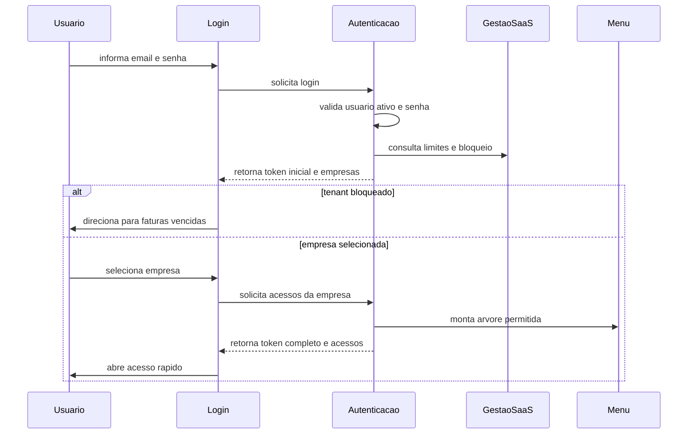
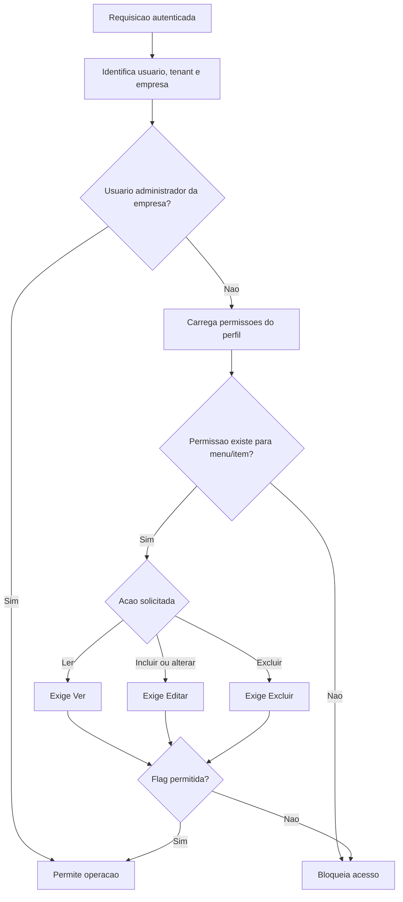
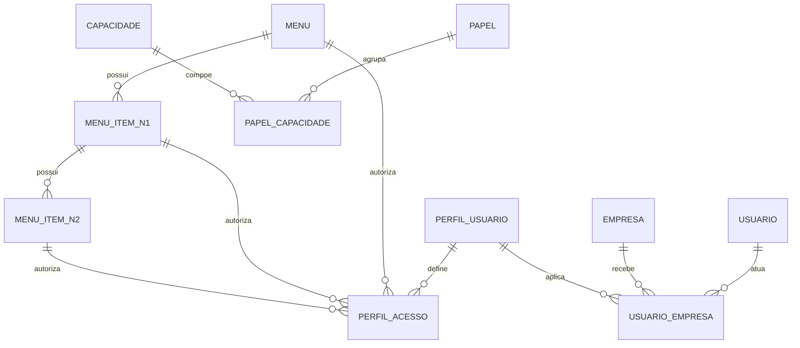

# EF 0 Aplicativo — Permissoes de Menu V1

## 1. Identificacao

| Item | Valor |
|---|---|
| Sistema | Epros |
| Empresa | Siser |
| Modulo | Aplicativo |
| Submodulo | Permissoes de Menu |
| Versao | V1 |
| Status | Especificacao funcional para validacao humana |
| Data | 2026-06-06 |

## 2. Objetivo funcional

O submodulo Permissoes de Menu define como o Epros organiza menus, submenus, perfis de usuario, vinculos de usuario com empresa e autorizacao de leitura, edicao e exclusao por area funcional. Ele entrega a arvore de navegacao efetiva para a sessao, protege as operacoes de negocio e permite que perfis sejam administrados por empresa dentro do tenant.

O Epros utiliza uma matriz de acesso baseada em tres niveis de menu: menu principal, item de nivel 1 e item de nivel 2. Cada ponto da arvore pode receber permissao de ver, editar e excluir. Usuarios administradores vinculados a uma empresa possuem bypass funcional da matriz daquela empresa, sem exigir perfil.

## 3. Escopo

### 3.1 Dentro do escopo

| Capacidade | Descricao |
|---|---|
| Catalogo de menu | Manter menus principais, itens de nivel 1 e itens de nivel 2, com descricao, icone, rota e ordem. |
| Arvore de menu | Entregar menu ordenado em tres niveis para tela, sessao e perfis. |
| Perfil de usuario | Criar, alterar, consultar e excluir logicamente perfis de acesso do tenant. |
| Matriz de acesso | Registrar permissoes Ver, Editar e Excluir por perfil e item de menu. |
| Usuario multiempresa | Vincular usuario a uma ou mais empresas, cada uma com perfil ou flag de administrador. |
| Sessao com acessos | Apos selecionar empresa, gerar contexto de acesso com token completo, empresa, tenant, perfil, isAdmin e arvore permitida. |
| Autorizacao transversal | Validar leitura, inclusao/alteracao e exclusao em rotas protegidas pelos identificadores de menu. |
| Cache de acesso | Reutilizar permissao efetiva em cache por periodo absoluto de 30 minutos. |
| Bloqueio financeiro SaaS | Redirecionar usuario bloqueado para regularizacao, conforme status recebido da gestao de clientes. |
| Recuperacao de senha | Permitir geracao de nova senha por e-mail quando a conta existir. |

### 3.2 Fora do escopo

| Tema | Tratamento |
|---|---|
| Cadastro completo de empresa | Pertence ao submodulo de onboarding e aos cadastros-base. |
| Plano, assinatura, fatura e limite comercial | Pertencem aos submodulos de assinatura, limites e pedidos/cobranca SaaS. |
| Detalhe funcional de cada modulo de negocio | Cada modulo dono deve documentar seus identificadores de menu, rotas, regras e operacoes. |
| Parametros fiscais, DFe, compras, vendas e financeiro | Aparecem como consumidores da autorizacao, mas sao especificados nos modulos donos. |
| Conteudo da home operacional | A tela de acesso rapido consome menu permitido; seus indicadores ficam no dono funcional. |

## 4. Principios funcionais

| Codigo | Regra |
|---|---|
| REG-001 | Toda autorizacao operacional deve considerar tenant, empresa selecionada, usuario ativo, vinculo usuario-empresa e permissao efetiva. |
| REG-002 | O menu exibido ao usuario deve ser derivado das permissoes efetivas da empresa selecionada. |
| REG-003 | Usuario administrador da empresa acessa a matriz completa da empresa sem exigir perfil vinculado. |
| REG-004 | Usuario nao administrador deve possuir perfil valido para a empresa selecionada. |
| REG-005 | A permissao Ver habilita leitura, listagem e exibicao do item de menu. |
| REG-006 | A permissao Editar habilita inclusao, alteracao e acoes mutaveis equivalentes. |
| REG-007 | A permissao Excluir habilita exclusao logica ou remocao controlada. |
| REG-008 | Um usuario nao pode receber mais de um perfil para a mesma empresa. |
| REG-009 | Perfil e matriz de acesso devem ser isolados por tenant. |
| REG-010 | O catalogo de menu deve ser ordenado por campo Ordem em todos os niveis. |
| REG-011 | A rota de catalogo de menus pode ser usada para montar a tela de perfil, mas o uso operacional das rotas deve continuar protegido pela autorizacao transversal. |
| REG-012 | Falha de autorizacao deve retornar mensagem padronizada de acesso proibido ou redirecionamento funcional equivalente. |

## 5. Papeis e responsabilidades

| Papel funcional | Responsabilidades | Restricoes |
|---|---|---|
| Operador Siser | Governar configuracoes globais, tenants e manutencao administrativa quando autorizado. | Nao deve operar dados de tenant sem trilha de autorizacao e auditoria. |
| Administrador da empresa | Gerenciar usuarios, perfis e acessos da empresa quando possuir acesso ao menu de permissoes. | Bypass vale apenas no contexto da empresa vinculada. |
| Usuario com perfil | Operar os menus e acoes concedidos no perfil da empresa selecionada. | Nao acessa empresa sem vinculo nem acao sem permissao. |
| Usuario bloqueado financeiramente | Acessar fluxo de regularizacao quando houver bloqueio. | Operacao normal fica restrita conforme regra SaaS. |
| Usuario sem sessao valida | Acessar login, recuperacao de senha e cadastro publico quando permitido. | Nao acessa telas autenticadas. |

## 6. Regras funcionais detalhadas

### 6.1 Login e selecao de empresa

| Codigo | Regra |
|---|---|
| REG-013 | Login deve receber e-mail e senha. |
| REG-014 | O e-mail deve existir para usuario ativo. |
| REG-015 | Senha informada deve ser comparada com a senha armazenada. |
| REG-016 | O primeiro token da autenticacao deve conter tenant, usuario e lista de empresas permitidas. |
| REG-017 | O primeiro token expira em 10 horas, conforme material. |
| REG-018 | Quando houver mais de uma empresa, o usuario deve selecionar a empresa antes de receber os acessos finais. |
| REG-019 | O Epros deve validar se a empresa selecionada pertence a lista de empresas permitidas ao usuario. |
| REG-020 | Ao obter acessos, o Epros deve gerar token completo com empresa, grupos funcionais, perfil, isAdmin e contexto necessario para a sessao. |
| REG-021 | O login e a obtencao de acessos devem limpar memorias temporarias de venda, conforme material. |
| REG-022 | Se o tenant estiver bloqueado por regra SaaS, o usuario deve ser direcionado para faturas vencidas. |

### 6.2 Catalogo de menus

| Codigo | Regra |
|---|---|
| REG-023 | Menu principal possui descricao, icone, rota opcional e ordem. |
| REG-024 | Item de nivel 1 pertence obrigatoriamente a um menu principal. |
| REG-025 | Item de nivel 2 pertence obrigatoriamente a um item de nivel 1. |
| REG-026 | A arvore deve retornar menu principal com seus itens de nivel 1 e cada item de nivel 1 com seus itens de nivel 2. |
| REG-027 | A ordenacao deve aplicar o campo Ordem em cada nivel da arvore. |
| REG-028 | Itens sem rota podem ser agrupadores de navegacao. |
| REG-029 | Item com rota nula ou vazia nao deve ser usado como destino final de navegacao. |
| REG-030 | O menu de regime especifico MEI, identificado no material pelo id funcional 16, deve ser ocultado quando o regime da empresa nao for Simples Nacional MEI. |

### 6.3 Perfil de usuario

| Codigo | Regra |
|---|---|
| REG-031 | Perfil de usuario pertence ao tenant. |
| REG-032 | Descricao do perfil deve ser obrigatoria. |
| REG-033 | Descricao do perfil deve ter ate 100 caracteres na persistencia. |
| REG-034 | O material tambem traz validacao de ate 20 caracteres para descricao de perfil; a divergencia deve ser tratada na MC. |
| REG-035 | Nao deve existir perfil duplicado por descricao no mesmo tenant. |
| REG-036 | Excluir perfil deve ser exclusao logica e deve excluir logicamente os acessos relacionados. |
| REG-037 | Alterar perfil deve sincronizar acessos: remover itens retirados, alterar itens existentes e inserir novos itens. |
| REG-038 | Perfil nao deve ser removido se houver regra de negocio impedindo perda de acesso operacional; o material nao informa essa trava. |

### 6.4 Matriz de acesso

| Codigo | Regra |
|---|---|
| REG-039 | Cada registro de acesso pertence a um perfil de usuario. |
| REG-040 | Cada registro de acesso deve possuir MenuId. |
| REG-041 | Cada registro de acesso deve possuir MenuItemNivel1Id quando a permissao se aplicar a item de nivel 1. |
| REG-042 | MenuItemNivel2Id e opcional quando a permissao se aplicar apenas ao nivel 1. |
| REG-043 | Ver, Editar e Excluir devem ser armazenados como indicadores booleanos. |
| REG-044 | A tela de perfil deve permitir marcar Ver, Editar e Excluir por item. |
| REG-045 | A tela de perfil deve permitir selecionar todos os itens para Ver. |
| REG-046 | A tela de perfil deve permitir alternar em massa Editar e Excluir. |
| REG-047 | A matriz salva deve preservar os identificadores de menu, item de nivel 1, item de nivel 2 e flags selecionadas. |
| REG-048 | A matriz de acesso deve impedir registros sem MenuId valido. |
| REG-049 | A matriz de acesso deve impedir registros sem item de nivel 1 valido quando o item for necessario. |

### 6.5 Usuario multiempresa

| Codigo | Regra |
|---|---|
| REG-050 | Usuario possui login, e-mail, senha, ativo e tenant. |
| REG-051 | Login deve ter no maximo 20 caracteres. |
| REG-052 | Senha armazenada deve ter no maximo 100 caracteres. |
| REG-053 | E-mail deve possuir entre 1 e 120 caracteres no dominio principal. |
| REG-054 | O material tambem indica e-mail de usuario com ate 150 caracteres em outro contexto; a divergencia deve ser tratada na MC. |
| REG-055 | Criacao de usuario deve recusar e-mail duplicado no escopo considerado pelo Epros. |
| REG-056 | Criacao de usuario deve exigir ao menos uma empresa vinculada. |
| REG-057 | Para cada empresa vinculada, EmpresaId deve ser maior que zero. |
| REG-058 | Usuario comum deve possuir PerfilUsuarioId maior que zero para a empresa. |
| REG-059 | Usuario administrador da empresa deve gravar IsAdmin=true e pode manter PerfilUsuarioId nulo. |
| REG-060 | Nao pode haver mais de um perfil para a mesma empresa no mesmo usuario. |
| REG-061 | Alteracao de usuario deve sincronizar vinculos com empresas, removendo vinculos retirados e preservando os mantidos. |
| REG-062 | Alteracao de usuario deve recusar e-mail duplicado em outro usuario. |
| REG-063 | Troca de senha deve recusar senha igual a atual. |
| REG-064 | Exclusao de usuario deve ser exclusao logica e deve excluir logicamente os vinculos usuario-empresa. |

### 6.6 Autorizacao transversal

| Codigo | Regra |
|---|---|
| REG-065 | Cada rota protegida de negocio deve declarar seus identificadores de menu, item de nivel 1 e, quando aplicavel, item de nivel 2. |
| REG-066 | PodeLer deve validar permissao Ver ou administrador da empresa. |
| REG-067 | PodeIncluirAlterar deve validar permissao Editar ou administrador da empresa. |
| REG-068 | PodeDeletar deve validar permissao Excluir ou administrador da empresa. |
| REG-069 | A permissao efetiva deve ser carregada com menu e niveis relacionados. |
| REG-070 | A permissao efetiva deve ser armazenada em cache absoluto por 30 minutos. |
| REG-071 | Quando permissao nao existir, a acao deve ser bloqueada. |
| REG-072 | Quando usuario for administrador da empresa, a acao deve ser permitida mesmo sem perfil. |
| REG-073 | O Epros deve padronizar retorno de acesso proibido. |

### 6.7 Capacidade por acao e escopo

| Codigo | Regra |
|---|---|
| REG-074 | O Epros deve suportar catalogo de capacidades por acao quando o modulo exigir granularidade alem de menu. |
| REG-075 | Acoes funcionais reconhecidas no material incluem acesso, visualizar, listar, editar, excluir, importar, exportar e atualizar em massa. |
| REG-076 | Capacidades podem possuir niveis como todos, proprio, padrao e nenhum, quando o dominio exigir regra de propriedade. |
| REG-077 | Quando multiplos papeis/capacidades se aplicarem ao mesmo usuario, a composicao deve ser deterministica e auditavel. |
| REG-078 | Permissoes por propriedade devem considerar o dono do registro, como created_by ou equivalente funcional do Epros. |
| REG-079 | Helpdesk e modulos similares devem distinguir capacidade de gerenciar todos os registros e gerenciar apenas registros proprios. |
| REG-080 | Menu visivel nao substitui autorizacao de API; ambos devem estar coerentes. |

## 7. Fluxos funcionais

### 7.1 Fluxo de login e acesso

### 7.2 Fluxo de manutencao de perfil

| Passo | Acao | Resultado esperado |
|---:|---|---|
| 1 | Abrir lista de perfis | Exibe perfis do tenant com paginacao. |
| 2 | Criar ou editar perfil | Carrega descricao e arvore de menu. |
| 3 | Marcar permissoes | Usuario marca Ver, Editar e Excluir por item. |
| 4 | Salvar | Epros valida duplicidade, ids obrigatorios e sincroniza acessos. |
| 5 | Reabrir perfil | Matriz deve refletir exatamente o que foi salvo. |

### 7.3 Fluxo de usuario multiempresa

| Passo | Acao | Resultado esperado |
|---:|---|---|
| 1 | Criar usuario | Informar login, e-mail, senha, ativo e empresas. |
| 2 | Adicionar empresa | Informar empresa, perfil ou administrador. |
| 3 | Validar vinculos | Bloquear empresa duplicada ou sem perfil quando nao administrador. |
| 4 | Salvar | Usuario e vinculos sao persistidos. |
| 5 | Alterar | Vinculos removidos saem da lista; novos entram; mantidos sao atualizados. |

### 7.4 Fluxo de autorizacao de operacao

## 8. Telas e experiencia

### 8.1 Telas do submodulo

| Tela | Rota funcional | Conteudo esperado |
|---|---|---|
| Login | `/login` | E-mail, senha, validacao e inicio de sessao. |
| Cadastro publico | `/register` | Dados PJ/PF, endereco e usuario administrador inicial. |
| Acesso rapido | `/acesso-rapido` | Home pos-login com menu filtrado e contexto da empresa. |
| Usuarios | `/configuracoes/permissoes/usuarios` | Lista, filtro, criacao, edicao, exclusao e troca de senha. |
| Edicao de usuario | `/configuracoes/permissoes/usuarios/[id]` | Login, e-mail, senha, ativo, empresas, IsAdmin e perfil por empresa. |
| Perfis | `/configuracoes/permissoes/perfil-usuarios` | Lista, filtro, criacao, edicao e exclusao de perfis. |
| Edicao de perfil | `/configuracoes/permissoes/perfil-usuarios/[id]` | Descricao do perfil, arvore de menu e flags Ver/Editar/Excluir. |
| Faturas vencidas | `/area-cliente/faturas-vencidas` | Regularizacao quando tenant estiver bloqueado. |

### 8.2 Componentes e comportamentos de interface

| Componente | Comportamento |
|---|---|
| Sidebar | Exibe apenas itens permitidos para a sessao e respeita arvore de menus. |
| Item de sidebar | Nao navega quando nao houver rota final obrigatoria. |
| Alerta de exclusao | Exige confirmacao antes da acao destrutiva. |
| Perfil de usuario | Usa arvore com checkbox para Ver, Editar e Excluir. |
| Usuario | Permite adicionar multiplos vinculos de empresa. |
| Sessao | Ao erro 401, limpa sessao e direciona para login. |
| Bloqueio SaaS | Direciona para area de faturas vencidas quando block estiver ativo. |

### 8.3 Menus historicamente identificados como chaves funcionais

| Chave funcional | Itens/rotas funcionais identificadas | Dono funcional |
|---|---|---|
| Items | Produto/item | Estoque/Cadastros |
| Sales | Cliente, documentos de venda, recebimento e notas de credito | Vendas/Financeiro |
| Purchase | Fornecedor, compra, pagamento e devolucao | Compras/Financeiro |
| Accounting | Lancamentos e plano de contas | Financeiro |
| Payroll | Colaboradores, cargos, verbas, pacote salarial, ponto, adiantamento, bonus/desconto e folha | RH |
| Reports | Relatorios operacionais | Relatorios |
| ManageUsers | Usuarios e permissoes | Aplicativo |
| Setting | Configuracoes | Plataforma compartilhada |

## 9. APIs funcionais

### 9.1 Autenticacao e sessao

| Metodo | Rota funcional | Autenticacao | Resultado |
|---|---|---|---|
| POST | `account/login` | Publica | Valida e-mail/senha e retorna token inicial, empresas, limites e block. |
| GET | `account/session` | Token inicial | Retorna empresas, login e tenant da sessao. |
| POST | `account/obter-acessos` | Token inicial | Retorna token completo e arvore de acesso da empresa selecionada. |
| POST | `account/gerar-nova-senha/{email}` | Publica | Envia nova senha para e-mail existente. |

### 9.2 Usuarios

| Metodo | Rota funcional | Permissao |
|---|---|---|
| GET | `usuarios/{id}` | Ver |
| GET | `usuarios` | Ver |
| POST | `usuarios` | Editar |
| PUT | `usuarios` | Editar |
| PUT | `usuarios/nova-senha` | Editar |
| DELETE | `usuarios/{id}` | Excluir |

### 9.3 Perfis

| Metodo | Rota funcional | Permissao |
|---|---|---|
| GET | `perfil-usuarios/{id}` | Ver |
| GET | `perfil-usuarios` | Ver |
| POST | `perfil-usuarios` | Editar |
| PUT | `perfil-usuarios` | Editar |
| DELETE | `perfil-usuarios/{id}` | Excluir |

### 9.4 Menus

| Metodo | Rota funcional | Resultado |
|---|---|---|
| GET | `menus` | Retorna arvore completa de menus em tres niveis, ordenada. |
| GET | `menus/{id}` | Retorna menu por id ou mensagem de id nao encontrado. |

### 9.5 Cadastro publico de tenant usado pela permissao inicial

| Metodo | Rota funcional | Resultado |
|---|---|---|
| GET | `tenants/municipios/obter-por-uf/{uf}` | Municipios da UF para cadastro. |
| GET | `tenants/enum-tipo-endereco` | Tipos de endereco. |
| GET | `tenants/enum-estado` | Estados/UF. |
| GET | `tenants/enum-tipo-contato-telefonico` | Tipos de telefone. |
| POST | `tenants/cadastro` | Cria tenant, primeira empresa, grupos-base, usuario admin e seeds iniciais. |

## 10. Modelo de dados funcional e implantavel

### 10.1 Visao conceitual

O modelo de dados de Permissoes de Menu e centrado em cinco grupos:

1. Catalogo de navegacao: `menu`, `menu_item_nivel1`, `menu_item_nivel2`.
2. Perfil e matriz: `perfil_usuario`, `perfil_usuario_acesso`.
3. Usuario e empresa: `usuario`, `usuario_empresa`.
4. Sessao e contrato de acesso: token inicial, token completo, `Acesso`, `AcessoItem`, `AcessosResponse`, `AuthResponse`, `sessionReturn`.
5. Capacidades granulares complementares: papel, permissao, vinculo papel-permissao e escopo por propriedade quando o modulo exigir.

### 10.2 Entidades implantaveis

| Entidade | Tipo | Responsabilidade | Tenant | Empresa | Observacao |
|---|---|---|---|---|---|
| `menu` | Cadastro estrutural | Menu principal do Epros. | Nao informado no material | Nao | Ordenado por Ordem. |
| `menu_item_nivel1` | Cadastro estrutural | Primeiro nivel de item do menu. | Nao informado no material | Nao | Pertence a menu. |
| `menu_item_nivel2` | Cadastro estrutural | Segundo nivel de item do menu. | Nao informado no material | Nao | Pertence a item de nivel 1. |
| `perfil_usuario` | Cadastro transacional | Perfil de acesso por tenant. | Sim | Nao direto | Usado por usuario_empresa. |
| `perfil_usuario_acesso` | Matriz transacional | Permissao Ver/Editar/Excluir por item de menu. | Sim | Indireta | Pertence a perfil. |
| `usuario` | Cadastro transacional | Credencial e identidade operacional. | Sim | Indireta | Pode ter varias empresas. |
| `usuario_empresa` | Vinculo transacional | Relaciona usuario, empresa, perfil e IsAdmin. | Derivado do usuario/empresa | Sim | Um perfil por empresa. |
| `capacidade` | Cadastro complementar | Acao granular por dominio quando necessaria. | Nao informado no material | Nao informado no material | Ex.: gerenciar todos/proprios. |
| `papel` | Cadastro complementar | Papel adicional para matriz de capacidades. | Sim/owner conforme material | Nao informado no material | Complementar ao perfil quando adotado. |
| `papel_capacidade` | Relacionamento complementar | Liga papel a capacidade. | Sim/owner conforme material | Nao informado no material | Uso condicionado a decisao de arquitetura. |

### 10.3 Relacionamentos

| Relacionamento | Cardinalidade | Regra |
|---|---|---|
| `menu` -> `menu_item_nivel1` | 1:N | Todo item de nivel 1 pertence a um menu. |
| `menu_item_nivel1` -> `menu_item_nivel2` | 1:N | Todo item de nivel 2 pertence a um item de nivel 1. |
| `perfil_usuario` -> `perfil_usuario_acesso` | 1:N | Perfil possui muitos acessos. |
| `menu` -> `perfil_usuario_acesso` | 1:N | Acesso referencia menu obrigatorio. |
| `menu_item_nivel1` -> `perfil_usuario_acesso` | 1:N | Acesso referencia item de nivel 1 quando aplicavel. |
| `menu_item_nivel2` -> `perfil_usuario_acesso` | 1:N | Acesso referencia item de nivel 2 quando aplicavel. |
| `usuario` -> `usuario_empresa` | 1:N | Usuario pode atuar em varias empresas. |
| `empresa` -> `usuario_empresa` | 1:N | Empresa possui varios usuarios vinculados. |
| `perfil_usuario` -> `usuario_empresa` | 1:N | Perfil pode ser usado por varios vinculos. |
| `papel` -> `papel_capacidade` | 1:N | Papel agrupa capacidades granulares. |
| `capacidade` -> `papel_capacidade` | 1:N | Capacidade pode estar em varios papeis. |

### 10.4 Chaves, unicidades e indices funcionais

| Entidade | Restricao | Campos | Objetivo | Status |
|---|---|---|---|---|
| `perfil_usuario` | Unico funcional | TenantId + Descricao | Evitar perfil duplicado. | Necessario; material informa regra de duplicidade. |
| `perfil_usuario_acesso` | Unico funcional | PerfilUsuarioId + MenuId + MenuItemNivel1Id + MenuItemNivel2Id | Evitar duplicidade de permissao no mesmo item. | Necessario; nao informado explicitamente como constraint. |
| `usuario` | Unico funcional | Email | Evitar usuarios duplicados. | Material informa bloqueio de e-mail duplicado. |
| `usuario_empresa` | Unico funcional | UsuarioId + EmpresaId | Evitar mais de um perfil por empresa. | Material informa validacao. |
| `menu` | Ordenacao | Ordem | Exibir menu ordenado. | Material informa OrderBy. |
| `menu_item_nivel1` | Ordenacao | MenuId + Ordem | Exibir submenu ordenado. | Material informa OrderBy. |
| `menu_item_nivel2` | Ordenacao | MenuItemNivel1Id + Ordem | Exibir terceiro nivel ordenado. | Material informa OrderBy. |

### 10.5 Diagrama logico funcional

### 10.6 Estados e flags

| Campo/flag | Valores identificados | Uso |
|---|---|---|
| `usuario.Ativo` | booleano | Permite ou bloqueia login operacional. |
| `usuario_empresa.IsAdmin` | booleano | Dispensa perfil e permite matriz completa da empresa. |
| `perfil_usuario_acesso.Ver` | booleano | Permissao de leitura/listagem/exibicao. |
| `perfil_usuario_acesso.Editar` | booleano | Permissao de inclusao/alteracao. |
| `perfil_usuario_acesso.Excluir` | booleano | Permissao de exclusao. |
| `AuthResponse.block` | booleano | Bloqueio SaaS para direcionar a faturas vencidas. |
| `AcessoItem.r` | booleano | Leitura no contrato de acesso da sessao. |
| `AcessoItem.u` | booleano | Alteracao no contrato de acesso da sessao. |
| `AcessoItem.d` | booleano | Exclusao no contrato de acesso da sessao. |

## 11. Dicionario de dados implantavel

### 11.1 `menu`

| Campo | Tipo/formato | Tamanho/dominio | Obrigatorio | Chave/relacionamento | Regra/observacao |
|---|---|---|---|---|---|
| Id | Nao informado no material | Nao informado no material | Sim | PK | Identificador do menu. |
| Descricao | varchar | 150 | Nao informado no material |  | Nome exibido do menu. |
| Icon | varchar | 50 | Nao informado no material |  | Icone do menu. |
| To | varchar | 500 | Nao informado no material |  | Rota do menu; pode ser nula para agrupador. |
| Ordem | Nao informado no material | Inteiro | Nao informado no material | Indice funcional | Ordenacao do menu. |

### 11.2 `menu_item_nivel1`

| Campo | Tipo/formato | Tamanho/dominio | Obrigatorio | Chave/relacionamento | Regra/observacao |
|---|---|---|---|---|---|
| Id | Nao informado no material | Nao informado no material | Sim | PK | Identificador do item. |
| MenuId | Nao informado no material | Maior que zero | Sim | FK `menu.Id` | Vincula ao menu principal. |
| Descricao | varchar | 150 | Nao informado no material |  | Nome exibido do item. |
| Icon | varchar | 50 | Nao informado no material |  | Icone do item. |
| To | varchar | 500 | Nao informado no material |  | Rota do item. |
| Ordem | Nao informado no material | Inteiro | Nao informado no material | Indice funcional | Ordenacao dentro do menu. |

### 11.3 `menu_item_nivel2`

| Campo | Tipo/formato | Tamanho/dominio | Obrigatorio | Chave/relacionamento | Regra/observacao |
|---|---|---|---|---|---|
| Id | Nao informado no material | Nao informado no material | Sim | PK | Identificador do item. |
| MenuItemNivel1Id | Nao informado no material | Maior que zero | Sim | FK `menu_item_nivel1.Id` | Vincula ao item de nivel 1. |
| Descricao | varchar | 150 | Nao informado no material |  | Nome exibido do item. |
| Icon | varchar | 50 | Nao informado no material |  | Icone do item. |
| To | varchar | 500 | Nao informado no material |  | Rota do item. |
| Ordem | Nao informado no material | Inteiro | Nao informado no material | Indice funcional | Ordenacao dentro do item de nivel 1. |

### 11.4 `perfil_usuario`

| Campo | Tipo/formato | Tamanho/dominio | Obrigatorio | Chave/relacionamento | Regra/observacao |
|---|---|---|---|---|---|
| Id | Nao informado no material | Nao informado no material | Sim | PK | Identificador do perfil. |
| TenantId | varchar | 200 | Sim | Indice de tenant | Isolamento do perfil. |
| Descricao | varchar | 100 | Nao informado no material | Unico funcional por tenant | Material tambem traz validacao de ate 20 caracteres; pendente na MC. |

### 11.5 `perfil_usuario_acesso`

| Campo | Tipo/formato | Tamanho/dominio | Obrigatorio | Chave/relacionamento | Regra/observacao |
|---|---|---|---|---|---|
| Id | Nao informado no material | Nao informado no material | Sim | PK | Identificador do acesso. |
| TenantId | varchar | 200 | Sim | Indice de tenant | Isolamento do acesso. |
| PerfilUsuarioId | Nao informado no material | Maior que zero | Sim | FK `perfil_usuario.Id` | Perfil dono da permissao. |
| MenuId | Nao informado no material | Maior que zero | Sim | FK `menu.Id` | Menu autorizado. |
| MenuItemNivel1Id | Nao informado no material | Maior que zero quando aplicavel | Condicional | FK `menu_item_nivel1.Id` | Item autorizado. |
| MenuItemNivel2Id | Nao informado no material | Maior que zero quando aplicavel | Nao informado no material | FK `menu_item_nivel2.Id` | Subitem autorizado. |
| Ver | booleano | true/false | Nao informado no material |  | Autoriza leitura/listagem/exibicao. |
| Editar | booleano | true/false | Nao informado no material |  | Autoriza inclusao/alteracao. |
| Excluir | booleano | true/false | Nao informado no material |  | Autoriza exclusao. |

### 11.6 `usuario`

| Campo | Tipo/formato | Tamanho/dominio | Obrigatorio | Chave/relacionamento | Regra/observacao |
|---|---|---|---|---|---|
| Id | Nao informado no material | Nao informado no material | Sim | PK | Identificador do usuario. |
| TenantId | varchar | 200 | Sim | Indice de tenant | Isolamento do usuario. |
| Login | varchar | 20 | Nao informado no material |  | Login do usuario. |
| Nome | varchar | 100 | Sim em contexto complementar |  | Nome aparece em mapeamento complementar. |
| Senha | varchar | 100 | Sim |  | Senha armazenada. |
| Email | varchar | 120 | Sim | Unico funcional | Material complementar tambem informa 150; pendente na MC. |
| Ativo | booleano | true/false | Nao informado no material |  | Controla acesso operacional. |

### 11.7 `usuario_empresa`

| Campo | Tipo/formato | Tamanho/dominio | Obrigatorio | Chave/relacionamento | Regra/observacao |
|---|---|---|---|---|---|
| Id | Nao informado no material | Nao informado no material | Nao informado no material | PK | Nao detalhado no material. |
| EmpresaId | number | Maior que zero; pode aparecer nulo em contrato de tela antes da selecao | Sim | FK empresa | Empresa vinculada. |
| UsuarioId | Nao informado no material | Nao informado no material | Sim | FK `usuario.Id` | Usuario vinculado. |
| PerfilUsuarioId | number | Maior que zero quando nao admin; pode ser nulo quando IsAdmin=true | Condicional | FK `perfil_usuario.Id` | Perfil aplicado na empresa. |
| IsAdmin | booleano | true/false | Sim |  | Bypass da matriz da empresa. |

### 11.8 Contrato `AcessoItem`

| Campo | Tipo/formato | Tamanho/dominio | Obrigatorio | Chave/relacionamento | Regra/observacao |
|---|---|---|---|---|---|
| d | booleano | true/false | Nao informado no material |  | Excluir. |
| icon | string | Nao informado no material | Nao informado no material |  | Icone exibido. |
| itens | lista | `AcessoItem[]` | Nao informado no material | Auto-relacionamento | Subitens. |
| sub | string | Nao informado no material | Nao informado no material |  | Descricao do subitem. |
| ordem | number | Inteiro | Nao informado no material |  | Ordenacao. |
| to | string/null | Nao informado no material | Nao informado no material |  | Rota. |
| r | booleano | true/false | Nao informado no material |  | Leitura. |
| u | booleano | true/false | Nao informado no material |  | Alteracao. |

### 11.9 Contrato `Acesso`

| Campo | Tipo/formato | Tamanho/dominio | Obrigatorio | Chave/relacionamento | Regra/observacao |
|---|---|---|---|---|---|
| icon | string | Nao informado no material | Nao informado no material |  | Icone do menu. |
| itens | lista | `AcessoItem[]` | Nao informado no material |  | Itens do menu. |
| menu | string | Nao informado no material | Nao informado no material |  | Nome do menu. |
| ordem | number | Inteiro | Nao informado no material |  | Ordenacao. |
| to | string/null | Nao informado no material | Nao informado no material |  | Rota. |

### 11.10 Contrato `AcessosResponse`

| Campo | Tipo/formato | Tamanho/dominio | Obrigatorio | Chave/relacionamento | Regra/observacao |
|---|---|---|---|---|---|
| acesso | lista | `Acesso[]` | Sim |  | Arvore permitida da sessao. |
| isAdmin | booleano | true/false | Sim |  | Indica administrador da empresa. |
| login | string | Nao informado no material | Sim |  | Identificacao de login da sessao; material aponta divergencia de conteudo na MC. |
| planoContasFinanceiroId | number | Inteiro | Nao informado no material |  | Contexto financeiro da empresa. |
| regimeTributario | number | Inteiro | Nao informado no material |  | Contexto tributario. |
| tenantId | string | varchar(200) | Sim |  | Tenant da sessao. |
| token | string | Nao informado no material | Sim |  | Token completo. |
| tributarioGrupoId | number | Inteiro | Nao informado no material |  | Contexto tributario. |

### 11.11 Contrato `AuthResponse`

| Campo | Tipo/formato | Tamanho/dominio | Obrigatorio | Chave/relacionamento | Regra/observacao |
|---|---|---|---|---|---|
| token | string | Nao informado no material | Sim |  | Token inicial. |
| empresas | lista | `Empresa[]` | Sim |  | Empresas disponiveis ao usuario. |
| login | string | Nao informado no material | Sim |  | Login retornado. |
| tenantId | string | varchar(200) | Sim |  | Tenant autenticado. |
| qtdeCadastroEmpresa | number | Inteiro | Nao informado no material |  | Limite/quantidade de empresas. |
| qtdeCadastroUsuario | number | Inteiro | Nao informado no material |  | Limite/quantidade de usuarios. |
| block | booleano | true/false | Sim |  | Bloqueio SaaS. |

### 11.12 Contrato `sessionReturn`

| Campo | Tipo/formato | Tamanho/dominio | Obrigatorio | Chave/relacionamento | Regra/observacao |
|---|---|---|---|---|---|
| token | string | Nao informado no material | Sim |  | Token ativo. |
| authToken | string | Nao informado no material | Nao informado no material |  | Token de autenticacao em memoria. |
| empresas | lista | `Empresa[]` | Sim |  | Empresas da sessao. |
| acessos | lista | `Acesso[]` | Nao informado no material |  | Menu permitido. |
| tenantId | string | varchar(200) | Sim |  | Tenant. |
| login | string | Nao informado no material | Sim |  | Login. |
| empresaId | number | Inteiro | Nao informado no material |  | Empresa selecionada. |
| empresa | objeto | `Empresa` | Nao informado no material |  | Empresa selecionada. |
| data | objeto | `Empresa` | Nao informado no material |  | Dados da empresa. |
| qtdeCadastroEmpresa | number | Inteiro | Nao informado no material |  | Limite/quantidade de empresas. |
| qtdeCadastroUsuario | number | Inteiro | Nao informado no material |  | Limite/quantidade de usuarios. |
| block | booleano | true/false | Sim |  | Bloqueio SaaS. |

### 11.13 Capacidades complementares

| Entidade/campo | Tipo/formato | Tamanho/dominio | Obrigatorio | Chave/relacionamento | Regra/observacao |
|---|---|---|---|---|---|
| papel.name | string | Nao informado no material | Sim | Unico por owner/tenant quando aplicavel | Nome interno do papel. |
| papel.label | string | Nao informado no material | Nao informado no material |  | Rotulo exibido. |
| papel.editable | booleano | true/false | Nao informado no material |  | Indica se papel pode ser editado. |
| papel.created_by | number/string | Nao informado no material | Nao informado no material | Indice de owner | Usado para segregacao por owner quando adotado. |
| capacidade.name | string | Nao informado no material | Sim | Unico funcional | Nome da capacidade. |
| capacidade.module | string | Nao informado no material | Nao informado no material |  | Modulo da capacidade. |
| capacidade.label | string | Nao informado no material | Nao informado no material |  | Rotulo exibido. |
| papel_capacidade.papel_id | Nao informado no material | Nao informado no material | Sim | FK papel | Vinculo papel-capacidade. |
| papel_capacidade.capacidade_id | Nao informado no material | Nao informado no material | Sim | FK capacidade | Vinculo papel-capacidade. |

## 12. Mensagens e validacoes

| Situacao | Mensagem/resultado identificado |
|---|---|
| Token invalido | Token invalido. |
| Usuario sem acesso a empresa | Usuario nao tem acesso a essa empresa. |
| E-mail invalido no login | Email do usuario invalido. |
| E-mail ou senha incorretos | E-mail ou senha invalidos. |
| E-mail nao encontrado | Email nao encontrado. |
| Menu inexistente | Id nao encontrado. |
| CNPJ duplicado no cadastro | CNPJ ja cadastrado. |
| CPF duplicado no cadastro | CPF ja cadastrado. |
| E-mail duplicado | Ha usuario cadastrado com mesmo email. |
| Usuario sem empresa | Nenhuma empresa informada para o novo usuario. |
| Perfil duplicado por empresa | Nao pode ser cadastrado mais de um perfil por empresa. |
| Senha igual a atual | A senha nao pode ser a mesma ja cadastrada. |
| Acesso negado | Acesso proibido. |

## 13. Seguranca, auditoria e privacidade

| Tema | Regra |
|---|---|
| Tokens | O Epros usa token inicial e token completo com escopos diferentes. |
| Empresa selecionada | Token completo deve incluir empresa selecionada. |
| Cache | Cache de permissoes deve expirar em 30 minutos. |
| Admin | Bypass de administrador deve ser auditavel. |
| Menu | Ocultar menu nao substitui bloqueio de API. |
| Senha | Algoritmo definitivo e politica de senha ficam como lacuna de seguranca na MC. |
| Recuperacao | Nova senha por e-mail deve ter controle de validade e auditoria; detalhe nao informado no material. |
| Exclusao logica | Usuario, perfil e acessos usam exclusao logica quando removidos. |

## 14. Relatorios e consultas

| Consulta | Campos minimos | Observacao |
|---|---|---|
| Lista de usuarios | login, e-mail, ativo, empresas vinculadas | Material informa filtros por login e e-mail. |
| Lista de perfis | descricao, quantidade de acessos | Quantidade de acessos nao detalhada como campo, mas necessaria para gestao. |
| Matriz de perfil | menu, item, subitem, Ver, Editar, Excluir | Tela principal de governanca. |
| Auditoria de acesso | usuario, empresa, menu, acao, resultado, data/hora | Nao detalhada no material; fica na MC. |

## 15. Cenarios de validacao

| ID | Cenario | Resultado esperado |
|---|---|---|
| CT-001 | Login valido | Retorna token inicial e empresas. |
| CT-002 | Obter acessos com empresa valida | Retorna token completo e arvore de menu. |
| CT-003 | Empresa fora da lista permitida | Bloqueia acesso a empresa. |
| CT-004 | Tenant bloqueado | Direciona para faturas vencidas. |
| CT-005 | Criar perfil com descricao duplicada | Bloqueia criacao. |
| CT-006 | Salvar perfil com menu sem id valido | Bloqueia salvamento. |
| CT-007 | Perfil com Ver marcado | Permite listagem/leitura. |
| CT-008 | Perfil sem Editar | Bloqueia inclusao e alteracao. |
| CT-009 | Perfil sem Excluir | Bloqueia exclusao. |
| CT-010 | Usuario admin sem PerfilUsuarioId | Permite acesso da empresa como administrador. |
| CT-011 | Usuario comum sem perfil | Bloqueia ou invalida vinculo. |
| CT-012 | Usuario com duas linhas da mesma empresa | Bloqueia salvamento. |
| CT-013 | Troca de senha para a mesma senha | Bloqueia alteracao. |
| CT-014 | Erro 401 na chamada autenticada | Limpa sessao e direciona para login. |
| CT-015 | Regime diferente de MEI | Oculta menu especifico MEI. |
| CT-016 | Cache de permissao vencido | Recarrega permissoes. |

## 16. Interligacoes

| Modulo/submodulo | Relacao |
|---|---|
| Identidade e contexto tenant | Fornece tenant, usuario, empresa selecionada e sessao. |
| Onboarding e empresa | Cria usuario admin, empresa inicial e contexto para permissoes. |
| Limites de plano | Informa limites e bloqueio usados no login. |
| Pedidos e cobranca SaaS | Alimenta status de faturas vencidas e regularizacao. |
| Usuarios e papeis | Divide fronteira com cadastro detalhado de usuarios; este submodulo governa menu/permissao. |
| Todos os modulos operacionais | Consomem PodeLer, PodeIncluirAlterar, PodeDeletar e identificadores de menu. |
| Cadastros base | Fornece empresa, municipio, UF e dados auxiliares usados no cadastro inicial. |
| Financeiro | Recebe contexto de plano de contas e participa do seed inicial. |
| DFe/Fiscal | Recebe parametros de empresa criados no cadastro inicial, mas opera em modulo proprio. |

## 17. Notas de rodape

1. A entidade complementar `capacidade` foi nomeada nesta especificacao para organizar permissoes granulares identificadas no material que nao cabem apenas em menu Ver/Editar/Excluir; o material informa papeis, permissoes, escopo todos/proprio e acoes, mas nao define o nome final da tabela no Epros.
2. A consulta de auditoria de acesso foi indicada como necessidade operacional internacional; o material nao traz estrutura de auditoria suficiente, por isso a implantacao completa permanece como lacuna na MC.
