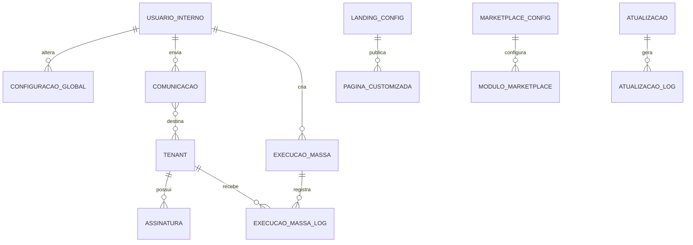

# EF 0_APLICATIVO OPERACAO_SUPER_ADMIN V1

**Projeto:** Epros  
**Empresa:** Siser  
**Tipo de documento:** Especificacao Funcional definitiva  
**Versao:** V1  
**Modulo:** APLICATIVO  
**Submodulo:** OPERACAO_SUPER_ADMIN  
**ID funcional:** APP-TEN-010  
**Status:** Pronto para validacao humana  
**Data:** 2026-06-06

## 1. Controle do documento

| Item | Conteudo |
|---|---|
| Responsavel pela elaboracao | Agente de analise e refinamento funcional |
| Responsavel pela validacao funcional | Siser |
| Responsavel pela validacao tecnica | Siser |
| Area dona do processo | Operacao Siser / Plataforma SaaS |
| Publico-alvo | Produto, operacao Siser, desenvolvimento, QA, suporte, implantacao, seguranca e financeiro SaaS |
| Fonte de verdade | Esta EF descreve o comportamento funcional esperado do Epros para operacao super admin da plataforma |

## 2. Objetivo funcional

O submodulo Operacao Super Admin centraliza a operacao interna da Siser sobre a plataforma Epros: dashboard global, gestao de tenants/clientes, equipe interna, configuracoes globais, instalacao, atualizacao, area publica administravel, comunicacao com clientes, rotinas administrativas e controles de seguranca operacional.

| Pergunta | Resposta |
|---|---|
| Para que o submodulo existe? | Para permitir que a Siser administre a plataforma Epros em nivel global, separada da operacao dos clientes. |
| Que problema de negocio resolve? | Evita que configuracoes globais, atualizacoes, instalacao, comunicacoes e operacao de clientes fiquem espalhadas ou misturadas com menus de tenant. |
| Qual resultado operacional deve produzir? | Operadores autorizados conseguem monitorar, configurar, comunicar, atualizar e administrar clientes/tenants com trilha de auditoria e controles de seguranca. |
| Quais areas dependem dele? | Onboarding, Limites de Plano, Pedidos e Cobranca SaaS, Catalogos Globais SaaS, Permissoes, Configuracao, Area Publica, Workflow, Upload/Migracao, Suporte e Seguranca. |

## 3. Escopo funcional

### 3.1 Dentro do escopo

| Capacidade | Descricao | Observacao |
|---|---|---|
| Dashboard global Siser | Exibir indicadores globais de clientes, assinaturas, receita, cadastros, pagamentos e evolucao anual. | Indicadores dependem de fonte SaaS validada. |
| Menu super admin | Disponibilizar navegacao global da Siser separada do menu de tenant. | Menu fixo identificado; governanca final na MC. |
| Gestao de tenants/clientes | Listar, criar, editar, bloquear/desbloquear, excluir ou impedir exclusao de clientes conforme regra. | Detalhe comercial em Limites/Assinatura. |
| Gestao de equipe Siser | Criar, editar e excluir usuarios internos da operacao. | Email unico e admin principal protegido. |
| Configuracoes globais | Manter empresa Siser, dominios, banco, moeda, e-mail, cron, logo, trial, pagamento offline, captcha, updates e logs. | Campos finais por configuracao. |
| Configuracoes de gateways | Manter chaves e modos de provedores de pagamento. | Operacao de pagamento pertence a cobranca SaaS. |
| Instalador e setup | Executar wizard de requisitos, banco, dominios, usuario admin, importacao inicial e finalizacao. | Deve ser bloqueado apos instalacao concluida. |
| Atualizador | Verificar versao, listar pendencias, executar atualizacao, limpar cache e registrar log. | Requer autorizacao forte e janela de manutencao. |
| Modo demo | Bloquear mutacoes em registros protegidos quando ambiente estiver em modo demonstracao. | Regras finais na MC. |
| Comunicador Siser | Enviar comunicacoes para owners/clientes selecionados e registrar log. | Templates/retry pendentes. |
| Notificacoes administrativas | Enviar alertas de expiração de assinatura, boas-vindas e comunicacoes selecionadas. | Integra com comunicacoes. |
| CMS/landing admin | Administrar landing, marketplace, paginas customizadas e newsletter. | Conteudo publico detalhado pode ficar em submodulo proprio. |
| Execucao em massa controlada | Cadastrar query/acao administrativa para tenants, ativar, processar uma ativa por vez e registrar passed/failed por tenant. | Alto risco; precisa governanca. |
| Rotinas administrativas | Agendar cancelamento de assinatura, atualizacao de plano, gateways, exclusao de banco e atualizacao de dominio de e-mail. | Workflow operacional. |

### 3.2 Fora do escopo

| Item fora do escopo | Motivo | Destino correto |
|---|---|---|
| Operacao funcional de vendas, compras, estoque, financeiro, RH e relatorios de tenant | Rotas aparecem como referencia de menu, mas pertencem aos modulos do cliente. | Modulos de dominio correspondentes |
| Regras completas de assinatura, plano, trial e cobranca | Super admin administra pontos globais; regra comercial detalhada pertence aos submodulos SaaS. | LIMITES_DE_PLANO; PEDIDOS_E_COBRANCA_SAAS |
| Motor tecnico de upload, migracao e atualizacao de banco | Super admin dispara/monitora; execucao tecnica detalhada pertence a plataforma. | PLATAFORMA_COMPARTILHADA / UPLOAD_E_MIGRACAO_DE_DADOS |
| Workflow detalhado de rotinas | Super admin agenda/monitora; motor pertence ao workflow. | PLATAFORMA_COMPARTILHADA / WORKFLOW |
| Configuracao detalhada de cada gateway | Super admin armazena parametros; ciclo financeiro pertence a cobranca. | PEDIDOS_E_COBRANCA_SAAS |

## 4. Glossario e conceitos funcionais

| Termo | Definicao funcional | Observacoes |
|---|---|---|
| Super admin | Papel interno da Siser com acesso global a operacao da plataforma. | Nao e usuario de tenant. |
| Tenant | Ambiente/cliente administrado pela Siser. | Dados operacionais continuam isolados. |
| Owner | Usuario dono/administrador principal do tenant/cliente. | Alvo de comunicacoes e notificacoes. |
| Dashboard global | Painel da Siser com estatisticas da plataforma. | Diferente do dashboard de tenant. |
| Configuracao global | Parametro que afeta a plataforma como um todo. | Exige auditoria. |
| Instalador | Fluxo de preparacao inicial da plataforma. | Deve ser restrito e encerrado apos conclusao. |
| Atualizador | Fluxo de verificacao e aplicacao de atualizacoes. | Exige controle operacional. |
| Modo demo | Estado em que mutacoes sensiveis sao bloqueadas. | Protege dados demonstrativos. |
| Comunicador | Capacidade de enviar mensagens da Siser a owners/clientes. | Deve registrar logs. |
| Execucao em massa | Operacao administrativa aplicada em multiplos tenants. | Alto risco; exige idempotencia e logs. |
| Landing admin | Configuracao administrativa da area publica. | Conteudo exibido ao publico. |

## 5. Atores, papeis e responsabilidades

| Ator/Papel | Responsabilidade | Permissoes esperadas | Restricoes |
|---|---|---|---|
| Super admin Siser | Administrar plataforma, tenants, configuracoes, instalacao, atualizacao e rotinas. | Acesso global autorizado. | Toda acao sensivel deve ser auditada. |
| Admin principal Siser | Gerir equipe interna e configuracoes criticas. | Criar/editar/excluir equipe, exceto protecoes. | Nao deve ser excluido sem politica formal. |
| Operador Siser | Consultar dashboard, tenants, logs e executar rotinas permitidas. | Permissoes segmentadas. | Nao altera configuracao critica sem autorizacao. |
| Financeiro Siser | Consultar indicadores, pagamentos, assinaturas e gateways. | Acesso a dados financeiros SaaS. | Nao altera instalacao/updater. |
| Suporte Siser | Consultar tenant, status, logs e comunicacoes. | Acesso operacional controlado. | Nao executar massa sem permissao. |
| Sistema | Executar rotinas, aplicar modo demo, enviar notificacoes, registrar logs. | Execucao automatica. | Deve respeitar estado, permissao e idempotencia. |

## 6. Visao operacional do submodulo

1. O operador Siser autentica como papel interno autorizado.
2. O Epros exibe menu super admin separado da operacao de tenant.
3. O dashboard global apresenta estatisticas de clientes, assinaturas, pagamentos, cadastros, receita e graficos.
4. O operador acessa tenants/clientes para consultar dados, assinatura, status e acionar manutencoes permitidas.
5. Configuracoes globais sao editadas apenas por papeis autorizados e registradas em auditoria.
6. O instalador fica disponivel apenas quando a plataforma ainda nao foi concluida ou quando uma rotina segura autorizar reexecucao.
7. O atualizador verifica versao, lista pendencias, executa atualizacao e grava log.
8. O comunicador permite selecionar owners/clientes, enviar assunto/mensagem e registrar log com destinatarios.
9. A area publica administravel permite manter landing, marketplace, paginas customizadas e newsletter.
10. Rotinas administrativas executam tarefas recorrentes e registram resultado.
11. Execucao em massa deve processar tenants com log por tenant, ignorando os que ja passaram com sucesso.

## 7. Capacidades funcionais

### 7.1 Dashboard global Siser

| Item | Especificacao |
|---|---|
| Objetivo | Consolidar indicadores globais da plataforma. |
| Acionamento | Acesso ao painel super admin. |
| Pre-condicoes | Usuario interno autenticado e autorizado. |
| Dados de entrada | Periodo, status de assinatura, pagamentos, tenants e cadastros. |
| Processamento | Calcular totais, receita, clientes assinantes, nao assinantes, registros por periodo e grafico anual. |
| Resultado esperado | Painel global com dados confiaveis. |
| Pos-condicoes | Operador pode navegar para detalhes. |
| Excecoes | Fonte ausente ou divergente deve indicar indisponibilidade do indicador. |
| Auditoria | Acesso a dados sensiveis pode ser auditado conforme politica. |

### 7.2 Menu e segregacao super admin

| Item | Especificacao |
|---|---|
| Objetivo | Separar navegacao interna Siser da navegacao de tenant. |
| Acionamento | Login de usuario interno. |
| Pre-condicoes | Papel super admin ou papel interno autorizado. |
| Dados de entrada | Papel, permissoes e contexto. |
| Processamento | Exibir apenas recursos administrativos globais; recursos de tenant ficam em outra fronteira. |
| Resultado esperado | Operador nao confunde operacao Siser com operacao do cliente. |
| Pos-condicoes | Acesso a cada recurso respeita permissao. |
| Excecoes | Recurso sem permissao deve ficar indisponivel. |
| Auditoria | Mudancas de permissoes devem ser auditadas. |

### 7.3 Gestao de tenants e assinaturas pelo super admin

| Item | Especificacao |
|---|---|
| Objetivo | Permitir operacao global de clientes/tenants e assinaturas. |
| Acionamento | Acesso a lista de clientes/tenants, planos ou assinaturas. |
| Pre-condicoes | Permissao interna. |
| Dados de entrada | Tenant, owner, plano, status, modulos habilitados e periodo. |
| Processamento | Consultar, criar, atualizar status, aprovar assinatura offline quando autorizado, ajustar datas e modulos conforme regra de plano. |
| Resultado esperado | Cliente/assinatura refletindo decisao da Siser. |
| Pos-condicoes | Limites e uso do tenant sao atualizados pelos submodulos SaaS. |
| Excecoes | Precedencia de datas/status e aprovacao offline exigem validacao humana. |
| Auditoria | Registrar operador, antes/depois e justificativa. |

### 7.4 Configuracoes globais

| Item | Especificacao |
|---|---|
| Objetivo | Manter parametros globais da plataforma. |
| Acionamento | Tela de configuracoes. |
| Pre-condicoes | Permissao administrativa. |
| Dados de entrada | Empresa, dominios, banco, formatos, moeda, e-mail, cron, logo, trial, captcha, pagamento offline, chaves de provedores e flags. |
| Processamento | Validar obrigatorios, salvar configuracao, atualizar ambiente operacional quando aplicavel e registrar auditoria. |
| Resultado esperado | Plataforma opera com parametros atualizados. |
| Pos-condicoes | Cache/rotinas devem refletir mudancas. |
| Excecoes | Modo demo bloqueia mutacoes configuradas. |
| Auditoria | Obrigatoria para toda mudanca. |

### 7.5 Instalador e setup

| Item | Especificacao |
|---|---|
| Objetivo | Preparar a plataforma para uso inicial ou setup controlado. |
| Acionamento | Acesso ao fluxo de instalacao/setup. |
| Pre-condicoes | Instalacao nao concluida ou autorizacao especial. |
| Dados de entrada | Requisitos, diretorios, banco, dominios, empresa, timezone, usuario admin, licenca/compra quando aplicavel. |
| Processamento | Validar requisitos, criar banco/usuario quando aplicavel, importar estrutura inicial, gravar settings, criar admin, configurar crons, limpar cache e marcar conclusao. |
| Resultado esperado | Plataforma instalada e protegida contra reentrada indevida. |
| Pos-condicoes | Dashboard super admin fica disponivel. |
| Excecoes | Falha deve parar o fluxo e registrar etapa. |
| Auditoria | Registrar passos executados, operador e resultado. |

### 7.6 Atualizador

| Item | Especificacao |
|---|---|
| Objetivo | Verificar e aplicar atualizacoes de plataforma com controle. |
| Acionamento | Operador autorizado acessa atualizador ou rotina programada. |
| Pre-condicoes | Permissao, ambiente valido e janela operacional aprovada quando necessario. |
| Dados de entrada | Versao atual, licenca/identificacao, pendencias e logs. |
| Processamento | Consultar disponibilidade, listar pendencias, executar atualizacao, aplicar seeds, limpar caches e gravar log. |
| Resultado esperado | Plataforma atualizada com log de execucao. |
| Pos-condicoes | Operadores visualizam historico. |
| Excecoes | Falha de licenca, servidor, versao ou requisito bloqueia atualizacao. |
| Auditoria | Obrigatoria. |

### 7.7 Comunicador e notificacoes

| Item | Especificacao |
|---|---|
| Objetivo | Enviar mensagens e notificacoes administrativas para owners/clientes. |
| Acionamento | Operador envia comunicado ou rotina dispara alerta. |
| Pre-condicoes | Destinatarios selecionados ou regra de rotina definida. |
| Dados de entrada | Owners/clientes, assunto, mensagem, tipo de notificacao e canal. |
| Processamento | Validar destinatarios, enviar comunicacao, registrar log com destinatarios, assunto e mensagem. |
| Resultado esperado | Clientes recebem comunicacao e Siser possui trilha. |
| Pos-condicoes | Log consultavel. |
| Excecoes | Falha de envio deve registrar erro e permitir reprocesso conforme regra. |
| Auditoria | Obrigatoria. |

### 7.8 Execucao em massa controlada

| Item | Especificacao |
|---|---|
| Objetivo | Aplicar acao administrativa em multiplos tenants com log por tenant. |
| Acionamento | Operador cadastra e ativa uma execucao em massa. |
| Pre-condicoes | Permissao elevada, acao revisada e status ativo. |
| Dados de entrada | Descricao, comando/acao aprovada, status e lista de tenants alvo. |
| Processamento | Processar uma execucao ativa por vez, ignorar tenant ja processado com sucesso, registrar passed/failed. |
| Resultado esperado | Acao aplicada de forma idempotente e rastreavel. |
| Pos-condicoes | Status pode ir a concluido. |
| Excecoes | Acao insegura ou tenant com erro fica failed. |
| Auditoria | Obrigatoria e detalhada. |

## 8. Regras de negocio

| Regra | Descricao | Condicao | Resultado | Severidade | Observacoes |
|---|---|---|---|---|---|
| REG-001 | Operacao super admin exige usuario interno autorizado. | Acesso a qualquer recurso global. | Acesso sem permissao e bloqueado. | Bloqueante | |
| REG-002 | Menu super admin deve ser separado do menu de tenant. | Montagem de navegacao. | Recursos globais e de cliente nao se misturam. | Bloqueante | |
| REG-003 | Dashboard global deve usar fontes SaaS validadas. | Calculo de indicadores. | Indicador sem fonte confiavel fica indisponivel ou marcado. | Bloqueante | |
| REG-004 | Lista de clientes/tenants deve excluir o proprio operador quando aplicavel em operacoes de equipe. | Listagens internas. | Evita autoalteracao indevida. | Bloqueante | |
| REG-005 | Exclusao de tenant em uso/sessao ativa deve ser bloqueada quando houver risco operacional. | Excluir tenant. | Operacao bloqueada. | Bloqueante | |
| REG-006 | Criacao de tenant pelo super admin deve criar owner e modulos padrao conforme plano aprovado. | Criar cliente interno. | Tenant criado com owner e modulos. | Bloqueante | Regra detalhada em Onboarding/Limites. |
| REG-007 | Assinatura aprovada offline pelo super admin deve registrar operador e justificativa. | Aprovacao manual. | Assinatura atualizada e auditada. | Bloqueante | Precedencia de datas na MC. |
| REG-008 | Atualizacao de status de assinatura deve recalcular datas de inicio/fim conforme regra aprovada. | Alterar status. | Datas ficam consistentes. | Bloqueante | Conflito enviado a MC. |
| REG-009 | Configuracoes globais devem validar campos obrigatorios antes de salvar. | Salvar settings. | Campos ausentes bloqueiam. | Bloqueante | Empresa, timezone, dominios e formatos citados. |
| REG-010 | Mudanca de configuracao global deve limpar/invalidar cache afetado. | Salvar setting. | Plataforma usa valor novo. | Bloqueante | |
| REG-011 | Modo demo bloqueia mutacoes em entidades protegidas. | Ambiente em demo. | Criar/editar/excluir/cancelar protegidos sao bloqueados. | Bloqueante | Lista final na MC. |
| REG-012 | Admin principal possui protecao contra mutacoes indevidas. | Alterar equipe interna. | Operacao bloqueada sem autorizacao. | Bloqueante | |
| REG-013 | Usuario interno da equipe deve possuir email unico. | Criar/editar equipe. | Duplicidade bloqueia. | Bloqueante | |
| REG-014 | Senha de usuario interno deve respeitar minimo e politica aprovada. | Criar equipe. | Senha invalida bloqueia. | Bloqueante | Material cita minimo 8. |
| REG-015 | Instalador deve validar requisitos antes de avancar. | Instalar. | Requisito ausente bloqueia etapa. | Bloqueante | Extensoes/diretorios/banco/dominios. |
| REG-016 | Instalador concluido deve impedir reentrada comum. | Acesso ao instalador apos conclusao. | Redireciona para dashboard ou bloqueia. | Bloqueante | |
| REG-017 | Instalacao deve marcar status concluido somente apos concluir passos obrigatorios. | Finalizar instalacao. | Plataforma fica pronta. | Bloqueante | |
| REG-018 | Atualizador deve exigir permissao elevada. | Abrir/executar update. | Sem permissao bloqueia. | Bloqueante | |
| REG-019 | Atualizador deve registrar log com data/hora e resultado. | Aplicar update. | Historico consultavel. | Bloqueante | |
| REG-020 | Comunicador deve registrar destinatarios, assunto e mensagem. | Enviar comunicado. | Log criado. | Bloqueante | |
| REG-021 | Comunicador deve enviar apenas para owners/clientes selecionados ou regra aprovada. | Enviar comunicado. | Evita envio indevido. | Bloqueante | |
| REG-022 | Alertas de expiracao de assinatura devem ser enviados ao owner conforme rotina aprovada. | Rotina de assinatura. | Owner notificado. | Informativa | Regra detalhada em Limites/Assinatura. |
| REG-023 | Landing admin deve usar singleton ou chave governada para configuracao principal. | Salvar landing. | Uma configuracao ativa por escopo. | Bloqueante | |
| REG-024 | Paginas customizadas exigem slug unico e status de publicacao. | Criar/editar pagina. | Duplicidade bloqueia. | Bloqueante | Campos finais na MC. |
| REG-025 | Newsletter deve permitir listagem e exportacao por operador autorizado. | Operacao newsletter. | Dados exportados conforme permissao. | Informativa | Privacidade na MC. |
| REG-026 | Execucao em massa deve permitir apenas uma acao ativa por vez. | Rotina de massa. | Sistema processa uma ativa. | Bloqueante | |
| REG-027 | Execucao em massa deve ser idempotente por tenant. | Processar tenant. | Tenant com log passed nao reprocessa. | Bloqueante | |
| REG-028 | Execucao em massa deve registrar passed/failed por tenant. | Processamento. | Resultado rastreavel. | Bloqueante | |
| REG-029 | Rotinas administrativas devem possuir agenda e log. | Execucao automatica. | Resultado consultavel. | Bloqueante | |
| REG-030 | Chaves de provedores de pagamento devem ser tratadas como segredo. | Configurar gateways. | Dados sensiveis protegidos. | Bloqueante | |

## 9. Parametros de configuracao

| Parametro | Finalidade | Tipo/formato | Valor padrao | Obrigatorio | Nivel | Quem pode alterar | Impacto |
|---|---|---|---|---|---|---|---|
| Empresa Siser | Nome/dados globais da operacao. | Texto | Nao informado no material | Sim | Global | Super admin | Exibicao e comunicacoes. |
| Dominio base | Dominio principal da plataforma. | Dominio | Nao informado no material | Sim | Global | Super admin | Roteamento SaaS. |
| Dominio frontend | Dominio publico/cliente. | Dominio | Nao informado no material | Sim | Global | Super admin | Area publica. |
| Dominio de e-mail | Dominio usado em comunicacoes. | Dominio | Nao informado no material | Condicional | Global | Super admin | E-mails. |
| Metodo de banco | Metodo de provisionamento de banco. | Dominio | Nao informado no material | Sim | Global | Super admin | Instalacao/provisionamento. |
| Timezone global | Fuso padrao. | Identificador | Nao informado no material | Sim | Global | Super admin | Datas/rotinas. |
| Formatos globais | Data, hora, moeda e exibicao. | Dominio | Nao informado no material | Sim | Global | Super admin | Interface. |
| Periodo de tolerancia | Grace period global SaaS. | Inteiro >= 1 | Nao informado no material | Sim | Global | Super admin | Bloqueio/cobranca. |
| Trial global | Configuracao de teste gratuito. | Booleano/quantidade | Nao informado no material | Condicional | Global | Super admin | Assinaturas. |
| Pagamento offline | Instrucoes e habilitacao de pagamento manual. | Texto/booleano | Nao informado no material | Condicional | Global | Financeiro/Super admin | Cobranca SaaS. |
| Modo demo | Bloqueio de mutacoes protegidas. | Booleano | Nao informado no material | Nao | Ambiente | Super admin | Seguranca demo. |
| Provedores de pagamento | Chaves, modo e status por provedor. | Segredo/configuracao | Nao informado no material | Condicional | Global | Financeiro/Super admin | Checkout/cobranca. |
| Chave/licenca de atualizacao | Identificador para verificar updates. | Texto seguro | Nao informado no material | Condicional | Global | Super admin | Atualizador. |
| Agenda de rotinas | Cronograma das rotinas. | Expressao/agendamento | Nao informado no material | Sim | Global | Super admin | Automacoes. |

## 10. Modelo de dados funcional e implantavel

### 10.1 Visao geral do modelo

O modelo do super admin combina cadastros e movimentos de operacao global da Siser: tenants/clientes, usuarios internos, configuracoes globais, paginas publicas, comunicacoes, newsletter, instalacao, atualizacao, execucoes em massa e logs.

| Grupo de dados | Entidades/tabelas | Papel funcional | Observacoes |
|---|---|---|---|
| Tenants/clientes | business, tenant, subscription snapshot | Administrar clientes da plataforma. | Campos completos de business nao informados no material. |
| Operacao interna | landlord_users, team_user | Equipe Siser e admin principal. | Email unico e primary_admin. |
| Configuracoes globais | system_settings, landlord_settings, env_settings | Parametros globais, dominios, banco, gateways e formatos. | Estrutura final deve evitar escrita direta insegura. |
| Comunicacao | superadmin_communicator_logs | Registro de comunicados enviados. | business_ids, subject, message citados. |
| Area publica | superadmin_frontend_pages, landing_page_settings, marketplace_settings, custom_pages, newsletter_subscribers | CMS, landing, marketplace, paginas e newsletter. | Campos detalhados limitados. |
| Instalacao/setup | installation_state, setup_state, requirements_check, admin_wizard | Controlar instalacao e status concluido. | Variaveis/dados de ambiente devem ser governados. |
| Atualizacao | updates, updating, updateslog | Controlar updates e logs. | Detalhe tecnico em plataforma. |
| Execucao em massa | execute_queries, execute_query_logs | Aplicar acao por tenant com status e logs. | Status draft/active/completed e passed/failed. |
| Rotinas | routine_task_log | Registrar cancelamentos, update-plan, delete-database e update-email-domain. | Agenda final nao informada. |

### 10.2 Entidades e tabelas

| Entidade funcional | Tabela/estrutura | Tipo | Finalidade | Chave primaria | Observacoes de implantacao |
|---|---|---|---|---|---|
| Cliente/Tenant administrado | business / tenant | Mestre | Representar cliente da plataforma. | Nao informado no material | Campos completos nao informados. |
| Usuario interno Siser | landlord_users / team_user | Mestre | Equipe do super admin. | id | Email unico; primary_admin. |
| Configuracao global | system_settings / landlord_settings | Auxiliar | Guardar parametros globais. | key/id | Definir modelo final. |
| Comunicacao enviada | superadmin_communicator_logs | Movimento/Log | Registrar comunicacao do super admin. | Nao informado no material | business_ids, subject, message. |
| Pagina frontend global | superadmin_frontend_pages | Mestre/CMS | Administrar paginas publicas. | Nao informado no material | Campos nao detalhados. |
| Landing admin | landing_page_settings | Configuracao | Configurar landing principal. | id | Singleton por id=1 identificado. |
| Marketplace admin | marketplace_settings | Configuracao | Configurar marketplace por modulo. | Nao informado no material | Upsert por modulo. |
| Pagina customizada | custom_pages | Mestre/CMS | CRUD de paginas customizadas. | Nao informado no material | Slug/publicacao pendentes. |
| Assinante newsletter | newsletter_subscribers | Movimento | Listagem/export de assinantes. | Nao informado no material | Privacidade pendente. |
| Execucao em massa | execute_queries | Movimento/Rotina | Guardar acao administrativa em massa. | Nao informado no material | Status draft/active/completed. |
| Log da execucao em massa | execute_query_logs | Log | Resultado por tenant. | Nao informado no material | passed/failed. |
| Atualizacao | updates/updating/updateslog | Movimento/Log | Controlar updates. | Nao informado no material | Detalhe em plataforma. |
| Estado de instalacao | installation_state / setup_state | Configuracao | Controlar fluxo de instalacao/setup. | Nao informado no material | Status concluido. |

### 10.3 Relacionamentos, cardinalidade e dependencia

| Origem | Relacionamento | Destino | Cardinalidade | Obrigatorio | Regra de integridade |
|---|---|---|---|---|---|
| Cliente/Tenant | possui | Owner | 1:1/N:1 | Sim | Owner recebe notificacoes. |
| Cliente/Tenant | possui | Assinatura | 1:N | Condicional | Regra detalhada em Limites/Assinatura. |
| Comunicacao | envia para | Cliente/Tenant | N:N | Sim | business_ids/destinatarios devem ser registrados. |
| Execucao em massa | processa | Cliente/Tenant | N:N | Sim | Log por tenant. |
| Execucao em massa | possui | Log da execucao | 1:N | Sim | passed/failed por tenant. |
| Landing admin | configura | Area publica | 1:1 | Sim | Singleton quando aplicavel. |
| Marketplace admin | configura | Modulo marketplace | 1:1/N:1 | Condicional | Upsert por modulo. |
| Usuario interno | executa | Configuracao/Update/Comunicacao | 1:N | Sim | Auditoria por operador. |
| Atualizacao | gera | Log de atualizacao | 1:N | Sim | Historico de execucao. |

### 10.4 Chaves, unicidade, indices e constraints funcionais

| Entidade/tabela | Tipo de restricao | Campo(s) | Regra | Comportamento esperado |
|---|---|---|---|---|
| Usuario interno | Unico | email | Email duplicado bloqueia. | Bloquear duplicidade. |
| Usuario interno | Protecao | primary_admin | Admin principal protegido. | Bloquear mutacao indevida. |
| Landing admin | Unico/singleton | id/escopo | Uma configuracao principal por escopo. | Upsert controlado. |
| Marketplace admin | Unico funcional | modulo | Uma configuracao por modulo. | Upsert controlado. |
| Pagina customizada | Unico | slug | Slug duplicado deve bloquear. | Bloquear duplicidade. |
| Execucao em massa | Status | status | draft, active, completed. | Apenas ativa processa. |
| Execucao em massa | Constraint funcional | status active | Apenas uma acao ativa por vez. | Bloquear segunda ativa. |
| Log de execucao | Unico funcional | execucao + tenant + resultado passed | Tenant aprovado nao reprocessa. | Idempotencia. |
| Configuracao global | Unico | key/escopo | Uma chave por escopo. | Evitar sobrescrita indevida. |
| Comunicacao | Auditoria | destinatarios, assunto, mensagem | Deve registrar envio. | Rastreabilidade. |

### 10.5 Regras de persistencia, exclusao e historico

| Entidade/tabela | Criacao | Alteracao | Exclusao/inativacao | Historico/auditoria | Retencao |
|---|---|---|---|---|---|
| Usuario interno | Exige email unico e senha valida. | Protege admin principal. | Excluir conforme permissao e protecao. | Obrigatoria. | Nao informado no material. |
| Configuracao global | Exige permissao e validacao. | Deve invalidar cache. | Nao informado no material. | Obrigatoria. | Nao informado no material. |
| Comunicacao | Criada no envio. | Alteracao nao informada. | Nao informado no material. | Log e essencial. | Nao informado no material. |
| Landing/Marketplace/Paginas | Criadas por admin. | Publicacao/ativacao controlada. | Nao informado no material. | Obrigatoria. | Nao informado no material. |
| Newsletter | Criada por inscricao publica. | Export/listagem por admin. | Nao informado no material. | Exportacao deve ser auditada. | Nao informado no material. |
| Atualizacao | Criada ao checar/executar. | Status/log atualizado. | Nao informado no material. | Obrigatoria. | Nao informado no material. |
| Execucao em massa | Criada em draft. | Pode ativar/concluir. | Excluir com logs conforme regra. | Obrigatoria por tenant. | Nao informado no material. |
| Instalacao/setup | Criada durante wizard. | Marca concluido. | Nao informado no material. | Obrigatoria por etapa. | Nao informado no material. |

### 10.6 Diagrama logico funcional

### 10.7 Lacunas de modelo de dados

| Lacuna | Entidade/tabela afetada | Impacto | Encaminhamento para MC |
|---|---|---|---|
| Campos completos de business/tenant nao foram detalhados. | business/tenant | Modelo de gestao de clientes incompleto neste submodulo. | Sim |
| Configuracoes globais aparecem como chaves/ambiente sem modelo final. | settings | Risco de escrita insegura e baixa auditoria. | Sim |
| Paginas, landing e marketplace possuem poucos campos detalhados. | CMS admin | Implantacao precisa dicionario final. | Sim |
| Execucao em massa precisa campos de comando, alvo, status, logs e aprovacao. | execute_queries | Alto risco operacional. | Sim |
| Atualizador depende de regras tecnicas externas. | updates | Fronteira com plataforma. | Sim |
| Dados de gateways sao sensiveis e requerem modelo seguro. | configuracao de pagamento | Risco de segredo exposto. | Sim |

## 11. Dicionario de dados implantavel

### 11.1 Entidade: Usuario Interno Siser

**Finalidade:** representar usuario da Siser autorizado a operar o super admin.

| Campo | Tipo/formato | Tamanho/precisao/dominio | Obrigatorio | Chave/relacionamento | Regra funcional/observacao |
|---|---|---|---|---|---|
| id | Identificador | Nao informado no material | Sim | PK | Admin inicial pode ser id=1 em fluxo de instalacao; validar regra final. |
| names | Texto | Nao informado no material | Sim | Informativo | Nome do usuario interno. |
| email | Texto | Nao informado no material | Sim | Unico | Email unico. |
| password | Texto seguro | Nao informado no material | Sim | Credencial | Minimo 8 citado; politica final em MC. |
| creatorid | Identificador | 0 no admin inicial quando informado | Nao informado no material | Auditoria | Criador. |
| unique_id | Texto | Nao informado no material | Nao informado no material | Identificador | Usado em setup. |
| timezone | Texto/identificador | Nao informado no material | Nao informado no material | Preferencia | Timezone do usuario. |
| primary_admin | Booleano | Sim/Nao | Nao informado no material | Protecao | Admin principal protegido. |

| Item | Especificacao |
|---|---|
| Chave primaria | id |
| Chaves unicas | email |
| Relacionamentos | Configuracoes, comunicacoes, execucoes e updates executados |
| Cardinalidade | 1:N com acoes administrativas |
| Historico/auditoria | Obrigatoria |
| Regras de exclusao | Protecao de admin principal |
| Retencao de dados | Nao informado no material |

### 11.2 Entidade: Configuracao Global

**Finalidade:** guardar parametros globais da plataforma Siser.

| Campo | Tipo/formato | Tamanho/precisao/dominio | Obrigatorio | Chave/relacionamento | Regra funcional/observacao |
|---|---|---|---|---|---|
| key | Texto | Nao informado no material | Sim | Unico por escopo | Nome da configuracao. |
| value | Texto/JSON/segredo | Nao informado no material | Condicional | Valor | Valor da configuracao. |
| escopo | Dominio | global, landlord, tenant, gateway, install | Sim | Escopo | Padronizacao criada como lacuna organizada. |
| is_secret | Booleano | Sim/Nao | Condicional | Seguranca | Necessario para chaves de provedores. |
| updated_by | Identificador | Nao informado no material | Sim | Auditoria | Operador. |
| updated_at | Data/hora | Nao informado no material | Sim | Auditoria | Ultima alteracao. |

| Item | Especificacao |
|---|---|
| Chave primaria | Nao informado no material |
| Chaves unicas | key + escopo |
| Relacionamentos | Usuario interno |
| Cardinalidade | Usuario 1:N configuracoes alteradas |
| Historico/auditoria | Obrigatoria |
| Regras de exclusao | Nao informado no material |
| Retencao de dados | Nao informado no material |

### 11.3 Entidade: Comunicacao Super Admin

**Finalidade:** registrar mensagens enviadas pela Siser a owners/clientes.

| Campo | Tipo/formato | Tamanho/precisao/dominio | Obrigatorio | Chave/relacionamento | Regra funcional/observacao |
|---|---|---|---|---|---|
| id | Identificador | Nao informado no material | Sim | PK | Identificador do log. |
| business_ids | Lista | Nao informado no material | Sim | Relacionamento | Destinatarios/tenants. |
| subject | Texto | Nao informado no material | Sim | Informativo | Assunto. |
| message | Texto longo | Nao informado no material | Sim | Informativo | Mensagem. |
| sent_by | Identificador | Nao informado no material | Sim | FK | Usuario interno. |
| sent_at | Data/hora | Nao informado no material | Sim | Auditoria | Data de envio. |
| status | Dominio | Nao informado no material | Nao informado no material | Status | Sucesso/falha recomendado na MC. |

| Item | Especificacao |
|---|---|
| Chave primaria | id |
| Chaves unicas | Nao informado no material |
| Relacionamentos | Usuario interno, tenants/clientes |
| Cardinalidade | Comunicacao N:N tenants |
| Historico/auditoria | A propria entidade e log |
| Regras de exclusao | Nao informado no material |
| Retencao de dados | Nao informado no material |

### 11.4 Entidade: Area Publica Admin

**Finalidade:** administrar landing, marketplace, paginas customizadas e newsletter.

| Entidade | Campo | Tipo/formato | Tamanho/precisao/dominio | Obrigatorio | Chave/relacionamento | Regra funcional/observacao |
|---|---|---|---|---|---|---|
| landing_page_settings | id | Identificador | id=1 quando informado | Sim | PK/Singleton | Configuracao principal. |
| landing_page_settings | settings | Texto/JSON | Nao informado no material | Nao informado no material | Configuracao | Dados da landing. |
| marketplace_settings | module | Texto | Nao informado no material | Sim | Unico funcional | Configuracao por modulo. |
| marketplace_settings | settings | Texto/JSON | Nao informado no material | Nao informado no material | Configuracao | Dados do marketplace. |
| custom_pages | id | Identificador | Nao informado no material | Sim | PK | Pagina customizada. |
| custom_pages | slug | Texto | Nao informado no material | Sim | Unico | URL amigavel. |
| custom_pages | status | Dominio | ativo/inativo nao detalhado | Sim | Status | Publicacao. |
| newsletter_subscribers | id | Identificador | Nao informado no material | Sim | PK | Assinante. |
| newsletter_subscribers | email | Texto | Nao informado no material | Sim | Unico recomendado | Assinante de newsletter. |

| Item | Especificacao |
|---|---|
| Chave primaria | id ou module conforme entidade |
| Chaves unicas | slug; email recomendado; module para marketplace |
| Relacionamentos | Usuario interno para auditoria |
| Cardinalidade | Nao informado no material |
| Historico/auditoria | Alteracoes e exportacoes devem ser auditadas |
| Regras de exclusao | Nao informado no material |
| Retencao de dados | Nao informado no material |

### 11.5 Entidade: Execucao em Massa

**Finalidade:** guardar acao administrativa aplicada a multiplos tenants com idempotencia e log.

| Campo | Tipo/formato | Tamanho/precisao/dominio | Obrigatorio | Chave/relacionamento | Regra funcional/observacao |
|---|---|---|---|---|---|
| id | Identificador | Nao informado no material | Sim | PK | Identificador. |
| description | Texto | Nao informado no material | Sim | Informativo | Descricao da acao. |
| action_payload | Texto/JSON | Nao informado no material | Sim | Conteudo | Comando/acao aprovada. |
| status | Dominio | draft, active, completed | Sim | Status | Apenas active processa. |
| created_by | Identificador | Nao informado no material | Sim | FK | Usuario interno. |
| created_at | Data/hora | Nao informado no material | Sim | Auditoria | Criacao. |
| approved_by | Identificador | Nao informado no material | Condicional | Auditoria | Recomendado por risco. |

| Item | Especificacao |
|---|---|
| Chave primaria | id |
| Chaves unicas | Apenas uma active por vez recomendado |
| Relacionamentos | Usuario interno, logs, tenants |
| Cardinalidade | 1:N logs |
| Historico/auditoria | Obrigatoria |
| Regras de exclusao | Excluir deve tratar logs; regra final na MC |
| Retencao de dados | Nao informado no material |

### 11.6 Entidade: Log de Execucao em Massa

**Finalidade:** registrar resultado da execucao em massa por tenant.

| Campo | Tipo/formato | Tamanho/precisao/dominio | Obrigatorio | Chave/relacionamento | Regra funcional/observacao |
|---|---|---|---|---|---|
| id | Identificador | Nao informado no material | Sim | PK | Identificador. |
| execute_query_id | Identificador | Nao informado no material | Sim | FK | Execucao. |
| tenant_id | Identificador | Nao informado no material | Sim | FK | Tenant processado. |
| status | Dominio | passed, failed | Sim | Status | passed nao reprocessa. |
| message | Texto | Nao informado no material | Nao | Informativo | Erro/resultado. |
| processed_at | Data/hora | Nao informado no material | Sim | Auditoria | Data de processamento. |

| Item | Especificacao |
|---|---|
| Chave primaria | id |
| Chaves unicas | execute_query_id + tenant_id + passed recomendado |
| Relacionamentos | Execucao em massa, tenant |
| Cardinalidade | Execucao 1:N logs |
| Historico/auditoria | A propria entidade e log |
| Regras de exclusao | Nao informado no material |
| Retencao de dados | Nao informado no material |

### 11.7 Entidade: Atualizacao e Log

**Finalidade:** controlar checagens, execucoes e historico de atualizacao da plataforma.

| Campo | Tipo/formato | Tamanho/precisao/dominio | Obrigatorio | Chave/relacionamento | Regra funcional/observacao |
|---|---|---|---|---|---|
| id | Identificador | Nao informado no material | Sim | PK | Identificador. |
| version | Texto | Nao informado no material | Sim | Informativo | Versao. |
| status | Dominio | Nao informado no material | Sim | Status | Pendente/sucesso/falha a definir. |
| checked_at | Data/hora | Nao informado no material | Nao | Auditoria | Checagem. |
| executed_at | Data/hora | Nao informado no material | Nao | Auditoria | Execucao. |
| executed_by | Identificador | Nao informado no material | Condicional | FK | Usuario interno. |
| log | Texto longo | Nao informado no material | Nao | Log | Resultado. |

| Item | Especificacao |
|---|---|
| Chave primaria | id |
| Chaves unicas | Nao informado no material |
| Relacionamentos | Usuario interno |
| Cardinalidade | Nao informado no material |
| Historico/auditoria | Obrigatoria |
| Regras de exclusao | Nao informado no material |
| Retencao de dados | Nao informado no material |

## 12. Estados, situacoes e ciclos de vida

| Entidade/processo | Estado | Significado | Estado inicial | Pode ir para | Quem altera | Regra de transicao |
|---|---|---|---|---|---|---|
| Instalacao | Nao concluida | Plataforma ainda permite wizard. | Sim | Concluida | Sistema/Super admin | Apos passos obrigatorios. |
| Instalacao | Concluida | Plataforma pronta e instalador bloqueado. | Nao | Nao informado no material | Sistema | Status concluido. |
| Assinatura | Aprovada | Uso permitido conforme plano. | Condicional | Aguardando/Recusada/Cancelada | Sistema/Super admin | Regra SaaS. |
| Assinatura | Aguardando | Pendente. | Condicional | Aprovada/Recusada | Sistema/Super admin | |
| Execucao em massa | Draft | Criada, nao processa. | Sim | Active, Excluida | Super admin | Ativacao autorizada. |
| Execucao em massa | Active | Elegivel para processamento. | Nao | Completed | Sistema/Super admin | Apenas uma ativa por vez. |
| Execucao em massa | Completed | Finalizada. | Nao | Nao informado no material | Sistema | Apos tenants processados. |
| Tenant em massa | Passed | Processado com sucesso. | Nao | Nao reprocessar | Sistema | Idempotencia. |
| Tenant em massa | Failed | Falhou. | Nao | Reprocessar conforme regra | Sistema/Super admin | |
| Pagina customizada | Publicada | Disponivel publicamente. | Condicional | Rascunho/Inativa | Super admin | Status de publicacao. |
| Modo demo | Ativo | Mutacoes protegidas bloqueadas. | Condicional | Inativo | Super admin | |

## 13. Fluxos funcionais

### 13.1 Fluxo principal: acesso super admin

| Passo | Ator | Acao | Entrada | Validacao | Saida | Proximo passo |
|---|---|---|---|---|---|---|
| 1 | Operador Siser | Autentica. | Credenciais. | Usuario interno autorizado. | Sessao super admin. | 2 |
| 2 | Sistema | Monta menu global. | Papel/permissoes. | Permissao global. | Menu super admin. | 3 |
| 3 | Operador Siser | Acessa recurso. | Recurso escolhido. | Permissao especifica. | Tela/operacao. | Fim |

### 13.2 Fluxo principal: instalacao

| Passo | Ator | Acao | Entrada | Validacao | Saida | Proximo passo |
|---|---|---|---|---|---|---|
| 1 | Super admin | Abre instalador. | Ambiente. | Instalacao nao concluida. | Wizard. | 2 |
| 2 | Sistema | Verifica requisitos. | Requisitos e diretorios. | Todos OK. | Prossegue. | 3 |
| 3 | Super admin | Informa banco/dominios. | Host, porta, banco, usuario, dominios. | Campos obrigatorios. | Configuracao validada. | 4 |
| 4 | Sistema | Prepara estrutura. | Dados validados. | Importacao/seed. | Estrutura inicial. | 5 |
| 5 | Super admin | Cria usuario admin. | Nome, email, senha. | Email/senha validos. | Admin criado. | 6 |
| 6 | Sistema | Finaliza. | Resultado. | Tudo concluido. | Status concluido e cache limpo. | Fim |

### 13.3 Fluxo principal: execucao em massa

| Passo | Ator | Acao | Entrada | Validacao | Saida | Proximo passo |
|---|---|---|---|---|---|---|
| 1 | Super admin | Cadastra acao. | Descricao e payload. | Permissao elevada. | Execucao draft. | 2 |
| 2 | Super admin | Ativa acao. | Execucao. | Nenhuma outra ativa. | Execucao active. | 3 |
| 3 | Sistema | Processa tenants. | Tenants alvo. | Ignorar passed. | Logs passed/failed. | 4 |
| 4 | Sistema | Finaliza. | Logs. | Todos avaliados. | Status completed. | Fim |

### 13.4 Fluxos alternativos e excecoes

| Cenario | Condicao | Comportamento esperado | Mensagem/retorno | Registro necessario |
|---|---|---|---|---|
| Usuario sem permissao | Acesso global. | Bloquear. | Nao informado no material. | Tentativa. |
| Modo demo | Mutacao protegida. | Bloquear. | Nao informado no material. | Acao bloqueada. |
| Instalacao ja concluida | Acesso ao instalador. | Redirecionar/bloquear. | Nao informado no material. | Acesso. |
| Atualizacao falha | Requisito/licenca/versao invalida. | Bloquear execucao ou registrar falha. | Nao informado no material. | Log. |
| Execucao em massa com tenant ja passed | Processamento. | Ignorar tenant. | Nao se aplica. | Log existente. |
| Envio de comunicado falha | Canal indisponivel. | Registrar failed e permitir reprocesso conforme regra. | Nao informado no material. | Log de erro. |

## 14. Validacoes, consistencias e bloqueios

| Validacao | Onde ocorre | Condicao verificada | Comportamento quando valido | Comportamento quando invalido | Mensagem esperada |
|---|---|---|---|---|---|
| Papel super admin | Acesso global | Usuario interno autorizado. | Libera. | Bloqueia. | Nao informado no material. |
| Admin principal protegido | Equipe Siser | Operacao permitida. | Salva. | Bloqueia. | Nao informado no material. |
| Email unico | Equipe Siser | Email nao existe. | Salva. | Bloqueia. | Nao informado no material. |
| Senha minima | Equipe Siser | Senha atende politica. | Salva. | Bloqueia. | Nao informado no material. |
| Configuracoes obrigatorias | Settings | Empresa, dominios, timezone, formatos. | Salva. | Bloqueia. | Nao informado no material. |
| Requisitos instalador | Instalacao | Requisitos/diretorios/banco. | Prossegue. | Bloqueia etapa. | Nao informado no material. |
| Atualizador autorizado | Atualizacao | Permissao elevada. | Prossegue. | Bloqueia. | Nao informado no material. |
| Pagina slug unico | Paginas customizadas | Slug nao existe. | Salva. | Bloqueia. | Nao informado no material. |
| Execucao ativa unica | Execucao em massa | Nao ha outra active. | Ativa. | Bloqueia. | Nao informado no material. |
| Log passed | Execucao em massa | Tenant ja processado com sucesso. | Ignora. | Nao se aplica. | Nao se aplica. |

## 15. Permissoes, seguranca e segregacao

| Recurso/acao | Permissao necessaria | Papel autorizado | Restricao de dados | Auditoria obrigatoria |
|---|---|---|---|---|
| Acessar dashboard global | Ver operacao global | Super admin/operador Siser | Dados globais Siser | Condicional |
| Manter tenants/clientes | Administrar clientes SaaS | Super admin Siser | Global | Sim |
| Aprovar assinatura manual | Administrar assinatura | Super admin/financeiro Siser | Cliente selecionado | Sim |
| Manter configuracoes globais | Administrar settings globais | Super admin Siser | Global | Sim |
| Manter gateways | Administrar pagamento SaaS | Super admin/financeiro | Segredos protegidos | Sim |
| Executar instalador | Administrar instalacao | Super admin autorizado | Ambiente | Sim |
| Executar atualizador | Administrar atualizacao | Super admin autorizado | Ambiente | Sim |
| Enviar comunicador | Comunicar clientes | Super admin/suporte autorizado | Destinatarios selecionados | Sim |
| Manter equipe Siser | Administrar equipe | Admin principal/Super admin | Equipe Siser | Sim |
| Executar massa | Operacao critica | Super admin autorizado | Tenants alvo | Sim |
| Exportar newsletter | Exportar dados publicos | Super admin/marketing autorizado | Base de assinantes | Sim |

## 16. Interfaces, telas e experiencia

| Interface | Objetivo | Campos/acoes preservados | Observacoes |
|---|---|---|---|
| Dashboard Siser | Painel global. | Top stats, grafico anual, clientes, pagamentos, receita. | Fonte validada na MC. |
| Usuarios globais | Gerir users/owners/usuarios internos conforme escopo. | Lista, criar, editar, excluir. | Separar equipe Siser de usuarios tenant. |
| Planos | Acesso administrativo a planos. | Listagem/manutencao de planos. | Dono funcional em Limites/Assinatura. |
| Cupons | Manter cupons SaaS. | Lista/manutencao. | Dono em Catalogos/Assinatura. |
| Features | Manter funcionalidades globais. | Lista/manutencao. | Dono em Catalogos Globais. |
| Tipo de pagamento | Manter tipos de pagamento. | Lista/manutencao. | Dono em Catalogos/Pedidos SaaS. |
| Moeda e pais | Manter catalogos globais. | Lista/manutencao. | Dono em Catalogos/Cadastros. |
| Website setting | Manter configuracao publica. | Parametros do site. | Fronteira com CMS/area publica. |
| Instalador | Configurar requisitos, banco, dominios, admin e finalizar. | Welcome, requirements, banco, settings, admin, finish. | Disponivel apenas quando autorizado. |
| Atualizador | Ver pendencias e executar update. | Lista pendencias, executar, logs. | Requer janela/controle. |
| Landing settings | Configurar landing. | Settings da landing. | Campos finais pendentes. |
| Marketplace settings | Configurar marketplace. | Configuracao por modulo. | |
| Paginas customizadas | CRUD de paginas. | Slug, conteudo, status. | Campos finais pendentes. |
| Newsletter | Listar/exportar assinantes. | Lista e export. | Privacidade. |
| Team Siser | Gerir equipe interna. | Nome, email, senha, primary_admin. | Protecoes. |
| Settings gerais | Configuracoes globais. | Empresa, dominio, banco, gateway, email, cron, logo, trial, offline, captcha, logs. | Auditoria obrigatoria. |
| Execute queries | Execucao em massa. | Descricao, payload, status, logs. | Alto risco. |

## 17. Integracoes e contratos

| Contrato funcional | Direcao | Entrada | Saida | Regra |
|---|---|---|---|---|
| Consultar updates | Saida/entrada | Versao, licenca/identificacao, ambiente | Status de update e mensagens | Requer permissao e seguranca. |
| Enviar comunicacao | Saida | Destinatarios, assunto, mensagem | Log de envio | Destinatarios selecionados. |
| Configurar provedor de pagamento | Entrada | Chaves, modo, status | Configuracao salva | Segredos protegidos. |
| Rotina assinatura expirada | Saida automatica | Assinaturas proximas de expirar | Notificacao ao owner | Regra de assinatura. |
| Criar banco/setup | Entrada | Dados de banco/metodo | Banco/usuario/config criado | Instalador autorizado. |
| Execucao em massa | Interna | Acao aprovada, tenants | Logs passed/failed | Uma ativa por vez. |

## 18. Relatorios e consultas

| Consulta/relatorio | Objetivo | Filtros | Campos esperados | Observacoes |
|---|---|---|---|---|
| Dashboard global | Monitorar operacao. | Periodo/status. | Tenants, assinaturas, pagamentos, receita, cadastros. | |
| Tenants/clientes | Acompanhar base. | Status, plano, assinatura, busca. | Cliente, owner, plano, status, datas. | |
| Assinaturas | Acompanhar planos e vencimentos. | Status, periodo, plano. | Cliente, status, inicio, fim, valor. | Dono em Assinatura/Limites. |
| Logs de comunicacao | Auditar mensagens. | Periodo, destinatario, operador. | Assunto, mensagem, destinatarios, status. | |
| Logs de update | Auditar atualizacoes. | Periodo, versao, status. | Versao, data, operador, resultado. | |
| Logs de execucao em massa | Auditar operacao critica. | Execucao, tenant, status. | Tenant, status, mensagem, data. | |
| Newsletter | Exportar assinantes. | Periodo/status. | Email e dados permitidos. | Privacidade. |

## 19. Requisitos nao funcionais

| Categoria | Requisito | Critério |
|---|---|---|
| Seguranca | Recurso super admin exige autenticacao e permissao interna. | Sem permissao, bloquear. |
| Auditoria | Toda alteracao global deve registrar operador, data e antes/depois quando aplicavel. | Trilha consultavel. |
| Segredo | Chaves de pagamento e licenca devem ser protegidas. | Nao exibir valor integral. |
| Resiliencia | Instalacao/update/execucao em massa devem registrar etapa e falha. | Possivel diagnosticar e reprocessar. |
| Idempotencia | Execucao em massa nao reprocessa tenant com sucesso. | Log passed impede reprocesso. |
| Segregacao | Super admin nao opera dados tenant sem escopo/justificativa. | Fronteira preservada. |
| Governanca | Atualizacoes e execucoes criticas exigem permissao elevada e aprovacao quando definida. | Evita acao acidental. |

## 20. Criterios de aceite

| Criterio | Dado um contexto | Quando | Entao |
|---|---|---|---|
| Menu separado | Usuario super admin autenticado | Acessa o Epros | Ve menu global Siser, nao menu operacional de tenant. |
| Configuracao auditada | Super admin altera setting global | Salva | Alteracao fica registrada e cache afetado e invalidado. |
| Modo demo bloqueia | Ambiente demo ativo | Operador tenta mutacao protegida | Epros bloqueia e registra tentativa. |
| Instalacao concluida bloqueia reentrada | Plataforma instalada | Acessam instalador comum | Epros bloqueia ou redireciona. |
| Update registra log | Super admin executa update | Processo termina | Log indica versao, data e resultado. |
| Comunicador registra envio | Operador envia mensagem | Envio termina | Log contem destinatarios, assunto e mensagem. |
| Execucao em massa idempotente | Tenant ja possui passed | Rotina roda novamente | Tenant nao e reprocessado. |
| Equipe exige email unico | Operador cria usuario interno | Email ja existe | Epros bloqueia. |
| Pagina custom exige slug unico | Operador cria pagina | Slug ja existe | Epros bloqueia. |

## 21. Notas de rodape

[^agente-001]: A estrutura de permissao por recurso, a separacao entre equipe Siser e usuarios tenant, o modelo seguro de configuracao global e os criterios de idempotencia foram organizados pelo agente a partir de lacunas e riscos do material. O que nao estava definido foi mantido como decisao na MC.
