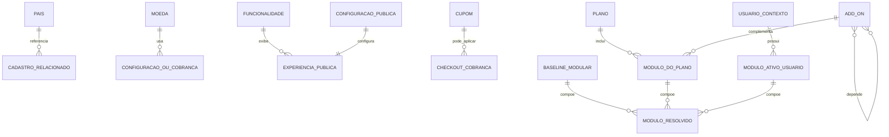

# EF 0_APLICATIVO CATALOGOS_GLOBAIS_SAAS V1

**Projeto:** Epros  
**Empresa:** Siser  
**Tipo de documento:** Especificacao Funcional definitiva  
**Versao:** V1  
**Modulo:** APLICATIVO  
**Submodulo:** CATALOGOS_GLOBAIS_SAAS  
**ID funcional:** APP-TEN-007  
**Status:** Pronto para validacao humana  
**Data:** 2026-06-06

## 1. Controle do documento

| Item | Conteudo |
|---|---|
| Responsavel pela elaboracao | Agente de analise e refinamento funcional |
| Responsavel pela validacao funcional | Siser |
| Responsavel pela validacao tecnica | Siser |
| Area dona do processo | Plataforma SaaS / Administracao do Epros |
| Publico-alvo | Produto, negocio, dados, desenvolvimento, QA, implantacao e suporte |
| Fonte de verdade | Esta EF descreve o comportamento funcional esperado do Epros para catalogos globais SaaS |

## 2. Objetivo funcional

O submodulo de Catalogos Globais SaaS centraliza cadastros e configuracoes globais usados pela plataforma Epros, sem segregacao por cliente, incluindo paises, moedas, funcionalidades publicas, cupons, configuracoes publicas do site, tipos de pagamento, catalogo modular, add-ons e ativacao de modulos.

| Pergunta | Resposta |
|---|---|
| Para que o submodulo existe? | Para manter catalogos globais e capacidades modulares que sustentam configuracao, exibicao, contratacao e uso da plataforma Epros. |
| Que problema de negocio resolve? | Evita duplicidade de cadastros basicos e permite que recursos SaaS, moedas, paises, funcionalidades, cupons, tipos de pagamento e modulos sejam administrados de forma centralizada. |
| Qual resultado operacional deve produzir? | Catalogos globais disponiveis para formularios, configuracoes, exibicao publica, contratacao e autorizacao de modulos. |
| Quais areas dependem dele? | Assinatura e Planos, Limites de Plano, Onboarding e Empresa, Pedidos e Cobranca SaaS, Configuracao, Permissoes de Menu e Dashboard/Layout. |

## 3. Escopo funcional

### 3.1 Dentro do escopo

| Capacidade | Descricao | Observacao |
|---|---|---|
| Catalogo global de paises | Cadastro, consulta, alteracao e exclusao controlada de paises. | Exclusao deve respeitar uso por cadastros relacionados. |
| Catalogo global de moedas | Cadastro e manutencao de moedas, simbolos e nomes. | Seed inicial de moedas nao deve ser inventado. |
| Catalogo global de funcionalidades | Cadastro e exibicao de funcionalidades publicas do Epros. | Funcionalidades podem alimentar area publica/comercial. |
| Catalogo global de cupons | Cadastro de cupons com desconto, limite e codigo. | Aplicacao do cupom no checkout nao esta comprovada no material. |
| Configuracao publica do site | Manutencao de configuracao unica com nome, titulo, descricao, rodape, email, copyright, decimais, redes sociais e logo. | O material indica comportamento de registro unico. |
| Tipos de pagamento | Catalogo global de tipos de pagamento. | Detalhe estrutural do cadastro nao esta completamente informado no material. |
| Catalogo modular e add-ons | Catalogo tecnico-comercial de modulos, add-ons, precos, midia, estado e dependencias. | Relaciona-se com plano, permissao e ativacao de recursos. |
| Ativacao de modulos por usuario/contexto | Resolucao do conjunto final de modulos autorizados a partir de baseline, plano, add-ons e ativacoes avulsas. | Fronteira com limites e permissoes precisa ser validada. |

### 3.2 Fora do escopo

| Item fora do escopo | Motivo | Destino correto |
|---|---|---|
| Calculo completo de checkout, cobranca e uso financeiro de cupons | O material so comprova cadastro de cupom e lacuna de aplicacao. | PEDIDOS_E_COBRANCA_SAAS |
| Enforcement completo de permissao de menu | O submodulo define catalogo/ativacao modular, mas nao toda autorizacao de menu. | PERMISSOES_DE_MENU |
| Limites comerciais de plano | Catalogos modulares dependem de limites e planos. | LIMITES_DE_PLANO; ASSINATURA_E_PLANOS |
| Upload, instalacao fisica ou deploy tecnico de pacote de add-on | O material cita tela de upload, mas nao detalha contrato implantavel completo. | SDK_EXTENSOES; OPERACAO_SUPER_ADMIN |
| Internacionalizacao fiscal, tributaria e moedas por pais | O material traz moeda/pais como catalogos, mas nao regras fiscais internacionais. | COMPLIANCE_LGPD_SOX_IFRS; FATURAMENTO_FISCAL_ELETRONICO; FINANCEIRO |

## 4. Glossario e conceitos funcionais

| Termo | Definicao funcional | Observacoes |
|---|---|---|
| Catalogo global | Cadastro compartilhado pela plataforma Epros, sem dependencia de cliente especifico. | Usado por telas administrativas e operacionais. |
| Pais | Cadastro global de paises disponivel para cadastros que necessitam localizacao. | Exclusao pode ser bloqueada quando houver uso. |
| Moeda | Cadastro global de moeda com nome e simbolo. | Dados iniciais nao devem ser inventados. |
| Funcionalidade | Item descritivo de capacidade ou recurso exibivel no Epros. | Pode aparecer em experiencia publica/comercial. |
| Cupom | Registro com nome, codigo, desconto e limite. | Aplicacao em checkout exige decisao pendente. |
| Configuracao publica | Registro unico de apresentacao publica da plataforma. | Inclui textos, email, redes sociais, logo e numero de decimais. |
| Tipo de pagamento | Classificacao global de forma/tipo de pagamento. | Estrutura completa nao informada no material. |
| Add-on | Modulo adicional habilitavel, precificavel e governado por dependencias. | Pode ser exibido para contratacao. |
| Baseline de modulos | Conjunto minimo de modulos sempre considerado na resolucao de modulos ativos. | Deve ser mesclado sem duplicidade. |
| Modulo ativo por usuario | Registro que indica modulos avulsos ou adicionais ativos para um usuario/contexto. | Deve ser combinado com plano e catalogo habilitado. |

## 5. Atores, papeis e responsabilidades

| Ator/Papel | Responsabilidade | Permissoes esperadas | Restricoes |
|---|---|---|---|
| Administrador Siser | Manter catalogos globais, configuracao publica, add-ons e tipos de pagamento. | Criar, consultar, alterar e excluir/inativar conforme regra de cada catalogo. | Acesso restrito ao backoffice. |
| Operador Siser autorizado | Consultar e manter cadastros conforme perfil. | Permissoes delegadas por recurso. | Nao deve alterar recursos sem autorizacao. |
| Cliente/visitante | Visualizar funcionalidades e planos publicados quando expostos publicamente. | Consulta publica apenas ao que for publicado. | Sem acesso a CRUD administrativo. |
| Processo de assinatura/plano | Consumir catalogos de modulos, add-ons, moedas, tipos de pagamento e funcionalidades. | Consulta interna. | Deve respeitar status ativo e dependencias. |
| Processo de autorizacao de modulos | Resolver modulos ativos combinando baseline, plano, add-ons e ativacoes. | Consulta interna e processamento. | Deve remover duplicidade e respeitar dependencias. |

## 6. Visao operacional do submodulo

1. O administrador Siser acessa o backoffice de catalogos globais.
2. O Epros apresenta listas administrativas para paises, moedas, funcionalidades, cupons, configuracao publica, tipos de pagamento e add-ons.
3. O administrador consulta, inclui, altera ou exclui/inativa registros conforme permissao.
4. Ao salvar, o Epros valida obrigatoriedade, duplicidade por nome/titulo/codigo quando aplicavel e integridade com registros relacionados.
5. Catalogos globais ficam disponiveis para formularios, configuracao inicial, exibicao publica, assinatura e resolucao de modulos.
6. No catalogo modular, o Epros combina catalogo habilitado, baseline, modulos do plano e modulos avulsos ativos para produzir o conjunto final de modulos autorizados.
7. Alteracoes de add-ons, precos ou metadados devem invalidar cache funcional quando o cache existir.
8. Dependencias entre modulos devem ser respeitadas ao habilitar ou desabilitar add-ons.

## 7. Capacidades funcionais

### 7.1 Manutencao de catalogos globais

| Item | Especificacao |
|---|---|
| Objetivo | Permitir que a Siser mantenha cadastros globais compartilhados pela plataforma. |
| Acionamento | Manual pelo backoffice. |
| Pre-condicoes | Usuario autenticado e autorizado. |
| Dados de entrada | Dados do catalogo selecionado. |
| Processamento | Validar obrigatoriedade, duplicidade e integridade referencial antes de salvar. |
| Resultado esperado | Registro criado, atualizado, listado ou excluido/inativado conforme regra. |
| Pos-condicoes | Catalogo atualizado e disponivel para consumo interno ou publico quando aplicavel. |
| Excecoes | Falha de salvamento, duplicidade, exclusao bloqueada por uso. |
| Auditoria | Deve registrar operacoes criticas de criacao, alteracao e exclusao/inativacao. |

### 7.2 Configuracao publica do site

| Item | Especificacao |
|---|---|
| Objetivo | Manter configuracao unica de apresentacao publica do Epros. |
| Acionamento | Manual pelo backoffice. |
| Pre-condicoes | Usuario autorizado. |
| Dados de entrada | Nome, titulo, descricao, rodape, email, copyright, quantidade de decimais, redes sociais e logo quando informados. |
| Processamento | Carregar registro unico e permitir atualizacao. |
| Resultado esperado | Configuracao publica atualizada. |
| Pos-condicoes | Experiencia publica usa dados atualizados. |
| Excecoes | Material nao informa criacao de multiplos registros; deve operar como configuracao unica. |
| Auditoria | Alteracoes devem ser rastreaveis. |

### 7.3 Catalogo modular e add-ons

| Item | Especificacao |
|---|---|
| Objetivo | Administrar modulos/add-ons habilitaveis, seus metadados, precos e dependencias. |
| Acionamento | Manual pelo backoffice e consulta por processos internos. |
| Pre-condicoes | Add-on ou modulo cadastrado/detectado e usuario autorizado. |
| Dados de entrada | Nome, alias, estado, preco mensal/anual, midia, dependencia e classificacao quando informados. |
| Processamento | Habilitar/desabilitar respeitando dependencias; atualizar preco/metadados; invalidar cache de precos quando houver alteracao. |
| Resultado esperado | Catalogo modular consistente para contratacao e autorizacao. |
| Pos-condicoes | Modulo passa a ser considerado no conjunto habilitado quando ativo. |
| Excecoes | Modulo dependente nao deve ser habilitado/desabilitado em conflito com parent/child. |
| Auditoria | Alteracoes de estado, preco e dependencia devem ser auditadas. |

### 7.4 Resolucao de modulos ativos

| Item | Especificacao |
|---|---|
| Objetivo | Determinar o conjunto final de modulos autorizados para um usuario/contexto. |
| Acionamento | Consulta interna em runtime. |
| Pre-condicoes | Existencia de catalogo habilitado, baseline, plano ou ativacoes por usuario quando aplicavel. |
| Dados de entrada | Usuario/contexto, modulos do plano, modulos ativos avulsos e catalogo habilitado. |
| Processamento | Resolver contexto do usuario, considerar baseline, aplicar modulos do owner quando aplicavel, cruzar com catalogo habilitado e remover duplicidades. |
| Resultado esperado | Lista final de modulos autorizados. |
| Pos-condicoes | Menus, recursos e regras de uso podem consultar o conjunto resolvido. |
| Excecoes | Sem usuario autenticado, material indica fallback administrativo; decisao final de seguranca fica na MC. |
| Auditoria | Alteracoes de ativacao devem ser auditadas; consulta em runtime pode ser registrada conforme politica de seguranca. |

## 8. Regras de negocio

| Regra | Descricao | Condicao | Resultado | Severidade | Observacoes |
|---|---|---|---|---|---|
| REG-001 | Catalogos globais do submodulo sao compartilhados pela plataforma e nao dependem de cliente especifico. | Ao consultar/manter pais, moeda, funcionalidade, cupom, configuracao publica e tipo de pagamento. | Operacao ocorre em escopo global. | Bloqueante | Qualquer necessidade de tenant deve ser validada antes de alterar o modelo. |
| REG-002 | Listagens administrativas devem retornar todos os registros globais disponiveis do catalogo. | Ao abrir lista administrativa. | Epros exibe registros cadastrados. | Informativa | Filtros e paginacao finais nao informados no material. |
| REG-003 | Nome, titulo ou codigo duplicado deve ser bloqueado quando houver regra de duplicidade para o catalogo. | Ao incluir ou alterar pais, moeda, funcionalidade ou cupom. | Epros rejeita duplicidade. | Bloqueante | Campo exato varia por entidade. |
| REG-004 | Operacoes administrativas exigem usuario autorizado pela Siser. | Ao acessar manutencao de catalogos globais. | Usuario sem permissao nao acessa CRUD. | Bloqueante | Matriz detalhada de permissoes fica em submodulos de usuarios/permissoes. |
| REG-005 | Falha de salvamento deve retornar mensagem funcional de operacao invalida ou equivalente padronizado. | Quando a persistencia falhar. | Epros informa falha ao usuario. | Alerta | Mensagem final deve ser padronizada em portugues. |
| REG-006 | Pais nao pode ser excluido quando estiver referenciado por cadastro relacionado. | Ao excluir pais em uso. | Epros bloqueia exclusao. | Bloqueante | Material comprova uso por cadastro de cliente/fornecedor. |
| REG-007 | Moedas devem possuir identificador, simbolo e nome. | Ao manter moeda. | Registro de moeda deve armazenar esses dados quando informados. | Bloqueante | Seed inicial nao deve ser inventado. |
| REG-008 | Funcionalidades devem possuir titulo e descricao. | Ao manter funcionalidade. | Epros exige titulo e descricao. | Bloqueante | Funcionalidades podem alimentar area publica. |
| REG-009 | Cupons devem possuir nome, desconto, limite e codigo quando esses campos forem usados no cadastro. | Ao manter cupom. | Epros registra dados do cupom. | Bloqueante | Aplicacao no checkout permanece lacuna. |
| REG-010 | Configuracao publica opera como registro unico. | Ao carregar configuracao publica. | Epros carrega o primeiro/unico registro disponivel e permite atualizacao. | Bloqueante | Criacao de multiplos registros nao informada. |
| REG-011 | Tipo de pagamento deve ser mantido como catalogo global. | Ao administrar tipos de pagamento. | Epros disponibiliza tipos de pagamento para uso por cobranca/configuracao. | Parcial | Campos detalhados nao informados. |
| REG-012 | O catalogo modular deve considerar apenas modulos tecnicamente habilitados. | Ao resolver modulos ativos. | Modulos nao habilitados ficam fora do resultado. | Bloqueante | Evita autorizacao de recurso indisponivel. |
| REG-013 | Administrador Siser deve visualizar todos os modulos habilitados. | Ao resolver catalogo para administrador. | Resultado inclui catalogo habilitado completo. | Bloqueante | Dependente de perfil final. |
| REG-014 | Usuario subordinado deve herdar contexto do owner quando aplicavel. | Ao resolver modulos para usuario nao principal. | Epros usa contexto do criador/owner. | Bloqueante | Regra depende do modelo final de usuario. |
| REG-015 | A resolucao de modulos deve mesclar baseline, modulos do plano e modulos avulsos sem duplicidade. | Ao compor modulos ativos. | Lista final fica unica e consistente. | Bloqueante | Override de modulos pode substituir lista padrao quando informado. |
| REG-016 | Atribuicao explicita de modulos deve limpar estado anterior antes de gravar a nova composicao. | Ao reatribuir modulos por override. | Modulos antigos sao removidos e nova lista e aplicada. | Bloqueante | Historico/auditoria deve ser definido. |
| REG-017 | Insercao de modulos ativos deve evitar duplicidade. | Ao gravar modulos ativos. | Apenas modulos ausentes sao incluidos. | Bloqueante | Aplica diff entre listas. |
| REG-018 | Atribuicao de modulos pode acionar carga padrao de dados e permissoes por papeis. | Ao aplicar modulos ao owner/contexto. | Dados e permissoes iniciais sao preparados. | Parcial | Detalhamento pertence a permissao/configuracao. |
| REG-019 | Preco por modulo deve ser resolvido por nome do modulo quando existir. | Ao consultar preco de modulo. | Epros retorna preco mensal/anual cadastrado. | Bloqueante | Ausencia de preco retorna zero conforme material. |
| REG-020 | Modulo sem preco cadastrado deve retornar valor zero. | Ao resolver preco inexistente. | Epros trata preco como zero. | Bloqueante | Validar se zero significa gratuito ou nao precificado. |
| REG-021 | Alias amigavel deve ser resolvido a partir do catalogo modular. | Ao exibir modulo. | Epros usa nome amigavel quando disponivel. | Informativa | Campo exato depende do cadastro de add-on. |
| REG-022 | Planos devem exibir add-ons ativos e nao administrativos quando aplicavel. | Ao apresentar oferta de add-ons. | Cliente visualiza add-ons elegiveis. | Parcial | Fronteira com assinatura/planos. |
| REG-023 | Alteracao de add-on deve invalidar cache de precos/metadados quando houver cache. | Ao alterar preco, midia ou nome. | Proxima consulta usa dados atualizados. | Bloqueante | Cache fisico nao detalhado. |
| REG-024 | Habilitacao e desabilitacao de modulos deve respeitar dependencias parent/child. | Ao mudar status de add-on/modulo. | Epros bloqueia ou aplica cascata conforme dependencia. | Bloqueante | Regra de cascata exata precisa ser validada. |

## 9. Parametros de configuracao

| Parametro | Finalidade | Tipo/formato | Valor padrao | Obrigatorio | Nivel | Quem pode alterar | Impacto |
|---|---|---|---|---|---|---|---|
| Quantidade de decimais publica | Definir numero de casas decimais exibidas na experiencia publica/configuracao. | Inteiro | Nao informado no material | Nao informado no material | Global | Administrador Siser | Afeta exibicao numerica. |
| Redes sociais publicas | Manter links de redes sociais na configuracao publica. | URL/texto | Nao informado no material | Nao | Global | Administrador Siser | Afeta area publica. |
| Logo publico | Manter logo exibido publicamente. | Referencia/arquivo/texto | Nao informado no material | Nao | Global | Administrador Siser | Afeta identidade visual. |
| Baseline de modulos | Definir conjunto base obrigatorio de modulos. | Lista | Nao informado no material | Sim para resolucao modular | Global | Administrador Siser | Afeta autorizacao de modulos. |
| Cache de preco por modulo | Otimizar consulta de precos por modulo. | Cache funcional | Nao informado no material | Nao informado no material | Global | Sistema/Siser | Deve ser invalidado em alteracoes. |

## 10. Modelo de dados funcional e implantavel

### 10.1 Visao geral do modelo

| Grupo de dados | Entidades/tabelas | Papel funcional | Observacoes |
|---|---|---|---|
| Catalogos globais | Pais, Moeda, Funcionalidade, Cupom, Tipo de pagamento | Cadastros compartilhados pela plataforma. | Sem cliente especifico. |
| Configuracao publica | Configuracao publica do site | Registro unico de apresentacao publica. | Apenas atualizacao foi informada no material. |
| Catalogo modular | Add-on, modulo, modulo do plano, modulo ativo por usuario | Define recursos, precos, alias, dependencia e ativacao. | Relaciona-se com assinatura, limites e permissoes. |
| Contratos de consumo | Lista de funcionalidades, lista de add-ons, lista de modulos ativos | Estruturas usadas por telas e processos internos. | Campos completos de API nao informados. |

### 10.2 Entidades e tabelas

| Entidade funcional | Tabela/estrutura | Tipo | Finalidade | Chave primaria | Observacoes de implantacao |
|---|---|---|---|---|---|
| Pais | Country | Mestre global | Catalogar paises. | CountryId | `Name` possui tamanho informado. |
| Moeda | Currency | Mestre global | Catalogar moedas, simbolos e nomes. | CurrencyId | Campos detalhados parcialmente informados. |
| Funcionalidade | Features | Mestre global | Catalogar funcionalidades exibiveis. | FeaturesId | Titulo e descricao obrigatorios. |
| Cupom | Coupons | Mestre global | Catalogar cupons de desconto. | Nao informado no material | Aplicacao em checkout nao comprovada. |
| Configuracao publica | WebsiteSetting | Configuracao global | Manter configuracao unica do site. | WebId | Registro unico, carregado como primeiro registro disponivel. |
| Tipo de pagamento | PaymentType | Mestre global | Catalogar tipos de pagamento. | Nao informado no material | Campos da entidade nao detalhados. |
| Add-on | Add-on | Mestre modular | Catalogar modulo adicional com preco, midia, nome e estado. | Nao informado no material | Pode ter dependencia parent/child. |
| Modulo ativo por usuario | User active module | Relacionamento/estado | Registrar modulos ativos avulsos por usuario/contexto. | Nao informado no material | Usado na resolucao de modulos ativos. |
| Modulos do plano | Plans modules | Atributo/relacionamento de plano | Guardar modulos padrao embutidos no plano base. | Nao informado no material | Estrutura indicada como lista/JSON no material. |
| Baseline de modulos | Baseline modular | Configuracao/lista | Definir conjunto base obrigatorio de modulos. | Nao informado no material | Deve ser mesclado sem duplicidade. |

### 10.3 Relacionamentos, cardinalidade e dependencia

| Origem | Relacionamento | Destino | Cardinalidade | Obrigatorio | Regra de integridade |
|---|---|---|---|---|---|
| Pais | e usado por | Cadastros relacionados | 1:N | Nao informado no material | Pais em uso nao pode ser excluido. |
| Moeda | e usada por | Configuracao de tenant/empresa ou cobranca | 1:N nao fechado | Nao informado no material | Uso final depende de configuracao e cobranca. |
| Funcionalidade | aparece em | Experiencia publica | 1:N nao fechado | Nao informado no material | Apenas funcionalidades cadastradas devem ser exibidas. |
| Cupom | pode ser aplicado a | Checkout/cobranca | 1:N nao comprovado | Nao informado no material | Aplicacao nao comprovada; manter como lacuna. |
| Configuracao publica | configura | Experiencia publica | 1:1 | Sim | Deve operar como registro unico. |
| Plano | possui | Modulos do plano | 1:N ou atributo lista | Nao informado no material | Modulos padrao do plano participam da autorizacao. |
| Usuario/contexto | possui | Modulo ativo por usuario | 1:N | Nao informado no material | Ativacoes avulsas complementam ou substituem modulos conforme regra de atribuicao. |
| Add-on | representa | Modulo habilitavel | 1:1 nao fechado | Nao informado no material | Add-ons ativos e nao administrativos podem ser ofertados. |
| Add-on | depende de | Add-on parent/child | N:N ou hierarquico | Condicional | Habilitacao/desabilitacao deve respeitar dependencias. |
| Baseline modular | e mesclado com | Modulos ativos resolvidos | 1:N | Sim para resolucao | Baseline entra no conjunto final sem duplicidade. |

### 10.4 Chaves, unicidade, indices e constraints funcionais

| Entidade/tabela | Tipo de restricao | Campo(s) | Regra | Comportamento esperado |
|---|---|---|---|---|
| Pais | PK | CountryId | Identificador sequencial. | Obrigatorio. |
| Pais | Unicidade funcional | Name | Nome duplicado deve ser bloqueado. | Rejeitar inclusao/alteracao duplicada. |
| Pais | Integridade referencial | CountryId em cadastro relacionado | Pais em uso nao pode ser excluido. | Bloquear exclusao. |
| Moeda | PK | CurrencyId | Identificador da moeda. | Obrigatorio. |
| Moeda | Unicidade funcional | CurrencyName | Nome duplicado deve ser bloqueado. | Rejeitar duplicidade. |
| Funcionalidade | PK | FeaturesId | Identificador da funcionalidade. | Obrigatorio. |
| Funcionalidade | Obrigatoriedade | Title, Description | Titulo e descricao sao obrigatorios. | Bloquear registro incompleto. |
| Funcionalidade | Unicidade funcional | Title | Titulo duplicado deve ser bloqueado. | Rejeitar duplicidade. |
| Cupom | Obrigatoriedade | Name | Nome e demais campos do cupom devem ser informados conforme cadastro. | Bloquear registro invalido. |
| Cupom | Unicidade funcional | Name ou Code | Material comprova duplicidade por nome; codigo deve ser validado pela Siser. | Bloquear conforme regra final. |
| Configuracao publica | Singleton funcional | WebId | Deve existir um registro funcional de configuracao publica. | Atualizar registro existente. |
| Add-on | Status/dependencia | Estado, parent/child | Habilitacao/desabilitacao deve respeitar dependencia. | Bloquear ou aplicar cascata conforme regra final. |
| Modulo ativo por usuario | Unicidade funcional | Usuario/contexto + modulo | Nao pode inserir modulo duplicado para o mesmo contexto. | Inserir apenas diferenca entre listas. |
| Preco de modulo | Fallback funcional | Nome do modulo | Modulo sem preco retorna zero. | Retornar zero quando inexistente. |

### 10.5 Regras de persistencia, exclusao e historico

| Entidade/tabela | Criacao | Alteracao | Exclusao/inativacao | Historico/auditoria | Retencao |
|---|---|---|---|---|---|
| Pais | Administrador Siser cria com nome. | Nome duplicado deve ser bloqueado. | Exclusao bloqueada quando houver uso. | Registrar criacao, alteracao e exclusao tentada. | Nao informado no material. |
| Moeda | Administrador Siser cria com simbolo/nome. | Nome duplicado deve ser bloqueado. | Politica nao informada. | Registrar alteracoes. | Nao informado no material. |
| Funcionalidade | Criada com titulo e descricao. | Titulo duplicado deve ser bloqueado. | Politica nao informada. | Registrar alteracoes. | Nao informado no material. |
| Cupom | Criado com nome, desconto, limite e codigo. | Duplicidade deve ser bloqueada conforme regra final. | Politica nao informada. | Alteracoes de desconto/limite/codigo devem ser auditadas. | Nao informado no material. |
| Configuracao publica | Criacao inicial nao detalhada. | Atualizacao do registro unico. | Nao informado no material. | Alteracoes devem ser auditadas. | Nao informado no material. |
| Tipo de pagamento | Criacao nao detalhada. | Alteracao nao detalhada. | Politica nao informada. | Registrar alteracoes quando existir cadastro. | Nao informado no material. |
| Add-on | Criado/detectado no catalogo modular. | Alteracoes de preco, midia e nome invalidam cache. | Habilitar/desabilitar respeitando dependencias. | Auditar estado, preco e dependencia. | Nao informado no material. |
| Modulo ativo por usuario | Criado na ativacao ou atribuicao de modulos. | Override limpa estado anterior e aplica nova lista. | Remocao ocorre antes de reatribuicao. | Auditar mudanca de modulo ativo. | Nao informado no material. |
| Modulos do plano | Mantidos no plano base. | Alteracao afeta resolucao de modulos. | Nao informado no material. | Auditar alteracao de plano/modulos. | Nao informado no material. |

### 10.6 Diagrama logico funcional

### 10.7 Lacunas de modelo de dados

| Lacuna | Entidade/tabela afetada | Impacto | Encaminhamento para MC |
|---|---|---|---|
| Campos completos de tipo de pagamento nao informados. | Tipo de pagamento | Impede desenho fisico completo. | Sim |
| Chave primaria e tamanhos de cupons nao totalmente informados. | Cupom | Impede validacao completa de banco. | Sim |
| Aplicacao do cupom no checkout nao comprovada. | Cupom; checkout/cobranca | Pode existir cadastro sem efeito operacional. | Sim |
| Cardinalidade final entre add-on, modulo tecnico, plano e modulo ativo nao esta completamente fechada. | Add-on, modulos do plano, modulo ativo por usuario | Pode gerar autorizacao incorreta de recursos. | Sim |
| Regra exata de cascata parent/child nao detalhada. | Add-on | Pode habilitar ou desabilitar recursos dependentes indevidamente. | Sim |
| Estrutura fisica do baseline modular nao informada. | Baseline modular | Necessario para desenho fisico e governanca. | Sim |
| Politica de exclusao/inativacao da maioria dos catalogos nao informada. | Moeda, funcionalidade, cupom, tipo de pagamento, add-on | Risco de perda de historico ou quebra de referencias. | Sim |

## 11. Dicionario de dados implantavel

### 11.1 Pais

| Campo | Tipo/formato | Tamanho/precisao/dominio | Obrigatorio | Chave/relacionamento | Regra funcional/observacao |
|---|---|---|---|---|---|
| CountryId | Numerico sequencial | Identity | Sim | PK | Identifica pais. |
| Name | Texto | 50 caracteres | Sim | Unico funcional | Nome do pais; duplicidade deve ser bloqueada. |

### 11.2 Moeda

| Campo | Tipo/formato | Tamanho/precisao/dominio | Obrigatorio | Chave/relacionamento | Regra funcional/observacao |
|---|---|---|---|---|---|
| CurrencyId | Identificador | Nao informado no material | Sim | PK | Identifica moeda. |
| CurrencySymbol | Texto/simbolo | Nao informado no material | Nao informado no material | Informativo | Simbolo da moeda. |
| CurrencyName | Texto | Nao informado no material | Nao informado no material | Unico funcional | Nome da moeda; duplicidade deve ser bloqueada. |

### 11.3 Funcionalidade

| Campo | Tipo/formato | Tamanho/precisao/dominio | Obrigatorio | Chave/relacionamento | Regra funcional/observacao |
|---|---|---|---|---|---|
| FeaturesId | Identificador | Nao informado no material | Sim | PK | Identifica funcionalidade. |
| Title | Texto | Nao informado no material | Sim | Unico funcional | Titulo da funcionalidade. |
| Description | Texto | Nao informado no material | Sim | Informativo | Descricao da funcionalidade. |

### 11.4 Cupom

| Campo | Tipo/formato | Tamanho/precisao/dominio | Obrigatorio | Chave/relacionamento | Regra funcional/observacao |
|---|---|---|---|---|---|
| Name | Texto | Nao informado no material | Sim | Unico funcional por nome | Nome do cupom. |
| Discount | Decimal | Nao informado no material | Nao informado no material | Informativo | Desconto do cupom. |
| Limit | Numerico | Nao informado no material | Nao informado no material | Informativo | Limite de uso ou quantidade, conforme decisao final. |
| Code | Texto | Nao informado no material | Nao informado no material | Candidato a unico | Codigo do cupom; unicidade precisa ser validada. |

### 11.5 Configuracao publica

| Campo | Tipo/formato | Tamanho/precisao/dominio | Obrigatorio | Chave/relacionamento | Regra funcional/observacao |
|---|---|---|---|---|---|
| WebId | Identificador | Nao informado no material | Sim | PK | Identifica configuracao publica. |
| Name | Texto | Nao informado no material | Nao informado no material | Informativo | Nome publico. |
| Title | Texto | Nao informado no material | Nao informado no material | Informativo | Titulo publico. |
| Description | Texto | Nao informado no material | Nao informado no material | Informativo | Descricao publica. |
| Footer | Texto | Nao informado no material | Nao informado no material | Informativo | Rodape. |
| Email | Texto/email | Nao informado no material | Nao informado no material | Informativo | Email publico. |
| CopyRight | Texto | Nao informado no material | Nao informado no material | Informativo | Texto de copyright. |
| NoofDecimal | Inteiro | Nao informado no material | Nao informado no material | Parametro | Numero de casas decimais. |
| Redes sociais | Texto/URL | Nao informado no material | Nao informado no material | Informativo | Material informa redes sociais, sem listar campos finais. |
| Logo | Referencia/texto | Nao informado no material | Nao informado no material | Informativo | Logo publico. |

### 11.6 Tipo de pagamento

| Campo | Tipo/formato | Tamanho/precisao/dominio | Obrigatorio | Chave/relacionamento | Regra funcional/observacao |
|---|---|---|---|---|---|
| Campos do tipo de pagamento | Nao informado no material | Nao informado no material | Nao informado no material | Nao informado no material | O material comprova rota/cadastro, mas nao detalha estrutura. |

### 11.7 Add-on / modulo

| Campo | Tipo/formato | Tamanho/precisao/dominio | Obrigatorio | Chave/relacionamento | Regra funcional/observacao |
|---|---|---|---|---|---|
| Nome do modulo | Texto | Nao informado no material | Nao informado no material | Candidato a unico | Usado para resolver alias e preco. |
| Alias | Texto | Nao informado no material | Nao informado no material | Informativo | Nome amigavel do modulo. |
| Preco mensal | Decimal | Nao informado no material | Nao informado no material | Informativo | Ausencia de preco retorna zero. |
| Preco anual | Decimal | Nao informado no material | Nao informado no material | Informativo | Ausencia de preco retorna zero. |
| Midia | Referencia | Nao informado no material | Nao informado no material | Informativo | Alteracao invalida cache quando aplicavel. |
| Ativo/habilitado | Booleano | true/false | Nao informado no material | Status | Somente habilitados entram na resolucao. |
| Admin | Booleano | true/false | Nao informado no material | Classificacao | Add-ons administrativos nao devem ser exibidos para contratacao quando a regra se aplicar. |
| Parent/child | Referencia | Nao informado no material | Condicional | Dependencia | Habilitacao/desabilitacao deve respeitar dependencias. |

### 11.8 Modulo ativo por usuario/contexto

| Campo | Tipo/formato | Tamanho/precisao/dominio | Obrigatorio | Chave/relacionamento | Regra funcional/observacao |
|---|---|---|---|---|---|
| Usuario/contexto | Identificador | Nao informado no material | Sim | FK funcional | Contexto usado para resolver modulos ativos. |
| Modulo | Texto/identificador | Nao informado no material | Sim | FK funcional | Modulo ativo para o contexto. |
| Origem | Lista | plano, baseline, avulso ou override | Nao informado no material | Informativo | Origem final precisa ser validada. |

### 11.9 Modulos do plano

| Campo | Tipo/formato | Tamanho/precisao/dominio | Obrigatorio | Chave/relacionamento | Regra funcional/observacao |
|---|---|---|---|---|---|
| Modules | Lista/JSON | Nao informado no material | Nao informado no material | Relacao com plano | Define modulos padrao do plano base. |

## 12. Estados, situacoes e ciclos de vida

| Entidade/processo | Estado | Significado | Estado inicial | Pode ir para | Quem altera | Regra de transicao |
|---|---|---|---|---|---|---|
| Catalogo global | Ativo | Registro disponivel para uso. | Nao informado no material | Inativo/excluido quando permitido | Administrador Siser | Exclusao deve respeitar integridade. |
| Pais | Em uso | Pais referenciado por cadastro relacionado. | Nao | Ativo permanece | Sistema | Exclusao deve ser bloqueada. |
| Configuracao publica | Vigente | Registro usado pela experiencia publica. | Sim | Atualizada | Administrador Siser | Deve operar como registro unico. |
| Add-on/modulo | Habilitado | Pode compor catalogo e autorizacao. | Nao informado no material | Desabilitado | Administrador Siser | Transicao deve respeitar dependencias. |
| Add-on/modulo | Desabilitado | Nao deve entrar no conjunto habilitado. | Nao informado no material | Habilitado | Administrador Siser | Dependencias parent/child devem ser verificadas. |
| Modulo resolvido | Autorizado | Modulo faz parte do conjunto final para usuario/contexto. | Nao | Nao autorizado | Sistema | Resultado combina baseline, plano, add-ons e ativacoes. |

## 13. Fluxos funcionais

### 13.1 Manutencao de catalogo global

| Passo | Ator | Acao | Entrada | Validacao | Saida | Proximo passo |
|---|---|---|---|---|---|---|
| 1 | Administrador Siser | Acessa catalogo | Tipo de catalogo | Permissao | Lista exibida | 2 |
| 2 | Administrador Siser | Inclui ou altera registro | Campos do catalogo | Obrigatoriedade e duplicidade | Registro validado | 3 |
| 3 | Epros | Persiste alteracao | Dados validados | Integridade | Catalogo atualizado | 4 |
| 4 | Epros | Disponibiliza catalogo | Registro salvo | Status/uso | Catalogo consumivel | Fim |

### 13.2 Exclusao de pais em uso

| Passo | Ator | Acao | Entrada | Validacao | Saida | Proximo passo |
|---|---|---|---|---|---|---|
| 1 | Administrador Siser | Solicita exclusao de pais | Pais | Verificar referencias | Se houver uso, bloquear | Fim |
| 2 | Epros | Exclui quando permitido | Pais sem uso | Integridade | Pais removido | Fim |

### 13.3 Resolucao de modulos ativos

| Passo | Ator | Acao | Entrada | Validacao | Saida | Proximo passo |
|---|---|---|---|---|---|---|
| 1 | Sistema | Resolve contexto | Usuario/contexto | Owner e fallback | Contexto definido | 2 |
| 2 | Sistema | Consulta catalogo habilitado | Catalogo modular | Status habilitado | Modulos elegiveis | 3 |
| 3 | Sistema | Combina listas | Baseline, plano, avulsos | Intersecao com habilitados e sem duplicidade | Lista final | 4 |
| 4 | Sistema | Retorna autorizacao modular | Lista final | Dependencias | Modulos autorizados | Fim |

### 13.4 Governanca de add-ons

| Passo | Ator | Acao | Entrada | Validacao | Saida | Proximo passo |
|---|---|---|---|---|---|---|
| 1 | Administrador Siser | Lista add-ons | Catalogo modular | Permissao | Lista exibida | 2 |
| 2 | Administrador Siser | Habilita, desabilita ou altera metadados | Add-on | Dependencias e campos | Alteracao validada | 3 |
| 3 | Epros | Persiste alteracao | Add-on validado | Integridade | Catalogo atualizado | 4 |
| 4 | Epros | Invalida cache quando aplicavel | Alteracao de preco/midia/nome | Cache existente | Proximas consultas atualizadas | Fim |

## 14. Validacoes, consistencias e bloqueios

| Validacao | Onde ocorre | Condicao verificada | Comportamento quando valido | Comportamento quando invalido | Mensagem esperada |
|---|---|---|---|---|---|
| Duplicidade de pais | Cadastro de pais | Nome ja existente | Salvar | Bloquear | Mensagem padronizada de duplicidade. |
| Pais em uso | Exclusao de pais | Referencia por cadastro relacionado | Excluir se sem uso | Bloquear exclusao | Mensagem padronizada de registro em uso. |
| Duplicidade de moeda | Cadastro de moeda | Nome ja existente | Salvar | Bloquear | Mensagem padronizada. |
| Funcionalidade obrigatoria | Cadastro de funcionalidade | Titulo e descricao preenchidos | Salvar | Bloquear | Mensagem de campos obrigatorios. |
| Duplicidade de funcionalidade | Cadastro de funcionalidade | Titulo ja existente | Salvar | Bloquear | Mensagem padronizada. |
| Cupom obrigatorio | Cadastro de cupom | Nome, desconto, limite e codigo quando aplicaveis | Salvar | Bloquear | Mensagem de campos obrigatorios. |
| Configuracao unica | Configuracao publica | Registro unico | Atualizar | Bloquear multiplicidade ou enviar para MC | Nao informado no material. |
| Modulo habilitado | Resolucao modular | Modulo faz parte do catalogo habilitado | Incluir na lista final | Remover da lista final | Nao se aplica. |
| Duplicidade de modulo ativo | Atribuicao de modulos | Modulo ja ativo para contexto | Ignorar duplicidade | Nao duplicar registro | Nao se aplica. |
| Dependencia modular | Habilitar/desabilitar add-on | Parent/child compativel | Aplicar alteracao | Bloquear ou aplicar cascata conforme decisao | Mensagem de dependencia nao informada. |

## 15. Permissoes, seguranca e segregacao

| Recurso/acao | Permissao necessaria | Papel autorizado | Restricao de dados | Auditoria obrigatoria |
|---|---|---|---|---|
| Manter paises | Administrar catalogos globais | Administrador Siser | Global | Sim |
| Manter moedas | Administrar catalogos globais | Administrador Siser | Global | Sim |
| Manter funcionalidades | Administrar catalogos globais | Administrador Siser | Global | Sim |
| Manter cupons | Administrar catalogos globais/comerciais | Administrador Siser | Global | Sim |
| Manter configuracao publica | Administrar configuracao publica | Administrador Siser | Registro unico global | Sim |
| Manter tipos de pagamento | Administrar catalogos financeiros globais | Administrador Siser | Global | Sim |
| Manter add-ons/modulos | Administrar catalogo modular | Administrador Siser | Global | Sim |
| Consultar funcionalidades publicas | Consulta publica | Cliente/visitante | Apenas publicado | Nao informado no material |
| Resolver modulos ativos | Processo interno | Sistema | Contexto do usuario/owner | Nao informado no material |

## 16. Telas, consultas e operacao visual

| Tela/consulta | Objetivo | Campos exibidos | Filtros | Acoes disponiveis | Restricao |
|---|---|---|---|---|---|
| Paises | Manter catalogo de paises. | Id e nome quando disponiveis. | Nao informado no material | Listar, incluir, alterar, excluir quando permitido. | Backoffice Siser. |
| Moedas | Manter catalogo de moedas. | Id, simbolo e nome. | Nao informado no material | Listar, incluir, alterar, excluir quando permitido. | Backoffice Siser. |
| Funcionalidades | Manter funcionalidades exibiveis. | Id, titulo e descricao. | Nao informado no material | Listar, incluir, alterar, excluir quando permitido. | Backoffice Siser. |
| Cupons | Manter cupons. | Nome, desconto, limite e codigo. | Nao informado no material | Listar, incluir, alterar, excluir quando permitido. | Backoffice Siser. |
| Configuracao publica | Atualizar configuracao publica do Epros. | Nome, titulo, descricao, rodape, email, copyright, decimais, redes sociais e logo. | Nao se aplica | Atualizar. | Backoffice Siser. |
| Tipos de pagamento | Manter catalogo de tipos de pagamento. | Nao informado no material. | Nao informado no material | Listar/manter conforme permissao. | Backoffice Siser. |
| Experiencia publica de funcionalidades/precos | Exibir funcionalidades e ofertas quando aplicavel. | Funcionalidades e dados comerciais disponiveis. | Nao informado no material | Consulta/contratacao conforme fluxo comercial. | Publica ou cliente. |
| Gestor de add-ons | Administrar add-ons e status. | Add-ons, status, preco/metadados quando disponiveis. | Nao informado no material | Habilitar, desabilitar, atualizar. | Backoffice Siser. |
| Upload de pacote add-on | Receber pacote de add-on. | Nao informado no material. | Nao se aplica | Upload. | Detalhe funcional insuficiente; lacuna na MC. |

## 17. Relatorios, indicadores e analiticos

| Nome | Objetivo | Filtros | Colunas/metricas | Quebras/agrupamentos | Periodicidade | Exportacao |
|---|---|---|---|---|---|---|
| Relatorios formais de catalogos globais | Nao informado no material | Nao informado no material | Nao informado no material | Nao informado no material | Nao informado no material | Nao informado no material |

## 18. Integracoes internas

| Modulo/Submodulo relacionado | Evento de integracao | Dados enviados | Dados recebidos | Sincronia | Regra de consistencia |
|---|---|---|---|---|---|
| ASSINATURA_E_PLANOS | Exibir funcionalidades, add-ons e modulos em planos. | Funcionalidades, add-ons e modulos. | Plano/modulos contratados. | Sincrona/consulta | Apenas modulos habilitados devem ser usados. |
| LIMITES_DE_PLANO | Resolver modulos e capacidades permitidas. | Modulos ativos. | Limites e permissoes contratadas. | Sincrona/consulta | Resultado nao pode conter modulos desabilitados. |
| PEDIDOS_E_COBRANCA_SAAS | Usar cupons e tipos de pagamento. | Cupom, tipo de pagamento, moeda. | Status de aplicacao/cobranca. | Nao informado no material | Aplicacao de cupom e checkout sao lacunas. |
| CONFIGURACAO | Usar configuracao publica e parametros globais. | Configuracao publica. | Parametros globais. | Sincrona/consulta | Registro unico de configuracao. |
| PERMISSOES_DE_MENU | Aplicar resultado de modulos ativos. | Lista de modulos autorizados. | Menu/acoes permitidas. | Sincrona/consulta | Permissao deve respeitar modulos resolvidos. |
| ONBOARDING_E_EMPRESA | Usar pais e moeda em configuracao inicial. | Paises, moedas. | Escolhas de configuracao inicial. | Sincrona/consulta | Catalogos globais sem tenant. |

## 19. Integracoes externas

| Integracao | Finalidade | Direcao | Acionamento | Dados trafegados | Validacoes | Falhas e retentativas | Seguranca |
|---|---|---|---|---|---|---|---|
| API publica especifica do submodulo | Nao informada no material. | Nao informado no material | Nao informado no material | Nao informado no material | Nao informado no material | Nao informado no material | Nao informado no material |

## 20. Automacoes, eventos e agendamentos

| Rotina/evento | Finalidade | Frequencia/acionamento | Entrada | Processamento | Saida | Tratamento de falha |
|---|---|---|---|---|---|---|
| Invalidacao de cache de modulo | Atualizar precos/metadados apos alteracao de add-on. | Ao alterar preco, midia ou nome de modulo. | Add-on alterado. | Limpa cache funcional de preco/modulo. | Proximas consultas usam dados atualizados. | Nao informado no material. |
| Carga padrao por atribuicao de modulo | Preparar dados padrao para novo conjunto de modulos. | Ao atribuir modulos. | Lista de modulos e contexto. | Executa carga padrao quando aplicavel. | Contexto preparado. | Nao informado no material. |
| Atribuicao de permissoes por papel | Conceder permissoes iniciais relacionadas a modulos. | Ao atribuir modulos. | Modulos e papeis do owner. | Aplica permissoes a papeis client/staff quando aplicavel. | Permissoes preparadas. | Nao informado no material. |

## 21. Auditoria, rastreabilidade e conformidade

| Objeto auditado | Evento | Dados antes/depois | Usuario/origem | Data/hora | Justificativa | Consulta disponivel |
|---|---|---|---|---|---|---|
| Pais | Criacao, alteracao, exclusao tentada, exclusao permitida | Sim | Sim | Sim | Opcional | Nao informado no material |
| Moeda | Criacao, alteracao, exclusao/inativacao | Sim | Sim | Sim | Opcional | Nao informado no material |
| Funcionalidade | Criacao, alteracao, exclusao/inativacao | Sim | Sim | Sim | Opcional | Nao informado no material |
| Cupom | Criacao, alteracao de codigo/desconto/limite, exclusao/inativacao | Sim | Sim | Sim | Recomendado | Nao informado no material |
| Configuracao publica | Alteracao | Sim | Sim | Sim | Recomendado | Nao informado no material |
| Add-on/modulo | Habilitacao, desabilitacao, alteracao de preco/metadados/dependencia | Sim | Sim | Sim | Recomendado | Nao informado no material |
| Modulo ativo por usuario | Atribuicao, override, remocao | Sim | Sim/sistema | Sim | Recomendado | Nao informado no material |

## 22. Mensagens funcionais

| Codigo | Situacao | Mensagem para usuario | Tipo | Acao esperada |
|---|---|---|---|---|
| MSG-001 | Falha ao salvar catalogo | Operacao invalida. | Erro | Corrigir dados ou tentar novamente. |
| MSG-002 | Registro duplicado | Ja existe um registro com os mesmos dados principais. | Erro | Usar outro nome/titulo/codigo. |
| MSG-003 | Pais em uso | O pais nao pode ser excluido porque esta em uso. | Erro | Remover dependencias ou inativar conforme politica. |
| MSG-004 | Dependencia modular | O modulo possui dependencia que impede esta alteracao. | Erro | Ajustar dependencia ou alterar modulo relacionado. |

## 23. Tratamento de erros e excecoes

| Erro/excecao | Causa possivel | Comportamento esperado | Recuperacao | Registro/auditoria |
|---|---|---|---|---|
| Falha de salvamento | Campos invalidos, duplicidade ou erro de persistencia. | Rejeitar operacao e informar usuario. | Corrigir dados. | Registrar falha quando critica. |
| Exclusao bloqueada | Registro em uso. | Manter registro e informar bloqueio. | Inativar ou remover dependencias conforme politica final. | Registrar tentativa. |
| Modulo duplicado | Mesma lista contem modulo ja ativo. | Ignorar duplicidade e manter lista unica. | Nao se aplica. | Registrar quando houver alteracao persistente. |
| Dependencia de add-on invalida | Parent/child conflitante. | Bloquear ou aplicar cascata conforme decisao final. | Corrigir dependencias. | Registrar alteracao/tentativa. |
| Cache desatualizado | Alteracao de preco/metadado sem invalidacao. | Invalidar cache ao alterar add-on. | Reprocessar cache. | Registrar evento quando aplicavel. |

## 24. Regras de importacao, exportacao e carga

| Operacao | Formato | Campos obrigatorios | Validacoes | Duplicidade | Resultado | Log |
|---|---|---|---|---|---|---|
| Upload de pacote add-on | Arquivo compactado informado no material | Nao informado no material | Dependencias e integridade nao detalhadas | Nao informado no material | Add-on disponibilizado para governanca | Nao informado no material |
| Carga inicial de moedas | Nao informado no material | Nao informado no material | Nao inventar moedas | Nao informado no material | Moedas cadastradas quando fornecidas pela Siser | Nao informado no material |
| Exportacao de catalogos | Nao informado no material | Nao informado no material | Nao informado no material | Nao informado no material | Nao informado no material | Nao informado no material |

## 25. Regras de busca, filtros e ordenacao

| Consulta | Campos pesquisaveis | Filtros | Ordenacao padrao | Paginacao | Restricao de acesso |
|---|---|---|---|---|---|
| Catalogo de paises | Nome | Nao informado no material | Nao informado no material | Nao informado no material | Backoffice Siser |
| Catalogo de moedas | Nome e simbolo | Nao informado no material | Nao informado no material | Nao informado no material | Backoffice Siser |
| Catalogo de funcionalidades | Titulo e descricao | Nao informado no material | Nao informado no material | Nao informado no material | Backoffice Siser |
| Catalogo de cupons | Nome e codigo | Nao informado no material | Nao informado no material | Nao informado no material | Backoffice Siser |
| Catalogo de add-ons | Nome, alias e status quando disponiveis | Ativo/habilitado e nao administrativo quando aplicavel | Nao informado no material | Nao informado no material | Backoffice Siser |

## 26. Requisitos nao funcionais aplicaveis ao submodulo

| Categoria | Requisito | Criterio objetivo | Observacao |
|---|---|---|---|
| Seguranca | CRUDs de catalogos globais devem exigir autorizacao administrativa. | Usuario sem permissao nao acessa manutencao. | Matriz detalhada fica em permissoes. |
| Consistencia | Catalogos globais nao devem depender de cliente. | Operacoes nao filtram por tenant. | Mudanca exigiria decisao de arquitetura. |
| Integridade | Exclusoes devem respeitar registros relacionados. | Pais em uso nao pode ser excluido. | Aplicar padrao aos demais catalogos quando houver relacao. |
| Performance | Cache de preco de modulo deve ser invalidado em alteracoes. | Alteracao de add-on reflete em consultas posteriores. | Implementacao fisica do cache nao informada. |
| Usabilidade | Listas administrativas devem permitir manutencao por modal ou formulario equivalente. | Administrador consegue consultar e manter registros. | UX final depende de design. |

## 27. Cenarios de aceite funcional

| Cenario | Dado que | Quando | Entao | Resultado esperado | Prioridade |
|---|---|---|---|---|---|
| CA-001 | Administrador Siser acessa paises | Incluir pais com nome valido e nao duplicado | Epros salva registro | Pais aparece na listagem | Alta |
| CA-002 | Pais esta referenciado por cadastro relacionado | Administrador tenta excluir | Epros bloqueia exclusao | Registro permanece ativo | Alta |
| CA-003 | Administrador Siser acessa moedas | Cadastra moeda com nome ja existente | Epros bloqueia duplicidade | Registro duplicado nao e salvo | Alta |
| CA-004 | Administrador Siser cadastra funcionalidade | Titulo ou descricao nao e informado | Epros bloqueia salvamento | Campos obrigatorios sao exigidos | Alta |
| CA-005 | Administrador Siser atualiza configuracao publica | Salva novos textos e logo | Epros atualiza registro unico | Experiencia publica usa dados atualizados | Media |
| CA-006 | Administrador altera preco de add-on | Salva alteracao | Epros invalida cache funcional | Proxima consulta retorna dado atualizado | Alta |
| CA-007 | Sistema resolve modulos ativos | Existem baseline, modulos do plano e avulsos | Epros combina sem duplicidade | Lista final contem apenas modulos habilitados | Alta |
| CA-008 | Modulo possui dependencia | Administrador tenta desabilitar parent requerido | Epros bloqueia ou aplica regra de cascata validada | Dependencias permanecem consistentes | Alta |
| CA-009 | Cupom esta cadastrado | Fluxo de checkout tenta usar cupom | Resultado depende de regra pendente | Lacuna permanece na MC ate decisao | Alta |

## 28. Checklist de completude da EF

| Verificacao | Status | Observacao |
|---|---|---|
| Todos os arquivos do submodulo foram processados um a um | Sim | Ver `PROCESSAMENTO_PADRAO_MUNDIAL.md`. |
| Modelo de dados funcional foi explicitado antes do dicionario | Sim | Secao 10 cobre entidades, tabelas, relacionamentos, cardinalidade e persistencia. |
| Relacionamentos, cardinalidades e chaves foram mapeados | Parcial | Onde o material nao informa, a lacuna foi enviada para MC. |
| Todas as tabelas relevantes foram refletidas no dicionario de dados | Sim | Campos ausentes foram marcados como nao informados. |
| Campos possuem tipo, tamanho/dominio e obrigatoriedade quando informados | Sim | Pais, moeda, funcionalidades, cupons, configuracao e add-ons cobertos conforme material. |
| Regras de negocio foram numeradas e tornadas testaveis | Sim | 24 regras consolidadas sem referencia historica. |
| Fluxos principais e excecoes foram descritos | Sim | Manutencao de catalogos, exclusao de pais, resolucao modular e add-ons. |
| Estados e transicoes foram descritos | Sim | Catalogo, pais em uso, configuracao, add-on e modulo resolvido. |
| Integracoes internas foram mapeadas | Sim | Assinatura, limites, cobranca, configuracao, permissoes e onboarding. |
| Integracoes externas foram mapeadas | Parcial | API externa/publica especifica nao informada no material. |
| Permissoes e segregacao foram avaliadas | Sim | Backoffice Siser e consulta publica separados. |
| Relatorios e consultas foram descritos | Parcial | Relatorios formais nao informados. |
| Auditoria e rastreabilidade foram descritas | Parcial | Regras recomendadas com base em eventos criticos; detalhamento transversal fica em MC quando ausente. |
| Lacunas foram enviadas para a MC | Sim | Cupons, tipo de pagamento, add-ons e cardinalidades. |
| Termos historicos, tecnologias e nomes proibidos foram removidos | Sim | Documento descreve o Epros no presente. |

## 29. Decisoes pendentes encaminhadas para MC

| Item | Descricao | Impacto se nao decidir | Prioridade |
|---|---|---|---|
| Uso real de cupons no checkout | Definir se cupom cadastrado sera aplicado na contratacao/cobranca. | Cadastro pode existir sem efeito operacional. | Alta |
| Estrutura completa de tipo de pagamento | Definir campos, status e uso. | Banco e APIs ficam incompletos. | Alta |
| Modelo fisico de add-ons e modulos | Fechar cardinalidade entre add-on, modulo, plano e usuario. | Autorizacao modular pode ficar inconsistente. | Alta |
| Regra de dependencia parent/child | Definir bloqueio ou cascata ao habilitar/desabilitar. | Risco de liberar recurso sem dependencia. | Alta |
| Politica de exclusao/inativacao dos catalogos | Definir comportamento para moeda, funcionalidade, cupom, tipo de pagamento e add-on em uso. | Risco de quebra de referencia e perda de historico. | Alta |
| Fallback anonimo/administrativo na resolucao de modulos | Validar seguranca do comportamento. | Pode expor catalogo inadequado. | Alta |
| Upload de pacote add-on | Definir validacoes, seguranca, formato e efeitos. | Risco operacional e de seguranca. | Media |

## 30. Notas de rodape do agente

[^agente-001]: A organizacao do modelo de dados, agrupamento das entidades e redacao em linguagem definitiva foram produzidos pelo agente a partir do material disponivel. As informacoes nao presentes no material foram marcadas como lacuna ou `Nao informado no material`.

