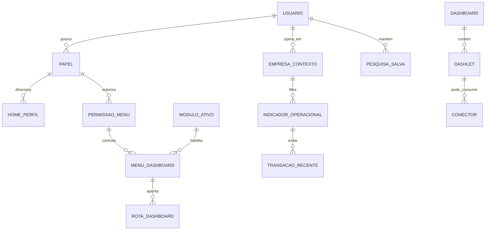

# EF 0_APLICATIVO DASHBOARD_E_LAYOUT V1

**Projeto:** Epros  
**Empresa:** Siser  
**Tipo de documento:** Especificacao Funcional definitiva  
**Versao:** V1  
**Modulo:** APLICATIVO  
**Submodulo:** DASHBOARD_E_LAYOUT  
**ID funcional:** APP-TEN-011  
**Status:** Pronto para validacao humana  
**Data:** 2026-06-06

## 1. Controle do documento

| Item | Conteudo |
|---|---|
| Responsavel pela elaboracao | Agente de analise e refinamento funcional |
| Responsavel pela validacao funcional | Siser |
| Responsavel pela validacao tecnica | Siser |
| Area dona do processo | Plataforma SaaS / Experiencia operacional do Epros |
| Publico-alvo | Produto, negocio, dados, desenvolvimento, QA, implantacao, suporte e operacao |
| Fonte de verdade | Esta EF descreve o comportamento funcional esperado do Epros para dashboard, layout, home, buscas e experiencia visual de entrada |

## 2. Objetivo funcional

O submodulo Dashboard e Layout organiza a primeira experiencia visual do Epros apos o acesso, separando a area publica da area autenticada, apresentando indicadores operacionais, atalhos, dashboards por dominio, home por perfil, buscas, conteudos de feed e contexto modular de navegacao.

| Pergunta | Resposta |
|---|---|
| Para que o submodulo existe? | Para entregar a camada de entrada visual do Epros, com layout autenticado, area publica, indicadores, atalhos, dashboards, home e consultas de apoio. |
| Que problema de negocio resolve? | Reduz dispersao operacional, centraliza acesso rapido a modulos, apresenta indicadores essenciais e orienta cada papel para sua pagina inicial correta. |
| Qual resultado operacional deve produzir? | Usuario autenticado visualiza a experiencia adequada ao seu papel, empresa, permissoes e modulos habilitados, com indicadores e acoes relevantes. |
| Quais areas dependem dele? | Assinatura e Planos, Identidade e Contexto Tenant, Permissoes de Menu, Usuarios e Papeis, Vendas, Compras, Financeiro, Estoque, Fiscal, Ponto de Venda, Projetos, Atendimento, CRM, Configuracao e Relatorios. |

## 3. Escopo funcional

### 3.1 Dentro do escopo

| Capacidade | Descricao | Observacao |
|---|---|---|
| Layout autenticado | Estrutura visual com cabecalho, menu lateral, corpo da pagina e acoes de usuario. | Deve respeitar autenticacao, licenca, permissoes e contexto ativo. |
| Area publica | Experiencia para usuarios nao autenticados com apresentacao institucional, recursos, planos, perguntas frequentes, contato e rodape. | Conteudos dinamicos dependem de configuracao e catalogos globais. |
| Validacao visual de licenca | Verificacao inicial do plano/licenca para impedir uso quando o periodo estiver expirado. | A regra de encerramento de sessao precisa decisao na MC. |
| Dashboard raiz | Painel inicial com metricas diferentes para perfil Siser e perfil operacional. | Deve renderizar conforme papel e permissoes. |
| Atalhos operacionais | Cards de acesso rapido para cadastros, vendas, compras, estoque, fiscal e financeiro. | Visibilidade depende de menu/permissao. |
| Dashboards de dominio | Paineis de vendas, compras, financeiro, estoque, vendedor/meta, servicos, fiscal e cartoes. | O submodulo apresenta indicadores; a regra transacional pertence aos modulos donos. |
| Indicadores de ponto de venda e mobilidade | Consultas e graficos operacionais usados por experiencia local ou mobile. | O submodulo documenta consumo visual; a operacao transacional pertence ao modulo de origem. |
| Home por perfil | Pagina inicial direcionada para perfis administrativos, equipe, cliente e afiliado quando configurado. | Regras de papel dependem de Usuarios e Papeis. |
| Busca global e buscas rapidas | Pesquisa e acesso a registros, itens recentes, itens favoritos e filtros salvos. | Persistencia e seguranca de filtros precisam padronizacao. |
| Feed e conectores | Area de feed, atividades, conectores e conteudos externos configuraveis. | Integracoes externas precisam avaliacao de seguranca e privacidade. |
| Dashboard modular | Resolucao de menus, rotas e dashboards por modulo ativo, permissao e contexto. | Integra-se com Catalogos Globais SaaS, Permissoes de Menu e Limites de Plano. |

### 3.2 Fora do escopo

| Item fora do escopo | Motivo | Destino correto |
|---|---|---|
| Cadastro transacional de vendas, compras, documentos fiscais, estoque e financeiro | O dashboard apenas consulta e apresenta indicadores. | Modulos donos das operacoes. |
| Regras contabeis, fiscais e financeiras de origem dos saldos | O submodulo consome agregacoes e totais. | FINANCEIRO; PLATAFORMA_COMPARTILHADA/FATURAMENTO_FISCAL_ELETRONICO |
| Criacao de clientes, produtos, fornecedores, vendedores e transportadoras | O submodulo apresenta atalhos e contadores. | CADASTROS_BASE; ESTOQUE; VENDAS |
| Controle completo de sessao, autenticacao e papel | O submodulo aplica comportamento visual. | IDENTIDADE_E_CONTEXTO_TENANT; USUARIOS_E_PAPEIS |
| Politica completa de modulos contratados e limites de uso | O dashboard consome autorizacao modular. | ASSINATURA_E_PLANOS; LIMITES_DE_PLANO; CATALOGOS_GLOBAIS_SAAS |
| Central de relatorios corporativos completa | O submodulo inclui paineis e PDFs vinculados a dashboards. | RELATORIOS |
| Integrações externas de marketing, iframe ou conteudo remoto | Material indica capacidade, mas contrato de seguranca nao esta fechado. | INTEGRACOES_E_CONECTORES; COMPLIANCE_LGPD_SOX_IFRS |

## 4. Glossario e conceitos funcionais

| Termo | Definicao funcional | Observacoes |
|---|---|---|
| Area publica | Experiencia visual disponivel antes da autenticacao. | Pode exibir recursos, planos e contato. |
| Layout autenticado | Estrutura de navegacao usada por usuarios logados. | Inclui cabecalho, menu lateral, area principal e acoes de conta. |
| Dashboard raiz | Painel inicial padrao acessado apos entrada no Epros. | Varia conforme perfil. |
| Painel Siser | Visao administrativa com metricas globais da plataforma. | Acesso restrito. |
| Painel operacional | Visao do cliente/empresa com contas, receitas, despesas e transacoes recentes. | Respeita contexto de empresa. |
| Atalho operacional | Card com contador e link para area funcional. | Exibicao depende de permissao. |
| Indicador | Valor numerico, grafico ou lista resumida calculado a partir de dados operacionais. | O calculo deve ter origem funcional clara. |
| Home por perfil | Pagina inicial definida conforme papel do usuario. | Pode redirecionar usuario para area mais adequada. |
| Dashlet | Bloco visual configuravel dentro da home ou dashboard. | Pode exibir grafico, lista, feed ou conteudo. |
| Pesquisa salva | Filtro persistido pelo usuario ou contexto para reutilizacao. | Modelo final deve evitar payload opaco quando possivel. |
| Conector | Configuracao que permite exibir ou integrar conteudo de fonte externa. | Exige validacao de seguranca e privacidade. |
| Dashboard modular | Dashboard determinado por modulo ativo, menu, permissao e rota funcional. | Deve ter fallback funcional. |

## 5. Atores, papeis e responsabilidades

| Ator/Papel | Responsabilidade | Permissoes esperadas | Restricoes |
|---|---|---|---|
| Administrador Siser | Monitorar metricas globais, configuracoes publicas e disponibilidade de dashboards. | Visualizar painel Siser, catalogos e indicadores globais autorizados. | Nao deve visualizar dados de cliente fora das regras de operacao Siser. |
| Administrador da empresa | Acompanhar indicadores operacionais e acessar modulos habilitados. | Consultar dashboards, atalhos, graficos, pesquisas e relatorios autorizados. | Restrito ao tenant, empresa, filial e permissoes. |
| Gestor financeiro | Consultar contas a receber, contas a pagar, inadimplencia, receitas, despesas e detalhe financeiro. | Visualizar indicadores financeiros permitidos. | Sem acesso a modulos nao autorizados. |
| Gestor comercial | Consultar vendas, clientes, vendedores, produtos vendidos, metas e servicos. | Visualizar indicadores comerciais permitidos. | Restrito a empresa/contexto. |
| Gestor de compras | Consultar compras, fornecedores, transportadoras e produtos comprados. | Visualizar indicadores de compras permitidos. | Restrito a empresa/contexto. |
| Gestor de estoque | Consultar entradas, saidas, custo, preco e estoque atual. | Visualizar indicadores de estoque permitidos. | Restrito a empresa/contexto. |
| Operador de caixa ou PDV | Consultar indicadores locais de vendas, caixa, conferencia e fluxo. | Visualizar consultas operacionais autorizadas. | Pode depender de ambiente local ou mobile. |
| Usuario de equipe | Acessar home, tarefas, eventos, tickets, leads e atividades conforme perfil. | Visualizar blocos permitidos. | Restrito aos dados sob sua responsabilidade. |
| Cliente externo | Acessar home ou portal quando habilitado. | Visualizar conteudo proprio. | Sem acesso a informacoes internas. |
| Afiliado | Acompanhar indicadores especificos de afiliacao quando configurado. | Visualizar home de afiliado. | Restrito ao relacionamento atribuido. |

## 6. Visao operacional do submodulo

1. Usuario acessa o Epros.
2. Se nao estiver autenticado, o Epros apresenta a area publica.
3. Se estiver autenticado, o Epros monta o layout com cabecalho, menu lateral, corpo da pagina e menu de usuario.
4. Na primeira renderizacao autenticada, o Epros verifica a situacao do plano/licenca quando essa informacao estiver disponivel.
5. Licenca expirada bloqueia a continuidade visual e direciona o usuario para a pagina inicial com mensagem funcional.
6. Licenca ativa ou nao informada permite renderizar o corpo da pagina.
7. O Epros identifica papel, permissoes, empresa ativa e modulos habilitados.
8. O dashboard raiz decide entre painel Siser, painel operacional ou fallback conforme perfil e contexto.
9. Atalhos, widgets e dashboards sao exibidos apenas quando houver permissao/menu/modulo correspondente.
10. Indicadores sao calculados a partir dos dominios de origem e apresentados como totais, graficos, listas ou relatorios.
11. Pesquisas, filtros, home por perfil, feed e conectores complementam a experiencia de navegacao.
12. Operacoes de detalhe, exportacao ou relatorio devem respeitar a mesma restricao de dados aplicada ao indicador visual.

## 7. Capacidades funcionais

### 7.1 Renderizacao de area publica e layout autenticado

| Item | Especificacao |
|---|---|
| Objetivo | Separar a experiencia anonima da experiencia autenticada do Epros. |
| Acionamento | Acesso a rota visual do sistema. |
| Pre-condicoes | Usuario pode estar autenticado ou anonimo. |
| Dados de entrada | Estado de autenticacao, configuracao publica, catalogo de funcionalidades e planos quando aplicavel. |
| Processamento | Renderizar area publica para anonimos; renderizar cabecalho, menu lateral, corpo e acoes de conta para autenticados. |
| Resultado esperado | Usuario visualiza a experiencia correta para seu estado. |
| Pos-condicoes | Navegacao segue para dashboard ou pagina solicitada. |
| Excecoes | Licenca expirada ou usuario sem autorizacao visual deve receber mensagem e redirecionamento funcional. |
| Auditoria | Tentativas bloqueadas por licenca ou permissao devem ser registradas conforme politica de seguranca. |

### 7.2 Validacao de licenca no layout

| Item | Especificacao |
|---|---|
| Objetivo | Impedir uso operacional quando o periodo de licenca estiver expirado. |
| Acionamento | Primeira renderizacao autenticada do layout. |
| Pre-condicoes | Usuario autenticado e informacao de plano/licenca disponivel. |
| Dados de entrada | Situacao do plano/licenca, periodo de validade e usuario logado. |
| Processamento | Verificar se a licenca esta ativa; quando expirada, direcionar para a pagina inicial e exibir mensagem. |
| Resultado esperado | Uso operacional bloqueado quando a licenca estiver expirada. |
| Pos-condicoes | Usuario fica fora da area operacional ate regularizacao. |
| Excecoes | Se a situacao da licenca nao estiver disponivel, o comportamento final deve ser validado na MC. |
| Auditoria | Registrar bloqueio por licenca expirada. |

### 7.3 Painel Siser

| Item | Especificacao |
|---|---|
| Objetivo | Apresentar metricas administrativas globais da plataforma. |
| Acionamento | Acesso ao dashboard raiz por perfil Siser autorizado. |
| Pre-condicoes | Usuario autenticado e autorizado como perfil Siser. |
| Dados de entrada | Usuarios totais, usuarios ativos, pedidos, valor total de pedidos e planos. |
| Processamento | Calcular e exibir widgets globais de monitoramento. |
| Resultado esperado | Painel com visao consolidada da plataforma. |
| Pos-condicoes | Administrador pode navegar para areas administrativas. |
| Excecoes | Erro de calculo deve exibir estado controlado, sem dados parciais enganosos. |
| Auditoria | Acesso a metricas globais deve ser auditavel. |

### 7.4 Painel operacional da empresa

| Item | Especificacao |
|---|---|
| Objetivo | Apresentar saldos e movimentos recentes da empresa ativa. |
| Acionamento | Acesso ao dashboard raiz por usuario operacional. |
| Pre-condicoes | Usuario autenticado, empresa/contexto definido e permissao de consulta. |
| Dados de entrada | Contas a receber, contas a pagar, receitas, despesas e transacoes recentes. |
| Processamento | Calcular totais, montar grafico mensal e listar transacoes recentes por tipo. |
| Resultado esperado | Painel operacional com visao financeira e transacional resumida. |
| Pos-condicoes | Usuario pode abrir detalhes ou navegar para modulos. |
| Excecoes | Ausencia de empresa ativa ou falta de permissao deve bloquear dados sensiveis. |
| Auditoria | Consultas a indicadores financeiros devem ser rastreaveis conforme politica. |

### 7.5 Atalhos operacionais

| Item | Especificacao |
|---|---|
| Objetivo | Exibir contadores e acessos rapidos para operacoes frequentes. |
| Acionamento | Entrada na home operacional ou painel de acesso rapido. |
| Pre-condicoes | Usuario autorizado e menus correspondentes habilitados. |
| Dados de entrada | Quantidades de empresas, clientes, fornecedores, produtos, vendedores, transportadoras, vendas, compras, movimento de estoque, movimento fiscal, contas a receber e contas a pagar. |
| Processamento | Calcular contadores e esconder cards sem permissao/menu. |
| Resultado esperado | Cards visiveis apenas para recursos autorizados. |
| Pos-condicoes | Usuario pode acessar diretamente o modulo relacionado. |
| Excecoes | Contador indisponivel deve apresentar estado vazio ou erro controlado. |
| Auditoria | Nao informado no material. |

### 7.6 Dashboards de vendas

| Item | Especificacao |
|---|---|
| Objetivo | Apresentar indicadores comerciais por periodo, produto, cliente, vendedor e forma de pagamento. |
| Acionamento | Acesso ao dashboard de vendas ou relatorios vinculados. |
| Pre-condicoes | Permissao comercial e contexto de empresa. |
| Dados de entrada | Periodo, status, tipo de operacao, cliente, vendedor, produto e dados de pagamento quando aplicavel. |
| Processamento | Calcular totais do dia, mes e ano; vendas anuais, mensais e diarias; produtos mais vendidos; clientes com maior venda; ranking de vendedores; detalhe por pagamento e item. |
| Resultado esperado | Graficos, totais, listas e relatorios comerciais. |
| Pos-condicoes | Usuario pode analisar detalhe ou exportar relatorio quando autorizado. |
| Excecoes | Filtros incompletos devem usar padrao definido; conflitos de status ficam na MC. |
| Auditoria | Exportacoes e consultas sensiveis devem ser registradas. |

### 7.7 Dashboards de compras

| Item | Especificacao |
|---|---|
| Objetivo | Apresentar indicadores de compras por periodo, produto, fornecedor e transportadora. |
| Acionamento | Acesso ao dashboard de compras. |
| Pre-condicoes | Permissao de compras e contexto de empresa. |
| Dados de entrada | Periodo, tipo, status, fornecedor, transportadora e produto. |
| Processamento | Calcular totais do dia, mes e ano; compras anuais e diarias; produtos mais comprados; fornecedores e transportadoras com maior participacao. |
| Resultado esperado | Indicadores de compras prontos para analise. |
| Pos-condicoes | Usuario pode abrir detalhes permitidos. |
| Excecoes | Erros de agregacao devem ser tratados sem ocultar falhas relevantes. |
| Auditoria | Exportacoes e consultas de detalhe devem ser registradas. |

### 7.8 Dashboards financeiros

| Item | Especificacao |
|---|---|
| Objetivo | Apresentar contas a receber, contas a pagar, aberto, baixado, inadimplencia e categorias financeiras. |
| Acionamento | Acesso aos dashboards financeiros. |
| Pre-condicoes | Permissao financeira e contexto de empresa. |
| Dados de entrada | Periodo, status, categoria, cliente, fornecedor, documento e lancamentos financeiros. |
| Processamento | Calcular aberto e baixado por ano/periodo; inadimplencia de clientes e fornecedores; detalhe paginado; categorias de documentos. |
| Resultado esperado | Indicadores financeiros consistentes para gestao. |
| Pos-condicoes | Usuario pode navegar para contas a pagar, contas a receber ou detalhe autorizado. |
| Excecoes | Conflitos de conta contabil de despesa devem ser validados na MC. |
| Auditoria | Consultas financeiras e exportacoes devem ser auditaveis. |

### 7.9 Dashboards de estoque

| Item | Especificacao |
|---|---|
| Objetivo | Apresentar entradas, saidas, custo, preco e estoque atual por produto. |
| Acionamento | Acesso ao dashboard de estoque. |
| Pre-condicoes | Permissao de estoque e contexto de empresa. |
| Dados de entrada | Periodo, tipo de operacao, produto, categoria, marca, codigo de barras, quantidade, custo e preco. |
| Processamento | Agregar entradas, saidas, saldo atual, custo total e valor de estoque. |
| Resultado esperado | Painel de analise de estoque. |
| Pos-condicoes | Usuario pode consultar produtos e movimentos relacionados. |
| Excecoes | Unidade de medida fixa ou conversao sem regra deve ser validada na MC. |
| Auditoria | Consultas de estoque podem ser auditadas conforme politica. |

### 7.10 Dashboards fiscal, servicos, cartoes e metas

| Item | Especificacao |
|---|---|
| Objetivo | Apresentar visoes complementares de documentos fiscais, servicos vendidos, cartoes e metas de vendedor. |
| Acionamento | Acesso aos dashboards correspondentes. |
| Pre-condicoes | Permissao do dominio e contexto de empresa. |
| Dados de entrada | Periodo, status, modelo de documento, servico, vendedor, meta, venda e cartao. |
| Processamento | Calcular documentos por periodo/modelo/status, servicos vendidos, cartoes cadastrados e meta versus vendas. |
| Resultado esperado | Indicadores complementares disponiveis. |
| Pos-condicoes | Usuario pode abrir detalhes permitidos. |
| Excecoes | Comissao fixa ou nao calculada deve ser tratada como lacuna ate definicao. |
| Auditoria | Exportacoes e consultas de detalhe devem ser rastreaveis. |

### 7.11 Home, busca, feed, conectores e pesquisas salvas

| Item | Especificacao |
|---|---|
| Objetivo | Oferecer navegacao personalizada, pesquisa reutilizavel e conteudo complementar. |
| Acionamento | Entrada na home, pesquisa global, abertura de dashlet, feed ou configuracao de conector. |
| Pre-condicoes | Usuario autenticado e autorizado. |
| Dados de entrada | Papel, homepage configurada, termo de busca, modulo, filtro, preferencia, feed, conector e pesquisa salva. |
| Processamento | Direcionar por papel, executar buscas, aplicar filtros salvos, montar blocos visuais e respeitar permissoes. |
| Resultado esperado | Home e pesquisas coerentes com o perfil. |
| Pos-condicoes | Usuario navega para registros ou areas autorizadas. |
| Excecoes | Filtros opacos, conectores externos e dados sensiveis devem ser validados na MC. |
| Auditoria | Pesquisas, conectores e acesso a dados sensiveis devem seguir politica de seguranca. |

## 8. Regras de negocio

| Regra | Descricao | Condicao | Resultado | Severidade | Observacoes |
|---|---|---|---|---|---|
| REG-001 | Usuario anonimo visualiza a area publica do Epros. | Quando nao houver sessao autenticada. | Epros apresenta pagina publica. | Bloqueante | Conteudo dinamico depende de configuracao. |
| REG-002 | Usuario autenticado visualiza o layout operacional com cabecalho, menu lateral e corpo. | Quando houver sessao valida. | Epros monta a experiencia autenticada. | Bloqueante | Deve respeitar papel e contexto. |
| REG-003 | Licenca expirada bloqueia o uso operacional. | Na primeira renderizacao autenticada, se o plano estiver expirado. | Epros redireciona e exibe mensagem de periodo expirado. | Bloqueante | Encerramento de sessao precisa decisao. |
| REG-004 | O dashboard raiz exibe painel Siser para perfil Siser autorizado. | Quando o usuario tiver perfil administrativo Siser. | Epros apresenta metricas globais. | Bloqueante | Acesso deve ser restrito. |
| REG-005 | O dashboard raiz exibe painel operacional para usuarios de empresa. | Quando o usuario nao for perfil Siser e tiver contexto operacional. | Epros apresenta saldos e transacoes recentes da empresa. | Bloqueante | Deve respeitar tenant/empresa. |
| REG-006 | Widget Total Users representa total de usuarios da plataforma. | Em painel Siser. | Valor exibido no widget correspondente. | Informativa | Nao confundir com pedidos. |
| REG-007 | Widget Active Users representa usuarios ativos. | Em painel Siser. | Valor exibido no widget correspondente. | Informativa | Status ativo deve vir de usuarios. |
| REG-008 | Widget Total Order representa total de pedidos. | Em painel Siser. | Valor exibido no widget correspondente. | Bloqueante | Material continha conflito com total de usuarios; validar na MC. |
| REG-009 | Widget Total Order Amount representa valor total de pedidos. | Em painel Siser. | Valor monetario exibido. | Informativa | Fonte financeira precisa validacao. |
| REG-010 | Widget Total Plan representa total de planos. | Em painel Siser. | Quantidade exibida. | Informativa | Fonte e status de plano dependem de Assinatura. |
| REG-011 | Total Receivables e calculado como debito menos credito na conta funcional de recebiveis. | Em painel operacional. | Saldo de contas a receber exibido. | Bloqueante | Conta funcional informada no material. |
| REG-012 | Total Payables e calculado como credito menos debito na conta funcional de obrigacoes a pagar. | Em painel operacional. | Saldo de contas a pagar exibido. | Bloqueante | Conta funcional informada no material. |
| REG-013 | Income e agrupado mensalmente por conta funcional de receita. | Em grafico operacional. | Serie mensal de receitas. | Bloqueante | Conta funcional informada no material. |
| REG-014 | Expenses e agrupado mensalmente por conta funcional de despesa. | Em grafico operacional. | Serie mensal de despesas. | Bloqueante | Ha conflito de identificador de conta no material; validar na MC. |
| REG-015 | Transacoes recentes do painel operacional sao separadas em vendas, devolucoes de venda, compras, devolucoes de compra, pagamentos efetuados e recebimentos. | Ao montar painel operacional. | Epros exibe seis abas/listas. | Informativa | Nomes visuais finais podem ser localizados. |
| REG-016 | Carga inicial de indicadores pode usar periodo padrao do dia anterior ate a data atual quando nenhum filtro for informado. | Ao abrir dashboard com filtros vazios. | Epros aplica periodo padrao. | Informativa | Confirmar padrao por fuso e data na MC. |
| REG-017 | Atalhos operacionais devem aparecer apenas quando o menu correspondente estiver disponivel ao usuario. | Ao renderizar cards de acesso rapido. | Cards sem permissao ficam ocultos. | Bloqueante | Depende de Permissoes de Menu. |
| REG-018 | Atalhos operacionais exibem contadores para empresas, clientes, fornecedores, produtos, vendedores, transportadoras, vendas, compras, estoque, fiscal, receber e pagar. | Ao carregar acesso rapido. | Epros exibe cards autorizados com quantidades. | Informativa | Nomes finais podem seguir design system. |
| REG-019 | Dashboards de venda devem calcular totais do dia, mes e ano. | Ao consultar vendas. | Totais comerciais exibidos. | Bloqueante | Filtros devem respeitar contexto. |
| REG-020 | Dashboards de venda devem apresentar vendas anual, mensal e diaria. | Ao consultar vendas por periodo. | Graficos de evolucao exibidos. | Informativa | Granularidade depende do periodo. |
| REG-021 | Dashboards de venda devem apresentar produtos mais vendidos, clientes com maior venda e ranking de vendedores. | Ao consultar vendas analiticas. | Rankings exibidos. | Informativa | Limites top 7/top 20 precisam parametrizacao. |
| REG-022 | Dashboards de compra devem calcular totais do dia, mes e ano. | Ao consultar compras. | Totais de compras exibidos. | Bloqueante | Filtros devem respeitar contexto. |
| REG-023 | Dashboards de compra devem apresentar produtos mais comprados, fornecedores e transportadoras. | Ao consultar compras analiticas. | Rankings exibidos. | Informativa | Limites de ranking precisam padronizacao. |
| REG-024 | Dashboards financeiros devem separar aberto, baixado e inadimplente. | Ao consultar financeiro. | Indicadores financeiros por situacao. | Bloqueante | Estados finais devem ser unificados. |
| REG-025 | Consultas de detalhe financeiro devem retornar total filtrado, total geral e dados da pagina solicitada. | Ao abrir grade de detalhe. | Resultado paginado coerente. | Bloqueante | Ordem de contagem deve ser corrigida conforme MC. |
| REG-026 | Dashboard fiscal deve apresentar documentos por periodo, situacao e modelo. | Ao consultar indicadores fiscais. | Graficos e detalhes fiscais exibidos. | Bloqueante | Filtros por ano e tipo precisam revisao na MC. |
| REG-027 | Dashboard de estoque deve apresentar entrada, saida, custo, preco e saldo atual. | Ao consultar estoque. | Indicadores de estoque exibidos. | Bloqueante | Conversoes fixas precisam validacao. |
| REG-028 | Dashboard de vendedor/meta deve apresentar meta, vendas, falta e comissao quando houver regra. | Ao consultar metas. | Comparativo de meta exibido. | Parcial | Comissao nao pode ser fixa sem regra. |
| REG-029 | Dashboard de servicos deve apresentar servicos vendidos por periodo. | Ao consultar servicos. | Lista/indicador de servicos exibido. | Informativa | Fonte pertence a Vendas/Servicos. |
| REG-030 | Dashboard de cartoes deve listar cartoes de credito cadastrados quando autorizado. | Ao consultar cartoes. | Lista de cartoes exibida. | Informativa | Dados sensiveis devem ser mascarados. |
| REG-031 | Relatorios vinculados ao dashboard devem respeitar os mesmos filtros da tela. | Ao gerar PDF ou exportacao. | Documento gerado com dados coerentes. | Bloqueante | Exportacao exige auditoria. |
| REG-032 | Home por perfil redireciona o usuario para a pagina inicial configurada quando existir. | Ao entrar no Epros. | Usuario chega na experiencia apropriada. | Informativa | Precedencia de papeis precisa validacao. |
| REG-033 | Busca global deve respeitar permissao de modulo e restricao de dados. | Ao pesquisar registros. | Usuario ve apenas resultados autorizados. | Bloqueante | Deve evitar vazamento de dados entre empresas. |
| REG-034 | Pesquisas salvas devem armazenar filtros reutilizaveis de forma governada. | Ao salvar filtro. | Filtro fica disponivel para reutilizacao. | Parcial | Estrutura tipada precisa decisao. |
| REG-035 | Feed e dashlets exibem conteudo conforme permissoes e configuracao. | Ao abrir home/feed. | Conteudo permitido exibido. | Bloqueante | Dados sensiveis exigem controle. |
| REG-036 | Conectores externos so podem ser exibidos quando estiverem configurados e aprovados. | Ao carregar conector. | Conteudo externo autorizado exibido. | Bloqueante | Exige LGPD/compliance. |
| REG-037 | Dashboard modular deve priorizar dashboards permitidos pelo modulo ativo e menu. | Ao resolver rota inicial. | Epros direciona para dashboard correto. | Bloqueante | Depende de catalogo modular e permissoes. |
| REG-038 | Na ausencia de dashboard especifico autorizado, o Epros deve aplicar fallback funcional controlado. | Ao resolver dashboard sem permissao/rota. | Usuario recebe pagina segura ou dashboard padrao. | Bloqueante | Fallback final precisa validacao. |
| REG-039 | Erros de calculo ou agregacao nao devem retornar dados enganosos como sucesso silencioso. | Ao falhar consulta de indicador. | Epros mostra estado de erro controlado e registra falha. | Bloqueante | Algumas falhas identificadas viram MC. |
| REG-040 | Textos de interface devem estar padronizados no idioma do Epros. | Ao exibir dashboards, widgets e mensagens. | Interface consistente. | Informativa | Textos fixos estrangeiros viram lacuna. |

## 9. Parametros de configuracao

| Parametro | Finalidade | Tipo/formato | Valor padrao | Obrigatorio | Nivel | Quem pode alterar | Impacto |
|---|---|---|---|---|---|---|---|
| Homepage por papel | Definir pagina inicial conforme papel. | Rota/identificador funcional | Nao informado no material | Nao informado no material | Papel/Usuario | Administrador autorizado | Redireciona entrada do usuario. |
| Periodo inicial do dashboard | Definir intervalo usado quando filtros estao vazios. | Data inicial/final | Dia anterior ate data atual, conforme material | Sim para carga inicial | Usuario/Empresa | Siser ou administrador autorizado | Afeta todos os indicadores iniciais. |
| Status inicial de filtro | Definir status padrao de consultas. | Dominio de status | Todos | Sim para carga inicial | Usuario/Empresa | Administrador autorizado | Afeta totais e listas. |
| Limite de rankings | Definir quantidade maxima exibida em rankings. | Inteiro | 7 ou 20 em trechos do material | Sim para rankings | Global/Empresa | Siser | Afeta graficos e listas. |
| Menus de dashboard | Definir quais dashboards aparecem por modulo/permissao. | Lista/menu | Nao informado no material | Sim | Papel/Modulo | Administrador autorizado | Afeta navegacao e acesso. |
| Dashlets habilitados | Controlar blocos visuais disponiveis na home. | Lista | Nao informado no material | Nao informado no material | Usuario/Papel | Administrador autorizado | Afeta home e feed. |
| Conectores habilitados | Autorizar conteudos externos. | Lista/configuracao | Nao informado no material | Condicional | Global/Empresa | Siser | Impacta seguranca e privacidade. |
| Pesquisa salva | Persistir filtros reutilizaveis. | Estrutura de filtro | Nao informado no material | Nao | Usuario/Modulo | Usuario autorizado | Afeta produtividade e governanca. |
| Rota de fallback | Definir destino quando dashboard modular nao e encontrado. | Rota/identificador | Nao informado no material | Sim | Global | Siser | Afeta experiencia e seguranca. |

## 10. Modelo de dados funcional e implantavel

### 10.1 Visao geral do modelo

O modelo do submodulo combina estruturas de apresentacao, contratos de indicadores e entidades transacionais pertencentes a outros modulos. Dashboard e Layout nao deve duplicar as entidades operacionais; deve consumir seus saldos, agregacoes e listas por meio de contratos funcionais consistentes. Estruturas de home, pesquisa salva, dashlets, feed e conectores podem exigir persistencia propria, mas parte dos campos nao esta fechada no material.

| Grupo de dados | Entidades/tabelas | Papel funcional | Observacoes |
|---|---|---|---|
| Contexto visual | Layout autenticado, area publica, cabecalho, menu, rota inicial | Controlar experiencia de entrada e navegacao. | Dados dependem de identidade, configuracao e permissoes. |
| Indicadores Siser | Usuario, Pedido, Plano, Pagamento de pedido | Alimentar widgets globais da plataforma. | Entidades mestres pertencem a outros submodulos. |
| Indicadores operacionais | Lancamento, venda, compra, devolucao, pagamento, recebimento | Alimentar painel operacional da empresa. | O dashboard consome agregacoes. |
| Atalhos | Contador de empresa, cliente, fornecedor, produto, vendedor, transportadora, vendas, compras, estoque, fiscal, receber e pagar | Exibir cards com quantidade e link. | Visibilidade depende de menu/permissao. |
| BI comercial e compras | Vendas, itens de venda, formas de pagamento, compras, itens de compra | Produzir graficos, rankings e relatorios. | Fontes pertencem aos modulos donos. |
| BI financeiro | Documentos, lancamentos, categorias, contas a pagar, contas a receber | Produzir indicadores financeiros. | Regras finais pertencem ao Financeiro. |
| BI estoque e fiscal | Movimento de estoque, produto, categoria, marca, documento fiscal, tipo de operacao | Produzir indicadores de saldo e documentos. | Regras finais pertencem aos modulos donos. |
| Home e produtividade | Home por perfil, dashlet, feed, pesquisa salva, conector | Personalizar navegacao e conteudo. | Persistencia completa precisa validacao. |
| Contratos de consulta | Modelos de total, grafico, estoque, meta, servico, detalhe, grade paginada | Transportar dados para telas e relatorios. | Campos foram incorporados ao dicionario. |

### 10.2 Entidades e tabelas

| Entidade funcional | Tabela/estrutura | Tipo | Finalidade | Chave primaria | Observacoes de implantacao |
|---|---|---|---|---|---|
| Layout autenticado | Layout visual autenticado | Contrato visual | Definir estrutura de tela para usuarios logados. | Nao informado no material | Persistencia nao informada. |
| Area publica | Configuracao publica e secoes publicas | Contrato visual | Exibir landing, recursos, planos, FAQ, contato e rodape. | Nao informado no material | Conteudo dinamico vem de catalogos/configuracao. |
| Widget Siser | Indicador global Siser | Contrato de indicador | Exibir usuarios, pedidos, valores e planos. | Nao informado no material | Fonte pertence a assinatura/usuarios. |
| Indicador operacional | Indicador da empresa | Contrato de indicador | Exibir receber, pagar, receita, despesa e transacoes recentes. | Nao informado no material | Deve filtrar por contexto. |
| Lancamento financeiro | Ledger posting | Movimento | Base para saldos e series financeiras. | Nao informado no material | Contas funcionais foram informadas parcialmente. |
| Transacao recente | Lista de movimentos recentes | Contrato de consulta | Exibir vendas, devolucoes, compras, pagamentos e recebimentos. | Nao informado no material | Campos detalhados das visoes nao informados. |
| Atalho operacional | DashboardViewModel | Contrato de indicador | Transportar contadores de acesso rapido. | Nao informado no material | Campos de contagem informados. |
| Total por periodo | ResultTotaisModel | Contrato de indicador | Transportar totais do dia, mes e ano, aberto e baixado. | Nao informado no material | Usado em vendas, compras e financeiro. |
| Serie grafica | ChartViewModel | Contrato de grafico | Transportar valores por mes, produto, cliente, fornecedor, vendedor, categoria ou descricao. | Nao informado no material | Campos genericos compartilhados. |
| Estoque BI | EstoqueViewModel | Contrato de indicador | Transportar saldo, entrada, saida, custo, preco e produto. | ID | Campo ID informado. |
| Meta de vendedor | VendedorMetaViewModel | Contrato de indicador | Transportar vendedor, meta, vendas, falta e comissao. | Nao informado no material | Comissao precisa regra final. |
| Servico vendido | ServicoViewModel | Contrato de indicador | Transportar servicos vendidos por periodo. | ID | Campo ID informado. |
| Detalhe de pagamento | PagamentoDetalheViewModel | Contrato de relatorio | Transportar detalhe de pagamentos. | Nao informado no material | Usado em PDF/dashboard. |
| Venda por item e cliente | VendaItemClienteViewModel | Contrato de relatorio | Transportar vendas por item/cliente. | Nao informado no material | Usado em PDF/dashboard. |
| Venda por cliente | VendasPorClienteViewModel | Contrato de relatorio | Transportar vendas agregadas por cliente. | Nao informado no material | Usado em PDF/dashboard. |
| Nota por cliente | NotaClienteViewModel | Contrato de relatorio | Transportar nota/documento por cliente. | Nao informado no material | Usado em detalhe fiscal/comercial. |
| Consulta paginada | DataTableViewModel funcional | Contrato de consulta | Transportar pagina, busca, totais e dados. | Nao informado no material | Nome tecnico saneado; campos preservados. |
| Cartao | CartoesDashboardViewModel | Contrato de consulta | Transportar lista de cartoes. | Nao informado no material | Dados sensiveis devem ser mascarados. |
| Consulta local de cliente | ClienteViewModelReport | Contrato de consulta local | Transportar cliente para relatorio local. | Nao informado no material | Campos nao detalhados no material. |
| Valor generico | ValorStringGenericoViewModel | Contrato de indicador local | Transportar descricao e valor. | Nao informado no material | Usado em graficos locais. |
| Indicador dia/mes/ano | DiaMesAnoViewModelReport | Contrato de indicador local | Transportar valor por dia, mes e ano. | Nao informado no material | Usado em app local/PDV. |
| Venda produto local | VendaProdutoViewModelReport | Contrato de indicador local | Transportar produto vendido. | Nao informado no material | Campos nao detalhados no material. |
| Conferencia de caixa | ConferenciaViewModelReport | Contrato de indicador local | Transportar conferencia de caixa. | Nao informado no material | Pertence ao dominio de PDV/caixa. |
| Fluxo de caixa local | FluxoCaixaViewModelReport | Contrato de indicador local | Transportar fluxo de caixa. | Nao informado no material | Pertence ao dominio financeiro/caixa. |
| Venda mensal local | VendaChartMes | Contrato de grafico local | Transportar vendas por mes. | Nao informado no material | Usado em experiencia local. |
| Pesquisa salva | Pesquisa salva | Configuracao/relacionamento | Guardar filtro reutilizavel por usuario/modulo. | Nao informado no material | Estrutura final precisa validacao. |
| Dashlet | Dashlet | Configuracao visual | Definir bloco visual de home/dashboard. | Nao informado no material | Pode ter parametros e permissao. |
| Feed | Feed de atividade | Movimento/contrato | Exibir atividades e conteudo de acompanhamento. | Nao informado no material | Escopo de dados sensiveis precisa validacao. |
| Conector | Conector externo | Configuracao/integracao | Exibir ou consultar conteudo externo autorizado. | Nao informado no material | Exige compliance. |
| Menu de dashboard | Entrada de menu de dashboard | Configuracao/relacionamento | Associar rota, permissao, modulo e dashboard. | Nao informado no material | Usado no dashboard modular. |
| Rota de dashboard | Rota de dashboard | Configuracao | Definir destino funcional de painel. | Nao informado no material | Precisa fallback. |

### 10.3 Relacionamentos, cardinalidade e dependencia

| Origem | Relacionamento | Destino | Cardinalidade | Obrigatorio | Regra de integridade |
|---|---|---|---|---|---|
| Usuario autenticado | possui | Perfil/papel | Nao informado no material | Sim | Papel determina painel, home e permissoes. |
| Usuario autenticado | opera em | Empresa/contexto | Nao informado no material | Sim para painel operacional | Dados devem ser filtrados por contexto. |
| Layout autenticado | contem | Cabecalho, menu lateral e corpo | 1:N | Sim | Estrutura visual autenticada. |
| Area publica | consome | Configuracao publica e catalogos | Nao informado no material | Condicional | Conteudo dinamico deve estar publicado. |
| Painel Siser | consome | Usuarios, pedidos, valores e planos | Nao informado no material | Sim | Apenas perfil Siser autorizado. |
| Painel operacional | consome | Lancamentos financeiros | Nao informado no material | Sim | Saldos por contas funcionais e contexto. |
| Painel operacional | exibe | Transacoes recentes | 1:N | Sim | Seis grupos de transacao recentes. |
| Atalho operacional | referencia | Menu/permissao | Nao informado no material | Sim | Card so aparece com permissao. |
| Dashboard de venda | consome | Vendas, itens, pagamentos, clientes, vendedores e produtos | Nao informado no material | Sim | Filtros devem respeitar contexto. |
| Dashboard de compra | consome | Compras, itens, fornecedores, transportadoras e produtos | Nao informado no material | Sim | Filtros devem respeitar contexto. |
| Dashboard financeiro | consome | Documentos, lancamentos e categorias | Nao informado no material | Sim | Aberto, baixado e inadimplente devem ser consistentes. |
| Dashboard estoque | consome | Produtos e movimentos de estoque | Nao informado no material | Sim | Saldo deve respeitar tipo de operacao. |
| Dashboard fiscal | consome | Documentos fiscais e modelos | Nao informado no material | Sim | Periodo, status e modelo devem filtrar corretamente. |
| Home por perfil | direciona | Rota inicial | Nao informado no material | Condicional | Se houver configuracao, aplica redirecionamento. |
| Pesquisa salva | pertence a | Usuario e modulo | Nao informado no material | Sim | Usuario so reutiliza filtros autorizados. |
| Dashlet | pertence a | Home/dashboard | Nao informado no material | Condicional | Deve respeitar permissao. |
| Conector | pertence a | Configuracao autorizada | Nao informado no material | Condicional | Conteudo externo so com autorizacao. |
| Menu de dashboard | referencia | Modulo ativo, permissao e rota | Nao informado no material | Sim | Usado para resolver dashboard modular. |

### 10.4 Chaves, unicidade, indices e constraints funcionais

| Entidade/tabela | Tipo de restricao | Campo(s) | Regra | Comportamento esperado |
|---|---|---|---|---|
| Estoque BI | PK | ID | Identificador do item de estoque no contrato. | Permitir detalhe por item quando disponivel. |
| Servico vendido | PK | ID | Identificador do servico no contrato. | Permitir detalhe por servico quando disponivel. |
| Pesquisa salva | FK funcional | Usuario, modulo | Pesquisa deve pertencer ao usuario e modulo autorizado. | Bloquear acesso cruzado. |
| Menu de dashboard | FK funcional | Modulo, permissao, rota | Menu deve apontar para modulo ativo e permissao valida. | Ocultar ou bloquear rota sem autorizacao. |
| Indicador operacional | Constraint funcional | Empresa/contexto | Todo indicador operacional deve ser filtrado pelo contexto ativo. | Bloquear vazamento entre empresas. |
| Consulta paginada | Constraint funcional | start, length, draw, search.value | Consulta deve retornar totais coerentes com filtro e pagina. | Evitar contagem apos paginacao. |
| Dashboard fiscal | Constraint funcional | Periodo, tipo, status, modelo | Agregacoes fiscais devem respeitar todos os filtros aplicados. | Evitar total incoerente. |
| Dashboard de vendas | Constraint funcional | Periodo, status, cliente, vendedor, produto | Agregacoes devem respeitar filtros e contexto. | Bloquear consulta fora do escopo autorizado. |
| Dashboard financeiro | Constraint funcional | Periodo, situacao, cliente/fornecedor, categoria | Indicadores devem refletir aberto, baixado e inadimplente corretamente. | Bloquear indicadores divergentes. |
| Conector | Constraint funcional | Aprovacao, escopo, usuario | Conector externo deve estar aprovado e autorizado. | Bloquear conteudo nao aprovado. |

### 10.5 Regras de persistencia, exclusao e historico

| Entidade/tabela | Criacao | Alteracao | Exclusao/inativacao | Historico/auditoria | Retencao |
|---|---|---|---|---|---|
| Layout autenticado | Nao informado no material | Nao informado no material | Nao informado no material | Registrar bloqueios por licenca/permissao quando aplicavel. | Nao informado no material |
| Area publica | Configuracao vem de catalogos/configuracao publica. | Alteracoes pertencem aos submodulos donos. | Nao informado no material | Alteracoes de conteudo publico devem ser auditaveis. | Nao informado no material |
| Indicadores | Calculados sob demanda. | Nao aplicavel | Nao aplicavel | Consultas sensiveis podem ser auditadas. | Nao informado no material |
| Pesquisa salva | Criada por usuario autorizado. | Alterada pelo dono ou administrador autorizado. | Excluida/inativada pelo dono ou administrador autorizado. | Deve registrar criacao, alteracao e exclusao. | Nao informado no material |
| Dashlet | Criado/configurado conforme governanca. | Alterado por usuario ou administrador autorizado. | Inativado/removido conforme governanca. | Deve registrar mudancas de configuracao. | Nao informado no material |
| Feed | Criado por eventos ou configuracao. | Nao informado no material | Nao informado no material | Acesso a dados sensiveis deve ser rastreavel. | Nao informado no material |
| Conector | Criado por administrador autorizado. | Alterado por administrador autorizado. | Inativado antes de remover. | Mudancas e acessos devem ser auditaveis. | Conforme politica de privacidade a definir. |
| Menu de dashboard | Criado por configuracao/permissao. | Alterado por administrador autorizado. | Inativado quando recurso sair de uso. | Alteracoes devem ser auditaveis. | Nao informado no material |

### 10.6 Diagrama logico funcional

### 10.7 Lacunas de modelo de dados

| Lacuna | Entidade/tabela afetada | Impacto | Encaminhamento para MC |
|---|---|---|---|
| Chaves e tabelas fisicas de home, dashlet, feed, conector e pesquisa salva nao estao fechadas. | Home, Dashlet, Feed, Conector, Pesquisa salva | Impede desenho fisico completo. | Sim |
| Cardinalidade entre papel, homepage e fallback precisa definicao. | Home por perfil, Rota de dashboard | Pode gerar redirecionamento ambiguo. | Sim |
| Estrutura de filtros salvos deve deixar de depender de payload opaco. | Pesquisa salva | Dificulta validacao, seguranca e evolucao. | Sim |
| Contas funcionais de despesa possuem conflito no material. | Indicador operacional financeiro | Pode gerar grafico errado. | Sim |
| Status de vendas/documentos/PDV nao esta unificado. | Dashboards comerciais, fiscais e locais | Pode gerar divergencia de indicadores. | Sim |
| Politica de auditoria e retencao de dashboards nao esta completa. | Indicadores, relatorios, pesquisas, conectores | Risco de compliance. | Sim |

## 11. Dicionario de dados implantavel

### 11.1 Entidade: Widget Siser

**Finalidade:** transportar metricas globais do painel Siser.

| Campo | Tipo/formato | Tamanho/precisao/dominio | Obrigatorio | Chave/relacionamento | Regra funcional/observacao |
|---|---|---|---|---|---|
| TotalUser | Numerico | Nao informado no material | Sim | Indicador | Total de usuarios. |
| ActiveUsers | Numerico | Nao informado no material | Sim | Indicador | Total de usuarios ativos. |
| TotalOrder | Numerico | Nao informado no material | Sim | Indicador | Total de pedidos; conflito com total de usuarios deve ser corrigido. |
| TotalOrderAmount | Monetario | Nao informado no material | Sim | Indicador | Valor total de pedidos. |
| TotalPlan | Numerico | Nao informado no material | Sim | Indicador | Total de planos. |

| Item | Especificacao |
|---|---|
| Chave primaria | Nao informado no material |
| Chaves unicas | Nao informado no material |
| Relacionamentos | Usuario, pedido, plano e pagamento de pedido |
| Cardinalidade | Nao informado no material |
| Historico/auditoria | Acesso a metricas globais deve ser auditavel |
| Regras de exclusao | Nao aplicavel para indicador calculado |
| Retencao de dados | Nao informado no material |

### 11.2 Entidade: Lancamento financeiro para dashboard

**Finalidade:** sustentar saldos de receber, pagar, receitas e despesas no painel operacional.

| Campo | Tipo/formato | Tamanho/precisao/dominio | Obrigatorio | Chave/relacionamento | Regra funcional/observacao |
|---|---|---|---|---|---|
| Month | Inteiro/mes | 1 a 12 | Sim | Agrupamento | Usado em graficos mensais. |
| Credit | Monetario | Nao informado no material | Sim | Indicador | Valor de credito. |
| Debit | Monetario | Nao informado no material | Sim | Indicador | Valor de debito. |
| LedgerId | Numerico | Recebiveis=5; pagar=16; receita=53; despesa em conflito | Sim | Relacionamento funcional | Identifica conta funcional do indicador. |
| Empresa/contexto | Identificador | Nao informado no material | Sim | FK funcional | Obrigatorio para segregacao de dados. |

| Item | Especificacao |
|---|---|
| Chave primaria | Nao informado no material |
| Chaves unicas | Nao informado no material |
| Relacionamentos | Empresa/contexto e contas financeiras |
| Cardinalidade | Nao informado no material |
| Historico/auditoria | Pertence ao dominio financeiro |
| Regras de exclusao | Pertence ao dominio financeiro |
| Retencao de dados | Nao informado no material |

### 11.3 Entidade: Transacao recente

**Finalidade:** transportar listas resumidas de movimentos recentes no painel operacional.

| Campo | Tipo/formato | Tamanho/precisao/dominio | Obrigatorio | Chave/relacionamento | Regra funcional/observacao |
|---|---|---|---|---|---|
| SalesMasterView | Estrutura/lista | Nao informado no material | Condicional | Origem vendas | Aba de vendas recentes. |
| SalesReturnMasterView | Estrutura/lista | Nao informado no material | Condicional | Origem devolucao de venda | Aba de devolucoes de venda. |
| PurchaseMasterView | Estrutura/lista | Nao informado no material | Condicional | Origem compras | Aba de compras recentes. |
| PurchaseReturnMasterView | Estrutura/lista | Nao informado no material | Condicional | Origem devolucao de compra | Aba de devolucoes de compra. |
| PaymentMasterView | Estrutura/lista | Nao informado no material | Condicional | Origem pagamento | Aba de pagamentos efetuados. |
| ReceiptMasterView | Estrutura/lista | Nao informado no material | Condicional | Origem recebimento | Aba de recebimentos. |

| Item | Especificacao |
|---|---|
| Chave primaria | Nao informado no material |
| Chaves unicas | Nao informado no material |
| Relacionamentos | Vendas, compras, financeiro e empresa/contexto |
| Cardinalidade | 1:N entre painel e transacoes recentes |
| Historico/auditoria | Consultas de dados sensiveis conforme politica |
| Regras de exclusao | Nao aplicavel para contrato de consulta |
| Retencao de dados | Nao informado no material |

### 11.4 Entidade: Atalho operacional

**Finalidade:** transportar contadores de acesso rapido.

| Campo | Tipo/formato | Tamanho/precisao/dominio | Obrigatorio | Chave/relacionamento | Regra funcional/observacao |
|---|---|---|---|---|---|
| Empresas | Inteiro | Nao informado no material | Nao informado no material | Indicador | Quantidade de empresas. |
| Clientes | Inteiro | Nao informado no material | Nao informado no material | Indicador | Quantidade de clientes. |
| Fornecedores | Inteiro | Nao informado no material | Nao informado no material | Indicador | Quantidade de fornecedores. |
| Produtos | Inteiro | Nao informado no material | Nao informado no material | Indicador | Quantidade de produtos. |
| Vendedores | Inteiro | Nao informado no material | Nao informado no material | Indicador | Quantidade de vendedores. |
| Transportadoras | Inteiro | Nao informado no material | Nao informado no material | Indicador | Quantidade de transportadoras. |
| Vendas | Inteiro | Nao informado no material | Nao informado no material | Indicador | Quantidade de vendas. |
| Compras | Inteiro | Nao informado no material | Nao informado no material | Indicador | Quantidade de compras. |
| MovimentoEstoque | Inteiro | Nao informado no material | Nao informado no material | Indicador | Quantidade de movimentos de estoque. |
| MovimentoFiscal | Inteiro | Nao informado no material | Nao informado no material | Indicador | Quantidade de movimentos fiscais. |
| Receber | Monetario/numerico | Nao informado no material | Nao informado no material | Indicador | Contas a receber. |
| Pagar | Monetario/numerico | Nao informado no material | Nao informado no material | Indicador | Contas a pagar. |

| Item | Especificacao |
|---|---|
| Chave primaria | Nao informado no material |
| Chaves unicas | Nao informado no material |
| Relacionamentos | Menus, permissoes, cadastros, vendas, compras, estoque, fiscal e financeiro |
| Cardinalidade | Nao informado no material |
| Historico/auditoria | Nao informado no material |
| Regras de exclusao | Nao aplicavel para indicador calculado |
| Retencao de dados | Nao informado no material |

### 11.5 Entidade: Total por periodo

**Finalidade:** transportar totais usados por dashboards de vendas, compras e financeiro.

| Campo | Tipo/formato | Tamanho/precisao/dominio | Obrigatorio | Chave/relacionamento | Regra funcional/observacao |
|---|---|---|---|---|---|
| TotalDia | Monetario/numerico | Nao informado no material | Condicional | Indicador | Total do dia. |
| TotalMes | Monetario/numerico | Nao informado no material | Condicional | Indicador | Total do mes. |
| TotalAno | Monetario/numerico | Nao informado no material | Condicional | Indicador | Total do ano. |
| TotalDiaAberto | Monetario/numerico | Nao informado no material | Condicional | Indicador | Total aberto do dia. |
| TotalMesAberto | Monetario/numerico | Nao informado no material | Condicional | Indicador | Total aberto do mes. |
| TotalAnoAberto | Monetario/numerico | Nao informado no material | Condicional | Indicador | Total aberto do ano. |

| Item | Especificacao |
|---|---|
| Chave primaria | Nao informado no material |
| Chaves unicas | Nao informado no material |
| Relacionamentos | Vendas, compras, documentos financeiros |
| Cardinalidade | Nao informado no material |
| Historico/auditoria | Consultas/exportacoes conforme politica |
| Regras de exclusao | Nao aplicavel |
| Retencao de dados | Nao informado no material |

### 11.6 Entidade: Serie grafica

**Finalidade:** transportar dados genericos para graficos e rankings.

| Campo | Tipo/formato | Tamanho/precisao/dominio | Obrigatorio | Chave/relacionamento | Regra funcional/observacao |
|---|---|---|---|---|---|
| MES | Inteiro/texto | Nao informado no material | Condicional | Agrupamento | Mes do indicador. |
| VENDA | Monetario/numerico | Nao informado no material | Condicional | Indicador | Valor ou quantidade de venda. |
| PRODUTO | Texto | Nao informado no material | Condicional | Agrupamento | Produto exibido em ranking/grafico. |
| TOTAL | Monetario/numerico | Nao informado no material | Condicional | Indicador | Total agregado. |
| CLIENTE | Texto/identificador | Nao informado no material | Condicional | Agrupamento | Cliente agregado. |
| FORNECEDOR | Texto/identificador | Nao informado no material | Condicional | Agrupamento | Fornecedor agregado. |
| VENDEDOR | Texto/identificador | Nao informado no material | Condicional | Agrupamento | Vendedor agregado. |
| CATEGORIA | Texto/identificador | Nao informado no material | Condicional | Agrupamento | Categoria agregada. |
| DESCRICAO | Texto | Nao informado no material | Condicional | Descritivo | Descricao do indicador. |

| Item | Especificacao |
|---|---|
| Chave primaria | Nao informado no material |
| Chaves unicas | Nao informado no material |
| Relacionamentos | Modulos donos conforme grafico |
| Cardinalidade | Nao informado no material |
| Historico/auditoria | Nao aplicavel para contrato calculado |
| Regras de exclusao | Nao aplicavel |
| Retencao de dados | Nao informado no material |

### 11.7 Entidade: Estoque BI

**Finalidade:** transportar indicadores de estoque por produto.

| Campo | Tipo/formato | Tamanho/precisao/dominio | Obrigatorio | Chave/relacionamento | Regra funcional/observacao |
|---|---|---|---|---|---|
| ID | Identificador | Nao informado no material | Sim | PK/relacionamento | Identificador do item. |
| EAN | Texto/codigo de barras | Nao informado no material | Nao informado no material | Informativo | Codigo de barras do produto. |
| CATEGORIA | Texto | Nao informado no material | Nao informado no material | Relacionamento | Categoria do produto. |
| MARCA | Texto | Nao informado no material | Nao informado no material | Relacionamento | Marca do produto. |
| PRODUTO | Texto | Nao informado no material | Sim | Informativo | Nome/descricao do produto. |
| ENTRADA | Numerico | Nao informado no material | Condicional | Indicador | Quantidade de entradas. |
| SAIDA | Numerico | Nao informado no material | Condicional | Indicador | Quantidade de saidas. |
| COMPRAM | Monetario | Nao informado no material | Condicional | Indicador | Custo/compra medio ou valor de compra conforme material. |
| PRECOM | Monetario | Nao informado no material | Condicional | Indicador | Preco medio ou preco conforme material. |
| ESTOQUEATUAL | Numerico | Nao informado no material | Condicional | Indicador | Saldo atual. |
| Descricao | Texto | Nao informado no material | Condicional | Informativo | Campo adicional identificado em consulta de estoque. |
| Valor/ESTOQUE | Numerico | Nao informado no material | Condicional | Indicador | Valor ou saldo de estoque. |
| CUSTO | Monetario | Nao informado no material | Condicional | Indicador | Custo unitario/total conforme origem. |
| TOTALCUSTO | Monetario | Nao informado no material | Condicional | Indicador | Total de custo agregado. |

| Item | Especificacao |
|---|---|
| Chave primaria | ID |
| Chaves unicas | Nao informado no material |
| Relacionamentos | Produto, categoria, marca, movimento de estoque |
| Cardinalidade | Nao informado no material |
| Historico/auditoria | Pertence ao dominio de estoque |
| Regras de exclusao | Nao aplicavel para contrato de consulta |
| Retencao de dados | Nao informado no material |

### 11.8 Entidade: Meta de vendedor

**Finalidade:** comparar meta comercial, vendas realizadas, falta e comissao.

| Campo | Tipo/formato | Tamanho/precisao/dominio | Obrigatorio | Chave/relacionamento | Regra funcional/observacao |
|---|---|---|---|---|---|
| VENDEDOR | Texto/identificador | Nao informado no material | Sim | Relacionamento | Vendedor avaliado. |
| MES | Inteiro/texto | Nao informado no material | Sim | Agrupamento | Mes de referencia. |
| META | Monetario/numerico | Nao informado no material | Sim | Indicador | Meta definida. |
| VENDAS | Monetario/numerico | Nao informado no material | Sim | Indicador | Total vendido. |
| FALTA | Monetario/numerico | Nao informado no material | Sim | Indicador | Diferenca entre meta e vendas. |
| COMISSAO | Monetario/numerico | Nao informado no material | Condicional | Indicador | Regra final nao informada; valor fixo nao e valido como regra definitiva. |

| Item | Especificacao |
|---|---|
| Chave primaria | Nao informado no material |
| Chaves unicas | Nao informado no material |
| Relacionamentos | Vendedor, vendas e metas |
| Cardinalidade | Nao informado no material |
| Historico/auditoria | Nao informado no material |
| Regras de exclusao | Pertence ao dominio de metas/vendas |
| Retencao de dados | Nao informado no material |

### 11.9 Entidade: Servico vendido

**Finalidade:** transportar indicadores de servicos vendidos por periodo.

| Campo | Tipo/formato | Tamanho/precisao/dominio | Obrigatorio | Chave/relacionamento | Regra funcional/observacao |
|---|---|---|---|---|---|
| ID | Identificador | Nao informado no material | Sim | PK/relacionamento | Identificador do servico ou item. |
| Descricao | Texto | Nao informado no material | Sim | Informativo | Descricao do servico. |
| Categoria | Texto | Nao informado no material | Nao informado no material | Relacionamento | Categoria do servico. |
| Preco | Monetario | Nao informado no material | Nao informado no material | Indicador | Preco do servico. |
| Quantidade | Numerico | Nao informado no material | Nao informado no material | Indicador | Quantidade vendida. |
| Subtotal | Monetario | Nao informado no material | Nao informado no material | Indicador | Valor antes de desconto/acrescimo. |
| Desconto | Monetario | Nao informado no material | Nao informado no material | Indicador | Desconto aplicado. |
| Acrescimo | Monetario | Nao informado no material | Nao informado no material | Indicador | Acrescimo aplicado. |
| TotalFinal | Monetario | Nao informado no material | Nao informado no material | Indicador | Valor final. |
| Campos formatados | Texto | Nao informado no material | Nao | Apresentacao | Campos de exibicao formatada. |

| Item | Especificacao |
|---|---|
| Chave primaria | ID |
| Chaves unicas | Nao informado no material |
| Relacionamentos | Servicos, vendas e categorias |
| Cardinalidade | Nao informado no material |
| Historico/auditoria | Pertence ao dominio de vendas/servicos |
| Regras de exclusao | Nao aplicavel para contrato de consulta |
| Retencao de dados | Nao informado no material |

### 11.10 Entidade: Relatorios de dashboard

**Finalidade:** transportar dados para documentos de detalhe vinculados a dashboards.

| Campo | Tipo/formato | Tamanho/precisao/dominio | Obrigatorio | Chave/relacionamento | Regra funcional/observacao |
|---|---|---|---|---|---|
| PagamentoDetalheViewModel | Estrutura | Nao informado no material | Condicional | Contrato de relatorio | Detalhe de pagamento. |
| VendaItemClienteViewModel | Estrutura | Nao informado no material | Condicional | Contrato de relatorio | Venda por item e cliente. |
| VendasPorClienteViewModel | Estrutura | Nao informado no material | Condicional | Contrato de relatorio | Venda agregada por cliente. |
| NotaClienteViewModel | Estrutura | Nao informado no material | Condicional | Contrato de relatorio | Nota/documento por cliente. |
| Filtros do dashboard | Periodo/status/identificadores | Nao informado no material | Sim | Entrada | Relatorio deve obedecer filtros da tela. |

| Item | Especificacao |
|---|---|
| Chave primaria | Nao informado no material |
| Chaves unicas | Nao informado no material |
| Relacionamentos | Vendas, financeiro, documentos e cliente |
| Cardinalidade | Nao informado no material |
| Historico/auditoria | Geracao/exportacao deve ser auditavel |
| Regras de exclusao | Nao aplicavel |
| Retencao de dados | Nao informado no material |

### 11.11 Entidade: Consulta paginada

**Finalidade:** transportar parametros e resultado de consultas de detalhe.

| Campo | Tipo/formato | Tamanho/precisao/dominio | Obrigatorio | Chave/relacionamento | Regra funcional/observacao |
|---|---|---|---|---|---|
| start | Inteiro | >= 0 | Sim | Parametro de paginacao | Posicao inicial. |
| length | Inteiro | > 0 | Sim | Parametro de paginacao | Quantidade de registros. |
| draw | Inteiro | Nao informado no material | Nao informado no material | Controle de requisicao | Identificador de desenho/consulta. |
| search.value | Texto | Nao informado no material | Nao | Filtro | Termo de busca. |
| recordsFiltered | Inteiro | >= 0 | Sim | Resultado | Total apos filtro, antes da pagina. |
| recordsTotal | Inteiro | >= 0 | Sim | Resultado | Total geral. |
| data | Lista | Nao informado no material | Sim | Resultado | Dados da pagina. |

| Item | Especificacao |
|---|---|
| Chave primaria | Nao informado no material |
| Chaves unicas | Nao informado no material |
| Relacionamentos | Consulta de detalhe do dashboard |
| Cardinalidade | 1:N entre consulta e dados |
| Historico/auditoria | Consultas sensiveis conforme politica |
| Regras de exclusao | Nao aplicavel |
| Retencao de dados | Nao informado no material |

### 11.12 Entidade: Home, pesquisa, feed e conectores

**Finalidade:** sustentar experiencia personalizada de entrada, buscas, blocos visuais e conteudo externo.

| Campo | Tipo/formato | Tamanho/precisao/dominio | Obrigatorio | Chave/relacionamento | Regra funcional/observacao |
|---|---|---|---|---|---|
| Usuario | Identificador | Nao informado no material | Sim | FK funcional | Dono da configuracao ou pesquisa. |
| Papel | Identificador | Nao informado no material | Condicional | FK funcional | Pode determinar home. |
| Modulo | Identificador | Nao informado no material | Condicional | FK funcional | Escopo de busca/dashlet/menu. |
| Rota | Texto/identificador | Nao informado no material | Condicional | Relacionamento | Destino funcional. |
| Filtro | Estrutura | Nao informado no material | Condicional | Configuracao | Deve ser tipado e validavel. |
| Dashlet | Identificador/estrutura | Nao informado no material | Condicional | Configuracao visual | Bloco exibido na home/dashboard. |
| Feed | Estrutura/lista | Nao informado no material | Condicional | Contrato de conteudo | Conteudo de atividade. |
| Conector | Identificador/configuracao | Nao informado no material | Condicional | Integracao | Deve estar aprovado e autorizado. |
| Permissao | Identificador | Nao informado no material | Sim | FK funcional | Controla exibicao e acesso. |
| Ativo | Booleano/status | Nao informado no material | Nao informado no material | Estado | Define disponibilidade. |

| Item | Especificacao |
|---|---|
| Chave primaria | Nao informado no material |
| Chaves unicas | Nao informado no material |
| Relacionamentos | Usuario, papel, modulo, permissao e rota |
| Cardinalidade | Nao informado no material |
| Historico/auditoria | Criacao, alteracao, exclusao e uso de conectores/pesquisas devem ser rastreaveis |
| Regras de exclusao | Excluir/inativar conforme governanca a definir |
| Retencao de dados | Nao informado no material |

## 12. Estados, situacoes e ciclos de vida

| Entidade/processo | Estado | Significado | Estado inicial | Pode ir para | Quem altera | Regra de transicao |
|---|---|---|---|---|---|---|
| Sessao visual | Anonima | Usuario nao autenticado. | Sim | Autenticada | Usuario/sistema | Login valido altera estado. |
| Sessao visual | Autenticada | Usuario logado no Epros. | Nao | Bloqueada por licenca, encerrada | Sistema/usuario | Licenca expirada bloqueia; logout encerra. |
| Licenca visual | Ativa | Uso operacional permitido. | Nao informado no material | Expirada | Sistema/assinatura | Conforme validade do plano. |
| Licenca visual | Expirada | Uso operacional bloqueado. | Nao | Ativa | Assinatura/Siser | Regularizacao reativa. |
| Dashboard modular | Resolvido | Rota/dashboard encontrado com permissao. | Nao | Renderizado | Sistema | Modulo, menu e permissao autorizam. |
| Dashboard modular | Fallback | Nenhuma rota especifica foi encontrada. | Nao | Renderizado ou bloqueado | Sistema | Aplicar destino seguro. |
| Pesquisa salva | Ativa | Filtro disponivel para uso. | Sim | Alterada, excluida/inativada | Usuario autorizado | Dono ou administrador altera. |
| Conector | Aprovado | Conector pode ser usado. | Nao informado no material | Inativo | Siser/admin | Deve cumprir seguranca. |
| Conector | Inativo | Conector nao pode exibir conteudo. | Nao informado no material | Aprovado | Siser/admin | Reativacao exige validacao. |

## 13. Fluxos funcionais

### 13.1 Fluxo principal: acesso e layout

| Passo | Ator | Acao | Entrada | Validacao | Saida | Proximo passo |
|---:|---|---|---|---|---|---|
| 1 | Usuario | Acessa o Epros | URL/rota | Estado de autenticacao | Sessao anonima ou autenticada | 2 |
| 2 | Sistema | Define experiencia visual | Sessao | Autenticacao valida | Area publica ou layout autenticado | 3 |
| 3 | Sistema | Verifica licenca quando autenticado | Plano/licenca | Ativa ou expirada | Permite ou bloqueia | 4 |
| 4 | Sistema | Monta cabecalho, menu e corpo | Usuario, papel, contexto | Permissoes e menus | Layout renderizado | 5 |
| 5 | Sistema | Resolve dashboard/home | Papel, empresa, modulo, permissao | Regra de perfil e fallback | Dashboard inicial | Fim |

### 13.2 Fluxo principal: dashboard operacional

| Passo | Ator | Acao | Entrada | Validacao | Saida | Proximo passo |
|---:|---|---|---|---|---|---|
| 1 | Usuario | Abre dashboard | Usuario e empresa ativa | Permissao e contexto | Solicita indicadores | 2 |
| 2 | Sistema | Aplica filtros padrao | Periodo/status vazios | Periodo inicial e status todos | Filtros definidos | 3 |
| 3 | Sistema | Calcula saldos | Lancamentos financeiros | Contas funcionais e contexto | Receber, pagar, receita, despesa | 4 |
| 4 | Sistema | Carrega transacoes recentes | Vendas, compras, financeiro | Contexto e permissao | Seis listas recentes | 5 |
| 5 | Sistema | Renderiza graficos e listas | Indicadores | Consistencia de dados | Painel operacional | Fim |

### 13.3 Fluxo principal: dashboards de dominio

| Passo | Ator | Acao | Entrada | Validacao | Saida | Proximo passo |
|---:|---|---|---|---|---|---|
| 1 | Usuario | Seleciona dashboard | Menu ou atalho | Permissao e modulo ativo | Abre painel | 2 |
| 2 | Usuario | Informa filtros | Periodo, status e entidades | Formato e contexto | Filtros aceitos | 3 |
| 3 | Sistema | Consulta dominio | Dados de origem | Restricao de empresa e permissao | Totais/graficos/listas | 4 |
| 4 | Usuario | Solicita detalhe ou relatorio | Filtros aplicados | Permissao de detalhe/exportacao | Resultado paginado ou documento | Fim |

### 13.4 Fluxos alternativos e excecoes

| Cenario | Condicao | Comportamento esperado | Mensagem/retorno | Registro necessario |
|---|---|---|---|---|
| Licenca expirada | Plano/licenca vencido | Bloquear area operacional e redirecionar. | Periodo de licenca expirado. | Registrar usuario, data, contexto e motivo. |
| Sem permissao de menu | Usuario nao possui menu/dashboard. | Ocultar card/rota ou exibir acesso negado. | Nao informado no material. | Registrar tentativa se houver acesso direto. |
| Falha de indicador | Consulta retorna erro. | Exibir estado de erro controlado. | Nao informado no material. | Registrar falha tecnica/funcional. |
| Filtros conflitantes | Status, tipo ou periodo inconsistentes. | Bloquear consulta ou normalizar conforme regra aprovada. | Nao informado no material. | Registrar parametro invalido. |
| Conector nao aprovado | Conector externo nao autorizado. | Bloquear exibicao. | Nao informado no material. | Registrar tentativa. |

## 14. Validacoes, consistencias e bloqueios

| Validacao | Onde ocorre | Condicao verificada | Comportamento quando valido | Comportamento quando invalido | Mensagem esperada |
|---|---|---|---|---|---|
| Autenticacao | Layout | Sessao valida | Renderiza area autenticada | Renderiza area publica ou login | Nao informado no material |
| Licenca | Layout | Plano ativo | Permite uso | Redireciona e bloqueia | Periodo de licenca expirado |
| Perfil Siser | Dashboard raiz | Usuario autorizado | Exibe painel Siser | Exibe painel operacional ou bloqueia | Nao informado no material |
| Contexto de empresa | Indicadores operacionais | Empresa ativa | Consulta dados | Bloqueia ou exige selecao | Nao informado no material |
| Permissao de menu | Atalhos e dashboards | Menu autorizado | Exibe recurso | Oculta ou bloqueia | Nao informado no material |
| Filtro de periodo | Dashboards | Datas validas | Calcula indicadores | Bloqueia/normaliza | Nao informado no material |
| Totais paginados | Consultas de detalhe | Contagem antes da paginacao | Retorna totais corretos | Bloqueia resultado incoerente | Nao informado no material |
| Status unificado | Vendas, fiscal e PDV | Status reconhecido | Aplica filtro | Envia para decisao | Nao informado no material |
| Dados sensiveis | Cartoes, financeiro, cliente | Permissao e mascaramento | Exibe dados autorizados | Bloqueia ou mascara | Nao informado no material |
| Conector externo | Feed/conectores | Aprovacao e escopo | Exibe conteudo | Bloqueia | Nao informado no material |

## 15. Permissoes, seguranca e segregacao

| Recurso/acao | Permissao necessaria | Papel autorizado | Restricao de dados | Auditoria obrigatoria |
|---|---|---|---|---|
| Visualizar area publica | Nenhuma | Usuario anonimo | Apenas conteudo publico | Nao |
| Visualizar layout autenticado | Sessao valida | Usuario autenticado | Contexto do usuario | Sim para bloqueios |
| Visualizar painel Siser | Perfil Siser autorizado | Administrador Siser | Dados globais permitidos | Sim |
| Visualizar painel operacional | Permissao de dashboard | Administrador/Gestor/Usuario autorizado | Tenant, empresa, filial, usuario ou carteira quando aplicavel | Sim para dados sensiveis |
| Visualizar atalhos | Permissao de menu | Usuario autorizado | Menus e modulos habilitados | Nao informado no material |
| Consultar dashboards comerciais | Permissao comercial | Gestor comercial/autorizado | Empresa/contexto | Sim para exportacao |
| Consultar dashboards financeiros | Permissao financeira | Gestor financeiro/autorizado | Empresa/contexto | Sim |
| Consultar dashboards de estoque | Permissao estoque | Gestor estoque/autorizado | Empresa/contexto | Sim se definido |
| Gerar relatorios | Permissao de exportacao/relatorio | Usuario autorizado | Mesmos filtros da tela | Sim |
| Salvar pesquisa | Permissao de pesquisa salva | Usuario autorizado | Usuario e modulo | Sim |
| Configurar conector | Permissao administrativa | Siser/admin autorizado | Escopo aprovado | Sim |
| Visualizar feed/dashlets | Permissao de home/dashlet | Usuario autorizado | Papel, modulo e dados autorizados | Sim se houver dado sensivel |

## 16. Telas, consultas e operacao visual

### 16.1 Tela/consulta: Area publica

| Item | Especificacao |
|---|---|
| Objetivo | Apresentar Epros para usuarios nao autenticados. |
| Atores | Visitante, cliente potencial, usuario anonimo. |
| Campos exibidos | Navegacao, chamada principal, clientes, sobre, diferenciais, habilidades, recursos, planos, perguntas frequentes, contato e rodape. |
| Filtros | Nao informado no material. |
| Acoes | Navegar, consultar recursos/planos, enviar contato quando configurado. |
| Regras | Conteudo dinamico deve vir de configuracao e catalogos. |
| Estados | Publica. |
| Mensagens | Nao informado no material. |

### 16.2 Tela/consulta: Layout autenticado

| Item | Especificacao |
|---|---|
| Objetivo | Estruturar navegacao operacional. |
| Atores | Usuario autenticado. |
| Campos exibidos | Cabecalho, menu lateral, busca, notificacoes, maximizar, usuario, alterar senha, sair e corpo da pagina. |
| Filtros | Nao aplicavel. |
| Acoes | Alternar menu, buscar, abrir notificacoes, alterar senha, sair. |
| Regras | Deve verificar licenca e permissoes. |
| Estados | Autenticado, bloqueado por licenca. |
| Mensagens | Periodo de licenca expirado quando aplicavel. |

### 16.3 Tela/consulta: Dashboard raiz

| Item | Especificacao |
|---|---|
| Objetivo | Exibir painel inicial conforme perfil. |
| Atores | Administrador Siser, administradores e usuarios de empresa. |
| Campos exibidos | Widgets Siser ou indicadores operacionais, grafico receitas/despesas e transacoes recentes. |
| Filtros | Periodo, status, tipo, cliente/fornecedor quando aplicavel. |
| Acoes | Consultar, navegar para detalhe, abrir abas de transacoes. |
| Regras | Perfil e contexto determinam painel. |
| Estados | Carregando, carregado, vazio, erro, bloqueado. |
| Mensagens | Nao informado no material. |

### 16.4 Tela/consulta: Acesso rapido

| Item | Especificacao |
|---|---|
| Objetivo | Exibir cards de contadores e navegacao. |
| Atores | Usuario operacional autorizado. |
| Campos exibidos | Empresas, clientes, fornecedores, produtos, vendedores, transportadoras, vendas, compras, movimento de estoque, movimento fiscal, receber e pagar. |
| Filtros | Permissao/menu. |
| Acoes | Abrir modulo relacionado. |
| Regras | Card sem permissao nao deve aparecer. |
| Estados | Visivel, oculto, vazio. |
| Mensagens | Nao informado no material. |

### 16.5 Telas/consultas de BI

| Tela/consulta | Objetivo | Campos/indicadores principais | Acoes |
|---|---|---|---|
| Vendas | Analisar vendas por periodo e dimensoes comerciais. | Totais dia/mes/ano, anual, mensal, diaria, forma de pagamento, produtos, clientes, vendedores. | Filtrar, detalhar, gerar relatorio. |
| Compras | Analisar compras por periodo e dimensoes de fornecedor. | Totais dia/mes/ano, anual, diaria, produtos, fornecedores, transportadoras. | Filtrar e detalhar. |
| Financeiro receber | Analisar recebiveis. | Aberto, baixado, inadimplencia, categorias, detalhe paginado. | Filtrar, detalhar, gerar relatorio. |
| Financeiro pagar | Analisar obrigacoes a pagar. | Aberto, baixado, inadimplencia fornecedor, categorias, detalhe paginado. | Filtrar, detalhar. |
| Estoque | Analisar saldo e movimento de produtos. | Entrada, saida, custo, preco, estoque atual. | Filtrar por data/tipo e consultar. |
| Fiscal | Analisar documentos fiscais. | Anual, canceladas, modelo, detalhe. | Filtrar e detalhar. |
| Meta vendedor | Comparar meta e vendas. | Vendedor, mes, meta, vendas, falta, comissao. | Filtrar e consultar. |
| Servicos | Analisar servicos vendidos. | Descricao, categoria, preco, quantidade, subtotal, desconto, acrescimo, total final. | Filtrar e consultar. |
| Cartoes | Consultar cartoes. | Lista de cartoes. | Consultar com seguranca. |

### 16.6 Home, busca e produtividade

| Tela/consulta | Objetivo | Campos/indicadores principais | Acoes |
|---|---|---|---|
| Home administrativa | Exibir blocos gerenciais. | Estatisticas, tarefas, eventos, leads, tickets, atividades. | Consultar e navegar. |
| Home de equipe | Exibir atividades do usuario/equipe. | Tarefas, eventos, leads/tickets vinculados. | Consultar e atuar. |
| Home de cliente | Exibir area do cliente. | Dados proprios, eventos ou atividades permitidas. | Consultar. |
| Home de afiliado | Exibir indicadores de afiliado. | Dados vinculados ao afiliado. | Consultar. |
| Busca global | Pesquisar registros autorizados. | Termo, modulo, resultado, detalhes adicionais. | Pesquisar, abrir registro. |
| Pesquisa salva | Reutilizar filtros. | Nome/filtro/modulo/usuario. | Salvar, aplicar, alterar, excluir. |
| Feed | Exibir atividades e conteudo. | Atividades, itens de feed, atualizacoes. | Consultar, filtrar. |
| Conectores | Configurar/usar conteudo externo. | Conector, credencial/escopo, status. | Configurar, habilitar, bloquear. |

## 17. Relatorios, consultas e indicadores

| Relatorio/indicador | Objetivo | Filtros | Saida | Observacoes |
|---|---|---|---|---|
| Detalhe de pagamento | Detalhar pagamentos vinculados ao dashboard. | Periodo, forma/status, contexto. | PDF ou consulta detalhada. | Deve respeitar filtros da tela. |
| Venda por item e cliente | Detalhar venda por item/cliente. | Periodo, cliente, produto, contexto. | PDF ou consulta detalhada. | Deve respeitar permissao comercial. |
| Venda por cliente | Consolidar vendas por cliente. | Periodo, cliente, contexto. | PDF ou consulta detalhada. | Deve respeitar contexto. |
| Documentos por cliente | Detalhar notas/documentos por cliente. | Periodo, cliente, status, modelo. | PDF ou consulta detalhada. | Integra-se ao fiscal/comercial. |
| Indicadores de caixa local | Apresentar conferencia e fluxo de caixa. | Data, caixa, operador quando aplicavel. | Consulta/grafico. | Dominio final pertence a PDV/Financeiro. |

## 18. Integracoes internas e externas

| Integracao | Tipo | Origem/Destino | Dados trocados | Regra |
|---|---|---|---|---|
| Identidade e contexto | Interna | Usuarios e Papeis / Dashboard | Usuario, papel, empresa, permissoes. | Determina layout, home e restricao de dados. |
| Assinatura e planos | Interna | Assinatura / Layout | Situacao de licenca/plano. | Licenca expirada bloqueia uso operacional. |
| Catalogo modular | Interna | Catalogos / Dashboard modular | Modulos ativos, menus, rotas. | Resolve dashboards por modulo. |
| Permissoes de menu | Interna | Permissoes / Dashboard | Menus e acoes autorizadas. | Oculta cards e bloqueia rotas. |
| Vendas | Interna | Vendas / Dashboard | Totais, itens, clientes, vendedores, pagamentos. | Indicadores comerciais. |
| Compras | Interna | Compras / Dashboard | Totais, itens, fornecedores, transportadoras. | Indicadores de compras. |
| Financeiro | Interna | Financeiro / Dashboard | Lancamentos, documentos, saldos, inadimplencia. | Indicadores financeiros. |
| Estoque | Interna | Estoque / Dashboard | Produtos, movimentos, saldos e custos. | Indicadores de estoque. |
| Fiscal | Interna | Fiscal / Dashboard | Documentos, modelos, status. | Indicadores fiscais. |
| PDV e mobile | Interna | PDV/Mobile / Dashboard | Vendas, caixa, conferencia, fluxo, produtos. | Experiencia visual local. |
| Conectores externos | Externa | Conector aprovado / Home ou dashlet | Conteudo externo configurado. | Exige autorizacao, seguranca e privacidade. |

## 19. Automacoes, eventos e jobs

| Automacao/evento | Acionamento | Entrada | Processamento | Saida | Observacao |
|---|---|---|---|---|---|
| Verificacao de licenca visual | Primeira renderizacao autenticada | Usuario e plano | Validar ativo/expirado | Permitir ou bloquear | Encerramento de sessao em aberto. |
| Atualizacao de estatisticas da home | Solicitação da home | Usuario, papel, contexto | Recalcular blocos | Estatisticas atualizadas | Material indica atualizacao sob demanda. |
| Atualizacao de indicadores | Abertura/filtro de dashboard | Filtros e contexto | Recalcular totais/graficos | Indicadores atualizados | Pode ser sob demanda. |
| Registro de feed | Evento de atividade | Dados do evento | Criar item de feed | Feed atualizado | Listeners/eventos precisam validacao. |

## 20. Auditoria, rastreabilidade e controles

| Evento | O que registrar | Retencao | Criticidade |
|---|---|---|---|
| Bloqueio por licenca | Usuario, empresa, data/hora, motivo e destino | Nao informado no material | Alta |
| Acesso a painel Siser | Usuario, data/hora e recurso | Nao informado no material | Alta |
| Exportacao/relatorio | Usuario, filtros, data/hora, tipo de relatorio | Nao informado no material | Alta |
| Consulta financeira sensivel | Usuario, contexto, filtros e data/hora | Nao informado no material | Alta |
| Configuracao de conector | Usuario, conector, escopo, status e data/hora | Conforme politica a definir | Alta |
| Pesquisa salva | Usuario, modulo, filtro, criacao/alteracao/exclusao | Nao informado no material | Media |
| Alteracao de home/dashlet | Usuario, configuracao alterada e data/hora | Nao informado no material | Media |

## 21. Mensagens, excecoes e tratamento de erro

| Situacao | Mensagem esperada | Comportamento | Observacao |
|---|---|---|---|
| Licenca expirada | Periodo de licenca expirado. | Redirecionar e bloquear uso operacional. | Texto final pode ser padronizado pela Siser. |
| Sem permissao | Nao informado no material | Ocultar recurso ou bloquear acesso direto. | Mensagem padrao deve ser definida. |
| Erro em indicador | Nao informado no material | Exibir erro controlado e registrar falha. | Nao retornar nulo silencioso como sucesso. |
| Sem dados | Nao informado no material | Exibir estado vazio. | Deve diferenciar vazio de erro. |
| Filtro invalido | Nao informado no material | Bloquear consulta ou solicitar correcao. | Padronizar mensagens. |
| Conector bloqueado | Nao informado no material | Nao exibir conteudo externo. | Registrar tentativa. |

## 22. Importacao, exportacao e impressao

| Operacao | Formato | Conteudo | Regra | Auditoria |
|---|---|---|---|---|
| Gerar relatorio de detalhe de pagamento | PDF | Dados filtrados de pagamento | Respeitar filtros e permissao. | Sim |
| Gerar relatorio de venda por item/cliente | PDF | Vendas filtradas | Respeitar filtros e permissao. | Sim |
| Gerar relatorio de vendas por cliente | PDF | Vendas por cliente | Respeitar filtros e permissao. | Sim |
| Consultar detalhe paginado | Tela/grade | Dados de detalhe | Total filtrado deve ser correto. | Conforme dado sensivel |
| Exportacoes adicionais | Nao informado no material | Nao informado no material | Devem ser decididas pela Siser. | Sim se houver dados sensiveis |

## 23. Buscas, filtros e ordenacoes

| Recurso | Campos/filtros | Regra | Lacuna |
|---|---|---|---|
| Filtro padrao de dashboard | Data inicial, data final, status, tipo, cliente/fornecedor | Usar valores padrao quando vazios. | Confirmar fuso e periodo padrao. |
| Busca global | Termo, modulo, permissao | Retornar apenas registros autorizados. | Campos pesquisaveis por modulo nao informados. |
| Consulta paginada | start, length, draw, search.value | Contar total filtrado antes de paginar. | Ordem de contagem precisa correcao. |
| Pesquisa salva | Nome/filtro/modulo/usuario | Salvar filtro reutilizavel. | Modelo tipado precisa validacao. |
| Rankings | Periodo, dimensao, limite | Exibir principais itens. | Limites devem ser parametrizados. |

## 24. Requisitos nao funcionais aplicaveis

| Requisito | Especificacao | Prioridade |
|---|---|---|
| Segregacao de dados | Todo indicador operacional deve respeitar tenant, empresa e permissoes. | P0 |
| Performance | Dashboards devem consultar agregacoes de forma eficiente, evitando carregar listas integrais quando houver grande volume. | P0 |
| Observabilidade | Falhas de indicadores, conectores e relatorios devem ser registradas. | P1 |
| Segurança | Dados financeiros, cartoes, clientes e conectores externos exigem controle de permissao e mascaramento quando aplicavel. | P0 |
| Consistencia | Totais, graficos, detalhe e relatorio devem compartilhar filtros e regras. | P0 |
| Localizacao | Textos e mensagens devem estar padronizados em portugues do Epros. | P2 |
| Acessibilidade | Layout, cards, graficos e buscas devem seguir padrao acessivel. | P2 |

## 25. Criterios de aceite

| Criterio | Validacao esperada |
|---|---|
| Area publica separada | Usuario anonimo visualiza somente conteudo publico. |
| Layout autenticado | Usuario logado visualiza cabecalho, menu, corpo e acoes de conta. |
| Licenca expirada | Usuario com licenca expirada e bloqueado e recebe mensagem. |
| Painel Siser | Apenas perfil Siser autorizado visualiza metricas globais. |
| Painel operacional | Usuario de empresa visualiza somente dados de seu contexto. |
| Atalhos | Cards aparecem conforme menu/permissao. |
| BI de vendas | Totais, graficos, rankings e relatorios respeitam filtros. |
| BI financeiro | Aberto, baixado e inadimplencia ficam coerentes entre tela e detalhe. |
| BI estoque | Entradas, saidas e saldo atual respeitam filtros e contexto. |
| Consulta paginada | Totais geral e filtrado sao corretos antes da pagina. |
| Pesquisa salva | Usuario salva e reutiliza filtro sem acessar dados indevidos. |
| Conector | Conteudo externo so aparece quando aprovado e autorizado. |

## 26. Checklist de completude

| Item | Status | Observacao |
|---|---|---|
| Objetivo e escopo | Completo | Consolidado para Epros. |
| Regras de negocio | Parcial | 40 regras consolidadas; conflitos na MC. |
| Modelo de dados funcional | Parcial | Entidades, relacionamentos, constraints e lacunas mapeados. |
| Dicionario de dados | Parcial | Campos informados foram preservados; campos ausentes marcados. |
| Fluxos | Completo para construcao inicial | Fluxos principais e excecoes mapeados. |
| Telas e consultas | Completo para validacao | Telas e dashboards consolidados. |
| Permissoes | Parcial | Matriz final depende de submodulos de identidade/permissao. |
| Integracoes | Parcial | Internas mapeadas; externas exigem decisao. |
| Testes | Lacuna | Nao ha testes automatizados informados. |

## 27. Decisoes encaminhadas para MC

| Decisao | Motivo |
|---|---|
| Confirmar comportamento de encerramento de sessao quando licenca expira. | Material indica bloqueio/redirecionamento, mas nao fecha logout. |
| Corrigir conflito do indicador Total Order. | Material aponta uso indevido de total de usuarios. |
| Definir conta funcional correta para despesas. | Ha divergencia entre identificadores de despesa. |
| Unificar status entre dashboards web, fiscal e PDV. | Status divergentes podem gerar indicadores diferentes. |
| Parametrizar limites de rankings e ano fiscal. | Valores fixos nao devem virar regra definitiva. |
| Definir modelo de pesquisa salva, feed, dashlet e conector. | Persistencia e seguranca nao estao completas. |
| Definir politica de conectores externos. | Exige privacidade e compliance. |
| Corrigir regras de paginação e filtros. | Risco de totais incorretos. |

## 28. Notas de rodape

[^agente-001]: Organizacao de secoes, agrupamento do modelo de dados, criterios de aceite, requisitos nao funcionais e classificacao de lacunas foram estruturados pelo agente a partir do material disponivel. Campos, regras e capacidades sem detalhe explicito foram marcados como `Nao informado no material` ou encaminhados para a MC.

