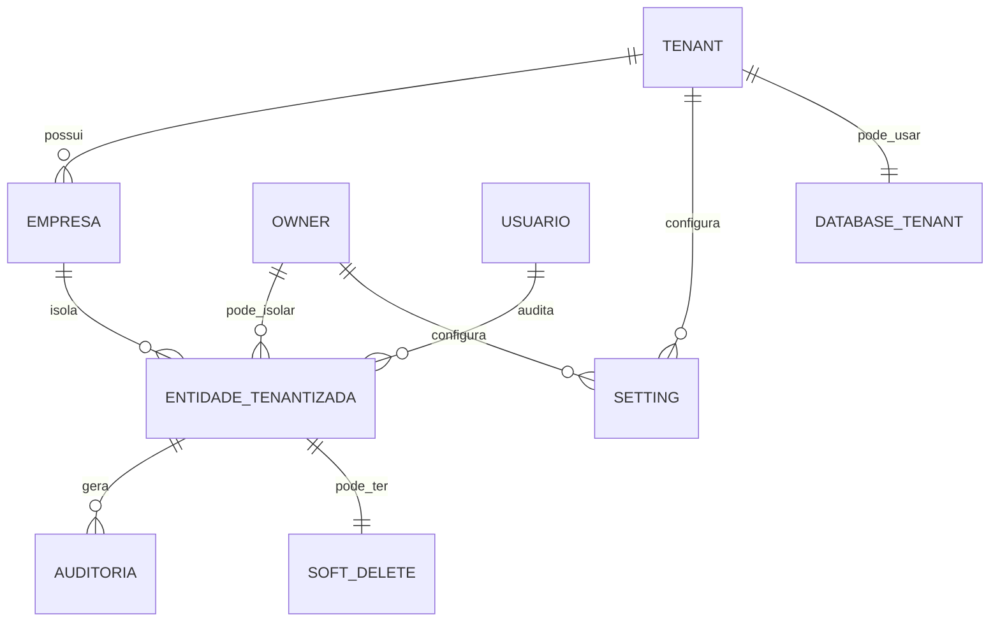

# EF 0_APLICATIVO ISOLAMENTO_DE_DADOS V1

**Projeto:** Epros  
**Empresa:** Siser  
**Tipo de documento:** Especificacao Funcional definitiva  
**Versao:** V1  
**Modulo:** APLICATIVO  
**Submodulo:** ISOLAMENTO_DE_DADOS  
**ID funcional:** APP-TEN-009  
**Status:** Pronto para validacao humana  
**Data:** 2026-06-06

## 1. Controle do documento

| Item | Conteudo |
|---|---|
| Responsavel pela elaboracao | Agente de analise e refinamento funcional |
| Responsavel pela validacao funcional | Siser |
| Responsavel pela validacao tecnica | Siser |
| Area dona do processo | Plataforma SaaS / Dados e seguranca |
| Publico-alvo | Produto, dados, arquitetura, desenvolvimento, QA, seguranca, implantacao e suporte |
| Fonte de verdade | Esta EF descreve o comportamento funcional esperado do Epros para isolamento de dados e contexto de persistencia |

## 2. Objetivo funcional

O submodulo Isolamento de Dados garante que todo dado operacional do Epros seja criado, consultado, alterado, excluido, auditado e processado dentro do contexto correto de tenant, empresa, grupo, usuario, owner ou base fisica, conforme a estrategia de implantacao aprovada pela Siser.

| Pergunta | Resposta |
|---|---|
| Para que o submodulo existe? | Para impedir mistura de dados entre clientes, empresas, grupos e usuarios, e para padronizar auditoria transversal de persistencia. |
| Que problema de negocio resolve? | Evita vazamento de dados, gravacao sem tenant, consulta fora do escopo, entidade sem classificacao e inconsistencias de auditoria. |
| Qual resultado operacional deve produzir? | Todo registro operacional deve carregar fronteira de dados valida, e toda consulta protegida deve retornar apenas dados autorizados. |
| Quais areas dependem dele? | Todos os modulos do Epros, Identidade e Contexto Tenant, Permissoes, Dashboard, Onboarding, Financeiro, Vendas, Compras, Estoque, Fiscal, RH, Projetos e Integracoes. |

## 3. Escopo funcional

### 3.1 Dentro do escopo

| Capacidade | Descricao | Observacao |
|---|---|---|
| Resolucao de contexto de dados | Obter tenant, empresa, grupo, usuario, owner ou base de dados ativa antes de consultar/gravar. | Depende de identidade e sessao. |
| Classificacao de entidades | Definir se entidade e tenantizada, comum/global, de auditoria, de configuracao, de sessao ou de dominio. | Entidade sem classificacao deve bloquear inicializacao/construcao. |
| Atribuicao automatica de contexto | Preencher TenantId, EmpresaID, GrupoID, UsuarioID, created_by ou equivalente em criacao. | O campo final depende do modelo aprovado. |
| Filtro automatico de leitura | Aplicar filtro de tenant/empresa/owner/base em consultas protegidas. | Consultas fora do mecanismo automatico exigem validacao explicita. |
| Auditoria transversal | Preencher data de criacao, data de atualizacao, usuario e contexto quando aplicavel. | Bypass de auditoria deve ser decisao formal. |
| Entidades comuns/globais | Permitir catalogos globais sem filtro de tenant quando classificados. | Ex.: catalogos SaaS e configuracoes globais. |
| Soft delete e restauracao | Tratar exclusao logica, filtragem de registros excluidos e eventual restauracao. | Quando aplicavel por dominio. |
| Lock otimista | Evitar sobrescrita concorrente de registros alterados por outro usuario. | Capacidade identificada e recomendada para dominios sensiveis. |
| Configuracoes por owner/tenant | Ler, gravar e cachear configuracoes por dono logico. | Cache precisa invalidacao. |
| Banco por tenant | Suportar estrategia de banco fisico por tenant quando implantacao exigir. | Estrategia final fica na MC. |
| Jobs e filas tenant-aware | Garantir que tarefas de fundo executem no contexto correto. | Obrigatorio para automacoes. |
| Inventario de entidades transversais | Manter mapa de entidades protegidas por dominio. | Detalhe campo-a-campo de dominio fica nos modulos donos. |

### 3.2 Fora do escopo

| Item fora do escopo | Motivo | Destino correto |
|---|---|---|
| Detalhamento completo de campos de Pessoa, Produto, Venda, Compra, Documento, Fiscal, RH e Estoque | Este submodulo define regras transversais; entidades de dominio sao detalhadas nos modulos donos. | Modulos de dominio correspondentes |
| CRUD de usuarios, perfil e menu | Isolamento consome esses dados, mas nao administra permissoes. | USUARIOS_E_PAPEIS; PERMISSOES_DE_MENU |
| Cadastro completo de empresa/tenant | Isolamento aplica contexto; onboarding cria/gerencia tenant e empresa. | ONBOARDING_E_EMPRESA |
| Politica comercial de bloqueio SaaS | Isolamento pode bloquear por status, mas a regra comercial pertence a cobranca/assinatura. | ASSINATURA_E_PLANOS; PEDIDOS_E_COBRANCA_SAAS |
| Modelo fisico final de cada deployment | Ha mais de uma estrategia de isolamento identificada. | Decisao de arquitetura na MC |

## 4. Glossario e conceitos funcionais

| Termo | Definicao funcional | Observacoes |
|---|---|---|
| Tenant | Fronteira logica principal de dados de um cliente/ambiente. | Pode ser coluna, owner ou base dedicada conforme decisao. |
| Empresa ativa | Fronteira operacional selecionada dentro do tenant. | Usada por modulos multiempresa. |
| Grupo | Agrupamento operacional de empresas. | Pode ser denormalizado em registros para consulta. |
| Usuario de auditoria | Usuario responsavel pela criacao/alteracao. | Diferente de owner de dados. |
| Owner | Dono logico usado para isolar registros e configuracoes. | Pode representar empresa/conta raiz. |
| Entidade tenantizada | Entidade que nunca deve ser consultada ou gravada sem contexto. | Obrigatoria para dados operacionais. |
| Entidade comum/global | Entidade compartilhada pela plataforma. | Deve ser explicitamente classificada. |
| Soft delete | Exclusao logica por campo de estado/deletado. | Consultas comuns devem ocultar excluidos. |
| Lock otimista | Controle de concorrencia que detecta alteracao simultanea. | Evita sobrescrita silenciosa. |
| Banco por tenant | Estrategia em que cada tenant usa base fisica propria. | Exige provisionamento e jobs tenant-aware. |
| Configuracao por owner | Par chave/valor segregado pelo dono logico. | Pode ter visibilidade publica. |

## 5. Atores, papeis e responsabilidades

| Ator/Papel | Responsabilidade | Permissoes esperadas | Restricoes |
|---|---|---|---|
| Sistema | Resolver contexto, aplicar filtros, preencher auditoria e bloquear entidades invalidas. | Execucao automatica. | Nao pode permitir operacao sem fronteira valida. |
| Usuario autenticado | Operar registros dentro do contexto autorizado. | Consultar/gravar conforme permissao. | Restrito ao tenant/empresa/owner ativo. |
| Administrador Siser | Definir politicas globais de isolamento e excecoes. | Configurar estrategia e entidades globais. | Excecoes devem ser auditaveis. |
| Desenvolvedor | Declarar corretamente entidades e consultas. | Criar entidades classificadas e testes. | Nao pode criar consulta sem filtro em dados protegidos. |
| Processo de integracao/API | Gravar ou consultar dados por contexto recebido. | Token/contexto valido. | Deve aplicar as mesmas regras da interface. |
| Job/rotina automatica | Processar dados em background. | Contexto explicito por tenant/empresa/owner. | Nao pode executar em contexto indefinido. |

## 6. Visao operacional do submodulo

1. A identidade do usuario ou processo fornece tenant, empresa, grupo, usuario, owner ou base ativa.
2. O Epros resolve o contexto de dados antes de abrir operacao protegida.
3. Ao criar registro tenantizado, o Epros preenche automaticamente os campos de fronteira e auditoria.
4. Ao alterar registro, o Epros preserva campos de criacao e fronteira, atualizando apenas campos de auditoria de alteracao.
5. Ao consultar, o Epros aplica filtro automatico ou garante filtro explicito equivalente.
6. Entidades comuns so ficam fora do filtro quando classificadas formalmente como globais.
7. Entidades nao classificadas como tenantizadas ou comuns bloqueiam inicializacao/construcao.
8. Consultas, APIs e jobs que nao passam pelo mecanismo automatico devem informar contexto explicitamente.
9. Exclusao logica oculta registros excluidos por padrao e permite restauracao apenas quando houver regra.
10. Configuracoes por owner/tenant usam chave composta e cache com invalidacao.

## 7. Capacidades funcionais

### 7.1 Classificacao obrigatoria de entidades

| Item | Especificacao |
|---|---|
| Objetivo | Garantir que toda entidade esteja marcada como tenantizada, comum/global, auditoria, sessao ou configuracao. |
| Acionamento | Registro de nova entidade no modelo de dados. |
| Pre-condicoes | Entidade incluida no modelo persistente. |
| Dados de entrada | Nome da entidade, grupo funcional e classificacao. |
| Processamento | Validar classificacao e bloquear entidade sem categoria. |
| Resultado esperado | Modelo sem entidades orfas. |
| Pos-condicoes | Entidade passa a receber filtro ou fica formalmente comum. |
| Excecoes | Entidade sem classificacao deve gerar erro bloqueante. |
| Auditoria | Alteracoes de classificacao devem ser registradas. |

### 7.2 Atribuicao automatica de contexto em criacao

| Item | Especificacao |
|---|---|
| Objetivo | Preencher campos de fronteira e auditoria em registros novos. |
| Acionamento | Inclusao de entidade tenantizada. |
| Pre-condicoes | Contexto valido resolvido. |
| Dados de entrada | TenantId, EmpresaID, GrupoID, UsuarioID, owner ou base ativa. |
| Processamento | Atribuir contexto quando campo estiver vazio ou conforme regra. |
| Resultado esperado | Registro criado com fronteira correta. |
| Pos-condicoes | Registro passa a ser visivel apenas no contexto autorizado. |
| Excecoes | Contexto vazio bloqueia gravacao. |
| Auditoria | Data de criacao, usuario e contexto devem ser preenchidos quando aplicavel. |

### 7.3 Filtro de consulta e protecao de leitura

| Item | Especificacao |
|---|---|
| Objetivo | Retornar apenas registros pertencentes ao contexto autorizado. |
| Acionamento | Consulta de entidade protegida. |
| Pre-condicoes | Contexto resolvido. |
| Dados de entrada | Entidade, contexto e permissao. |
| Processamento | Aplicar filtro automatico ou filtro explicito validado. |
| Resultado esperado | Nenhum dado de outro tenant/empresa/owner retorna. |
| Pos-condicoes | Consulta pode ser exibida, exportada ou processada. |
| Excecoes | Consulta sem filtro deve ser bloqueada ou revisada. |
| Auditoria | Consultas sensiveis podem ser auditadas conforme politica. |

### 7.4 Auditoria de persistencia

| Item | Especificacao |
|---|---|
| Objetivo | Padronizar criacao, alteracao, usuario e datas. |
| Acionamento | Inclusao ou alteracao de registro. |
| Pre-condicoes | Usuario/processo e contexto identificados. |
| Dados de entrada | Data/hora, usuario, contexto e estado da entidade. |
| Processamento | Em inclusao, preencher criacao e atualizacao; em alteracao, preservar criacao e atualizar data/usuario de atualizacao. |
| Resultado esperado | Registro auditavel. |
| Pos-condicoes | Alteracoes podem ser rastreadas. |
| Excecoes | Bypass de auditoria deve ser formalmente aprovado. |
| Auditoria | A propria capacidade define a trilha. |

### 7.5 Configuracoes por owner/tenant

| Item | Especificacao |
|---|---|
| Objetivo | Manter configuracoes chave/valor segregadas por owner/tenant. |
| Acionamento | Leitura ou escrita de configuracao. |
| Pre-condicoes | Owner/tenant resolvido. |
| Dados de entrada | Chave, valor, owner/tenant, visibilidade publica. |
| Processamento | Gravar por chave composta, ler por owner e aplicar cache por escopo. |
| Resultado esperado | Configuracao correta para o contexto. |
| Pos-condicoes | Cache deve refletir alteracoes. |
| Excecoes | Owner ausente retorna vazio ou bloqueia conforme regra. |
| Auditoria | Alteracoes de configuracao devem ser registradas. |

### 7.6 Banco por tenant e rotinas tenant-aware

| Item | Especificacao |
|---|---|
| Objetivo | Suportar implantacao com base fisica separada por tenant quando aprovada. |
| Acionamento | Resolucao de tenant por dominio/ambiente ou job. |
| Pre-condicoes | Registro de tenant, base associada e status ativo. |
| Dados de entrada | Dominio, tenant, database, status e configuracoes. |
| Processamento | Resolver tenant, selecionar base, carregar configuracoes e executar request/job no contexto. |
| Resultado esperado | Dados fisicamente isolados por tenant. |
| Pos-condicoes | Operacao usa apenas a base do tenant. |
| Excecoes | Tenant inativo, base ausente, setup incompleto ou configuracao obrigatoria ausente bloqueia. |
| Auditoria | Trocas de contexto e jobs devem registrar tenant. |

## 8. Regras de negocio

| Regra | Descricao | Condicao | Resultado | Severidade | Observacoes |
|---|---|---|---|---|---|
| REG-001 | Toda entidade persistente deve ser classificada. | Ao registrar entidade no modelo. | Epros aceita tenantizada/comum/auditoria/sessao/configuracao ou bloqueia. | Bloqueante | Entidade orfa e erro de construcao. |
| REG-002 | Entidade tenantizada exige contexto valido em criacao. | Ao incluir registro. | Epros preenche contexto ou bloqueia. | Bloqueante | Contexto vazio nao pode gerar dado orfao. |
| REG-003 | Campo de fronteira nao deve ser alterado em atualizacoes comuns. | Ao alterar registro existente. | Epros preserva tenant/empresa/owner original. | Bloqueante | Mudanca de fronteira exige rotina controlada. |
| REG-004 | Consulta de entidade tenantizada deve aplicar filtro de contexto. | Ao ler dados protegidos. | Epros retorna apenas dados autorizados. | Bloqueante | Consulta sem filtro e falha critica. |
| REG-005 | Entidade comum/global so pode ficar sem filtro se classificada formalmente. | Ao modelar catalogo global. | Epros permite consulta global. | Bloqueante | Excecoes precisam lista governada. |
| REG-006 | Toda entidade tenantizada deve possuir indice ou estrategia equivalente para campo de fronteira. | Ao desenhar modelo fisico. | Consultas ficam performaticas e seguras. | Bloqueante | Indice TenantId/EmpresaID/owner conforme modelo. |
| REG-007 | Criacao deve preencher data de criacao e data de atualizacao. | Ao incluir registro auditavel. | Datas ficam iguais na inclusao. | Informativa | Quando entidade suportar auditoria. |
| REG-008 | Atualizacao deve preservar data de criacao. | Ao alterar registro. | DataCriacao nao muda. | Bloqueante | Evita perda de historico. |
| REG-009 | Atualizacao deve preencher data de atualizacao. | Ao alterar registro. | Registro indica ultima alteracao. | Informativa | Quando entidade suportar auditoria. |
| REG-010 | Usuario de auditoria deve ser preenchido quando disponivel. | Ao criar/alterar. | UsuarioID/modified_user_id/created_by fica rastreavel. | Bloqueante | Processos automaticos devem ter usuario tecnico. |
| REG-011 | Grupo operacional deve ser derivado da empresa quando o modelo utilizar grupo. | Ao salvar registro com empresa. | GrupoID fica consistente. | Parcial | Regra final depende do modelo multiempresa. |
| REG-012 | Operacao especial sem auditoria so pode existir com justificativa formal. | Ao usar bypass. | Epros bloqueia ou registra excecao. | Bloqueante | Bypass identificado vira lacuna. |
| REG-013 | Configuracao por owner deve usar chave composta por chave e dono. | Ao gravar setting. | Nao ha sobrescrita entre owners. | Bloqueante | Visibilidade publica deve ser controlada. |
| REG-014 | Alteracao de configuracao deve invalidar cache do escopo afetado. | Ao gravar setting. | Leituras posteriores usam valor novo. | Bloqueante | Cache sem invalidacao e risco funcional. |
| REG-015 | Soft delete deve ocultar registros excluidos nas consultas padrao. | Ao consultar entidade com exclusao logica. | Apenas registros ativos retornam. | Bloqueante | Restauracao exige permissao. |
| REG-016 | Restauracao de registro excluido so deve ocorrer por fluxo autorizado. | Ao marcar registro como ativo novamente. | Registro volta ao estado ativo. | Parcial | Politica final por dominio. |
| REG-017 | Lock otimista deve detectar alteracao concorrente antes de salvar. | Em entidades com controle de concorrencia. | Epros bloqueia ou abre resolucao de conflito. | Parcial | Definir entidades obrigatorias. |
| REG-018 | Registro novo pode ter identificador predefinido apenas por fluxo aprovado. | Ao inserir com ID informado. | Epros aceita ou gera identificador. | Informativa | Usar em importacoes controladas. |
| REG-019 | Jobs e filas devem carregar contexto tenant/empresa/owner. | Ao executar background. | Rotina processa apenas contexto correto. | Bloqueante | Sem contexto, job deve falhar. |
| REG-020 | Banco por tenant deve ser resolvido antes de qualquer consulta tenant. | Em estrategia fisica. | Conexao aponta para base correta. | Bloqueante | Setup/base ausente bloqueia. |
| REG-021 | Tenant inativo deve bloquear request operacional. | Ao resolver tenant. | Epros retorna bloqueio funcional. | Bloqueante | Status permitidos precisam validacao. |
| REG-022 | Modulo desabilitado deve impedir visibilidade ou uso do recurso. | Ao carregar modulos. | Recurso fica indisponivel. | Bloqueante | Integra com limites/permissoes. |
| REG-023 | Configuracoes de sistema devem ser carregadas apos contexto valido. | Ao iniciar request tenant. | Epros aplica timezone, moeda, tema e flags corretos. | Informativa | Campos finais por Configuracao. |
| REG-024 | Dado comum de catalogo nao deve conter informacao sensivel de tenant. | Ao classificar entidade comum. | Catalogo pode ser global com seguranca. | Bloqueante | Validar com LGPD. |
| REG-025 | Entidades de dominio listadas neste submodulo devem ser detalhadas nos modulos donos. | Ao construir modelo final. | Campos especificos nao ficam perdidos. | Informativa | MC acompanha lacuna. |

## 9. Parametros de configuracao

| Parametro | Finalidade | Tipo/formato | Valor padrao | Obrigatorio | Nivel | Quem pode alterar | Impacto |
|---|---|---|---|---|---|---|---|
| Estrategia de isolamento | Definir coluna, owner, empresa/grupo ou banco por tenant. | Lista controlada | Nao informado no material | Sim | Global/deployment | Siser/Arquitetura | Define arquitetura de dados. |
| Entidades comuns globais | Lista formal de entidades sem filtro tenant. | Lista | Nao informado no material | Sim | Global | Siser/Dados | Evita excecao indevida. |
| Retencao de auditoria | Definir prazo para trilhas. | Duracao | Nao informado no material | Sim | Global/Tenant | Siser | Compliance. |
| Cache de configuracoes | Definir duracao e invalidacao. | Politica | Cache indefinido identificado em material | Sim | Global/Tenant | Siser | Consistencia de configuracao. |
| Soft delete habilitado | Definir entidades com exclusao logica. | Lista/booleano | Nao informado no material | Condicional | Entidade | Siser/Dados | Afeta recuperacao e consulta. |
| Lock otimista habilitado | Definir entidades com concorrencia controlada. | Lista/booleano | Nao informado no material | Condicional | Entidade | Siser/Dados | Evita sobrescrita. |
| Jobs tenant-aware | Exigir contexto em jobs. | Booleano | Sim para filas tenant-aware em material | Sim | Global | Siser/Arquitetura | Segurança de rotinas. |

## 10. Modelo de dados funcional e implantavel

### 10.1 Visao geral do modelo

O modelo funcional do isolamento do Epros usa entidades de contexto, entidades tenantizadas, entidades comuns, entidades de auditoria e contratos de configuracao. O desenho final pode usar coluna de tenant, empresa/grupo, owner logico ou base fisica por tenant, mas todos os caminhos precisam produzir a mesma garantia: nenhum dado operacional pode ser lido ou gravado fora do contexto autorizado.

| Grupo de dados | Entidades/tabelas | Papel funcional | Observacoes |
|---|---|---|---|
| Contexto | TenantContext, EmpresaContext, GrupoContext, UsuarioContext, OwnerContext | Transportar fronteira ativa. | Entidade funcional, pode nao ser tabela unica. |
| Base transversal | EntidadeBase, ModeloBaseAuditavel, EntidadeTenantizada | Padronizar campos comuns. | Inclui ID, datas, empresa, grupo e usuario quando aplicavel. |
| Entidades tenantizadas | Lista de 46 entidades tenantizadas e 55 entidades de dominio compartilhado | Dados operacionais protegidos. | Detalhe por dominio fica nos modulos donos. |
| Entidades comuns | Plano, cupom, funcionalidade, tipo pagamento, configuracao publica, pais, moeda, privilegio/catalogo global | Dados globais. | Devem ser governadas. |
| Configuracoes por owner | Setting | Chave/valor por dono logico. | key, value, is_public, created_by. |
| Tenant fisico | Tenant, settings landlord, defaults | Resolver banco por tenant e status. | Usado quando estrategia fisica for aprovada. |
| Auditoria/concorrencia | Campos date_entered/date_modified, created_by, modified_user_id, deleted, audit, tracker | Rastrear e controlar alteracoes. | Soft delete e lock. |

### 10.2 Entidades e tabelas

| Entidade funcional | Tabela/estrutura | Tipo | Finalidade | Chave primaria | Observacoes de implantacao |
|---|---|---|---|---|---|
| Contexto de dados | TenantContext/EmpresaContext/OwnerContext | Contrato | Resolver fronteira ativa. | Nao informado no material | Derivado da sessao/token/request. |
| Entidade base | EntidadeBase | Abstrata | Padronizar ID. | ID | ID int em material. |
| Modelo base auditavel | ModeloBaseAuditavel | Abstrata | Padronizar auditoria e empresa/grupo/usuario. | ID herdado | DataCriacao, DataAtualizacao, EmpresaID, GrupoID, UsuarioID. |
| Entidade tenantizada | EntidadeTenantizada | Interface/classificacao | Marcar entidade protegida. | Nao aplicavel | Deve ter campo de fronteira. |
| Entidade comum | EntidadeComum | Interface/classificacao | Marcar entidade global. | Nao aplicavel | Sem filtro tenant. |
| Configuracao por owner | settings | Configuracao | Guardar chave/valor por dono. | Nao informado no material | key, value, is_public, created_by. |
| Tenant fisico | tenants | Mestre | Resolver dominio/base/status. | tenant_id | domain, subdomain, database, tenant_status. |
| Configuracao tenant | settings/settings2 | Configuracao | Configuracoes tenant e flags de modulo. | id 1 em material | Timezone, moeda, modulos, login cliente. |
| Auditoria por tabela | {table}_audit | Auditoria | Registrar alteracoes quando habilitado. | Nao informado no material | Convencao identificada. |
| Campos customizados | {table}_cstm | Extensao | Guardar campos customizados. | Nao informado no material | Governanca final em extensoes. |
| Tracker | tracker | Auditoria/uso | Registrar visualizacao/uso recente. | Nao informado no material | Uso final a definir. |

### 10.3 Relacionamentos, cardinalidade e dependencia

| Origem | Relacionamento | Destino | Cardinalidade | Obrigatorio | Regra de integridade |
|---|---|---|---|---|---|
| Tenant | possui | Empresas | 1:N | Condicional | Conforme modelo multiempresa. |
| Empresa | pertence a | Grupo | N:1 | Condicional | Grupo pode ser derivado da empresa. |
| Usuario | opera em | Empresa/tenant/owner | N:N | Sim para operacao | Vem de identidade. |
| Entidade tenantizada | pertence a | Tenant/Empresa/Owner | N:1 | Sim | Registro sem fronteira e invalido. |
| Entidade comum | pertence a | Plataforma | N:1 | Sim | Nao deve conter dados sensiveis tenant. |
| Setting | pertence a | Owner/Tenant | N:1 | Sim | Chave composta por key+owner. |
| Tenant fisico | aponta para | Base de dados | 1:1 | Sim quando estrategia fisica | Base deve existir e estar ativa. |
| Entidade auditavel | possui | Auditoria | 1:N | Condicional | Quando auditoria habilitada. |
| Entidade com soft delete | possui | Estado deleted/deletado | 1:1 | Condicional | deleted=0 ativo; deleted=1 excluido. |

### 10.4 Chaves, unicidade, indices e constraints funcionais

| Entidade/tabela | Tipo de restricao | Campo(s) | Regra | Comportamento esperado |
|---|---|---|---|---|
| Entidade tenantizada | Indice | TenantId/EmpresaID/created_by | Campo de fronteira deve ser indexado. | Consulta segura e performatica. |
| EntidadeBase | PK | ID | Identificador unico. | Permitir relacionamento. |
| ModeloBaseAuditavel | FK funcional | EmpresaID, GrupoID, UsuarioID | Campos devem refletir contexto. | Bloquear ou preencher automaticamente. |
| Setting | Unico funcional | key + created_by | Uma chave por owner. | Upsert sem duplicidade. |
| Tenant fisico | PK | tenant_id | Identifica tenant. | Resolver base. |
| Tenant fisico | Unico funcional | domain/subdomain | Dominio deve identificar tenant. | Evitar ambiguidade. |
| Entidade com soft delete | Check | deleted/deletado | Estados 0/1 ou equivalente. | Filtrar excluidos. |
| Auditoria | Indice | created_by, modified_user_id, date_modified | Consultas de trilha. | Permitir rastreabilidade. |
| Menu/Usuario em entidades compartilhadas | Unico | Login ou chave especifica | Quando informado. | Bloquear duplicidade. |

### 10.5 Regras de persistencia, exclusao e historico

| Entidade/tabela | Criacao | Alteracao | Exclusao/inativacao | Historico/auditoria | Retencao |
|---|---|---|---|---|---|
| Entidade tenantizada | Exige contexto valido. | Preserva fronteira. | Conforme dominio; preferir soft delete onde aplicavel. | Criacao/alteracao com usuario e datas. | Nao informado no material |
| Entidade comum | Exige classificacao global. | Alteracao auditavel. | Governada por Siser. | Alteracoes devem ser auditadas. | Nao informado no material |
| Setting | Upsert key+owner. | Invalida cache. | Remover/inativar conforme configuracao. | Alteracoes auditaveis. | Nao informado no material |
| Tenant fisico | Criado por onboarding/provisionamento. | Status/base/dominio alteraveis por admin. | Inativar/cancelar antes de remover. | Mudancas criticas auditadas. | Nao informado no material |
| Auditoria | Criada por alteracao. | Nao deve ser alterada. | Purga somente por politica. | Propria trilha. | Nao informado no material |
| Soft delete | Nao aplicavel. | Alterar estado para excluido. | Restaurar apenas por permissao. | Excluir/restaurar auditavel. | Nao informado no material |

### 10.6 Diagrama logico funcional

### 10.7 Lacunas de modelo de dados

| Lacuna | Entidade/tabela afetada | Impacto | Encaminhamento para MC |
|---|---|---|---|
| Estrategia final de isolamento nao esta definida entre coluna, empresa/grupo, owner ou banco por tenant. | Todas as entidades tenantizadas | Define arquitetura fisica. | Sim |
| Lista final de entidades comuns/globais precisa governanca. | Entidades comuns | Risco de vazamento se classificada errado. | Sim |
| Bypass de auditoria em operacao especial precisa decisao. | Entidades auditaveis | Perda de trilha. | Sim |
| Retencao de auditoria e soft delete nao definida. | Auditoria, entidades deletaveis | Compliance incompleto. | Sim |
| Entidades de dominio precisam dicionario completo nos modulos donos. | 46/55 entidades de dominio | Implantacao incompleta se nao detalhar depois. | Sim |

## 11. Dicionario de dados implantavel

### 11.1 Entidade: ModeloBaseAuditavel

**Finalidade:** padronizar campos transversais de auditoria e contexto operacional.

| Campo | Tipo/formato | Tamanho/precisao/dominio | Obrigatorio | Chave/relacionamento | Regra funcional/observacao |
|---|---|---|---|---|---|
| ID | Inteiro | Nao informado no material | Sim | PK | Identificador base. |
| DataCriacao | Data/hora | Nao informado no material | Sim | Auditoria | Preenchida na inclusao. |
| DataAtualizacao | Data/hora | Nao informado no material | Sim | Auditoria | Preenchida na inclusao e alteracao. |
| EmpresaID | Inteiro | Nao informado no material | Sim para modelo empresa | FK funcional | Empresa ativa; preenchida se vazia. |
| GrupoID | Inteiro | Nao informado no material | Condicional | FK funcional | Derivado da empresa quando aplicavel. |
| UsuarioID | Inteiro | Nao informado no material | Condicional | FK funcional | Usuario de auditoria se disponivel. |

| Item | Especificacao |
|---|---|
| Chave primaria | ID |
| Chaves unicas | Nao informado no material |
| Relacionamentos | Empresa, grupo e usuario |
| Cardinalidade | Empresa 1:N registros |
| Historico/auditoria | Datas e usuario/contexto |
| Regras de exclusao | Conforme entidade derivada |
| Retencao de dados | Nao informado no material |

### 11.2 Entidade: EntidadeTenantizadaizada

**Finalidade:** representar qualquer registro operacional protegido por tenant.

| Campo | Tipo/formato | Tamanho/precisao/dominio | Obrigatorio | Chave/relacionamento | Regra funcional/observacao |
|---|---|---|---|---|---|
| TenantId | Texto/identificador | Nao informado no material | Sim quando estrategia por tenant | FK funcional/indice | Deve ser preenchido na criacao e filtrado na leitura. |
| EmpresaID | Inteiro | Nao informado no material | Sim quando estrategia por empresa | FK funcional/indice | Empresa ativa. |
| GrupoID | Inteiro | Nao informado no material | Condicional | FK funcional/indice | Grupo da empresa. |
| created_by | Identificador | Nao informado no material | Sim quando estrategia por owner | FK funcional/indice | Dono logico. |
| deleted/deletado | Booleano/inteiro | 0 ativo, 1 excluido quando aplicavel | Condicional | Estado | Soft delete. |

| Item | Especificacao |
|---|---|
| Chave primaria | Depende da entidade concreta |
| Chaves unicas | Devem incluir contexto quando necessario |
| Relacionamentos | Tenant, empresa, grupo ou owner |
| Cardinalidade | N:1 com contexto |
| Historico/auditoria | Obrigatoria para dados operacionais |
| Regras de exclusao | Soft delete quando aplicavel |
| Retencao de dados | Nao informado no material |

### 11.3 Entidade: Setting por owner/tenant

**Finalidade:** armazenar configuracoes segregadas por dono/contexto.

| Campo | Tipo/formato | Tamanho/precisao/dominio | Obrigatorio | Chave/relacionamento | Regra funcional/observacao |
|---|---|---|---|---|---|
| key | Texto | Nao informado no material | Sim | Chave composta | Nome da configuracao. |
| value | Texto | text | Sim | Valor | Valor configurado. |
| is_public | Booleano | default 1 em material | Sim | Visibilidade | Define se configuracao pode ser lida em contexto publico. |
| created_by | Identificador | Nao informado no material | Sim | FK owner | Dono logico. |

| Item | Especificacao |
|---|---|
| Chave primaria | Nao informado no material |
| Chaves unicas | key + created_by |
| Relacionamentos | Owner/tenant |
| Cardinalidade | Owner 1:N settings |
| Historico/auditoria | Alteracoes e invalidacao de cache |
| Regras de exclusao | Remover/inativar conforme governanca |
| Retencao de dados | Nao informado no material |

### 11.4 Entidade: Tenant fisico

**Finalidade:** resolver tenant, dominio, base e status quando a estrategia usar banco por tenant.

| Campo | Tipo/formato | Tamanho/precisao/dominio | Obrigatorio | Chave/relacionamento | Regra funcional/observacao |
|---|---|---|---|---|---|
| tenant_id | Identificador | Nao informado no material | Sim | PK | Identificador do tenant. |
| domain | Texto | Nao informado no material | Condicional | Unico funcional | Dominio do tenant. |
| subdomain | Texto | Nao informado no material | Condicional | Unico funcional | Subdominio do tenant. |
| domain_type | Texto | Nao informado no material | Nao informado no material | Classificacao | Tipo de dominio. |
| database | Texto | Nao informado no material | Sim | Referencia tecnica/funcional | Nome da base associada. |
| tenant_status | Status | unsubscribed, free-trial, active, cancelled identificados | Sim | Estado | Status controla acesso. |
| tenant_email_config_status | Status/contador | Nao informado no material | Nao | Indicador | Usado em boot/admin. |

| Item | Especificacao |
|---|---|
| Chave primaria | tenant_id |
| Chaves unicas | domain/subdomain conforme regra final |
| Relacionamentos | Database tenant, settings landlord |
| Cardinalidade | Tenant 1:1 database |
| Historico/auditoria | Mudancas de status/base/dominio |
| Regras de exclusao | Inativar/cancelar antes de remover |
| Retencao de dados | Nao informado no material |

### 11.5 Entidade: Padrao de tabela auditavel e soft delete

**Finalidade:** padronizar colunas de auditoria, exclusao logica e extensibilidade quando aplicavel.

| Campo | Tipo/formato | Tamanho/precisao/dominio | Obrigatorio | Chave/relacionamento | Regra funcional/observacao |
|---|---|---|---|---|---|
| id | GUID/texto | char(36) informado em um padrao | Sim | PK | Identificador universal quando aplicavel. |
| date_entered | Data/hora | datetime | Condicional | Auditoria | Criacao. |
| date_modified | Data/hora | datetime | Condicional | Auditoria | Alteracao. |
| modified_user_id | Identificador | char(36) | Condicional | FK Usuario | Usuario alterador. |
| created_by | Identificador | char(36) | Condicional | FK Usuario/owner | Criador/dono conforme modelo. |
| assigned_user_id | Identificador | char(36) | Nao | FK Usuario | Responsavel. |
| deleted | Inteiro/booleano | tinyint; 0 ativo, 1 excluido | Condicional | Estado | Soft delete. |
| description | Texto | text | Nao | Informativo | Descricao opcional. |

| Item | Especificacao |
|---|---|
| Chave primaria | id |
| Chaves unicas | Nao informado no material |
| Relacionamentos | Usuario criador, alterador, responsavel |
| Cardinalidade | Usuario 1:N registros |
| Historico/auditoria | Campos transversais e tabela audit quando habilitada |
| Regras de exclusao | deleted=1 oculta nas consultas |
| Retencao de dados | Nao informado no material |

### 11.6 Entidades de dominio protegidas identificadas

**Finalidade:** inventariar entidades que devem seguir as regras de isolamento, sem detalhar campos de dominio nesta EF.

| Grupo | Entidades identificadas | Regra |
|---|---|---|
| Financeiro | AccountLedger, LedgerPosting, PaymentMaster, PaymentDetails, ReceiptMaster, ReceiptDetails, JournalMaster, JournalDetails, ExpenseMaster, ExpensesDetails, IncomeMaster | Devem carregar contexto e auditoria. |
| Vendas | SalesMaster, SalesDetails, SalesReturnMaster, SalesReturnDetails, SalesQuotationMaster, SalesQuotationDetails | Devem carregar contexto e auditoria. |
| Compras | PurchaseMaster, PurchaseDetails, PurchaseReturnMaster, PurchaseReturnDetails | Devem carregar contexto e auditoria. |
| Estoque | Product, Brand, Categories, Unit, Warehouse, Batch, StockPosting, Inventario, InventarioItem | Devem carregar contexto e auditoria. |
| Cadastros | Company, CustomerSupplier, Employee, Designation, UserCompany, EmailSetting, GeneralSetting, InvoiceSetting, FinancialYear | Devem carregar contexto e auditoria. |
| RH | DailyAttendanceMaster, DailyAttendanceDetails, SalaryPackage, SalaryPackageDetails, SalaryVoucherMaster, SalaryVoucherDetails, MonthlySalary, MonthlySalaryDetails, PayHead, BonusDeduction | Devem carregar contexto e auditoria. |
| Fiscal/PDV/Permissoes | Tax, MovimentoFiscal, Eventos fiscais, Parametros, Caixa, MovimentoCaixa, FluxoCaixa, ConferenciaCaixa, Menu, PerfilUsuario, PerfilUsuarioAcesso | Devem seguir isolamento conforme dominio. |

| Item | Especificacao |
|---|---|
| Chave primaria | Definida nos modulos donos |
| Chaves unicas | Definidas nos modulos donos |
| Relacionamentos | Tenant/empresa/owner e entidades de dominio |
| Cardinalidade | N:1 com contexto |
| Historico/auditoria | Obrigatoria para dados operacionais |
| Regras de exclusao | Conforme dominio |
| Retencao de dados | Nao informado no material |

## 12. Estados, situacoes e ciclos de vida

| Entidade/processo | Estado | Significado | Estado inicial | Pode ir para | Quem altera | Regra de transicao |
|---|---|---|---|---|---|---|
| Contexto de dados | Resolvido | Tenant/empresa/owner/base ativo. | Nao | Encerrado/alterado | Sistema | Requer identidade/request valido. |
| Contexto de dados | Ausente | Nao ha fronteira disponivel. | Sim em anonimo | Resolvido | Sistema | Operacao protegida deve bloquear. |
| Entidade | Classificada | Entidade possui tipo de isolamento. | Sim apos modelagem | Bloqueada se invalida | Dados/arquitetura | Toda entidade deve ser classificada. |
| Entidade | Orfa | Entidade sem classificacao. | Nao | Classificada | Dados/arquitetura | Deve bloquear construcao/inicializacao. |
| Registro | Ativo | Visivel em consultas padrao. | Sim | Excluido | Usuario/sistema | Conforme permissao. |
| Registro | Excluido logicamente | Oculto em consultas padrao. | Nao | Restaurado | Usuario autorizado | Restauracao precisa permissao. |
| Lock | Livre | Sem conflito concorrente. | Sim | Conflito | Sistema | Alteracao simultanea detectada. |
| Lock | Conflito | Registro mudou desde abertura. | Nao | Resolvido/sobrescrito | Usuario autorizado | Fluxo de resolucao. |
| Tenant fisico | Ativo | Pode operar. | Condicional | Inativo/cancelado | Siser/sistema | Status controla acesso. |
| Tenant fisico | Inativo/cancelado | Operacao bloqueada. | Nao | Ativo | Siser/sistema | Reativacao autorizada. |

## 13. Fluxos funcionais

### 13.1 Fluxo principal: gravacao de entidade tenantizada

| Passo | Ator | Acao | Entrada | Validacao | Saida | Proximo passo |
|---:|---|---|---|---|---|---|
| 1 | Sistema | Recebe operacao de criacao | Entidade e dados | Entidade classificada | Continua | 2 |
| 2 | Sistema | Resolve contexto | Sessao/token/request | Contexto valido | Contexto ativo | 3 |
| 3 | Sistema | Preenche fronteira | Tenant/empresa/owner | Campo vazio ou regra aplicavel | Fronteira atribuida | 4 |
| 4 | Sistema | Preenche auditoria | Usuario e data | Usuario/processo identificado | Auditoria preenchida | 5 |
| 5 | Sistema | Persiste registro | Entidade completa | Integridade | Registro salvo | Fim |

### 13.2 Fluxo principal: consulta protegida

| Passo | Ator | Acao | Entrada | Validacao | Saida | Proximo passo |
|---:|---|---|---|---|---|---|
| 1 | Usuario/processo | Solicita dados | Recurso e filtros | Permissao | Requisicao aceita | 2 |
| 2 | Sistema | Resolve contexto | Sessao/token/request | Contexto valido | Contexto ativo | 3 |
| 3 | Sistema | Aplica filtro | Entidade e contexto | Entidade tenantizada ou comum | Consulta segura | 4 |
| 4 | Sistema | Executa consulta | Filtros de negocio | Restricao aplicada | Dados do contexto | Fim |

### 13.3 Fluxos alternativos e excecoes

| Cenario | Condicao | Comportamento esperado | Mensagem/retorno | Registro necessario |
|---|---|---|---|---|
| Contexto ausente | Criacao/consulta protegida sem tenant/empresa/owner. | Bloquear. | Contexto de dados nao encontrado. | Falha critica. |
| Entidade orfa | Entidade sem classificacao. | Bloquear construcao/inicializacao. | Entidade sem classificacao de isolamento. | Registro tecnico/funcional. |
| Consulta sem filtro | Consulta paralela sem filtro de contexto. | Bloquear ou reprovar em qualidade. | Nao informado no material. | Evidencia de risco. |
| Tenant inativo | Request para tenant inativo/cancelado. | Bloquear operacao. | Tenant inativo. | Evento de bloqueio. |
| Cache desatualizado | Configuracao alterada. | Invalidar cache do escopo. | Nao informado no material. | Alteracao de configuracao. |
| Conflito concorrente | Registro alterado por outro usuario. | Abrir resolucao ou bloquear sobrescrita. | Conflito de alteracao. | Evento de lock. |

## 14. Validacoes, consistencias e bloqueios

| Validacao | Onde ocorre | Condicao verificada | Comportamento quando valido | Comportamento quando invalido | Mensagem esperada |
|---|---|---|---|---|---|
| Contexto obrigatorio | Criacao/consulta | Tenant/empresa/owner resolvido | Continua | Bloqueia | Contexto de dados nao encontrado |
| Entidade classificada | Modelagem/inicializacao | Entidade tenantizada ou comum | Continua | Bloqueia | Entidade sem classificacao |
| Entidade comum autorizada | Modelagem | Lista governada | Sem filtro | Bloqueia classificacao indevida | Nao informado no material |
| Filtro aplicado | Consulta | Campo de fronteira filtrado | Retorna dados | Bloqueia/reprova | Nao informado no material |
| Fronteira imutavel | Atualizacao | Tenant/empresa/owner nao alterado | Salva | Bloqueia | Alteracao de fronteira nao permitida |
| Auditoria preenchida | Criacao/alteracao | Datas e usuario/contexto | Salva | Bloqueia ou alerta | Nao informado no material |
| Cache invalidado | Alteracao setting | Escopo afetado limpo | Leitura atualizada | Risco funcional | Nao informado no material |
| Tenant ativo | Request fisico | Status permitido | Continua | Bloqueia | Tenant inativo |

## 15. Permissoes, seguranca e segregacao

| Recurso/acao | Permissao necessaria | Papel autorizado | Restricao de dados | Auditoria obrigatoria |
|---|---|---|---|---|
| Consultar entidade tenantizada | Permissao do modulo | Usuario autorizado | Tenant/empresa/owner ativo | Conforme dado sensivel |
| Criar entidade tenantizada | Permissao de inclusao | Usuario autorizado | Contexto ativo | Sim |
| Alterar entidade tenantizada | Permissao de edicao | Usuario autorizado | Mesmo contexto do registro | Sim |
| Excluir/restaurar | Permissao de exclusao/restauracao | Usuario autorizado | Mesmo contexto do registro | Sim |
| Alterar classificacao de entidade | Permissao de arquitetura/dados | Siser/Dados | Global | Sim |
| Consultar entidade comum | Permissao de catalogo | Usuario autorizado ou sistema | Global governado | Conforme criticidade |
| Alterar configuracao por owner | Permissao administrativa | Admin autorizado | Owner/tenant | Sim |
| Executar job tenant-aware | Permissao tecnica | Sistema | Contexto explicito | Sim |
| Trocar base tenant | Permissao tecnica controlada | Sistema/Siser | Tenant resolvido | Sim |

## 16. Telas, consultas e operacao visual

### 16.1 Tela/consulta: Submodulo transversal sem tela propria

| Item | Especificacao |
|---|---|
| Objetivo | Aplicar isolamento de dados em todas as telas e APIs consumidoras. |
| Atores | Sistema, usuarios autenticados, processos e jobs. |
| Campos exibidos | Nao possui tela propria. |
| Filtros | Tenant, empresa, grupo, usuario, owner ou base ativa. |
| Acoes | Aplicar contexto, filtrar, auditar, bloquear excecoes. |
| Regras | Toda tela consumidora herda as regras deste submodulo. |
| Estados | Contexto resolvido, contexto ausente, entidade orfa, tenant inativo. |
| Mensagens | Contexto de dados nao encontrado; entidade sem classificacao; acesso bloqueado. |

### 16.2 Telas consumidoras identificadas

| Tela/consulta | Objetivo | Dependencia de isolamento |
|---|---|---|
| Gestao de usuarios | Filtrar usuarios por owner/tenant/empresa. | Nao exibir usuarios de outro contexto. |
| Configuracoes | Ler/gravar settings por owner/tenant. | Aplicar chave composta e cache. |
| Historico de login | Exibir eventos do contexto autorizado. | Filtrar por owner/tenant. |
| Modulos de dominio | Listar/detalhar/criar/alterar registros operacionais. | Aplicar filtro transversal. |

## 17. Relatorios, consultas e indicadores

| Relatorio/indicador | Objetivo | Filtros | Saida | Observacoes |
|---|---|---|---|---|
| Auditoria de isolamento | Identificar operacoes sem contexto, entidade orfa e bypass. | Periodo, modulo, entidade, usuario. | Lista de ocorrencias. | Capacidade recomendada pelo agente a partir das lacunas. |
| Inventario de entidades | Controlar entidades tenantizadas e comuns. | Modulo, tipo, status. | Matriz de entidades. | Necessario para governanca. |
| Integridade de contexto | Verificar registros sem TenantId/EmpresaID/owner. | Entidade, periodo. | Contagem e detalhe. | Critico para implantacao. |

## 18. Integracoes internas e externas

| Integracao | Tipo | Origem/Destino | Dados trocados | Regra |
|---|---|---|---|---|
| Identidade e Contexto Tenant | Interna | Identidade -> Isolamento | Tenant, empresa, usuario, owner. | Fonte primaria do contexto. |
| Permissoes | Interna | Permissoes -> Isolamento | Perfil e acoes. | Complementa acesso ao dado. |
| Onboarding e Empresa | Interna | Onboarding -> Isolamento | Tenant, empresa, grupo, base. | Provisiona fronteira. |
| Configuracao | Interna | Isolamento -> Configuracao | Settings por owner/tenant. | Cache e visibilidade. |
| Jobs/workflow | Interna | Rotinas -> Isolamento | Contexto explicito. | Rotina sem contexto deve falhar. |
| Todos os modulos de dominio | Interna | Isolamento -> Modulos | Filtro e auditoria. | Obrigatorio em dados operacionais. |

## 19. Automacoes, eventos e jobs

| Automacao/evento | Acionamento | Entrada | Processamento | Saida | Observacao |
|---|---|---|---|---|---|
| Validacao de entidades | Build/inicializacao/modelagem | Entidades persistentes | Verificar classificacao | Lista de erros ou sucesso | Entidade orfa bloqueia. |
| Auditoria de registros sem contexto | Periodica | Entidades tenantizadas | Procurar fronteira vazia | Relatorio de inconsistencias | Recomendado para implantacao. |
| Invalidacao de cache setting | Alteracao de configuracao | Owner/tenant/chave | Limpar cache do escopo | Leitura atualizada | Obrigatorio. |
| Execucao tenant-aware | Job/cron/fila | Tenant/empresa/owner | Aplicar contexto | Processamento seguro | Sem contexto falha. |
| Limpeza de soft delete/auditoria | Politica de retencao | Data de corte | Arquivar/purgar | Dados conforme compliance | Prazo nao informado. |

## 20. Auditoria, rastreabilidade e controles

| Evento | O que registrar | Retencao | Criticidade |
|---|---|---|---|
| Criacao tenantizada | Usuario/processo, contexto, entidade, registro, data. | Nao informado no material | Alta |
| Alteracao tenantizada | Usuario/processo, contexto, entidade, registro, campos criticos, data. | Nao informado no material | Alta |
| Exclusao/restauracao | Usuario, contexto, entidade, registro, motivo, data. | Nao informado no material | Alta |
| Entidade sem classificacao | Entidade, modulo, data, responsavel. | Nao informado no material | Critica |
| Consulta/bypass sem filtro | Entidade, origem, usuario/processo, contexto ausente. | Nao informado no material | Critica |
| Alteracao de setting | Chave, owner/tenant, valor anterior/novo quando permitido, usuario. | Nao informado no material | Media |
| Troca de base tenant | Tenant, base, request/job, data. | Nao informado no material | Critica |

## 21. Mensagens, excecoes e tratamento de erro

| Situacao | Mensagem esperada | Comportamento | Observacao |
|---|---|---|---|
| Contexto ausente | Contexto de dados nao encontrado. | Bloquear operacao. | Texto padronizado pelo agente a partir do material. |
| Entidade sem classificacao | Entidade sem classificacao de isolamento. | Bloquear construcao/inicializacao. | Material indica falha para entidade nao marcada. |
| Tenant inativo | Tenant inativo. | Bloquear request. | Status finais a definir. |
| Conflito concorrente | Registro alterado por outro usuario. | Abrir resolucao/bloquear. | Aplicavel a lock otimista. |
| Acesso fora do contexto | Acesso nao permitido para o contexto atual. | Bloquear. | Evita vazamento. |

## 22. Importacao, exportacao e impressao

| Operacao | Formato | Conteudo | Regra | Auditoria |
|---|---|---|---|---|
| Importacao de dados tenantizados | Nao informado no material | Registros de dominio | Deve exigir contexto explicito e validar fronteira. | Sim |
| Exportacao de dados | Nao informado no material | Dados do contexto | Deve respeitar filtro de isolamento. | Sim para dado sensivel |
| Exportacao de auditoria | Nao informado no material | Trilhas de isolamento | Somente usuario autorizado. | Sim |

## 23. Buscas, filtros e ordenacoes

| Recurso | Campos/filtros | Regra | Lacuna |
|---|---|---|---|
| Busca em entidade tenantizada | TenantId/EmpresaID/created_by + filtros de negocio | Filtro de contexto obrigatorio. | Padrao tecnico final a definir. |
| Busca em entidade comum | Filtros de catalogo | Sem tenant apenas se entidade for comum. | Lista final de comuns. |
| Settings | key, created_by, is_public | Chave composta e visibilidade. | Cache/retencao. |
| Auditoria | Entidade, usuario, contexto, periodo | Deve permitir rastreamento. | Tela final nao detalhada. |

## 24. Requisitos nao funcionais aplicaveis

| Requisito | Especificacao | Prioridade |
|---|---|---|
| Seguranca | Nenhuma consulta/gravação tenantizada pode ocorrer sem contexto. | P0 |
| Performance | Campos de fronteira devem ter indice ou estrategia equivalente. | P0 |
| Observabilidade | Falhas de contexto, entidades orfas e bypasses devem ser registradas. | P0 |
| Compliance | Auditoria, soft delete e retencao devem seguir politica Siser. | P0 |
| Escalabilidade | Banco por tenant e jobs tenant-aware devem ser suportados se aprovados. | P1 |
| Consistencia | Cache de settings deve ser invalidado apos alteracao. | P0 |

## 25. Criterios de aceite

| Criterio | Validacao esperada |
|---|---|
| Entidade tenantizada criada | Registro recebe contexto obrigatorio. |
| Criacao sem contexto | Operacao e bloqueada. |
| Consulta tenantizada | Retorna apenas dados do contexto. |
| Entidade comum | So fica sem filtro se classificada. |
| Entidade orfa | Inicializacao/construcao falha. |
| Atualizacao | Preserva fronteira e data de criacao. |
| Auditoria | Data/usuario/contexto sao preenchidos quando aplicavel. |
| Setting por owner | Chave nao mistura valores entre owners. |
| Cache setting | Alteracao invalida cache. |
| Tenant inativo | Operacao e bloqueada. |
| Job sem contexto | Rotina falha antes de processar. |

## 26. Checklist de completude

| Item | Status | Observacao |
|---|---|---|
| Objetivo e escopo | Completo | Consolidado para Epros. |
| Regras de negocio | Parcial | 25 regras; estrategia final na MC. |
| Modelo de dados funcional | Parcial | Entidades, grupos, relacoes, constraints e lacunas mapeados. |
| Dicionario de dados | Parcial | Campos transversais preservados; dominios detalham depois. |
| Fluxos | Completo para submodulo transversal | Criacao, consulta, settings, banco por tenant e excecoes. |
| Telas | Nao se aplica como tela propria | Telas consumidoras mapeadas. |
| Permissoes | Parcial | Depende de Identidade/Permissoes. |
| Testes | Lacuna | Nao ha testes automatizados identificados. |

## 27. Decisoes encaminhadas para MC

| Decisao | Motivo |
|---|---|
| Escolher estrategia oficial de isolamento por deployment. | Materiais apresentam coluna, empresa/grupo, owner e banco por tenant. |
| Definir lista final de entidades comuns/globais. | Evita excecoes indevidas. |
| Eliminar ou formalizar bypass de auditoria. | Risco de registros sem contexto. |
| Definir retencao de auditoria, soft delete e restauracao. | Compliance e suporte. |
| Definir padrao de lock otimista. | Concorrencia em registros criticos. |

## 28. Notas de rodape

[^agente-001]: A estrategia unificada de isolamento, mensagens padronizadas, criterios de aceite, relatorios de integridade e requisitos nao funcionais foram organizados pelo agente a partir do material disponivel. Onde o material nao fechou decisao, a informacao foi marcada como lacuna ou decisao na MC.

