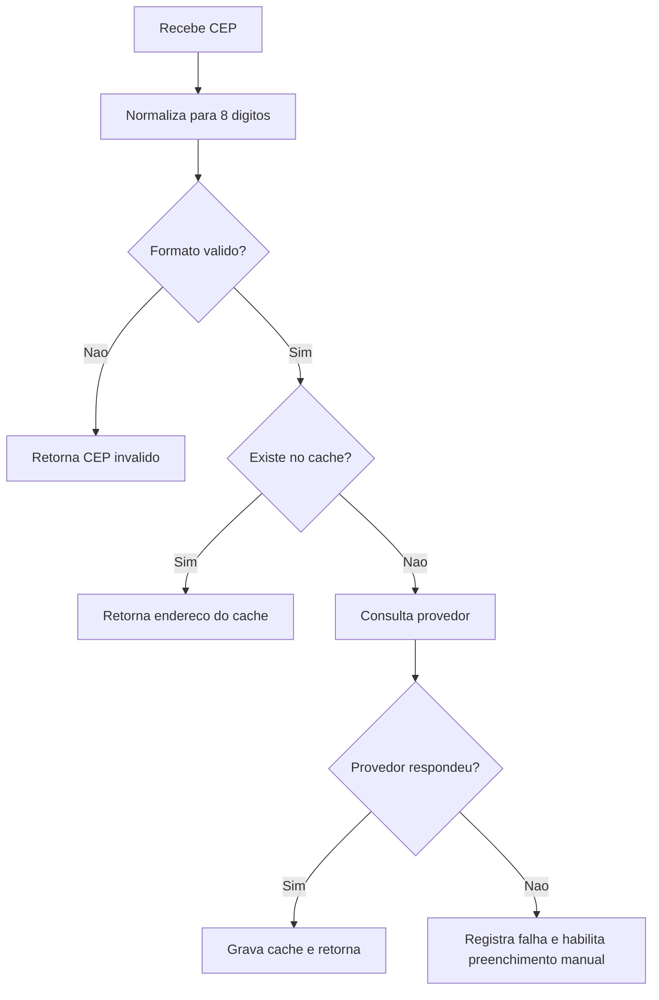
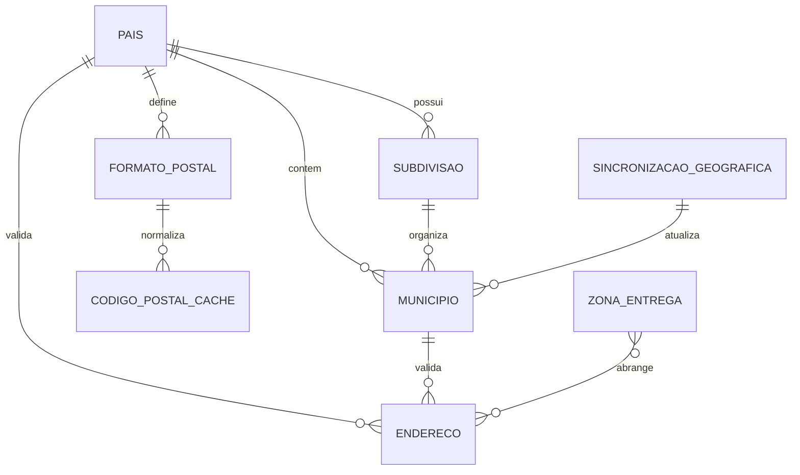

# EF 1 Cadastros Base — Geografia e Localizacao V1

## 1. Identificacao

| Item | Valor |
|---|---|
| Sistema | Epros |
| Empresa | Siser |
| Modulo | Cadastros Base |
| Submodulo | Geografia e Localizacao |
| Versao | V1 |
| Status | Especificacao funcional para validacao humana |
| Data | 2026-06-06 |

## 2. Objetivo funcional

O submodulo Geografia e Localizacao mantem as referencias geograficas do Epros: paises, unidades federativas, municipios, codigos postais, enderecos validados, zonas de entrega e sincronizacao de base geografica oficial. Ele funciona como servico compartilhado para todos os cadastros e processos que dependem de endereco, fiscalidade territorial, entrega, logistica e documentacao.

No Brasil, o municipio e identificado pelo codigo IBGE de 7 digitos, usado como chave funcional imutavel. Para evolucao internacional, o submodulo deve suportar codigos ISO, subdivisoes territoriais, formatos postais por pais e geocodificacao.

## 3. Escopo

### 3.1 Dentro do escopo

| Capacidade | Descricao |
|---|---|
| Pais | Cadastro e consulta de paises. |
| UF/Subdivisao | Cadastro de UF brasileira e futura subdivisao generica por pais. |
| Municipio | Cadastro e consulta de municipio, com codigo IBGE como chave no Brasil. |
| Codigo postal | Validacao de CEP brasileiro e evolucao para formato por pais. |
| Endereco | Validacao funcional de campos e vinculos geograficos antes da persistencia pelo dono do endereco. |
| Consulta de CEP | Consulta com cache, provedor externo, fallback manual e fila de falhas. |
| Zona de entrega | Faixas de CEP para regiao logistica, entrega e frete. |
| Sincronizacao geografica | Job idempotente para atualizacao de municipios e inativacao de extintos. |
| Coordenadas | Latitude e longitude opcionais para uso futuro de geocodificacao. |
| Auditoria | Registro de sincronizacao, preenchimento manual e falhas de consulta. |

### 3.2 Fora do escopo

| Tema | Tratamento |
|---|---|
| Cadastro de pessoa e empresa | Consome endereco validado; pertence a Pessoa e Organizacao. |
| Roteirizacao completa | Consome zonas, coordenadas e CEP; pertence a logistica/transporte. |
| Aliquotas tributarias por UF/municipio | Pertencem ao modulo fiscal/tributario, nao ao cadastro geografico. |
| Geocodificacao em massa | Evolucao futura; nao e requisito minimo. |
| Calculo de frete | Consome zonas de entrega; pertence a vendas/logistica. |

## 4. Principios funcionais

| Codigo | Regra |
|---|---|
| REG-001 | Municipio brasileiro deve ser identificado pelo codigo IBGE de 7 digitos. |
| REG-002 | Codigo de municipio nao deve ser substituido por identificador sequencial arbitrario. |
| REG-003 | Pais, UF/subdivisao e municipio devem ser dados de referencia consistentes e reutilizaveis. |
| REG-004 | Endereco deve referenciar pais e municipio validos antes de ser gravado pelo modulo dono. |
| REG-005 | CEP brasileiro deve conter 8 digitos validos. |
| REG-006 | Consulta de CEP deve usar cache antes de consultar provedor externo. |
| REG-007 | Falha de provedor de CEP deve permitir preenchimento manual controlado e registro para reprocessamento. |
| REG-008 | Sincronizacao geografica deve ser idempotente e auditavel. |
| REG-009 | Municipio extinto deve ser inativado, nao removido, para preservar historico. |
| REG-010 | Dados tributarios nao devem ser armazenados dentro do cadastro geografico. |
| REG-011 | Base global de pais, UF e municipio pode ser compartilhada; dados especificos de tenant devem ter TenantId quando aplicavel. |

## 5. Regras funcionais detalhadas

### 5.1 Municipio

| Codigo | Regra | Mensagem/resultado |
|---|---|---|
| REG-012 | Id do municipio deve ser maior que zero e representar o codigo IBGE. | Id do municipio deve ser igual ao codigo do IBGE. |
| REG-013 | Nome do municipio deve conter de 2 a 60 caracteres. | Nome do municipio deve conter entre 2 e 60 caracteres. |
| REG-014 | Estado/UF do municipio deve ser valido. | Estado do endereco informado invalido. |
| REG-015 | Municipio inativo nao deve ser aceito em novo endereco. | Bloqueio funcional. |
| REG-016 | Municipio pode armazenar latitude e longitude quando disponiveis. | Coordenadas opcionais. |

### 5.2 Pais

| Codigo | Regra | Mensagem/resultado |
|---|---|---|
| REG-017 | Nome do pais deve conter de 1 a 60 caracteres. | Nome do pais deve conter entre 1 e 60 caracteres. |
| REG-018 | Pais deve possuir identificador unico. | Registro unico. |
| REG-019 | Pais deve evoluir para codigo ISO alpha-2, alpha-3 e numerico. | Lacuna na MC. |
| REG-020 | Pais pode possuir capital, codigo de discagem e moeda padrao. | Lacuna na MC. |

### 5.3 Endereco

| Codigo | Regra | Mensagem/resultado |
|---|---|---|
| REG-021 | PaisId deve ser maior que zero. | O campo PaisId deve ser maior que zero. |
| REG-022 | MunicipioId deve ser maior que zero. | O campo MunicipioId deve ser maior que zero. |
| REG-023 | Logradouro deve ter no maximo 60 caracteres. | O campo Logradouro deve ter no maximo 60 caracteres. |
| REG-024 | Complemento deve ter no maximo 60 caracteres. | O campo Complemento deve ter no maximo 60 caracteres. |
| REG-025 | Numero deve ter no maximo 60 caracteres. | O campo Numero deve ter no maximo 60 caracteres. |
| REG-026 | Bairro deve ter no maximo 60 caracteres. | O campo Bairro deve ter no maximo 60 caracteres. |
| REG-027 | Referencia deve ter no maximo 250 caracteres. | O campo Referencia deve ter no maximo 250 caracteres. |
| REG-028 | TipoEndereco deve existir no dominio permitido. | TipoEndereco nao consta na lista. |
| REG-029 | UF deve existir no dominio permitido. | UF nao consta na lista. |
| REG-030 | CEP e obrigatorio para endereco brasileiro e pode ser nulo para estrangeiro quando regra internacional permitir. | CEP invalido quando informado fora do padrao. |

### 5.4 CEP e codigo postal

| Codigo | Regra |
|---|---|
| REG-031 | CEP brasileiro deve ser normalizado para 8 digitos. |
| REG-032 | Consulta deve retornar dados do cache quando houver acerto. |
| REG-033 | Ausencia de cache deve acionar provedor externo. |
| REG-034 | Resultado do provedor deve ser gravado no cache. |
| REG-035 | Falha de consulta deve ser registrada com CEP, data/hora, provedor e motivo. |
| REG-036 | Preenchimento manual deve registrar usuario, motivo e data/hora. |
| REG-037 | O Epros deve evoluir para formato de codigo postal por pais. |

### 5.5 Zona de entrega

| Codigo | Regra |
|---|---|
| REG-038 | Zona de entrega pertence ao tenant. |
| REG-039 | Zona de entrega deve possuir nome. |
| REG-040 | Zona de entrega deve possuir CepInicio e CepFim validos. |
| REG-041 | Faixa de CEP deve impedir sobreposicao quando a regra operacional exigir exclusividade. |
| REG-042 | Zona de entrega pode ser consumida por frete, roteirizacao e logistica. |

### 5.6 Sincronizacao geografica

| Codigo | Regra |
|---|---|
| REG-043 | Sincronizacao deve registrar versao da base processada. |
| REG-044 | Sincronizacao deve registrar quantidades inseridas, atualizadas e inativadas. |
| REG-045 | Sincronizacao deve transitar entre Agendada, EmExecucao, Concluida e Falha. |
| REG-046 | Reexecucao da mesma base nao deve duplicar municipio. |
| REG-047 | Municipio removido da base oficial deve ser inativado. |
| REG-048 | Falha da sincronizacao deve permitir reagendamento. |

## 6. Fluxos funcionais

### 6.1 Consulta de CEP

### 6.2 Sincronizacao geografica

| Estado atual | Evento | Proximo estado |
|---|---|---|
| Agendada | Iniciar processamento | EmExecucao |
| EmExecucao | Concluir sem erro | Concluida |
| EmExecucao | Erro fatal | Falha |
| Falha | Reagendar | Agendada |

### 6.3 Validacao de endereco

| Passo | Acao | Resultado |
|---:|---|---|
| 1 | Receber endereco do modulo consumidor | Campos entram para validacao. |
| 2 | Validar PaisId, MunicipioId, UF e TipoEndereco | Campos invalidos bloqueiam persistencia. |
| 3 | Validar limites de texto | Campos acima do tamanho bloqueiam persistencia. |
| 4 | Validar CEP conforme pais | Endereco brasileiro exige CEP valido. |
| 5 | Retornar endereco validado | Modulo dono persiste o endereco. |

## 7. Telas e relatorios

| Tela | Funcao |
|---|---|
| Manutencao geografica | Consultar e manter paises, UFs/subdivisoes, municipios e status. |
| CEPs com falha | Acompanhar fila de reprocessamento e preencher manualmente. |
| Zonas de entrega | Manter zonas e faixas de CEP. |

| Relatorio | Conteudo |
|---|---|
| CEPs nao resolvidos | CEP, data, provedor, motivo, status e usuario responsavel por acao manual. |
| Sincronizacao geografica | Versao, inicio, fim, inseridos, atualizados, inativados e status. |

## 8. APIs funcionais

| Metodo | Rota funcional | Resultado |
|---|---|---|
| GET | `cadastros/geografia/municipios/{id}` | Obtem municipio por codigo IBGE. |
| GET | `cadastros/geografia/municipios/obter-por-uf/{uf}` | Lista municipios de uma UF. |
| GET | `cadastros/geografia/municipios/obter-por-id-uf/{ufId}` | Lista municipios pelo identificador da UF. |
| POST | `cadastros/geografia/municipios` | Carga ou administracao de municipios. |
| GET | `cadastros/geografia/paises/{id}` | Obtem pais. |
| GET | `cadastros/geografia/paises` | Lista paises. |
| GET | `cadastros/geografia/cep/{cep}` | Consulta CEP com cache. |

## 9. Enumeracoes de dominio

### 9.1 TipoEndereco

| Valor | Descricao |
|---|---|
| Principal | Endereco principal. |
| Entrega | Endereco de entrega. |
| Obra | Endereco de obra. |

### 9.2 UF brasileira

| Valor | Descricao |
|---|---|
| AC | Acre |
| AL | Alagoas |
| AP | Amapa |
| AM | Amazonas |
| BA | Bahia |
| CE | Ceara |
| DF | Distrito Federal |
| ES | Espirito Santo |
| GO | Goias |
| MA | Maranhao |
| MT | Mato Grosso |
| MS | Mato Grosso do Sul |
| MG | Minas Gerais |
| PA | Para |
| PB | Paraiba |
| PR | Parana |
| PE | Pernambuco |
| PI | Piaui |
| RJ | Rio de Janeiro |
| RN | Rio Grande do Norte |
| RS | Rio Grande do Sul |
| RO | Rondonia |
| RR | Roraima |
| SC | Santa Catarina |
| SP | Sao Paulo |
| SE | Sergipe |
| TO | Tocantins |

### 9.3 Status de sincronizacao

| Valor | Descricao |
|---|---|
| Agendada | Sincronizacao programada. |
| EmExecucao | Sincronizacao em processamento. |
| Concluida | Sincronizacao finalizada com sucesso. |
| Falha | Sincronizacao falhou e exige acao/reagendamento. |

## 10. Modelo de dados funcional e implantavel

### 10.1 Visao conceitual

O modelo de Geografia e Localizacao separa identidade geografica, endereco validado, consulta postal, zona logistica e sincronizacao:

1. Identidade geografica: `pais`, `subdivisao`, `municipio`.
2. Endereco validado: `endereco` como entidade consumida por outros cadastros.
3. Codigo postal: objeto de valor e cache de consulta.
4. Logistica territorial: `zona_entrega`.
5. Governanca geografica: `sincronizacao_geografica`.
6. Evolucao internacional: `formato_codigo_postal` e hierarquia territorial.

### 10.2 Entidades implantaveis

| Entidade | Tipo | Responsabilidade | Tenant | Observacao |
|---|---|---|---|---|
| `pais` | Referencia | Pais e atributos internacionais. | Global | Evoluir para ISO. |
| `subdivisao` | Referencia | Estado, provincia, condado ou regiao por pais. | Global | Criada para padrao internacional. |
| `municipio` | Referencia | Cidade/municipio, no Brasil por codigo IBGE. | Global ou compartilhado | Pode ter TenantId quando lista customizada for exigida. |
| `endereco` | Entidade validada | Endereco de pessoa, empresa ou processo. | Sim | Posse pertence ao modulo dono. |
| `codigo_postal_cache` | Cache operacional | Resultado de consulta postal. | Sim/global conforme provedor | Necessario para desempenho. |
| `zona_entrega` | Configuracao logistica | Faixas de CEP por tenant. | Sim | Consumida por entrega/frete. |
| `sincronizacao_geografica` | Auditoria/job | Execucoes de atualizacao geografica. | Nao informado no material | Registra versao e contadores. |
| `formato_codigo_postal` | Configuracao internacional | Regex/mascara por pais. | Global | Criada para padrao internacional. |

### 10.3 Relacionamentos

| Relacionamento | Cardinalidade | Regra |
|---|---|---|
| `pais` -> `subdivisao` | 1:N | Pais pode ter varias subdivisoes. |
| `pais` -> `municipio` | 1:N | Municipio pertence a um pais. |
| `subdivisao` -> `municipio` | 1:N | Municipio pertence a uma subdivisao quando aplicavel. |
| `pais` -> `endereco` | 1:N | Endereco referencia pais valido. |
| `municipio` -> `endereco` | 1:N | Endereco referencia municipio valido. |
| `pais` -> `formato_codigo_postal` | 1:N | Pais define um ou mais formatos postais. |
| `zona_entrega` -> `endereco` | N:N logico | Endereco pode cair em uma zona por faixa de CEP. |

### 10.4 Chaves e indices funcionais

| Entidade | Restricao | Campos | Objetivo | Status |
|---|---|---|---|---|
| `municipio` | PK funcional Brasil | Id = codigo IBGE | Evitar identificador arbitrario. | Informado. |
| `municipio` | Indice | Estado + Nome | Consulta por UF/nome. | Necessario. |
| `pais` | Unico funcional | CodigoIsoAlpha2 | Integracao internacional. | Lacuna na MC. |
| `subdivisao` | Unico funcional | PaisId + CodigoISO31662 | Padrao internacional. | Lacuna na MC. |
| `formato_codigo_postal` | Unico funcional | PaisId + Mascara/Regex | Validacao postal. | Lacuna na MC. |
| `zona_entrega` | Indice | TenantId + CepInicio + CepFim | Consulta por faixa. | Necessario. |
| `codigo_postal_cache` | Unico funcional | PaisId + CodigoPostal | Cache postal. | Necessario. |

### 10.5 Diagrama logico funcional

## 11. Dicionario de dados implantavel

### 11.1 `municipio`

| Campo | Tipo/formato | Tamanho/dominio | Obrigatorio | Chave/relacionamento | Regra/observacao |
|---|---|---|---|---|---|
| Id | long | Codigo IBGE de 7 digitos no Brasil | Sim | PK | Imutavel para municipio brasileiro. |
| TenantId | varchar | 200 | Sim no material; regra global/tenant a validar | Indice tenant | Lista global pode ser compartilhada. |
| Nome | varchar | 150; regra funcional 2 a 60 caracteres | Sim | Indice de busca | Nome do municipio. |
| Estado | enum/string | UF valida | Sim |  | UF brasileira. |
| PaisId | long | Maior que zero | Nao informado no material para municipio final | FK `pais.Id` | Necessario para multi-pais. |
| SubdivisaoId | uuid/long | Nao informado no material | Nao informado no material | FK `subdivisao.Id` | Necessario para padrao internacional. |
| Latitude | decimal | Nao informado no material | Nao |  | Opcional. |
| Longitude | decimal | Nao informado no material | Nao |  | Opcional. |
| Ativo | booleano | true/false | Sim |  | Inativado quando deixa de existir. |

### 11.2 `pais`

| Campo | Tipo/formato | Tamanho/dominio | Obrigatorio | Chave/relacionamento | Regra/observacao |
|---|---|---|---|---|---|
| Id | long | Nao informado no material | Sim | PK | Identificador do pais. |
| Nome | varchar | 150; regra funcional 1 a 60 caracteres | Sim | Indice de busca | Nome do pais. |
| Capital | varchar | 150 | Nao |  | Capital. |
| CodigoIsoAlpha2 | varchar | 2 | Nao informado no material | Unico funcional | Necessario para padrao internacional. |
| CodigoIsoAlpha3 | varchar | 3 | Nao informado no material | Unico funcional | Necessario para padrao internacional. |
| CodigoNumerico | varchar | 3 | Nao informado no material | Unico funcional | Necessario para padrao internacional. |
| CodigoDiscagem | varchar | Nao informado no material | Nao informado no material |  | Codigo telefonico. |
| MoedaPadraoId | Nao informado no material | Nao informado no material | Nao informado no material | FK moeda | Necessario para operacao internacional. |

### 11.3 `subdivisao`

| Campo | Tipo/formato | Tamanho/dominio | Obrigatorio | Chave/relacionamento | Regra/observacao |
|---|---|---|---|---|---|
| Id | uuid | Nao informado no material | Sim | PK | Entidade proposta pelos gaps internacionais. |
| PaisId | long | Maior que zero | Sim | FK `pais.Id` | Pais da subdivisao. |
| CodigoISO31662 | string | Nao informado no material | Sim | Unico por pais | Codigo internacional da subdivisao. |
| Nome | string | Nao informado no material | Sim |  | Nome da subdivisao. |
| Tipo | enum/string | Estado, Provincia, Condado, Regiao | Sim |  | Tipo da subdivisao. |
| TerritorioPaiId | uuid | Nao informado no material | Nao | FK `subdivisao.Id` | Hierarquia territorial. |
| TimeZoneIANA | string | Nao informado no material | Nao |  | Fuso horario. |
| Locale | string | Nao informado no material | Nao |  | Localidade/idioma. |
| VigenciaInicio | data | Nao informado no material | Nao |  | Inicio da vigencia. |
| VigenciaFim | data | Nao informado no material | Nao |  | Fim da vigencia. |

### 11.4 `endereco`

| Campo | Tipo/formato | Tamanho/dominio | Obrigatorio | Chave/relacionamento | Regra/observacao |
|---|---|---|---|---|---|
| Id | uuid | Nao informado no material | Sim | PK | Identificador do endereco. |
| TenantId | varchar | 200 | Sim | Indice tenant | Isolamento. |
| PaisId | long | Maior que zero | Sim | FK `pais.Id` | Pais do endereco. |
| MunicipioId | long | Maior que zero | Sim | FK `municipio.Id` | Municipio do endereco. |
| Uf | varchar | 2 | Sim |  | UF valida no Brasil. |
| Cep | string/VO | 8 digitos no Brasil | Condicional | Indice de consulta | Obrigatorio para endereco brasileiro. |
| Logradouro | varchar | 60 | Sim |  | Rua/avenida/logradouro. |
| Numero | varchar | 60 | Nao |  | Numero. |
| Complemento | varchar | 60 | Nao |  | Complemento. |
| Bairro | varchar | 60 | Sim |  | Bairro. |
| Referencia | varchar | 250 | Nao |  | Referencia. |
| TipoEndereco | enum | Principal, Entrega, Obra | Sim |  | Tipo funcional. |

### 11.5 `codigo_postal_cache`

| Campo | Tipo/formato | Tamanho/dominio | Obrigatorio | Chave/relacionamento | Regra/observacao |
|---|---|---|---|---|---|
| Id | uuid | Nao informado no material | Sim | PK | Identificador do cache. |
| PaisId | long | Nao informado no material | Sim | FK `pais.Id` | Pais do codigo postal. |
| CodigoPostal | string | Formato por pais | Sim | Unico funcional | CEP/codigo postal normalizado. |
| Logradouro | string | Nao informado no material | Nao |  | Retornado pelo provedor. |
| Bairro | string | Nao informado no material | Nao |  | Retornado pelo provedor. |
| MunicipioId | long | Nao informado no material | Nao | FK `municipio.Id` | Municipio retornado. |
| Uf | string | Nao informado no material | Nao |  | UF retornada. |
| Provedor | string | Nao informado no material | Nao |  | Provedor consultado. |
| ConsultadoEm | data/hora | Nao informado no material | Sim |  | Data da consulta. |
| Falhou | booleano | true/false | Nao informado no material |  | Indica falha. |
| MotivoFalha | texto | Nao informado no material | Nao |  | Motivo. |

### 11.6 `zona_entrega`

| Campo | Tipo/formato | Tamanho/dominio | Obrigatorio | Chave/relacionamento | Regra/observacao |
|---|---|---|---|---|---|
| Id | uuid | Nao informado no material | Sim | PK | Identificador. |
| TenantId | varchar | 200 | Sim | Indice tenant | Isolamento da configuracao. |
| Nome | string | Nao informado no material | Sim |  | Nome da zona/regiao. |
| CepInicio | string/VO | CEP valido | Sim | Indice faixa | Inicio da faixa. |
| CepFim | string/VO | CEP valido | Sim | Indice faixa | Fim da faixa. |

### 11.7 `sincronizacao_geografica`

| Campo | Tipo/formato | Tamanho/dominio | Obrigatorio | Chave/relacionamento | Regra/observacao |
|---|---|---|---|---|---|
| Id | uuid | Nao informado no material | Sim | PK | Identificador da execucao. |
| VersaoArquivo | string | Nao informado no material | Sim |  | Versao da base processada. |
| Inseridos | int | >= 0 | Sim |  | Contador. |
| Atualizados | int | >= 0 | Sim |  | Contador. |
| Inativados | int | >= 0 | Sim |  | Contador. |
| Status | enum | Agendada, EmExecucao, Concluida, Falha | Sim |  | Estado da sincronizacao. |
| InicioEm | data/hora | Nao informado no material | Nao informado no material |  | Inicio. |
| FimEm | data/hora | Nao informado no material | Nao informado no material |  | Fim. |
| MensagemErro | texto | Nao informado no material | Nao |  | Erro quando falhar. |

### 11.8 `formato_codigo_postal`

| Campo | Tipo/formato | Tamanho/dominio | Obrigatorio | Chave/relacionamento | Regra/observacao |
|---|---|---|---|---|---|
| Id | uuid | Nao informado no material | Sim | PK | Entidade proposta pelos gaps internacionais. |
| PaisId | long | Nao informado no material | Sim | FK `pais.Id` | Pais do formato. |
| Regex | string | Nao informado no material | Sim |  | Validacao. |
| Mascara | string | Nao informado no material | Nao |  | Exibicao. |
| Exemplo | string | Nao informado no material | Nao |  | Ajuda de validacao. |

## 12. Auditoria, seguranca e privacidade

| Tema | Regra |
|---|---|
| CEP manual | Registrar usuario, data/hora, CEP, motivo e dados preenchidos. |
| Sincronizacao | Registrar versao, inicio, fim, status e contadores. |
| Dados pessoais | Endereco pode compor dado pessoal quando associado a pessoa; privacidade pertence ao modulo dono do titular. |
| Geocodificacao | Coordenadas podem aumentar sensibilidade do dado e exigem governanca. |
| Multi-tenant | Configuracoes de zona de entrega e enderecos devem respeitar tenant. |

## 13. Cenarios de validacao

| ID | Cenario | Resultado esperado |
|---|---|---|
| CT-001 | CEP invalido | Retorna erro de CEP invalido. |
| CT-002 | Consulta CEP com cache existente | Retorna em ate 100 ms conforme criterio informado. |
| CT-003 | Sincronizacao reexecutada | Nao duplica municipios. |
| CT-004 | Endereco com municipio inativo | Bloqueia uso. |
| CT-005 | Municipio com Id diferente do codigo IBGE | Bloqueia. |
| CT-006 | Nome de municipio com 1 caractere | Bloqueia. |
| CT-007 | UF invalida | Bloqueia. |
| CT-008 | Zona de CEP sobreposta | Alerta ou bloqueia conforme regra final. |
| CT-009 | Pais com nome vazio | Bloqueia. |
| CT-010 | Endereco com logradouro acima de 60 caracteres | Bloqueia. |

## 14. Interligacoes

| Modulo/submodulo | Relacao |
|---|---|
| Pessoa e Organizacao | Consome pais, municipio, UF, CEP e validacao de endereco. |
| Onboarding e Empresa | Usa municipio, UF, CEP e pais para criar a primeira empresa. |
| Fiscal/DFe | Consome UF e codigo de municipio para documentos fiscais. |
| Vendas | Consome endereco, zona de entrega e validacao postal. |
| Compras | Consome endereco de fornecedor, entrega e documentos. |
| Estoque/Logistica | Consome zonas de entrega, coordenadas e faixas de CEP. |
| Relatorios | Consome hierarquia territorial para agregacoes regionais. |

## 15. Notas de rodape

1. As entidades `subdivisao`, `formato_codigo_postal` e campos ISO foram estruturados a partir dos gaps internacionais existentes no material, para tornar a EF implantavel em operacao global.
2. Campos tributarios identificados junto a municipio foram removidos do cadastro geografico e tratados como responsabilidade fiscal/tributaria, porque sua natureza funcional nao e geografica.
