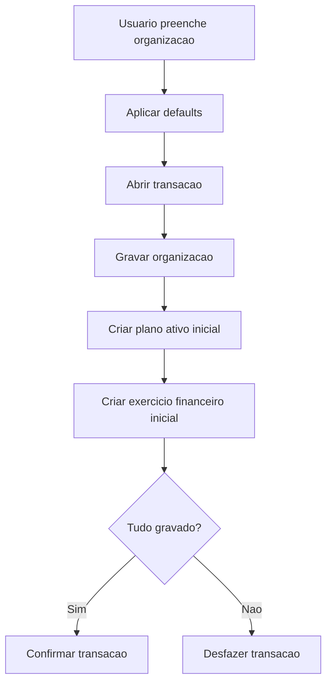
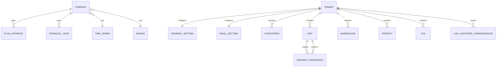

# EF 1 Cadastros Base — Parametros Operacionais V1

## 1. Identificacao

| Item | Valor |
|---|---|
| Sistema | Epros |
| Empresa | Siser |
| Modulo | Cadastros Base |
| Submodulo | Parametros Operacionais |
| Versao | V1 |
| Status | Especificacao funcional para validacao humana |
| Data | 2026-06-06 |

## 2. Objetivo funcional

O submodulo Parametros Operacionais centraliza, por tenant, as configuracoes que governam o comportamento operacional do Epros. Ele mantem dados da organizacao, logotipo, fuso horario, formato de data, moeda padrao, cadastros auxiliares, preferencias operacionais, configuracao de e-mail, interface de impostos, armazens, projetos, categorias, unidades, exercicio financeiro inicial e plano ativo inicial.

Essas configuracoes sao consumidas por estoque, financeiro, vendas, compras, fiscal, relatorios, onboarding, usuarios e demais modulos que dependem de parametros padronizados do tenant.

## 3. Escopo

### 3.1 Dentro do escopo

| Capacidade | Descricao |
|---|---|
| Organizacao | Manter dados operacionais da empresa do tenant, incluindo logo, fuso, moeda e formato de data. |
| Cadastro inicial transacional | Criar organizacao, plano ativo inicial e exercicio financeiro inicial em uma unica transacao. |
| Categorias | Manter categorias de produto/uso operacional. |
| Unidades | Manter unidades de medida. |
| Armazens | Manter armazens com dados basicos de localizacao e contato. |
| Projetos | Manter projetos usados em apropriaçao/lançamentos. |
| Preferencias gerais | Manter flags operacionais do tenant. |
| E-mail | Manter configuracao de envio de e-mail do tenant, como registro unico. |
| Impostos | Manter interface administrativa de impostos: nome, aliquota e situacao. |
| Fusos horarios | Manter lista global de fusos e vinculo da organizacao com fuso. |
| Auditoria de configuracao | Registrar alteracoes de parametros conforme lacunas da MC. |

### 3.2 Fora do escopo

| Tema | Tratamento |
|---|---|
| Calculo tributario sobre transacoes | Pertence ao fiscal/tributario e aos modulos transacionais. |
| Criacao completa do tenant | Pertence ao onboarding. |
| Operacao fisica de armazem | Pertence ao estoque/logistica. |
| Plano comercial completo e cobranca | Pertencem a assinatura, limites e cobranca SaaS. |
| Plano de contas operacional | Pertence ao financeiro. |

## 4. Areas de configuracao

| Area | Funcao |
|---|---|
| Organizacao | Dados cadastrais, logo, fuso, moeda e formato de data. |
| Preferencias | Flags que alteram comportamento operacional. |
| Projetos | Cadastro de projetos para apropriaçao. |
| Armazens | Cadastro basico de armazens. |
| Unidades | Cadastro de unidades de medida. |
| Impostos | Interface de administracao de nome, aliquota e ativo. |
| Categorias | Cadastro de categorias. |
| E-mails | Configuracao de envio de e-mail do tenant. |
| Fusos horarios | Lista global de fusos horarios. |

## 5. Principios funcionais

| Codigo | Regra |
|---|---|
| REG-001 | Toda configuracao operacional deve ser isolada por tenant quando for especifica do cliente. |
| REG-002 | Listagens de cadastros auxiliares devem filtrar pelo tenant corrente. |
| REG-003 | Dados globais, como fusos horarios, podem ser compartilhados quando nao contiverem informacao de tenant. |
| REG-004 | Configuracoes de comportamento financeiro ou estoque devem ser auditaveis. |
| REG-005 | Cadastro inicial da organizacao deve ser transacional. |
| REG-006 | Cadastros auxiliares nao devem ser excluidos quando estiverem em uso. |
| REG-007 | Duplicidade de nome deve ser validada dentro do tenant. |
| REG-008 | Bugs de comportamento identificados devem virar regra correta ou lacuna da MC, nunca regra final errada. |
| REG-009 | Configuracao de e-mail deve ser unica por tenant. |
| REG-010 | Preferencias gerais devem ser unicas por tenant. |

## 6. Regras funcionais detalhadas

### 6.1 Organizacao

| Codigo | Regra |
|---|---|
| REG-011 | A organizacao deve ser consultada pelo tenant corrente. |
| REG-012 | O Epros deve retornar o primeiro registro de organizacao do tenant quando houver consulta de configuracao geral. |
| REG-013 | Ao criar a primeira organizacao, o Epros deve abrir transacao unica. |
| REG-014 | Na criacao inicial, o Epros deve gravar organizacao, plano ativo inicial e exercicio financeiro inicial na mesma transacao. |
| REG-015 | Falha em qualquer parte da criacao inicial deve desfazer toda a transacao. |
| REG-016 | O plano inicial deve ser criado ativo. |
| REG-017 | O plano inicial deve possuir identificador de pedido gerado automaticamente em formato unico. |
| REG-018 | O exercicio financeiro inicial deve iniciar na data de cadastro. |
| REG-019 | O exercicio financeiro inicial deve encerrar 365 dias apos a data de inicio. |
| REG-020 | O campo FiscalYear do exercicio inicial pode nascer vazio, conforme material. |
| REG-021 | Nova organizacao deve assumir fuso horario padrao 1, formato de data `MM-DD-YYYY` e moeda padrao 1. |
| REG-022 | O logotipo deve ser carregado e redimensionado para 300x300 antes da gravacao. |
| REG-023 | Atualizacao de organizacao deve registrar data de modificacao. |
| REG-024 | Mensagem de atualizacao deve indicar atualizacao, nao inclusao. |

### 6.2 Categorias

| Codigo | Regra |
|---|---|
| REG-025 | Categoria pertence ao tenant. |
| REG-026 | Nome da categoria deve ser unico no tenant. |
| REG-027 | Criacao de categoria deve registrar data de inclusao quando informada. |
| REG-028 | Categoria pode possuir imagem quando informada. |
| REG-029 | Categoria em uso por produto nao pode ser excluida. |
| REG-030 | Consulta por id deve considerar tenant. |
| REG-031 | Listagem de categorias deve considerar tenant. |
| REG-032 | Filtro por nome iniciado pode ser aplicado quando disponivel. |

### 6.3 Unidades

| Codigo | Regra |
|---|---|
| REG-033 | Unidade pertence ao tenant. |
| REG-034 | Nome da unidade deve ser unico no tenant. |
| REG-035 | Unidade em uso por produto nao pode ser excluida. |
| REG-036 | Consulta por id deve considerar tenant. |
| REG-037 | Listagem de unidades deve considerar tenant. |
| REG-038 | Unidade deve evoluir para codigo padronizado e conversao quando o Epros exigir padrao internacional. |

### 6.4 Armazens

| Codigo | Regra |
|---|---|
| REG-039 | Armazem pertence ao tenant. |
| REG-040 | Nome do armazem deve ser unico no tenant. |
| REG-041 | Armazem deve registrar nome, pais, cidade, telefone/celular e e-mail quando informados. |
| REG-042 | Consulta por id deve considerar tenant. |
| REG-043 | Listagem de armazens deve considerar tenant. |
| REG-044 | Exclusao de armazem deve verificar vinculos do proprio armazem, nao de outra entidade. |
| REG-045 | Armazem em uso operacional nao deve ser excluido. |

### 6.5 Projetos

| Codigo | Regra |
|---|---|
| REG-046 | Projeto pertence ao tenant. |
| REG-047 | Nome do projeto deve ser unico no tenant. |
| REG-048 | Projeto vinculado a lancamentos contabeis nao pode ser excluido. |
| REG-049 | Consulta por id deve considerar tenant. |
| REG-050 | Listagem de projetos deve considerar tenant. |
| REG-051 | Mensagem de conflito de projeto deve citar projeto, nao categoria. |

### 6.6 Preferencias gerais

| Codigo | Regra |
|---|---|
| REG-052 | Preferencias gerais devem ser registro unico por tenant. |
| REG-053 | Preferencias de tenant novo devem habilitar caixa negativo e estoque negativo por padrao, conforme material. |
| REG-054 | Preferencias devem controlar exibicao de moeda. |
| REG-055 | Preferencias devem controlar permissao de caixa negativo. |
| REG-056 | Preferencias devem controlar permissao de estoque negativo. |
| REG-057 | Preferencias devem controlar modo de calculo de estoque. |
| REG-058 | Preferencias devem controlar limite de credito. |
| REG-059 | Preferencias devem controlar desconto. |
| REG-060 | Preferencias devem controlar imposto na compra. |
| REG-061 | Preferencias devem controlar imposto na venda. |
| REG-062 | Alteracao de flags financeiras ou de estoque deve ser auditavel. |
| REG-063 | Modo de calculo de estoque deve ser consumido pelo modulo de estoque. |
| REG-064 | Caixa negativo deve ser consumido pelo financeiro/contabilidade. |

### 6.7 E-mail

| Codigo | Regra |
|---|---|
| REG-065 | Configuracao de e-mail deve ser registro unico por tenant. |
| REG-066 | Configuracao deve armazenar host, porta, usuario, senha e e-mail remetente quando informados. |
| REG-067 | Insercao e atualizacao devem manter o tenant. |
| REG-068 | Teste de conexao e suporte a autenticacao moderna ficam na MC. |
| REG-069 | Senha de e-mail deve ser protegida e nao exposta em resposta ou tela. |

### 6.8 Impostos

| Codigo | Regra |
|---|---|
| REG-070 | Interface de impostos administra nome, aliquota e situacao ativa. |
| REG-071 | Nome de imposto deve ser unico no tenant. |
| REG-072 | Imposto vinculado a transacoes nao pode ser excluido. |
| REG-073 | O calculo tributario sobre transacoes nao pertence a este submodulo. |
| REG-074 | A persistencia tributaria transacional pertence ao modulo fiscal/tributario ou ao modulo transacional dono. |

### 6.9 Fusos horarios

| Codigo | Regra |
|---|---|
| REG-075 | Lista de fusos horarios e global. |
| REG-076 | Organizacao referencia um fuso horario. |
| REG-077 | Fuso em uso por organizacao nao pode ser excluido. |
| REG-078 | Fuso horario deve evoluir para identificador IANA quando requerido por padrao internacional. |

## 7. Fluxos funcionais

### 7.1 Cadastro inicial da organizacao

### 7.2 Manutencao de cadastro auxiliar

| Passo | Acao | Resultado |
|---:|---|---|
| 1 | Abrir painel auxiliar | Carrega itens do tenant. |
| 2 | Criar ou alterar item | Valida nome unico no tenant. |
| 3 | Excluir item | Verifica vinculo operacional. |
| 4 | Confirmar | Grava, bloqueia ou exibe mensagem correta. |

### 7.3 Alteracao de preferencias

| Passo | Acao | Resultado |
|---:|---|---|
| 1 | Abrir painel de preferencias | Carrega registro unico do tenant. |
| 2 | Alterar flags | Campos ficam pendentes para salvar. |
| 3 | Salvar | Atualiza registro e deve gerar auditoria. |
| 4 | Consumir preferencias | Estoque, financeiro, vendas e compras passam a usar novos parametros conforme vigencia. |

## 8. Telas e experiencia

| Tela/Painel | Rota funcional | Conteudo |
|---|---|---|
| Hub de configuracao | `/app/setting` | Painel central de parametros do tenant. |
| Organizacao | Painel do hub | Dados da empresa, logo, fuso, moeda e formato de data. |
| Preferencias | Painel do hub | Flags operacionais. |
| Projetos | Painel do hub e rota dedicada | CRUD de projetos. |
| Armazens | Painel do hub | CRUD de armazens. |
| Unidades | Painel do hub | CRUD de unidades. |
| Impostos | Painel do hub | CRUD visual de nome, aliquota e ativo. |
| Categorias | Painel do hub e rota dedicada | CRUD de categorias. |
| E-mails | Painel do hub | Configuracao de e-mail. |

## 9. APIs funcionais

| Metodo | Rota funcional | Resultado |
|---|---|---|
| GET | `configuracoes/empresa` | Retorna organizacao do tenant. |
| POST | `configuracoes/empresa` | Cria organizacao inicial com plano e exercicio. |
| PUT | `configuracoes/empresa` | Atualiza organizacao. |
| PUT | `configuracoes/empresa/logo` | Atualiza logotipo redimensionado. |
| GET | `configuracoes/categorias` | Lista categorias do tenant. |
| POST | `configuracoes/categorias` | Cria categoria. |
| PUT | `configuracoes/categorias/{id}` | Atualiza categoria. |
| DELETE | `configuracoes/categorias/{id}` | Exclui categoria quando nao estiver em uso. |
| GET | `configuracoes/unidades` | Lista unidades do tenant. |
| POST | `configuracoes/unidades` | Cria unidade. |
| PUT | `configuracoes/unidades/{id}` | Atualiza unidade. |
| DELETE | `configuracoes/unidades/{id}` | Exclui unidade quando nao estiver em uso. |
| GET | `configuracoes/armazens` | Lista armazens do tenant. |
| POST | `configuracoes/armazens` | Cria armazem. |
| PUT | `configuracoes/armazens/{id}` | Atualiza armazem. |
| DELETE | `configuracoes/armazens/{id}` | Exclui armazem quando nao estiver em uso. |
| GET | `configuracoes/projetos` | Lista projetos do tenant. |
| POST | `configuracoes/projetos` | Cria projeto. |
| PUT | `configuracoes/projetos/{id}` | Atualiza projeto. |
| DELETE | `configuracoes/projetos/{id}` | Exclui projeto quando nao estiver em uso. |
| GET | `configuracoes/preferencias` | Retorna registro unico de preferencias. |
| PUT | `configuracoes/preferencias` | Atualiza preferencias. |
| GET | `configuracoes/email` | Retorna configuracao de e-mail. |
| PUT | `configuracoes/email` | Atualiza configuracao de e-mail. |
| GET | `configuracoes/impostos` | Lista impostos administrativos. |
| POST | `configuracoes/impostos` | Cria imposto administrativo. |
| PUT | `configuracoes/impostos/{id}` | Atualiza imposto administrativo. |
| DELETE | `configuracoes/impostos/{id}` | Exclui imposto quando nao estiver vinculado. |
| GET | `configuracoes/fusos` | Lista fusos horarios globais. |

## 10. Enumeracoes e dominios

### 10.1 Modo de calculo de estoque

| Valor | Descricao |
|---|---|
| CustoMedio | Custo medio ponderado. |
| FIFO | Primeiro a entrar, primeiro a sair. |
| Ultimo | Ultimo custo. |

### 10.2 Formato de data

| Valor | Descricao |
|---|---|
| MM-DD-YYYY | Mes-dia-ano; default informado. |
| DD-MM-YYYY | Dia-mes-ano. |
| YYYY-MM-DD | Ano-mes-dia. |

## 11. Modelo de dados funcional e implantavel

### 11.1 Visao conceitual

O modelo de Parametros Operacionais organiza:

1. Organizacao: `company`.
2. Plano e exercicio inicial: `plan_upgrade`, `financial_year`.
3. Cadastros auxiliares: `categories`, `unit`, `warehouse`, `project`.
4. Preferencias: `general_setting`.
5. E-mail: `email_setting`.
6. Impostos administrativos: `tax`.
7. Fusos horarios: `time_zones`.
8. Governanca internacional: `log_auditoria_configuracao`, `moeda`, `unidade_conversao`.

### 11.2 Entidades implantaveis

| Entidade | Tipo | Responsabilidade | Tenant | Observacao |
|---|---|---|---|---|
| `company` | Configuracao principal | Organizacao do tenant. | Sim | Registro principal de parametros. |
| `plan_upgrade` | Movimento/configuracao inicial | Plano ativo inicial do tenant. | Sim | Plano completo pertence a assinatura/limites. |
| `financial_year` | Periodo fiscal | Exercicio financeiro inicial. | Sim | Gestao completa pertence ao financeiro. |
| `categories` | Cadastro auxiliar | Categorias operacionais. | Sim | Consumida por produtos. |
| `unit` | Cadastro auxiliar | Unidades de medida. | Sim | Evolui para padrao internacional. |
| `warehouse` | Cadastro auxiliar | Armazens basicos. | Sim | Operacao fica no estoque. |
| `project` | Cadastro auxiliar | Projetos para apropriacao. | Sim | Integracao com contabilidade/projetos. |
| `general_setting` | Preferencias | Flags operacionais do tenant. | Sim | Registro unico. |
| `email_setting` | Configuracao | Envio de e-mail do tenant. | Sim | Registro unico. |
| `tax` | Configuracao administrativa | Nome, aliquota e ativo. | Sim | Calculo fica fora. |
| `time_zones` | Catalogo global | Fusos horarios. | Global | Referenciado por company. |
| `log_auditoria_configuracao` | Auditoria | Alteracoes de parametros. | Sim | Necessario para padrao internacional. |
| `moeda` | Catalogo internacional | Moedas e casas decimais. | Global | Necessario para multi-moeda. |
| `unidade_conversao` | Conversao | Conversao entre unidades. | Sim/global a definir | Necessario para padrao internacional. |

### 11.3 Relacionamentos

| Relacionamento | Cardinalidade | Regra |
|---|---|---|
| `company` -> `time_zones` | N:1 | Organizacao referencia fuso. |
| `company` -> `moeda` | N:1 | Organizacao referencia moeda padrao. |
| `company` -> `plan_upgrade` | 1:N | Criacao inicial gera plano ativo. |
| `company` -> `financial_year` | 1:N | Criacao inicial gera exercicio. |
| `categories` -> `produto` | 1:N | Categoria em uso por produto nao pode ser excluida. |
| `unit` -> `produto` | 1:N | Unidade em uso por produto nao pode ser excluida. |
| `warehouse` -> `estoque` | 1:N | Armazem em uso operacional nao pode ser excluido. |
| `project` -> `lancamento_contabil` | 1:N | Projeto em uso contabil nao pode ser excluido. |
| `general_setting` -> `tenant` | 1:1 | Preferencias unicas por tenant. |
| `email_setting` -> `tenant` | 1:1 | Configuracao de e-mail unica por tenant. |
| `tax` -> `transacao` | 1:N | Imposto vinculado nao pode ser excluido. |

### 11.4 Chaves e unicidades

| Entidade | Restricao | Campos | Objetivo | Status |
|---|---|---|---|---|
| `company` | Indice tenant | TenantId | Consultar organizacao do tenant. | Informado. |
| `categories` | Unico funcional | TenantId + CategoryName | Evitar categoria duplicada. | Necessario. |
| `unit` | Unico funcional | TenantId + UnitName | Evitar unidade duplicada. | Necessario. |
| `warehouse` | Unico funcional | TenantId + Name | Evitar armazem duplicado. | Necessario. |
| `project` | Unico funcional | TenantId + ProjectName | Evitar projeto duplicado. | Necessario. |
| `general_setting` | Unico funcional | TenantId | Garantir registro unico. | Necessario. |
| `email_setting` | Unico funcional | TenantId | Garantir registro unico. | Necessario. |
| `tax` | Unico funcional | TenantId + TaxName | Evitar imposto duplicado. | Necessario. |
| `time_zones` | PK global | TimeZoneId | Catalogo global. | Informado. |

### 11.5 Diagrama logico funcional

## 12. Dicionario de dados implantavel

### 12.1 `company`

| Campo | Tipo/formato | Tamanho/dominio | Obrigatorio | Chave/relacionamento | Regra/observacao |
|---|---|---|---|---|---|
| Id | uuid | Nao informado no material | Sim | PK | Identificador. |
| TenantId | uuid/varchar | Nao informado no material | Sim | Indice tenant | Isolamento. |
| Nome | string | Nao informado no material | Sim |  | Nome da organizacao. |
| RazaoSocial | string | Nao informado no material | Sim |  | Razao social quando usada. |
| Logo | string | base64/url | Nao |  | Redimensionado para 300x300. |
| TimeZoneId | int | default 1 | Sim | FK `time_zones.TimeZoneId` | Fuso da organizacao. |
| DateFormat | string | MM-DD-YYYY, DD-MM-YYYY, YYYY-MM-DD | Sim |  | Default MM-DD-YYYY. |
| CurrencyId | int | default 1 | Sim | FK moeda | Moeda padrao. |
| DataCriacao | datetime | Nao informado no material | Sim |  | Auditoria. |
| DataModificacao | datetime | Nao informado no material | Nao |  | Atualizacao. |

### 12.2 `plan_upgrade`

| Campo | Tipo/formato | Tamanho/dominio | Obrigatorio | Chave/relacionamento | Regra/observacao |
|---|---|---|---|---|---|
| Id | uuid | Nao informado no material | Sim | PK | Identificador. |
| TenantId | uuid/varchar | Nao informado no material | Sim | Indice tenant | Isolamento. |
| PlanId | int | default inicial 1 | Sim | FK plano | Plano inicial. |
| IsActive | booleano | true/false | Sim |  | True na criacao inicial. |
| OrderNo | guid/string | Formato unico | Sim |  | Gerado automaticamente. |

### 12.3 `financial_year`

| Campo | Tipo/formato | Tamanho/dominio | Obrigatorio | Chave/relacionamento | Regra/observacao |
|---|---|---|---|---|---|
| Id | uuid | Nao informado no material | Sim | PK | Identificador. |
| TenantId | uuid/varchar | Nao informado no material | Sim | Indice tenant | Isolamento. |
| FromDate | date | Data inicial | Sim |  | Data de cadastro. |
| ToDate | date | FromDate + 365 dias | Sim |  | Fim inicial. |
| FiscalYear | string | Pode nascer vazio | Nao |  | Campo vazio na criacao inicial. |
| Status | enum/string | Aberto, Fechado | Nao informado no material |  | Lacuna de padrao internacional. |

### 12.4 `categories`

| Campo | Tipo/formato | Tamanho/dominio | Obrigatorio | Chave/relacionamento | Regra/observacao |
|---|---|---|---|---|---|
| CategoriesId | uuid | Nao informado no material | Sim | PK | Identificador. |
| TenantId | uuid/varchar | Nao informado no material | Sim | Indice tenant | Isolamento. |
| CategoryName | string | Nao informado no material | Sim | Unico por tenant | Nome da categoria. |
| AddedDate | datetime | Nao informado no material | Nao |  | Data de inclusao. |
| Image | string | Nao informado no material | Nao |  | Imagem opcional. |

### 12.5 `unit`

| Campo | Tipo/formato | Tamanho/dominio | Obrigatorio | Chave/relacionamento | Regra/observacao |
|---|---|---|---|---|---|
| UnitId | uuid | Nao informado no material | Sim | PK | Identificador. |
| TenantId | uuid/varchar | Nao informado no material | Sim | Indice tenant | Isolamento. |
| UnitName | string | Nao informado no material | Sim | Unico por tenant | Nome da unidade. |
| CodigoUNECE | string | Nao informado no material | Nao informado no material |  | Lacuna internacional. |

### 12.6 `warehouse`

| Campo | Tipo/formato | Tamanho/dominio | Obrigatorio | Chave/relacionamento | Regra/observacao |
|---|---|---|---|---|---|
| WarehouseId | uuid | Nao informado no material | Sim | PK | Identificador. |
| TenantId | uuid/varchar | Nao informado no material | Sim | Indice tenant | Isolamento. |
| Name | string | Nao informado no material | Sim | Unico por tenant | Nome do armazem. |
| Country | string | Nao informado no material | Nao |  | Pais. |
| City | string | Nao informado no material | Nao |  | Cidade. |
| Mobile | string | Nao informado no material | Nao |  | Telefone/celular. |
| Email | string | Nao informado no material | Nao |  | E-mail. |

### 12.7 `project`

| Campo | Tipo/formato | Tamanho/dominio | Obrigatorio | Chave/relacionamento | Regra/observacao |
|---|---|---|---|---|---|
| ProjectId | uuid | Nao informado no material | Sim | PK | Identificador. |
| TenantId | uuid/varchar | Nao informado no material | Sim | Indice tenant | Isolamento. |
| ProjectName | string | Nao informado no material | Sim | Unico por tenant | Nome do projeto. |

### 12.8 `general_setting`

| Campo | Tipo/formato | Tamanho/dominio | Obrigatorio | Chave/relacionamento | Regra/observacao |
|---|---|---|---|---|---|
| Id | uuid | Nao informado no material | Sim | PK | Identificador. |
| TenantId | uuid/varchar | Nao informado no material | Sim | Unico por tenant | Registro unico. |
| ShowCurrency | booleano | true/false | Sim |  | Exibir moeda. |
| NegativeCash | booleano | true/false; default true | Sim |  | Permite caixa negativo. |
| NegativeStock | booleano | true/false; default true | Sim |  | Permite estoque negativo. |
| StockCalculationMode | enum/bool | CustoMedio, FIFO, Ultimo; material tambem indica flag | Sim |  | Modo de calculo de estoque. |
| CreditLimit | booleano | true/false | Sim |  | Limite de credito. |
| Discount | booleano | true/false | Sim |  | Desconto. |
| VatOnPurchase | booleano | true/false | Sim |  | Imposto na compra. |
| VatOnSales | booleano | true/false | Sim |  | Imposto na venda. |
| VigenciaInicio | date/datetime | Nao informado no material | Nao informado no material |  | Lacuna de efetividade temporal. |
| VigenciaFim | date/datetime | Nao informado no material | Nao informado no material |  | Lacuna de efetividade temporal. |

### 12.9 `email_setting`

| Campo | Tipo/formato | Tamanho/dominio | Obrigatorio | Chave/relacionamento | Regra/observacao |
|---|---|---|---|---|---|
| Id | uuid | Nao informado no material | Sim | PK | Identificador. |
| TenantId | uuid/varchar | Nao informado no material | Sim | Unico por tenant | Registro unico. |
| Host | string | Nao informado no material | Condicional |  | Servidor. |
| Port | string/int | Nao informado no material | Condicional |  | Porta. |
| Username | string | Nao informado no material | Condicional |  | Usuario. |
| Password | string | Nao informado no material | Condicional |  | Segredo; deve ser protegido. |
| FromEmail | string | Nao informado no material | Condicional |  | Remetente. |

### 12.10 `tax`

| Campo | Tipo/formato | Tamanho/dominio | Obrigatorio | Chave/relacionamento | Regra/observacao |
|---|---|---|---|---|---|
| TaxId | uuid | Nao informado no material | Sim | PK | Identificador. |
| TenantId | uuid/varchar | Nao informado no material | Sim | Indice tenant | Isolamento. |
| TaxName | string | Nao informado no material | Sim | Unico por tenant | Nome do imposto. |
| Rate | decimal | Nao informado no material | Sim |  | Aliquota. |
| IsActive | booleano | true/false | Sim |  | Situacao. |
| VigenciaInicio | date/datetime | Nao informado no material | Nao informado no material |  | Lacuna de efetividade temporal. |
| VigenciaFim | date/datetime | Nao informado no material | Nao informado no material |  | Lacuna de efetividade temporal. |

### 12.11 `time_zones`

| Campo | Tipo/formato | Tamanho/dominio | Obrigatorio | Chave/relacionamento | Regra/observacao |
|---|---|---|---|---|---|
| TimeZoneId | int | Nao informado no material | Sim | PK | Identificador global. |
| Nome | string | Nao informado no material | Sim |  | Nome do fuso. |
| Offset | string | Nao informado no material | Sim |  | Deslocamento. |
| CodigoIANA | string | Nao informado no material | Nao informado no material |  | Lacuna internacional. |

### 12.12 `log_auditoria_configuracao`

| Campo | Tipo/formato | Tamanho/dominio | Obrigatorio | Chave/relacionamento | Regra/observacao |
|---|---|---|---|---|---|
| Id | uuid | Nao informado no material | Sim | PK | Identificador. |
| TenantId | uuid/varchar | Nao informado no material | Sim | Indice tenant | Isolamento. |
| Entidade | string | Nao informado no material | Sim |  | Entidade alterada. |
| RegistroId | uuid | Nao informado no material | Sim |  | Registro alterado. |
| Campo | string | Nao informado no material | Sim |  | Campo alterado. |
| ValorAnterior | string | Nao informado no material | Nao |  | Valor anterior. |
| ValorNovo | string | Nao informado no material | Nao |  | Valor novo. |
| UsuarioId | uuid | Nao informado no material | Sim | FK usuario | Responsavel. |
| DataHora | datetime | Nao informado no material | Sim |  | Momento da alteracao. |
| Justificativa | texto | Nao informado no material | Condicional |  | Obrigatoria para flags financeiras. |

### 12.13 `moeda`

| Campo | Tipo/formato | Tamanho/dominio | Obrigatorio | Chave/relacionamento | Regra/observacao |
|---|---|---|---|---|---|
| Id | uuid/int | Nao informado no material | Sim | PK | Identificador. |
| CodigoISO | string | 3 | Sim | Unico funcional | Codigo monetario. |
| Simbolo | string | Nao informado no material | Sim |  | Simbolo. |
| CasasDecimais | int | Nao informado no material | Sim |  | Precisao. |

### 12.14 `unidade_conversao`

| Campo | Tipo/formato | Tamanho/dominio | Obrigatorio | Chave/relacionamento | Regra/observacao |
|---|---|---|---|---|---|
| Id | uuid | Nao informado no material | Sim | PK | Identificador. |
| UnidadeOrigemId | uuid | Nao informado no material | Sim | FK `unit.UnitId` | Unidade origem. |
| UnidadeDestinoId | uuid | Nao informado no material | Sim | FK `unit.UnitId` | Unidade destino. |
| Fator | decimal | Nao informado no material | Sim |  | Fator de conversao. |

## 13. Mensagens e validacoes

| Situacao | Resultado esperado |
|---|---|
| Nome duplicado em categoria | Bloquear duplicidade no tenant. |
| Nome duplicado em unidade | Bloquear duplicidade no tenant. |
| Nome duplicado em armazem | Bloquear duplicidade no tenant. |
| Nome duplicado em projeto | Bloquear com mensagem propria de projeto. |
| Nome duplicado em imposto | Bloquear duplicidade no tenant. |
| Categoria em uso | Bloquear exclusao. |
| Unidade em uso | Bloquear exclusao. |
| Projeto em uso contabil | Bloquear exclusao. |
| Armazem em uso | Bloquear exclusao. |
| Fuso em uso | Bloquear exclusao. |
| Imposto em transacao | Bloquear exclusao. |
| Atualizacao de organizacao | Informar atualizacao com mensagem correta. |

## 14. Auditoria, seguranca e privacidade

| Tema | Regra |
|---|---|
| Tenant | Todas as listagens tenantizadas devem filtrar TenantId. |
| E-mail | Senha e credenciais de envio devem ser armazenadas como segredo. |
| Preferencias financeiras | Alteracoes exigem auditoria e justificativa. |
| Preferencias de estoque | Alteracoes devem ser rastreadas por impacto operacional. |
| Impostos | Alteracoes de aliquota devem ter vigencia e auditoria, conforme MC. |
| Logo | Arquivo deve ser validado e redimensionado. |
| SMTP | Teste de conexao e seguranca ficam como lacuna P1. |

## 15. Cenarios de validacao

| ID | Cenario | Resultado esperado |
|---|---|---|
| CT-001 | Criar primeira organizacao | Organizacao, plano inicial e exercicio inicial criados juntos. |
| CT-002 | Falha ao criar plano inicial | Toda transacao e desfeita. |
| CT-003 | Excluir categoria em uso | Bloqueia. |
| CT-004 | Excluir unidade em uso | Bloqueia. |
| CT-005 | Excluir projeto com lancamento | Bloqueia. |
| CT-006 | Excluir armazem em uso | Bloqueia verificando armazem. |
| CT-007 | Criar unidade com nome duplicado | Bloqueia duplicidade no tenant. |
| CT-008 | Excluir fuso em uso por organizacao | Bloqueia. |
| CT-009 | Excluir imposto vinculado a transacao | Bloqueia. |
| CT-010 | Listagem cross-tenant | Nao retorna dados de outro tenant. |
| CT-011 | Atualizar organizacao | Mensagem indica atualizacao. |
| CT-012 | Alterar flag de caixa negativo | Gera auditoria. |

## 16. Interligacoes

| Modulo/submodulo | Relacao |
|---|---|
| Geografia e Localizacao | Fornece municipio, UF, pais e fuso para organizacao e armazem. |
| Pessoa e Organizacao | Consome organizacao, empresa emitente e parametros cadastrais. |
| Onboarding e Empresa | Cria tenant e pode disparar parametros iniciais. |
| Assinatura e Limites | Governam plano comercial; este submodulo apenas cria referencia inicial. |
| Estoque | Consome unidade, armazem, estoque negativo e modo de calculo. |
| Financeiro/Contabilidade | Consome caixa negativo, projetos e exercicio financeiro. |
| Vendas e Compras | Consomem categorias, unidades, impostos administrativos e preferencias. |
| Fiscal/Tributario | Assume calculo tributario e regras fiscais de imposto. |
| Relatorios | Consome parametros para exibicao, moeda, data, fuso e filtros. |

## 17. Notas de rodape

1. `log_auditoria_configuracao`, `moeda` e `unidade_conversao` foram estruturadas a partir dos gaps internacionais do material para tornar a especificacao implantavel em padrao internacional.
2. A regra de exclusao de armazem foi especificada como comportamento correto do Epros, pois o material identificou comportamento incorreto envolvendo outra entidade.
