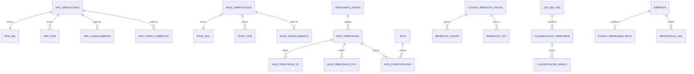

# Especificacao Funcional - Epros

**Projeto:** Epros  
**Empresa:** Siser  
**Tipo de documento:** Especificacao Funcional definitiva  
**Versao:** V1  
**Modulo:** PLATAFORMA_COMPARTILHADA  
**Submodulo:** FATURAMENTO_FISCAL_ELETRONICO  
**Status:** Em revisao  
**Ultima atualizacao:** 2026-06-06

## 1. Controle do documento

| Item | Conteudo |
|---|---|
| Responsavel pela elaboracao | Analise funcional assistida |
| Responsavel pela validacao funcional | Siser |
| Responsavel pela validacao tecnica | Siser |
| Area dona do processo | Fiscal, Vendas, Compras, Cadastros, Plataforma |
| Publico-alvo | Produto, negocio, implantacao, desenvolvimento, suporte, operacao |
| Fonte de verdade | Esta EF e a fonte funcional definitiva do submodulo |

## 2. Objetivo funcional

O submodulo Faturamento Fiscal Eletronico centraliza no Epros a emissao, transmissao, consulta, download, cancelamento, carta de correcao, inutilizacao, importacao e disponibilizacao de documentos fiscais eletronicos, bem como os cadastros fiscais necessarios para calcular e validar a emissao.

| Pergunta | Resposta |
|---|---|
| Para que o submodulo existe? | Para operar documentos fiscais eletronicos e manter a parametrizacao fiscal usada por vendas, compras, PDV e contador. |
| Que problema de negocio resolve? | Garante emissao fiscal, armazenamento de XML/PDF, consulta por periodo, calculo tributario, importacao XML e governanca de configuracoes fiscais por tenant e empresa. |
| Qual resultado operacional deve produzir? | Documentos autorizados, rejeitados, cancelados, inutilizados ou importados com status claro, XML/PDF armazenados, regras tributarias aplicadas e consultas disponiveis para operacao e contabilidade. |
| Quais areas dependem dele? | Vendas, Compras, Estoque, Financeiro, Cadastros Base, Plataforma Compartilhada, Relatorios, PDV e Suporte. |

## 3. Escopo funcional

### 3.1 Dentro do escopo

| Capacidade | Descricao | Observacao |
|---|---|---|
| Emissao NF-e | Emite NF-e simplificada e completa, gera DANFE previa e DANFE autorizada, consulta protocolo, trata autorizacao e rejeicao. | Modelo 55. |
| Emissao NFC-e | Emite NFC-e para venda e PDV, valida regras fiscais do item e disponibiliza DANFCE/XML. | Modelo 65. |
| NFS-e | Emite lote, consulta lote, consulta por RPS e cancela NFS-e. | Parametros municipais ainda exigem completude na MC. |
| Eventos fiscais | Cancela documentos autorizados, registra XML/PDF de cancelamento, emite carta de correcao e inutiliza faixa numerica. | Inclui tratamento de duplicidade quando material informa. |
| XML e documentos do contador | Lista documentos por referencia mensal e gera ZIP com XML e opcionalmente PDF. | Consulta por emitente/destinatario, mes e ano. |
| Importacao XML | Recebe XML ou ZIP de XML de saida, valida emitente, controla status de importacao, cadastro e geracao de PDF. | Integracao com compras, estoque e financeiro depende de regras finais. |
| Certificado digital fiscal | Recebe certificado da empresa, valida validade e disponibiliza para transmissao fiscal. | O cadastro mestre do certificado pertence a cadastro/empresa. |
| Cadastros fiscais | Mantem CFOP, CFOP padrao, NCM, regras de tributacao por grupo, CEST, ANP, IPI, FCP, ICMS interestadual, beneficio fiscal, observacao NF-e e classificacao IBS/CBS. | Parametrizacao consumida pela emissao. |
| Motor de calculo fiscal | Valida CFOP, CST, CSOSN, PIS, COFINS, IPI, IBS/CBS, ISS, IBPT e rateios por item. | Sem tabela propria quando executado em memoria. |
| IBPT | Calcula valor aproximado de tributos por NCM/UF/base/origem e mantem aliquotas por NCM/UF. | Atualizacao em lote precisa governanca. |
| Catalogos e enums fiscais | Disponibiliza dominios funcionais de modelo de documento, ambiente, regime, UF, finalidade, atendimento, frete, movimento, CST, CSOSN e demais codigos. | Usado em telas e APIs. |

### 3.2 Fora do escopo

| Item fora do escopo | Motivo | Destino correto |
|---|---|---|
| Cadastro completo de empresa, pessoa, endereco e certificado mestre | Sao cadastros corporativos compartilhados. | CADASTROS_BASE / PESSOA_E_ORGANIZACAO |
| Pedido de venda, pedido de compra, recebimento fisico e estoque | Sao fatos geradores e efeitos operacionais. | VENDAS, COMPRAS, ESTOQUE |
| Geracao de contas a receber e contas a pagar | Sao efeitos financeiros de documentos autorizados ou recebidos. | FINANCEIRO |
| Escrituracao fiscal, SPED, Sintegra e apuracao tributaria | Obrigacoes fiscais periodicas nao estao fechadas como emissao DFe neste submodulo. | MC e modulo fiscal/relatorios a definir |
| Motor municipal completo de NFS-e por municipio/provedor | O material tem emissao, consulta e cancelamento, mas nao traz matriz municipal exaustiva. | MC deste submodulo |

## 4. Glossario e conceitos funcionais

| Termo | Definicao funcional | Observacoes |
|---|---|---|
| DFe | Documento Fiscal Eletronico. | Abrange NF-e, NFC-e, NFS-e e eventos fiscais citados no material. |
| NF-e | Nota Fiscal Eletronica. | Modelo 55. |
| NFC-e | Nota Fiscal de Consumidor Eletronica. | Modelo 65. |
| NFS-e | Nota Fiscal de Servico Eletronica. | Emissao municipal por provedor. |
| DANFE/DANFCE | Documento auxiliar em PDF ou impressao. | Gerado antes ou apos autorizacao conforme capacidade. |
| XML autorizado | Arquivo XML com protocolo/autorizacao fiscal. | Deve ser armazenado e baixavel. |
| XML de envio | Arquivo XML enviado antes do retorno fiscal. | Baixavel por vinculo interno quando informado. |
| Carta de correcao | Evento de correcao de NF-e autorizado pela autoridade fiscal. | Possui sequencia de evento e texto de correcao. |
| Inutilizacao | Evento que inutiliza faixa numerica nao usada. | Exige ambiente, UF, serie, numero inicial e final. |
| Status fiscal | Situacao funcional do documento no Epros. | Recebido, Autorizado, Rejeitado, Cancelado. |
| Status de processamento | Situacao de rotinas de importacao/processamento. | NaoProcessado, Processando, Finalizado, Erro. |
| CFOP | Codigo fiscal de operacao. | Parametriza natureza da operacao. |
| NCM | Codigo fiscal de mercadoria. | Usado em tributacao e IBPT. |
| CSOSN/CST | Codigos de situacao tributaria. | Dominios fiscais de validacao. |
| IBPT | Aliquotas aproximadas por NCM/UF. | Usado no calculo de tributos aproximados. |
| Tributario grupo | Grupo de regras fiscais usado por empresa/produtos. | Liga empresa, NCM e regras tributarias. |

## 5. Atores, papeis e responsabilidades

| Ator/Papel | Responsabilidade | Permissoes esperadas | Restricoes |
|---|---|---|---|
| Operador fiscal | Emitir, consultar, baixar XML/PDF, importar XML, acompanhar rejeicoes. | Criar, consultar, baixar, retransmitir quando permitido. | Nao altera parametros criticos sem permissao. |
| Gestor fiscal | Parametrizar CFOP, NCM, regras, beneficios, observacoes e configuracao de impressao. | CRUD em cadastros fiscais e autorizacao de ajustes. | Deve respeitar tenant e empresa. |
| Operador de vendas/PDV | Emitir NFC-e/NF-e a partir da venda e consultar transmissao. | Emissao e downloads ligados a sua operacao. | Nao altera cadastros fiscais mestres. |
| Operador de compras | Importar XML, emitir documento de entrada quando aplicavel e consultar XML de compra. | Upload/consulta ligada a empresa. | Validacao de emitente/destinatario obrigatoria. |
| Contador | Baixar pacote mensal de XML/PDF e consultar documentos. | Consulta e download mensal. | Sem manutencao de regras fiscais, salvo permissao explicita. |
| Administrador Siser | Configurar tenants fiscais, dominios, tokens e integracoes fiscais. | Administracao tecnica e operacional do servico fiscal. | Acesso auditado. |
| Integracao fiscal | Transmitir documentos, consultar status, baixar XML/PDF e atualizar cadastros. | Uso por contrato autenticado. | Deve respeitar token, tenant e escopo. |

## 6. Visao operacional do submodulo

1. A empresa e seus parametros fiscais devem estar cadastrados, incluindo ambiente, series, proximos numeros, CSC de NFC-e, regime tributario, UF e certificado digital valido.
2. O usuario ou processo de vendas/compras envia uma solicitacao de emissao, inutilizacao, consulta, download ou importacao XML.
3. O Epros valida tenant, empresa, permissao, dados fiscais, documento, ambiente, regras do item, CFOP, CST, CSOSN, NCM, regime tributario e certificado.
4. O motor fiscal calcula ou valida impostos, rateios e totais aplicaveis.
5. O Epros transmite o documento ou evento para a autoridade fiscal, registra retorno, status, protocolo, chave, XML, PDF, rejeicao ou erro.
6. O documento fica disponivel para download, consulta por periodo, pacote mensal do contador, integracao com venda/compra e analise operacional.
7. Rejeicoes, falhas de certificado, duplicidade de evento, arquivo nao localizado e lacunas de seguranca devem ser tratadas sem perda do historico.

## 7. Capacidades funcionais

### 7.1 Parametrizacao fiscal da empresa

| Item | Especificacao |
|---|---|
| Objetivo | Manter os parametros necessarios para emissao NF-e/NFC-e por empresa. |
| Acionamento | Manual por usuario autorizado ou integracao administrativa. |
| Pre-condicoes | Empresa existente, tenant identificado e usuario autorizado. |
| Dados de entrada | Descricao, ambiente NF-e, ambiente NFC-e, serie/proximo numero, CSC/ID CSC quando NFC-e, tag de produto, certificado vinculado. |
| Processamento | Validar obrigatoriedade, tamanhos e campos de producao quando ambiente for producao. |
| Resultado esperado | Empresa apta ou bloqueada para emissao conforme completude. |
| Pos-condicoes | Parametros versionados e auditados. |
| Excecoes | Empresa inexistente, certificado inexistente, campos obrigatorios ausentes ou numeracao zero. |
| Auditoria | Usuario, data/hora, empresa, parametros alterados e motivo quando houver. |

### 7.2 Emissao de NF-e e NFC-e

| Item | Especificacao |
|---|---|
| Objetivo | Transmitir NF-e/NFC-e e registrar retorno fiscal no Epros. |
| Acionamento | Manual pela tela de emissao, por PDV, por venda, por compra ou por integracao interna. |
| Pre-condicoes | Empresa parametrizada, certificado valido, itens validos, destinatario/emitente validos, regra fiscal aplicavel. |
| Dados de entrada | Emitente, destinatario, itens, pagamentos, transporte, totais, ambiente, serie, numero, modelo, finalidade e informacoes fiscais. |
| Processamento | Converter dados em documento fiscal, validar regras, calcular impostos e rateios, transmitir, persistir XML/PDF/status. |
| Resultado esperado | Documento autorizado, rejeitado ou recebido com erro funcional detalhado. |
| Pos-condicoes | Chave, protocolo, XML, PDF, status e vinculo externo gravados quando autorizados. |
| Excecoes | Rejeicao fiscal, certificado invalido, falha de arquivo, chave invalida, documento nao localizado, erro de validacao. |
| Auditoria | Payload recebido, status, codigo e motivo fiscal, protocolo, usuario/processo, IP e correlacao com venda/compra. |

### 7.3 Cancelamento, carta de correcao e inutilizacao

| Item | Especificacao |
|---|---|
| Objetivo | Registrar eventos fiscais posteriores ao documento ou faixa numerica. |
| Acionamento | Manual por usuario autorizado ou por fluxo de cancelamento de venda/compra. |
| Pre-condicoes | Documento autorizado para cancelamento/CC-e; faixa numerica disponivel para inutilizacao. |
| Dados de entrada | Chave, ambiente, modelo, justificativa, texto de correcao, serie, numero inicial/final, UF e documento da empresa. |
| Processamento | Validar status fiscal, transmitir evento, tratar retorno, persistir XML/PDF e atualizar status. |
| Resultado esperado | Evento autorizado, duplicidade reconhecida, rejeicao registrada ou bloqueio funcional. |
| Pos-condicoes | Documento cancelado, carta de correcao registrada ou faixa inutilizada. |
| Excecoes | Documento nao autorizado, justificativa invalida, duplicidade, retorno de rejeicao, XML/PDF indisponivel. |
| Auditoria | Usuario, data/hora, chave, evento, sequencia, status fiscal, protocolo e XML. |

### 7.4 XML contador e downloads fiscais

| Item | Especificacao |
|---|---|
| Objetivo | Disponibilizar XML/PDF fiscais por chave, periodo, venda, compra e pacote mensal. |
| Acionamento | Manual por tela, por contador ou por integracao. |
| Pre-condicoes | Documento existente, arquivo armazenado e permissao de consulta. |
| Dados de entrada | Chave, mes, ano, pagina, tamanho, documento, vendaId, compraId, opcao com PDF. |
| Processamento | Localizar documentos, validar permissao, gerar PDF quando solicitado, gerar ZIP quando solicitado. |
| Resultado esperado | Arquivo XML, PDF ou ZIP disponibilizado. |
| Pos-condicoes | Download auditado. |
| Excecoes | Chave invalida, arquivo nao localizado, documento nao encontrado, empresa nao encontrada. |
| Auditoria | Usuario/processo, documento, chave, periodo, tipo de arquivo e data/hora. |

### 7.5 Importacao XML

| Item | Especificacao |
|---|---|
| Objetivo | Receber XML/ZIP, validar documento fiscal e controlar a importacao para uso operacional. |
| Acionamento | Upload manual ou integracao. |
| Pre-condicoes | Empresa identificada, arquivo valido e usuario autorizado. |
| Dados de entrada | Arquivo, EmpresaId, tipo de XML, NFeId, codigo fiscal, tipo de evento e XML. |
| Processamento | Validar emitente/empresa, rejeitar duplicidade, processar XML, cadastrar entidades relacionadas quando aplicavel, salvar PDF. |
| Resultado esperado | Registro de importacao com status de XML, cadastro e PDF. |
| Pos-condicoes | Documento importado, erro registrado ou pendencia operacional. |
| Excecoes | XML invalido, emitente divergente, duplicidade, cancelamento sem autorizacao, erro de cadastro, erro ao salvar PDF. |
| Auditoria | Arquivo, usuario, empresa, status de cada etapa, mensagens e data de importacao. |

### 7.6 Cadastros fiscais e regras tributarias

| Item | Especificacao |
|---|---|
| Objetivo | Manter bases fiscais usadas no calculo e emissao de documentos. |
| Acionamento | Manual, carga por planilha/arquivo ou rotina de atualizacao. |
| Pre-condicoes | Usuario autorizado e tenant identificado. |
| Dados de entrada | CFOP, NCM, grupo tributario, regras por NCM, ST, FCP, beneficio fiscal, CST/CSOSN, ANP, CEST, IPI, observacoes, classificacoes IBS/CBS. |
| Processamento | Validar obrigatoriedade, dominio, unicidade e relacionamento com grupo tributario e empresa. |
| Resultado esperado | Regras fiscais disponiveis para emissao e calculo. |
| Pos-condicoes | Cache fiscal invalidado quando houver alteracao aplicavel. |
| Excecoes | CFOP/NCM inexistente, CodRegra duplicado, CST incompatilvel, beneficio sem CSOSN/CST, UF invalida. |
| Auditoria | Alteracoes por usuario, data/hora, tenant, entidade e campos alterados. |

## 8. Regras de negocio

| Regra | Descricao | Condicao | Resultado | Severidade | Observacoes |
|---|---|---|---|---|---|
| REG-001 | A descricao dos parametros DFe da empresa e obrigatoria e deve ter no maximo 100 caracteres. | Cadastro/alteracao de parametros. | Bloquear salvamento. | Bloqueante |  |
| REG-002 | O ambiente de NFC-e e obrigatorio. | Cadastro/alteracao de parametros. | Bloquear salvamento. | Bloqueante |  |
| REG-003 | O ambiente de NF-e e obrigatorio. | Cadastro/alteracao de parametros. | Bloquear salvamento. | Bloqueante |  |
| REG-004 | Quando o ambiente NFC-e for producao, os campos de producao NFC-e devem estar preenchidos. | Parametro NFC-e em producao. | Bloquear salvamento. | Bloqueante |  |
| REG-005 | Quando o ambiente NF-e for producao, os campos de producao NF-e devem estar preenchidos. | Parametro NF-e em producao. | Bloquear salvamento. | Bloqueante |  |
| REG-006 | O CSC de producao da NFC-e e obrigatorio quando NFC-e operar em producao. | Parametro NFC-e em producao. | Bloquear salvamento. | Bloqueante |  |
| REG-007 | O ID CSC de producao da NFC-e e obrigatorio quando NFC-e operar em producao. | Parametro NFC-e em producao. | Bloquear salvamento. | Bloqueante |  |
| REG-008 | A serie de producao da NFC-e nao pode ser zero. | Parametro NFC-e em producao. | Bloquear salvamento. | Bloqueante |  |
| REG-009 | O proximo numero de producao da NFC-e nao pode ser zero. | Parametro NFC-e em producao. | Bloquear salvamento. | Bloqueante |  |
| REG-010 | A serie de producao da NF-e nao pode ser zero. | Parametro NF-e em producao. | Bloquear salvamento. | Bloqueante |  |
| REG-011 | O proximo numero de producao da NF-e nao pode ser zero. | Parametro NF-e em producao. | Bloquear salvamento. | Bloqueante |  |
| REG-012 | O CSC de homologacao da NFC-e deve ter no maximo 36 caracteres. | Parametro NFC-e homologacao. | Bloquear salvamento se exceder. | Bloqueante |  |
| REG-013 | O ID CSC de homologacao da NFC-e deve ter no maximo 6 caracteres. | Parametro NFC-e homologacao. | Bloquear salvamento se exceder. | Bloqueante |  |
| REG-014 | O CSC de producao da NFC-e deve ter no maximo 36 caracteres. | Parametro NFC-e producao. | Bloquear salvamento se exceder. | Bloqueante |  |
| REG-015 | O ID CSC de producao da NFC-e deve ter no maximo 6 caracteres. | Parametro NFC-e producao. | Bloquear salvamento se exceder. | Bloqueante |  |
| REG-016 | Documento fiscal somente pode ser cancelado quando estiver autorizado pela autoridade fiscal. | Cancelamento NF-e/NFC-e. | Bloquear ou consultar status antes de cancelar. | Bloqueante | Material informa exigencia de status fiscal autorizado. |
| REG-017 | Retorno de cancelamento autorizado deve gravar XML, PDF e status cancelado. | Cancelamento com autorizacao. | Atualizar documento e evento. | Bloqueante |  |
| REG-018 | Retorno de duplicidade de cancelamento deve ser tratado por consulta de situacao. | Evento ja registrado. | Consultar situacao e reconciliar. | Bloqueante | Material informa tratamento de duplicidade. |
| REG-019 | Inutilizacao autorizada deve gravar XML, protocolo, status fiscal e caminho do arquivo. | Retorno de inutilizacao autorizada. | Registrar faixa inutilizada. | Bloqueante |  |
| REG-020 | Justificativa de contingencia deve ter entre 15 e 256 caracteres. | Emissao em contingencia. | Bloquear transmissao se invalida. | Bloqueante |  |
| REG-021 | Tipo de contingencia e obrigatorio quando a emissao ocorrer em contingencia. | Emissao em contingencia. | Bloquear transmissao. | Bloqueante |  |
| REG-022 | Documento de devolucao exige chaves referenciadas. | Finalidade devolucao. | Bloquear emissao sem referencia. | Bloqueante |  |
| REG-023 | CPF/CNPJ do emitente deve ter tamanho e validade fiscal compativeis. | Emissao ou importacao. | Bloquear processamento. | Bloqueante |  |
| REG-024 | CPF/CNPJ do destinatario deve ter tamanho e validade fiscal compativeis quando informado/obrigatorio. | Emissao. | Bloquear processamento. | Bloqueante |  |
| REG-025 | O indicador de inscricao estadual do destinatario aceita somente 1, 2 ou 9. | Emissao. | Bloquear transmissao. | Bloqueante |  |
| REG-026 | UF de endereco deve estar em dominio valido. | Emissao, cadastro fiscal ou documento. | Bloquear salvamento/transmissao. | Bloqueante |  |
| REG-027 | NFC-e com frete exige destinatario e endereco. | NFC-e com valor de frete. | Bloquear emissao. | Bloqueante |  |
| REG-028 | Valor de frete deve ser maior ou igual a zero. | Item/documento fiscal. | Bloquear emissao. | Bloqueante |  |
| REG-029 | CFOP de NFC-e deve pertencer ao dominio permitido. | Emissao NFC-e. | Bloquear emissao. | Bloqueante | Dominio: 5101, 5102, 5103, 5104, 5115, 5405, 5653, 5656, 5667, 5933. |
| REG-030 | CSOSN de NFC-e deve pertencer ao dominio permitido. | Emissao NFC-e. | Bloquear emissao. | Bloqueante | Dominio: 102, 103, 300, 400, 500, 900, 02, 15, 53, 61. |
| REG-031 | CST ICMS de NFC-e deve pertencer ao dominio permitido. | Emissao NFC-e. | Bloquear emissao. | Bloqueante | Dominio: 00, 20, 40, 41, 60, 90, 02, 15, 53, 61. |
| REG-032 | Combinacoes CFOP x CSOSN e CFOP x CST de NFC-e devem respeitar a matriz fiscal cadastrada. | Emissao NFC-e. | Bloquear emissao. | Bloqueante | A matriz completa deve ser mantida no cadastro fiscal. |
| REG-033 | CST 10 exige aliquota de ICMS. | Item com CST 10. | Bloquear emissao. | Bloqueante |  |
| REG-034 | CST PIS 01 exige aliquota de PIS. | Item com CST PIS 01. | Bloquear emissao. | Bloqueante |  |
| REG-035 | CST COFINS 01 exige aliquota de COFINS. | Item com CST COFINS 01. | Bloquear emissao. | Bloqueante |  |
| REG-036 | Percentual de reducao de ICMS deve ser validado conforme CST e tipo de reducao. | Item com reducao. | Bloquear emissao se inconsistente. | Bloqueante |  |
| REG-037 | Forma, integracao e indicador de pagamento devem pertencer aos dominios fiscais permitidos. | Documento com pagamento. | Bloquear emissao. | Bloqueante |  |
| REG-038 | CFOP exige descricao e natureza de operacao com limite de 1000 caracteres. | Cadastro de CFOP. | Bloquear salvamento se ausente/excedente. | Bloqueante |  |
| REG-039 | CFOP correlacao deve ter no maximo 4 caracteres. | Cadastro de CFOP. | Bloquear salvamento se exceder. | Bloqueante |  |
| REG-040 | Incidencia Simples do CFOP deve pertencer ao dominio permitido. | Cadastro de CFOP. | Bloquear salvamento. | Bloqueante |  |
| REG-041 | Codigo de beneficio fiscal deve ter codigo com no maximo 10 caracteres, descricao com no maximo 1000 e UF valida. | Cadastro de beneficio fiscal. | Bloquear salvamento. | Bloqueante |  |
| REG-042 | Beneficio fiscal exige ao menos um CSOSN ou CST associado. | Cadastro de beneficio fiscal. | Bloquear salvamento. | Bloqueante |  |
| REG-043 | Codigo de beneficio fiscal deve ser unico por codigo e UF. | Cadastro de beneficio fiscal. | Bloquear duplicidade. | Bloqueante |  |
| REG-044 | Observacao de NF-e e obrigatoria e deve ter no maximo 5000 caracteres. | Cadastro de observacao. | Bloquear salvamento. | Bloqueante |  |
| REG-045 | Tipo de operacao fiscal exige grupo tributario, descricao, finalidade, atendimento, frete e movimento validos. | Cadastro de tipo de operacao. | Bloquear salvamento. | Bloqueante |  |
| REG-046 | Tipo de operacao fiscal deve ter descricao com no maximo 150 caracteres. | Cadastro de tipo de operacao. | Bloquear salvamento se exceder. | Bloqueante |  |
| REG-047 | Grupo tributario deve ter descricao obrigatoria com no maximo 100 caracteres. | Cadastro de grupo tributario. | Bloquear salvamento. | Bloqueante |  |
| REG-048 | NCM deve ter codigo com 8 caracteres e descricao com no maximo 1500 caracteres. | Cadastro de NCM. | Bloquear salvamento se invalido. | Bloqueante |  |
| REG-049 | Regra de tributacao NCM exige grupo tributario, codigo da regra e descricao. | Cadastro de tributacao NCM. | Bloquear salvamento. | Bloqueante |  |
| REG-050 | Codigo da regra de tributacao NCM deve ser unico dentro do grupo tributario. | Cadastro de tributacao NCM. | Bloquear duplicidade. | Bloqueante |  |
| REG-051 | Tributacao NCM exige CST IBS/CBS e classificacao tributaria para NF-e e NFC-e quando aplicavel. | Cadastro de tributacao NCM. | Bloquear salvamento. | Bloqueante |  |
| REG-052 | CST IPI de entrada nao pode ser usado em campo de saida, e CST IPI de saida nao pode ser usado em campo de entrada. | Cadastro de tributacao NCM. | Bloquear salvamento. | Bloqueante |  |
| REG-053 | Informacoes complementares de tributacao NCM devem ter no maximo 5000 caracteres. | Cadastro de tributacao NCM. | Bloquear salvamento se exceder. | Bloqueante |  |
| REG-054 | Informacoes adicionais ao fisco devem ter no maximo 2000 caracteres. | Cadastro de tributacao NCM. | Bloquear salvamento se exceder. | Bloqueante |  |
| REG-055 | FCP por UF exige UF valida e aliquota maior ou igual a zero. | Cadastro FCP. | Bloquear salvamento. | Bloqueante |  |
| REG-056 | ICMS interestadual exige UF origem, UF destino e aliquota maior ou igual a zero. | Cadastro ICMS interestadual. | Bloquear salvamento. | Bloqueante |  |
| REG-057 | Configuracao de impressao NFC-e deve ser unica por empresa. | Cadastro de configuracao NFC-e. | Bloquear duplicidade. | Bloqueante |  |
| REG-058 | Importacao XML deve rejeitar documento duplicado pela chave/documento quando ja existente. | Upload XML. | Bloquear importacao duplicada. | Bloqueante |  |
| REG-059 | Importacao XML deve rejeitar cancelamento sem documento autorizado relacionado. | Upload XML de evento. | Bloquear importacao. | Bloqueante |  |
| REG-060 | Importacao XML deve filtrar a empresa do usuario e validar o documento emitente. | Upload XML. | Bloquear arquivo divergente. | Bloqueante |  |
| REG-061 | XML contador deve permitir download mensal com e sem PDFs. | Consulta contador. | Gerar ZIP conforme opcao. | Bloqueante |  |
| REG-062 | Calculo IBPT deve considerar NCM, UF, valor base e origem. | Calculo de tributos aproximados. | Retornar aliquotas/valor aproximado. | Bloqueante |  |
| REG-063 | Alteracoes em FCP e ICMS interestadual devem invalidar cache fiscal relacionado. | Manutencao de aliquotas. | Atualizar leitura fiscal subsequente. | Bloqueante |  |
| REG-064 | Classificacao tributaria deve indicar aplicabilidade por modelo fiscal informado. | Consulta CST/classificacao. | Retornar somente classificacoes compativeis. | Bloqueante | Modelos incluem NF-e, NFC-e, CT-e, CT-e OS e NFS-e no material. |
| REG-065 | O Epros deve registrar erro de certificado invalido antes da transmissao. | Pre-emissao. | Bloquear transmissao e informar erro. | Bloqueante |  |
| REG-066 | Arquivo fiscal nao localizado deve retornar erro funcional claro e nao alterar status do documento. | Download/regeneracao. | Bloquear download e preservar documento. | Bloqueante |  |

## 9. Parametros de configuracao

| Parametro | Finalidade | Tipo/formato | Valor padrao | Obrigatorio | Nivel | Quem pode alterar | Impacto |
|---|---|---|---|---|---|---|---|
| Ambiente NF-e | Define ambiente de emissao NF-e. | Enum | Nao informado no material | Sim | Empresa | Gestor fiscal | Direciona transmissao fiscal. |
| Ambiente NFC-e | Define ambiente de emissao NFC-e. | Enum | Nao informado no material | Sim | Empresa | Gestor fiscal | Direciona transmissao fiscal. |
| Serie NF-e producao | Define serie de emissao NF-e em producao. | Numero | Nao informado no material | Condicional | Empresa | Gestor fiscal | Controla numeracao fiscal. |
| Proximo numero NF-e producao | Define proximo numero fiscal NF-e. | Numero | Nao informado no material | Condicional | Empresa | Gestor fiscal | Controla numeracao fiscal. |
| Serie NFC-e producao | Define serie de emissao NFC-e em producao. | Numero | Nao informado no material | Condicional | Empresa | Gestor fiscal | Controla numeracao fiscal. |
| Proximo numero NFC-e producao | Define proximo numero fiscal NFC-e. | Numero | Nao informado no material | Condicional | Empresa | Gestor fiscal | Controla numeracao fiscal. |
| CSC NFC-e producao | Codigo de seguranca do contribuinte. | Texto | Nao informado no material | Condicional | Empresa | Gestor fiscal | Necessario para NFC-e. |
| ID CSC NFC-e producao | Identificador do CSC. | Texto | Nao informado no material | Condicional | Empresa | Gestor fiscal | Necessario para NFC-e. |
| CSC NFC-e homologacao | Codigo de seguranca para homologacao. | Texto | Nao informado no material | Nao informado no material | Empresa | Gestor fiscal | Usado em testes fiscais. |
| ID CSC NFC-e homologacao | Identificador do CSC em homologacao. | Texto | Nao informado no material | Nao informado no material | Empresa | Gestor fiscal | Usado em testes fiscais. |
| Certificado digital | Habilita assinatura/transmissao. | Arquivo e senha | Nao informado no material | Sim para emissao | Empresa | Gestor fiscal | Sem certificado valido nao ha transmissao. |
| Caminho de armazenamento XML/PDF | Armazena documentos fiscais. | Texto | Nao informado no material | Sim | Global/tenant | Administrador Siser | Impacta downloads e retencao. |
| Token de servico fiscal | Autentica comunicacao de servico. | Texto secreto | Nao informado no material | Sim | Global/tenant | Administrador Siser | Impacta integracoes fiscais. |
| Configuracao de impressao NFC-e | Define layout e margens de DANFCE. | Parametros visuais | Nao informado no material | Nao informado no material | Empresa | Gestor fiscal | Impacta impressao. |

## 10. Modelo de dados funcional e implantavel

### 10.1 Visao geral do modelo

| Grupo de dados | Entidades/tabelas | Papel funcional | Observacoes |
|---|---|---|---|
| Documentos fiscais | nfce_simplificado, nfe_simplificado, respectivos itens, XML, cancelamento e carta de correcao | Registra documentos, retorno fiscal, arquivos e eventos. | NF-e e NFC-e possuem estruturas espelhadas. |
| Eventos e faixas | inutilizacao_simplificado, cancelamentos, carta de correcao | Controla eventos fiscais posteriores e inutilizacao numerica. | Protocolo e XML devem ser preservados. |
| Tenant fiscal e certificado | cliente_tenant, tenant, usuario | Controla emissor, certificado e isolamento fiscal. | Consolidacao com identidade corporativa fica na MC. |
| Parametrizacao fiscal | cfop, cfop_padrao, ncm, ncm_configuracao, ncm_tributacao, ncm_tributacao_st, ncm_tributacao_fundo_combate_pobreza | Define regras que alimentam calculo e emissao. | Grupo tributario e empresa sao referencias centrais. |
| Catalogos tributarios | cest, codigo_anp, enquadramento_ipi, fcp_aliquota_uf, icms_aliquota_interestadual, cst_ibs_cbs, classificacao_tributaria | Bases de dominio fiscal e aliquotas. | Algumas atualizacoes ocorrem por arquivo/carga. |
| Beneficios e observacoes | codigo_beneficio_fiscal, codigo_beneficio_fiscal_csosn, codigo_beneficio_fiscal_cst, observacao_nfe | Complementam regras e informacoes fiscais. | Beneficio exige CSOSN ou CST. |
| Importacao XML | importacao_xml, importacao_arquivo_xml_saida | Controla upload, processamento, cadastro e PDF. | Status por etapa. |
| Impressao | configuracao_impressao_nfce | Layout operacional de NFC-e por empresa. | Indice por EmpresaId. |
| Calculo em memoria | estruturas de autorizacao, venda, compra, item, imposto, pagamento, transporte, NFSe | Calcula impostos, valida itens e serializa documentos. | Sem tabela propria informada para o motor. |

### 10.2 Entidades e tabelas

| Entidade funcional | Tabela/estrutura | Tipo | Finalidade | Chave primaria | Observacoes de implantacao |
|---|---|---|---|---|---|
| NF-e simplificada | nfe_simplificado | Movimento | Documento NF-e e status fiscal. | Nao informado no material | Possui XML, itens, cancelamento e carta de correcao. |
| Item NF-e | nfe_simplificado_item | Movimento | Itens, tributos e rateios da NF-e. | Nao informado no material | Possui ICMS, PIS, COFINS e IPI. |
| XML NF-e | nfe_simplificado_xml | Movimento | XML de envio e retorno. | Nao informado no material | Relacao 1:1 com NF-e simplificada. |
| Cancelamento NF-e | nfe_simplificado_cancelamento | Movimento | Evento de cancelamento da NF-e. | Nao informado no material | Armazena XML/PDF. |
| Carta de correcao NF-e | nfe_simplificado_carta_correcao | Movimento | Evento CC-e. | Nao informado no material | Chave obrigatoria e texto ate 1000. |
| NFC-e simplificada | nfce_simplificado | Movimento | Documento NFC-e e status fiscal. | Nao informado no material | Possui XML, itens e cancelamento. |
| Item NFC-e | nfce_simplificado_item | Movimento | Itens, tributos e rateios da NFC-e. | Nao informado no material | Sem campos IPI no material para NFC-e. |
| XML NFC-e | nfce_simplificado_xml | Movimento | XML de envio e retorno. | Nao informado no material | Relacao 1:1 com NFC-e simplificada. |
| Cancelamento NFC-e | nfce_simplificado_cancelamento | Movimento | Evento de cancelamento da NFC-e. | Nao informado no material | Armazena XML/PDF. |
| Inutilizacao fiscal | inutilizacao_simplificado | Movimento | Faixa numerica inutilizada. | Nao informado no material | Protocolo e XML preservados. |
| Tenant fiscal da empresa | cliente_tenant | Mestre | Empresa/tenant fiscal e certificado transmitido. | Nao informado no material | TenantId, nome, certificado e validade. |
| IBPT | ibpt | Auxiliar | Aliquotas aproximadas por NCM/UF. | Nao informado no material | Indice UF + NCM. |
| CFOP | cfop | Mestre | CFOP ativo do tenant. | Nao informado no material | Possui indicadores fiscais e MEI. |
| CFOP padrao | cfop_padrao | Auxiliar | Base padrao de CFOP com vigencia. | Nao informado no material | Pode ser ativada no tenant. |
| NCM | ncm | Mestre | Tabela de NCM. | Nao informado no material | Codigo NCM char(8). |
| Configuracao NCM | ncm_configuracao | Relacionamento | Vincula NCM a regra tributaria. | Nao informado no material | Indice por NcmId. |
| Tributacao NCM | ncm_tributacao | Mestre | Regra tributaria por grupo. | Nao informado no material | CodRegra unico por grupo. |
| ST da tributacao NCM | ncm_tributacao_st | Relacionamento | Parametros ST por UF. | Nao informado no material | Filha da regra de tributacao. |
| FCP da tributacao NCM | ncm_tributacao_fundo_combate_pobreza | Relacionamento | FCP por UF na regra NCM. | Nao informado no material | Filha da regra de tributacao. |
| Grupo tributario | tributario_grupo | Mestre | Agrupa regras usadas pela empresa. | Nao informado no material | Descricao obrigatoria. |
| Tipo de operacao fiscal | tipo_operacao_fiscal | Mestre | Natureza operacional e CFOP NF-e/NFC-e. | Nao informado no material | Liga grupo e CFOPs. |
| Beneficio fiscal | codigo_beneficio_fiscal | Mestre | Codigo fiscal por UF com CSOSN/CST. | Nao informado no material | Codigo+UF unico. |
| CSOSN do beneficio | codigo_beneficio_fiscal_csosn | Relacionamento | CSOSN associados ao beneficio. | Nao informado no material | Filha do beneficio. |
| CST do beneficio | codigo_beneficio_fiscal_cst | Relacionamento | CST associados ao beneficio. | Nao informado no material | Filha do beneficio. |
| Observacao NF-e | observacao_nfe | Auxiliar | Texto complementar fiscal. | Nao informado no material | Descricao ate 5000. |
| CEST | cest | Auxiliar | Codigo CEST. | Nao informado no material | Codigo ate 7 e descricao ate 1000. |
| ANP | codigo_anp | Auxiliar | Codigo de combustivel. | Nao informado no material | Vigencia inicial/final. |
| Enquadramento IPI | enquadramento_ipi | Auxiliar | Codigo e tipo de enquadramento IPI. | Nao informado no material | Codigo ate 7. |
| FCP por UF | fcp_aliquota_uf | Auxiliar | Aliquota FCP por UF. | Nao informado no material | UF obrigatoria. |
| ICMS interestadual | icms_aliquota_interestadual | Auxiliar | Aliquota entre UF origem/destino. | Nao informado no material | Cache deve ser invalidado em mudanca. |
| CST IBS/CBS | cst_ibs_cbs | Mestre | CST da reforma tributaria. | Nao informado no material | Relaciona classificacoes. |
| Classificacao tributaria | classificacao_tributaria | Mestre | Codigo/classificacao IBS/CBS por modelo fiscal. | Nao informado no material | Relacionamento restritivo. |
| Anexo de classificacao | classificacao_tributaria_anexo | Relacionamento | Anexos da classificacao. | Nao informado no material | NroAnexo, codigo e vigencia. |
| Configuracao impressao NFC-e | configuracao_impressao_nfce | Auxiliar | Layout de impressao por empresa. | Nao informado no material | Unica por EmpresaId. |
| Importacao XML | importacao_xml | Movimento | XML importado e status por etapa. | Nao informado no material | EmpresaId, XML, status e mensagens. |
| Importacao arquivo XML saida | importacao_arquivo_xml_saida | Movimento | Controle de lote XML/ZIP. | Nao informado no material | Quantidades e mensagem de erro. |

### 10.3 Relacionamentos, cardinalidade e dependencia

| Origem | Relacionamento | Destino | Cardinalidade | Obrigatorio | Regra de integridade |
|---|---|---|---|---|---|
| nfe_simplificado | possui | nfe_simplificado_xml | 1:1 | Sim | Documento deve preservar XML de envio/retorno quando disponivel. |
| nfe_simplificado | possui | nfe_simplificado_item | 1:N | Sim | Itens sustentam calculo tributario. |
| nfe_simplificado | possui | nfe_simplificado_cancelamento | 1:1 | Condicional | Criado quando cancelamento for autorizado. |
| nfe_simplificado | possui | nfe_simplificado_carta_correcao | 1:N | Condicional | Cada CC-e possui sequencia de evento. |
| nfce_simplificado | possui | nfce_simplificado_xml | 1:1 | Sim | Documento deve preservar XML de envio/retorno quando disponivel. |
| nfce_simplificado | possui | nfce_simplificado_item | 1:N | Sim | Itens sustentam calculo tributario. |
| nfce_simplificado | possui | nfce_simplificado_cancelamento | 1:1 | Condicional | Criado quando cancelamento for autorizado. |
| cliente_tenant | usa | certificado digital | 1:1 | Condicional | Necessario para transmissao fiscal. |
| ibpt | indexa | UF + NCM | Nao informado no material | Sim | Indice informado por UF e NCM. |
| ncm_tributacao | pertence a | tributario_grupo | N:1 | Sim | CodRegra unico dentro do grupo. |
| ncm_configuracao | vincula | ncm | N:1 | Sim | Indice por NcmId. |
| ncm_configuracao | vincula | ncm_tributacao | N:1 | Sim | Usa regra tributaria. |
| ncm_tributacao_st | pertence a | ncm_tributacao | N:1 | Sim | UF e tipo de calculo por regra. |
| ncm_tributacao_fundo_combate_pobreza | pertence a | ncm_tributacao | N:1 | Sim | UF e percentual por regra. |
| tipo_operacao_fiscal | pertence a | tributario_grupo | N:1 | Sim | Grupo define escopo tributario. |
| tipo_operacao_fiscal | referencia | cfop | N:1 | Condicional | CFOP NF-e e CFOP NFC-e podem ser vinculados. |
| codigo_beneficio_fiscal | possui | codigo_beneficio_fiscal_csosn | 1:N | Condicional | Ao menos CSOSN ou CST deve existir. |
| codigo_beneficio_fiscal | possui | codigo_beneficio_fiscal_cst | 1:N | Condicional | Ao menos CSOSN ou CST deve existir. |
| cst_ibs_cbs | possui | classificacao_tributaria | 1:N | Sim | Exclusao deve restringir relacionamento. |
| classificacao_tributaria | possui | classificacao_tributaria_anexo | 1:N | Condicional | Anexos com vigencia. |
| configuracao_impressao_nfce | pertence a | empresa | 1:1 | Sim | Uma configuracao por empresa. |
| importacao_xml | pertence a | empresa | N:1 | Condicional | EmpresaId informado no material como opcional; validacao operacional exige empresa no upload. |

### 10.4 Chaves, unicidade, indices e constraints funcionais

| Entidade/tabela | Tipo de restricao | Campo(s) | Regra | Comportamento esperado |
|---|---|---|---|---|
| ibpt | Indice | Uf, Ncm | Consultas IBPT por UF e NCM devem ser otimizadas. | Consultar aliquota correta. |
| configuracao_impressao_nfce | Indice/unicidade funcional | EmpresaId | Deve existir uma configuracao por empresa. | Bloquear duplicidade. |
| ncm | Constraint funcional | CodigoNcm | Codigo deve ter 8 caracteres. | Bloquear codigo invalido. |
| ncm_tributacao | Unicidade funcional | TributarioGrupoId, CodRegra | CodRegra unico por grupo. | Bloquear duplicidade. |
| codigo_beneficio_fiscal | Unicidade funcional | Codigo, Uf | Codigo por UF nao deve duplicar. | Bloquear duplicidade. |
| classificacao_tributaria | FK restritiva | CstIbsCbsId | Relacionamento nao deve ser excluido em cascata. | Bloquear exclusao com dependencias. |
| cst_ibs_cbs | FK restritiva | Id | Relacionamento nao deve ser excluido em cascata. | Bloquear exclusao com dependencias. |
| documento fiscal | Constraint funcional | Chave | Downloads e eventos devem localizar por chave. | Bloquear chave invalida ou nao localizada. |
| importacao_xml | Constraint funcional | Chave/NfeId/documento | XML duplicado deve ser rejeitado. | Bloquear duplicidade. |

### 10.5 Regras de persistencia, exclusao e historico

| Entidade/tabela | Criacao | Alteracao | Exclusao/inativacao | Historico/auditoria | Retencao |
|---|---|---|---|---|---|
| nfe_simplificado/nfce_simplificado | Criado ao receber payload de emissao. | Atualizado por autorizacao, rejeicao ou cancelamento. | Soft delete informado por Deletado. | Registrar status, chave, protocolo, motivo e payload recebido. | Nao informado no material |
| XML fiscal | Criado na emissao/importacao/evento. | Alteracao apenas por regeneracao/processamento controlado. | Nao informado no material | Registrar caminho, chave, usuario/processo e data. | Nao informado no material |
| cancelamento/CC-e/inutilizacao | Criado por evento autorizado ou retorno tratado. | Atualizacao por retorno fiscal. | Nao informado no material | Registrar status fiscal, XML, PDF, protocolo e motivo. | Nao informado no material |
| cadastros fiscais | Criados por usuario autorizado ou carga. | Alteracao auditada e com invalidacao de cache quando aplicavel. | Soft delete informado para entidades tenant. | Registrar usuario, tenant, data/hora e campos alterados. | Nao informado no material |
| importacao XML | Criado a cada upload/processamento. | Status por etapa atualizado ate finalizacao/erro. | Nao informado no material | Registrar arquivo, empresa, mensagens e data de importacao. | Nao informado no material |
| cliente_tenant/certificado | Criado ou substituido em transmissao de certificado. | Atualiza caminho, senha, serial e validade. | Nao informado no material | Registrar data de transmissao e validade. | Nao informado no material |

### 10.6 Diagrama logico funcional

### 10.7 Lacunas de modelo de dados

| Lacuna | Entidade/tabela afetada | Impacto | Encaminhamento para MC |
|---|---|---|---|
| Chaves primarias fisicas nao informadas para diversas tabelas. | Todas as tabelas fiscais principais. | Dificulta desenho fisico definitivo. | Sim |
| Retencao legal de XML/PDF nao informada. | XML fiscal, downloads, importacao. | Risco fiscal e operacional. | Sim |
| Modelo final de tenant fiscal versus tenant corporativo nao fechado. | cliente_tenant, tenant, usuario. | Risco de duplicidade de identidade. | Sim |
| Modelo completo municipal de NFS-e nao informado. | Estruturas NFS-e. | Risco de emissao limitada por municipio. | Sim |

## 11. Dicionario de dados implantavel

### 11.1 Entidade: NF-e simplificada

**Finalidade:** registrar documento NF-e, status fiscal, arquivos e correlacao operacional.

| Campo | Tipo/formato | Tamanho/precisao/dominio | Obrigatorio | Chave/relacionamento | Regra funcional/observacao |
|---|---|---|---|---|---|
| TenantId | Texto | varchar(200) | Sim | Indice/isolamento | Isolamento multi-tenant. |
| NfeSimplificadoXmlId | Nao informado no material | Nao informado no material | Nao informado no material | FK | Vinculo com XML. |
| Crt | Enum | Nao informado no material | Nao informado no material | Informativo | Regime/CRT do emitente. |
| Ambiente | Enum | Producao=1, Homologacao=2 | Sim | Informativo | Ambiente fiscal. |
| DocumentoEmitente | Texto | varchar(20) | Nao informado no material | Indice | Documento da empresa. |
| DocumentoDestinatario | Texto | varchar(20) | Nao informado no material | Indice | Documento do destinatario. |
| Uf | Texto | varchar(2) | Nao informado no material | Informativo | UF do documento. |
| Chave | Texto | varchar(50) | Nao informado no material | Indice | Usada para downloads e eventos. |
| Recibo | Texto | varchar(50) | Nao informado no material | Informativo | Recibo de envio. |
| Protocolo | Texto | varchar(50) | Nao informado no material | Informativo | Protocolo fiscal. |
| Serie | Numero | Nao informado no material | Nao informado no material | Informativo | Serie fiscal. |
| Numero | Numero | Nao informado no material | Nao informado no material | Informativo | Numero fiscal. |
| Status | Enum | Recebido=0, Autorizado=1, Rejeitado=2, Cancelado=3 | Sim | Informativo | Status funcional do documento. |
| StatusSefaz | Numero | Nao informado no material | Nao informado no material | Informativo | Codigo de retorno fiscal. |
| MotivoRejeicaoSefaz | Texto | nvarchar(max) | Nao | Informativo | Motivo de rejeicao. |
| Total | Decimal | decimal(18,2) | Nao informado no material | Informativo | Total do documento. |
| PdfCaminho | Texto | varchar(500) | Nao | Informativo | Caminho do PDF. |
| XmlCaminho | Texto | varchar(500) | Nao | Informativo | Caminho do XML. |
| JsonRecebido | Texto | nvarchar(max) | Nao | Auditoria | Payload de entrada. |
| DataEmissao | Data/hora | Nao informado no material | Nao informado no material | Informativo | Data de emissao. |
| LocalizadorExternoId | Texto | varchar(300) | Nao | Integracao | Vinculo com venda/compra. |
| TipoNFe | Enum | tnEntrada, tnSaida | Nao informado no material | Informativo | Tipo de operacao. |

| Item | Especificacao |
|---|---|
| Chave primaria | Nao informado no material |
| Chaves unicas | Chave, conforme uso funcional; unicidade fisica nao informada no material |
| Relacionamentos | XML, itens, cancelamento, cartas de correcao |
| Cardinalidade | 1:1 XML, 1:N itens, 1:1 cancelamento condicional, 1:N CC-e |
| Historico/auditoria | Status, retorno fiscal, JSON recebido, XML/PDF e eventos |
| Regras de exclusao | Soft delete por Deletado informado no material |
| Retencao de dados | Nao informado no material |

### 11.2 Entidade: NFC-e simplificada

**Finalidade:** registrar documento NFC-e, status fiscal, CSC, arquivos e correlacao operacional.

| Campo | Tipo/formato | Tamanho/precisao/dominio | Obrigatorio | Chave/relacionamento | Regra funcional/observacao |
|---|---|---|---|---|---|
| TenantId | Texto | varchar(200) | Sim | Indice/isolamento | Isolamento multi-tenant. |
| NfceSimplificadoXmlId | Nao informado no material | Nao informado no material | Nao informado no material | FK | Vinculo com XML. |
| Crt | Enum | Nao informado no material | Nao informado no material | Informativo | Regime/CRT do emitente. |
| Ambiente | Enum | Producao=1, Homologacao=2 | Sim | Informativo | Ambiente fiscal. |
| DocumentoEmitente | Texto | varchar(20) | Nao informado no material | Indice | Documento da empresa. |
| DocumentoDestinatario | Texto | varchar(20) | Nao informado no material | Indice | Documento do destinatario. |
| Uf | Texto | varchar(2) | Nao informado no material | Informativo | UF do documento. |
| Chave | Texto | varchar(50) | Nao informado no material | Indice | Usada para downloads e eventos. |
| Recibo | Texto | varchar(50) | Nao informado no material | Informativo | Recibo de envio. |
| Protocolo | Texto | varchar(50) | Nao informado no material | Informativo | Protocolo fiscal. |
| Serie | Numero | Nao informado no material | Nao informado no material | Informativo | Serie fiscal. |
| Numero | Numero | Nao informado no material | Nao informado no material | Informativo | Numero fiscal. |
| Status | Enum | Recebido=0, Autorizado=1, Rejeitado=2, Cancelado=3 | Sim | Informativo | Status funcional do documento. |
| StatusSefaz | Numero | Nao informado no material | Nao informado no material | Informativo | Codigo de retorno fiscal. |
| MotivoRejeicaoSefaz | Texto | nvarchar(max) | Nao | Informativo | Motivo de rejeicao. |
| Total | Decimal | decimal(18,2) | Nao informado no material | Informativo | Total do documento. |
| PdfCaminho | Texto | varchar(500) | Nao | Informativo | Caminho do PDF. |
| XmlCaminho | Texto | varchar(500) | Nao | Informativo | Caminho do XML. |
| JsonRecebido | Texto | nvarchar(max) | Nao | Auditoria | Payload de entrada. |
| DataEmissao | Data/hora | Nao informado no material | Nao informado no material | Informativo | Data de emissao. |
| CscId | Texto | varchar(6) | Condicional | Informativo | ID CSC usado na NFC-e. |
| Csc | Texto | varchar(40) | Condicional | Informativo | CSC usado na NFC-e. |
| LocalizadorExternoId | Texto | varchar(300) | Nao | Integracao | Vinculo operacional. |
| TipoNFe | Enum | tnEntrada, tnSaida | Nao informado no material | Informativo | Tipo de operacao. |

| Item | Especificacao |
|---|---|
| Chave primaria | Nao informado no material |
| Chaves unicas | Chave, conforme uso funcional; unicidade fisica nao informada no material |
| Relacionamentos | XML, itens, cancelamento |
| Cardinalidade | 1:1 XML, 1:N itens, 1:1 cancelamento condicional |
| Historico/auditoria | Status, retorno fiscal, JSON recebido, XML/PDF e eventos |
| Regras de exclusao | Soft delete por Deletado informado no material |
| Retencao de dados | Nao informado no material |

### 11.3 Entidade: Item fiscal NF-e/NFC-e

**Finalidade:** registrar produto/servico fiscal, tributos e rateios por linha do documento.

| Campo | Tipo/formato | Tamanho/precisao/dominio | Obrigatorio | Chave/relacionamento | Regra funcional/observacao |
|---|---|---|---|---|---|
| TenantId | Texto | varchar(200) | Sim | Indice/isolamento | Isolamento multi-tenant. |
| CodigoProduto | Texto | varchar(60) | Nao | Informativo | Codigo do produto. |
| NomeProduto | Texto | varchar(120) | Nao | Informativo | Nome do produto. |
| CodigoBarras | Texto | varchar(20) | Nao | Informativo | Codigo de barras. |
| Ncm | Texto | varchar(50) | Nao informado no material | FK funcional | Deve existir regra fiscal quando aplicavel. |
| Cfop | Numero | Nao informado no material | Nao informado no material | FK funcional | Validado conforme modelo e matriz. |
| Unidade | Texto | varchar(50) | Nao informado no material | Informativo | Unidade comercial. |
| CstPisCofins | Texto | varchar(3) | Nao informado no material | Informativo | Validado por dominio. |
| ValorUnitario | Decimal | decimal(21,10) | Nao informado no material | Informativo | Valor unitario. |
| Quantidade | Decimal | decimal(15,4) | Nao informado no material | Informativo | Quantidade. |
| Origem | Texto | varchar(5) | Nao informado no material | Informativo | Origem mercadoria. |
| Csosn | Texto | varchar(5) | Condicional | Informativo | Validado na NFC-e. |
| CstIcms | Texto | varchar(5) | Condicional | Informativo | Validado na NF-e/NFC-e. |
| ValorAliquotaIcms | Decimal | decimal(18,3) | Condicional | Informativo | Obrigatorio conforme CST. |
| ValorReducaoIcmsPercentual | Decimal | decimal(18,2) | Nao | Informativo | Reducao de base. |
| TipoReducaoIcms | Enum | Nao informado no material | Nao | Informativo | Tipo de reducao. |
| ValorBaseCalculoStRetidoOperacaoAnterior | Decimal | decimal(18,3) | Nao | Informativo | ST retido. |
| ValorAlioquotaSt | Decimal | decimal(18,2) | Nao | Informativo | Aliquota ST. |
| ValorIcmsStRetidoOperacaoAnterior | Decimal | decimal(18,2) | Nao | Informativo | ICMS ST retido. |
| ValorIcmsProprioSubstituto | Decimal | decimal(18,2) | Nao | Informativo | ICMS proprio substituto. |
| ValorAliquotaPis | Decimal | decimal(18,2) | Condicional | Informativo | Obrigatorio conforme CST PIS. |
| ValorAliquotaPisReal | Decimal | decimal(18,4) | Nao | Informativo | Aliquota real PIS. |
| ValorAliquotaCofins | Decimal | decimal(18,2) | Condicional | Informativo | Obrigatorio conforme CST COFINS. |
| ValorAliquotaCofinsReal | Decimal | decimal(18,4) | Nao | Informativo | Aliquota real COFINS. |
| CompoeValorTotal | Booleano | Nao informado no material | Nao informado no material | Informativo | Indica se item compoe total fiscal. |
| ValorDesconto | Decimal | decimal(18,2) | Nao | Informativo | Desconto do item. |
| ValorDescontoRateado | Decimal | decimal(18,2) | Nao | Informativo | Desconto rateado. |
| ValorFreteRateado | Decimal | decimal(18,2) | Nao | Informativo | Frete rateado. |
| ValorSeguroRateado | Decimal | decimal(18,2) | Nao | Informativo | Seguro rateado. |
| ValorAcrescimoRateado | Decimal | decimal(18,2) | Nao | Informativo | Acrescimo rateado. |
| ValorOutroRateado | Decimal | decimal(18,2) | Nao | Informativo | Outros valores rateados. |
| CstIpi | Texto | varchar(5) | Condicional | Informativo | Informado para NF-e. |
| EnquadramentoIpi | Texto | varchar(5) | Condicional | Informativo | Informado para NF-e. |
| ValorAliquotaIpi | Decimal | decimal(18,2) | Nao | Informativo | Informado para NF-e. |
| ValorReducaoIpiPercentual | Decimal | decimal(18,2) | Nao | Informativo | Informado para NF-e. |
| TipoReducaoIpi | Enum | Nao informado no material | Nao | Informativo | Informado para NF-e. |

| Item | Especificacao |
|---|---|
| Chave primaria | Nao informado no material |
| Chaves unicas | Nao informado no material |
| Relacionamentos | Documento NF-e ou NFC-e, NCM, CFOP e regras tributarias funcionais |
| Cardinalidade | N:1 para documento |
| Historico/auditoria | Herda auditoria do documento e deve preservar valores transmitidos |
| Regras de exclusao | Nao informado no material |
| Retencao de dados | Nao informado no material |

### 11.4 Entidade: XML fiscal

**Finalidade:** armazenar XML de envio e retorno do documento fiscal.

| Campo | Tipo/formato | Tamanho/precisao/dominio | Obrigatorio | Chave/relacionamento | Regra funcional/observacao |
|---|---|---|---|---|---|
| TenantId | Texto | varchar(200) | Sim | Indice/isolamento | Isolamento multi-tenant. |
| XmlEnvio | Texto | nvarchar(max) | Nao | Auditoria | XML enviado. |
| XmlRetorno | Texto | nvarchar(max) | Nao | Auditoria | XML recebido. |

| Item | Especificacao |
|---|---|
| Chave primaria | Nao informado no material |
| Chaves unicas | Nao informado no material |
| Relacionamentos | NF-e simplificada ou NFC-e simplificada |
| Cardinalidade | 1:1 |
| Historico/auditoria | Deve preservar XML transmitido e retorno |
| Regras de exclusao | Nao informado no material |
| Retencao de dados | Nao informado no material |

### 11.5 Entidade: Cancelamento fiscal

**Finalidade:** registrar evento de cancelamento de NF-e/NFC-e.

| Campo | Tipo/formato | Tamanho/precisao/dominio | Obrigatorio | Chave/relacionamento | Regra funcional/observacao |
|---|---|---|---|---|---|
| TenantId | Texto | varchar(200) | Sim | Indice/isolamento | Isolamento multi-tenant. |
| StatusSefaz | Numero | Nao informado no material | Nao informado no material | Informativo | Codigo do evento. |
| PdfCaminho | Texto | varchar(500) | Nao | Informativo | PDF do evento. |
| XmlCaminho | Texto | varchar(500) | Nao | Informativo | XML do evento. |
| Xml | Texto | nvarchar(max) | Nao | Auditoria | XML do cancelamento. |

| Item | Especificacao |
|---|---|
| Chave primaria | Nao informado no material |
| Chaves unicas | Nao informado no material |
| Relacionamentos | NF-e ou NFC-e |
| Cardinalidade | 1:1 condicional |
| Historico/auditoria | Status fiscal, XML, PDF, usuario/processo |
| Regras de exclusao | Nao informado no material |
| Retencao de dados | Nao informado no material |

### 11.6 Entidade: Carta de correcao NF-e

**Finalidade:** registrar evento de correcao de NF-e.

| Campo | Tipo/formato | Tamanho/precisao/dominio | Obrigatorio | Chave/relacionamento | Regra funcional/observacao |
|---|---|---|---|---|---|
| TenantId | Texto | varchar(200) | Sim | Indice/isolamento | Isolamento multi-tenant. |
| Chave | Texto | varchar(50) | Sim | Indice | Chave da NF-e. |
| Ambiente | Enum | Producao=1, Homologacao=2 | Nao informado no material | Informativo | Ambiente fiscal. |
| SequenciaEvento | Numero | Nao informado no material | Nao informado no material | Informativo | Sequencia da CC-e. |
| ModeloDocumento | Enum | NFe=55 | Nao informado no material | Informativo | Modelo fiscal. |
| StatusSefaz | Numero | Nao informado no material | Nao informado no material | Informativo | Codigo retorno. |
| TextoCorrecao | Texto | varchar(1000) | Nao informado no material | Informativo | Texto da correcao. |
| MotivoRejeicaoSefaz | Texto | nvarchar(max) | Nao | Informativo | Motivo de rejeicao. |
| Xml | Texto | nvarchar(max) | Nao | Auditoria | XML da CC-e. |
| XmlCaminho | Texto | varchar(500) | Nao | Informativo | Caminho XML. |
| PdfCaminho | Texto | varchar(500) | Nao | Informativo | Caminho PDF. |

| Item | Especificacao |
|---|---|
| Chave primaria | Nao informado no material |
| Chaves unicas | Nao informado no material |
| Relacionamentos | NF-e por chave |
| Cardinalidade | N:1 para NF-e |
| Historico/auditoria | Sequencia, texto, status, XML/PDF |
| Regras de exclusao | Nao informado no material |
| Retencao de dados | Nao informado no material |

### 11.7 Entidade: Inutilizacao fiscal

**Finalidade:** registrar inutilizacao de faixa numerica fiscal.

| Campo | Tipo/formato | Tamanho/precisao/dominio | Obrigatorio | Chave/relacionamento | Regra funcional/observacao |
|---|---|---|---|---|---|
| TenantId | Texto | varchar(200) | Sim | Indice/isolamento | Isolamento multi-tenant. |
| Uf | Texto | varchar(2) | Sim | Informativo | UF da empresa. |
| Documento | Texto | varchar(20) | Sim | Informativo | Documento da empresa. |
| Ambiente | Enum | Producao=1, Homologacao=2 | Nao informado no material | Informativo | Ambiente fiscal. |
| Ano | Numero | Nao informado no material | Nao informado no material | Informativo | Ano da faixa. |
| Serie | Numero | Nao informado no material | Nao informado no material | Informativo | Serie fiscal. |
| NrNfInicial | Numero | Nao informado no material | Nao informado no material | Informativo | Numero inicial. |
| NrNfFinal | Numero | Nao informado no material | Nao informado no material | Informativo | Numero final. |
| ModeloDocumento | Enum | NFe=55, NFCe=65, demais modelos informados | Nao informado no material | Informativo | Modelo fiscal. |
| StatusSefaz | Numero | Nao informado no material | Nao informado no material | Informativo | Codigo retorno. |
| Justificativa | Texto | nvarchar(max) | Nao informado no material | Informativo | Motivo de inutilizacao. |
| MotivoRejeicaoSefaz | Texto | nvarchar(max) | Nao | Informativo | Motivo de rejeicao. |
| Xml | Texto | nvarchar(max) | Nao | Auditoria | XML de inutilizacao. |
| Protocolo | Texto | varchar(20) | Sim | Informativo | Protocolo fiscal. |
| XmlCaminho | Texto | varchar(500) | Nao | Informativo | Caminho do XML. |

| Item | Especificacao |
|---|---|
| Chave primaria | Nao informado no material |
| Chaves unicas | Faixa por documento/ambiente/modelo/serie/ano; unicidade fisica nao informada |
| Relacionamentos | Empresa/tenant fiscal |
| Cardinalidade | Nao informado no material |
| Historico/auditoria | Status, protocolo, XML e justificativa |
| Regras de exclusao | Nao informado no material |
| Retencao de dados | Nao informado no material |

### 11.8 Entidade: Tenant fiscal e certificado

**Finalidade:** manter dados fiscais do tenant/empresa para transmissao.

| Campo | Tipo/formato | Tamanho/precisao/dominio | Obrigatorio | Chave/relacionamento | Regra funcional/observacao |
|---|---|---|---|---|---|
| TenantId | Texto | varchar(200) | Sim | Indice/isolamento | Identifica tenant fiscal. |
| Nome | Texto | varchar(150) | Sim | Informativo | Nome fiscal/cliente. |
| CaminhoCertDigital | Texto | varchar(500) | Nao | Informativo | Caminho do certificado. |
| SenhaCertDigital | Texto secreto | varchar(100) | Nao | Sigiloso | Deve ter tratamento seguro. |
| Serial | Texto | varchar(50) | Nao | Informativo | Serial do certificado. |
| DataValidadeInicial | Data | Nao informado no material | Nao | Informativo | Inicio validade. |
| DataValidadeFinal | Data | Nao informado no material | Nao | Informativo | Fim validade. |
| Tipo | Nao informado no material | Nao informado no material | Nao informado no material | Informativo | Tipo do certificado/cliente. |
| DataUltimaTransmissao | Data/hora | Nao informado no material | Nao | Auditoria | Ultima transmissao. |

| Item | Especificacao |
|---|---|
| Chave primaria | Nao informado no material |
| Chaves unicas | TenantId, conforme uso funcional; unicidade fisica nao informada |
| Relacionamentos | Empresa/tenant e documentos fiscais |
| Cardinalidade | Nao informado no material |
| Historico/auditoria | Transmissao, validade, substituicao de certificado |
| Regras de exclusao | Nao informado no material |
| Retencao de dados | Nao informado no material |

### 11.9 Entidade: IBPT

**Finalidade:** manter aliquotas aproximadas por NCM e UF.

| Campo | Tipo/formato | Tamanho/precisao/dominio | Obrigatorio | Chave/relacionamento | Regra funcional/observacao |
|---|---|---|---|---|---|
| Versao | Texto | varchar(15) | Nao | Informativo | Versao da tabela. |
| Ncm | Texto | varchar(10) | Sim | Indice | Codigo NCM para calculo. |
| Excecao | Texto | varchar(3) | Nao | Informativo | Excecao NCM. |
| AliqNacionalFederal | Decimal | decimal(18,2) | Nao | Informativo | Aliquota nacional federal. |
| AliqImportadoFederal | Decimal | decimal(18,2) | Nao | Informativo | Aliquota importado federal. |
| AliqEstadual | Decimal | decimal(18,2) | Nao | Informativo | Aliquota estadual. |
| AliqMunicipal | Decimal | decimal(18,2) | Nao | Informativo | Aliquota municipal. |
| Uf | Texto | varchar(2) | Sim | Indice | UF do calculo. |

| Item | Especificacao |
|---|---|
| Chave primaria | Nao informado no material |
| Chaves unicas | Indice por Uf + Ncm informado |
| Relacionamentos | NCM funcional |
| Cardinalidade | Nao informado no material |
| Historico/auditoria | Atualizacao por carga deve ser registrada |
| Regras de exclusao | Nao informado no material |
| Retencao de dados | Nao informado no material |

### 11.10 Entidade: CFOP e CFOP padrao

**Finalidade:** manter codigos fiscais de operacao ativos por tenant e base padrao com vigencia.

| Campo | Tipo/formato | Tamanho/precisao/dominio | Obrigatorio | Chave/relacionamento | Regra funcional/observacao |
|---|---|---|---|---|---|
| TenantId | Texto | varchar(200) | Sim | Indice/isolamento | Obrigatorio no CFOP e CFOP padrao. |
| CfopCodigo | Numero | Nao informado no material | Sim | Indice | Codigo CFOP. |
| DataInicioVigencia | Data | Nao informado no material | Nao informado no material | Informativo | Informado para CFOP padrao. |
| DataFimVigencia | Data | Nao informado no material | Nao | Informativo | Informado para CFOP padrao. |
| Descricao | Texto | varchar(1000) | Nao informado no material | Informativo | Descricao da operacao. |
| NaturezaOperacao | Texto | varchar(1000) | Nao informado no material | Informativo | Natureza fiscal. |
| CfopCorrelacao | Texto | varchar(4) | Nao | Informativo | CFOP correlacionado. |
| IntegraFaturamento | Booleano | Nao informado no material | Nao informado no material | Regra | Indica integracao com faturamento. |
| IndicadorNfe | Booleano | Nao informado no material | Nao informado no material | Regra | Uso em NF-e. |
| IndicadorComunicacao | Booleano | Nao informado no material | Nao informado no material | Regra | Uso comunicacao. |
| IndicadorTransporte | Booleano | Nao informado no material | Nao informado no material | Regra | Uso transporte. |
| IndicadorDevolucao | Booleano | Nao informado no material | Nao informado no material | Regra | Uso devolucao. |
| IndicadorRetorno | Booleano | Nao informado no material | Nao informado no material | Regra | Uso retorno. |
| IndicadorAnulacao | Booleano | Nao informado no material | Nao informado no material | Regra | Uso anulacao. |
| IndicadorRemessa | Booleano | Nao informado no material | Nao informado no material | Regra | Uso remessa. |
| IndicadorCombustivel | Booleano | Nao informado no material | Nao informado no material | Regra | Uso combustivel. |
| IndicadorTransferencia | Booleano | Nao informado no material | Nao informado no material | Regra | Uso transferencia. |
| IndicadorNfce | Booleano | Nao informado no material | Nao informado no material | Regra | Uso NFC-e. |
| IndicadorCiap | Booleano | Nao informado no material | Nao informado no material | Regra | Uso CIAP. |
| IndicadorUsoConsumo | Booleano | Nao informado no material | Nao informado no material | Regra | Uso/consumo. |
| IndicadorUsoSemOperacao | Booleano | Nao informado no material | Nao informado no material | Regra | Uso sem operacao. |
| IndicadorSt | Booleano | Nao informado no material | Nao informado no material | Regra | Substituicao tributaria. |
| IndicadorMei | Booleano | Nao informado no material | Nao informado no material | Regra | Uso MEI. |
| IncidenciaSimples | Enum | Dominio EIncidenciaSimples | Nao informado no material | Regra | Deve pertencer ao dominio. |
| CfopDevolucao | Texto | varchar(4) | Nao | Informativo | CFOP de devolucao. |

| Item | Especificacao |
|---|---|
| Chave primaria | Nao informado no material |
| Chaves unicas | CfopCodigo por tenant, nao informado fisicamente |
| Relacionamentos | Tipo de operacao fiscal e regras NCM |
| Cardinalidade | 1:N para tipos de operacao |
| Historico/auditoria | Alteracoes de indicadores e vigencia |
| Regras de exclusao | Soft delete informado em entidades tenant |
| Retencao de dados | Nao informado no material |

### 11.11 Entidade: NCM e regras de tributacao

**Finalidade:** manter NCM e regras tributarias por grupo.

| Campo | Tipo/formato | Tamanho/precisao/dominio | Obrigatorio | Chave/relacionamento | Regra funcional/observacao |
|---|---|---|---|---|---|
| TenantId | Texto | varchar(200) | Nao informado no material | Indice/isolamento | Presente em NCM e regras. |
| CodigoNcm | Texto | char(8) | Sim | Indice | Codigo NCM. |
| Descricao | Texto | varchar(1500) | Sim | Informativo | Descricao NCM. |
| DataInicio | Data | Nao informado no material | Nao informado no material | Informativo | Inicio vigencia. |
| DataFim | Data | Nao informado no material | Nao | Informativo | Fim vigencia. |
| TipoAtoIni | Texto | varchar(200) | Nao | Informativo | Tipo do ato inicial. |
| NumeroAtoIni | Texto | varchar(60) | Nao | Informativo | Numero do ato inicial. |
| AnoAtoIni | Texto | varchar(4) | Nao | Informativo | Ano do ato inicial. |
| TributarioGrupoId | Numero | Nao informado no material | Sim | FK | Grupo da regra. |
| CodigoBeneficioFiscalId | Numero | Nao informado no material | Nao | FK | Beneficio associado. |
| CodRegra | Numero | Nao informado no material | Sim | Unico funcional | Unico por grupo tributario. |
| CfopNotaConsumidor | Numero | Nao informado no material | Nao informado no material | FK funcional | CFOP NFC-e. |
| CfopNotaFiscal | Numero | Nao informado no material | Nao informado no material | FK funcional | CFOP NF-e interna. |
| CfopNotaFiscalInterestadual | Numero | Nao informado no material | Nao informado no material | FK funcional | CFOP NF-e interestadual. |
| Origem | Enum | Dominio origem mercadoria | Nao informado no material | Regra | Origem da mercadoria. |
| CsosnNotaConsumidor | Enum | Dominio CSOSN | Nao informado no material | Regra | CSOSN NFC-e. |
| CstIcmsNotaConsumidor | Enum | Dominio CST ICMS | Nao informado no material | Regra | CST ICMS NFC-e. |
| CsosnNotaFiscal | Enum | Dominio CSOSN | Nao informado no material | Regra | CSOSN NF-e. |
| CstIcmsNotaFiscalInterna | Enum | Dominio CST ICMS | Nao informado no material | Regra | CST NF-e interna. |
| CstIcmsNotaFiscalInterstadual | Enum | Dominio CST ICMS | Nao informado no material | Regra | CST NF-e interestadual. |
| CstPis | Enum | Dominio CST PIS/COFINS | Nao informado no material | Regra | CST PIS. |
| CstCofins | Enum | Dominio CST PIS/COFINS | Nao informado no material | Regra | CST COFINS. |
| ValorUnitFixoPis | Decimal | decimal(11,4) | Nao | Informativo | Valor unitario fixo PIS. |
| ValorUnitFixoCofins | Decimal | decimal(11,4) | Nao | Informativo | Valor unitario fixo COFINS. |
| ValorAliquotaPis | Decimal | decimal(11,4) | Nao | Informativo | Aliquota PIS. |
| ValorAliquotaCofins | Decimal | decimal(11,4) | Nao | Informativo | Aliquota COFINS. |
| CstPisCofinsEntrada | Enum | Dominio CST PIS/COFINS | Nao | Regra | Entrada. |
| CstIpiSaida | Enum | Dominio CST IPI | Nao | Regra | Saida. |
| CstIpiEntrada | Enum | Dominio CST IPI | Nao | Regra | Entrada. |
| ValorAliquotaIpi | Decimal | decimal(11,4) | Nao | Informativo | Aliquota IPI. |
| ValorPercentualReducacaoBcIpi | Decimal | decimal(11,4) | Nao | Informativo | Reducao BC IPI. |
| TipoReducaoIpi | Enum | Dominio reducao | Nao | Regra | Tipo reducao IPI. |
| DestinoReducaoIpi | Enum | Dominio destino reducao | Nao | Regra | Destino reducao IPI. |
| IpiEmbutido | Booleano | Nao informado no material | Nao | Regra | Indica IPI embutido. |
| EnquadramentoIpi | Texto | char(3) | Nao | FK funcional | Enquadramento IPI. |
| CodigoValorFiscalIcmsInterna | Enum | Dominio codigo valor fiscal | Nao | Regra | Valor fiscal interno. |
| CodigoValorFiscalcmsInterstadual | Enum | Dominio codigo valor fiscal | Nao | Regra | Valor fiscal interestadual. |
| ValorAliquotaIcmsInterna | Decimal | decimal(11,4) | Nao | Informativo | Aliquota interna. |
| ValorPercentualReducacaoBcIcmsInterna | Decimal | decimal(11,4) | Nao | Informativo | Reducao interna. |
| TipoReducaoIcmsInterna | Enum | Dominio reducao | Nao | Regra | Tipo reducao interna. |
| DestinoReducaoIcmsInterna | Enum | Dominio destino reducao | Nao | Regra | Destino reducao interna. |
| ValorAliquotaIcmsInterstadual | Decimal | decimal(11,4) | Nao | Informativo | Aliquota interestadual. |
| ValorPercentualReducacaoBcIcmsInterstadual | Decimal | decimal(11,4) | Nao | Informativo | Reducao interestadual. |
| TipoReducaoIcmsInterstadual | Enum | Dominio reducao | Nao | Regra | Tipo reducao interestadual. |
| DestinoReducaoIcmsInterstadual | Enum | Dominio destino reducao | Nao | Regra | Destino reducao interestadual. |
| CodigoBeneficioFiscalIcms | Texto | varchar(10) | Nao | FK funcional | Beneficio ICMS. |
| MotivoDesoneracaoIcms | Numero/enum | Nao informado no material | Nao | Regra | Motivo desoneracao. |
| InformacoesComplementares | Texto | varchar(5000) | Nao | Informativo | Texto complementar. |
| InformacoesAdicionaisAoFisco | Texto | varchar(2000) | Nao | Informativo | Texto ao fisco. |
| CstIbsCbsNfe | Texto | varchar(5000) | Condicional | Regra | CST IBS/CBS NF-e. |
| CClassTribNfe | Texto | varchar(5000) | Condicional | Regra | Classificacao NF-e. |
| CstIbsCbsNfce | Texto | varchar(5000) | Condicional | Regra | CST IBS/CBS NFC-e. |
| CClassTribNfce | Texto | varchar(5000) | Condicional | Regra | Classificacao NFC-e. |

| Item | Especificacao |
|---|---|
| Chave primaria | Nao informado no material |
| Chaves unicas | CodRegra por TributarioGrupoId |
| Relacionamentos | NCM, grupo tributario, beneficio fiscal, ST, FCP e empresas |
| Cardinalidade | Grupo 1:N regras; regra 1:N ST/FCP/configuracoes |
| Historico/auditoria | Alteracoes de regras fiscais devem ser auditadas |
| Regras de exclusao | Soft delete em entidades tenant; detalhes nao informados |
| Retencao de dados | Nao informado no material |

### 11.12 Entidade: ST e FCP por regra NCM

**Finalidade:** complementar tributacao por UF.

| Campo | Tipo/formato | Tamanho/precisao/dominio | Obrigatorio | Chave/relacionamento | Regra funcional/observacao |
|---|---|---|---|---|---|
| TenantId | Texto | varchar(200) | Nao informado no material | Indice/isolamento | Isolamento tenant. |
| NcmTributacaoId | Numero | Nao informado no material | Sim | FK | Regra tributaria. |
| Uf | Texto | char(2) | Nao informado no material | Indice | UF. |
| TipoCalculo | Enum | MargemAgregada=0, ValorFixo=1 | Nao informado no material | Regra | Tipo de calculo ST. |
| ValorAliquotaIcmsSt | Decimal | decimal(11,4) | Nao | Informativo | Aliquota ST. |
| ValorMva | Decimal | decimal(11,4) | Nao | Informativo | MVA. |
| ValorPercentualReducaoBcIcmsSt | Decimal | decimal(11,4) | Nao | Informativo | Reducao BC ST. |
| TipoReducaoIcmsSt | Enum/numero | Nao informado no material | Nao | Regra | Tipo reducao ST. |
| ValorUnitarioSt | Decimal | decimal(15,4) | Nao | Informativo | Valor unitario ST. |
| ValorPercentualFcpSt | Decimal | decimal(11,4) | Nao | Informativo | FCP ST. |
| ValorPercentual | Decimal | decimal(11,4) | Nao | Informativo | FCP por UF. |

| Item | Especificacao |
|---|---|
| Chave primaria | Nao informado no material |
| Chaves unicas | Nao informado no material |
| Relacionamentos | NcmTributacao |
| Cardinalidade | N:1 |
| Historico/auditoria | Alteracoes de aliquota por UF |
| Regras de exclusao | Nao informado no material |
| Retencao de dados | Nao informado no material |

### 11.13 Entidade: Grupo e tipo de operacao fiscal

**Finalidade:** agrupar regras tributarias e definir natureza operacional para NF-e/NFC-e.

| Campo | Tipo/formato | Tamanho/precisao/dominio | Obrigatorio | Chave/relacionamento | Regra funcional/observacao |
|---|---|---|---|---|---|
| TenantId | Texto | varchar(200) | Sim | Indice/isolamento | Isolamento multi-tenant. |
| SequenciaTenantId | Numero | Nao informado no material | Nao informado no material | Informativo | Sequencial de exibicao. |
| Descricao | Texto | varchar(100) para grupo; varchar(150) para tipo operacao | Sim | Informativo | Descricao obrigatoria. |
| TributarioGrupoId | Numero | Nao informado no material | Sim | FK | Grupo da operacao. |
| CfopNfeId | Numero | Nao informado no material | Condicional | FK | CFOP para NF-e. |
| CfopNfceId | Numero | Nao informado no material | Condicional | FK | CFOP para NFC-e. |
| SobescreveTributacaoNcm | Booleano | Nao informado no material | Sim | Regra | Se sobrescreve regras NCM. |
| Finalidade | Enum | Nao informado no material | Sim | Regra | Dominio de finalidade. |
| Atendimento | Enum | Nao informado no material | Sim | Regra | Dominio de atendimento. |
| TipoFrete | Enum | Nao informado no material | Sim | Regra | Dominio de frete. |
| TipoMovimento | Enum | Nao informado no material | Sim | Regra | Dominio de movimento. |

| Item | Especificacao |
|---|---|
| Chave primaria | Nao informado no material |
| Chaves unicas | Nao informado no material |
| Relacionamentos | Grupo tributario, CFOP NF-e, CFOP NFC-e |
| Cardinalidade | Grupo 1:N tipos de operacao |
| Historico/auditoria | Alteracoes de natureza, CFOP e flags |
| Regras de exclusao | Nao informado no material |
| Retencao de dados | Nao informado no material |

### 11.14 Entidade: Beneficio fiscal, observacao e catalogos fiscais

**Finalidade:** manter informacoes complementares e catalogos auxiliares.

| Campo | Tipo/formato | Tamanho/precisao/dominio | Obrigatorio | Chave/relacionamento | Regra funcional/observacao |
|---|---|---|---|---|---|
| TenantId | Texto | varchar(200) | Nao informado no material | Indice/isolamento | Presente em beneficios e observacoes. |
| Codigo | Texto | varchar(10) beneficio; varchar(7) CEST/IPI; Nao informado ANP | Condicional | Indice | Codigo fiscal auxiliar. |
| Descricao | Texto | varchar(1000) beneficio/CEST; varchar(500) IPI; varchar(5000) observacao | Condicional | Informativo | Descricao/texto. |
| Uf | Texto/enum | varchar(2) | Condicional | Indice | UF do beneficio. |
| Csosns | Lista | Dominio CSOSN | Condicional | Relacionamento | Ao menos CSOSN ou CST. |
| Csts | Lista | Dominio CST | Condicional | Relacionamento | Ao menos CSOSN ou CST. |
| DataInicioVigencia | Data | Nao informado no material | Nao informado no material | Informativo | ANP/classificacoes. |
| DataFinalVigencia | Data | Nao informado no material | Nao | Informativo | ANP. |
| TipoOperacao | Enum | Imunidade=1, Suspensao=2, Isencao=3, Reducao=4, Outros=5 | Nao informado no material | Regra | Enquadramento IPI. |

| Item | Especificacao |
|---|---|
| Chave primaria | Nao informado no material |
| Chaves unicas | Codigo+UF para beneficio fiscal |
| Relacionamentos | Beneficio com CSOSN/CST; catalogos com produtos/regras conforme material |
| Cardinalidade | Beneficio 1:N CSOSN/CST |
| Historico/auditoria | Alteracoes de codigos e textos fiscais |
| Regras de exclusao | Nao informado no material |
| Retencao de dados | Nao informado no material |

### 11.15 Entidade: Classificacao IBS/CBS

**Finalidade:** manter CST IBS/CBS, classificacoes tributarias e anexos.

| Campo | Tipo/formato | Tamanho/precisao/dominio | Obrigatorio | Chave/relacionamento | Regra funcional/observacao |
|---|---|---|---|---|---|
| Cst | Texto | varchar(3) | Sim | Indice | CST IBS/CBS. |
| Descricao | Texto | varchar(2000) | Sim | Informativo | Descricao. |
| DataInicioVigencia | Data | Nao informado no material | Sim | Informativo | Inicio vigencia. |
| DataFimVigencia | Data | Nao informado no material | Nao | Informativo | Fim vigencia. |
| DataCadastro | Data/hora | Nao informado no material | Sim | Auditoria | Cadastro do CST. |
| CstIbsCbsId | Numero | Nao informado no material | Sim | FK | CST pai da classificacao. |
| Codigo | Texto | varchar(6) classificacao; varchar(10) anexo | Sim | Indice | Codigo da classificacao/anexo. |
| IndNfe | Booleano | Nao informado no material | Sim | Regra | Aplicavel NF-e. |
| IndNfce | Booleano | Nao informado no material | Sim | Regra | Aplicavel NFC-e. |
| IndCte | Booleano | Nao informado no material | Sim | Regra | Aplicavel CT-e. |
| IndCteos | Booleano | Nao informado no material | Sim | Regra | Aplicavel CT-e OS. |
| IndNfse | Booleano | Nao informado no material | Sim | Regra | Aplicavel NFS-e. |
| NroAnexo | Numero | Nao informado no material | Sim | Relacionamento | Numero do anexo. |

| Item | Especificacao |
|---|---|
| Chave primaria | Nao informado no material |
| Chaves unicas | Nao informado no material |
| Relacionamentos | CST 1:N classificacoes; classificacao 1:N anexos |
| Cardinalidade | 1:N |
| Historico/auditoria | Vigencia e data de cadastro |
| Regras de exclusao | FK restritiva informada no material |
| Retencao de dados | Nao informado no material |

### 11.16 Entidade: Aliquotas FCP e ICMS interestadual

**Finalidade:** manter aliquotas por UF para calculo fiscal.

| Campo | Tipo/formato | Tamanho/precisao/dominio | Obrigatorio | Chave/relacionamento | Regra funcional/observacao |
|---|---|---|---|---|---|
| Uf | Texto/enum | varchar(2) | Sim | Indice | UF do FCP. |
| ValorAliquota | Decimal | decimal(16,4) | Sim | Informativo | Aliquota FCP ou ICMS. |
| Observacao | Texto | varchar(200) | Nao | Informativo | Observacao FCP. |
| UfOrigem | Texto/enum | varchar(2) | Sim | Indice | UF origem ICMS. |
| UfDestino | Texto/enum | varchar(2) | Sim | Indice | UF destino ICMS. |

| Item | Especificacao |
|---|---|
| Chave primaria | Nao informado no material |
| Chaves unicas | Nao informado no material |
| Relacionamentos | Usadas por calculo e regras fiscais |
| Cardinalidade | Nao informado no material |
| Historico/auditoria | Alteracao invalida cache fiscal |
| Regras de exclusao | Nao informado no material |
| Retencao de dados | Nao informado no material |

### 11.17 Entidade: Configuracao de impressao NFC-e

**Finalidade:** configurar layout de impressao NFC-e por empresa.

| Campo | Tipo/formato | Tamanho/precisao/dominio | Obrigatorio | Chave/relacionamento | Regra funcional/observacao |
|---|---|---|---|---|---|
| TenantId | Texto | varchar(200) | Nao informado no material | Indice/isolamento | Isolamento multi-tenant. |
| EmpresaId | Numero | Nao informado no material | Sim | FK/unico funcional | Uma configuracao por empresa. |
| DetalheVendaNormal | Booleano/enum | Nao informado no material | Nao informado no material | Regra | Impressao venda normal. |
| DetalheVendaContingencia | Booleano/enum | Nao informado no material | Nao informado no material | Regra | Impressao contingencia. |
| ImprimeDescontoItem | Booleano | Nao informado no material | Nao informado no material | Regra | Exibe desconto. |
| ImprimeFoneEmitente | Booleano | Nao informado no material | Nao informado no material | Regra | Exibe telefone. |
| MargemEsquerda | Real | real | Nao informado no material | Informativo | Margem esquerda. |
| MargemDireita | Real | real | Nao informado no material | Informativo | Margem direita. |
| ModoImpressao | Enum | Nao informado no material | Nao informado no material | Regra | Modo impressao. |
| NfceLayoutQrCode | Enum | Nao informado no material | Nao informado no material | Regra | Layout QR Code. |
| VersaoQrCode | Enum | QrCodeVersao1=100, QrCodeVersao2=2 | Nao informado no material | Regra | Versao QR Code. |
| SegundaViaContingencia | Booleano | Nao informado no material | Nao informado no material | Regra | Segunda via. |

| Item | Especificacao |
|---|---|
| Chave primaria | Nao informado no material |
| Chaves unicas | EmpresaId funcionalmente unico |
| Relacionamentos | Empresa |
| Cardinalidade | 1:1 por empresa |
| Historico/auditoria | Alteracoes de layout |
| Regras de exclusao | Nao informado no material |
| Retencao de dados | Nao informado no material |

### 11.18 Entidade: Importacao XML

**Finalidade:** controlar upload, processamento, cadastro e salvamento de PDF de XML fiscal.

| Campo | Tipo/formato | Tamanho/precisao/dominio | Obrigatorio | Chave/relacionamento | Regra funcional/observacao |
|---|---|---|---|---|---|
| TenantId | Texto | varchar(200) | Nao informado no material | Indice/isolamento | Isolamento multi-tenant. |
| EmpresaId | Numero | Nao informado no material | Condicional | FK | Empresa do upload. |
| Arquivo | Arquivo | XML ou ZIP | Sim no upload | Entrada | Arquivo enviado. |
| Xml | Texto | text | Sim | Auditoria | Conteudo XML. |
| TipoDeXml | Enum | NaoAplicavel=-1, NotaFiscalEntrada=1, NotaFiscalSaida=2, NotaFiscalEntradaPropria=3, NotaFiscalCancelamento=4 | Nao informado no material | Regra | Tipo do XML. |
| NfeId | Texto | varchar(100) | Nao | Indice | Id/chave relacionada. |
| StatusImportacaoXml | Enum | NaoProcessado=1, Processando=2, Finalizado=3, Erro=4 | Nao informado no material | Status | Processamento do XML. |
| MensagemErroImportacaoXml | Texto | varchar(500) | Nao | Informativo | Erro da etapa XML. |
| StatusCadastro | Enum | NaoProcessado=1, Processando=2, Finalizado=3, Erro=4 | Nao informado no material | Status | Processamento de cadastro. |
| MensagemErroCadastro | Texto | varchar(500) | Nao | Informativo | Erro da etapa cadastro. |
| StatusSalvarPdf | Enum | NaoProcessado=1, Processando=2, Finalizado=3, Erro=4 | Nao informado no material | Status | Salvamento PDF. |
| MensagemErroSalvarPdf | Texto | varchar(500) | Nao | Informativo | Erro da etapa PDF. |
| CodigoSefaz | Numero | Nao informado no material | Nao informado no material | Informativo | Codigo fiscal. |
| TipoEvento | Texto | varchar(100) | Nao | Informativo | Tipo de evento. |
| DataImportacao | Data/hora | Nao informado no material | Nao | Auditoria | Data de importacao. |

| Item | Especificacao |
|---|---|
| Chave primaria | Nao informado no material |
| Chaves unicas | Chave/NfeId funcionalmente usados para duplicidade |
| Relacionamentos | Empresa |
| Cardinalidade | Empresa 1:N importacoes |
| Historico/auditoria | Status por etapa, mensagens e data |
| Regras de exclusao | Nao informado no material |
| Retencao de dados | Nao informado no material |

### 11.19 Entidade: Importacao arquivo XML saida

**Finalidade:** controlar lote de importacao XML/ZIP.

| Campo | Tipo/formato | Tamanho/precisao/dominio | Obrigatorio | Chave/relacionamento | Regra funcional/observacao |
|---|---|---|---|---|---|
| TenantId | Texto | varchar(200) | Nao informado no material | Indice/isolamento | Isolamento multi-tenant. |
| NomeArquivo | Texto | varchar(150) | Nao informado no material | Informativo | Nome do arquivo. |
| QtdXmls | Numero | Nao informado no material | Nao informado no material | Indicador | Quantidade de XMLs. |
| QtdXmlsInvalidos | Numero | Nao informado no material | Nao informado no material | Indicador | XMLs invalidos. |
| QtdProdutosLocalizados | Numero | Nao informado no material | Nao informado no material | Indicador | Produtos localizados. |
| QtdClientesLocalizados | Numero | Nao informado no material | Nao informado no material | Indicador | Clientes localizados. |
| QtdProdutosImportados | Numero | Nao informado no material | Nao informado no material | Indicador | Produtos importados. |
| QtdClientesImportados | Numero | Nao informado no material | Nao informado no material | Indicador | Clientes importados. |
| Status | Enum | Nao informado no material | Nao informado no material | Status | Status do lote. |
| MensagemErro | Texto | varchar(500) | Nao | Informativo | Erro do lote. |

| Item | Especificacao |
|---|---|
| Chave primaria | Nao informado no material |
| Chaves unicas | Nao informado no material |
| Relacionamentos | Importacao XML |
| Cardinalidade | Nao informado no material |
| Historico/auditoria | Quantidades e mensagens do lote |
| Regras de exclusao | Nao informado no material |
| Retencao de dados | Nao informado no material |

### 11.20 Estruturas de consulta e integracao

**Finalidade:** definir contratos funcionais usados por telas e APIs.

| Campo | Tipo/formato | Tamanho/precisao/dominio | Obrigatorio | Chave/relacionamento | Regra funcional/observacao |
|---|---|---|---|---|---|
| page | Numero/texto | number/string | Sim | Paginacao | Pagina corrente. |
| itemsPerPage | Numero/texto | number/string | Sim | Paginacao | Tamanho da pagina. |
| sortBy | Lista | any[] | Nao | Ordenacao | Ordenacao. |
| localizar | Texto | string/null | Nao | Busca | Filtro de observacoes. |
| pagina | Numero | Nao informado no material | Sim | Paginacao | Pagina. |
| tamanhoPagina | Numero | Nao informado no material | Sim | Paginacao | Tamanho. |
| data | Lista | Nao informado no material | Nao informado no material | Retorno | Lista de registros. |
| message | Texto | Nao informado no material | Nao informado no material | Retorno | Mensagem. |
| sucess | Booleano | Nao informado no material | Nao informado no material | Retorno | Indicador de sucesso conforme material. |
| totalPaginas | Numero | Nao informado no material | Nao informado no material | Retorno | Total de paginas. |
| totalRegistros | Numero | Nao informado no material | Nao informado no material | Retorno | Total de registros. |
| crt | Numero | Nao informado no material | Nao informado no material | XML contador | CRT do documento. |
| documentoEmitente | Texto | Nao informado no material | Nao informado no material | XML contador | Emitente. |
| documentoDestinatario | Texto | Nao informado no material | Nao informado no material | XML contador | Destinatario. |
| uf | Texto | Nao informado no material | Nao informado no material | XML contador | UF. |
| chave | Texto | Nao informado no material | Nao informado no material | XML contador | Chave fiscal. |
| protocolo | Texto | Nao informado no material | Nao informado no material | XML contador | Protocolo fiscal. |
| serie | Numero | Nao informado no material | Nao informado no material | XML contador | Serie. |
| numero | Numero | Nao informado no material | Nao informado no material | XML contador | Numero. |
| status | Texto | Nao informado no material | Nao informado no material | XML contador | Status. |
| total | Numero | Nao informado no material | Nao informado no material | XML contador | Valor total. |
| dataEmissao | Texto/data | Nao informado no material | Nao informado no material | XML contador | Emissao. |

## 12. Estados, situacoes e ciclos de vida

| Entidade/processo | Estado | Significado | Estado inicial | Pode ir para | Quem altera | Regra de transicao |
|---|---|---|---|---|---|---|
| Documento fiscal | Recebido | Payload recebido e ainda nao autorizado/rejeitado. | Sim | Autorizado, Rejeitado | Sistema fiscal | Criado na entrada do documento. |
| Documento fiscal | Autorizado | Documento autorizado pela autoridade fiscal. | Nao | Cancelado | Sistema fiscal | Exige retorno autorizado. |
| Documento fiscal | Rejeitado | Documento rejeitado pela autoridade fiscal. | Nao | Recebido/Autorizado por nova transmissao | Sistema fiscal | Motivo deve ser registrado. |
| Documento fiscal | Cancelado | Documento cancelado. | Nao | Nao informado no material | Sistema fiscal | Exige documento autorizado e evento aceito. |
| Importacao XML | NaoProcessado | Registro aguardando processamento. | Sim | Processando | Sistema | Estado inicial de etapa. |
| Importacao XML | Processando | Etapa em execucao. | Nao | Finalizado, Erro | Sistema | Usado por XML, cadastro e PDF. |
| Importacao XML | Finalizado | Etapa concluida com sucesso. | Nao | Nao informado no material | Sistema | Finaliza etapa. |
| Importacao XML | Erro | Etapa falhou. | Nao | Nao informado no material | Sistema | Mensagem de erro obrigatoria funcionalmente. |
| Inutilizacao | Registrada | Faixa enviada/retornada. | Sim | Autorizada/Rejeitada | Sistema fiscal | Status fiscal define resultado. |
| Carta de correcao | Registrada | Evento solicitado. | Sim | Corrigida/Rejeitada | Sistema fiscal | Deve preservar sequencia e XML. |

## 13. Fluxos funcionais

### 13.1 Fluxo principal: emissao NF-e/NFC-e

| Passo | Ator | Acao | Entrada | Validacao | Saida | Proximo passo |
|---|---|---|---|---|---|---|
| 1 | Vendas/Compras/PDV | Solicita emissao. | Documento, emitente, destinatario, itens. | Tenant, empresa e permissao. | Solicitacao aceita para validacao. | 2 |
| 2 | Epros | Monta documento fiscal. | DTO funcional de emissao. | Modelo, ambiente, finalidade, pagamentos, transporte. | Documento em validacao. | 3 |
| 3 | Epros | Valida regras fiscais e calcula tributos. | Itens, CFOP, NCM, CST/CSOSN, aliquotas. | Regras REG-020 a REG-037 e regras de cadastro. | Documento apto ou erro 422/funcional. | 4 |
| 4 | Epros | Transmite documento. | XML, certificado, ambiente. | Certificado valido e parametros completos. | Retorno fiscal. | 5 |
| 5 | Epros | Persiste resultado. | Chave, protocolo, XML/PDF, status. | Status fiscal. | Documento autorizado, rejeitado ou erro. | 6 |
| 6 | Usuario/Integracao | Consulta/baixa documento. | Chave, periodo ou vinculo. | Permissao e arquivo existente. | XML/PDF/ZIP ou erro funcional. | Fim |

### 13.2 Fluxo: cancelamento

| Passo | Ator | Acao | Entrada | Validacao | Saida | Proximo passo |
|---|---|---|---|---|---|---|
| 1 | Usuario autorizado | Solicita cancelamento. | Chave/documento e motivo. | Documento autorizado. | Evento preparado. | 2 |
| 2 | Epros | Envia evento. | Certificado, XML evento. | Certificado e status. | Retorno fiscal. | 3 |
| 3 | Epros | Trata retorno. | Codigo/status/motivo. | Autorizado, duplicidade ou rejeicao. | Status cancelado ou erro registrado. | 4 |
| 4 | Epros | Salva arquivos. | XML/PDF evento. | Storage disponivel. | Downloads liberados. | Fim |

### 13.3 Fluxo: inutilizacao de numeracao

| Passo | Ator | Acao | Entrada | Validacao | Saida | Proximo passo |
|---|---|---|---|---|---|---|
| 1 | Usuario autorizado | Informa faixa. | Documento, UF, ambiente, modelo, serie, numero inicial/final, justificativa. | Empresa e parametros fiscais. | Faixa pronta. | 2 |
| 2 | Epros | Transmite inutilizacao. | Certificado e faixa. | Justificativa e ambiente. | Retorno fiscal. | 3 |
| 3 | Epros | Registra retorno. | Protocolo, XML, status. | Retorno autorizado/rejeitado. | Historico de inutilizacao. | Fim |

### 13.4 Fluxo: XML contador

| Passo | Ator | Acao | Entrada | Validacao | Saida | Proximo passo |
|---|---|---|---|---|---|---|
| 1 | Contador/usuario | Consulta referencia. | Mes, ano, pagina, tamanho. | Permissao e empresa. | Lista de documentos. | 2 |
| 2 | Usuario | Solicita download. | Mes, ano, com PDF ou sem PDF. | Documentos existentes. | ZIP gerado. | Fim |

### 13.5 Fluxo: importacao XML

| Passo | Ator | Acao | Entrada | Validacao | Saida | Proximo passo |
|---|---|---|---|---|---|---|
| 1 | Usuario | Envia XML/ZIP. | Arquivo e empresa. | Tipo, XML valido, emitente e duplicidade. | Registro NaoProcessado/Processando. | 2 |
| 2 | Epros | Processa XML. | Conteudo XML. | Documento, evento, status fiscal. | XML Finalizado ou Erro. | 3 |
| 3 | Epros | Executa cadastro/PDF quando aplicavel. | Dados extraidos. | Regras de cadastro e arquivo. | Status por etapa. | Fim |

## 14. Telas, consultas e relatorios

| Tela/consulta | Objetivo | Filtros/campos | Acoes | Observacoes |
|---|---|---|---|---|
| XML contador | Listar documentos por referencia e baixar XML/PDF. | CRT, emitente, destinatario, UF, chave, protocolo, serie, numero, status, total, data emissao. | Consultar, baixar ZIP com PDFs, baixar ZIP sem PDFs. | Tela operacional do contador. |
| Inutilizacao de numeracao | Solicitar inutilizacao fiscal. | Documento, ambiente, modelo, serie, numeros, justificativa. | Consultar historico, inutilizar. | Usa parametros da empresa. |
| Transmissoes de venda | Consultar downloads por venda/documento. | Periodo, status, chave. | Baixar XML/PDF/envio. | Fronteira com vendas. |
| CFOP | Manter CFOP ativo/inativo e base padrao. | Codigo, descricao, indicadores. | Criar, editar, excluir/inativar, ativar padrao. | Deve respeitar tenant e MEI quando aplicavel. |
| NCM | Consultar/manter tabela NCM. | Codigo, descricao, vigencia. | Consultar, atualizar carga. | Carga de tabela NCM. |
| Tributacao NCM | Manter regras por grupo. | Grupo, codigo regra, NCM, descricao. | Criar, editar, excluir, consultar por grupo. | Inclui ST, FCP, IBS/CBS. |
| Tipo de operacao fiscal | Manter natureza e CFOPs. | Grupo, descricao, CFOP NF-e/NFC-e. | Criar, editar, excluir. | Usado na emissao. |
| Observacoes NF-e | Manter textos complementares. | Localizar, pagina, tamanho. | Criar, editar, excluir. | Retorno com totalPaginas e totalRegistros. |
| Codigo beneficio fiscal | Manter beneficio por UF. | Codigo, UF, CSOSN/CST. | Criar, editar, excluir. | Exige CSOSN ou CST. |
| ICMS interestadual | Manter aliquotas UF origem/destino. | UF origem, UF destino. | Criar, editar, excluir. | Invalida cache. |
| Importar XML | Upload de XML ou ZIP. | Empresa, arquivo, tipo XML. | Enviar, acompanhar status. | Status por XML/cadastro/PDF. |

| Relatorio | Descricao | Campos minimos |
|---|---|---|
| Posicao geral DFe | Snapshot por status fiscal e periodo. | Status, quantidade, total, modelo, empresa, periodo. |
| Auditoria de alteracoes fiscais | Trilha de parametros e cadastros. | Usuario, data, entidade, campo, valor anterior/novo, tenant. |
| XML contador mensal | Lista e pacote de documentos fiscais por referencia. | Emitente, destinatario, chave, protocolo, serie, numero, status, total, emissao. |

## 15. Integracoes

| Integracao | Direcao | Dados | Regra funcional | Observacoes |
|---|---|---|---|---|
| Vendas | Entrada/Saida | Pedido, itens, pagamento, cliente, emissao, cancelamento, XML envio. | Venda gera emissao e recebe status fiscal. | Fato gerador fica em Vendas. |
| Compras | Entrada/Saida | Compra, XML entrada, documento, itens, XML envio. | Compra pode emitir/consultar/importar documento fiscal. | Efeitos de estoque/financeiro em outros modulos. |
| Estoque | Saida | Itens, entrada por XML, manifesto/compra quando aplicavel. | Importacao/compra pode alimentar estoque mediante regra final. | Lacuna de completude. |
| Financeiro | Saida | Documento autorizado, cancelamento, valores. | Titulos CR/CP sao gerados fora deste submodulo. | Contratos finais na MC. |
| Cadastros Base | Entrada | Empresa, pessoa, endereco, municipio IBGE, certificado, produto. | Dados mestres devem existir antes da emissao. | Sem duplicar cadastro. |
| Plataforma/API | Entrada/Saida | Token, tenant, usuario, permissoes, OpenAPI. | Toda chamada deve autenticar e isolar tenant. | Seguranca NFS-e na MC. |
| Armazenamento documental | Saida | XML, PDF, ZIP, certificados. | Arquivos devem ser armazenados e baixaveis. | Retencao na MC. |
| Autoridade fiscal | Entrada/Saida | XML, evento, status, protocolo. | Transmissao, consulta, cancelamento e inutilizacao. | Disponibilidade externa tratada como excecao. |

## 16. Automacoes, jobs e processamento assincrono

| Processo | Acionamento | Entrada | Saida | Status/auditoria |
|---|---|---|---|---|
| Atualizacao NCM | Manual/carga | Arquivo de tabela NCM | NCM atualizado | Usuario, data e registros |
| Atualizacao CFOP padrao | Manual/carga | Arquivo de tabela CFOP | CFOP padrao atualizado | Usuario, data e registros |
| Atualizacao FCP | Manual/carga | Arquivo de aliquotas | FCP atualizado e cache invalidado | Usuario, data e registros |
| Atualizacao IBPT | Manual/rotina | Tabela IBPT | Aliquotas por NCM/UF | Usuario/processo, versao |
| Processamento XML importado | Apos upload | XML/ZIP | Status por etapa | Mensagens e data |
| Geracao ZIP contador | Sob demanda | Mes/ano/opcao PDF | ZIP | Usuario, periodo e arquivos |
| Regeneracao PDF NF-e | Sob demanda | Chave/documento | PDF | Usuario, chave e erro se houver |

## 17. Auditoria, seguranca e conformidade

| Area | Regra |
|---|---|
| Tenant | Todos os documentos, cadastros tenant e importacoes devem ser isolados por TenantId quando o material trouxer TenantId. |
| Empresa | Operacoes de emissao, importacao e configuracao devem validar empresa do usuario/processo. |
| Certificado | Senha, serial e arquivo de certificado devem ser protegidos, auditados e nao expostos em telas ou logs. |
| XML/PDF | Downloads devem ser autenticados, auditados e restritos a empresa/tenant autorizado. |
| Alteracoes fiscais | CFOP, NCM, beneficios, grupo tributario, regras e aliquotas devem registrar trilha de alteracao. |
| NFS-e | Endpoints ou operacoes sem autenticacao explicita no material devem ser tratados como lacuna de seguranca na MC. |
| Cache | Alteracoes em aliquotas e regras fiscais devem invalidar cache quando material informar. |
| Dados pessoais | CPF/CNPJ e documentos devem respeitar mascaramento quando exibidos fora de contexto operacional autorizado. |

## 18. Mensagens, erros e excecoes

| Situacao | Mensagem/Tratamento funcional |
|---|---|
| Empresa nao encontrada | Bloquear operacao e informar que a empresa nao foi localizada. |
| Venda nao localizada | Bloquear download/emissao vinculada e informar que a venda nao foi localizada. |
| Certificado nao encontrado | Bloquear transmissao e orientar cadastro/substituicao. |
| Certificado invalido | Bloquear transmissao e registrar retorno de validade. |
| Chave invalida | Bloquear consulta/download/regeneracao. |
| Documento nao localizado pela chave | Informar documento nao localizado e nao alterar status. |
| Arquivo nao localizado | Informar arquivo indisponivel no armazenamento. |
| Falha ao regerar PDF | Informar erro e manter status fiscal. |
| Rejeicao fiscal | Registrar codigo e motivo fiscal. |
| Validacao fiscal | Retornar lista de mensagens de validacao antes da transmissao. |
| Duplicidade de XML | Bloquear importacao duplicada. |
| Cancelamento sem autorizacao | Bloquear evento/importacao. |

## 19. Requisitos nao funcionais aplicaveis

| Requisito | Especificacao |
|---|---|
| Disponibilidade | Emissao e consultas fiscais devem ter tratamento de indisponibilidade externa. |
| Idempotencia | Operacoes por chave/localizador externo devem evitar duplicidade de documento/evento. |
| Performance | Listagens por periodo devem ser paginadas. |
| Observabilidade | Transmissao, rejeicao, download, importacao e atualizacoes fiscais devem possuir logs auditaveis. |
| Seguranca | Operacoes fiscais exigem autenticacao, autorizacao, tenant e empresa. |
| Armazenamento | XML, PDF, ZIP e certificados devem ter caminho controlado e acesso restrito. |
| Integridade | XML enviado e retornado deve ser preservado. |

## 20. Criterios de aceite

| Criterio | Verificacao |
|---|---|
| Parametros fiscais completos bloqueiam ou liberam emissao corretamente. | Testes de campos obrigatorios, producao/homologacao e certificado. |
| NF-e/NFC-e valida itens antes da transmissao. | Testes CFOP, CST, CSOSN, PIS, COFINS, ICMS e destinatario. |
| Documento autorizado grava status, chave, protocolo, XML e PDF. | Teste de emissao autorizada. |
| Documento rejeitado grava codigo e motivo sem liberar download autorizado. | Teste de rejeicao. |
| Cancelamento autorizado grava evento, XML/PDF e status cancelado. | Teste de cancelamento. |
| Inutilizacao autorizada grava faixa, protocolo e XML. | Teste de inutilizacao. |
| XML contador gera ZIP com e sem PDF. | Teste mensal. |
| Importacao XML registra status por etapa e rejeita duplicidade. | Teste upload XML/ZIP. |
| Cadastros fiscais validam tamanhos, obrigatoriedade, dominios e unicidades. | Testes CRUD fiscal. |
| Alteracoes de aliquotas invalidam cache quando aplicavel. | Teste FCP/ICMS. |
| EF e MC nao citam sistemas anteriores nem nomes tecnicos de origem. | Varredura final do documento. |

## 21. Decisoes e lacunas enviadas para MC

| Item | Motivo |
|---|---|
| Modelo final de seguranca para NFS-e. | Material indica operacoes sem autenticacao explicita. |
| Politica de retencao legal de XML/PDF/ZIP/certificado. | Nao informada no material. |
| Modelo final de tenant fiscal versus tenant corporativo. | Material traz tenant fiscal proprio e tenant corporativo. |
| API final unificada e contratos OpenAPI. | Material traz muitas rotas funcionais, mas contrato final precisa consolidacao. |
| Escopo MVP de CT-e, MDF-e, manifesto, Sintegra/SPED e obrigacoes fiscais. | Material possui referencias, mas nem todas com modelo completo no submodulo. |
| Matriz completa CFOP x CST x CSOSN. | Material informa existencia e alguns dominios, mas a matriz completa precisa homologacao. |
| Regras municipais completas de NFS-e. | Material nao traz parametrizacao por municipio/provedor em detalhe suficiente. |

## 22. Notas de rodape do agente

1. A organizacao em entidades funcionais, agrupamentos e criterios de aceite foi criada pelo agente para tornar o material implantavel, sem adicionar campos ou regras fiscais nao presentes no levantamento.
