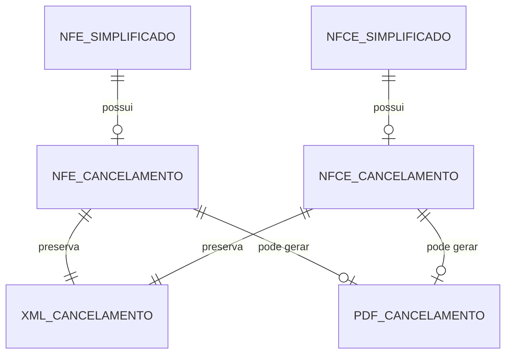

# Especificacao Funcional - Epros

**Modulo:** PLATAFORMA_COMPARTILHADA  
**Submodulo:** FATURAMENTO_FISCAL_ELETRONICO  
**Capacidade:** CANCELAMENTO_DFE  
**Versao:** V1  
**Empresa:** Siser  
**Status:** Concluido para validacao humana  

## 1. Controle do documento

| Item | Conteudo |
|---|---|
| Responsavel pela elaboracao | Analise funcional assistida |
| Responsavel pela validacao funcional | Siser |
| Responsavel pela validacao tecnica | Siser |
| Area dona do processo | Fiscal, Vendas, Compras, Financeiro, Estoque, Plataforma |
| Publico-alvo | Produto, negocio, implantacao, desenvolvimento, suporte, operacao fiscal |
| Fonte de verdade | Esta EF descreve o cancelamento de documento fiscal eletronico no Epros |

## 2. Objetivo funcional

Cancelamento DFe existe para cancelar documentos fiscais eletronicos autorizados, registrar o evento fiscal, preservar XML e PDF do cancelamento, atualizar o status do documento, disponibilizar downloads e tratar duplicidade de evento sem perder rastreabilidade.

O processo cobre cancelamento de NF-e e NFC-e comprovados no material, alem de servir como referencia funcional para cancelamentos especificos citados em devolucao e NFS-e, sem detalhar regras municipais ou de documentos ainda nao especificados.

## 3. Escopo funcional

### 3.1 Dentro do escopo

| Capacidade | Descricao | Observacao |
|---|---|---|
| Cancelar NF-e autorizada | Cancela NF-e quando o documento fiscal esta autorizado. | Status fiscal autorizado comprovado como pre-condicao. |
| Cancelar NFC-e autorizada | Cancela NFC-e quando o documento fiscal esta autorizado. | Status fiscal autorizado comprovado como pre-condicao. |
| Registrar evento de cancelamento | Grava retorno de cancelamento e evidencia fiscal. | Material comprova XML/PDF de cancelamento. |
| Tratar retorno autorizado | Retorno de cancelamento autorizado grava XML/PDF e status cancelado. | cStat 135 comprovado; cStat 101 aparece em fluxo de cancelamento. |
| Tratar duplicidade de evento | Duplicidade de cancelamento deve acionar consulta/reconciliacao. | cStat 573 comprovado com consulta posterior. |
| Bloquear cancelamento sem autorizacao | Cancelamento sem documento autorizado relacionado deve ser rejeitado. | Regra comprovada. |
| Baixar PDF de cancelamento | Permite download de PDF de cancelamento por chave. | Rota funcional comprovada. |
| Baixar XML de cancelamento | Permite download de XML de cancelamento por chave. | Rota funcional comprovada. |
| Armazenar XML cancelado NF-e | Mantem XML de cancelamento em repositorio logico de NF-e cancelada. | `xml_nfe_cancelada/{cnpj}/` comprovado. |
| Armazenar XML cancelado NFC-e | Mantem XML de cancelamento em repositorio logico de NFC-e cancelada. | `xml_nfce_cancelada/` comprovado. |
| Gerar/imprimir evento de cancelamento | Permite gerar representacao do evento de cancelamento. | Impressao de cancelamento comprovada. |

### 3.2 Fora do escopo

| Item | Tratamento |
|---|---|
| Emissao de NF-e | Possui EF especifica. |
| Emissao de NFC-e/PDV | Possui EF especifica. |
| Devolucao fiscal completa | Possui EF especifica; esta EF cobre apenas o padrao de cancelamento quando aplicavel. |
| Carta de correcao | Possui EF especifica. |
| Inutilizacao de numeracao | Possui EF especifica. |
| Cancelamento NFS-e municipal detalhado | Possui EF especifica de NFS-e; esta EF nao define regra municipal. |
| Efeitos completos em financeiro, estoque e vendas | Permanecem nos modulos donos; esta EF registra o evento fiscal e integracoes esperadas. |

## 4. Glossario funcional

| Termo | Definicao | Observacao |
|---|---|---|
| DFe | Documento Fiscal Eletronico. | Nesta EF cobre NF-e e NFC-e quando comprovado. |
| Cancelamento | Evento fiscal que cancela documento fiscal autorizado. | Atualiza status para cancelado quando autorizado/reconciliado. |
| Documento autorizado | Documento com autorizacao fiscal previa. | Pre-condicao para cancelamento. |
| Status da autoridade fiscal | Codigo retornado pela autoridade fiscal. | cStat 135, 101 e 573 aparecem no material. |
| Duplicidade de evento | Retorno indicando que o evento ja existe. | Deve gerar consulta/reconciliacao. |
| XML de cancelamento | XML do evento de cancelamento. | Deve ser preservado. |
| PDF de cancelamento | Representacao do evento de cancelamento. | Deve ficar disponivel para download quando gerado. |
| Chave fiscal | Identificador do documento a cancelar. | Usada em cancelamento e download. |
| Justificativa | Motivo informado para cancelamento quando exigido. | Obrigatoriedade/tamanho nao informados. |

## 5. Atores, papeis e responsabilidades

| Ator/Papel | Responsabilidade | Permissoes esperadas | Restricoes |
|---|---|---|---|
| Operador fiscal | Solicitar cancelamento, acompanhar retorno e baixar evidencias. | Cancelar, consultar, baixar XML/PDF e imprimir evento quando permitido. | Nao cancela documento nao autorizado. |
| Gestor fiscal | Validar cancelamentos, rejeicoes, duplicidade e reconciliacao. | Autorizar/acompanhar cancelamentos e corrigir pendencias. | Deve respeitar empresa e trilha de auditoria. |
| Operador de vendas | Solicitar cancelamento operacional quando vinculado a venda. | Acionar cancelamento conforme permissao. | Nao altera retorno fiscal. |
| Operador financeiro | Validar efeitos financeiros do cancelamento. | Consultar status e evidencias. | Efeitos financeiros ficam no modulo dono. |
| Operador de estoque | Validar efeitos de estoque quando houver. | Consultar status e evidencias. | Efeitos de estoque ficam no modulo dono. |
| Suporte | Diagnosticar falhas de certificado, chave, arquivo, duplicidade e consulta. | Consulta auditada e reprocessamento quando autorizado. | Nao altera XML fiscal manualmente. |

## 6. Pre-condicoes

| Pre-condicao | Regra |
|---|---|
| Documento fiscal existente | Cancelamento exige documento localizado por chave ou identificador interno. |
| Documento autorizado | Documento deve estar autorizado para permitir cancelamento. |
| Chave fiscal valida | Chave invalida deve gerar erro funcional. |
| Certificado disponivel quando exigido | Certificado ausente bloqueia comunicacao fiscal. |
| Empresa/tenant identificado | Cancelamento deve respeitar isolamento por empresa/tenant. |
| Permissao valida | Usuario/processo deve possuir permissao de cancelamento. |
| Justificativa quando exigida | Justificativa e condicional, mas seu tamanho/regra final nao esta informado no material. |

## 7. Visao operacional

1. O usuario ou processo autorizado solicita cancelamento de um documento fiscal.
2. O Epros localiza o documento por chave ou identificador interno.
3. O Epros valida empresa, tenant, permissao, chave fiscal, certificado e status autorizado.
4. O Epros envia o evento de cancelamento para a autoridade fiscal.
5. Se o cancelamento for autorizado, o Epros registra XML, PDF quando gerado, status cancelado e retorno fiscal.
6. Se houver duplicidade de evento, o Epros consulta a situacao do documento/evento e reconcilia o cancelamento quando confirmado.
7. Se houver rejeicao ou erro, o Epros preserva a mensagem e mantem o documento sem marcar cancelado indevidamente.
8. O Epros disponibiliza download de XML/PDF de cancelamento por chave.
9. O Epros comunica os modulos donos para efeitos operacionais quando houver contrato definido.

## 8. Capacidades funcionais detalhadas

### 8.1 Cancelar documento fiscal autorizado

| Item | Especificacao |
|---|---|
| Objetivo | Cancelar NF-e ou NFC-e autorizada e registrar o evento fiscal. |
| Acionamento | Usuario fiscal, fluxo de venda ou integracao interna. |
| Pre-condicoes | Documento autorizado, chave valida, empresa/tenant identificado, certificado disponivel e permissao valida. |
| Dados de entrada | Chave fiscal, modelo, empresa, ambiente, justificativa quando exigida e usuario/processo. |
| Processamento | Validar documento, montar evento, transmitir, receber retorno e atualizar evento/documento. |
| Resultado esperado | Evento autorizado, duplicidade reconciliada ou rejeicao registrada. |
| Pos-condicoes | Documento cancelado quando autorizado/reconciliado; XML/PDF disponiveis quando gerados. |
| Excecoes | Chave invalida, certificado ausente, documento nao autorizado, duplicidade sem confirmacao, rejeicao fiscal ou arquivo nao localizado. |
| Auditoria | Usuario/processo, data/hora, empresa, chave, modelo, status anterior, retorno, XML/PDF e justificativa quando houver. |

### 8.2 Registrar retorno autorizado

| Item | Especificacao |
|---|---|
| Objetivo | Persistir cancelamento aceito pela autoridade fiscal. |
| Acionamento | Retorno fiscal do cancelamento. |
| Pre-condicoes | Evento enviado e retorno autorizado. |
| Dados de entrada | Chave, status da autoridade fiscal, XML de cancelamento, PDF quando gerado e mensagem de retorno. |
| Processamento | Criar ou atualizar registro de cancelamento, gravar XML/PDF e marcar documento como cancelado. |
| Resultado esperado | Documento cancelado com evidencia fiscal preservada. |
| Excecoes | Falha ao gravar XML/PDF ou documento nao localizado. |
| Auditoria | Chave, retorno, XML/PDF, usuario/processo e data/hora. |

### 8.3 Tratar duplicidade de cancelamento

| Item | Especificacao |
|---|---|
| Objetivo | Evitar erro operacional quando a autoridade fiscal indica evento ja existente. |
| Acionamento | Retorno de duplicidade de evento. |
| Pre-condicoes | Cancelamento solicitado e retorno de duplicidade recebido. |
| Dados de entrada | Chave, status da autoridade fiscal e dados do evento. |
| Processamento | Consultar situacao do documento/evento, confirmar se cancelamento existe e reconciliar registro local. |
| Resultado esperado | Documento cancelado quando a consulta confirmar cancelamento; caso contrario, pendencia registrada. |
| Excecoes | Consulta sem confirmacao, falha de comunicacao ou retorno incoerente. |
| Auditoria | Chave, retorno de duplicidade, consulta, resultado e data/hora. |

### 8.4 Rejeitar cancelamento sem documento autorizado

| Item | Especificacao |
|---|---|
| Objetivo | Impedir cancelamento de documento inexistente, nao autorizado ou importado sem autorizacao relacionada. |
| Acionamento | Solicitacao de cancelamento ou importacao de XML de evento. |
| Pre-condicoes | Documento deve estar autorizado. |
| Dados de entrada | Chave fiscal, XML/evento quando importado e empresa. |
| Processamento | Validar existencia e status autorizado antes de aceitar o cancelamento. |
| Resultado esperado | Cancelamento bloqueado quando nao houver documento autorizado. |
| Excecoes | Documento nao localizado, status diferente de autorizado ou chave divergente. |
| Auditoria | Chave, usuario/processo, motivo do bloqueio e data/hora. |

### 8.5 Baixar XML/PDF de cancelamento

| Item | Especificacao |
|---|---|
| Objetivo | Disponibilizar evidencias fiscais do cancelamento. |
| Acionamento | Usuario, contador ou integracao solicita download por chave. |
| Pre-condicoes | Documento cancelado, permissao valida e arquivo/registro disponivel. |
| Dados de entrada | Chave fiscal e tipo de arquivo. |
| Processamento | Localizar registro de cancelamento, validar permissao e retornar XML ou PDF. |
| Resultado esperado | XML/PDF entregue ou erro funcional claro. |
| Excecoes | Chave nao localizada, arquivo inexistente, permissao insuficiente ou cancelamento inexistente. |
| Auditoria | Usuario/processo, chave, tipo de arquivo, data/hora e resultado. |

### 8.6 Gerar ou imprimir evento de cancelamento

| Item | Especificacao |
|---|---|
| Objetivo | Gerar representacao do evento de cancelamento para consulta/impressao. |
| Acionamento | Usuario solicita impressao/visualizacao do cancelamento. |
| Pre-condicoes | Cancelamento registrado. |
| Dados de entrada | Chave/documento cancelado. |
| Processamento | Localizar evento e gerar representacao quando houver dados suficientes. |
| Resultado esperado | PDF/representacao de evento disponivel. |
| Excecoes | Evento nao localizado, fonte de dados ausente ou arquivo nao encontrado. |
| Auditoria | Usuario/processo, chave, data/hora e resultado. |

## 9. Regras de negocio

| Regra | Descricao | Condicao | Resultado | Severidade | Observacoes |
|---|---|---|---|---|---|
| REG-CANC-001 | Documento fiscal somente pode ser cancelado quando estiver autorizado. | Solicitacao de cancelamento. | Bloquear se nao autorizado. | Bloqueante |  |
| REG-CANC-002 | Chave fiscal invalida deve bloquear cancelamento. | Solicitacao por chave. | Retornar erro funcional. | Bloqueante |  |
| REG-CANC-003 | Certificado ausente deve bloquear cancelamento quando comunicacao fiscal exigir certificado. | Transmissao do evento. | Retornar erro funcional. | Bloqueante |  |
| REG-CANC-004 | Cancelamento autorizado deve gravar XML de cancelamento. | Retorno autorizado. | Persistir XML. | Bloqueante | cStat 135 comprovado. |
| REG-CANC-005 | Cancelamento autorizado deve gravar PDF de cancelamento quando gerado. | Retorno autorizado/geracao de evento. | Persistir caminho/arquivo de PDF. | Media |  |
| REG-CANC-006 | Cancelamento autorizado deve atualizar status do documento para cancelado. | Retorno autorizado. | Documento fica cancelado. | Bloqueante |  |
| REG-CANC-007 | Retorno de duplicidade de cancelamento deve acionar consulta de situacao. | Retorno cStat 573. | Consultar/reconciliar. | Bloqueante |  |
| REG-CANC-008 | Duplicidade confirmada por consulta deve reconciliar documento como cancelado. | Consulta confirma cancelamento. | Atualizar evento/documento. | Bloqueante | Material indica consulta 101 apos duplicidade 573. |
| REG-CANC-009 | Duplicidade nao confirmada deve permanecer como pendencia e nao cancelar automaticamente. | Consulta nao confirma cancelamento. | Registrar pendencia. | Bloqueante |  |
| REG-CANC-010 | XML de cancelamento de NF-e deve ser armazenado no repositorio logico de NF-e cancelada. | Cancelamento NF-e. | Preservar XML. | Bloqueante | `xml_nfe_cancelada/{cnpj}/` comprovado. |
| REG-CANC-011 | XML de cancelamento de NFC-e deve ser armazenado no repositorio logico de NFC-e cancelada. | Cancelamento NFC-e. | Preservar XML. | Bloqueante | `xml_nfce_cancelada/` comprovado. |
| REG-CANC-012 | Download de XML de cancelamento deve localizar documento por chave. | Download XML. | Entregar XML ou erro funcional. | Media |  |
| REG-CANC-013 | Download de PDF de cancelamento deve localizar documento por chave. | Download PDF. | Entregar PDF ou erro funcional. | Media |  |
| REG-CANC-014 | Importacao de XML de cancelamento sem documento autorizado relacionado deve ser rejeitada. | Importacao XML de evento. | Bloquear importacao. | Bloqueante |  |
| REG-CANC-015 | NF-e e NFC-e devem possuir registros de cancelamento separados de seus registros principais. | Evento autorizado. | Criar registro filho de cancelamento. | Bloqueante | Tabelas especificas comprovadas. |
| REG-CANC-016 | Registro de cancelamento deve guardar TenantId obrigatorio. | Persistencia do evento. | Exigir TenantId. | Bloqueante | varchar(200) NOT NULL comprovado. |
| REG-CANC-017 | Registro de cancelamento deve guardar StatusSefaz quando informado. | Retorno fiscal. | Persistir status fiscal. | Bloqueante | Campo comprovado. |
| REG-CANC-018 | Registro de cancelamento deve guardar caminho de PDF com ate 500 caracteres quando informado. | Persistencia de PDF. | Validar tamanho. | Media | Campo `PdfCaminho` varchar(500). |
| REG-CANC-019 | Registro de cancelamento deve guardar caminho de XML com ate 500 caracteres quando informado. | Persistencia de XML. | Validar tamanho. | Media | Campo `XmlCaminho` varchar(500). |
| REG-CANC-020 | XML de cancelamento deve suportar conteudo longo. | Persistencia do XML. | Guardar XML completo. | Bloqueante | Campo `Xml` nvarchar(max). |
| REG-CANC-021 | Evento de cancelamento deve ser consultavel e imprimivel quando registrado. | Consulta/impressao. | Exibir/gerar evento. | Media | Material comprova impressao de cancelamento. |
| REG-CANC-022 | Falha de cancelamento deve preservar mensagem e nao marcar documento como cancelado. | Rejeicao/falha. | Registrar erro sem alterar indevidamente o status. | Bloqueante |  |

## 10. Parametros de configuracao

| Parametro | Finalidade | Tipo/formato | Valor padrao | Obrigatorio | Nivel | Quem pode alterar | Impacto |
|---|---|---|---|---|---|---|---|
| Certificado digital | Permitir comunicacao fiscal de cancelamento. | Arquivo/credencial | Nao informado no material | Sim quando exigido | Empresa/filial | Gestor fiscal | Bloqueia cancelamento se ausente. |
| Ambiente fiscal | Direcionar cancelamento para ambiente correto. | Enum | Nao informado no material | Sim | Empresa/filial | Gestor fiscal | Afeta transmissao e consulta. |
| Repositorio fiscal | Guardar XML/PDF de cancelamento. | Storage/caminho logico | Nao informado no material | Sim | Plataforma | Administrador Siser | Afeta download e evidencia. |
| Prazo de cancelamento | Controlar elegibilidade temporal. | Nao informado no material | Nao informado no material | Nao informado no material | Fiscal | Gestor fiscal | Lacuna registrada na MC. |

## 11. Modelo de dados funcional e implantavel

### 11.1 Visao geral do modelo

O modelo de cancelamento e composto pelo documento fiscal principal, registro de cancelamento, XML/PDF de cancelamento e rastreio do retorno fiscal. NF-e e NFC-e possuem estruturas de cancelamento espelhadas, cada uma com tenant, status fiscal, caminhos de arquivo e XML.

| Grupo de dados | Entidades/tabelas | Papel funcional | Observacoes |
|---|---|---|---|
| Documento principal NF-e | `nfe_simplificado` | Documento que pode receber cancelamento. | Detalhado na EF de NF-e saida. |
| Documento principal NFC-e | `nfce_simplificado` | Documento que pode receber cancelamento. | Detalhado na EF de NFC-e/PDV. |
| Cancelamento NF-e | `nfe_simplificado_cancelamento` | Guarda evento de cancelamento da NF-e. | Campos comprovados. |
| Cancelamento NFC-e | `nfce_simplificado_cancelamento` | Guarda evento de cancelamento da NFC-e. | Campos comprovados. |
| Arquivos fiscais | XML/PDF de cancelamento | Evidencia fiscal para download e auditoria. | Caminhos logicos comprovados parcialmente. |
| Consulta/reconciliacao | Consulta de situacao fiscal | Trata duplicidade e confirma cancelamento. | cStat 573 com consulta comprovado. |

### 11.2 Entidades e tabelas

| Entidade funcional | Tabela/estrutura | Tipo | Finalidade | Chave primaria | Observacoes de implantacao |
|---|---|---|---|---|---|
| Cancelamento NF-e | `nfe_simplificado_cancelamento` | Movimento/evento | Registrar cancelamento de NF-e. | Nao informado no material | Guarda TenantId, StatusSefaz, PdfCaminho, XmlCaminho e Xml. |
| Cancelamento NFC-e | `nfce_simplificado_cancelamento` | Movimento/evento | Registrar cancelamento de NFC-e. | Nao informado no material | Guarda TenantId, StatusSefaz, PdfCaminho, XmlCaminho e Xml. |
| Documento NF-e | `nfe_simplificado` | Movimento | Documento original cancelavel. | Nao informado no material | Deve estar autorizado. |
| Documento NFC-e | `nfce_simplificado` | Movimento | Documento original cancelavel. | Nao informado no material | Deve estar autorizado. |
| XML/PDF de cancelamento | Arquivo/registro fiscal | Evidencia | Armazenar evento e representacao. | Chave fiscal quando disponivel | Download por chave comprovado. |

### 11.3 Relacionamentos, cardinalidade e dependencia

| Origem | Relacionamento | Destino | Cardinalidade | Obrigatorio | Regra de integridade |
|---|---|---|---|---|---|
| NF-e | possui | Cancelamento NF-e | 1:0..1 | Condicional | Criado quando cancelamento for autorizado ou reconciliado. |
| NFC-e | possui | Cancelamento NFC-e | 1:0..1 | Condicional | Criado quando cancelamento for autorizado ou reconciliado. |
| Cancelamento NF-e | pertence a | Tenant/empresa | N:1 | Sim | TenantId obrigatorio. |
| Cancelamento NFC-e | pertence a | Tenant/empresa | N:1 | Sim | TenantId obrigatorio. |
| Cancelamento | possui | XML de cancelamento | 1:1 | Sim quando autorizado | XML deve ser preservado. |
| Cancelamento | pode possuir | PDF de cancelamento | 1:0..1 | Condicional | PDF deve ser preservado quando gerado. |

### 11.4 Chaves, unicidade, indices e constraints funcionais

| Entidade/tabela | Tipo de restricao | Campo(s) | Regra | Comportamento esperado |
|---|---|---|---|---|
| Cancelamento NF-e | Campo obrigatorio | TenantId | TenantId deve existir. | Bloquear persistencia sem tenant. |
| Cancelamento NFC-e | Campo obrigatorio | TenantId | TenantId deve existir. | Bloquear persistencia sem tenant. |
| Cancelamento NF-e/NFC-e | Constraint funcional | Documento original | Um documento nao deve ter cancelamento duplicado ativo. | Tratar duplicidade por consulta/reconciliacao. |
| Cancelamento NF-e/NFC-e | Limite de tamanho | PdfCaminho | Caminho ate 500 caracteres. | Validar armazenamento. |
| Cancelamento NF-e/NFC-e | Limite de tamanho | XmlCaminho | Caminho ate 500 caracteres. | Validar armazenamento. |
| Cancelamento NF-e/NFC-e | Conteudo fiscal | Xml | XML deve suportar conteudo completo. | Preservar XML. |

### 11.5 Regras de persistencia, exclusao e historico

| Entidade/tabela | Criacao | Alteracao | Exclusao/inativacao | Historico/auditoria | Retencao |
|---|---|---|---|---|---|
| `nfe_simplificado_cancelamento` | Criado ao autorizar/reconciliar cancelamento de NF-e. | Atualizado por retorno fiscal e arquivos. | Bloquear exclusao logica sem regra formal. | Registrar usuario/processo, chave, status, XML/PDF e data/hora. | Nao informado no material. |
| `nfce_simplificado_cancelamento` | Criado ao autorizar/reconciliar cancelamento de NFC-e. | Atualizado por retorno fiscal e arquivos. | Bloquear exclusao logica sem regra formal. | Registrar usuario/processo, chave, status, XML/PDF e data/hora. | Nao informado no material. |
| Documento principal | Atualizado somente apos autorizacao/reconciliacao. | Status alterado para cancelado. | Nao excluir por cancelamento. | Registrar status anterior/novo e evento. | Nao informado no material. |
| Arquivos XML/PDF | Criados quando evento autorizado/gerado. | Regeneracao nao detalhada. | Nao informado no material. | Registrar chave, tipo de arquivo e acesso. | Nao informado no material. |

### 11.6 Diagrama logico funcional

### 11.7 Lacunas de modelo de dados

| Lacuna | Entidade/tabela afetada | Impacto | Encaminhamento para MC |
|---|---|---|---|
| Chave primaria e FK para documento original nao informadas. | Cancelamentos NF-e/NFC-e | Impede modelagem fisica completa. | Sim |
| Campo de justificativa nao aparece nas estruturas comprovadas. | Cancelamentos NF-e/NFC-e | Exige definicao para fluxo fiscal. | Sim |
| Protocolo de cancelamento nao aparece nos campos comprovados das tabelas especificas. | Cancelamentos NF-e/NFC-e | Exige validacao de persistencia final. | Sim |
| Retencao legal XML/PDF nao informada. | Arquivos fiscais | Impacta compliance. | Sim |

## 12. Dicionario de dados implantavel

### 12.1 `nfe_simplificado_cancelamento`

| Campo | Tipo/formato | Tamanho/dominio | Obrigatorio | Chave/relacao | Regra/observacao |
|---|---|---|---|---|---|
| Id | Identificador | Nao informado no material | Sim | Chave primaria | Identificador interno do cancelamento. |
| NfeSimplificadoId | Identificador | Nao informado no material | Sim | NF-e original | FK final nao informada no material. |
| TenantId | Texto | varchar(200) | Sim | Tenant | Obrigatorio. |
| StatusSefaz | Codigo/status | Nao informado no material | Condicional | Retorno fiscal | Status da autoridade fiscal. |
| PdfCaminho | Texto/caminho | varchar(500) | Nao | Arquivo PDF | Caminho do PDF de cancelamento. |
| XmlCaminho | Texto/caminho | varchar(500) | Nao | Arquivo XML | Caminho do XML de cancelamento. |
| Xml | Texto/XML | nvarchar(max) | Sim quando autorizado | XML fiscal | XML do cancelamento. |
| ChaveFiscal | Texto | Nao informado no material | Sim | Documento fiscal | Chave usada para cancelar e baixar arquivos. |
| Justificativa | Texto | Nao informado no material | Condicional | Evento fiscal | Campo final nao comprovado na estrutura. |
| Protocolo | Texto | Nao informado no material | Condicional | Retorno fiscal | Campo final nao comprovado na estrutura. |

### 12.2 `nfce_simplificado_cancelamento`

| Campo | Tipo/formato | Tamanho/dominio | Obrigatorio | Chave/relacao | Regra/observacao |
|---|---|---|---|---|---|
| Id | Identificador | Nao informado no material | Sim | Chave primaria | Identificador interno do cancelamento. |
| NfceSimplificadoId | Identificador | Nao informado no material | Sim | NFC-e original | FK final nao informada no material. |
| TenantId | Texto | varchar(200) | Sim | Tenant | Obrigatorio. |
| StatusSefaz | Codigo/status | Nao informado no material | Condicional | Retorno fiscal | Status da autoridade fiscal. |
| PdfCaminho | Texto/caminho | varchar(500) | Nao | Arquivo PDF | Caminho do PDF de cancelamento. |
| XmlCaminho | Texto/caminho | varchar(500) | Nao | Arquivo XML | Caminho do XML de cancelamento. |
| Xml | Texto/XML | nvarchar(max) | Sim quando autorizado | XML fiscal | XML do cancelamento. |
| ChaveFiscal | Texto | Nao informado no material | Sim | Documento fiscal | Chave usada para cancelar e baixar arquivos. |
| Justificativa | Texto | Nao informado no material | Condicional | Evento fiscal | Campo final nao comprovado na estrutura. |
| Protocolo | Texto | Nao informado no material | Condicional | Retorno fiscal | Campo final nao comprovado na estrutura. |

### 12.3 Downloads de cancelamento

| Campo | Tipo/formato | Tamanho/dominio | Obrigatorio | Chave/relacao | Regra/observacao |
|---|---|---|---|---|---|
| Chave | Texto | Nao informado no material | Sim | Documento fiscal | Parametro de busca para XML/PDF. |
| TipoArquivo | Enum/texto | XML, PDF | Sim | Download | Define arquivo solicitado. |
| ConteudoArquivo | Binario/texto | Nao informado no material | Sim | Retorno | Conteudo entregue ao usuario/integracao. |
| NomeArquivo | Texto | Nao informado no material | Nao informado no material | Retorno | Nome final nao informado. |
| StatusDownload | Status | Sucesso/erro | Sim | Auditoria | Deve registrar resultado funcional. |

## 13. Estados e transicoes

| Estado | Definicao | Entrada | Saida permitida |
|---|---|---|---|
| Autorizado | Documento original autorizado e elegivel a cancelamento. | Emissao autorizada. | Cancelamento solicitado. |
| Cancelamento solicitado | Evento enviado ou preparado. | Acao do usuario/processo. | Autorizado, duplicidade, rejeitado ou erro. |
| Cancelamento autorizado | Autoridade fiscal aceitou o evento. | Retorno cStat 135 ou equivalente comprovado. | Documento cancelado, download XML/PDF. |
| Duplicidade | Autoridade fiscal informou evento ja existente. | Retorno cStat 573. | Consulta/reconciliacao. |
| Cancelado | Documento local reconciliado como cancelado. | Cancelamento autorizado ou duplicidade confirmada. | Consulta/download. |
| Rejeitado | Autoridade fiscal rejeitou o cancelamento. | Retorno de rejeicao. | Correcao/reenvio quando permitido. |
| Erro | Falha local, certificado, chave ou arquivo. | Validacao/comunicacao/download. | Correcao operacional. |

## 14. Integracoes e impactos

| Integracao | Direcao | Dados | Regra |
|---|---|---|---|
| NF-e saida | Entrada/Saida | Chave, status autorizado/cancelado, XML/PDF | Cancelamento depende de documento autorizado. |
| NFC-e/PDV | Entrada/Saida | Chave, status autorizado/cancelado, XML/PDF | Cancelamento depende de documento autorizado. |
| Vendas | Saida | Status fiscal cancelado e evento | Efeito comercial fica no modulo dono. |
| Financeiro | Saida | Cancelamento fiscal | Estorno/baixa financeira nao detalhados no material. |
| Estoque | Saida | Cancelamento fiscal | Efeito de estoque nao detalhado no material. |
| Plataforma/arquivos | Entrada/Saida | XML, PDF, storage, auditoria | Deve preservar evidencias e downloads. |
| Importacao XML | Entrada | XML de evento de cancelamento | Deve rejeitar cancelamento sem autorizacao relacionada. |

## 15. Telas e operacao esperada

| Tela/acao | Objetivo | Dados principais | Observacao |
|---|---|---|---|
| Cancelar NF-e | Solicitar evento de cancelamento. | Chave, documento, justificativa quando exigida. | Documento deve estar autorizado. |
| Imprimir cancelamento NF-e | Gerar representacao do evento. | Chave/documento. | Material comprova impressao. |
| Baixar XML cancelamento NF-e | Baixar XML do evento. | Chave. | Download por chave comprovado. |
| Baixar XML cancelamento NFC-e | Baixar XML do evento. | Chave. | Download por chave comprovado. |
| Baixar PDF cancelamento | Baixar PDF do evento. | Chave. | Download por chave comprovado. |
| Cancelar NFC-e | Solicitar evento de cancelamento. | Chave, documento, justificativa quando exigida. | Documento deve estar autorizado. |

## 16. Relatorios, consultas e downloads

| Saida | Conteudo | Filtro/chave | Observacao |
|---|---|---|---|
| XML de cancelamento | XML fiscal do evento. | Chave fiscal | Deve ser preservado. |
| PDF de cancelamento | Representacao do evento. | Chave fiscal | Disponivel quando gerado. |
| Impressao de cancelamento | Representacao visual do evento. | Documento/chave | Material comprova impressao de cancelamento. |
| Consulta de situacao | Situacao fiscal apos duplicidade ou falha. | Chave fiscal | Usada para reconciliar duplicidade. |

## 17. Mensagens e excecoes funcionais

| Codigo | Mensagem/condicao | Contexto |
|---|---|---|
| MSG-CANC-001 | Chave fiscal invalida. | Solicitacao de cancelamento. |
| MSG-CANC-002 | Certificado nao encontrado. | Transmissao do cancelamento. |
| MSG-CANC-003 | Documento nao autorizado para cancelamento. | Validacao pre-cancelamento. |
| MSG-CANC-004 | Cancelamento autorizado. | Retorno fiscal. |
| MSG-CANC-005 | Duplicidade de cancelamento detectada. | Retorno fiscal. |
| MSG-CANC-006 | Cancelamento nao confirmado apos consulta. | Reconciliacao. |
| MSG-CANC-007 | XML de cancelamento nao encontrado. | Download. |
| MSG-CANC-008 | PDF de cancelamento nao encontrado. | Download/impressao. |
| MSG-CANC-009 | Evento de cancelamento nao localizado. | Impressao/consulta. |
| MSG-CANC-010 | Cancelamento rejeitado pela autoridade fiscal. | Retorno fiscal. |

## 18. Criterios de aceite

| ID | Criterio | Resultado esperado |
|---|---|---|
| CA-CANC-001 | Solicitar cancelamento de documento nao autorizado. | Epros bloqueia o cancelamento. |
| CA-CANC-002 | Solicitar cancelamento com chave invalida. | Epros retorna erro funcional. |
| CA-CANC-003 | Solicitar cancelamento sem certificado quando exigido. | Epros bloqueia e informa ausencia de certificado. |
| CA-CANC-004 | Receber retorno autorizado. | Epros grava XML, PDF quando gerado e marca documento como cancelado. |
| CA-CANC-005 | Receber duplicidade de evento. | Epros consulta situacao e reconcilia se confirmado. |
| CA-CANC-006 | Duplicidade nao confirmada. | Epros registra pendencia e nao cancela automaticamente. |
| CA-CANC-007 | Baixar XML de cancelamento por chave. | Epros entrega XML ou erro funcional claro. |
| CA-CANC-008 | Baixar PDF de cancelamento por chave. | Epros entrega PDF ou erro funcional claro. |
| CA-CANC-009 | Importar XML de cancelamento sem documento autorizado. | Epros rejeita a importacao. |

## 19. Lacunas enviadas para MC

| Lacuna | Motivo |
|---|---|
| Prazo legal de cancelamento | Material nao informa janela temporal. |
| Justificativa obrigatoria/tamanho minimo | Material cita justificativa em evento fiscal, mas nao fecha regra. |
| Protocolo de cancelamento no modelo especifico | Material comprova XML/PDF/status, mas nao campo de protocolo nas tabelas de cancelamento. |
| Efeitos em venda, estoque e financeiro | Material cita integracoes, mas nao fecha contrato final. |
| Retencao legal e politica de expurgo | Material comprova download/arquivos, mas nao prazo de guarda. |

## 20. Nota de elaboracao

[^1]: A regra de manter pendencia quando a duplicidade nao for confirmada por consulta foi adicionada por seguranca funcional, pois o material comprova duplicidade e consulta posterior, mas nao explicita o comportamento quando a consulta nao confirma o cancelamento.
