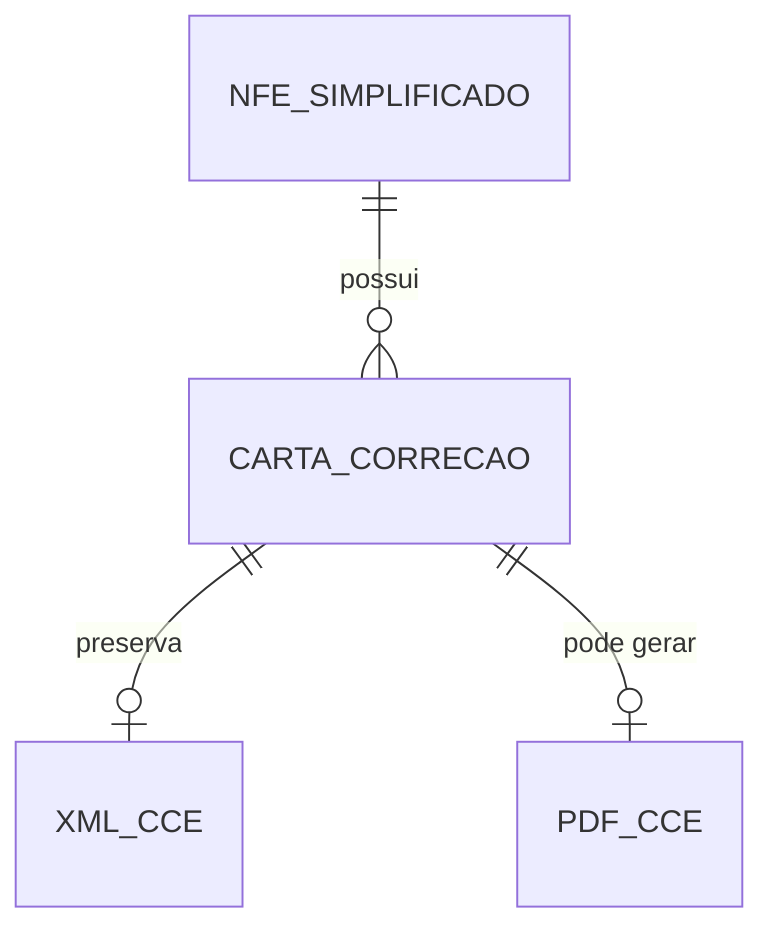

# Especificacao Funcional - Epros

**Modulo:** PLATAFORMA_COMPARTILHADA  
**Submodulo:** FATURAMENTO_FISCAL_ELETRONICO  
**Capacidade:** CARTA_CORRECAO  
**Versao:** V1  
**Empresa:** Siser  
**Status:** Concluido para validacao humana  

## 1. Controle do documento

| Item | Conteudo |
|---|---|
| Responsavel pela elaboracao | Analise funcional assistida |
| Responsavel pela validacao funcional | Siser |
| Responsavel pela validacao tecnica | Siser |
| Area dona do processo | Fiscal, Vendas, Plataforma |
| Publico-alvo | Produto, negocio, implantacao, desenvolvimento, suporte, operacao fiscal |
| Fonte de verdade | Esta EF descreve carta de correcao de NF-e no Epros |

## 2. Objetivo funcional

Carta de Correcao existe para registrar evento fiscal de correcao de NF-e autorizada, controlar sequencia do evento, texto de correcao, retorno fiscal, XML, PDF e downloads por chave.

O processo deve permitir que o usuario autorizado solicite a correcao, que o Epros envie o evento fiscal, registre retorno corrigido ou rejeitado, preserve XML/PDF, disponibilize impressao/download e mantenha rastreabilidade 1:N entre NF-e e suas cartas de correcao.

## 3. Escopo funcional

### 3.1 Dentro do escopo

| Capacidade | Descricao | Observacao |
|---|---|---|
| Criar carta de correcao de NF-e | Registra evento de correcao vinculado a uma NF-e. | Material comprova CC-e para NF-e. |
| Exigir documento autorizado | CC-e e acao disponivel para documento aprovado/autorizado. | Estado aprovado com CC-e comprovado. |
| Controlar sequencia do evento | Cada CC-e possui sequencia. | `sequencia_cce` e `SequenciaEvento` comprovados. |
| Registrar texto de correcao | Guarda texto/motivo da correcao. | `TextoCorrecao` varchar(1000) comprovado. |
| Registrar chave da NF-e | Guarda chave da NF-e corrigida. | `Chave` varchar(50) NOT NULL comprovado. |
| Registrar XML da CC-e | Guarda XML do evento. | `Xml` nvarchar(max) comprovado. |
| Registrar PDF da CC-e | Guarda caminho do PDF quando gerado. | `PdfCaminho` varchar(500) comprovado. |
| Download de XML CC-e | Disponibiliza XML da CC-e por chave. | Download por chave comprovado. |
| Download de PDF CC-e | Disponibiliza PDF da CC-e por chave. | Download por chave comprovado. |
| Impressao de evento | Permite imprimir/visualizar evento em PDF. | Impressao de evento comprovada. |
| Rejeicao da carta | Registra motivo de rejeicao fiscal. | `MotivoRejeicaoSefaz` comprovado. |

### 3.2 Fora do escopo

| Item | Tratamento |
|---|---|
| Emissao de NF-e | Possui EF especifica. |
| Cancelamento DFe | Possui EF especifica. |
| Inutilizacao de numeracao | Possui EF especifica. |
| Correcao de NFC-e | Nao informada no material desta capacidade. |
| Regras legais exaustivas de conteudo permitido/proibido na CC-e | Nao informadas no material; ficam na MC. |
| Efeitos comerciais, financeiros e estoque | Permanecem nos modulos donos quando houver impacto. |

## 4. Glossario funcional

| Termo | Definicao | Observacao |
|---|---|---|
| CC-e | Carta de Correcao Eletronica. | Evento fiscal de correcao de NF-e. |
| NF-e autorizada | NF-e com autorizacao fiscal, apta a receber eventos permitidos. | Pre-condicao funcional. |
| Sequencia do evento | Numero sequencial da carta de correcao da NF-e. | Comprovado como `sequencia_cce` e `SequenciaEvento`. |
| Texto de correcao | Texto informado para o evento de correcao. | Campo `TextoCorrecao`. |
| Chave | Chave da NF-e corrigida. | Obrigatoria na tabela de CC-e. |
| XML da CC-e | XML fiscal do evento de correcao. | Deve ser preservado. |
| PDF da CC-e | Representacao visual do evento. | Disponivel quando gerado. |
| Motivo de rejeicao | Texto do retorno fiscal quando a CC-e e rejeitada. | Campo comprovado. |

## 5. Atores, papeis e responsabilidades

| Ator/Papel | Responsabilidade | Permissoes esperadas | Restricoes |
|---|---|---|---|
| Operador fiscal | Criar CC-e, consultar retorno, baixar XML/PDF e imprimir evento. | Criar, consultar, baixar e imprimir quando permitido. | Nao cria CC-e para documento nao autorizado. |
| Gestor fiscal | Validar texto de correcao, rejeicoes e sequencia. | Consultar, aprovar ajuste operacional e orientar correcao. | Deve respeitar regras fiscais e auditoria. |
| Operador de vendas | Solicitar correcao relacionada a documento de venda. | Solicitar ou acompanhar conforme permissao. | Nao altera retorno fiscal. |
| Suporte | Diagnosticar falhas de transmissao, arquivo, chave e rejeicao. | Consulta auditada e reprocessamento quando autorizado. | Nao edita XML fiscal manualmente. |

## 6. Pre-condicoes

| Pre-condicao | Regra |
|---|---|
| NF-e existente | CC-e deve estar vinculada a uma NF-e localizada. |
| NF-e autorizada | Documento deve estar autorizado para receber CC-e. |
| Chave da NF-e | Chave deve estar disponivel e valida funcionalmente. |
| Texto de correcao informado | Texto e necessario para criar evento; regras legais completas estao na MC. |
| Empresa/tenant identificado | CC-e deve respeitar isolamento por tenant. |
| Certificado/parametros quando exigidos | Transmissao do evento depende de parametros fiscais e certificado quando aplicavel. |
| Permissao valida | Usuario/processo deve possuir permissao para criar CC-e. |

## 7. Visao operacional

1. O usuario acessa a NF-e autorizada e solicita carta de correcao.
2. O Epros valida empresa, tenant, permissao, chave e status do documento.
3. O usuario informa o texto de correcao.
4. O Epros calcula ou atribui a proxima sequencia do evento.
5. O Epros envia o evento de CC-e para a autoridade fiscal.
6. Quando a CC-e e aceita/corrigida, o Epros grava chave, sequencia, texto, status, XML e PDF quando gerado.
7. Quando a CC-e e rejeitada, o Epros grava status e motivo de rejeicao, sem tratar a NF-e como corrigida.
8. O Epros disponibiliza impressao e downloads de XML/PDF da CC-e por chave.

## 8. Capacidades funcionais detalhadas

### 8.1 Criar carta de correcao

| Item | Especificacao |
|---|---|
| Objetivo | Registrar e transmitir evento de correcao de NF-e. |
| Acionamento | Usuario fiscal solicita CC-e a partir da NF-e. |
| Pre-condicoes | NF-e autorizada, chave disponivel, texto informado, permissao valida e parametros fiscais quando exigidos. |
| Dados de entrada | Chave, texto de correcao, empresa, ambiente, usuario/processo e documento fiscal. |
| Processamento | Validar documento, atribuir sequencia, montar evento, transmitir e registrar retorno. |
| Resultado esperado | CC-e corrigida/registrada ou rejeitada com motivo. |
| Pos-condicoes | Evento fica vinculado a NF-e e disponivel para consulta/download quando aceito. |
| Excecoes | NF-e nao localizada, documento nao autorizado, texto ausente, certificado ausente, rejeicao fiscal ou falha de arquivo. |
| Auditoria | Usuario/processo, data/hora, chave, sequencia, texto, status, XML/PDF e motivo de rejeicao quando houver. |

### 8.2 Controlar sequencia do evento

| Item | Especificacao |
|---|---|
| Objetivo | Manter ordem das cartas de correcao da NF-e. |
| Acionamento | Criacao de nova CC-e. |
| Pre-condicoes | NF-e localizada. |
| Dados de entrada | NF-e, chave e sequencia atual quando houver. |
| Processamento | Incrementar ou definir a proxima sequencia de evento. |
| Resultado esperado | CC-e com sequencia registrada. |
| Excecoes | Sequencia indisponivel ou concorrencia nao resolvida. |
| Auditoria | Sequencia anterior, nova sequencia, usuario/processo e data/hora. |

### 8.3 Registrar retorno corrigido

| Item | Especificacao |
|---|---|
| Objetivo | Persistir CC-e aceita pela autoridade fiscal. |
| Acionamento | Retorno fiscal do evento. |
| Pre-condicoes | Evento enviado e retorno aceito. |
| Dados de entrada | Chave, sequencia, status fiscal, XML, caminhos de XML/PDF e texto de correcao. |
| Processamento | Gravar registro de CC-e, XML, caminhos e status. |
| Resultado esperado | Carta de correcao registrada e consultavel. |
| Excecoes | Falha ao gravar XML/PDF ou documento nao localizado. |
| Auditoria | Chave, sequencia, status, XML/PDF, usuario/processo e data/hora. |

### 8.4 Registrar rejeicao da CC-e

| Item | Especificacao |
|---|---|
| Objetivo | Preservar motivo de rejeicao da carta de correcao. |
| Acionamento | Retorno fiscal rejeitado. |
| Pre-condicoes | Evento enviado. |
| Dados de entrada | Status fiscal e motivo de rejeicao. |
| Processamento | Gravar status e motivo sem marcar evento como corrigido. |
| Resultado esperado | Rejeicao consultavel para ajuste. |
| Excecoes | Motivo ausente ou falha de comunicacao. |
| Auditoria | Chave, sequencia, status, motivo, usuario/processo e data/hora. |

### 8.5 Baixar XML/PDF da CC-e

| Item | Especificacao |
|---|---|
| Objetivo | Disponibilizar evidencias fiscais da carta de correcao. |
| Acionamento | Usuario, contador ou integracao solicita download por chave. |
| Pre-condicoes | CC-e existente, permissao valida e arquivo/registro disponivel. |
| Dados de entrada | Chave fiscal e tipo de arquivo. |
| Processamento | Localizar CC-e, validar permissao e retornar XML ou PDF. |
| Resultado esperado | XML/PDF entregue ou erro funcional claro. |
| Excecoes | Chave nao localizada, arquivo inexistente, permissao insuficiente ou CC-e inexistente. |
| Auditoria | Usuario/processo, chave, tipo de arquivo, data/hora e resultado. |

### 8.6 Imprimir evento de CC-e

| Item | Especificacao |
|---|---|
| Objetivo | Gerar representacao visual do evento de correcao. |
| Acionamento | Usuario solicita impressao/visualizacao do evento. |
| Pre-condicoes | CC-e registrada. |
| Dados de entrada | Documento/chave da NF-e ou identificador do evento. |
| Processamento | Localizar evento e gerar PDF/representacao. |
| Resultado esperado | Evento impresso ou visualizavel. |
| Excecoes | Evento nao localizado, arquivo ausente ou dados insuficientes. |
| Auditoria | Usuario/processo, chave, sequencia e data/hora. |

## 9. Regras de negocio

| Regra | Descricao | Condicao | Resultado | Severidade | Observacoes |
|---|---|---|---|---|---|
| REG-CCE-001 | CC-e deve estar vinculada a uma NF-e. | Criacao de CC-e. | Bloquear se NF-e nao for localizada. | Bloqueante |  |
| REG-CCE-002 | CC-e deve ocorrer apenas para NF-e autorizada. | Criacao/transmissao. | Bloquear evento se documento nao estiver autorizado. | Bloqueante |  |
| REG-CCE-003 | Chave da NF-e e obrigatoria na CC-e. | Criacao/persistencia. | Bloquear sem chave. | Bloqueante | Campo `Chave` NOT NULL. |
| REG-CCE-004 | TenantId e obrigatorio no registro da CC-e. | Persistencia. | Bloquear sem tenant. | Bloqueante | varchar(200) NOT NULL. |
| REG-CCE-005 | Texto de correcao deve ser informado para criar CC-e. | Criacao. | Bloquear evento sem texto. | Bloqueante | Obrigatoriedade funcional.[^1] |
| REG-CCE-006 | Texto de correcao deve respeitar limite de 1000 caracteres. | Criacao/persistencia. | Bloquear ou rejeitar texto acima do limite. | Bloqueante | `TextoCorrecao` varchar(1000). |
| REG-CCE-007 | Cada CC-e deve possuir sequencia de evento. | Criacao. | Registrar `SequenciaEvento`. | Bloqueante |  |
| REG-CCE-008 | Nova CC-e deve incrementar a sequencia existente da NF-e. | Criacao de nova carta. | Gerar proxima sequencia. | Bloqueante | `sequencia_cce` comprovado. |
| REG-CCE-009 | XML da CC-e deve ser preservado quando retornado. | Retorno fiscal. | Gravar XML. | Bloqueante | `Xml` nvarchar(max). |
| REG-CCE-010 | Caminho XML da CC-e deve suportar ate 500 caracteres. | Persistencia de arquivo. | Validar tamanho. | Media | `XmlCaminho` varchar(500). |
| REG-CCE-011 | Caminho PDF da CC-e deve suportar ate 500 caracteres. | Persistencia de arquivo. | Validar tamanho. | Media | `PdfCaminho` varchar(500). |
| REG-CCE-012 | Motivo de rejeicao fiscal deve ser preservado quando a CC-e for rejeitada. | Retorno rejeitado. | Gravar motivo. | Bloqueante | `MotivoRejeicaoSefaz` nvarchar(max). |
| REG-CCE-013 | Download de XML CC-e deve localizar evento por chave. | Download XML. | Entregar XML ou erro funcional. | Media |  |
| REG-CCE-014 | Download de PDF CC-e deve localizar evento por chave. | Download PDF. | Entregar PDF ou erro funcional. | Media |  |
| REG-CCE-015 | CC-e deve permitir impressao do evento quando registrada. | Impressao/visualizacao. | Gerar representacao do evento. | Media |  |
| REG-CCE-016 | CC-e rejeitada nao deve ser tratada como evento corrigido. | Retorno rejeitado. | Manter status rejeitado e motivo. | Bloqueante |  |
| REG-CCE-017 | CC-e deve manter relacionamento 1:N com a NF-e. | Mais de uma carta para uma NF-e. | Permitir multiplos eventos sequenciados. | Bloqueante | Relacao 1:N comprovada. |
| REG-CCE-018 | XML da CC-e de NF-e deve ser armazenado no repositorio logico de correcao. | Retorno aceito. | Preservar XML. | Bloqueante | `xml_nfe_correcao/{cnpj}/` comprovado. |

## 10. Parametros de configuracao

| Parametro | Finalidade | Tipo/formato | Valor padrao | Obrigatorio | Nivel | Quem pode alterar | Impacto |
|---|---|---|---|---|---|---|---|
| Certificado digital | Permitir transmissao fiscal da CC-e. | Arquivo/credencial | Nao informado no material | Condicional | Empresa/filial | Gestor fiscal | Bloqueia transmissao quando exigido. |
| Ambiente fiscal | Direcionar evento para producao ou homologacao. | Enum 1/2 | Nao informado no material | Sim | Empresa/filial | Gestor fiscal | Afeta transmissao. |
| Repositorio fiscal | Guardar XML/PDF da CC-e. | Storage/caminho logico | Nao informado no material | Sim | Plataforma | Administrador Siser | Afeta download e impressao. |
| Regra de texto permitido | Validar conteudo da correcao. | Nao informado no material | Nao informado no material | Sim para implantacao | Fiscal | Gestor fiscal | Lacuna registrada na MC. |

## 11. Modelo de dados funcional e implantavel

### 11.1 Visao geral do modelo

O modelo da carta de correcao e formado pela NF-e original, uma ou mais cartas de correcao vinculadas, sequencia do evento, texto de correcao, status fiscal, motivo de rejeicao e arquivos XML/PDF. A cardinalidade comprovada e 1:N entre NF-e e CC-e.

| Grupo de dados | Entidades/tabelas | Papel funcional | Observacoes |
|---|---|---|---|
| Documento principal | `nfe_simplificado` | NF-e original que recebe a CC-e. | Detalhado na EF de NF-e saida. |
| Evento de correcao | `nfe_simplificado_carta_correcao` | Guarda cada CC-e da NF-e. | Campos comprovados. |
| Controle de sequencia | `sequencia_cce`, `SequenciaEvento` | Ordenar eventos de correcao. | Sequencia deve ser preservada. |
| Arquivos fiscais | XML/PDF CC-e | Evidencia fiscal para download/impressao. | Caminhos e XML comprovados. |

### 11.2 Entidades e tabelas

| Entidade funcional | Tabela/estrutura | Tipo | Finalidade | Chave primaria | Observacoes de implantacao |
|---|---|---|---|---|---|
| Carta de correcao NF-e | `nfe_simplificado_carta_correcao` | Movimento/evento | Registrar CC-e vinculada a NF-e. | Nao informado no material | Guarda TenantId, chave, ambiente, sequencia, modelo, status, texto, rejeicao, XML e caminhos. |
| NF-e original | `nfe_simplificado` | Movimento | Documento fiscal corrigido. | Nao informado no material | Deve estar autorizado. |
| PDF da CC-e | Arquivo/registro fiscal | Evidencia | Representar evento para impressao/download. | Chave/sequencia quando disponivel | Caminho ate 500 caracteres. |
| XML da CC-e | Arquivo/registro fiscal | Evidencia | Preservar XML do evento. | Chave/sequencia quando disponivel | Conteudo nvarchar(max). |

### 11.3 Relacionamentos, cardinalidade e dependencia

| Origem | Relacionamento | Destino | Cardinalidade | Obrigatorio | Regra de integridade |
|---|---|---|---|---|---|
| NF-e | possui | Carta de correcao | 1:N | Condicional | Cada CC-e possui sequencia de evento. |
| Carta de correcao | pertence a | Tenant/empresa | N:1 | Sim | TenantId obrigatorio. |
| Carta de correcao | possui | XML da CC-e | 1:0..1 | Condicional | XML deve ser preservado quando retornado. |
| Carta de correcao | pode possuir | PDF da CC-e | 1:0..1 | Condicional | PDF deve ser preservado quando gerado. |

### 11.4 Chaves, unicidade, indices e constraints funcionais

| Entidade/tabela | Tipo de restricao | Campo(s) | Regra | Comportamento esperado |
|---|---|---|---|---|
| `nfe_simplificado_carta_correcao` | Campo obrigatorio | TenantId | TenantId deve existir. | Bloquear persistencia sem tenant. |
| `nfe_simplificado_carta_correcao` | Campo obrigatorio | Chave | Chave da NF-e deve existir. | Bloquear CC-e sem chave. |
| `nfe_simplificado_carta_correcao` | Limite de tamanho | Chave | Chave ate 50 caracteres. | Validar tamanho. |
| `nfe_simplificado_carta_correcao` | Limite de tamanho | TextoCorrecao | Texto ate 1000 caracteres. | Bloquear ou rejeitar excesso. |
| `nfe_simplificado_carta_correcao` | Sequencia funcional | Chave, SequenciaEvento | Sequencia deve ordenar eventos da NF-e. | Evitar colisao de sequencia. |
| `nfe_simplificado_carta_correcao` | Limite de tamanho | XmlCaminho, PdfCaminho | Caminhos ate 500 caracteres. | Validar armazenamento. |

### 11.5 Regras de persistencia, exclusao e historico

| Entidade/tabela | Criacao | Alteracao | Exclusao/inativacao | Historico/auditoria | Retencao |
|---|---|---|---|---|---|
| `nfe_simplificado_carta_correcao` | Criada ao solicitar/registrar CC-e. | Atualizada por retorno fiscal, XML/PDF e rejeicao. | Bloquear exclusao logica sem regra formal. | Registrar usuario/processo, chave, sequencia, texto, status, XML/PDF e data/hora. | Nao informado no material. |
| NF-e original | Nao alterada em seu conteudo fiscal por esta EF. | Pode atualizar controle de sequencia/relacao. | Nao excluir por CC-e. | Registrar vinculo com evento. | Nao informado no material. |
| Arquivos XML/PDF | Criados quando evento e aceito/gerado. | Regeneracao nao detalhada. | Nao informado no material. | Registrar chave, sequencia, tipo de arquivo e acesso. | Nao informado no material. |

### 11.6 Diagrama logico funcional

### 11.7 Lacunas de modelo de dados

| Lacuna | Entidade/tabela afetada | Impacto | Encaminhamento para MC |
|---|---|---|---|
| FK final entre CC-e e NF-e nao informada. | `nfe_simplificado_carta_correcao` | Impede modelagem fisica completa. | Sim |
| Protocolo de evento nao aparece no mapeamento especifico. | CC-e | Exige decisao de persistencia. | Sim |
| Regras legais de conteudo da CC-e nao informadas. | TextoCorrecao | Exige validacao fiscal antes da implantacao. | Sim |
| Politica de retencao de XML/PDF nao informada. | Arquivos CC-e | Impacta compliance. | Sim |

## 12. Dicionario de dados implantavel

### 12.1 `nfe_simplificado_carta_correcao`

| Campo | Tipo/formato | Tamanho/dominio | Obrigatorio | Chave/relacao | Regra/observacao |
|---|---|---|---|---|---|
| Id | Identificador | Nao informado no material | Sim | Chave primaria | Identificador interno da CC-e. |
| NfeSimplificadoId | Identificador | Nao informado no material | Sim | NF-e original | FK final nao informada no material. |
| TenantId | Texto | varchar(200) | Sim | Tenant | Obrigatorio. |
| Chave | Texto | varchar(50) | Sim | NF-e | Chave da NF-e corrigida. |
| Ambiente | Enum/numero | Producao=1, Homologacao=2 | Nao informado no material | Ambiente fiscal | Ambiente do evento. |
| SequenciaEvento | Numero | Nao informado no material | Nao informado no material | Sequencia | Sequencia da CC-e. |
| ModeloDocumento | Enum/numero | NFe=55 | Nao informado no material | Documento fiscal | Modelo fiscal informado como NF-e. |
| StatusSefaz | Numero/status | Nao informado no material | Nao informado no material | Retorno fiscal | Codigo/status da autoridade fiscal. |
| TextoCorrecao | Texto | varchar(1000) | Sim | Evento fiscal | Texto da correcao. |
| MotivoRejeicaoSefaz | Texto | nvarchar(max) | Nao | Rejeicao | Motivo de rejeicao fiscal. |
| Xml | Texto/XML | nvarchar(max) | Nao | XML fiscal | XML da CC-e. |
| XmlCaminho | Texto/caminho | varchar(500) | Nao | Arquivo XML | Caminho do XML. |
| PdfCaminho | Texto/caminho | varchar(500) | Nao | Arquivo PDF | Caminho do PDF. |
| Protocolo | Texto | Nao informado no material | Condicional | Retorno fiscal | Campo final nao comprovado na estrutura. |

### 12.2 Downloads de CC-e

| Campo | Tipo/formato | Tamanho/dominio | Obrigatorio | Chave/relacao | Regra/observacao |
|---|---|---|---|---|---|
| Chave | Texto | Nao informado no material | Sim | Documento fiscal | Parametro de busca para XML/PDF. |
| TipoArquivo | Enum/texto | XML, PDF | Sim | Download | Define arquivo solicitado. |
| ConteudoArquivo | Binario/texto | Nao informado no material | Sim | Retorno | Conteudo entregue ao usuario/integracao. |
| StatusDownload | Status | Sucesso/erro | Sim | Auditoria | Deve registrar resultado funcional. |

## 13. Estados e transicoes

| Estado | Definicao | Entrada | Saida permitida |
|---|---|---|---|
| NF-e autorizada | Documento original permite evento. | Emissao autorizada. | CC-e solicitada. |
| CC-e solicitada | Usuario informou texto de correcao. | Acao do usuario/processo. | Enviada, rejeitada por validacao. |
| CC-e enviada | Evento transmitido para autoridade fiscal. | Transmissao. | Corrigida/registrada ou rejeitada. |
| Corrigida | Evento aceito/registrado. | Retorno fiscal aceito. | Consulta, impressao, download. |
| Rejeitada | Evento recusado pela autoridade fiscal. | Retorno fiscal rejeitado. | Correcao do texto/reenvio quando permitido. |
| Erro | Falha local, certificado, chave, arquivo ou comunicacao. | Validacao/comunicacao/download. | Correcao operacional. |

## 14. Integracoes e impactos

| Integracao | Direcao | Dados | Regra |
|---|---|---|---|
| NF-e saida | Entrada/Saida | Chave, status autorizado, sequencia, texto, XML/PDF | CC-e depende de NF-e autorizada. |
| Plataforma/arquivos | Entrada/Saida | XML, PDF, caminhos, auditoria | Deve preservar evidencias e downloads. |
| Vendas | Saida | Evento de correcao da NF-e | Efeito comercial nao detalhado no material. |
| Relatorios/contador | Saida | XML/PDF CC-e | Downloads por chave estao comprovados. |

## 15. Telas e operacao esperada

| Tela/acao | Objetivo | Dados principais | Observacao |
|---|---|---|---|
| Criar carta de correcao | Informar texto e transmitir evento. | NF-e, chave, texto, sequencia. | Prompt/motivo citado no material. |
| Imprimir evento | Gerar PDF/representacao da CC-e. | Chave ou identificador do evento. | Impressao de evento comprovada. |
| Baixar XML CC-e | Baixar XML do evento. | Chave. | Download por chave comprovado. |
| Baixar PDF CC-e | Baixar PDF do evento. | Chave. | Download por chave comprovado. |

## 16. Relatorios, consultas e downloads

| Saida | Conteudo | Filtro/chave | Observacao |
|---|---|---|---|
| XML CC-e | XML do evento de correcao. | Chave fiscal | Deve ser preservado. |
| PDF CC-e | Representacao do evento. | Chave fiscal | Disponivel quando gerado. |
| Impressao de evento | Representacao visual do evento. | Documento/chave | Material comprova impressao de evento. |
| Lista/detalhe da NF-e | Acoes de CC-e vinculadas ao documento. | NF-e | Detalhamento principal fica na EF de NF-e saida. |

## 17. Mensagens e excecoes funcionais

| Codigo | Mensagem/condicao | Contexto |
|---|---|---|
| MSG-CCE-001 | NF-e nao localizada para carta de correcao. | Criacao de CC-e. |
| MSG-CCE-002 | Documento nao autorizado para CC-e. | Validacao pre-evento. |
| MSG-CCE-003 | Texto de correcao nao informado. | Criacao de CC-e. |
| MSG-CCE-004 | Texto de correcao excede o limite permitido. | Criacao/persistencia. |
| MSG-CCE-005 | CC-e rejeitada pela autoridade fiscal. | Retorno fiscal. |
| MSG-CCE-006 | XML da CC-e nao encontrado. | Download. |
| MSG-CCE-007 | PDF da CC-e nao encontrado. | Download/impressao. |
| MSG-CCE-008 | Evento de CC-e nao localizado. | Consulta/impressao. |
| MSG-CCE-009 | Sequencia de CC-e indisponivel. | Criacao. |

## 18. Criterios de aceite

| ID | Criterio | Resultado esperado |
|---|---|---|
| CA-CCE-001 | Solicitar CC-e para NF-e nao localizada. | Epros bloqueia e informa erro funcional. |
| CA-CCE-002 | Solicitar CC-e para NF-e nao autorizada. | Epros bloqueia o evento. |
| CA-CCE-003 | Solicitar CC-e sem texto. | Epros bloqueia o evento. |
| CA-CCE-004 | Solicitar CC-e com texto acima de 1000 caracteres. | Epros bloqueia ou rejeita conforme validacao. |
| CA-CCE-005 | Criar primeira CC-e de NF-e autorizada. | Epros registra sequencia, texto, chave e retorno. |
| CA-CCE-006 | Criar nova CC-e da mesma NF-e. | Epros incrementa sequencia. |
| CA-CCE-007 | Retorno aceito. | Epros grava XML e PDF quando gerado. |
| CA-CCE-008 | Retorno rejeitado. | Epros grava motivo de rejeicao e nao trata como corrigida. |
| CA-CCE-009 | Baixar XML/PDF CC-e por chave. | Epros entrega arquivo ou erro funcional claro. |

## 19. Lacunas enviadas para MC

| Lacuna | Motivo |
|---|---|
| Regras legais completas de texto permitido/proibido | Material traz campo e limite, mas nao matriz legal. |
| Protocolo do evento no modelo especifico | Material nao comprova campo no mapeamento da CC-e. |
| Concorrencia de sequencia | Material comprova incremento, mas nao regra transacional. |
| Permissoes finais | Material comprova acoes, mas nao matriz RBAC completa. |
| Retencao XML/PDF | Material comprova arquivos/downloads, mas nao politica de guarda. |

## 20. Nota de elaboracao

[^1]: A obrigatoriedade funcional do texto de correcao foi definida porque o material comprova a acao de carta com motivo/texto e o campo `TextoCorrecao`; a regra legal completa do conteudo permanece na MC por nao estar detalhada.
