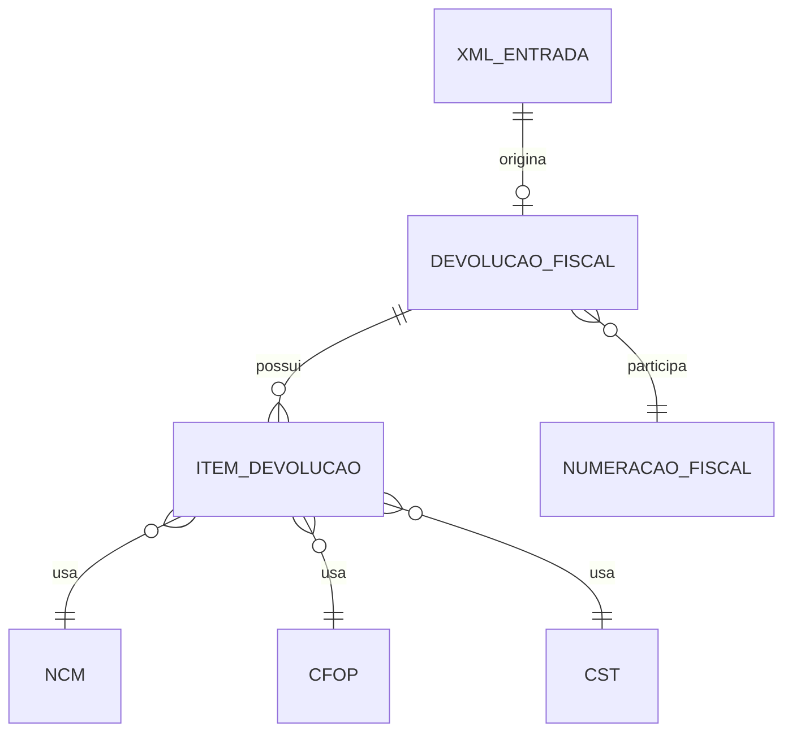

# Especificacao Funcional - Epros

**Modulo:** PLATAFORMA_COMPARTILHADA  
**Submodulo:** FATURAMENTO_FISCAL_ELETRONICO  
**Capacidade:** DEVOLUCAO_FISCAL  
**Versao:** V1  
**Empresa:** Siser  
**Status:** Concluido para validacao humana  

## 1. Controle do documento

| Item | Conteudo |
|---|---|
| Responsavel pela elaboracao | Analise funcional assistida |
| Responsavel pela validacao funcional | Siser |
| Responsavel pela validacao tecnica | Siser |
| Area dona do processo | Fiscal, Compras, Vendas, Estoque, Financeiro, Cadastros, Plataforma |
| Publico-alvo | Produto, negocio, implantacao, desenvolvimento, suporte, operacao fiscal |
| Fonte de verdade | Esta EF descreve a devolucao fiscal no Epros |

## 2. Objetivo funcional

Devolucao Fiscal existe para registrar, montar, transmitir, consultar, cancelar e corrigir documento fiscal de devolucao com base em uma entrada fiscal, XML de entrada ou operacao fiscal referenciada.

O processo deve preservar a chave da NF de entrada, gerar chave e numero fiscal proprios da devolucao quando autorizada, controlar estados operacionais, manter itens fiscais com NCM, CFOP e CST por linha, e impedir devolucao sem referencia fiscal comprovada.

## 3. Escopo funcional

### 3.1 Dentro do escopo

| Capacidade | Descricao | Observacao |
|---|---|---|
| Upload de XML de entrada | Permite carregar XML de entrada para iniciar devolucao. | Material comprova upload de XML para devolucao. |
| Leitura do XML de entrada | Usa XML de entrada como base para montar devolucao. | O detalhe de parser nao foi informado. |
| Documento de devolucao | Registra devolucao fiscal com estado, chave de entrada, chave gerada e numero gerado. | Estrutura `devolucaos` comprovada. |
| Itens da devolucao | Registra itens com NCM, CFOP e CST por linha. | Estrutura `item_devolucaos` comprovada. |
| Estados da devolucao | Controla 0=NOVO, 1=APROVADO, 2=REJEITADO, 3=CANCELADO. | Dominio comprovado. |
| Transmissao da devolucao | Envia documento fiscal de devolucao. | Material comprova transmissao. |
| Cancelamento da devolucao | Permite cancelar devolucao quando aplicavel. | Material comprova cancelamento no fluxo. |
| Correcao da devolucao | Permite corrigir devolucao quando aplicavel. | Material comprova correcao no fluxo. |
| Numeracao fiscal da devolucao | Usa numero gerado e participa da sequencia fiscal compartilhada. | Campo `numero_gerado` comprovado. |
| Chaves fiscais | Controla chave de entrada e chave gerada. | Campos `chave_nf_entrada` e `chave_gerada` comprovados. |
| Consulta/listagem de devolucoes | Permite listar e consultar devolucoes. | Material comprova listagem. |

### 3.2 Fora do escopo

| Item | Tratamento |
|---|---|
| NF-e de entrada completa | Possui EF especifica. |
| NF-e de saida completa | Possui EF especifica. |
| Cancelamento fiscal generico | Possui EF especifica; esta EF cobre apenas cancelamento da devolucao. |
| Carta de correcao generica | Possui EF especifica; esta EF cobre apenas correcao da devolucao quando citada. |
| Calculo tributario completo | Possui EF especifica de motor tributario. |
| Cadastro mestre de produto, pessoa, NCM, CFOP e CST | Permanece nos modulos donos. |
| Efeitos contabeis, financeiros e estoque completos | Permanecem nos modulos donos; esta EF registra apenas dependencias funcionais comprovadas. |

## 4. Glossario funcional

| Termo | Definicao | Observacao |
|---|---|---|
| Devolucao fiscal | Documento fiscal usado para devolver mercadoria ou operacao fiscal referenciada. | Deve possuir referencia fiscal. |
| XML de entrada | XML do documento fiscal que origina ou subsidia a devolucao. | Upload comprovado. |
| Chave da NF de entrada | Chave fiscal do documento original recebido. | Campo `chave_nf_entrada`. |
| Chave gerada | Chave fiscal da devolucao transmitida/autorizada. | Campo `chave_gerada`. |
| Numero gerado | Numero fiscal gerado para a devolucao. | Campo `numero_gerado`. |
| Estado NOVO | Devolucao criada e ainda nao aprovada. | Valor 0. |
| Estado APROVADO | Devolucao autorizada/aprovada. | Valor 1. |
| Estado REJEITADO | Devolucao rejeitada. | Valor 2. |
| Estado CANCELADO | Devolucao cancelada. | Valor 3. |
| Item de devolucao | Linha devolvida com dados fiscais. | NCM, CFOP e CST por linha comprovados. |

## 5. Atores, papeis e responsabilidades

| Ator/Papel | Responsabilidade | Permissoes esperadas | Restricoes |
|---|---|---|---|
| Operador fiscal | Criar, transmitir, consultar, corrigir e cancelar devolucao fiscal. | Upload XML, criar, transmitir, consultar, corrigir e cancelar quando permitido. | Nao cria devolucao sem referencia fiscal. |
| Operador de compras | Iniciar devolucao a partir de XML de entrada/recebimento. | Upload XML e consulta. | Nao altera parametros fiscais criticos. |
| Operador de vendas | Acompanhar devolucao relacionada a venda quando aplicavel. | Consulta e acompanhamento. | Nao transmite sem permissao fiscal. |
| Gestor fiscal | Validar rejeicoes, CFOP/CST e eventos de cancelamento/correcao. | Aprovar ajustes e acompanhar status. | Deve respeitar empresa e segregacao de funcoes. |
| Operador de estoque | Validar efeito operacional da devolucao sobre itens. | Consulta e confirmacao operacional quando modulo dono exigir. | Nao altera XML fiscal. |
| Suporte | Diagnosticar falhas de XML, transmissao, rejeicao e arquivos. | Consulta auditada. | Nao altera documento aprovado/cancelado fora de fluxo formal. |

## 6. Pre-condicoes

| Pre-condicao | Regra |
|---|---|
| Empresa existente | Devolucao deve estar vinculada a empresa/tenant. |
| Referencia fiscal existente | Devolucao exige chave ou XML de entrada que referencie a operacao original. |
| XML de entrada valido quando usado | Upload deve conter XML apto a leitura funcional. |
| Itens identificaveis | Itens devolvidos devem permitir NCM, CFOP e CST quando informados no material. |
| Parametros fiscais disponiveis | Transmissao depende de parametros fiscais e numeracao. |
| Certificado disponivel quando exigido | Transmissao fiscal depende de certificado valido quando aplicavel. |
| Numeracao controlada | Numero gerado deve respeitar sequencia fiscal compartilhada quando aplicavel. |

## 7. Visao operacional

1. O usuario inicia devolucao fiscal, normalmente a partir de XML de entrada ou documento fiscal referenciado.
2. O Epros recebe o XML de entrada e extrai a referencia fiscal possivel.
3. O Epros cria a devolucao em estado NOVO.
4. O Epros registra chave da NF de entrada quando disponivel.
5. O Epros registra itens devolvidos com NCM, CFOP e CST por linha quando disponiveis.
6. O usuario revisa dados fiscais da devolucao.
7. O Epros transmite a devolucao quando solicitado e quando as pre-condicoes estiverem atendidas.
8. Se a devolucao for aprovada, o Epros registra estado APROVADO, chave gerada e numero gerado.
9. Se a devolucao for rejeitada, o Epros registra estado REJEITADO para correcao/retransmissao quando permitido.
10. Quando aplicavel, o Epros permite cancelamento ou correcao da devolucao.
11. O Epros disponibiliza listagem e consulta da devolucao.

## 8. Capacidades funcionais detalhadas

### 8.1 Iniciar devolucao por XML de entrada

| Item | Especificacao |
|---|---|
| Objetivo | Criar devolucao fiscal usando XML de entrada como base. |
| Acionamento | Usuario envia XML de entrada na operacao de devolucao. |
| Pre-condicoes | Empresa identificada, permissao valida e XML informado. |
| Dados de entrada | XML de entrada, empresa, usuario/processo e contexto fiscal. |
| Processamento | Receber XML, validar existencia, extrair referencia fiscal quando possivel e preparar devolucao. |
| Resultado esperado | Devolucao criada ou erro funcional de XML/referencia. |
| Pos-condicoes | Documento fica em estado NOVO quando criado. |
| Excecoes | XML ausente, XML invalido, referencia fiscal nao encontrada ou empresa nao identificada. |
| Auditoria | Usuario/processo, empresa, data/hora, XML recebido e resultado. |

### 8.2 Registrar documento de devolucao

| Item | Especificacao |
|---|---|
| Objetivo | Persistir cabecalho funcional da devolucao. |
| Acionamento | Criacao da devolucao apos upload/leitura do XML ou operacao referenciada. |
| Pre-condicoes | Referencia fiscal disponivel ou decisao funcional pendente registrada na MC. |
| Dados de entrada | Chave da NF de entrada, itens, dados fiscais e valores disponiveis. |
| Processamento | Criar registro em estado NOVO, vincular chave de entrada e preparar numero/chave gerados para transmissao. |
| Resultado esperado | Devolucao consultavel em estado NOVO. |
| Pos-condicoes | Documento pode seguir para transmissao quando valido. |
| Excecoes | Chave de entrada ausente, itens ausentes ou dados fiscais insuficientes. |
| Auditoria | Usuario/processo, data/hora, estado, chave de entrada e itens. |

### 8.3 Registrar itens da devolucao

| Item | Especificacao |
|---|---|
| Objetivo | Registrar linhas devolvidas com dados fiscais minimos comprovados. |
| Acionamento | Criacao ou revisao da devolucao. |
| Pre-condicoes | Documento de devolucao existente. |
| Dados de entrada | Produto/item, NCM, CFOP, CST e demais dados disponiveis no XML/documento. |
| Processamento | Gravar itens e validar campos fiscais quando informados. |
| Resultado esperado | Itens de devolucao vinculados ao documento. |
| Pos-condicoes | Documento pode ser validado para transmissao. |
| Excecoes | Item sem identificacao ou dados fiscais insuficientes quando exigidos. |
| Auditoria | Usuario/processo, item, campos fiscais e data/hora. |

### 8.4 Transmitir devolucao fiscal

| Item | Especificacao |
|---|---|
| Objetivo | Enviar documento fiscal de devolucao e registrar retorno. |
| Acionamento | Usuario solicita transmissao. |
| Pre-condicoes | Documento em estado NOVO ou REJEITADO quando retransmissao for permitida; referencia fiscal e itens validos. |
| Dados de entrada | Devolucao, chave de entrada, itens, parametros fiscais, serie/numero, certificado quando exigido. |
| Processamento | Validar referencia, montar documento, atribuir numero gerado quando aplicavel, transmitir e registrar retorno. |
| Resultado esperado | Devolucao APROVADA ou REJEITADA. |
| Pos-condicoes | Chave gerada e numero gerado devem ser registrados quando aprovados. |
| Excecoes | Falha de transmissao, rejeicao fiscal, parametros ausentes, certificado ausente ou referencia ausente. |
| Auditoria | Usuario/processo, estado anterior, estado novo, numero gerado, chave gerada e mensagem. |

### 8.5 Cancelar devolucao fiscal

| Item | Especificacao |
|---|---|
| Objetivo | Cancelar devolucao quando o fluxo fiscal permitir. |
| Acionamento | Usuario solicita cancelamento. |
| Pre-condicoes | Devolucao existente e elegivel a cancelamento. |
| Dados de entrada | Devolucao, chave gerada, justificativa quando exigida e usuario/processo. |
| Processamento | Validar estado, executar cancelamento e atualizar estado para CANCELADO quando concluido. |
| Resultado esperado | Devolucao cancelada ou erro funcional. |
| Pos-condicoes | Documento nao pode seguir como aprovado ativo. |
| Excecoes | Documento nao elegivel, chave ausente, falha fiscal ou permissao insuficiente. |
| Auditoria | Usuario/processo, data/hora, chave, estado anterior, estado novo e motivo quando informado. |

### 8.6 Corrigir devolucao fiscal

| Item | Especificacao |
|---|---|
| Objetivo | Permitir correcao fiscal da devolucao quando aplicavel. |
| Acionamento | Usuario solicita correcao. |
| Pre-condicoes | Devolucao existente e elegivel a correcao. |
| Dados de entrada | Devolucao, texto/dados de correcao quando informados e usuario/processo. |
| Processamento | Validar elegibilidade e registrar correcao conforme fluxo fiscal aplicavel. |
| Resultado esperado | Correcao registrada ou erro funcional. |
| Pos-condicoes | Devolucao permanece rastreavel com correcao associada. |
| Excecoes | Documento nao elegivel, dados insuficientes ou permissao insuficiente. |
| Auditoria | Usuario/processo, data/hora, chave, dados de correcao e resultado. |

### 8.7 Listar e consultar devolucoes

| Item | Especificacao |
|---|---|
| Objetivo | Permitir acompanhamento operacional das devolucoes. |
| Acionamento | Usuario acessa listagem ou detalhe. |
| Pre-condicoes | Permissao valida e empresa identificada. |
| Dados de entrada | Empresa, filtros quando informados e identificador da devolucao quando houver detalhe. |
| Processamento | Listar devolucoes ou carregar detalhe do documento. |
| Resultado esperado | Devolucoes consultaveis com estado, chaves, numero e itens quando disponiveis. |
| Pos-condicoes | Nenhuma alteracao de estado. |
| Excecoes | Documento nao localizado ou permissao insuficiente. |
| Auditoria | Usuario/processo, filtros, documento consultado e data/hora. |

## 9. Regras de negocio

| Regra | Descricao | Condicao | Resultado | Severidade | Observacoes |
|---|---|---|---|---|---|
| REG-DEV-001 | Devolucao fiscal exige referencia fiscal de entrada ou documento fiscal referenciado. | Criacao/transmissao. | Bloquear devolucao sem referencia. | Bloqueante | Material informa exigencia de chaves referenciadas. |
| REG-DEV-002 | Upload de XML de entrada deve ser permitido como origem da devolucao. | Criacao por XML. | Receber XML e iniciar leitura. | Bloqueante | Upload comprovado. |
| REG-DEV-003 | Devolucao criada deve iniciar em estado NOVO quando ainda nao aprovada. | Criacao. | Definir estado 0. | Bloqueante | Estado 0=NOVO comprovado. |
| REG-DEV-004 | Devolucao aprovada deve usar estado APROVADO. | Retorno aprovado. | Definir estado 1. | Bloqueante | Estado 1=APROVADO comprovado. |
| REG-DEV-005 | Devolucao rejeitada deve usar estado REJEITADO. | Retorno rejeitado. | Definir estado 2. | Bloqueante | Estado 2=REJEITADO comprovado. |
| REG-DEV-006 | Devolucao cancelada deve usar estado CANCELADO. | Cancelamento concluido. | Definir estado 3. | Bloqueante | Estado 3=CANCELADO comprovado. |
| REG-DEV-007 | Devolucao deve guardar chave da NF de entrada quando disponivel. | Criacao/leitura do XML. | Preencher `chave_nf_entrada`. | Bloqueante | Campo comprovado. |
| REG-DEV-008 | Devolucao aprovada deve guardar chave gerada quando retornada. | Aprovacao fiscal. | Preencher `chave_gerada`. | Bloqueante | Campo comprovado. |
| REG-DEV-009 | Devolucao aprovada deve guardar numero gerado quando atribuido. | Aprovacao/transmissao. | Preencher `numero_gerado`. | Bloqueante | Campo comprovado. |
| REG-DEV-010 | Numero gerado da devolucao participa da sequencia fiscal compartilhada. | Numeracao NF-e. | Considerar devolucoes na proxima numeracao fiscal. | Bloqueante | Material comprova sequencia compartilhada. |
| REG-DEV-011 | Itens de devolucao devem guardar NCM, CFOP e CST por linha quando disponiveis. | Registro de itens. | Persistir dados fiscais por item. | Bloqueante | Campos comprovados. |
| REG-DEV-012 | Devolucao em estado APROVADO nao deve ser retransmitida pelo fluxo normal. | Tentativa de transmissao. | Bloquear retransmissao normal. | Bloqueante | Regra alinhada ao comportamento fiscal dos documentos ja aprovados.[^1] |
| REG-DEV-013 | Devolucao em estado NOVO pode seguir para transmissao quando estiver valida. | Transmissao. | Permitir envio. | Bloqueante |  |
| REG-DEV-014 | Devolucao em estado REJEITADO pode ser corrigida/retransmitida quando permitido. | Correcao apos rejeicao. | Permitir ajuste conforme permissao. | Bloqueante | Material comprova correcao e rejeicao. |
| REG-DEV-015 | Cancelamento de devolucao deve alterar o estado para CANCELADO quando concluido. | Cancelamento. | Atualizar estado. | Bloqueante |  |
| REG-DEV-016 | Correcao de devolucao deve manter rastreabilidade do documento original. | Correcao. | Registrar correcao vinculada. | Media | Detalhe completo fica na EF de carta de correcao/eventos. |
| REG-DEV-017 | Listagem de devolucoes deve permitir acompanhar documentos e estados. | Consulta. | Exibir lista com estado e identificadores fiscais quando disponiveis. | Media | Listagem comprovada. |
| REG-DEV-018 | Documento fiscal de devolucao sem itens nao deve ser transmitido. | Transmissao. | Bloquear transmissao. | Bloqueante | Necessario para consistencia funcional.[^1] |
| REG-DEV-019 | Chave de entrada e chave gerada devem permanecer rastreaveis apos cancelamento. | Cancelamento. | Preservar chaves. | Bloqueante |  |
| REG-DEV-020 | Dados fiscais de item devem ser validados antes da transmissao quando informados. | Transmissao. | Bloquear ou rejeitar com mensagem funcional. | Bloqueante | NCM, CFOP e CST comprovados. |

## 10. Parametros de configuracao

| Parametro | Finalidade | Tipo/formato | Valor padrao | Obrigatorio | Nivel | Quem pode alterar | Impacto |
|---|---|---|---|---|---|---|---|
| Parametros NF-e | Permitir transmissao fiscal da devolucao. | Configuracao fiscal | Nao informado no material | Sim para transmissao | Empresa/filial | Gestor fiscal | Afeta transmissao. |
| Serie e numeracao fiscal | Controlar numero gerado da devolucao. | Numero/serie | Nao informado no material | Sim para transmissao | Empresa/filial | Gestor fiscal | Afeta sequencia fiscal. |
| Certificado digital | Permitir comunicacao fiscal quando exigida. | Arquivo/credencial | Nao informado no material | Condicional | Empresa/filial | Gestor fiscal | Bloqueia transmissao se ausente/invalido. |
| Regras fiscais de CFOP/CST | Definir codigos fiscais por item. | Cadastro fiscal | Nao informado no material | Condicional | Empresa/grupo tributario | Gestor fiscal | Afeta validacao e autorizacao. |

## 11. Modelo de dados funcional e implantavel

### 11.1 Visao geral do modelo

O modelo de devolucao fiscal e formado por um documento de devolucao, seus itens, chaves fiscais de referencia e retorno, estado do documento e vinculos com XML/documento de entrada. A devolucao tambem depende de cadastros fiscais para NCM, CFOP e CST por item.

| Grupo de dados | Entidades/tabelas | Papel funcional | Observacoes |
|---|---|---|---|
| Documento fiscal | `devolucaos` | Guarda estado, chave da entrada, chave gerada e numero gerado. | Estrutura comprovada no material. |
| Itens fiscais | `item_devolucaos` | Guarda dados fiscais por linha devolvida. | NCM, CFOP e CST comprovados. |
| XML de origem | XML de entrada | Subsidia criacao da devolucao. | Estrutura fisica final nao informada. |
| Numeracao fiscal | Sequencia NF-e compartilhada | Considera `numero_gerado` da devolucao. | Detalhe transacional na MC. |
| Cadastros fiscais | NCM, CFOP, CST, produto | Validam itens da devolucao. | Pertencem aos modulos donos. |

### 11.2 Entidades e tabelas

| Entidade funcional | Tabela/estrutura | Tipo | Finalidade | Chave primaria | Observacoes de implantacao |
|---|---|---|---|---|---|
| Devolucao fiscal | `devolucaos` | Movimento | Representar cabecalho da devolucao fiscal. | Nao informado no material | Campos comprovados: estado, chave de entrada, chave gerada e numero gerado. |
| Item da devolucao | `item_devolucaos` | Movimento/filho | Representar linhas devolvidas. | Nao informado no material | NCM, CFOP e CST por linha. |
| XML de entrada | Arquivo/XML | Documento fiscal | Origem da devolucao. | Nao informado no material | Upload comprovado; armazenamento final nao informado. |
| Cadastro fiscal do item | NCM/CFOP/CST | Mestre | Sustentar regras fiscais por item. | Nao informado no material | Pertence a cadastros fiscais. |

### 11.3 Relacionamentos, cardinalidade e dependencia

| Origem | Relacionamento | Destino | Cardinalidade | Obrigatorio | Regra de integridade |
|---|---|---|---|---|---|
| Devolucao fiscal | possui | Item da devolucao | 1:N | Sim | Devolucao transmitida deve possuir itens. |
| Devolucao fiscal | referencia | XML/NF de entrada | 1:1 | Sim | Devolucao exige referencia fiscal. |
| Item da devolucao | usa | NCM | N:1 | Condicional | NCM deve existir quando informado/exigido. |
| Item da devolucao | usa | CFOP | N:1 | Condicional | CFOP deve existir quando informado/exigido. |
| Item da devolucao | usa | CST | N:1 | Condicional | CST deve existir quando informado/exigido. |
| Devolucao fiscal | participa | Numeracao NF-e | N:1 | Sim para transmissao | Numero gerado entra na sequencia fiscal compartilhada. |

### 11.4 Chaves, unicidade, indices e constraints funcionais

| Entidade/tabela | Tipo de restricao | Campo(s) | Regra | Comportamento esperado |
|---|---|---|---|---|
| `devolucaos` | Estado | `estado` | Valores permitidos: 0, 1, 2, 3. | Bloquear estado fora do dominio. |
| `devolucaos` | Referencia fiscal | `chave_nf_entrada` | Devolucao deve referenciar entrada. | Bloquear transmissao sem referencia. |
| `devolucaos` | Retorno fiscal | `chave_gerada` | Chave gerada deve ser preservada quando retornada. | Permitir consulta/eventos. |
| `devolucaos` | Numeracao | `numero_gerado` | Numero gerado participa da sequencia NF-e. | Evitar duplicidade fiscal. |
| `item_devolucaos` | Campos fiscais | NCM, CFOP, CST | Itens devem manter codigos fiscais por linha quando informados. | Validar antes da transmissao. |

### 11.5 Regras de persistencia, exclusao e historico

| Entidade/tabela | Criacao | Alteracao | Exclusao/inativacao | Historico/auditoria | Retencao |
|---|---|---|---|---|---|
| `devolucaos` | Criada a partir de XML/referencia fiscal. | Estado, chave gerada e numero gerado mudam por transmissao/cancelamento/correcao. | Bloquear exclusao apos transmissao/aprovacao/cancelamento. | Registrar usuario/processo, estado, chaves, numero e data/hora. | Nao informado no material. |
| `item_devolucaos` | Criado junto ou apos cabecalho da devolucao. | Ajustado antes da transmissao quando permitido. | Bloquear exclusao apos aprovacao/cancelamento. | Registrar usuario/processo, item e campos fiscais. | Nao informado no material. |
| XML de entrada | Recebido por upload. | Conteudo fiscal deve ser preservado. | Nao informado no material. | Registrar usuario/processo, data/hora e vinculo com devolucao. | Nao informado no material. |

### 11.6 Diagrama logico funcional

### 11.7 Lacunas de modelo de dados

| Lacuna | Entidade/tabela afetada | Impacto | Encaminhamento para MC |
|---|---|---|---|
| PK/FKs de `devolucaos` e `item_devolucaos` nao informadas. | Devolucao e itens | Impede modelagem fisica completa. | Sim |
| Campos completos de cabecalho e item nao informados. | Devolucao e itens | Impede contrato completo de transmissao. | Sim |
| Armazenamento final do XML de devolucao nao informado. | Arquivos fiscais | Impede retencao/download. | Sim |
| Dominio completo de eventos de correcao/cancelamento nao informado. | Eventos fiscais | Exige EF especifica. | Sim |

## 12. Dicionario de dados implantavel

### 12.1 `devolucaos`

| Campo | Tipo/formato | Tamanho/dominio | Obrigatorio | Chave/relacao | Regra/observacao |
|---|---|---|---|---|---|
| Id | Identificador | Nao informado no material | Sim | Chave primaria | Identificador interno da devolucao. |
| estado | Numero/enum | 0=NOVO, 1=APROVADO, 2=REJEITADO, 3=CANCELADO | Sim | Estado | Estado funcional da devolucao. |
| chave_nf_entrada | Texto | Nao informado no material | Sim | Referencia fiscal | Chave da NF de entrada/origem. |
| chave_gerada | Texto | Nao informado no material | Condicional | Chave fiscal gerada | Chave da devolucao quando transmitida/aprovada. |
| numero_gerado | Numero | Nao informado no material | Condicional | Numeracao fiscal | Numero gerado da devolucao; participa da sequencia fiscal. |
| EmpresaId | Identificador | Nao informado no material | Sim | Empresa | Empresa responsavel pela devolucao. |
| XmlEntrada | Arquivo/XML | XML | Condicional | Origem fiscal | XML carregado para iniciar devolucao. |
| MensagemRetorno | Texto | Nao informado no material | Nao | Retorno fiscal | Mensagem de rejeicao, cancelamento ou correcao quando houver. |
| DataCriacao | Data/hora | Nao informado no material | Nao informado no material | Auditoria | Data de criacao da devolucao. |
| DataTransmissao | Data/hora | Nao informado no material | Nao | Auditoria | Data de transmissao quando houver. |

### 12.2 `item_devolucaos`

| Campo | Tipo/formato | Tamanho/dominio | Obrigatorio | Chave/relacao | Regra/observacao |
|---|---|---|---|---|---|
| Id | Identificador | Nao informado no material | Sim | Chave primaria | Identificador interno do item. |
| DevolucaoId | Identificador | Nao informado no material | Sim | Devolucao fiscal | Vincula item ao cabecalho. |
| ProdutoId | Identificador | Nao informado no material | Nao informado no material | Produto | Produto/item devolvido. |
| NCM | Codigo | Nao informado no material | Condicional | Cadastro fiscal | NCM por linha comprovado. |
| CFOP | Codigo | Nao informado no material | Condicional | Cadastro fiscal | CFOP por linha comprovado. |
| CST | Codigo | Nao informado no material | Condicional | Cadastro fiscal | CST por linha comprovado. |
| Quantidade | Decimal | Nao informado no material | Nao informado no material | Item | Quantidade devolvida nao detalhada no material. |
| ValorUnitario | Decimal | Nao informado no material | Nao informado no material | Item | Valor unitario nao detalhado no material. |
| ValorTotal | Decimal | Nao informado no material | Nao informado no material | Item | Valor total nao detalhado no material. |

## 13. Estados e transicoes

| Estado | Codigo | Definicao | Entrada | Saida permitida |
|---|---:|---|---|---|
| NOVO | 0 | Devolucao criada e nao aprovada. | Upload XML/criacao. | Transmitir, corrigir dados antes da transmissao. |
| APROVADO | 1 | Devolucao autorizada/aprovada. | Retorno fiscal aprovado. | Cancelar ou corrigir quando permitido. |
| REJEITADO | 2 | Devolucao rejeitada. | Retorno fiscal rejeitado. | Corrigir e retransmitir quando permitido. |
| CANCELADO | 3 | Devolucao cancelada. | Cancelamento concluido. | Consulta. |

## 14. Integracoes e impactos

| Integracao | Direcao | Dados | Regra |
|---|---|---|---|
| NF-e entrada | Entrada | XML de entrada, chave da NF de entrada, itens | Devolucao exige referencia fiscal. |
| NF-e saida | Saida | Numero gerado, chave gerada, sequencia fiscal | Devolucao participa da numeracao fiscal compartilhada. |
| Estoque | Saida | Itens devolvidos, produto, quantidade, NCM/CFOP/CST | Efeito operacional deve ser definido pelo modulo dono. |
| Financeiro | Saida | Possivel impacto de devolucao | Contrato financeiro final nao informado. |
| Cadastros fiscais | Entrada | NCM, CFOP, CST | Itens dependem dos cadastros fiscais. |
| Eventos fiscais | Saida | Cancelamento e correcao | Detalhamento completo fica em EFs especificas. |

## 15. Telas e operacao esperada

| Tela/acao | Objetivo | Dados principais | Observacao |
|---|---|---|---|
| Upload XML devolucao | Receber XML de entrada. | XML, empresa e usuario. | Material comprova upload. |
| Listagem de devolucoes | Consultar devolucoes criadas/transmitidas. | Estado, chaves, numero e periodo quando houver. | Filtros finais nao informados. |
| Transmitir devolucao | Enviar documento fiscal de devolucao. | Devolucao, itens, chave de entrada e parametros fiscais. | Material comprova transmissao. |
| Cancelar devolucao | Cancelar documento quando permitido. | Chave gerada e motivo quando exigido. | Material comprova cancelamento. |
| Corrigir devolucao | Registrar correcao quando permitido. | Documento e dados/texto de correcao. | Material comprova correcao. |

## 16. Relatorios, consultas e downloads

| Saida | Conteudo | Filtro/chave | Observacao |
|---|---|---|---|
| Lista de devolucoes | Devolucoes com estado e identificadores fiscais. | Nao informado no material | Listagem comprovada. |
| Detalhe da devolucao | Cabecalho, itens, chaves e estado. | Identificador da devolucao | Detalhe final nao informado. |
| XML de entrada | XML que originou devolucao. | Chave da NF de entrada/importacao | Retencao/download nao informados. |
| XML de devolucao | XML transmitido/autorizado quando houver. | Chave gerada/numero | Armazenamento final nao informado. |

## 17. Mensagens e excecoes funcionais

| Codigo | Mensagem/condicao | Contexto |
|---|---|---|
| MSG-DEV-001 | XML de entrada nao informado. | Criacao por XML. |
| MSG-DEV-002 | Referencia fiscal da devolucao nao localizada. | Criacao/transmissao. |
| MSG-DEV-003 | Devolucao sem itens. | Transmissao. |
| MSG-DEV-004 | Estado da devolucao nao permite transmissao. | Transmissao. |
| MSG-DEV-005 | Devolucao rejeitada pela autoridade fiscal. | Retorno fiscal. |
| MSG-DEV-006 | Devolucao nao elegivel para cancelamento. | Cancelamento. |
| MSG-DEV-007 | Devolucao nao elegivel para correcao. | Correcao. |
| MSG-DEV-008 | Numero fiscal da devolucao indisponivel. | Transmissao/numeracao. |
| MSG-DEV-009 | Chave gerada nao localizada. | Cancelamento/correcao/consulta. |

## 18. Criterios de aceite

| ID | Criterio | Resultado esperado |
|---|---|---|
| CA-DEV-001 | Criar devolucao sem XML ou referencia fiscal. | Epros bloqueia e informa referencia ausente. |
| CA-DEV-002 | Criar devolucao por XML valido. | Epros cria documento em estado NOVO. |
| CA-DEV-003 | Transmitir devolucao sem itens. | Epros bloqueia transmissao. |
| CA-DEV-004 | Transmitir devolucao valida. | Epros registra APROVADO ou REJEITADO conforme retorno. |
| CA-DEV-005 | Retorno aprovado. | Epros grava chave gerada e numero gerado quando retornados. |
| CA-DEV-006 | Retorno rejeitado. | Epros grava estado REJEITADO. |
| CA-DEV-007 | Cancelar devolucao elegivel. | Epros atualiza estado para CANCELADO. |
| CA-DEV-008 | Listar devolucoes. | Epros exibe documentos com estado e identificadores fiscais disponiveis. |
| CA-DEV-009 | Numerar nova NF-e apos devolucao aprovada. | Epros considera numero gerado da devolucao na sequencia fiscal compartilhada. |

## 19. Lacunas enviadas para MC

| Lacuna | Motivo |
|---|---|
| Campos completos de cabecalho e itens de devolucao | Material comprova poucos campos, sem estrutura total. |
| Armazenamento XML da devolucao | Material comprova XML de entrada, mas nao caminho final da devolucao gerada. |
| Contrato completo de cancelamento e correcao | Material comprova acoes, mas nao campos/eventos completos. |
| Efeitos em estoque e financeiro | Material indica natureza integrada, mas nao detalha contrato final. |
| Permissoes finais | Material nao fecha matriz RBAC para devolucao. |

## 20. Nota de elaboracao

[^1]: Regras de bloqueio de retransmissao de documento aprovado e bloqueio de transmissao sem itens foram adicionadas como regra funcional necessaria para consistencia fiscal e implantacao segura, pois o material comprova estados, transmissao e itens, mas nao explicita esses bloqueios de forma completa.
