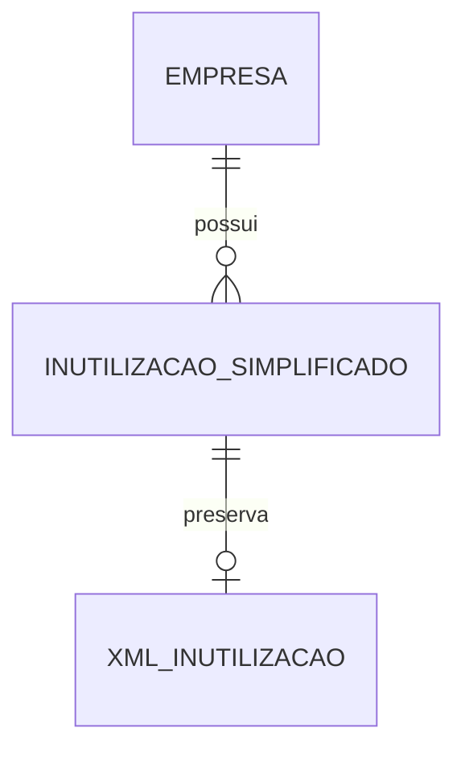

# Especificacao Funcional - Epros

**Modulo:** PLATAFORMA_COMPARTILHADA  
**Submodulo:** FATURAMENTO_FISCAL_ELETRONICO  
**Capacidade:** INUTILIZACAO_NUMERACAO  
**Versao:** V1  
**Empresa:** Siser  
**Status:** Concluido para validacao humana  

## 1. Controle do documento

| Item | Conteudo |
|---|---|
| Responsavel pela elaboracao | Analise funcional assistida |
| Responsavel pela validacao funcional | Siser |
| Responsavel pela validacao tecnica | Siser |
| Area dona do processo | Fiscal, Plataforma |
| Publico-alvo | Produto, negocio, implantacao, desenvolvimento, suporte, operacao fiscal |
| Fonte de verdade | Esta EF descreve inutilizacao de numeracao fiscal no Epros |

## 2. Objetivo funcional

Inutilizacao de Numeracao existe para inutilizar uma faixa numerica fiscal nao utilizada, por empresa, documento, UF, ambiente, modelo, serie, ano, numero inicial e numero final.

O processo deve enviar a inutilizacao para a autoridade fiscal, registrar retorno, status fiscal, XML, protocolo, justificativa, motivo de rejeicao e caminho do XML, preservando rastreabilidade e evitando uso posterior da faixa inutilizada.

## 3. Escopo funcional

### 3.1 Dentro do escopo

| Capacidade | Descricao | Observacao |
|---|---|---|
| Solicitar inutilizacao | Envia faixa numerica fiscal para inutilizacao. | Material comprova envio de faixa. |
| Listar inutilizacoes | Consulta historico de inutilizacoes por documento e ambiente. | Rota funcional comprovada. |
| Controlar documento da empresa | Usa documento fiscal da empresa para a inutilizacao. | Campo `Documento` varchar(20) comprovado. |
| Controlar UF | Usa UF da empresa na inutilizacao. | Campo `Uf` varchar(2) comprovado. |
| Controlar ambiente | Usa producao ou homologacao. | Ambiente 1/2 comprovado. |
| Controlar modelo fiscal | Usa modelo 55 ou 65 quando aplicavel. | Material comprova modelo 55/65. |
| Controlar serie | Usa serie fiscal da empresa/ambiente/modelo. | Serie comprovada. |
| Controlar faixa | Usa numero inicial e numero final. | Campos `NrNfInicial` e `NrNfFinal` comprovados. |
| Registrar justificativa | Guarda motivo da inutilizacao. | Campo `Justificativa` comprovado. |
| Registrar XML | Guarda XML da inutilizacao. | Campo `Xml` comprovado. |
| Registrar protocolo | Guarda protocolo fiscal. | Campo `Protocolo` varchar(20) NOT NULL comprovado. |
| Registrar rejeicao | Guarda motivo de rejeicao fiscal quando houver. | Campo `MotivoRejeicaoSefaz` comprovado. |

### 3.2 Fora do escopo

| Item | Tratamento |
|---|---|
| Emissao de NF-e/NFC-e | Possui EFs especificas. |
| Reserva transacional de numeracao de emissao | Permanece como lacuna integrada com parametros e emissao. |
| Cancelamento fiscal | Possui EF especifica. |
| Carta de correcao | Possui EF especifica. |
| Regras legais exaustivas de quando inutilizar | Nao informadas no material; ficam na MC. |
| Efeitos contabeis/financeiros | Nao informados no material desta capacidade. |

## 4. Glossario funcional

| Termo | Definicao | Observacao |
|---|---|---|
| Inutilizacao | Evento fiscal que inutiliza faixa numerica nao usada. | Resultado pode ser autorizado ou rejeitado. |
| Faixa numerica | Intervalo entre numero inicial e numero final. | Campos `NrNfInicial` e `NrNfFinal`. |
| Serie fiscal | Serie vinculada ao modelo/ambiente da empresa. | Usada para compor a faixa. |
| Modelo fiscal | Tipo de documento fiscal. | NFe=55, NFCe=65 comprovados. |
| UF | Unidade federativa da empresa. | Campo obrigatorio. |
| Documento | Documento fiscal da empresa. | Campo obrigatorio. |
| Protocolo | Identificador fiscal do retorno autorizado. | Campo obrigatorio no material. |
| Justificativa | Motivo informado para inutilizacao. | Regra de tamanho nao informada. |
| XML de inutilizacao | XML retornado/registrado para a faixa. | Deve ser preservado. |

## 5. Atores, papeis e responsabilidades

| Ator/Papel | Responsabilidade | Permissoes esperadas | Restricoes |
|---|---|---|---|
| Operador fiscal | Solicitar inutilizacao, consultar historico e acompanhar rejeicoes. | Criar, consultar e visualizar retorno quando permitido. | Nao inutiliza faixa sem justificativa e parametros. |
| Gestor fiscal | Validar faixa, serie, ambiente, justificativa e retorno fiscal. | Aprovar, acompanhar e auditar inutilizacoes. | Deve respeitar empresa, modelo e ambiente. |
| Suporte | Diagnosticar falhas de certificado, comunicacao, XML, protocolo e rejeicao. | Consulta auditada e reprocessamento quando autorizado. | Nao altera XML/protocolo manualmente. |

## 6. Pre-condicoes

| Pre-condicao | Regra |
|---|---|
| Empresa identificada | Inutilizacao deve estar vinculada a empresa/tenant. |
| Documento da empresa | Documento deve estar disponivel. |
| UF da empresa | UF deve estar disponivel. |
| Ambiente fiscal | Ambiente deve ser informado. |
| Modelo fiscal | Modelo fiscal deve ser informado. |
| Serie fiscal | Serie deve ser informada. |
| Numero inicial e final | Faixa deve possuir inicio e fim. |
| Justificativa | Justificativa deve ser informada funcionalmente para o envio.[^1] |
| Certificado quando exigido | Comunicacao fiscal depende de certificado quando aplicavel. |

## 7. Visao operacional

1. O usuario acessa a rotina de inutilizacao.
2. O Epros carrega empresa, documento, UF, ambiente e series do modelo fiscal.
3. O usuario informa modelo, serie, ano, numero inicial, numero final e justificativa.
4. O Epros valida dados minimos da faixa e parametros fiscais.
5. O Epros envia a inutilizacao para a autoridade fiscal.
6. Quando autorizada, o Epros registra status fiscal, XML, protocolo e caminho do XML.
7. Quando rejeitada, o Epros registra status fiscal e motivo de rejeicao.
8. O Epros permite consultar historico por documento e ambiente.

## 8. Capacidades funcionais detalhadas

### 8.1 Solicitar inutilizacao de faixa

| Item | Especificacao |
|---|---|
| Objetivo | Enviar uma faixa numerica para inutilizacao fiscal. |
| Acionamento | Usuario fiscal solicita inutilizacao. |
| Pre-condicoes | Empresa, documento, UF, ambiente, modelo, serie, faixa e justificativa informados. |
| Dados de entrada | Documento, UF, ambiente, ano, serie, numero inicial, numero final, modelo, justificativa e usuario/processo. |
| Processamento | Validar dados, montar requisicao fiscal, transmitir e registrar retorno. |
| Resultado esperado | Faixa autorizada com XML/protocolo ou rejeitada com motivo. |
| Pos-condicoes | Faixa autorizada fica registrada e consultavel. |
| Excecoes | Certificado ausente, faixa invalida, parametro ausente, rejeicao fiscal ou falha de comunicacao. |
| Auditoria | Usuario/processo, empresa, documento, UF, ambiente, modelo, serie, faixa, status, XML, protocolo e justificativa. |

### 8.2 Registrar inutilizacao autorizada

| Item | Especificacao |
|---|---|
| Objetivo | Persistir retorno autorizado da inutilizacao. |
| Acionamento | Retorno fiscal autorizado. |
| Pre-condicoes | Inutilizacao enviada e autorizada. |
| Dados de entrada | Status fiscal, XML, protocolo, caminho do XML e dados da faixa. |
| Processamento | Criar/atualizar registro de inutilizacao com XML e protocolo. |
| Resultado esperado | Faixa inutilizada registrada. |
| Excecoes | Falha ao gravar XML/protocolo ou registro nao localizado. |
| Auditoria | Status, XML, protocolo, caminho, usuario/processo e data/hora. |

### 8.3 Registrar rejeicao

| Item | Especificacao |
|---|---|
| Objetivo | Preservar motivo de rejeicao da inutilizacao. |
| Acionamento | Retorno fiscal rejeitado. |
| Pre-condicoes | Inutilizacao enviada. |
| Dados de entrada | Status fiscal e motivo de rejeicao. |
| Processamento | Atualizar status e gravar motivo de rejeicao. |
| Resultado esperado | Rejeicao consultavel. |
| Excecoes | Motivo nao informado ou falha de comunicacao. |
| Auditoria | Usuario/processo, faixa, status, motivo e data/hora. |

### 8.4 Consultar historico de inutilizacoes

| Item | Especificacao |
|---|---|
| Objetivo | Listar inutilizacoes por documento e ambiente. |
| Acionamento | Usuario acessa consulta/historico. |
| Pre-condicoes | Documento e ambiente informados. |
| Dados de entrada | Documento e ambiente. |
| Processamento | Localizar inutilizacoes correspondentes. |
| Resultado esperado | Lista de inutilizacoes com faixa, serie, status, protocolo e XML quando disponivel. |
| Excecoes | Documento/ambiente ausente ou permissao insuficiente. |
| Auditoria | Usuario/processo, filtros e data/hora. |

## 9. Regras de negocio

| Regra | Descricao | Condicao | Resultado | Severidade | Observacoes |
|---|---|---|---|---|---|
| REG-INUT-001 | Inutilizacao deve possuir TenantId. | Persistencia. | Bloquear sem tenant. | Bloqueante | `TenantId` varchar(200) obrigatorio. |
| REG-INUT-002 | UF da empresa e obrigatoria. | Solicitacao/persistencia. | Bloquear sem UF. | Bloqueante | `Uf` varchar(2) obrigatorio. |
| REG-INUT-003 | Documento da empresa e obrigatorio. | Solicitacao/persistencia. | Bloquear sem documento. | Bloqueante | `Documento` varchar(20) obrigatorio. |
| REG-INUT-004 | Ambiente fiscal deve ser informado. | Solicitacao. | Bloquear sem ambiente. | Bloqueante | Producao=1, Homologacao=2. |
| REG-INUT-005 | Modelo fiscal deve ser informado. | Solicitacao. | Bloquear sem modelo. | Bloqueante | Modelos 55 e 65 comprovados. |
| REG-INUT-006 | Serie fiscal deve ser informada. | Solicitacao. | Bloquear sem serie. | Bloqueante |  |
| REG-INUT-007 | Numero inicial e numero final devem ser informados. | Solicitacao. | Bloquear sem faixa. | Bloqueante | Campos comprovados. |
| REG-INUT-008 | Numero inicial deve ser menor ou igual ao numero final. | Validacao da faixa. | Bloquear faixa invertida. | Bloqueante | Regra funcional necessaria.[^1] |
| REG-INUT-009 | Justificativa deve ser informada para envio da inutilizacao. | Solicitacao. | Bloquear sem justificativa. | Bloqueante | Campo comprovado; tamanho final na MC. |
| REG-INUT-010 | Inutilizacao autorizada deve gravar XML. | Retorno autorizado. | Persistir XML. | Bloqueante | cStat 102 persiste XML no material. |
| REG-INUT-011 | Inutilizacao autorizada deve gravar protocolo. | Retorno autorizado. | Persistir protocolo. | Bloqueante | `Protocolo` varchar(20) obrigatorio. |
| REG-INUT-012 | Inutilizacao autorizada deve gravar status fiscal. | Retorno autorizado. | Persistir status fiscal. | Bloqueante | StatusSefaz comprovado. |
| REG-INUT-013 | Rejeicao deve gravar motivo de rejeicao fiscal. | Retorno rejeitado. | Persistir motivo. | Bloqueante | `MotivoRejeicaoSefaz` nvarchar(max). |
| REG-INUT-014 | XML deve suportar conteudo longo. | Persistencia do XML. | Guardar XML completo. | Bloqueante | `Xml` nvarchar(max). |
| REG-INUT-015 | Caminho do XML deve suportar ate 500 caracteres. | Persistencia de arquivo. | Validar tamanho. | Media | `XmlCaminho` varchar(500). |
| REG-INUT-016 | Historico deve ser consultavel por documento e ambiente. | Consulta. | Retornar inutilizacoes correspondentes. | Media | Rota funcional comprovada. |
| REG-INUT-017 | Faixa autorizada nao deve ser reutilizada em emissao normal. | Pos-autorizacao. | Bloquear uso posterior. | Bloqueante | Regra funcional necessaria.[^1] |
| REG-INUT-018 | Inutilizacao deve usar parametros de empresa para documento, UF, ambiente e serie quando disponiveis. | Solicitacao. | Preencher dados da empresa. | Bloqueante | Material comprova envio com parametros da empresa. |

## 10. Parametros de configuracao

| Parametro | Finalidade | Tipo/formato | Valor padrao | Obrigatorio | Nivel | Quem pode alterar | Impacto |
|---|---|---|---|---|---|---|---|
| Ambiente fiscal | Definir homologacao/producao da inutilizacao. | Enum 1/2 | Nao informado no material | Sim | Empresa/filial | Gestor fiscal | Afeta envio. |
| Serie fiscal | Definir serie da faixa. | Numero | Nao informado no material | Sim | Empresa/filial | Gestor fiscal | Afeta faixa inutilizada. |
| Documento da empresa | Identificar emitente. | Texto | Nao informado no material | Sim | Empresa | Cadastros/Gestor fiscal | Afeta autorizacao. |
| UF da empresa | Identificar UF fiscal. | Texto | Nao informado no material | Sim | Empresa | Cadastros/Gestor fiscal | Afeta autorizacao. |
| Certificado digital | Permitir comunicacao fiscal. | Arquivo/credencial | Nao informado no material | Condicional | Empresa/filial | Gestor fiscal | Bloqueia envio quando exigido. |
| Storage fiscal | Guardar XML da inutilizacao. | Storage/caminho | Nao informado no material | Sim | Plataforma | Administrador Siser | Afeta evidencia e consulta. |

## 11. Modelo de dados funcional e implantavel

### 11.1 Visao geral do modelo

O modelo de inutilizacao e centrado na tabela `inutilizacao_simplificado`, que registra tenant, UF, documento, ambiente, ano, serie, faixa numerica, modelo fiscal, status fiscal, justificativa, motivo de rejeicao, XML, protocolo e caminho do XML.

| Grupo de dados | Entidades/tabelas | Papel funcional | Observacoes |
|---|---|---|---|
| Inutilizacao | `inutilizacao_simplificado` | Guarda faixa inutilizada e retorno fiscal. | Estrutura comprovada. |
| Parametros fiscais | Empresa, ambiente, serie, documento, UF | Sustentam a solicitacao. | Pertencem aos parametros/cadastros. |
| Arquivo fiscal | XML de inutilizacao | Evidencia fiscal. | Caminho externo comprovado de forma parcial. |

### 11.2 Entidades e tabelas

| Entidade funcional | Tabela/estrutura | Tipo | Finalidade | Chave primaria | Observacoes de implantacao |
|---|---|---|---|---|---|
| Inutilizacao fiscal | `inutilizacao_simplificado` | Movimento/evento | Registrar inutilizacao de faixa numerica fiscal. | Nao informado no material | Campos comprovados no dicionario. |
| Parametros da empresa | Empresa/parametros fiscais | Mestre/configuracao | Fornecer documento, UF, ambiente e serie. | Nao informado no material | Nao duplicar dados mestres nesta EF. |
| XML de inutilizacao | Arquivo/registro fiscal | Evidencia | Preservar XML retornado. | Documento/ano/mes quando disponivel | Caminho final completo na MC. |

### 11.3 Relacionamentos, cardinalidade e dependencia

| Origem | Relacionamento | Destino | Cardinalidade | Obrigatorio | Regra de integridade |
|---|---|---|---|---|---|
| Empresa | possui | Inutilizacao fiscal | 1:N | Sim | Inutilizacao exige tenant/documento/UF. |
| Inutilizacao fiscal | usa | Parametros fiscais | N:1 | Sim | Ambiente, serie e modelo devem vir dos parametros quando disponiveis. |
| Inutilizacao fiscal | possui | XML de inutilizacao | 1:0..1 | Condicional | XML deve ser preservado quando autorizado/retornado. |

### 11.4 Chaves, unicidade, indices e constraints funcionais

| Entidade/tabela | Tipo de restricao | Campo(s) | Regra | Comportamento esperado |
|---|---|---|---|---|
| `inutilizacao_simplificado` | Campo obrigatorio | TenantId | TenantId deve existir. | Bloquear sem tenant. |
| `inutilizacao_simplificado` | Campo obrigatorio | Uf | UF deve existir. | Bloquear sem UF. |
| `inutilizacao_simplificado` | Campo obrigatorio | Documento | Documento deve existir. | Bloquear sem documento. |
| `inutilizacao_simplificado` | Campo obrigatorio | Protocolo | Protocolo deve existir quando autorizado. | Bloquear registro autorizado sem protocolo. |
| `inutilizacao_simplificado` | Constraint funcional | Documento, Ambiente, ModeloDocumento, Serie, Ano, NrNfInicial, NrNfFinal | Faixa deve ser unica e nao sobrepor inutilizacao anterior. | Bloquear duplicidade/sobreposicao apos regra final. |
| `inutilizacao_simplificado` | Limite de tamanho | XmlCaminho | Caminho ate 500 caracteres. | Validar armazenamento. |

### 11.5 Regras de persistencia, exclusao e historico

| Entidade/tabela | Criacao | Alteracao | Exclusao/inativacao | Historico/auditoria | Retencao |
|---|---|---|---|---|---|
| `inutilizacao_simplificado` | Criada ao enviar/registrar inutilizacao. | Atualizada por retorno fiscal, XML, protocolo e rejeicao. | Bloquear exclusao sem regra formal. | Registrar usuario/processo, faixa, status, XML, protocolo, justificativa e data/hora. | Nao informado no material. |
| XML de inutilizacao | Criado quando retorno gerar XML. | Nao informado no material. | Nao informado no material. | Registrar caminho e vinculo com faixa. | Nao informado no material. |

### 11.6 Diagrama logico funcional

### 11.7 Lacunas de modelo de dados

| Lacuna | Entidade/tabela afetada | Impacto | Encaminhamento para MC |
|---|---|---|---|
| PK/FK final nao informada. | `inutilizacao_simplificado` | Impede modelagem fisica completa. | Sim |
| Regra fisica de unicidade/sobreposicao da faixa nao informada. | `inutilizacao_simplificado` | Pode permitir faixa duplicada/sobreposta. | Sim |
| Retencao XML nao informada. | XML de inutilizacao | Impacta compliance fiscal. | Sim |

## 12. Dicionario de dados implantavel

### 12.1 `inutilizacao_simplificado`

| Campo | Tipo/formato | Tamanho/dominio | Obrigatorio | Chave/relacao | Regra/observacao |
|---|---|---|---|---|---|
| Id | Identificador | Nao informado no material | Sim | Chave primaria | Identificador interno da inutilizacao. |
| TenantId | Texto | varchar(200) | Sim | Tenant | Isolamento multi-tenant. |
| Uf | Texto | varchar(2) | Sim | UF | UF da empresa. |
| Documento | Texto | varchar(20) | Sim | Documento da empresa | Documento fiscal do emitente. |
| Ambiente | Enum/numero | Producao=1, Homologacao=2 | Nao informado no material | Ambiente fiscal | Ambiente de envio. |
| Ano | Numero | Nao informado no material | Nao informado no material | Faixa | Ano da faixa. |
| Serie | Numero | Nao informado no material | Nao informado no material | Faixa | Serie fiscal. |
| NrNfInicial | Numero | Nao informado no material | Nao informado no material | Faixa | Numero inicial. |
| NrNfFinal | Numero | Nao informado no material | Nao informado no material | Faixa | Numero final. |
| ModeloDocumento | Enum/numero | NFe=55, NFCe=65, demais modelos informados | Nao informado no material | Modelo fiscal | Modelo do documento. |
| StatusSefaz | Numero/status | Nao informado no material | Nao informado no material | Retorno fiscal | Codigo de retorno. |
| Justificativa | Texto | nvarchar(max) | Nao informado no material | Evento fiscal | Motivo da inutilizacao. |
| MotivoRejeicaoSefaz | Texto | nvarchar(max) | Nao | Rejeicao | Motivo de rejeicao. |
| Xml | Texto/XML | nvarchar(max) | Nao | XML fiscal | XML da inutilizacao. |
| Protocolo | Texto | varchar(20) | Sim | Retorno fiscal | Protocolo fiscal. |
| XmlCaminho | Texto/caminho | varchar(500) | Nao | Arquivo XML | Caminho do XML. |

## 13. Estados e transicoes

| Estado | Definicao | Entrada | Saida permitida |
|---|---|---|---|
| Solicitada | Usuario informou faixa e justificativa. | Acao do usuario/processo. | Enviada, erro de validacao. |
| Enviada | Requisicao enviada para autoridade fiscal. | Transmissao. | Autorizada ou rejeitada. |
| Autorizada | Faixa inutilizada com retorno autorizado. | cStat 102 ou retorno autorizado equivalente. | Consulta/historico. |
| Rejeitada | Autoridade fiscal rejeitou a inutilizacao. | Retorno rejeitado. | Correcao/reenvio quando permitido. |
| Erro | Falha local, certificado, parametros, comunicacao ou XML. | Validacao/comunicacao. | Correcao operacional. |

## 14. Integracoes e impactos

| Integracao | Direcao | Dados | Regra |
|---|---|---|---|
| Parametros fiscais | Entrada | Documento, UF, ambiente, serie, certificado | Inutilizacao depende da empresa parametrizada. |
| NF-e/NFC-e | Saida | Faixa inutilizada, modelo, serie | Numeros inutilizados nao devem ser usados em emissao. |
| Plataforma/arquivos | Saida | XML, caminho, protocolo, auditoria | Deve preservar evidencia fiscal. |
| Relatorios fiscais | Saida | Historico de inutilizacoes | Consulta por documento e ambiente comprovada. |

## 15. Telas e operacao esperada

| Tela/acao | Objetivo | Dados principais | Observacao |
|---|---|---|---|
| Lista de inutilizacoes | Consultar historico. | Documento, ambiente, faixa, status, protocolo. | Consulta por documento/ambiente comprovada. |
| Inutilizar faixa | Enviar faixa para inutilizacao. | Modelo, ambiente, serie, ano, numero inicial, numero final, justificativa. | Envio com parametros de empresa comprovado. |

## 16. Relatorios, consultas e downloads

| Saida | Conteudo | Filtro/chave | Observacao |
|---|---|---|---|
| Historico de inutilizacoes | Faixas, status, protocolo e XML quando disponivel. | Documento e ambiente | Comprovado. |
| XML de inutilizacao | XML do evento. | Registro/faixa | Download especifico nao detalhado no material. |

## 17. Mensagens e excecoes funcionais

| Codigo | Mensagem/condicao | Contexto |
|---|---|---|
| MSG-INUT-001 | Documento da empresa nao informado. | Solicitacao. |
| MSG-INUT-002 | UF nao informada. | Solicitacao. |
| MSG-INUT-003 | Ambiente fiscal nao informado. | Solicitacao. |
| MSG-INUT-004 | Serie nao informada. | Solicitacao. |
| MSG-INUT-005 | Faixa numerica nao informada. | Solicitacao. |
| MSG-INUT-006 | Numero inicial maior que numero final. | Validacao da faixa. |
| MSG-INUT-007 | Justificativa nao informada. | Solicitacao. |
| MSG-INUT-008 | Inutilizacao rejeitada pela autoridade fiscal. | Retorno fiscal. |
| MSG-INUT-009 | Certificado nao encontrado. | Transmissao. |
| MSG-INUT-010 | Protocolo nao retornado para inutilizacao autorizada. | Retorno autorizado. |

## 18. Criterios de aceite

| ID | Criterio | Resultado esperado |
|---|---|---|
| CA-INUT-001 | Solicitar inutilizacao sem documento. | Epros bloqueia. |
| CA-INUT-002 | Solicitar inutilizacao sem UF. | Epros bloqueia. |
| CA-INUT-003 | Solicitar inutilizacao sem serie. | Epros bloqueia. |
| CA-INUT-004 | Solicitar inutilizacao com faixa invertida. | Epros bloqueia. |
| CA-INUT-005 | Solicitar inutilizacao valida. | Epros envia e registra retorno. |
| CA-INUT-006 | Retorno autorizado. | Epros grava XML, protocolo e status. |
| CA-INUT-007 | Retorno rejeitado. | Epros grava motivo de rejeicao. |
| CA-INUT-008 | Consultar historico por documento e ambiente. | Epros retorna inutilizacoes correspondentes. |
| CA-INUT-009 | Tentar emitir numero de faixa inutilizada autorizada. | Epros bloqueia uso posterior. |

## 19. Lacunas enviadas para MC

| Lacuna | Motivo |
|---|---|
| Tamanho/regra da justificativa | Material comprova campo, mas nao tamanho minimo/maximo. |
| Regra de sobreposicao de faixa | Material nao fecha validacao fisica de faixa. |
| Contrato final de download XML | Material comprova XML/caminho, mas nao rota especifica de download. |
| Reprocessamento de rejeicao | Material nao detalha quando reenviar. |
| Retencao legal XML | Material nao informa prazo de guarda. |

## 20. Nota de elaboracao

[^1]: A obrigatoriedade funcional da justificativa, a validacao de faixa invertida e o bloqueio de uso posterior de faixa inutilizada foram explicitados por consistencia operacional. O material comprova justificativa, faixa, envio e persistencia de XML/protocolo, mas nao detalha essas regras em formato completo.
