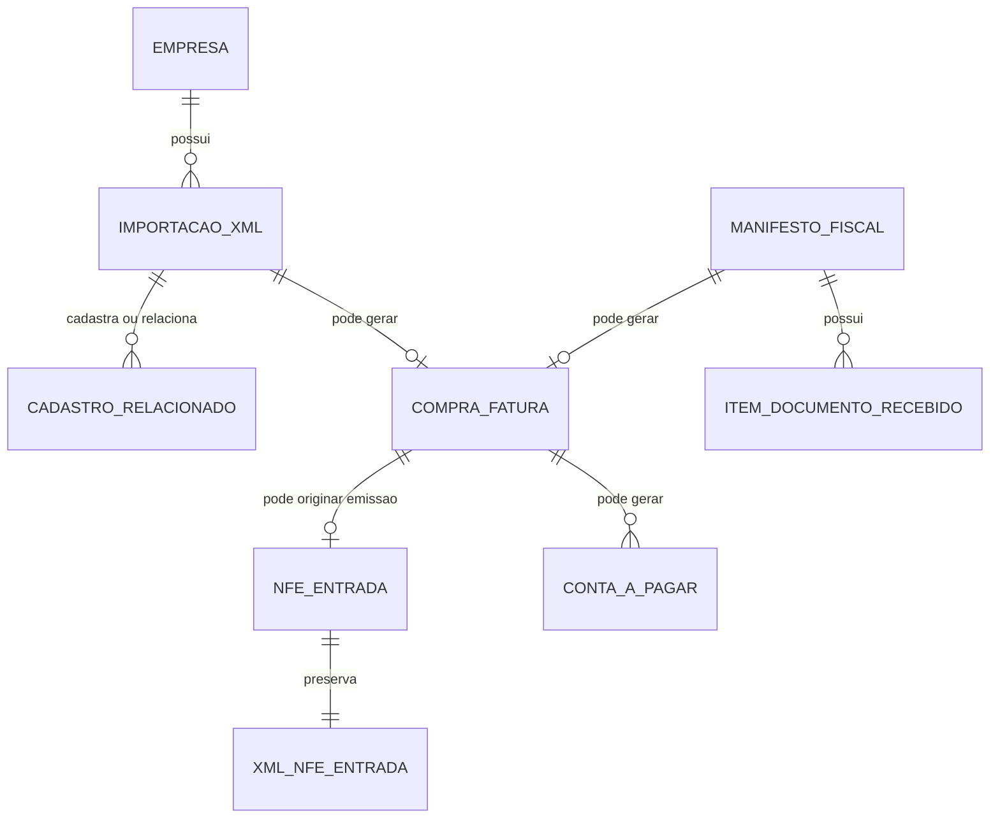

# Especificacao Funcional - Epros

**Modulo:** PLATAFORMA_COMPARTILHADA  
**Submodulo:** FATURAMENTO_FISCAL_ELETRONICO  
**Capacidade:** NFE_ENTRADA  
**Versao:** V1  
**Empresa:** Siser  
**Status:** Concluido para validacao humana  

## 1. Controle do documento

| Item | Conteudo |
|---|---|
| Responsavel pela elaboracao | Analise funcional assistida |
| Responsavel pela validacao funcional | Siser |
| Responsavel pela validacao tecnica | Siser |
| Area dona do processo | Fiscal, Compras, Estoque, Financeiro, Cadastros, Plataforma |
| Publico-alvo | Produto, negocio, implantacao, desenvolvimento, suporte, operacao fiscal |
| Fonte de verdade | Esta EF descreve a NF-e de entrada e a importacao fiscal de XML de compra no Epros |

## 2. Objetivo funcional

NF-e Entrada existe para registrar, transmitir quando aplicavel, importar, consultar e armazenar documentos fiscais eletronicos de entrada relacionados a compras, documentos de fornecedor e XML recebido.

O processo deve preservar a chave fiscal, a numeracao de entrada, o XML emitido ou importado, os status de importacao, cadastro e salvamento de PDF, e deve integrar o documento fiscal de entrada com compra, fornecedor, produtos, estoque e contas a pagar quando o material comprovar essa orquestracao.

## 3. Escopo funcional

### 3.1 Dentro do escopo

| Capacidade | Descricao | Observacao |
|---|---|---|
| Emissao NF-e de entrada sobre compra | Gera e transmite NF-e de entrada vinculada a uma compra. | Material informa rotinas de novo, transmitir e detalhe de NF-e de entrada. |
| Numeracao de entrada | Controla numero fiscal de entrada em campo especifico. | Campo `numero_nfe_entrada` comprovado. |
| Chave fiscal de entrada | Registra chave fiscal de entrada. | Campo `chave_entrada` comprovado no material. |
| XML de NF-e entrada emitida | Armazena XML de entrada emitida por CNPJ. | Caminho logico `xml_nfe_entrada/{cnpj}/` comprovado. |
| Importacao manual de XML de compra | Permite importar XML de compra recebido externamente. | Material informa importacao manual de compra. |
| XML de compra importado | Armazena XML importado de compra por CNPJ. | Caminho logico `xml_entrada/{cnpj}/` comprovado. |
| Fila/status de importacao XML | Registra XML, tipo, identificador fiscal, status e mensagens de erro. | Estrutura `importacao_xml` comprovada. |
| Cadastro a partir do XML | Cadastra ou relaciona fornecedor, produtos, unidades, tributacao e entidades associadas quando o XML permitir. | Material comprova tentativas e erros funcionais por etapa. |
| Geracao de compra a partir de documento fiscal | Permite salvar fatura/compra a partir de XML ou manifesto quando comprovado. | Flag `fatura_salva` comprovada em manifesto. |
| Atribuicao de estoque | Permite relacionar produtos do XML com estoque. | Material cita atribuicao de estoque. |
| Contas a pagar | Pode cadastrar contas a pagar a partir da compra importada. | Material comprova falha quando nenhuma conta a pagar e cadastrada. |
| Salvamento de PDF | Controla status e mensagem do salvamento de PDF associado a importacao. | Campos `StatusSalvarPdf` e `MensagemErroSalvarPdf` comprovados. |
| Consulta/listagem de importacoes | Retorna lista de importacoes e total de registros. | Contrato `data` e `totalRegistros` comprovado. |

### 3.2 Fora do escopo

| Item | Tratamento |
|---|---|
| Manifesto completo de documentos fiscais | Possui EF especifica; esta EF usa apenas o efeito comprovado de gerar compra e controlar `fatura_salva`. |
| CT-e importado | Possui EF especifica de CT-e; esta EF nao detalha transporte. |
| Devolucao fiscal | Possui EF especifica; esta EF apenas reconhece chave de entrada como referencia possivel. |
| NF-e de saida | Possui EF especifica. |
| NFC-e/PDV | Possui EF especifica. |
| Cadastros mestres de pessoa, produto, unidade, NCM, CFOP e plano de contas | Permanecem nos modulos donos; esta EF descreve o consumo/cadastro acionado pela importacao. |
| Regras completas de estoque e financeiro | Permanecem em Estoque e Financeiro; esta EF registra apenas impactos comprovados. |

## 4. Glossario funcional

| Termo | Definicao | Observacao |
|---|---|---|
| NF-e entrada | Documento fiscal eletronico de entrada relacionado a compra ou recebimento fiscal. | Pode ser emitido sobre compra ou importado por XML. |
| XML de entrada emitida | XML de NF-e de entrada gerado/transmitido pelo Epros. | Armazenado por CNPJ em pasta logica propria. |
| XML de compra importado | XML externo recebido de fornecedor e importado no Epros. | Armazenado por CNPJ em pasta logica propria. |
| Chave de entrada | Chave fiscal do documento de entrada. | Campo comprovado como `chave_entrada`. |
| Numero de entrada | Numero fiscal da NF-e de entrada. | Campo comprovado como `numero_nfe_entrada`. |
| Importacao XML | Registro operacional que guarda XML, tipo, status, mensagens e identificador fiscal. | Estrutura `importacao_xml`. |
| Status de importacao | Situacao da leitura/processamento do XML. | Dominio numerico final nao informado no material. |
| Status de cadastro | Situacao da criacao/relacionamento de cadastros a partir do XML. | Dominio numerico final nao informado no material. |
| Status de salvamento de PDF | Situacao da geracao/armazenamento do PDF do documento. | Dominio numerico final nao informado no material. |
| Fatura salva | Indicador de que a compra/fatura ja foi registrada a partir de documento fiscal recebido. | Campo `fatura_salva` comprovado em manifesto. |
| NSU | Numero sequencial usado na distribuicao de documentos fiscais. | Detalhamento completo fica na EF de manifesto. |

## 5. Atores, papeis e responsabilidades

| Ator/Papel | Responsabilidade | Permissoes esperadas | Restricoes |
|---|---|---|---|
| Operador fiscal | Emitir NF-e de entrada, consultar detalhe, importar XML e acompanhar erros. | Criar, transmitir, consultar, importar, baixar quando permitido. | Nao altera documento fiscal ja autorizado fora dos fluxos permitidos. |
| Operador de compras | Importar XML de compra, relacionar fornecedor/produtos e gerar compra quando permitido. | Importar, validar, relacionar e confirmar compra. | Nao altera parametros fiscais criticos. |
| Gestor fiscal | Validar regras fiscais, cadastros, rejeicoes e consistencia documental. | Consultar, corrigir parametros e liberar ajustes. | Deve respeitar tenant, empresa e segregacao de funcoes. |
| Operador de estoque | Validar atribuicao de produtos e efeitos de estoque. | Relacionar itens importados ao estoque quando permitido. | Nao autoriza documento fiscal. |
| Operador financeiro | Validar contas a pagar decorrentes da compra. | Consultar e complementar dados financeiros quando permitido. | Nao altera XML fiscal. |
| Integracao interna | Enviar XML ou acionar processamento de importacao. | Contrato autenticado e auditado. | Deve respeitar empresa, tenant e idempotencia. |
| Suporte | Diagnosticar falhas de importacao, cadastro, PDF e comunicacao fiscal. | Consulta auditada e reprocessamento quando autorizado. | Nao edita XML nem dados fiscais sem processo formal. |

## 6. Pre-condicoes

| Pre-condicao | Regra |
|---|---|
| Empresa existente | Empresa deve estar localizada antes de importar ou transmitir NF-e de entrada. |
| Tenant identificado | Importacao e documento de entrada devem possuir isolamento por tenant quando a estrutura exigir. |
| Compra existente para emissao | Emissao de NF-e de entrada ocorre sobre uma compra. |
| XML informado para importacao | Importacao manual exige XML enviado e legivel. |
| Documento fiscal identificavel | XML deve permitir identificar chave, tipo ou identificador fiscal quando processado. |
| Cadastros basicos acessiveis | Pessoa, produto, unidade, NCM e tributacao devem existir ou ser cadastraveis conforme permissao. |
| Plano de contas configurado | Contas a pagar dependem de plano de contas configurado para a empresa e tipo de pagamento. |
| Certificado e parametros fiscais | Transmissao de NF-e de entrada depende de parametros e certificado quando exigidos. |

## 7. Visao operacional

1. O usuario acessa a operacao de NF-e de entrada a partir de uma compra ou inicia importacao de XML recebido.
2. O Epros valida empresa, tenant, permissao e existencia da compra ou do arquivo XML.
3. Para emissao sobre compra, o Epros monta o documento de entrada, atribui numeracao de entrada, transmite quando aplicavel e grava chave/status/XML.
4. Para XML recebido, o Epros grava o XML em registro de importacao, identifica tipo, chave ou identificador fiscal e inicia processamento.
5. O Epros tenta cadastrar ou relacionar fornecedor, produtos, unidades de medida, tributacao de NCM e demais entidades exigidas pelo XML.
6. O Epros pode gerar compra/fatura e contas a pagar quando os dados e configuracoes estiverem completos.
7. O Epros registra status e mensagem separada para importacao do XML, cadastro das entidades e salvamento do PDF.
8. O usuario consulta a lista de importacoes, o detalhe da NF-e de entrada ou os erros funcionais para corrigir pendencias.
9. O processo termina com documento de entrada registrado/transmitido ou importacao pendente/erro documentado para reprocessamento.

## 8. Capacidades funcionais detalhadas

### 8.1 Emitir NF-e de entrada sobre compra

| Item | Especificacao |
|---|---|
| Objetivo | Gerar e transmitir NF-e de entrada vinculada a uma compra. |
| Acionamento | Usuario acessa nova NF-e de entrada a partir de compra e solicita transmissao. |
| Pre-condicoes | Compra existente, empresa parametrizada, certificado valido quando exigido e dados fiscais suficientes. |
| Dados de entrada | Compra, emitente/empresa, fornecedor, itens, valores, natureza fiscal, numeracao de entrada e dados fiscais aplicaveis. |
| Processamento | Validar compra, montar documento, atribuir numero de entrada, transmitir quando aplicavel e gravar retorno. |
| Resultado esperado | NF-e de entrada registrada com numero, chave, status e XML quando gerado. |
| Pos-condicoes | Documento disponivel para detalhe e consulta. |
| Excecoes | Compra nao localizada, parametros ausentes, certificado ausente, rejeicao fiscal ou falha de gravacao de XML. |
| Auditoria | Usuario/processo, empresa, compra, numero de entrada, chave, status, data/hora e mensagem de retorno. |

### 8.2 Consultar detalhe de NF-e de entrada

| Item | Especificacao |
|---|---|
| Objetivo | Exibir detalhe do documento de entrada. |
| Acionamento | Usuario consulta documento existente. |
| Pre-condicoes | Documento de entrada existente. |
| Dados de entrada | Identificador interno da compra/documento ou chave fiscal quando disponivel. |
| Processamento | Localizar documento, validar permissao e carregar dados fiscais e XML associado. |
| Resultado esperado | Detalhe fiscal consultavel. |
| Pos-condicoes | Nenhuma alteracao de estado. |
| Excecoes | Documento nao localizado ou permissao insuficiente. |
| Auditoria | Usuario, data/hora, documento consultado e empresa. |

### 8.3 Importar XML de compra

| Item | Especificacao |
|---|---|
| Objetivo | Registrar XML recebido de fornecedor e iniciar processamento fiscal/operacional. |
| Acionamento | Upload manual ou integracao interna. |
| Pre-condicoes | Empresa localizada, arquivo XML enviado e permissao valida. |
| Dados de entrada | XML, tipo de XML quando informado, empresa, usuario/processo e evento quando aplicavel. |
| Processamento | Gravar XML, identificar documento, preencher status de importacao e registrar erros quando houver. |
| Resultado esperado | Importacao criada com XML, identificador fiscal, status e mensagens. |
| Pos-condicoes | XML fica disponivel para cadastro, PDF e integracoes posteriores. |
| Excecoes | Empresa nao encontrada, XML nao enviado, nenhum XML importado, erro inesperado ou timeout de comunicacao fiscal. |
| Auditoria | Usuario/processo, data de importacao, empresa, identificador fiscal, status e mensagem. |

### 8.4 Cadastrar dados a partir do XML

| Item | Especificacao |
|---|---|
| Objetivo | Transformar dados do XML em cadastros ou vinculos operacionais. |
| Acionamento | Processamento da importacao XML ou acao de usuario. |
| Pre-condicoes | XML importado e legivel. |
| Dados de entrada | Fornecedor/destinatario, produtos, unidades de medida, NCM, tributacao e itens do documento. |
| Processamento | Cadastrar ou localizar pessoas, veiculos quando aplicavel, produtos, unidades de medida e tributacao do NCM. |
| Resultado esperado | Cadastros criados/relacionados ou erro registrado por etapa. |
| Pos-condicoes | Status de cadastro atualizado. |
| Excecoes | Pessoa nao encontrada, grupo de pessoas ausente, erro em produtos, erro em unidades, erro em tributacao ou erro inesperado. |
| Auditoria | Importacao, entidades cadastradas/relacionadas, usuario/processo, data/hora e mensagens. |

### 8.5 Gerar compra/fatura e contas a pagar

| Item | Especificacao |
|---|---|
| Objetivo | Criar compra/fatura e efeitos financeiros a partir do XML quando os dados estiverem completos. |
| Acionamento | Confirmacao do usuario, manifesto com fatura ainda nao salva ou processamento da importacao. |
| Pre-condicoes | XML processado, fornecedor/produtos relacionados, empresa com plano de contas configurado e tipo de pagamento mapeado. |
| Dados de entrada | Documento fiscal, fornecedor, itens, valores, pagamentos e parametros financeiros. |
| Processamento | Criar compra/fatura, marcar controle de fatura salva quando aplicavel e cadastrar contas a pagar. |
| Resultado esperado | Compra e contas a pagar geradas ou erro funcional registrado. |
| Pos-condicoes | Documento importado fica vinculado a compra/financeiro quando concluido. |
| Excecoes | Nenhuma compra processada com sucesso, plano de contas ausente, tipo de pagamento sem plano ou nenhuma conta a pagar cadastrada. |
| Auditoria | Importacao, compra/fatura, contas a pagar, usuario/processo, status e mensagens. |

### 8.6 Salvar PDF associado ao XML

| Item | Especificacao |
|---|---|
| Objetivo | Controlar geracao ou salvamento do PDF do documento importado. |
| Acionamento | Processamento da importacao ou acao do usuario. |
| Pre-condicoes | XML importado e dados suficientes para obter/gerar representacao PDF. |
| Dados de entrada | XML, identificador fiscal e empresa. |
| Processamento | Tentar salvar PDF, atualizar status de salvamento e registrar mensagem de erro quando houver. |
| Resultado esperado | PDF salvo ou erro funcional registrado. |
| Pos-condicoes | Status de salvamento de PDF atualizado. |
| Excecoes | Erro inesperado ao atualizar status, falha de comunicacao ou arquivo nao gerado. |
| Auditoria | Importacao, status, mensagem, usuario/processo e data/hora. |

### 8.7 Consultar importacoes XML

| Item | Especificacao |
|---|---|
| Objetivo | Listar importacoes de XML da empresa com total de registros. |
| Acionamento | Usuario acessa consulta ou integracao solicita lista. |
| Pre-condicoes | Empresa localizada e permissao valida. |
| Dados de entrada | Empresa, filtros quando informados e paginacao quando aplicavel. |
| Processamento | Consultar registros de importacao e retornar lista com total. |
| Resultado esperado | Lista de importacoes contendo dados e total de registros. |
| Pos-condicoes | Nenhuma alteracao de estado. |
| Excecoes | Empresa nao localizada, id nao encontrado ou erro inesperado. |
| Auditoria | Usuario/processo, empresa, filtros e data/hora. |

## 9. Regras de negocio

| Regra | Descricao | Condicao | Resultado | Severidade | Observacoes |
|---|---|---|---|---|---|
| REG-NFEENT-001 | NF-e de entrada deve estar vinculada a uma compra quando emitida pelo fluxo de entrada sobre compra. | Emissao de entrada. | Bloquear emissao sem compra. | Bloqueante |  |
| REG-NFEENT-002 | NF-e de entrada deve usar campo de numeracao proprio de entrada. | Atribuicao de numero fiscal. | Preencher numero de entrada. | Bloqueante | Campo `numero_nfe_entrada` comprovado. |
| REG-NFEENT-003 | NF-e de entrada deve registrar chave fiscal propria quando disponivel. | Documento de entrada com chave. | Preencher chave de entrada. | Bloqueante | Campo `chave_entrada` comprovado. |
| REG-NFEENT-004 | XML de NF-e entrada emitida deve ser armazenado em repositorio logico proprio por CNPJ. | Documento emitido/gravado. | Preservar XML. | Bloqueante | Caminho logico comprovado. |
| REG-NFEENT-005 | XML de compra importado deve ser armazenado em repositorio logico proprio por CNPJ. | Importacao de XML externo. | Preservar XML importado. | Bloqueante | Caminho logico comprovado. |
| REG-NFEENT-006 | Importacao XML exige empresa localizada. | Inicio da importacao. | Bloquear e registrar erro se empresa nao existir. | Bloqueante | Mensagens de empresa nao encontrada/localizada aparecem no material. |
| REG-NFEENT-007 | Importacao XML exige que ao menos um XML seja importado. | Upload/processamento. | Registrar erro quando nenhum XML for importado. | Bloqueante |  |
| REG-NFEENT-008 | O registro de importacao deve guardar o XML em texto. | Criacao da importacao. | Persistir conteudo XML. | Bloqueante | Campo `Xml` text comprovado. |
| REG-NFEENT-009 | O registro de importacao deve guardar tipo de XML quando informado. | Criacao/processamento. | Preencher tipo de XML. | Media | Dominio final nao informado no material. |
| REG-NFEENT-010 | O registro de importacao deve guardar identificador de NF-e quando informado. | Criacao/processamento. | Preencher identificador fiscal. | Media | Campo `NfeId` comprovado. |
| REG-NFEENT-011 | Status de importacao XML e mensagem de erro devem ser registrados separadamente do status de cadastro. | Processamento do XML. | Atualizar status e mensagem correspondentes. | Bloqueante |  |
| REG-NFEENT-012 | Status de cadastro e mensagem de erro devem ser registrados separadamente do status de salvamento do PDF. | Cadastro de entidades a partir do XML. | Atualizar status e mensagem correspondentes. | Bloqueante |  |
| REG-NFEENT-013 | Status de salvamento de PDF e mensagem de erro devem ser registrados quando houver tentativa de salvar PDF. | Salvamento de PDF. | Atualizar status e mensagem correspondentes. | Media |  |
| REG-NFEENT-014 | Erro inesperado ao salvar entidades deve manter a importacao rastreavel. | Cadastro a partir do XML. | Registrar mensagem de erro e nao perder XML. | Bloqueante |  |
| REG-NFEENT-015 | O Epros deve registrar erro quando nao encontrar pessoa/grupo necessario ao processamento. | Cadastro a partir do XML. | Bloquear etapa dependente e registrar erro. | Bloqueante |  |
| REG-NFEENT-016 | O Epros deve registrar erro quando nao conseguir cadastrar produtos do XML. | Cadastro de produtos. | Atualizar status de cadastro com erro. | Bloqueante |  |
| REG-NFEENT-017 | O Epros deve registrar erro quando nao conseguir cadastrar unidades de medida do XML. | Cadastro de unidades. | Atualizar status de cadastro com erro. | Bloqueante |  |
| REG-NFEENT-018 | O Epros deve registrar erro quando nao conseguir cadastrar tributacao de NCM. | Cadastro tributario a partir do XML. | Atualizar status de cadastro com erro. | Bloqueante |  |
| REG-NFEENT-019 | Nenhuma compra processada com sucesso deve gerar erro funcional na importacao. | Geracao de compra. | Registrar falha de processamento. | Bloqueante |  |
| REG-NFEENT-020 | Compra importada que gerar financeiro exige plano de contas configurado para a empresa. | Criacao de contas a pagar. | Bloquear ou registrar erro funcional. | Bloqueante |  |
| REG-NFEENT-021 | Tipo de pagamento sem plano de contas configurado impede criacao correta de contas a pagar. | Criacao de contas a pagar. | Registrar erro funcional. | Bloqueante |  |
| REG-NFEENT-022 | Nenhuma conta a pagar cadastrada deve ser registrada como erro da etapa financeira. | Criacao de contas a pagar. | Registrar falha da etapa financeira. | Bloqueante |  |
| REG-NFEENT-023 | Pessoa destinataria/fornecedor nao encontrada deve impedir a conclusao da etapa dependente. | Cadastro/geracao de compra. | Registrar erro funcional. | Bloqueante |  |
| REG-NFEENT-024 | Timeout de comunicacao fiscal deve ser registrado como erro da importacao ou salvamento quando ocorrer. | Comunicacao fiscal. | Registrar erro e manter processo rastreavel. | Bloqueante |  |
| REG-NFEENT-025 | Documento recebido por manifesto que ja possui fatura salva nao deve gerar duplicidade de compra. | Geracao de compra por manifesto. | Bloquear duplicidade. | Bloqueante | Campo `fatura_salva` comprovado. |
| REG-NFEENT-026 | Atribuicao de estoque a partir do XML deve relacionar item fiscal a produto/estoque antes de concluir o recebimento. | Item importado com impacto em estoque. | Exigir relacionamento ou manter pendente. | Bloqueante | Material cita atribuicao de estoque. |
| REG-NFEENT-027 | Consulta de importacoes deve retornar lista e total de registros. | Consulta/listagem. | Retornar `data` e `totalRegistros`. | Media |  |
| REG-NFEENT-028 | Id nao encontrado deve gerar erro funcional claro. | Consulta/acao por id. | Bloquear acao e informar erro. | Bloqueante |  |
| REG-NFEENT-029 | Mensagens de erro por importacao, cadastro e PDF devem suportar ate 500 caracteres quando persistidas nos campos comprovados. | Persistencia de mensagens. | Limitar mensagem. | Media | Campos varchar(500) comprovados. |
| REG-NFEENT-030 | Nome de arquivo de lote de XML deve suportar ate 150 caracteres quando usado em fila de importacao. | Fila de importacao de arquivos XML. | Limitar nome do arquivo. | Media | Campo `NomeArquivo` varchar(150) comprovado. |

## 10. Parametros de configuracao

| Parametro | Finalidade | Tipo/formato | Valor padrao | Obrigatorio | Nivel | Quem pode alterar | Impacto |
|---|---|---|---|---|---|---|---|
| Ambiente fiscal da empresa | Definir ambiente de transmissao quando houver emissao de entrada. | Enum | Nao informado no material | Condicional | Empresa | Gestor fiscal | Afeta transmissao. |
| Serie/proximo numero de entrada | Controlar numeracao fiscal de entrada. | Numero | Nao informado no material | Condicional | Empresa/filial | Gestor fiscal | Afeta emissao de entrada. |
| Certificado digital | Permitir transmissao quando exigida. | Arquivo/credencial | Nao informado no material | Condicional | Empresa/filial | Gestor fiscal | Bloqueia transmissao se ausente/invalido. |
| Plano de contas da empresa | Permitir criacao de contas a pagar. | Referencia | Nao informado no material | Condicional | Empresa | Financeiro/gestor | Bloqueia etapa financeira quando ausente. |
| Tipo de pagamento x plano de contas | Direcionar conta a pagar criada pela importacao. | Relacionamento | Nao informado no material | Condicional | Empresa | Financeiro/gestor | Bloqueia conta a pagar quando ausente. |

## 11. Modelo de dados funcional e implantavel

### 11.1 Visao geral do modelo

O modelo de NF-e entrada combina documento fiscal de entrada, XML importado, fila de arquivos XML, manifesto quando a origem for distribuicao fiscal, cadastros mestres e efeitos operacionais em compra, estoque e financeiro.

| Grupo de dados | Entidades/tabelas | Papel funcional | Observacoes |
|---|---|---|---|
| Documento de entrada | Registro de compra/entrada fiscal | Guarda numero de entrada, chave de entrada, status e vinculo com compra. | Tabela final nao informada no material para esta capacidade. |
| XML importado | `importacao_xml` | Guarda XML, tipo, identificador, status e mensagens por etapa. | Estrutura comprovada com campos e tamanhos parciais. |
| Lote/fila de XML | `importacao_arquivo_xml_saida` | Controla arquivo/lote, quantidades e status de importacao. | Nome mantido conforme estrutura comprovada; uso de saida deve ser validado na MC para entrada. |
| Manifesto recebido | `manifestos`, `manifesto_limites`, `item_dves` | Permite consulta/manifestacao, controle de fatura salva e itens vinculados. | Detalhamento completo em EF propria de manifesto. |
| Cadastros mestres | Pessoa, produto, unidade, NCM, tributacao, plano de contas | Dados consumidos/criados pela importacao. | Pertencem a Cadastros Base, Estoque e Financeiro. |
| Arquivos fiscais | `xml_nfe_entrada/{cnpj}/`, `xml_entrada/{cnpj}/` | Armazenamento logico de XML emitido/importado. | Politica de retencao final na MC. |

### 11.2 Entidades e tabelas

| Entidade funcional | Tabela/estrutura | Tipo | Finalidade | Chave primaria | Observacoes de implantacao |
|---|---|---|---|---|---|
| NF-e de entrada | Registro de compra/entrada fiscal | Movimento | Guardar documento de entrada emitido sobre compra. | Nao informado no material | Campos comprovados: `numero_nfe_entrada`, `chave_entrada`. |
| Importacao XML | `importacao_xml` | Movimento | Guardar XML importado, status e mensagens por etapa. | Nao informado no material | Possui `TenantId`, `Xml`, `TipoDeXml`, `NfeId`, status e mensagens. |
| Fila de arquivo XML | `importacao_arquivo_xml_saida` | Movimento/controle | Controlar arquivo/lote importado e contadores de processamento. | Nao informado no material | Confirmar uso para entrada na MC. |
| Manifesto fiscal | `manifestos` | Movimento | Guardar chave, tipo de manifestacao, NSU, documento, valor e controle de fatura. | Nao informado no material | Usado aqui apenas pelo impacto em compra/fatura. |
| Limite de manifesto | `manifesto_limites` | Controle | Controlar limite de consultas fiscais diarias. | Nao informado no material | Detalhamento em EF de manifesto. |
| Item de documento manifestado | `item_dves` | Relacionamento | Relacionar produto a documento manifestado. | Nao informado no material | Usado quando documento fiscal recebido alimenta estoque/compra. |
| Compra/fatura | Compra/fatura | Movimento | Representar compra gerada a partir de XML/manifesto. | Nao informado no material | Tabela final nao informada nesta EF. |
| Conta a pagar | Conta a pagar | Movimento | Representar obrigacao financeira derivada da compra. | Nao informado no material | Pertence ao modulo financeiro. |

### 11.3 Relacionamentos, cardinalidade e dependencia

| Origem | Relacionamento | Destino | Cardinalidade | Obrigatorio | Regra de integridade |
|---|---|---|---|---|---|
| Empresa | possui | Importacao XML | 1:N | Sim | Importacao exige empresa localizada. |
| Importacao XML | contem | XML | 1:1 | Sim | XML deve ser preservado em texto. |
| Importacao XML | pode gerar | Compra/fatura | 1:0..1 | Condicional | Gera compra quando dados e configuracoes forem suficientes. |
| Compra/fatura | pode gerar | Conta a pagar | 1:N | Condicional | Exige plano de contas e tipo de pagamento configurados. |
| Importacao XML | pode cadastrar/relacionar | Pessoa/produto/unidade/NCM | 1:N | Condicional | Erros por etapa devem ficar registrados. |
| Manifesto fiscal | pode gerar | Compra/fatura | 1:0..1 | Condicional | `fatura_salva` impede duplicidade. |
| Manifesto fiscal | possui | Item de documento manifestado | 1:N | Condicional | Itens vinculam documento recebido a produtos. |
| NF-e de entrada | referencia | Compra | 1:1 | Sim para emissao sobre compra | Emissao de entrada ocorre sobre compra. |
| NF-e de entrada | possui | XML de entrada emitida | 1:1 | Condicional | XML deve ser salvo quando emitido/gerado. |

### 11.4 Chaves, unicidade, indices e constraints funcionais

| Entidade/tabela | Tipo de restricao | Campo(s) | Regra | Comportamento esperado |
|---|---|---|---|---|
| NF-e de entrada | Constraint funcional | `numero_nfe_entrada` | Numero de entrada deve ser controlado separadamente da saida. | Bloquear duplicidade conforme regra final de numeracao. |
| NF-e de entrada | Indice funcional | `chave_entrada` | Chave de entrada deve localizar documento. | Permitir consulta e impedir duplicidade quando definida como unica. |
| Importacao XML | Campo obrigatorio funcional | `Xml` | XML deve existir para processamento. | Bloquear importacao vazia. |
| Importacao XML | Indice funcional | `NfeId` | Identificador fiscal deve permitir rastrear XML. | Consultar/reprocessar. |
| Importacao XML | Controle de status | `StatusImportacaoXml`, `StatusCadastro`, `StatusSalvarPdf` | Cada etapa tem status independente. | Permitir diagnostico por etapa. |
| Importacao XML | Limite de tamanho | `MensagemErroImportacaoXml`, `MensagemErroCadastro`, `MensagemErroSalvarPdf` | Mensagens persistidas possuem ate 500 caracteres. | Truncar/controlar mensagem sem perder diagnostico essencial. |
| Fila de arquivo XML | Limite de tamanho | `NomeArquivo` | Nome do arquivo possui ate 150 caracteres. | Bloquear ou ajustar nome acima do limite. |
| Manifesto fiscal | Constraint funcional | `chave`, `nsu`, `tipo` | Documento manifestado deve ser rastreavel por chave/NSU/tipo. | Evitar duplicidade de manifestacao. |
| Manifesto fiscal | Constraint funcional | `fatura_salva` | Documento ja faturado nao deve gerar compra duplicada. | Bloquear nova geracao de compra. |

### 11.5 Regras de persistencia, exclusao e historico

| Entidade/tabela | Criacao | Alteracao | Exclusao/inativacao | Historico/auditoria | Retencao |
|---|---|---|---|---|---|
| NF-e de entrada | Criada ao emitir sobre compra. | Alterada por transmissao/retorno fiscal. | Bloquear exclusao apos numero/chave fiscal. | Registrar usuario/processo, data, compra, numero, chave e status. | Nao informado no material. |
| Importacao XML | Criada ao receber XML. | Status/mensagens atualizados por etapa. | Nao informado no material. | Registrar empresa, tenant, data de importacao, status e mensagens. | Nao informado no material. |
| Fila de arquivo XML | Criada no upload/lote quando usado. | Contadores e status atualizados durante processamento. | Nao informado no material. | Registrar arquivo, quantidades e mensagem de erro. | Nao informado no material. |
| Manifesto fiscal | Criado/atualizado por consulta/manifestacao. | `tipo` e `fatura_salva` atualizados conforme evento/processamento. | Nao informado no material. | Registrar chave, NSU, tipo, documento, valor e empresa. | Nao informado no material. |
| XML fisico/logico | Criado ao emitir/importar/baixar. | Deve preservar conteudo fiscal. | Nao informado no material. | Registrar vinculo com chave/importacao. | Nao informado no material. |

### 11.6 Diagrama logico funcional

### 11.7 Lacunas de modelo de dados

| Lacuna | Entidade/tabela afetada | Impacto | Encaminhamento para MC |
|---|---|---|---|
| Tabela final da NF-e de entrada emitida nao esta fechada no material. | NF-e de entrada | Impede implantacao fisica segura de numero/chave/status. | Sim |
| Dominio dos status numericos de importacao, cadastro e PDF nao esta informado. | `importacao_xml` | Impede validacao completa de estado. | Sim |
| Politica de unicidade de chave de entrada nao esta fechada. | NF-e de entrada/importacao XML | Pode permitir duplicidade fiscal. | Sim |
| Retencao legal de XML/PDF nao esta informada. | Arquivos fiscais | Impacto fiscal/compliance. | Sim |
| Relacao final entre importacao XML, compra, estoque e contas a pagar nao possui contrato completo. | Integracoes | Pode gerar efeitos incompletos. | Sim |

## 12. Dicionario de dados implantavel

### 12.1 NF-e de entrada sobre compra

| Campo | Tipo/formato | Tamanho/dominio | Obrigatorio | Chave/relacao | Regra/observacao |
|---|---|---|---|---|---|
| Id | Identificador | Nao informado no material | Sim | Chave primaria | Identificador interno do documento de entrada. |
| EmpresaId | Identificador | Nao informado no material | Sim | Empresa | Empresa dona do documento. |
| CompraId | Identificador | Nao informado no material | Sim | Compra | Compra que origina a NF-e de entrada. |
| numero_nfe_entrada | Numero | Nao informado no material | Sim | Numero fiscal de entrada | Numeracao especifica de entrada. |
| chave_entrada | Texto | Nao informado no material | Condicional | Chave fiscal | Chave da NF-e de entrada quando disponivel. |
| Status | Texto/enum | Nao informado no material | Sim | Estado fiscal | Estado do documento de entrada. |
| XmlEntrada | Arquivo/XML | XML | Condicional | Arquivo fiscal | XML armazenado em `xml_nfe_entrada/{cnpj}/`. |
| DataEmissao | Data/hora | Nao informado no material | Condicional | Documento fiscal | Data de emissao quando informada. |
| ValorTotal | Decimal | Nao informado no material | Condicional | Documento fiscal | Total fiscal da entrada quando informado. |
| MensagemRetorno | Texto | Nao informado no material | Nao | Retorno fiscal | Mensagem de rejeicao/retorno quando houver. |

### 12.2 `importacao_xml`

| Campo | Tipo/formato | Tamanho/dominio | Obrigatorio | Chave/relacao | Regra/observacao |
|---|---|---|---|---|---|
| Id | Identificador | Nao informado no material | Sim | Chave primaria | Identificador interno da importacao. |
| TenantId | Texto | varchar(200) | Sim | Tenant | Isolamento da importacao. |
| Xml | Texto/XML | text | Sim | Conteudo fiscal | XML importado deve ser preservado. |
| TipoDeXml | Enum/numero | Nao informado no material | Nao | Tipo de documento | Dominio final nao informado no material. |
| NfeId | Texto | varchar(100) | Nao | Identificador fiscal | Identificador da NF-e quando extraido. |
| StatusImportacaoXml | Enum/numero | Nao informado no material | Nao | Status da etapa | Status da leitura/importacao do XML. |
| MensagemErroImportacaoXml | Texto | varchar(500) | Nao | Mensagem da etapa | Erro da etapa de importacao. |
| StatusCadastro | Enum/numero | Nao informado no material | Nao | Status da etapa | Status do cadastro/relacionamento de entidades. |
| MensagemErroCadastro | Texto | varchar(500) | Nao | Mensagem da etapa | Erro de cadastro de pessoas, produtos, unidades, tributacao ou entidades. |
| StatusSalvarPdf | Enum/numero | Nao informado no material | Nao | Status da etapa | Status da geracao/salvamento de PDF. |
| MensagemErroSalvarPdf | Texto | varchar(500) | Nao | Mensagem da etapa | Erro da etapa de PDF. |
| CodigoSefaz | Codigo | Nao informado no material | Nao | Retorno fiscal | Codigo retornado quando disponivel. |
| TipoEvento | Texto | varchar(100) | Nao | Evento fiscal | Evento associado quando aplicavel. |
| dataImportacao | Data/hora | Nao informado no material | Nao | Auditoria | Campo comprovado no contrato de consulta. |

### 12.3 `importacao_arquivo_xml_saida`

| Campo | Tipo/formato | Tamanho/dominio | Obrigatorio | Chave/relacao | Regra/observacao |
|---|---|---|---|---|---|
| Id | Identificador | Nao informado no material | Sim | Chave primaria | Identificador interno do arquivo/lote. |
| TenantId | Texto | varchar(200) | Sim | Tenant | Isolamento do lote. |
| NomeArquivo | Texto | varchar(150) | Sim | Arquivo | Nome do arquivo importado. |
| QtdXmls | Numero | Nao informado no material | Nao | Contador | Quantidade de XMLs no lote. |
| QtdXmlsInvalidos | Numero | Nao informado no material | Nao | Contador | Quantidade de XMLs invalidos. |
| QtdProdutosLocalizados | Numero | Nao informado no material | Nao | Contador | Produtos encontrados. |
| QtdClientesLocalizados | Numero | Nao informado no material | Nao | Contador | Clientes/pessoas encontrados. |
| QtdProdutosImportados | Numero | Nao informado no material | Nao | Contador | Produtos importados. |
| QtdClientesImportados | Numero | Nao informado no material | Nao | Contador | Clientes/pessoas importados. |
| Status | Enum/numero | Nao informado no material | Nao | Status do lote | Dominio final nao informado no material. |
| MensagemErro | Texto | varchar(500) | Nao | Mensagem do lote | Mensagem de erro do processamento. |

### 12.4 Manifesto fiscal usado como origem de compra

| Campo | Tipo/formato | Tamanho/dominio | Obrigatorio | Chave/relacao | Regra/observacao |
|---|---|---|---|---|---|
| chave | Texto | Nao informado no material | Sim | Chave fiscal | Identifica documento recebido. |
| tipo | Numero/enum | 0=sem, 1=ciencia, 2=confirmacao, 3=desconhecimento, 4=operacao nao realizada | Sim | Tipo de manifestacao | Detalhamento completo em EF de manifesto. |
| nsu | Texto/numero | Nao informado no material | Condicional | Sequencial fiscal | Usado em consulta de documentos. |
| fatura_salva | Booleano | Sim/Nao | Nao | Controle de compra | Impede duplicidade de compra/fatura. |
| location_id | Identificador | Nao informado no material | Nao | Filial/local | Identifica local operacional quando informado. |
| documento | Texto | Nao informado no material | Nao | Documento | Documento da parte envolvida quando informado. |
| valor | Decimal | Nao informado no material | Nao | Valor fiscal | Valor do documento recebido. |

### 12.5 Contrato de consulta de importacoes

| Campo | Tipo/formato | Tamanho/dominio | Obrigatorio | Chave/relacao | Regra/observacao |
|---|---|---|---|---|---|
| data | Lista | Importacoes XML | Sim | Resultado | Lista de registros de importacao. |
| totalRegistros | Numero | number | Sim | Resultado | Total de registros encontrados. |
| id | Numero | number | Sim | Importacao XML | Identificador exibido na consulta. |
| mensagemErroCadastro | Texto | string ou nulo | Nao | Importacao XML | Mensagem da etapa de cadastro. |
| mensagemErroImportacaoXml | Texto | string ou nulo | Nao | Importacao XML | Mensagem da etapa de importacao. |
| mensagemErroSalvarPdf | Texto | string ou nulo | Nao | Importacao XML | Mensagem da etapa de PDF. |
| nfeId | Texto | string ou nulo | Nao | Importacao XML | Identificador fiscal. |
| statusCadastro | Numero | number ou nulo | Nao | Importacao XML | Status da etapa de cadastro. |
| statusImportacaoXml | Numero | number ou nulo | Nao | Importacao XML | Status da etapa de importacao. |
| statusSalvarPdf | Numero | number ou nulo | Nao | Importacao XML | Status da etapa de PDF. |
| tipoDeXml | Numero | number ou nulo | Nao | Importacao XML | Tipo do XML. |
| tipoEvento | Texto | string ou nulo | Nao | Importacao XML | Tipo de evento. |
| dataImportacao | Data/hora | string ou nulo | Nao | Importacao XML | Data da importacao. |

## 13. Estados e transicoes

| Estado | Definicao | Entrada | Saida permitida |
|---|---|---|---|
| XML recebido | XML foi enviado ao Epros. | Upload/integracao. | Em processamento, erro de importacao. |
| Em processamento | XML esta sendo lido e transformado em dados operacionais. | XML recebido. | Cadastro concluido, erro de cadastro, PDF pendente. |
| Cadastro concluido | Entidades necessarias foram cadastradas ou relacionadas. | Processamento de cadastro. | Compra gerada, PDF salvo, pendente financeiro. |
| Erro de importacao | XML nao foi importado/processado. | Falha de XML, empresa ou comunicacao. | Reprocessamento quando permitido. |
| Erro de cadastro | Dados do XML nao puderam gerar cadastros/relacoes. | Falha em pessoa, produto, unidade, NCM ou entidade. | Correcao e reprocessamento. |
| PDF salvo | Representacao PDF foi salva. | Salvamento concluido. | Consulta/download quando permitido. |
| Erro de PDF | PDF nao foi salvo. | Falha de salvamento. | Reprocessamento quando permitido. |
| Compra gerada | Compra/fatura foi criada a partir do XML ou manifesto. | Confirmacao/processamento. | Estoque/financeiro conforme modulo dono. |
| NF-e entrada transmitida | Documento de entrada foi transmitido quando aplicavel. | Transmissao. | Autorizada ou rejeitada. |
| Autorizada | Documento fiscal aceito. | Retorno fiscal autorizado. | Consulta/download/eventos permitidos. |
| Rejeitada | Documento fiscal recusado. | Retorno fiscal rejeitado. | Correcao/retransmissao quando permitido. |

## 14. Integracoes e impactos

| Integracao | Direcao | Dados | Regra |
|---|---|---|---|
| Compras | Entrada/Saida | Compra, fatura, fornecedor, itens, XML, chave, valor | Importacao XML e manifesto podem gerar compra/fatura. |
| Estoque | Saida | Produtos, itens, atribuicao de estoque | Item importado deve ser relacionado antes do efeito de estoque. |
| Financeiro | Saida | Contas a pagar, plano de contas, tipo de pagamento | Conta a pagar depende de plano de contas configurado. |
| Cadastros Base | Entrada/Saida | Pessoa, produto, unidade, NCM, tributacao | Importacao pode cadastrar ou relacionar dados mestres. |
| Plataforma | Entrada/Saida | Tenant, empresa, permissao, auditoria, arquivos | Toda importacao/transmissao deve respeitar isolamento e auditoria. |
| Manifesto fiscal | Entrada | Chave, NSU, tipo, XML, `fatura_salva` | Pode gerar compra sem duplicidade. |

## 15. Telas e operacao esperada

| Tela/acao | Objetivo | Dados principais | Observacao |
|---|---|---|---|
| Nova NF-e entrada | Iniciar emissao sobre compra. | Compra, empresa, fornecedor, itens e parametros. | Material comprova acao de novo documento por compra. |
| Transmitir NF-e entrada | Enviar documento fiscal de entrada. | Documento, numero de entrada, XML e retorno. | Material comprova acao de transmissao. |
| Detalhe NF-e entrada | Consultar documento de entrada. | Compra/documento, chave, status, XML. | Material comprova acao de detalhe. |
| Importar XML de compra | Receber XML externo. | Empresa, XML, tipo de XML quando informado. | Material comprova importacao manual de compra. |
| Lista de importacoes XML | Acompanhar importacoes e erros. | Status, mensagens, identificador fiscal e data. | Contrato de lista com total comprovado. |
| Salvar fatura/compra | Gerar compra a partir de XML/manifesto. | Fornecedor, itens, valores, pagamentos. | Deve respeitar `fatura_salva` quando origem for manifesto. |
| Atribuir estoque | Relacionar itens do XML ao estoque. | Item fiscal, produto, quantidade e unidade. | Material cita atribuicao de estoque. |

## 16. Relatorios, consultas e downloads

| Saida | Conteudo | Filtro/chave | Observacao |
|---|---|---|---|
| Lista de importacoes | Importacoes XML e total de registros. | Empresa e filtros nao detalhados. | Campos do contrato preservados. |
| Detalhe da NF-e entrada | Dados fiscais, status, chave e XML. | Identificador interno ou chave quando disponivel. | Material comprova detalhe. |
| XML de entrada emitida | XML fiscal gerado pelo Epros. | CNPJ/chave quando disponivel. | Repositorio logico `xml_nfe_entrada/{cnpj}/`. |
| XML de compra importado | XML recebido de fornecedor. | CNPJ/chave/importacao quando disponivel. | Repositorio logico `xml_entrada/{cnpj}/`. |
| PDF do documento | Representacao do documento fiscal. | Importacao/documento. | Status de salvamento de PDF deve ser controlado. |

## 17. Mensagens e excecoes funcionais

| Codigo | Mensagem/condicao | Contexto |
|---|---|---|
| MSG-NFEENT-001 | Empresa nao encontrada. | Importacao XML. |
| MSG-NFEENT-002 | Empresa nao localizada. | Consulta/importacao XML. |
| MSG-NFEENT-003 | Id nao encontrado. | Consulta ou acao por identificador. |
| MSG-NFEENT-004 | Nenhum XML importado. | Upload/processamento de XML. |
| MSG-NFEENT-005 | Erro ao salvar entidades na transacao. | Cadastro a partir do XML. |
| MSG-NFEENT-006 | Erro inesperado ao salvar entidades. | Cadastro a partir do XML. |
| MSG-NFEENT-007 | Erro inesperado ao obter XMLs. | Consulta/processamento XML. |
| MSG-NFEENT-008 | Erro inesperado ao cadastrar pessoas ou veiculos. | Cadastro a partir do XML. |
| MSG-NFEENT-009 | Erro inesperado ao cadastrar produtos. | Cadastro de produtos. |
| MSG-NFEENT-010 | Erro inesperado ao cadastrar unidades de medida. | Cadastro de unidades. |
| MSG-NFEENT-011 | Erro inesperado ao cadastrar tributacao do NCM. | Cadastro tributario. |
| MSG-NFEENT-012 | Nenhuma pessoa encontrada para o grupo de pessoas da empresa. | Cadastro de pessoas. |
| MSG-NFEENT-013 | Nenhuma compra foi processada com sucesso. | Geracao de compra. |
| MSG-NFEENT-014 | Empresa nao possui plano de contas configurado. | Geracao financeira. |
| MSG-NFEENT-015 | Plano de contas nao configurado para tipo de pagamento. | Geracao financeira. |
| MSG-NFEENT-016 | Nenhuma conta a pagar foi cadastrada. | Geracao financeira. |
| MSG-NFEENT-017 | Pessoa nao encontrada. | Cadastro/financeiro/compra. |
| MSG-NFEENT-018 | Erro inesperado ao atualizar status para salvar PDF. | Salvamento de PDF. |
| MSG-NFEENT-019 | Timeout ao comunicar com servico fiscal. | Comunicacao fiscal. |

## 18. Criterios de aceite

| ID | Criterio | Resultado esperado |
|---|---|---|
| CA-NFEENT-001 | Importar XML sem empresa localizada. | Epros bloqueia e registra mensagem funcional. |
| CA-NFEENT-002 | Importar lote sem XML valido. | Epros registra que nenhum XML foi importado. |
| CA-NFEENT-003 | Processar XML com erro de produto. | Epros registra erro de cadastro sem perder o XML. |
| CA-NFEENT-004 | Processar XML com erro de unidade de medida. | Epros registra erro de cadastro sem perder o XML. |
| CA-NFEENT-005 | Processar XML com erro de tributacao de NCM. | Epros registra erro de cadastro sem perder o XML. |
| CA-NFEENT-006 | Gerar compra sem plano de contas. | Epros bloqueia etapa financeira e registra erro. |
| CA-NFEENT-007 | Gerar contas a pagar sem plano por tipo de pagamento. | Epros registra erro funcional. |
| CA-NFEENT-008 | Manifesto com fatura ja salva. | Epros nao gera compra duplicada. |
| CA-NFEENT-009 | Consultar importacoes. | Epros retorna lista `data` e `totalRegistros`. |
| CA-NFEENT-010 | Transmitir NF-e entrada sobre compra valida. | Epros registra numero de entrada, chave/status/XML quando retornados. |

## 19. Lacunas enviadas para MC

| Lacuna | Motivo |
|---|---|
| Tabela final da NF-e entrada emitida | Material comprova campos e fluxo, mas nao fecha modelo fisico canonico. |
| Dominio dos status de importacao/cadastro/PDF | Campos existem, mas valores possiveis nao estao detalhados. |
| Contrato final de integracao compra/estoque/financeiro | Material comprova orquestracao, mas nao detalha todos os eventos e rollback. |
| Politica de retencao XML/PDF | Material comprova caminhos logicos, mas nao regra legal de guarda. |
| Permissoes finais por ator | Material comprova operacoes, mas nao fecha matriz de autorizacao do Epros. |

## 20. Nota de elaboracao

[^1]: O agrupamento "Registro de compra/entrada fiscal" e uma denominacao funcional usada nesta EF para organizar campos comprovados de NF-e de entrada enquanto o nome da tabela final nao esta informado no material. A MC registra essa decisao como lacuna para validacao.
