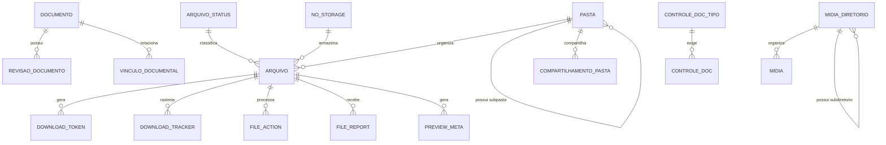

# Especificacao Funcional - Epros

**Projeto:** Epros  
**Empresa:** Siser  
**Tipo de documento:** Especificacao Funcional definitiva  
**Versao:** V1  
**Modulo:** PLATAFORMA_COMPARTILHADA  
**Submodulo:** GESTAO_ELETRONICA_DE_DOCUMENTOS_GED  
**Status:** Em revisao  
**Ultima atualizacao:** 2026-06-07

## 1. Controle do documento

| Item | Conteudo |
|---|---|
| Responsavel pela elaboracao | Analise funcional assistida |
| Responsavel pela validacao funcional | Siser |
| Responsavel pela validacao tecnica | Siser |
| Area dona do processo | Plataforma, Operacao, Seguranca da informacao, Juridico, Fiscal, RH, Projetos |
| Publico-alvo | Produto, negocio, implantacao, desenvolvimento, suporte, operacao |
| Fonte de verdade | Esta EF e a fonte funcional definitiva do submodulo |

## 2. Objetivo funcional

O submodulo Gestao Eletronica de Documentos GED centraliza no Epros o armazenamento, classificacao, versionamento, busca, visualizacao, upload, download, compartilhamento, controle de acesso, moderacao e governanca de documentos e arquivos usados pelos modulos do sistema.

| Pergunta | Resposta |
|---|---|
| Para que o submodulo existe? | Para oferecer um repositorio documental e de arquivos compartilhado, seguro, versionado e auditavel para o Epros. |
| Que problema de negocio resolve? | Evita que cada modulo mantenha arquivos de forma isolada, sem governanca de permissao, revisao, retencao, download e armazenamento. |
| Qual resultado operacional deve produzir? | Documentos e arquivos cadastrados, versionados, classificados, armazenados, pesquisaveis, baixaveis, compartilhados e auditados conforme permissao. |
| Quais areas dependem dele? | Plataforma, Cadastros, Fiscal, Financeiro, RH, Projetos, Vendas, Compras, Qualidade, Governanca, Relatorios e Assinatura Eletronica. |

## 3. Escopo funcional

### 3.1 Dentro do escopo

| Capacidade | Descricao | Observacao |
|---|---|---|
| Documento logico | Cadastro de documento com nome, categoria, subcategoria, status, vigencia, responsavel, template e documento relacionado. | Inclui revisao atual. |
| Revisao de documento | Controle de versoes de arquivo, com numero de revisao, nome de arquivo, extensao, MIME, log de mudanca e vinculo com documento. | Revisao e entidade separada. |
| Controle de entrega documental | Tipo de documento, pessoa, periodo, entrega, data de entrada e checklist de pendentes. | Usado para controle mensal e relatorio. |
| Biblioteca de midia/arquivo | Upload, listagem, download, exclusao, diretorios e selecao reutilizavel por outros modulos. | Inclui escopo por tenant e autoria. |
| Pastas e albuns | Estrutura hierarquica, privacidade em cascata, capa, senha, tamanho acumulado e links de compartilhamento. | Pasta default/sistema nao deve ser removida. |
| Upload | Upload direto, em lote, por URL remota, por API, por partes, com validacao de tipo, tamanho, quota e bloqueio por hash. | Upload remoto pode usar fila. |
| Download | Download por URL curta, link direto, token, senha, nivel minimo, captcha/paginas intermediarias, limites de concorrencia e retomada. | Inclui rastreamento. |
| Storage | Configuracao de disco ativo, storage local/nuvem, selecao de servidor, fila de mover/excluir/restaurar arquivos e estatisticas de uso. | Configuracao de storage precisa governanca. |
| Deduplicacao | Reuso de bytes quando hash/tamanho indicarem arquivo ja armazenado. | Mantem registros logicos separados. |
| Compartilhamento | Link publico, compartilhamento interno por usuario, niveis view/upload_download/all e chave de acesso. | Deve respeitar privacidade. |
| Tags e classificacao | Catalogo publico de tags e tags por arquivo. | Tags tambem podem atender outros recursos. |
| Preview | Miniaturas, cache de preview, metadados de imagem, watermark e preview de imagem/audio/video/documento quando aplicavel. | Regras finais de formatos na MC. |
| Moderacao e seguranca | Status do arquivo, denuncias, bloqueio de hash, moderacao administrativa, fila de acoes, downloads ativos e historico. | Inclui status active/user removed/admin removed/copyright removed/system expired. |

### 3.2 Fora do escopo

| Item fora do escopo | Motivo | Destino correto |
|---|---|---|
| Regra de negocio do modulo que gerou o anexo | GED armazena e governa o arquivo; o significado operacional pertence ao modulo dono. | Modulo originador |
| Assinatura eletronica completa | GED armazena documentos e revisoes, mas assinatura e fluxo proprio. | PLATAFORMA_COMPARTILHADA / ASSINATURA_ELETRONICA |
| Retencao juridica completa por tipo documental | Material indica necessidade, mas nao fecha tabela normativa. | MC deste submodulo e Compliance |
| OCR e busca full-text | Material registra ausencia. | MC deste submodulo |
| Formularios publicos de denuncia incompletos | Material mostra administracao e esquema, mas nao confirma submissao publica completa. | MC deste submodulo |
| Cadastro mestre de pessoa, contrato, projeto, cliente ou colaborador | GED referencia esses registros, mas nao os mantem. | Modulos donos |

## 4. Glossario e conceitos funcionais

| Termo | Definicao funcional | Observacoes |
|---|---|---|
| GED | Gestao Eletronica de Documentos. | Repositorio documental e de arquivos do Epros. |
| Documento logico | Registro de negocio que representa um documento, independente do arquivo fisico. | Pode ter revisoes. |
| Revisao | Versao de arquivo associada ao documento. | Uma revisao pode ser atual. |
| Arquivo | Registro de conteudo armazenado com metadados, status, hash, caminho, dono, pasta e controle de acesso. | Tambem atende midia e anexos. |
| Midia | Arquivo reutilizavel por telas e modulos, normalmente selecionado via biblioteca. | Possui diretorio e URL de acesso. |
| Pasta | Agrupador hierarquico de arquivos. | Pode ter privacidade, senha e compartilhamento. |
| Album | Pasta publica ou navegavel como colecao. | Pode ter capa e senha. |
| Share key | Chave de compartilhamento de pasta. | Permite acesso conforme nivel. |
| Token de download | Token temporario para download direto. | Material informa expiracao padrao de 24h. |
| File status | Status operacional do arquivo. | active, user removed, admin removed, copyright removed, system expired. |
| Hash do arquivo | Identificador tecnico usado para deduplicacao ou bloqueio. | O algoritmo final seguro fica na MC. |
| Download tracker | Registro de download ativo ou historico para controlar concorrencia e auditoria. | Inclui status. |
| File action | Acao assincrona de arquivo como excluir, mover ou restaurar. | Processada em fila. |

## 5. Atores, papeis e responsabilidades

| Ator/Papel | Responsabilidade | Permissoes esperadas | Restricoes |
|---|---|---|---|
| Usuario autenticado | Enviar, consultar, baixar, organizar e compartilhar seus arquivos. | Upload, download, editar metadados proprios, mover para pasta permitida. | Respeita quota, permissao e tenant. |
| Gestor de documentos | Aprovar, rejeitar, inativar e classificar documentos. | Manter categorias, status, revisoes e checklist. | Nao acessa documentos fora do escopo autorizado. |
| Aprovador | Aprovar ou rejeitar documento em analise. | Aprovar, rejeitar e registrar motivo. | Precisa trilha de decisao. |
| Administrador Siser | Governar storage, servidores, moderacao, filas, status e bloqueios. | Administracao global e operacional. | Acesso auditado e segregado. |
| Moderador | Revisar denuncias, alterar status e solicitar remocao. | Listar arquivos, aceitar/recusar denuncia, mover/excluir quando permitido. | Acoes destrutivas exigem nivel superior. |
| Modulo consumidor | Anexar, consultar ou baixar arquivos vinculados ao seu processo. | Acesso via contrato de integracao. | Deve respeitar ownership e permissao do recurso. |
| Visitante com link | Acessar arquivo/pasta compartilhado. | Visualizar ou baixar conforme chave/senha. | Nao pode ultrapassar nivel de compartilhamento. |

## 6. Visao operacional do submodulo

1. O usuario ou modulo consumidor cria um documento, arquivo, pasta, midia ou revisao.
2. O Epros valida tenant, usuario, permissao, quota, tipo permitido, tamanho, nome, hash bloqueado, pasta de destino e origem de upload.
3. O arquivo pode ser gravado diretamente, em lote, por URL remota, por API ou por partes.
4. A persistencia grava metadados, caminho, servidor/disco, hash, status, dono, uploader, pasta, origem e auditoria.
5. O documento logico pode apontar para uma revisao atual; novas revisoes preservam historico e log de mudanca.
6. Pastas organizam arquivos, podem ser privadas/publicas, protegidas por senha, compartilhadas por usuario ou link.
7. Downloads validam status, permissao, senha, nivel minimo, token, limite de concorrencia, pagina intermediaria e captcha quando configurados.
8. Administradores monitoram arquivos, denuncias, downloads ativos, fila de acoes, servidores e paginas de download.
9. Eventos e auditoria registram upload, download, renomeacao, exclusao, copia, move, alteracao de visibilidade, aprovacao, rejeicao e moderacao.

## 7. Capacidades funcionais

### 7.1 Documento logico e revisoes

| Item | Especificacao |
|---|---|
| Objetivo | Controlar documentos com versoes, metadados, vigencia e arquivo atual. |
| Acionamento | Manual, por modulo consumidor ou por processo de assinatura/aprovacao. |
| Pre-condicoes | Usuario autenticado, permissao e arquivo/revisao quando exigido. |
| Dados de entrada | Nome, categoria, subcategoria, status, data ativa, data de expiracao, revisao, arquivo, responsavel e relacionamento opcional. |
| Processamento | Criar documento, criar revisao, mover arquivo para revisao, atualizar revisao atual no documento e registrar log. |
| Resultado esperado | Documento consultavel com revisao atual e historico de revisoes. |
| Pos-condicoes | Revisoes anteriores preservadas, arquivo atual apontado, permissao aplicada. |
| Excecoes | Nome ausente, data ativa ausente, arquivo ausente quando obrigatorio, permissao negada, documento externo invalido. |
| Auditoria | Criador, responsavel, data/hora, revisao, arquivo, log de mudanca e exclusao logica. |

### 7.2 Upload e biblioteca de arquivos

| Item | Especificacao |
|---|---|
| Objetivo | Permitir envio controlado de arquivos para uso em documentos, midia, projetos e anexos. |
| Acionamento | Upload direto, lote, URL remota, API ou partes. |
| Pre-condicoes | Permissao de upload, quota disponivel e tipos/tamanhos aceitos. |
| Dados de entrada | Arquivo, pasta, owner, uploader, origem, chave de lote, URL remota ou token/API. |
| Processamento | Validar, gravar temporario quando aplicavel, mover para storage, deduplicar, criar registro e atualizar estatisticas. |
| Resultado esperado | Arquivo ativo com URL, metadados, status, pasta e retorno de sucesso total/parcial/falha. |
| Pos-condicoes | Quota e estatisticas atualizadas; cache de preview pode ser gerado. |
| Excecoes | Tipo bloqueado, palavra bloqueada, tamanho invalido, quota excedida, upload global bloqueado, hash bloqueado, arquivo zero byte quando proibido. |
| Auditoria | IP, usuario dono, usuario uploader, origem de upload, data, tamanho, hash e erros. |

### 7.3 Pastas, albuns e compartilhamento

| Item | Especificacao |
|---|---|
| Objetivo | Organizar arquivos e permitir compartilhamento seguro interno ou externo. |
| Acionamento | CRUD de pasta, mover arquivo, gerar link, compartilhar por usuario ou acessar album. |
| Pre-condicoes | Permissao de pasta e ownership ou chave de compartilhamento valida. |
| Dados de entrada | Nome, pasta pai, privacidade, senha, capa, watermark, exibir links de download, usuario compartilhado e nivel de permissao. |
| Processamento | Criar hierarquia, copiar permissoes da pasta pai, validar duplicidade no mesmo pai, gerar chave, aplicar privacidade em cascata. |
| Resultado esperado | Pasta organizada, compartilhada e navegavel conforme acesso. |
| Pos-condicoes | Arquivos permanecem associados ou removem pasta ao excluir pasta. |
| Excecoes | Pasta default/sistema nao pode ser excluida; pasta pai fora do owner bloqueia alteracao; senha invalida bloqueia acesso. |
| Auditoria | Criacao, edicao, exclusao, compartilhamento, acesso por chave e ultima utilizacao. |

### 7.4 Download, links e rastreamento

| Item | Especificacao |
|---|---|
| Objetivo | Baixar arquivos de forma segura, rastreavel e controlada por regras de acesso. |
| Acionamento | URL curta, URL longa, link direto, token, pasta, anexo ou gestor. |
| Pre-condicoes | Arquivo ativo, permissao, privacidade, senha/nivel e storage disponivel. |
| Dados de entrada | ShortUrl, token, hash de exclusao, share key, pasta, arquivo e range quando retomada. |
| Processamento | Resolver arquivo, validar status, senha, nivel minimo, conta obrigatoria, paginas intermediarias, captcha, limites de concorrencia e token. |
| Resultado esperado | Download completo, parcial ou bloqueio funcional com motivo. |
| Pos-condicoes | Contadores, visitas, ultimo acesso, banda e tracker atualizados quando aplicavel. |
| Excecoes | Download global bloqueado, arquivo removido, copyright removed, senha ausente, nivel insuficiente, excesso de threads, storage indisponivel. |
| Auditoria | IP, usuario, arquivo, token, inicio/fim, status, offset, data e origem. |

### 7.5 Administracao, moderacao e seguranca

| Item | Especificacao |
|---|---|
| Objetivo | Governar arquivos, denuncias, filas, servidores e download pages. |
| Acionamento | Admin/Moderador ou rotina. |
| Pre-condicoes | Nivel administrativo adequado. |
| Dados de entrada | Filtros, status, usuario, servidor, origem, denuncia, motivo, acao de fila. |
| Processamento | Listar, alterar status, editar metadados, aceitar/recusar denuncia, bloquear hash, mover/excluir/restaurar por fila e auditar. |
| Resultado esperado | Acao administrativa aplicada ou pendente em fila. |
| Pos-condicoes | Status, fila, storage, report e notificacoes atualizados. |
| Excecoes | Acao destrutiva sem nivel suficiente, fila em processamento, arquivo inexistente, senha admin invalida. |
| Auditoria | Moderador, data/hora, motivo, status anterior/novo, arquivo e acao executada. |

## 8. Regras de negocio

| Regra | Descricao | Condicao | Resultado | Severidade | Observacoes |
|---|---|---|---|---|---|
| REG-001 | Documento deve possuir nome logico obrigatorio. | Criacao/edicao de documento. | Bloquear salvamento. | Bloqueante |  |
| REG-002 | Documento deve possuir data ativa obrigatoria. | Criacao/edicao de documento. | Bloquear salvamento. | Bloqueante |  |
| REG-003 | Revisao deve possuir identificador de revisao obrigatorio. | Criacao de revisao. | Bloquear salvamento. | Bloqueante |  |
| REG-004 | Documento novo sem identificador deve receber identificador unico antes de salvar revisao. | Criacao de documento. | Criar documento e revisao vinculada. | Bloqueante |  |
| REG-005 | Ao criar revisao, o documento deve apontar para a revisao atual. | Nova revisao salva. | Atualizar ponteiro de revisao atual. | Bloqueante |  |
| REG-006 | Documento externo deve gravar tipo, ID remoto e URL remota quando informados. | Documento externo selecionado. | Registrar referencia externa. | Bloqueante |  |
| REG-007 | Usuario sem permissao de detalhe nao deve receber URL de arquivo. | Consulta de documento/arquivo. | Ocultar URL. | Bloqueante |  |
| REG-008 | Exclusao de documento deve marcar documento e revisoes como excluidos logicamente. | Exclusao autorizada. | Soft delete. | Bloqueante |  |
| REG-009 | Exclusao de revisao deve remover tambem o arquivo fisico quando nao houver compartilhamento fisico ativo. | Revisao removida. | Remover ou enfileirar remocao. | Bloqueante |  |
| REG-010 | Upload deve validar permissao dedicada. | Envio de arquivo. | Bloquear sem permissao. | Bloqueante |  |
| REG-011 | Upload deve respeitar tipo, MIME, tamanho maximo e tamanho minimo configurados. | Envio de arquivo. | Bloquear arquivo invalido. | Bloqueante |  |
| REG-012 | Upload deve bloquear extensoes ou palavras proibidas no nome do arquivo. | Envio de arquivo. | Bloquear arquivo. | Bloqueante |  |
| REG-013 | Upload deve bloquear hash previamente bloqueado. | Hash existente em bloqueio. | Recusar upload. | Bloqueante |  |
| REG-014 | Upload em lote deve retornar sucesso total, sucesso parcial ou falha total. | Envio de multiplos arquivos. | Informar resultado por arquivo. | Bloqueante |  |
| REG-015 | Quota de storage deve comparar uso atual mais novo lote. | Envio de arquivo. | Bloquear se exceder. | Bloqueante |  |
| REG-016 | Quota ilimitada deve ser tratada como sem limite. | Limite igual a -1 no material. | Permitir conforme demais regras. | Bloqueante |  |
| REG-017 | Upload por URL remota deve validar URL e registrar progresso quando processado em fila. | Upload remoto. | Criar fila ou processar diretamente. | Bloqueante |  |
| REG-018 | Upload por partes deve aguardar todos os blocos antes de persistir o arquivo final. | Upload com Content-Range. | Manter temporario ate completar. | Bloqueante |  |
| REG-019 | Upload abortado com tamanho divergente deve descartar arquivo temporario quando configurado. | Tamanho final divergente. | Remover temporario. | Bloqueante |  |
| REG-020 | Arquivo duplicado por hash e tamanho pode reutilizar bytes fisicos sem duplicar storage. | Upload de conteudo ja ativo. | Criar novo registro logico e reutilizar caminho. | Informativa |  |
| REG-021 | Remocao de um registro nao deve apagar bytes quando outro arquivo ativo usa o mesmo hash. | Deduplicacao ativa. | Preservar arquivo fisico. | Bloqueante |  |
| REG-022 | Arquivo deve possuir status operacional. | Criacao/manutencao de arquivo. | Registrar status. | Bloqueante | Dominio: active, user removed, admin removed, copyright removed, system expired. |
| REG-023 | Remocao pelo usuario altera status para user removed. | Usuario remove arquivo. | Atualizar status. | Bloqueante |  |
| REG-024 | Remocao administrativa altera status para admin removed. | Admin remove arquivo. | Atualizar status. | Bloqueante |  |
| REG-025 | Remocao por sistema altera status para system expired. | Rotina remove arquivo. | Atualizar status. | Bloqueante |  |
| REG-026 | Pasta default/sistema nao pode ser excluida. | Exclusao de pasta default. | Bloquear. | Bloqueante |  |
| REG-027 | Nome de pasta deve ser unico dentro do mesmo pai e dono. | Criacao/edicao de pasta. | Bloquear duplicidade. | Bloqueante |  |
| REG-028 | Criacao de subpasta deve herdar compartilhamentos da pasta pai quando informado. | Pasta com parentId. | Copiar permissoes. | Bloqueante |  |
| REG-029 | Exclusao de pasta deve remover a pasta recursivamente, mas nao deve excluir arquivos; arquivos ficam sem pasta. | Exclusao de pasta. | Definir folderId nulo ou mover conforme configuracao. | Bloqueante |  |
| REG-030 | Privacidade da pasta deve ser avaliada em cascata ate a raiz. | Acesso a pasta/arquivo. | Bloquear se qualquer ancestral privado sem permissao. | Bloqueante |  |
| REG-031 | Compartilhamento de pasta aceita niveis view, upload_download e all. | Criacao de compartilhamento. | Aplicar nivel. | Bloqueante |  |
| REG-032 | Chave de compartilhamento pode permitir acesso externo conforme nivel e privacidade. | Acesso com share key. | Liberar acesso permitido. | Bloqueante |  |
| REG-033 | Ultimo acesso do compartilhamento deve ser atualizado ao usar link. | Acesso a pasta compartilhada. | Atualizar last_accessed. | Informativa |  |
| REG-034 | Arquivo privado exige owner, permissao, senha ou share key valida. | Acesso/download. | Bloquear se nao cumprir. | Bloqueante |  |
| REG-035 | Arquivo com senha deve exigir validacao antes do download. | Download de arquivo protegido. | Bloquear ate senha valida. | Bloqueante |  |
| REG-036 | Pasta com senha deve exigir validacao antes da navegacao quando nao houver share key suficiente. | Acesso a album/pasta. | Bloquear ate senha valida. | Bloqueante |  |
| REG-037 | Download deve recusar arquivo com status removido, expirado ou bloqueado por copyright. | Download de arquivo nao ativo. | Redirecionar/bloquear conforme status. | Bloqueante |  |
| REG-038 | Download deve respeitar nivel minimo de usuario quando configurado. | minUserLevel preenchido. | Bloquear usuario insuficiente. | Bloqueante |  |
| REG-039 | Download por token deve respeitar expiracao, velocidade e maximo de threads definidos no token. | Link direto com token. | Permitir ou bloquear. | Bloqueante |  |
| REG-040 | Token de download deve expirar em 24 horas quando este for o padrao aplicado. | Criacao de token. | Definir validade. | Bloqueante |  |
| REG-041 | Download deve controlar concorrencia e retornar bloqueio quando exceder limite. | Excesso de downloads simultaneos. | Bloquear com erro funcional. | Bloqueante |  |
| REG-042 | Download deve suportar retomada parcial por intervalo de bytes. | Cliente solicita range. | Retornar conteudo parcial. | Informativa |  |
| REG-043 | Download deve atualizar visitas, total de downloads e ultimo acesso quando aplicavel. | Download concluido/visualizacao. | Atualizar estatisticas. | Informativa |  |
| REG-044 | Paginas intermediarias de download devem respeitar ordem e tempo de espera configurados. | Download com interstitial. | Controlar fluxo antes do binario. | Bloqueante |  |
| REG-045 | Captcha de download deve ser exibido quando configurado. | Download com captcha. | Bloquear ate validacao. | Bloqueante |  |
| REG-046 | Fila de acao deve aceitar delete, move e restore. | Acao assincrona de arquivo. | Criar item pendente. | Bloqueante |  |
| REG-047 | Fila de acao deve possuir status pending, processing, complete, failed ou cancelled. | Processamento da fila. | Atualizar status. | Bloqueante |  |
| REG-048 | Servidor de arquivo pode estar disabled, active ou read only. | Selecao de storage. | Usar somente servidor apto. | Bloqueante |  |
| REG-049 | Selecao de servidor deve considerar metodo configurado, prioridade, capacidade e fallback. | Upload/storage. | Escolher servidor disponivel. | Bloqueante |  |
| REG-050 | Download pode ser roteado pelo site principal ou por dominio direto do servidor. | Configuracao de servidor. | Montar URL correta. | Bloqueante |  |
| REG-051 | Bloqueio global de uploads impede novos envios, exceto papel administrativo permitido. | Upload global bloqueado. | Bloquear upload. | Bloqueante |  |
| REG-052 | Bloqueio global de downloads impede novos downloads, exceto papel administrativo permitido. | Download global bloqueado. | Bloquear download. | Bloqueante |  |
| REG-053 | Administracao de arquivos deve permitir filtro por texto, usuario, servidor, status e origem. | Tela administrativa. | Retornar listagem filtrada. | Informativa |  |
| REG-054 | Moderacao pode aceitar ou recusar denuncia, atualizando status da denuncia. | Analise de report. | Status accepted ou cancelled. | Bloqueante |  |
| REG-055 | Denuncia deve registrar arquivo, status, dados do denunciante, IP, assinatura digital e observacoes quando informados. | Submissao de denuncia. | Registrar report. | Bloqueante | Submissao publica completa fica na MC. |
| REG-056 | Bloqueio futuro por hash deve impedir novos uploads do mesmo conteudo. | Hash bloqueado. | Bloquear upload. | Bloqueante |  |
| REG-057 | Tags de arquivo devem poder ser editadas substituindo o conjunto anterior pelo conjunto novo. | Atualizacao de tags. | Remover antigas e adicionar novas. | Informativa |  |
| REG-058 | Tag publica deve ter titulo limpo e nao duplicar tipo+titulo. | Cadastro de tag. | Bloquear duplicidade. | Bloqueante |  |
| REG-059 | Bulk download deve gerar ZIP temporario e evitar nomes duplicados dentro do pacote. | Download em lote. | Gerar arquivo compactado. | Bloqueante |  |
| REG-060 | Copia entre projetos deve validar acesso ao projeto destino. | Copia de arquivos. | Bloquear se destino nao autorizado. | Bloqueante |  |
| REG-061 | Arquivo visivel ao cliente em projeto deve gerar evento e notificacao quando configurado. | Upload com visibilidade cliente. | Publicar evento e e-mail. | Informativa |  |
| REG-062 | Thumbnail/preview deve falhar sem interromper upload. | Falha em miniatura. | Preservar upload e registrar falha. | Informativa |  |
| REG-063 | Preview de arquivo deve respeitar permissao base de download/visualizacao. | Acesso a preview. | Bloquear sem permissao. | Bloqueante |  |
| REG-064 | Controle documental mensal deve permitir lancamento multi-mes. | Configuracao de checklist. | Gerar periodos. | Bloqueante |  |
| REG-065 | Baixa de checklist deve atualizar entregue e data de entrada. | Entrega de documento. | Marcar entregue. | Bloqueante |  |
| REG-066 | Consulta de checklist deve permitir somente pendentes. | Filtro pendentes. | Exibir entregue=false. | Informativa |  |
| REG-067 | Status de documento de RH deve aceitar apenas pending, approve ou reject. | Atualizacao de status. | Bloquear valor fora do dominio. | Bloqueante |  |
| REG-068 | Categoria do documento deve ser numerica quando informada. | Cadastro de documento. | Bloquear valor invalido. | Bloqueante |  |
| REG-069 | Data efetiva deve ser data valida. | Cadastro de documento. | Bloquear valor invalido. | Bloqueante |  |
| REG-070 | Uploaded_by e approved_by devem ser numericos quando informados. | Cadastro/aprovacao. | Bloquear valor invalido. | Bloqueante |  |

## 9. Parametros de configuracao

| Parametro | Finalidade | Tipo/formato | Valor padrao | Obrigatorio | Nivel | Quem pode alterar | Impacto |
|---|---|---|---|---|---|---|---|
| Storage ativo | Define disco/servidor de armazenamento. | Enum | Nao informado no material | Sim | Global/tenant | Administrador Siser | Upload/download. |
| Tipos permitidos | Define extensoes/MIME aceitos. | Lista | Nao informado no material | Sim | Global/tenant | Administrador Siser | Upload. |
| Tamanho maximo de arquivo | Limita upload. | Numero bytes/MB | Nao informado no material | Sim | Global/tenant/plano | Administrador Siser | Upload/quota. |
| Upload bloqueado global | Suspende uploads. | Booleano | Nao informado no material | Nao | Global | Administrador Siser | Operacao. |
| Download bloqueado global | Suspende downloads. | Booleano | Nao informado no material | Nao | Global | Administrador Siser | Operacao. |
| Forcar arquivos privados | Torna arquivos privados por politica. | Booleano | Nao informado no material | Nao | Global/tenant | Administrador Siser | Privacidade. |
| Geracao de URL curta | Define algoritmo de URL. | Enum | Nao informado no material | Sim | Global | Administrador Siser | Links. |
| Exibir nome na URL | Controla nome em link publico. | Booleano | Nao informado no material | Nao | Global | Administrador Siser | Privacidade/UX. |
| Bulk download | Habilita download em lote. | Booleano | Nao informado no material | Nao | Global/tenant/projeto | Gestor | Operacao. |
| Pastas habilitadas | Habilita organizacao por pastas. | Booleano | Nao informado no material | Sim | Global/tenant/projeto | Gestor | UX/permissao. |
| Gerenciar pastas por perfil | Define quem pode criar/editar pastas. | Flags | Nao informado no material | Sim | Projeto/tenant | Gestor | Permissao. |
| Paginas intermediarias de download | Define paginas, ordem, tempo e JS adicional. | Estruturado | Nao informado no material | Nao | Global/plano | Administrador Siser | Download. |
| Threads maximas de download | Limita concorrencia por perfil. | Numero | Nao informado no material | Nao | Global/plano | Administrador Siser | Performance. |
| Retencao de arquivos removidos | Periodo para purge fisico. | Minutos/dias | Nao informado no material | Sim | Global | Administrador Siser | Storage/compliance. |

## 10. Modelo de dados funcional e implantavel

### 10.1 Visao geral do modelo

| Grupo de dados | Entidades/tabelas | Papel funcional | Observacoes |
|---|---|---|---|
| Documentos versionados | documents, document_revisions, linked_documents | Documento logico, revisoes e vinculos com documentos/contratos. | Separar metadado e arquivo. |
| Controle documental | controle_doc_tipo, controle_doc | Checklist por pessoa/tipo/periodo. | Nomes funcionais normalizados. |
| Midia e diretorios | media, media_directories | Biblioteca reutilizavel de arquivos e diretorios. | Possui tenant/dono e autor. |
| Arquivos centrais | file, file_status | Registro de arquivo, URL, hash, status, storage, pasta, owner e estatisticas. | Base operacional do GED. |
| Pastas e compartilhamento | file_folder, file_folder_share | Arvore, album, senha, privacidade e share key. | Permissoes view/upload_download/all. |
| Upload remoto | remote_url_download_queue | Fila de download remoto com progresso. | Cria arquivo ao concluir. |
| Download controlado | download_page, download_token, download_tracker | Paginas intermediarias, links temporarios e rastreamento. | Inclui concorrencia e status. |
| Storage distribuido | file_server, file_server_status, file_action | Servidores, status, fila de mover/excluir/restaurar. | Processamento assincrono. |
| Moderacao e bloqueio | file_report, file_block_hash | Denuncias e bloqueio de conteudo futuro. | Submissao publica incompleta na MC. |
| Preview | plugin_filepreviewer_meta, plugin_filepreviewer_watermark, plugin_filepreviewer_embed_token | Metadados de preview, watermark e token de embed. | Nome fisico mantido como estrutura funcional de preview. |
| Tags | tags | Catalogo e classificacao por recurso. | Usa tipo e id de recurso. |

### 10.2 Entidades e tabelas

| Entidade funcional | Tabela/estrutura | Tipo | Finalidade | Chave primaria | Observacoes de implantacao |
|---|---|---|---|---|---|
| Documento | documents | Mestre | Documento logico versionado. | id | PK char(36) no material. |
| Revisao de documento | document_revisions | Movimento | Versao fisica/logica do documento. | id | PK char(36) no material. |
| Vinculo documental | linked_documents | Relacionamento | Relaciona documentos e revisoes em contratos/documentos. | Nao informado no material | Encapsular por servico funcional. |
| Tipo de controle documental | controle_doc_tipo | Mestre | Tipo de documento exigido em checklist. | Nao informado no material | Exige descricao. |
| Controle documental | controle_doc | Movimento | Entrega por pessoa/tipo/periodo. | Nao informado no material | Entregue e DataEntrada. |
| Diretorio de midia | media_directories | Mestre | Hierarquia de diretorios da biblioteca. | id | parent_id self-reference. |
| Midia | media | Movimento | Registro de arquivo da biblioteca de midia. | id | directory_id pode ser nulo. |
| Arquivo | file | Movimento | Arquivo central do GED. | id | 30 campos mapeados. |
| Status de arquivo | file_status | Auxiliar | Status operacional do arquivo. | id | 5 valores. |
| Pasta de arquivo | file_folder | Mestre | Arvore de pastas/albuns. | id | Total size e privacidade. |
| Compartilhamento de pasta | file_folder_share | Relacionamento | Link/usuario compartilhado. | id | access_key unico. |
| Fila de URL remota | remote_url_download_queue | Movimento | Progresso de importacao por URL. | Nao informado no material | job_status com 6 estados. |
| Pagina de download | download_page | Auxiliar | Paginas intermediarias do download. | id | Por nivel/plano. |
| Token de download | download_token | Movimento | Link direto temporario. | token | token unico. |
| Rastreador de download | download_tracker | Movimento | Download ativo/historico. | Nao informado no material | Status downloading/finished/error/cancelled. |
| Servidor de arquivo | file_server | Mestre | Storage fisico/logico. | id | Tipo, dominio, capacidade e acelerador. |
| Status de servidor | file_server_status | Auxiliar | Estado do servidor. | id | disabled, active, read only. |
| Acao de arquivo | file_action | Movimento | Fila delete/move/restore. | id | Status de processamento. |
| Denuncia de arquivo | file_report | Movimento | Report de abuso/copyright. | Nao informado no material | status pending/cancelled/accepted. |
| Bloqueio por hash | file_block_hash | Auxiliar | Impede novos uploads. | file_hash | Unico. |
| Preview meta | plugin_filepreviewer_meta | Auxiliar | Metadados/caches de preview. | Nao informado no material | Vinculado a file_id. |
| Preview watermark | plugin_filepreviewer_watermark | Configuracao | Watermark por conta/global. | Nao informado no material | Configuracao de preview. |
| Preview embed token | plugin_filepreviewer_embed_token | Movimento | Token para preview externo. | Nao informado no material | Token de embed. |
| Tags | tags | Auxiliar | Classificacao publica ou por recurso. | Nao informado no material | tagresource_type e tagresource_id. |

### 10.3 Relacionamentos, cardinalidade e dependencia

| Origem | Relacionamento | Destino | Cardinalidade | Obrigatorio | Regra de integridade |
|---|---|---|---|---|---|
| documents | possui | document_revisions | 1:N | Condicional | Documento aponta revisao atual. |
| document_revisions | pertence a | documents | N:1 | Sim | Revisao exige document_id. |
| documents | relaciona | documents/document_revisions | N:1 | Nao | Documento relacionado e revisao relacionada. |
| controle_doc | referencia | controle_doc_tipo | N:1 | Sim | Tipo documental exigido. |
| controle_doc | referencia | pessoa | N:1 | Sim | Pessoa pertence a Cadastros. |
| media_directories | possui pai | media_directories | N:1 | Nao | parent_id cria hierarquia. |
| media | pertence a | media_directories | N:1 | Nao | Ao excluir diretorio, media fica sem diretorio. |
| file | pertence a | file_status | N:1 | Sim | Status operacional. |
| file | pertence a | file_folder | N:1 | Nao | Arquivo pode ficar sem pasta. |
| file | pertence a | file_server | N:1 | Sim | serverId default 1. |
| file_folder | possui pai | file_folder | N:1 | Nao | Arvore de pastas. |
| file_folder_share | pertence a | file_folder | N:1 | Sim | Compartilhamento de pasta. |
| file_action | referencia | file | N:1 | Nao | Algumas acoes usam apenas caminho. |
| download_token | referencia | file | N:1 | Sim | Token baixa arquivo. |
| download_tracker | referencia | file | N:1 | Sim | Rastreia download. |
| file_report | referencia | file | N:1 | Sim | Report sobre arquivo. |
| file_block_hash | bloqueia | file.hash | Nao informado | Sim | Hash unico bloqueado. |
| tags | classifica | recurso | N:N funcional | Nao | Tipo e id do recurso. |

### 10.4 Chaves, unicidade, indices e constraints funcionais

| Entidade/tabela | Tipo de restricao | Campo(s) | Regra | Comportamento esperado |
|---|---|---|---|---|
| documents | PK | id | Identificador unico. | Bloquear duplicidade. |
| documents | Obrigatorio | document_name, active_date | Campos obrigatorios. | Bloquear salvamento. |
| document_revisions | PK | id | Identificador unico da revisao. | Bloquear duplicidade. |
| document_revisions | Obrigatorio | revision | Revisao obrigatoria. | Bloquear salvamento. |
| media_directories | Unico | slug | Slug unico. | Bloquear duplicidade. |
| media | Unico | uuid | UUID unico quando informado. | Bloquear duplicidade. |
| file | PK | id | Identificador do arquivo. | Bloquear duplicidade. |
| file | Unico | unique_hash | Hash unico do registro. | Bloquear duplicidade. |
| file_folder_share | Unico | access_key | Chave publica unica. | Bloquear duplicidade. |
| download_token | Unico | token | Token temporario unico. | Bloquear duplicidade. |
| file_block_hash | Unico | file_hash | Hash bloqueado unico. | Bloquear duplicidade. |
| file_folder | Unico funcional | userId, parentId, folderName | Nome unico no mesmo pai/dono. | Bloquear duplicidade. |
| n/a | Constraint funcional | Pasta default | Pasta default nao pode ser excluida. | Bloquear exclusao. |

### 10.5 Regras de persistencia, exclusao e historico

| Entidade/tabela | Criacao | Alteracao | Exclusao/inativacao | Historico/auditoria | Retencao |
|---|---|---|---|---|---|
| Documento | Criado com metadados e revisao quando aplicavel. | Atualiza status, relacionamento e revisao atual. | Soft delete. | Criador, responsavel, datas, revisoes. | MC |
| Revisao | Criada a cada nova versao. | Nao deve sobrescrever historico. | Soft delete e remocao de arquivo quando aplicavel. | Revision, change_log, arquivo. | MC |
| Arquivo | Criado apos upload/storage. | Metadados, pasta, senha, status, contador. | Status logico e purge assincrono. | IP, uploader, owner, origem, hash. | Configuravel |
| Pasta | Criada por owner/permissao. | Nome, pai, privacidade, senha, capa. | Recursiva; arquivos ficam sem pasta. | Compartilhamentos e acessos. | MC |
| Download | Criado em tracker/token. | Atualiza status, offsets e fim. | Purge por periodo. | IP, usuario, arquivo. | Configuravel |
| Servidor | Criado por admin. | Capacidade, status, config e acesso. | Nao informado no material. | Alteracoes e teste de conexao. | MC |
| File action | Criada como pending. | processing/complete/failed/cancelled. | Auto prune 180 dias informado no material. | Status_msg e datas. | 180 dias para fila antiga |
| Denuncia | Criada quando fluxo existir. | accepted/cancelled. | Nao informado no material. | Denunciante, IP, moderador. | MC |

### 10.6 Diagrama logico funcional

### 10.7 Lacunas de modelo de dados

| Lacuna | Entidade/tabela afetada | Impacto | Encaminhamento para MC |
|---|---|---|---|
| Modelo final unico entre documento, arquivo, midia e anexo nao esta fechado. | documents, media, file | Risco de duplicidade de repositorios. | Sim |
| Algoritmo final de hash/senha nao deve copiar formato antigo sem revisao de seguranca. | fileHash, accessPassword, file_block_hash | Risco de seguranca. | Sim |
| Submissao publica de denuncia nao esta completa no material. | file_report | Risco de fluxo incompleto. | Sim |
| Retencao por tipo documental nao informada. | Documentos, arquivos, reports, tokens | Risco juridico e LGPD. | Sim |

## 11. Dicionario de dados implantavel

### 11.1 Entidade: Documento

**Finalidade:** representar o documento logico, seus metadados, status e revisao atual.

| Campo | Tipo/formato | Tamanho/precisao/dominio | Obrigatorio | Chave/relacionamento | Regra funcional/observacao |
|---|---|---|---|---|---|
| id | Texto | char(36) | Sim | PK | Identificador unico. |
| document_name | Texto | varchar(255) | Sim | Informativo | Nome logico do documento. |
| document_revision_id | Texto | varchar(36) | Nao informado no material | FK | Revisao atual. |
| doc_type | Enum | Nao informado no material | Nao informado no material | Regra | Tipo interno ou externo. |
| doc_id | Texto | varchar(100) | Nao | Integracao | ID remoto. |
| doc_url | Texto | varchar(255) | Nao | Integracao | URL remota. |
| category_id | Enum | Nao informado no material | Nao | Classificacao | Categoria. |
| subcategory_id | Enum | Nao informado no material | Nao | Classificacao | Subcategoria. |
| status_id | Enum | Nao informado no material | Nao informado no material | Status | Estado funcional. |
| active_date | Data | date | Sim | Vigencia | Data ativa/publicacao. |
| exp_date | Data | date | Nao | Vigencia | Data expiracao. |
| related_doc_id | Texto/id | Nao informado no material | Nao | Relacionamento | Documento relacionado. |
| related_doc_rev_id | Texto/id | Nao informado no material | Nao | Relacionamento | Revisao relacionada. |
| is_template | Booleano | Nao informado no material | Nao | Regra | Indica template. |
| template_type | Enum | Nao informado no material | Nao | Regra | Tipo de template. |
| assigned_user_id | Texto/id | Nao informado no material | Nao | Responsavel | Responsavel. |
| deleted | Booleano | Nao informado no material | Nao | Exclusao | Soft delete. |

| Item | Especificacao |
|---|---|
| Chave primaria | id |
| Chaves unicas | Nao informado no material |
| Relacionamentos | Revisoes, documento relacionado, revisao relacionada, vinculos documentais |
| Cardinalidade | 1:N revisoes |
| Historico/auditoria | Datas, usuario, revisao atual, status e soft delete |
| Regras de exclusao | Soft delete; revisoes relacionadas marcadas como excluidas |
| Retencao de dados | Nao informado no material |

### 11.2 Entidade: Revisao de documento

**Finalidade:** manter versoes fisicas/logicas associadas ao documento.

| Campo | Tipo/formato | Tamanho/precisao/dominio | Obrigatorio | Chave/relacionamento | Regra funcional/observacao |
|---|---|---|---|---|---|
| id | Texto | char(36) | Sim | PK | Identificador da revisao. |
| document_id | Texto | varchar(36) | Sim | FK | Documento pai. |
| revision | Texto | varchar(100) | Sim | Informativo | Numero/identificador da versao. |
| filename | Arquivo/texto | varchar | Nao informado no material | Informativo | Nome do arquivo. |
| file_ext | Texto | varchar(100) | Nao | Informativo | Extensao. |
| file_mime_type | Texto | varchar(100) | Nao | Informativo | MIME. |
| change_log | Texto | varchar(255) | Nao | Auditoria | Log de mudanca. |
| doc_type | Enum | Nao informado no material | Nao | Regra | Tipo interno/externo. |
| doc_id | Texto | varchar(100) | Nao | Integracao | ID remoto. |
| doc_url | Texto | varchar(255) | Nao | Integracao | URL remota. |
| created_by | Texto/id | Nao informado no material | Nao | Auditoria | Usuario criador. |
| date_entered | Data/hora | datetime | Nao informado no material | Auditoria | Criacao. |
| date_modified | Data/hora | datetime | Nao informado no material | Auditoria | Alteracao. |
| deleted | Booleano | Nao informado no material | Nao | Exclusao | Soft delete. |

| Item | Especificacao |
|---|---|
| Chave primaria | id |
| Chaves unicas | Nao informado no material |
| Relacionamentos | Documento pai |
| Cardinalidade | N:1 |
| Historico/auditoria | Revision, change_log, datas e criador |
| Regras de exclusao | Soft delete e remocao de binario quando aplicavel |
| Retencao de dados | Nao informado no material |

### 11.3 Entidade: Controle documental

**Finalidade:** controlar entrega de documentos por pessoa, tipo e periodo.

| Campo | Tipo/formato | Tamanho/precisao/dominio | Obrigatorio | Chave/relacionamento | Regra funcional/observacao |
|---|---|---|---|---|---|
| ID_Documento | Numero | Nao informado no material | Sim | FK | Tipo/documento exigido. |
| TipoPessoa | Enum | Nao informado no material | Nao informado no material | Regra | Tipo da pessoa. |
| ID_Pessoa | Numero | Nao informado no material | Sim | FK | Pessoa relacionada. |
| Periodo | Data/periodo | Nao informado no material | Nao informado no material | Regra | Periodo de entrega. |
| Entregue | Booleano | true/false | Sim | Status | Indica baixa. |
| DataEntrada | Data | Nao informado no material | Condicional | Auditoria | Data da entrega. |
| Descricao do tipo | Texto | Nao informado no material | Sim | Informativo | Tipo exige descricao. |
| Grupo contabil | FK | Nao informado no material | Nao informado no material | Relacionamento | Tipo vinculado a grupo contabil no material. |

| Item | Especificacao |
|---|---|
| Chave primaria | Nao informado no material |
| Chaves unicas | Nao informado no material |
| Relacionamentos | Tipo documental, pessoa e grupo contabil |
| Cardinalidade | Pessoa 1:N controles |
| Historico/auditoria | Baixa, DataEntrada, filtro pendente |
| Regras de exclusao | Exclusao exige identificador |
| Retencao de dados | Nao informado no material |

### 11.4 Entidade: Midia

**Finalidade:** registrar arquivo reutilizavel na biblioteca de midia.

| Campo | Tipo/formato | Tamanho/precisao/dominio | Obrigatorio | Chave/relacionamento | Regra funcional/observacao |
|---|---|---|---|---|---|
| id | Numero | bigint | Sim | PK | Identificador. |
| model_type | Texto | Nao informado no material | Nao informado no material | Relacionamento | Origem polimorfica. |
| model_id | Numero | Nao informado no material | Nao informado no material | Relacionamento | Origem polimorfica. |
| uuid | UUID | unique nullable | Nao | Unico | Identificador tecnico. |
| collection_name | Texto | string | Sim | Classificacao | Material informa collection_name=files. |
| name | Texto | string | Nao informado no material | Informativo | Nome logico. |
| file_name | Texto | string | Nao informado no material | Informativo | Nome fisico. |
| mime_type | Texto | string nullable | Nao | Informativo | MIME. |
| disk | Texto | string | Sim | Storage | Disco ativo. |
| size | Numero | unsignedBigInteger | Sim | Informativo | Tamanho em bytes. |
| directory_id | Numero | unsignedBigInteger nullable | Nao | FK | Diretorio. |
| creator_id | Numero | foreignId nullable | Nao | Auditoria | Autor fisico. |
| created_by | Numero | foreignId nullable | Nao | Tenant/dono | Dono logico/tenant. |
| created_at | Data/hora | datetime nullable | Nao | Auditoria | Criacao. |
| updated_at | Data/hora | datetime nullable | Nao | Auditoria | Alteracao. |

| Item | Especificacao |
|---|---|
| Chave primaria | id |
| Chaves unicas | uuid quando informado |
| Relacionamentos | Diretorio de midia e origem polimorfica |
| Cardinalidade | Diretorio 1:N midias |
| Historico/auditoria | creator_id, created_by, datas |
| Regras de exclusao | Remover blob e registro; fallback de exclusao deve ser controlado |
| Retencao de dados | Nao informado no material |

### 11.5 Entidade: Diretorio de midia

**Finalidade:** organizar midias em diretorios hierarquicos.

| Campo | Tipo/formato | Tamanho/precisao/dominio | Obrigatorio | Chave/relacionamento | Regra funcional/observacao |
|---|---|---|---|---|---|
| id | Numero | bigint | Sim | PK | Identificador. |
| name | Texto | string | Sim | Informativo | Nome do diretorio. |
| slug | Texto | string unique | Sim | Unico | Identificador amigavel. |
| parent_id | Numero | foreignId nullable | Nao | FK self | Hierarquia. |
| creator_id | Numero | foreignId | Sim | Auditoria | Autor. |
| created_by | Numero | foreignId | Sim | Tenant/dono | Dono logico. |
| created_at | Data/hora | datetime | Nao informado no material | Auditoria | Criacao. |
| updated_at | Data/hora | datetime | Nao informado no material | Auditoria | Alteracao. |

| Item | Especificacao |
|---|---|
| Chave primaria | id |
| Chaves unicas | slug |
| Relacionamentos | Parent self-reference e midias |
| Cardinalidade | 1:N subdiretorios; 1:N midias |
| Historico/auditoria | creator_id, created_by, datas |
| Regras de exclusao | Subdiretorio em cascata; midia fica sem diretorio quando aplicavel |
| Retencao de dados | Nao informado no material |

### 11.6 Entidade: Arquivo

**Finalidade:** registrar o arquivo central do GED com storage, acesso, status e estatisticas.

| Campo | Tipo/formato | Tamanho/precisao/dominio | Obrigatorio | Chave/relacionamento | Regra funcional/observacao |
|---|---|---|---|---|---|
| id | Numero | int(11) auto incremento | Sim | PK | Identificador. |
| originalFilename | Texto | varchar(255) | Sim | Informativo | Nome original. |
| shortUrl | Texto | varchar(255) | Nao | Unico funcional | URL curta. |
| fileType | Texto | varchar(140) | Nao | Informativo | Tipo geral. |
| extension | Texto | varchar(10) | Nao | Informativo | Extensao. |
| fileSize | Numero | bigint(15) | Nao | Informativo | Tamanho. |
| localFilePath | Texto | varchar(255) | Nao | Storage | Caminho fisico. |
| userId | Numero | int(11) | Nao | FK | Dono. |
| uploadedUserId | Numero | Nao informado no material | Nao | FK | Quem fez upload. |
| totalDownload | Numero | int(11) | Nao | Estatistica | Total downloads. |
| uploadedIP | Texto | varchar(45) | Nao | Auditoria | IP upload. |
| uploadedDate | Data/hora | timestamp | Nao | Auditoria | Data upload. |
| statusId | Numero | int(2) | Nao | FK | Status. |
| visits | Numero | int(11) default 0 | Nao | Estatistica | Visitas. |
| lastAccessed | Data/hora | timestamp | Nao | Auditoria | Ultimo acesso. |
| deleteHash | Texto | varchar(32) | Nao | Seguranca | Hash para exclusao por link. |
| folderId | Numero | int(11) | Nao | FK | Pasta. |
| serverId | Numero | int(11) default 1 | Nao | FK | Servidor. |
| adminNotes | Texto | text | Nao | Moderacao | Notas administrativas. |
| fileLevel | Enum | free, premium | Sim | Regra | Nivel do arquivo. |
| accessPassword | Texto | varchar(32) | Nao | Seguranca | Senha protegida; algoritmo final na MC. |
| fileHash | Texto | varchar(32) | Nao | Deduplicacao | Hash de storage. |
| originalFileHash | Texto | varchar(32) | Nao | Deduplicacao | Hash original. |
| apikey | Texto | varchar(32) | Sim | Integracao | Chave associada. |
| minUserLevel | Numero | int(3) | Nao | Permissao | Nivel minimo. |
| linkedFileId | Numero | int(11) | Nao | Relacionamento | Uso nao confirmado. |
| keywords | Texto | varchar(255) | Nao | Busca | Palavras extraidas do nome. |
| isPublic | Numero/booleano | int(1) default 1 | Sim | Privacidade | Publico/privado. |
| total_likes | Numero | int(11) default 0 | Sim | Estatistica | Curtidas. |
| uploadSource | Enum | direct, remote, ftp, torrent, leech, webdav, api, other | Sim | Auditoria | Origem do upload. |
| unique_hash | Texto | varchar(64) | Nao | Unico | Identificador unico global. |

| Item | Especificacao |
|---|---|
| Chave primaria | id |
| Chaves unicas | unique_hash; shortUrl funcionalmente unico |
| Relacionamentos | Status, pasta, servidor, usuario dono/uploader |
| Cardinalidade | Pasta 1:N arquivos; servidor 1:N arquivos |
| Historico/auditoria | IP, data, origem, status, downloads, visitas |
| Regras de exclusao | Remocao logica por status e purge fisico em fila |
| Retencao de dados | Configuravel; regra final na MC |

### 11.7 Entidade: Pasta de arquivo

**Finalidade:** organizar arquivos em arvore e album.

| Campo | Tipo/formato | Tamanho/precisao/dominio | Obrigatorio | Chave/relacionamento | Regra funcional/observacao |
|---|---|---|---|---|---|
| id | Numero | int auto incremento | Sim | PK | Identificador. |
| userId | Numero | int | Sim | FK | Dono. |
| parentId | Numero | int nullable | Nao | FK self | Pasta pai. |
| folderName | Texto | varchar(255) | Sim | Informativo | Nome unico no mesmo pai/dono. |
| totalSize | Numero | bigint | Nao | Estatistica | Soma de filhos ativos. |
| isPublic | Numero | 0 privado; >=1 publico; 2 album publico stats | Sim | Privacidade | Privacidade em cascata. |
| accessPassword | Texto | varchar(32) | Nao | Seguranca | Senha protegida; algoritmo final na MC. |
| coverImageId | Numero | int | Nao | FK | Arquivo de capa. |
| watermarkPreviews | Booleano | tinyint | Nao | Preview | Watermark. |
| showDownloadLinks | Booleano | tinyint | Nao | Download | Exibir links. |
| date_added | Data/hora | datetime | Nao informado no material | Auditoria | Criacao. |
| date_updated | Data/hora | datetime | Nao informado no material | Auditoria | Alteracao. |

| Item | Especificacao |
|---|---|
| Chave primaria | id |
| Chaves unicas | userId + parentId + folderName funcional |
| Relacionamentos | Usuario, pasta pai, arquivos, capa e compartilhamentos |
| Cardinalidade | 1:N subpastas e arquivos |
| Historico/auditoria | Criacao, atualizacao e ultimo acesso por share |
| Regras de exclusao | Recursiva; arquivos ficam sem pasta; default bloqueada |
| Retencao de dados | Nao informado no material |

### 11.8 Entidade: Compartilhamento de pasta

**Finalidade:** controlar link anonimo ou compartilhamento interno de pasta.

| Campo | Tipo/formato | Tamanho/precisao/dominio | Obrigatorio | Chave/relacionamento | Regra funcional/observacao |
|---|---|---|---|---|---|
| id | Numero | PK | Sim | PK | Identificador. |
| folder_id | Numero | FK | Sim | FK | Pasta compartilhada. |
| access_key | Texto | varchar(64) | Sim | Unico | Chave de acesso. |
| date_created | Data/hora | datetime | Nao informado no material | Auditoria | Criacao. |
| last_accessed | Data/hora | datetime | Nao | Auditoria | Ultimo acesso. |
| created_by_user_id | Numero | Nao informado no material | Sim | FK | Usuario criador. |
| shared_with_user_id | Numero | nullable | Nao | FK | Usuario interno; nulo para link anonimo. |
| share_permission_level | Enum | view, upload_download, all | Sim | Permissao | Nivel de acesso. |

| Item | Especificacao |
|---|---|
| Chave primaria | id |
| Chaves unicas | access_key |
| Relacionamentos | Pasta, criador e usuario compartilhado |
| Cardinalidade | Pasta 1:N compartilhamentos |
| Historico/auditoria | date_created, last_accessed |
| Regras de exclusao | Pode remover share recursivo |
| Retencao de dados | Nao informado no material |

### 11.9 Entidade: Upload remoto

**Finalidade:** controlar fila de download de arquivo a partir de URL remota.

| Campo | Tipo/formato | Tamanho/precisao/dominio | Obrigatorio | Chave/relacionamento | Regra funcional/observacao |
|---|---|---|---|---|---|
| user_id | Numero | Nao informado no material | Sim | FK | Dono da fila. |
| url | Texto | Nao informado no material | Sim | Entrada | URL origem. |
| file_server_id | Numero | Nao informado no material | Nao informado no material | FK | Servidor de processamento. |
| job_status | Enum | pending, processing, downloading, complete, failed, cancelled | Sim | Status | Estado da fila. |
| total_size | Numero | Nao informado no material | Nao | Progresso | Tamanho total. |
| downloaded_size | Numero | Nao informado no material | Nao | Progresso | Baixado. |
| download_percent | Numero | Nao informado no material | Nao | Progresso | Percentual. |
| folder_id | Numero | Nao informado no material | Nao | FK | Pasta destino. |
| new_file_id | Numero | Nao informado no material | Nao | FK | Arquivo criado ao concluir. |

### 11.10 Entidade: Download page, token e tracker

**Finalidade:** controlar experiencia e seguranca de download.

| Campo | Tipo/formato | Tamanho/precisao/dominio | Obrigatorio | Chave/relacionamento | Regra funcional/observacao |
|---|---|---|---|---|---|
| download_page.id | Numero | PK | Sim | PK | Pagina. |
| download_page.download_page | Texto | Nao informado no material | Sim | Template funcional | Pagina intermediaria. |
| download_page.user_level_id | Numero | Nao informado no material | Nao | FK | Nivel/plano. |
| download_page.page_order | Numero | Nao informado no material | Sim | Ordenacao | Sequencia. |
| download_page.additional_javascript_code | Texto | Nao informado no material | Nao | Configuracao | Codigo adicional. |
| download_page.additional_settings | JSON/texto | Nao informado no material | Nao | Configuracao | Inclui espera de download. |
| download_token.token | Texto | 64 | Sim | Unico | Token direto. |
| download_token.expiry | Data/hora | 24h padrao | Sim | Vigencia | Expira token. |
| download_token.download_speed | Numero | bytes/s | Nao | Regra | Velocidade. |
| download_token.max_threads | Numero | Nao informado no material | Nao | Regra | Concorrencia. |
| download_token.ip_address | Texto | Nao informado no material | Nao | Auditoria | IP gravado; validacao final na MC. |
| download_tracker.status | Enum | downloading, finished, error, cancelled | Sim | Status | Estado do download. |
| download_tracker.start_offset | Numero | Nao informado no material | Nao | Range | Retomada. |

### 11.11 Entidade: Servidor e acao de arquivo

**Finalidade:** manter servidores de storage e fila de operacoes fisicas.

| Campo | Tipo/formato | Tamanho/precisao/dominio | Obrigatorio | Chave/relacionamento | Regra funcional/observacao |
|---|---|---|---|---|---|
| file_server.id | Numero | PK | Sim | PK | Servidor. |
| serverLabel | Texto | Nao informado no material | Sim | Informativo | Rotulo. |
| serverType | Enum | 6 valores nao detalhados no material | Sim | Regra | Tipo de servidor. |
| ipAddress | Texto | Nao informado no material | Nao | Informativo | IP. |
| ftpPort | Numero | default 21 | Nao | Configuracao | Porta. |
| ftpUsername | Texto | Nao informado no material | Nao | Sigiloso | Usuario. |
| storagePath | Texto | Nao informado no material | Sim | Storage | Caminho. |
| fileServerDomainName | Texto | Nao informado no material | Nao | URL | Dominio direto. |
| scriptPath | Texto | Nao informado no material | Nao | URL | Subpath. |
| totalSpaceUsed | Numero | float | Nao | Estatistica | Uso. |
| totalFiles | Numero | count | Nao | Estatistica | Total arquivos. |
| maximumStorageBytes | Numero | bigint; 0=unlimited | Nao | Capacidade | Limite. |
| priority | Numero | int | Nao | Ordenacao | Prioridade. |
| routeViaMainSite | Booleano | 0/1 | Nao | Regra | Roteamento. |
| lastFileActionQueueProcess | Data/hora | timestamp | Nao | Auditoria | Ultimo processamento. |
| serverConfig | JSON/texto | text | Nao | Configuracao | Config adicional. |
| dlAccelerator | Enum/numero | 0 off, 1 acelerador A, 2 acelerador B | Nao | Download | Aceleracao. |
| serverAccess | Texto cifrado | Nao informado no material | Nao | Sigiloso | Acesso servidor. |
| file_action.id | Numero | PK | Sim | PK | Acao. |
| file_action.file_id | Numero | nullable | Nao | FK | Arquivo. |
| file_action.server_id | Numero | Nao informado no material | Nao | FK | Servidor executor. |
| file_action.file_path | Texto | text | Nao | Storage | Caminho. |
| file_action.file_action | Enum | delete, move, restore | Sim | Regra | Acao. |
| file_action.status | Enum | pending, processing, complete, failed, cancelled | Sim | Status | Status. |
| file_action.action_data | JSON/texto | varchar JSON | Nao | Configuracao | Dados da acao. |
| file_action.status_msg | Texto | Nao informado no material | Nao | Erro | Mensagem humana. |
| file_action.date_created | Data/hora | Nao informado no material | Nao | Auditoria | Criacao. |
| file_action.last_updated | Data/hora | Nao informado no material | Nao | Auditoria | Atualizacao. |
| file_action.action_date | Data/hora | Nao informado no material | Nao | Agendamento | Execucao programada. |

### 11.12 Entidade: Denuncia e bloqueio

**Finalidade:** moderar arquivo e impedir novo upload de conteudo bloqueado.

| Campo | Tipo/formato | Tamanho/precisao/dominio | Obrigatorio | Chave/relacionamento | Regra funcional/observacao |
|---|---|---|---|---|---|
| file_report.status | Enum | pending, cancelled, accepted | Sim | Status | Status da denuncia. |
| file_report.file_id | Numero | Nao informado no material | Sim | FK | Arquivo denunciado. |
| name | Texto | Nao informado no material | Nao | Denunciante | Nome. |
| email | Texto | Nao informado no material | Nao | Denunciante | E-mail. |
| address | Texto | Nao informado no material | Nao | Denunciante | Endereco. |
| telephone | Texto | Nao informado no material | Nao | Denunciante | Telefone. |
| digital_signature | Texto | Nao informado no material | Nao | Denunciante | Assinatura declarada. |
| ip | Texto | Nao informado no material | Nao | Auditoria | IP. |
| other_information | Texto | text | Nao | Observacao | Detalhes. |
| file_block_hash.file_hash | Texto | Nao informado no material | Sim | Unico | Hash bloqueado. |

### 11.13 Entidade: Preview

**Finalidade:** controlar miniaturas, watermark e tokens de visualizacao.

| Campo | Tipo/formato | Tamanho/precisao/dominio | Obrigatorio | Chave/relacionamento | Regra funcional/observacao |
|---|---|---|---|---|---|
| file_id | Numero | Nao informado no material | Sim | FK | Arquivo. |
| meta EXIF/cache | Estruturado | Nao informado no material | Nao | Metadados | Informacoes de preview. |
| watermark | Configuracao | 9 posicoes e padding no material | Nao | Configuracao | Watermark por conta/global. |
| embed_token | Token | Nao informado no material | Nao | Integracao | Preview externo. |
| cache_path | Texto | Nao informado no material | Nao | Storage | Cache temporario/permanente. |

## 12. Estados, situacoes e ciclos de vida

| Entidade/processo | Estado | Significado | Estado inicial | Pode ir para | Quem altera | Regra de transicao |
|---|---|---|---|---|---|---|
| Workflow generico | Rascunho | Registro criado. | Sim | EmAnalise | Operador | Submeter. |
| Workflow generico | EmAnalise | Aguardando aprovacao. | Nao | Ativo, Rascunho | Aprovador | Aprovar ou rejeitar. |
| Workflow generico | Ativo | Registro aprovado/ativo. | Nao | Inativo, Encerrado | Gestor | Inativar/encerrar. |
| Workflow generico | Inativo | Registro desativado. | Nao | Ativo | Gestor | Reativar. |
| Arquivo | active | Arquivo ativo. | Sim | user removed, admin removed, copyright removed, system expired | Usuario/Admin/Sistema | Conforme origem da remocao. |
| Arquivo | user removed | Removido pelo usuario. | Nao | Nao informado no material | Usuario | Remocao pelo dono. |
| Arquivo | admin removed | Removido por admin. | Nao | Nao informado no material | Admin | Moderacao. |
| Arquivo | copyright removed | Removido por denuncia aceita. | Nao | Nao informado no material | Moderador | Fluxo de report. |
| Arquivo | system expired | Expirado por sistema. | Nao | Nao informado no material | Rotina | Retencao/inatividade. |
| Report | pending | Aguardando moderacao. | Sim | accepted, cancelled | Moderador | Aceitar/recusar. |
| Report | accepted | Denuncia aceita. | Nao | Nao informado no material | Moderador | Pode remover arquivo. |
| Report | cancelled | Denuncia recusada/cancelada. | Nao | Nao informado no material | Moderador | Mantem arquivo. |
| File action | pending | Acao aguardando processamento. | Sim | processing, cancelled | Sistema/Admin | Fila. |
| File action | processing | Em execucao. | Nao | complete, failed | Sistema | Processamento. |
| File action | complete | Concluida. | Nao | Nao informado no material | Sistema | Fim. |
| File action | failed | Falhou. | Nao | pending, cancelled | Admin/Sistema | Retry/cancelamento. |
| Download tracker | downloading | Download em andamento. | Sim | finished, error, cancelled | Sistema | Transferencia. |
| Download tracker | finished | Download concluido. | Nao | Nao informado no material | Sistema | Fim. |
| Remote queue | pending | URL remota aguardando. | Sim | processing, downloading, cancelled | Sistema | Fila. |
| Remote queue | processing | Preparando download. | Nao | downloading, failed | Sistema | Validacao/processamento. |
| Remote queue | downloading | Baixando conteudo. | Nao | complete, failed, cancelled | Sistema | Progresso. |
| Remote queue | complete | Arquivo importado. | Nao | Nao informado no material | Sistema | Fim. |

## 13. Fluxos funcionais

### 13.1 Criacao de documento com revisao

| Passo | Ator | Acao | Entrada | Validacao | Saida | Proximo passo |
|---|---|---|---|---|---|---|
| 1 | Usuario/modulo | Informa documento. | Nome, categoria, data, arquivo. | Permissao e obrigatorios. | Documento preparado. | 2 |
| 2 | Epros | Cria revisao. | Arquivo e revision. | Arquivo valido. | Revisao criada. | 3 |
| 3 | Epros | Atualiza documento. | Revision id. | Documento existente. | Revisao atual apontada. | 4 |
| 4 | Usuario | Consulta detalhe. | Documento id. | ACL. | Documento com link quando permitido. | Fim |

### 13.2 Upload de arquivo

| Passo | Ator | Acao | Entrada | Validacao | Saida | Proximo passo |
|---|---|---|---|---|---|---|
| 1 | Usuario/API | Envia arquivo. | Multipart/base64/URL/parte. | Permissao, quota, tipo, tamanho. | Arquivo aceito ou erro. | 2 |
| 2 | Epros | Armazena temporario/final. | Conteudo e metadados. | Hash bloqueado, duplicidade. | Blob gravado/reutilizado. | 3 |
| 3 | Epros | Persiste metadados. | Nome, owner, pasta, origem. | Integridade. | Registro active. | 4 |
| 4 | Epros | Atualiza estatisticas. | Tamanho, servidor, pasta. | Nao informado no material | Quota/cache atualizados. | Fim |

### 13.3 Download de arquivo

| Passo | Ator | Acao | Entrada | Validacao | Saida | Proximo passo |
|---|---|---|---|---|---|---|
| 1 | Usuario/visitante | Acessa link. | URL curta, token ou pasta. | Arquivo ativo. | Gate de acesso. | 2 |
| 2 | Epros | Valida acesso. | Sessao, token, senha, share key. | Privacidade, nivel, captcha/pagina. | Download permitido ou bloqueado. | 3 |
| 3 | Epros | Transfere arquivo. | Range opcional. | Concorrencia e storage. | Conteudo binario. | 4 |
| 4 | Epros | Registra fim. | Status e bytes. | Nao informado no material | Tracker e contadores atualizados. | Fim |

### 13.4 Pasta e compartilhamento

| Passo | Ator | Acao | Entrada | Validacao | Saida | Proximo passo |
|---|---|---|---|---|---|---|
| 1 | Usuario | Cria pasta. | Nome, pai, privacidade. | Duplicidade e owner. | Pasta criada. | 2 |
| 2 | Usuario | Compartilha. | Usuario/email ou link, nivel. | Permissao e pasta. | Share key ou acesso interno. | 3 |
| 3 | Usuario/visitante | Acessa. | Share key/senha. | Privacidade em cascata. | Lista/album ou bloqueio. | Fim |

### 13.5 Moderacao

| Passo | Ator | Acao | Entrada | Validacao | Saida | Proximo passo |
|---|---|---|---|---|---|---|
| 1 | Denunciante/sistema | Registra report. | Arquivo e dados. | Fluxo de submissao confirmado. | Report pending. | 2 |
| 2 | Moderador | Analisa. | Report. | Permissao. | Accepted/cancelled. | 3 |
| 3 | Epros | Aplica efeito. | Status e hash. | Acao autorizada. | Arquivo removido/bloqueado ou mantido. | Fim |

## 14. Telas, consultas e relatorios

| Tela/consulta | Objetivo | Filtros/campos | Acoes | Observacoes |
|---|---|---|---|---|
| Biblioteca GED | Listar documentos/arquivos. | Status, periodo, responsavel, pasta, tag, texto. | Novo, upload, exportar, baixar. | Tela principal. |
| Detalhe de documento | Ver metadados e revisoes. | Documento, revisao, status. | Editar, criar revisao, baixar, relacionar documento. | Oculta URL sem permissao. |
| Biblioteca de midia | Selecionar midia reutilizavel. | Diretorio, nome, tipo, owner. | Upload, baixar, excluir, mover, selecionar. | Usada por modulos consumidores. |
| Gerenciador de pastas | Organizar pastas e albuns. | Pasta pai, publicacao, owner. | Criar, editar, excluir, compartilhar, mover arquivos. | Pasta default bloqueada. |
| Upload | Enviar arquivos. | Pasta, origem, lote, URL. | Direct, lote, URL remota, API. | Sucesso parcial/falha total. |
| Download protegido | Baixar arquivo. | Token, senha, share key, captcha. | Baixar, validar senha, avancar paginas. | Controla concorrencia. |
| Moderacao de arquivos | Administrar arquivos. | Texto, usuario, servidor, status, origem. | Editar, status, excluir, mover, bloquear. | Acoes destrutivas segregadas. |
| Denuncias | Moderar reports. | Status e texto. | Aceitar, recusar, detalhe, bulk. | Submissao publica na MC. |
| Downloads ativos | Monitorar downloads. | Arquivo, usuario, status. | Consultar, encerrar conforme politica. | Usa tracker. |
| Fila de acoes | Monitorar delete/move/restore. | Status, acao, servidor. | Cancelar, tentar novamente. | Fila assincrona. |
| Storage/servidores | Governar servidores. | Status, tipo, capacidade. | Criar, testar, ativar, read only. | Integra com configuracao. |
| Controle documental mensal | Checklist de entregas. | Pessoa, tipo, periodo, pendentes. | Lancar multi-mes, baixar entrega, relatorio. | Foco documental contabil/operacional. |

| Relatorio | Descricao | Campos minimos |
|---|---|---|
| Posicao geral GED | Snapshot por status, tipo e owner. | Status, quantidade, tamanho, periodo, tenant. |
| Auditoria de documentos | Trilha de criacao, revisao, aprovacao, download e exclusao. | Usuario, data, evento, documento, arquivo, IP. |
| Checklist documental | Documentos pendentes/entregues por pessoa e periodo. | Pessoa, tipo, periodo, entregue, data entrada. |
| Uso de storage | Uso por tenant, usuario, servidor e pasta. | Bytes, arquivos, servidor, quota. |
| Downloads | Downloads ativos/historicos por arquivo. | Arquivo, usuario/IP, status, inicio/fim, bytes. |
| Moderacao | Denuncias e acoes sobre arquivos. | Report, status, moderador, arquivo, motivo. |

## 15. Integracoes

| Integracao | Direcao | Dados | Regra funcional | Observacoes |
|---|---|---|---|---|
| Cadastros Base | Entrada | Pessoa, usuario, empresa/tenant. | GED referencia cadastros sem duplicar. | Controle documental usa pessoa. |
| Projetos | Entrada/Saida | Arquivos por projeto, pastas default, permissoes e copia entre projetos. | Permissoes herdadas do projeto. | Spaces/equivalentes devem ser desenhados sem nome historico. |
| Contratos | Entrada/Saida | Documento, revisao, anexos e documentos assinados. | Documento pode se vincular a contrato. | Fronteira com assinatura. |
| RH | Entrada/Saida | Documentos de colaborador, categoria, status, uploaded_by, approved_by. | Escopo own/any por permissao. |  |
| Fiscal | Saida/Entrada | XML/PDF de documentos fiscais. | GED pode armazenar, fiscal define regra. | Fronteira com Faturamento Fiscal Eletronico. |
| Assinatura Eletronica | Entrada/Saida | Documento, revisao e arquivo assinado. | Assinatura deve preservar revisao. |  |
| Compliance | Entrada/Saida | Retencao, base legal, anonimizacao, mascaramento. | Politicas de retencao e acesso. | Lacuna na MC. |
| API Gateway | Entrada/Saida | Upload, download, tokens, auditoria. | Contratos autenticados e versionados. | API final na MC. |
| Relatorios/Analytics | Saida | Uso, storage, downloads, reports, auditoria. | Expor dados consolidados. |  |
| Notificacoes | Saida | Upload visivel, share, report aceito/recusado. | Eventos devem disparar notificacoes conforme configuracao. |  |

## 16. Automacoes, jobs e processamento assincrono

| Processo | Acionamento | Entrada | Saida | Status/auditoria |
|---|---|---|---|---|
| Limpeza de chunks | Rotina | Arquivos temporarios antigos. | Temporarios removidos. | Data e quantidade. |
| Download remoto | Fila | URL e usuario. | Arquivo criado ou erro. | pending/processing/downloading/complete/failed/cancelled. |
| Purge de arquivo removido | Fila/rotina | Arquivo em status removido. | Blob movido/removido. | file_action. |
| Movimento de servidor | Fila | Arquivo, servidor origem/destino. | Arquivo movido. | pending/processing/complete/failed. |
| Restauracao de arquivo | Fila | Arquivo/caminho. | Arquivo restaurado. | file_action. |
| Limpeza de tokens | Rotina | Tokens expirados. | Tokens removidos. | Quantidade. |
| Limpeza de trackers | Rotina | Trackers antigos/timeout. | Trackers finalizados/removidos. | Status. |
| Atualizacao de storage | Rotina/manual | Servidores e arquivos. | Totais por servidor. | Estatisticas. |
| Geracao de preview | Upload/download | Arquivo. | Thumbnail/cache/meta. | Falha nao aborta upload. |

## 17. Auditoria, seguranca e conformidade

| Area | Regra |
|---|---|
| Tenant | Todo documento, midia, arquivo, diretorio e controle deve ter isolamento por tenant/dono funcional. |
| Owner/uploader | O Epros deve diferenciar dono do arquivo e usuario que realizou upload quando houver upload compartilhado. |
| Senhas | Senhas de arquivo e pasta devem ser armazenadas com mecanismo seguro aprovado pela Siser. |
| Hash | Hash usado para deduplicacao/bloqueio deve usar padrao seguro aprovado pela Siser. |
| Downloads | Downloads devem ser rastreados quando configurado e respeitar token, senha, nivel e concorrencia. |
| Moderacao | Acoes de moderacao devem registrar quem fez, quando, motivo e efeito no arquivo. |
| Storage | Credenciais de servidor e storage devem ser sigilosas e auditadas. |
| Privacidade | Arquivo/pasta privado nao pode ser exposto por URL direta sem permissao, senha ou share key valida. |
| Retencao | Politica final por tipo documental deve ser definida antes da producao. |
| LGPD | Dados pessoais em documentos, reports e metadados devem respeitar finalidade, minimizacao, mascaramento e retencao. |

## 18. Mensagens, erros e excecoes

| Situacao | Mensagem/Tratamento funcional |
|---|---|
| Permissao negada | Bloquear e informar acesso negado. |
| Arquivo fisico ausente | Retornar nao encontrado sem apagar metadados automaticamente. |
| Upload invalido | Informar tipo, MIME, tamanho, quota ou bloqueio responsavel pela falha. |
| Upload parcial | Retornar sucesso parcial com detalhe por arquivo. |
| Quota excedida | Informar limite e tamanho solicitado. |
| Download concorrente excedido | Bloquear temporariamente e orientar nova tentativa. |
| Senha invalida | Bloquear acesso ao arquivo/pasta. |
| Token expirado | Bloquear download direto e exigir novo token. |
| Pasta default | Informar que pasta do sistema nao pode ser removida. |
| Report ausente/incompleto | Registrar lacuna de fluxo e impedir status inconsistente. |
| Fila falhou | Marcar failed com status_msg humano. |

## 19. Requisitos nao funcionais aplicaveis

| Requisito | Especificacao |
|---|---|
| Performance | Listagens de arquivos, downloads e reports devem ser paginadas e filtraveis. |
| Escalabilidade | Storage deve suportar multiplos servidores/discos e nuvem. |
| Integridade | Revisoes e arquivos devem preservar historico e evitar sobrescrita indevida. |
| Idempotencia | Upload duplicado deve poder reutilizar bytes sem perder registro logico. |
| Observabilidade | Upload, download, fila, storage e moderacao devem emitir logs e metricas. |
| Seguranca | Links, tokens, senhas, hashes, credenciais e permissoes precisam controles atuais. |
| Recuperacao | Fila de move/delete/restore deve permitir retry ou cancelamento. |
| Compatibilidade | GED deve aceitar anexos de diversos modulos sem acoplar regra de negocio do modulo. |

## 20. Criterios de aceite

| Criterio | Verificacao |
|---|---|
| Documento cria revisao e aponta revisao atual. | Teste de criacao. |
| Nova revisao preserva revisoes anteriores. | Teste de versionamento. |
| Upload valida permissao, tipo, tamanho, quota e hash bloqueado. | Teste de upload. |
| Upload em lote informa sucesso total/parcial/falha. | Teste de lote. |
| Arquivo duplicado por hash/tamanho nao duplica bytes fisicos. | Teste de deduplicacao. |
| Pasta default nao pode ser excluida. | Teste de pasta. |
| Privacidade em cascata bloqueia acesso indevido. | Teste de pasta privada. |
| Share key libera somente nivel permitido. | Teste view/upload_download/all. |
| Download respeita senha, token, nivel minimo e concorrencia. | Teste de download. |
| Remocao logica altera status e preserva arquivo compartilhado por hash. | Teste de remocao. |
| Fila processa delete/move/restore com status. | Teste assincrono. |
| Report pode ser moderado como accepted/cancelled. | Teste de moderacao. |
| Entregaveis finais nao citam sistemas anteriores nem tecnologias de origem. | Varredura final. |

## 21. Decisoes e lacunas enviadas para MC

| Item | Motivo |
|---|---|
| Modelo unico documento/arquivo/midia/anexo. | Material traz varias estruturas com sobreposicao. |
| Algoritmo final de senha/hash. | Material traz formatos antigos que nao devem ser copiados sem hardening. |
| OCR e busca full-text. | Ausentes no material. |
| Retencao por tipo documental. | Ausente no material. |
| API final de upload/download/documentos/pastas. | Endpoints finais nao estao consolidados. |
| Formulario publico de denuncia. | Esquema/admin existe; submissao publica nao esta completa. |
| Politica de preview, formatos e watermark. | Regras tecnicas existem; politica final precisa validacao. |

## 22. Notas de rodape do agente

1. A separacao funcional entre documento logico, arquivo central e midia foi organizada pelo agente para tornar o material implantavel, mantendo os campos e regras existentes no levantamento.
2. A exigencia de mecanismo seguro aprovado pela Siser para senhas e hashes foi criada pelo agente por seguranca, porque o material apresenta formatos antigos que nao devem ser adotados como padrao final sem decisao tecnica e de seguranca.
