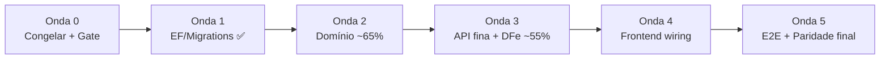

# Plano de Equalização e Fechamento — EprosERP

> **Documento de consolidação pós-porte em massa (agentes IA, jul/2026)**  
> Objetivo: fechar paridade funcional com o legado (`Epros/epros_erp-main`) sem o cliente perceber mudança.  
> Complementa: `CONVENCAO_CODIGO.md`, `PADRAO_PORTE_LEGADO.md`

**Baseline inicial (03/07/2026, agentes parados):**

| Dimensão | Métrica | Status |
|----------|---------|--------|
| Entidades (nome idêntico ao legado) | 150/159 (94,3%) | ~98% com equivalências |
| Controllers API | 74/76 (~97%) | Falta DFe operacional |
| Código ↔ banco (módulos core) | Gap 0 | Lookups Fiscal OK por convenção |
| Handlers MediatR | 111 | Vários sem superfície HTTP |
| Frontend ERP (`pages/erp/`) | 66/~72 (~92%) | UI madura |
| Composables de domínio | ~7/~50 legado (~14%) | Gap grande |
| Mismatches API frontend P0 | 8 grupos de rotas | Bloqueia produção |
| `dotnet build` | 0 erros (470 warnings) | Verde |
| `dotnet test` | 344/344 | Verde |
| **Paridade funcional ponderada** | **~78–82%** | Subiu de ~34% em 1 dia de porte |

**Reavaliação v1.1 (03/07/2026, pós-Onda 1 agentes):**

| Dimensão | Métrica | Status | Δ |
|----------|---------|--------|---|
| Entidades (nome idêntico ao legado) | 150/159 (94,3%) | ~98% com equivalências | — |
| Controllers API | **79/76** | DFe parcial (inutilização, IBPT, baixa) | +5 |
| Código ↔ banco (módulos core) | Gap 0 (core) | Residual Onda 1D (servicos/Ncm) | — |
| Handlers MediatR | ~115+ | Vários sem superfície HTTP | +4 |
| Frontend ERP (`pages/erp/`) | **64/~72 (~89%)** | Telas DFe/importação criadas | −2 rotas |
| Composables app (`composables/`) | **14/~50 legado (~28%)** | Estoque + CR portados | +7 |
| Mismatches API frontend P0 | **~6 grupos** | Inutilização/baixa DFe OK no backend | −2 |
| `dotnet build` | **0 erros** | Verde | — |
| `dotnet test` | **353/353** | Verde | +9 |
| **Paridade funcional ponderada** | **~82–86%** | Onda 1 concluída; Onda 3 parcial | +4–6 pp |

**Reavaliação v1.2 (03/07/2026, auditoria linha a linha):**

| Dimensão | Métrica | Status | Δ vs v1.1 |
|----------|---------|--------|-----------|
| Controllers API | **79** | Meta 76 **superada** | +0 (já contado) |
| Handlers MediatR (arquivos) | **~157** classes handler | Cobertura CQRS ampla | +42 vs plano |
| **Onda 2 Compra (domínio)** | Agregado completo | ✅ **Entregue** — plano desatualizado | +15 pp estimado |
| **Onda 3 controllers finos** | Pessoas/Empresas/DocumentosFiscais | ✅ **Entregue** | +8 pp estimado |
| **Importação XML compra** | `POST /compras/importar-xml` | ✅ Backend + handler + testes | Plano dizia pendente |
| **Totais financeiro HTTP** | `GET .../totais` CP/CR | ✅ Entregue | Plano §7.1 desatualizado |
| **1R.3 IeSt fantasma Fiscal** | Snapshot Fiscal | ✅ **Resolvido** — IeSt só GestaoClientes | Corrigir plano |
| Residual DB (1R.1/1R.2/1R.4) | Guid.Empty, Ncm global | ⏳ Pendente | — |
| Frontend mismatches P0 reais | Flags stub + rotas erradas | **~3–4** (não 6) | UI bloqueia, backend OK |
| **`dotnet test`** | **367/367** | Verde | +14 vs baseline |
| **Paridade funcional ponderada** | **~85–88%** | Ondas 1+2(domínio)+3(parcial) | +3–5 pp |

> **Nota v1.2:** Erros intermediários de compilação eram estado temporário dos agentes. Várias tarefas das Ondas 2–3 **já existem no código** mas o plano v1.1 ainda as listava como pendentes.

---

## 1. Entidades ainda sem nome idêntico (9)

| Legado | Situação no ERP | Ação na equalização |
|--------|-----------------|---------------------|
| `CertificadoDigital` | → `EmpresaCertificado` (GestaoClientes) | Documentar equivalência; validar campos De→Para |
| `PessoaEndereco` / `EmpresaEndereco` | → `Endereco` unificado | OK — não recriar |
| `EmpresaParametrosDfeNfceHomologacao/Producao/Nfe` | → `EmpresaParametrosDfe` consolidado | Validar campos NF-e/NFC-e |
| `ImportacaoXml` | **Não portado** | Onda 5 — entidade + handler + controller |
| `ImportacaoArquivoXmlSaida` | **Não portado** | Onda 5 |
| `PerfilUsuarioAcesso` | RBAC via `PerfilAcesso` (GestaoClientes); Aplicativo deprecado | ✅ Drop tabelas órfãs Aplicativo — migration `20260703132329` |

---

## 2. Visão das ondas

```
Onda 0 (0,5 dia)  → Congelar + gate                    [parcial]
Onda 1 (2–3 dias) → EF / Migrations (serializado)      [✅ CONCLUÍDA — core P0]
Onda 2 (3–4 dias) → Domínio / Agregados Compra e Venda  [~65% — agregado Compra OK; HTTP fiscal parcial]
Onda 3 (4–5 dias) → API fina + DFe operacional         [~55% — controllers finos + DFe]
Onda 4 (5–7 dias) → Frontend wiring (rotas, composables, componentes)
Onda 5 (3–4 dias) → E2E, paridade final, produção
```

**Regra de ouro:** após cada migration ou onda, gate obrigatório: `dotnet build` + `dotnet test` + smoke das rotas tocadas.

**Modo de trabalho:** Modo Consolidação (`CONVENCAO_CODIGO.md` §1.1) — migrations serializadas, testes verdes, auditoria De→Para.



---

## 3. Onda 0 — Congelar e preparar (0,5 dia)

**Objetivo:** parar drift antes de alterações estruturais.

| ID | Tarefa | Arquivos / detalhe |
|----|--------|-------------------|
| 0.1 | Congelar migrations — nenhum agente cria EF até fim da Onda 1 | Comunicação + branch `equalizacao` |
| 0.2 | Snapshot do estado | Build, testes, contagem entidades/controllers/páginas |
| 0.3 | Desabilitar auto-migrate paralelo em dev | `src/API/Epros.API/Program.cs` L355–384 → flag única serializada |
| 0.4 | Atualizar `CONVENCAO_CODIGO.md` | Enderecos/Veiculos já finos (MediatR); decisões RBAC/financeiro fixadas |

**Gate:** `dotnet build` 0 erros + **353** testes verdes.

---

## 4. Onda 1 — EF e migrations (2–3 dias, serializado) ✅ CONCLUÍDA

**Status:** concluída em **03/07/2026** pelos agentes (migrations `PortEqualizacao*`).  
**Gate:** `dotnet build` 0 erros + **353/353** testes verdes.

**Migrations aplicadas (consolidadas em 1 por módulo):**

| Módulo | Migration | Itens Onda 1 cobertos |
|--------|-----------|------------------------|
| GestaoClientes | `20260703131811_PortEqualizacaoGestaoClientes` | `PerfilUsuario` → `PerfilColaborador` (antecipou 2.11) |
| Fiscal | `20260703131841_PortEqualizacaoFiscal` | Campos impostos em `documento_fiscal_itens`; `empresa_id` em documentos |
| Estoque | `20260703132010_PortEqualizacaoEstoque` | Drop `compra_id1`; FK `CompraImposto` → `Compra` |
| Vendas | `20260703132059_PortEqualizacaoVendas` | Drop `fatos_geradores_financeiros`; `Status` → `EVendaStatus`; coluna `cancelada` |
| Financeiro | `20260703132301_PortEqualizacaoFinanceiro` | Drop `contas_pagar`/`contas_receber` simplificados + baixas |
| Aplicativo | `20260703132329_PortEqualizacaoAplicativo` | Drop RBAC órfão (`menus`, `perfis_usuarios`, etc.) |

**Residual Onda 1 (migrar antes de produção):**

| ID | Item pendente | Onde |
|----|---------------|------|
| 1R.1 | `Guid.Empty` em `naturezas_financeiras.empresa_id`, `contas_bancarias.empresa_id` | Migration Financeiro adicional |
| 1R.2 | `servicos.empresa_id` default Empty | Migration Fiscal adicional |
| 1R.3 | `IeSt` snapshot órfão no Fiscal | ✅ **FEITO** — removido do Fiscal; dono em GestaoClientes (`ie_sts` + `EmpresaContatosController`) |
| 1R.4 | `Ncm`/`Cest` como global (`IGlobalEntity`) — remover `tenant_id` | Migration Fiscal + Context |

**Objetivo:** banco reflete domínio canônico; zero tabelas fantasma.

**Comando (1 Context por vez):**

```powershell
dotnet ef migrations add <NomeDescritivo> --project src/Modules/Epros.Modules.<Modulo> --startup-project src/API/Epros.API
```

---

### 4.1 Onda 1A — Estoque (P0, dia 1) ✅

| Problema | Arquivo(s) | Status |
|----------|------------|--------|
| Shadow FK `compra_id1` duplicada | `ContextEstoque.cs` | ✅ `20260703132010` — coluna/FK/índice removidos |
| `CompraImposto` sem FK para `Compra` | `ContextEstoque.cs` | ✅ FK cascade + índice único `compra_id` |

---

### 4.2 Onda 1B — Financeiro (P0, dia 1–2) ✅ parcial

| Problema | Arquivo(s) | Status |
|----------|------------|--------|
| Snapshot `ContaPagar`/`ContaReceber` órfão | `ContextFinanceiroModelSnapshot.cs` | ✅ Drop tabelas simplificadas — `20260703132301` |
| Modelo canônico = `ContasAPagar`/`ContasAReceber` | `FinanceiroController.cs` | ✅ Mantido |
| `Guid.Empty` em FKs NOT NULL | `PortConsolidacaoFinanceiro.cs` | ⏳ **Pendente** — ver 1R.1 |

---

### 4.3 Onda 1C — Vendas (P0, dia 2) ✅

| Problema | Arquivo(s) | Status |
|----------|------------|--------|
| `FatoGeradorFinanceiro` órfão no Vendas | `ContextVendasModelSnapshot.cs` | ✅ Drop `vendas.fatos_geradores_financeiros` |
| `Venda.Status` como `string` | `Venda.cs`, handlers | ✅ `EVendaStatus` (int) + handlers alinhados + 9 testes novos |

---

### 4.4 Onda 1D — Fiscal (P0, dia 2–3) ⏳ parcial

| Problema | Arquivo(s) | Status |
|----------|------------|--------|
| Campos impostos em `documento_fiscal_itens` | `PortEqualizacaoFiscal` | ✅ Colunas alíquotas/valores adicionadas |
| `servicos.empresa_id` Guid.Empty | `PortConsolidacaoFiscal.cs` | ⏳ **Pendente** — ver 1R.2 |
| `IeSt` fantasma no snapshot Fiscal | `ContextFiscalModelSnapshot.cs` | ✅ **Resolvido** — entidade ausente no snapshot Fiscal |
| `Ncm`/`Cest` global vs tenant_id | `Ncm.cs`, `ContextFiscal.cs` | ⏳ **Pendente** — ver 1R.4 |

**Lookups sem migration (OK por convenção §6.4):** `ConfiguracaoGlobalLookup`, `EmpresaCertificadoLookup`, `EmpresaLookup`, `EmpresaParametrosDfeLookup`.

---

### 4.5 Onda 1E — Aplicativo (P0, dia 3) ✅

| Problema | Arquivo(s) | Status |
|----------|------------|--------|
| RBAC deprecado no snapshot Aplicativo | `ContextAplicativoModelSnapshot.cs` | ✅ Drop `menus`, `menu_itens_*`, `perfis_usuarios`, `perfis_usuarios_acessos` |
| Runtime RBAC = GestaoClientes | `MenusQueryHandlers.cs` | ✅ Mantido |

**Gate Onda 1:** ✅ 6 migrations consolidadas; **353 testes** verdes.

---

## 5. Onda 2 — Domínio e agregados (3–4 dias) ⏳ ~65%

**Objetivo:** handlers persistem o que o legado persistia.

**Antecipado na Onda 1 (não repetir):**

| ID | Tarefa | Status |
|----|--------|--------|
| 2.6 | `EVendaStatus` em todo fluxo | ✅ Migration + código + testes |
| 2.11 | `PerfilUsuario` → `PerfilColaborador` | ✅ Migration GestaoClientes + `UsuarioSyncEventHandler` |

---

### 5.1 Compra (Estoque) — P0 ⏳ parcial

**Estado atual (auditoria linha a linha):** agregado `Compra` **completo** no domínio; handler fiscal **existe**; rota HTTP `POST /compras/lancar` ainda usa handler **simplificado**.

| ID | Tarefa | Arquivo(s) | Status |
|----|--------|------------|--------|
| 2.1 | Adicionar navs 1:1/1:N no agregado `Compra` | `Compra.cs` L39–50 | ✅ **FEITO** |
| 2.2 | Métodos `DefinirEmitente`, `DefinirNfe`, `DefinirTransporte`, etc. | `Compra.cs` L174–219 | ✅ **FEITO** |
| 2.3 | Sub-entidades mapeadas com nav inversa | `ContextEstoque.cs` | ✅ Coberto por `CompraFiscalAgregadoTests` |
| 2.4 text | `LancarCompraFiscalCommandHandler` persiste agregado completo | `LancarCompraFiscalCommandHandler.cs` L104+ | ✅ **Handler existe** |
| 2.4b | Unificar `POST /compras/lancar` com fluxo fiscal OU expor `POST /compras/lancar-fiscal` | `ComprasController.cs` L47 — hoje só `LancarCompraCommand` | ⏳ **Pendente HTTP** |
| 2.4c | `LancarCompraCommandHandler` simplificado (só cabeçalho + itens) | `LancarCompraCommandHandler.cs` L44–119 | ⏳ **Pendente** |
| 2.5 | Testes agregado fiscal compra | `CompraFiscalAgregadoTests.cs` — **9 facts** | ✅ **FEITO** |
| 2.5b | Importação XML compra | `ImportarCompraXmlCommandHandler.cs` + `ComprasController.cs` L67 | ✅ **Backend FEITO** — front bloqueado por flag |

**Referência legado:** `Epros/epros_erp-main/src/Epros.ERP.Domain/Entities/Compras/`

---

### 5.2 Venda (Vendas) — P0/P1 ⏳ parcial

| ID | Tarefa | Arquivo(s) | Status |
|----|--------|------------|--------|
| ~~2.6~~ | ~~`EVendaStatus` em todo fluxo~~ | `Venda.cs` | ✅ Concluído na Onda 1C |
| 2.7 | Handlers fiscais via agregado (`venda.DefinirEmitente()`) | `VendaFiscalHandlers.cs` L244+ | ✅ **Parcial** — Definir* via agregado; itens L216 e pagamentos L479 ainda `DbSet.Add` direto |
| 2.8 | Documentar ou unificar: PDV vs fiscal | `RegistrarVendaCommandHandler` vs `VendasFiscalController` | ⏳ Decisão pendente |
| 2.9 | `Caixa.Status` string → enum | `Caixa.cs` L10 | ⏳ Ainda `string` ("Aberto"/"Fechado") |
| 2.10 | Testes agregado fiscal (Emitente, Nfe, Imposto) | `VendasCqrsTests.cs`, `VendasTests.cs` | ⏳ Parcial |

---

### 5.3 RBAC / GestaoClientes — P0/P1

| ID | Tarefa | Arquivo(s) |
|----|--------|------------|
| ~~2.11~~ | ~~Renomear `PerfilUsuario` → `PerfilColaborador`~~ | ✅ Concluído na Onda 1 |
| 2.12 | `UsuarioEmpresa.PerfilUsuarioId` → `PerfilAcessoId` | `Aplicativo/Domain/Entities/UsuarioEmpresa.cs` L10; migration |
| 2.13 | `MenusQueryHandlers` resolve `PerfilAcesso` via campo mal nomeado | `MenusQueryHandlers.cs` L370–384 |
| 2.14 | Rotas HTTP separadas: `/perfis-acesso` vs `/perfis-colaborador` | Controllers |

**Positivo:** `IeSt` dono único em GestaoClientes; removido do Fiscal.

---

**Gate Onda 2:** 367+ testes ✅; Compra fiscal com testes ✅; unificar rota HTTP `/compras/lancar` ⏳.

---

## 6. Onda 3 — API fina + DFe operacional (4–5 dias) ⏳ ~55%

**Objetivo:** paridade HTTP com legado; controllers finos (só MediatR).

**Progresso DFe (agentes):** controllers finos criados — `InutilizacaoDfeController`, `IbptDfeController`, `BaixaDocumentoDfeController`, `VendaNfeController`.

**Padrão DFe:** controllers finos → `IHerculesFiscalService` / `ICalculoFiscalService` — **não** reescrever `Epros.ERP.DfeCalculos`.

---

### 6.1 Refatorar controllers gordos — P1 ⏳ ~75%

| Controller | Problema (plano v1.0) | Status auditoria |
|------------|----------------------|------------------|
| `PessoasController.cs` | EF direto + cross-module | ✅ **FEITO** — só `IMediator` L18–20 |
| `EmpresasController.cs` | Upload certificado ~170 linhas | ✅ **FEITO** — `UploadCertificadoDigitalCommand` L143 |
| `DocumentosFiscaisController.cs` | Queries EF diretas | ✅ **FEITO** — fino MediatR L14–37 |
| `PessoaGruposController.cs` | DbContext direto | ⏳ **Parcial** — Criar/Atualizar MediatR; Listar/Obter/Excluir EF L71–107 |

**Já corrigidos (manter):** `EnderecosController.cs`, `VeiculosController.cs` — só MediatR.

---

### 6.2 APIs legado faltantes — prioridade

| Controller legado | ERP atual | Prioridade | Status |
|-------------------|-----------|------------|--------|
| `ImportacaoXmlsController` (entrada compra) | `ComprasController` `POST importar-xml` | **P0** | ✅ **Backend FEITO** — entidade legado `ImportacaoXml` ainda pendente (Onda 5) |
| `ImportacaoXmlsController` (saída) | — | P1 | ⏳ Pendente — Onda 5 |
| `InutilizacaoDfeController` | `InutilizacaoDfeController` (`api/v1/inutilizacao-dfe`) | **P0** | ✅ Controller fino MediatR |
| `IbptDfeController` | `IbptDfeController` | P1 | ✅ Controller criado |
| `BaixaDocumentoDfeController` | `BaixaDocumentoDfeController` | P1 | ✅ Controller criado |
| `VendaNfeController` | `VendasFiscalController` + `VendaNfeController` | P1 | ✅ Alias rota legado `api/v1/vendas-nfe` |
| `VendaDadosController` / `CompraDadosController` | — | P1 | Queries read-model |
| `CnpjOnlineController` | — | P2 | Serviço consulta CNPJ |
| `ProdutoHistoricoReajusteController` | — | P2 | Handler + controller Estoque |
| `VendaReportsController` | — | P2 | Módulo relatórios |
| ~15 `*EnumsController` | — | P2 | Endpoint único `api/v1/enums/{dominio}` |

---

### 6.3 Financeiro HTTP — P1

| ID | Tarefa | Detalhe |
|----|--------|---------|
| 3.1 | Renomear queries/DTOs `ObterContaPagar*` → `ContasAPagar` | `FinanceiroQueries.cs`, `FinanceiroController.cs` |
| 3.2 | Expor `FatoGeradorFinanceiro` via HTTP | `FatoGeradorFinanceiroController` ou rotas nested |
| 3.3 | OFX completo (listagem/conciliação) | Expandir `BancosContasECartoesController.cs` |
| 3.4 | `GET /financeiro/contas-pagar/totais` e `contas-receber/totais` | ✅ **FEITO** — `FinanceiroController.cs` L47, L203 |
| 3.5 | `CartaoDeCreditoFaturaController` legado | Verificar cobertura em `BancosContasECartoesController` |

**Positivo:** Event handlers (`VendaFaturadaEventHandler`, `CompraLancadaEventHandler`) usam modelo fiel `ContasAPagar`/`ContasAReceber`.

---

### 6.4 Fiscal HTTP — P1

| ID | Tarefa |
|----|--------|
| 3.6 | Validar `EmitirDocumentoFiscalCommandHandler` (correção recente dos agentes) |
| 3.7 | Vínculos `NcmTributacaoEmpresa` / `TributarioGrupoEmpresa` — Commands + endpoints |
| 3.8 | `ListarConfiguracoesImpressaoNfceQuery` (só ObterPorId/ObterPorEmpresa hoje) |

---

**Gate Onda 3:** Collection Postman com rotas legado mapeadas; meta 76 controllers equivalentes.

---

## 7. Onda 4 — Frontend wiring (5–7 dias)

**Objetivo:** telas em `pages/erp/` funcionam ponta a ponta com API real.

**Baseline frontend (reavaliação 03/07/2026):**

| Métrica | Valor |
|---------|-------|
| Páginas ERP | **64** / ~72 legado (~89%) |
| Composables app | **14** em `composables/` |
| Composables legado | ~234 |
| Mismatches API P0 | **~3–4 reais** (flags stub + combo usuários) |
| Build Nuxt | OK |
| Login local | Proxy `/api/v1` + credenciais demo (`INSTALACAO_LOCAL.md`) |

---

### 7.1 P0 — Mismatches de rota (dia 1–2)

| Frontend chama | Backend correto | Arquivo(s) frontend | Status |
|----------------|-----------------|---------------------|--------|
| `GET/POST/PUT/DELETE /plataforma/perfil` (listagem perfis) | `/plataforma/perfis-acesso` | `perfis/index.vue`, `perfis/[id].vue` | ✅ **Corrigido** — usa `perfis-acesso` |
| `GET /plataforma/perfil` (combo perfis usuário) | `/plataforma/perfis-acesso` | `usuarios/[id].vue` L85 | ⏳ **Bug** — combo ainda chama rota errada |
| `GET/POST/PUT/DELETE /estoque`, `/estoque/{id}` | `/estoque/produtos` | `estoque/produtos/*.vue` | ✅ **OK** — front usa `/estoque/produtos` |
| `POST .../contas-pagar/{id}/baixa` | `POST .../baixar` | `BaixaContaPagarDialog.vue` | ✅ **Corrigido** |
| `GET /financeiro/contas-*/totais` | `FinanceiroController` `GET .../totais` | `contas-a-pagar/index.vue`, `contas-a-receber/index.vue` | ✅ **Backend OK** |
| Inutilização DFe | `InutilizacaoDfeController` | `inutilizacao-numeracao.vue` | ⏳ **Flag** `INUTILIZACAO_EM_IMPLEMENTACAO=true` bloqueia UI (`useInutilizacao.ts` L36) |
| `POST /compras/importar-xml` | `ComprasController` L67 | `integracao/importar-xml.vue` | ⏳ **Flag** `IMPORTACAO_EM_IMPLEMENTACAO=true` L69 bloqueia UI — backend OK |
| Relatório simplificado, enums DFe | **Não existe** | `relatorios/vendas/simplificado01.vue` | ⏳ Pendente backend |

---

### 7.2 P0 — Auth e dashboard (dia 1–2)

| ID | Tarefa | Arquivo(s) |
|----|--------|------------|
| 4.1 | Unificar autenticação (Keycloak vs API real) | `pages/index.vue` — ✅ proxy Nuxt; ⏳ Keycloak fallback |
| 4.2 | Isolar `dashboard.vue` (~7000 linhas, mocks + `$fetch localhost`) | Redirect `/dashboard` → `/erp/acesso-rapido` |
| 4.3 | Migrar `$fetch('http://localhost:5000')` → `useApi` | `pages/plataforma/*`, `components/PessoasTab.vue`, `PerfisAcessoTab.vue` |

---

### 7.3 P1 — Composables e componentes (dia 3–7)

**Portar do legado** (`epros_erp_front-main/app/composables/`) **para** `EprosApp/composables/`:

| Domínio | Composables / componentes legado |
|---------|----------------------------------|
| Vendas/NFe | `useNfeProdutos`, `useNfeTransmissao`, `useNfeTotais`, `usePagamentos`, `useSignalr` |
| PDV | `LoteNfceDialog`, `CancelSaleDialog`, `ListaTransmissaoDialog` |
| Estoque | `useEstoqueProduto`, `useEstoqueProdutoForm` |
| Financeiro | `useContasAReceber*` |

**Componente P0 NFe:**

| Legado | Destino |
|--------|---------|
| `app/components/nfe/ImpostosTabsDialog.vue` | `EprosApp/components/vendas-nfe/` |

**Componentes NFe P1 faltando:** `EditarCamposFiscaisDialog`, `Exportacao`, `Volumes`, `Reboque`, `ObservacoesNfeDialog`.

**Já portados:** cards NFe (`NfeDadosBasicosCard`, `NfeProdutosCard`, etc.), PDV (`pages/erp/pdv/index.vue` + `components/pdv/*`), `TransmissionOverlay`, `DanfeViewer`.

---

### 7.4 P1 — Infra frontend

| ID | Tarefa |
|----|--------|
| 4.4 | Middleware ABAC: `/plataforma/perfil/menu` → redirect `acesso-restrito.vue` |
| 4.5 | Validar JWT expiração em `middleware/auth.global.ts` |
| 4.6 | SignalR: alinhar hubs (`/hubs/venda` vs `/hubs/vendas`) com backend |
| 4.7 | Cálculo impostos NF-e: avaliar hub servidor vs cliente (`useNfeEmissao.ts`) |

---

**Gate Onda 4:** `npm run build` + smoke 20 telas: login, parceiro, produto, NFe, PDV, CP/CR, compra, fiscal CFOP/NCM.

---

## 8. Onda 5 — Paridade final e produção (3–4 dias)

| ID | Tarefa | Critério de done |
|----|--------|------------------|
| 5.1 | Portar `ImportacaoXml` + `ImportacaoArquivoXmlSaida` | Entidade + handler + controller + tela integração |
| 5.2 | Testes E2E críticos | Compra fiscal, Venda NFe, OFX, permissões, outbox |
| 5.3 | Matriz De→Para campo a campo | 159 entidades auditadas (`PADRAO_PORTE_LEGADO.md`) |
| 5.4 | Smoke load | Venda + estoque + financeiro concorrente |
| 5.5 | Documentação operacional | Migrations, env vars, hubs SignalR, certificado |
| 5.6 | Reduzir warnings C# (470 → meta &lt;100) | Nullable, xUnit analyzers |
| 5.7 | OpenAPI codegen frontend (opcional) | `scripts/openapi-generate.mjs` adaptado do legado |

**Critério “cliente não percebe”:** ~95%+ nas jornadas: login → cadastro → venda NFe → estoque → financeiro → compra XML.

---

## 9. Cronograma estimado

| Onda | Duração | Acumulado (dias úteis) | Paridade esperada | Status |
|------|---------|------------------------|-------------------|--------|
| 0 | 0,5 | 0,5 | 82% | ⏳ Parcial |
| 1 EF | 2–3 | 3 | 84% → **86%** | ✅ Concluída |
| 2 Domínio | 3–4 | 7 | 89% | ⏳ **~65%** — agregado Compra OK |
| 3 API/DFe | 4–5 | 12 | 91% | ⏳ **~55%** |
| 4 Frontend | 5–7 | 19 | 94% | ⏳ ~15% (flags stub) |
| 5 Fechamento | 3–4 | **~23** | **~95%+** | — |

**Paridade atual estimada:** **~85–88%** (pós auditoria v1.2).

**Com 2–3 devs/IAs em paralelo** (ondas 2 residual + 4 wiring): **~1,5–2 semanas**.

---

## 10. Próximos 5 dias (atualizado pós-auditoria v1.2)

| Dia | Foco |
|-----|------|
| **1** | Residual Onda 1 (1R.1, 1R.2, 1R.4: Guid.Empty, Ncm global) + reset DB local |
| **2** | Onda 2 residual — unificar `POST /compras/lancar` com `LancarCompraFiscalCommandHandler` |
| **3** | Onda 2 — Venda pagamentos/itens via agregado + `Caixa.Status` enum |
| **4** | Onda 4 quick wins — remover flags `*_EM_IMPLEMENTACAO`; corrigir combo perfis em `usuarios/[id].vue` |
| **5** | Onda 3 residual — `PessoaGruposController` queries MediatR + `FatoGeradorFinanceiro` HTTP |

---

## 11. Inventário de débito por módulo

### Vendas

| P | Achado | Arquivo | Status |
|---|--------|---------|--------|
| ~~P0~~ | ~~`Venda.Status` string~~ | `Venda.cs` | ✅ `EVendaStatus` |
| ~~P0~~ | ~~Snapshot órfão `FatoGeradorFinanceiro`~~ | Vendas migration | ✅ Drop |
| P1 | Handlers básicos não persistem filhos fiscais | `RegistrarVendaCommandHandler.cs` | ⏳ Onda 2 |
| P1 | `VendaFiscalHandlers` bypass agregado (itens L216, pagamentos L479) | `VendaFiscalHandlers.cs` | ⏳ Onda 2 |
| P2 | `Caixa.Status` string | `RegistrarVendaCommandHandler.cs` | ⏳ Onda 2 |

### Estoque

| P | Achado | Arquivo | Status |
|---|--------|---------|--------|
| ~~P0~~ | ~~`compra_id1` shadow FK~~ | Estoque migration | ✅ |
| ~~P0~~ | ~~`CompraImposto` sem FK~~ | Estoque migration | ✅ |
| P0 | Agregado `Compra` incompleto | `Compra.cs` | ✅ **FEITO** L39–219 |
| P0 | `LancarCompraCommandHandler` simplificado vs fiscal | Handlers + `ComprasController` | ⏳ Unificar HTTP |
| ~~P1~~ | Importação XML compra ausente | `ImportarCompraXmlCommandHandler` | ✅ Backend — front flag |

### Fiscal

| P | Achado | Arquivo | Status |
|---|--------|---------|--------|
| P0 | `servicos.empresa_id` Guid.Empty | Fiscal | ⏳ 1R.2 |
| P0 | `IeSt` snapshot órfão | Fiscal snapshot | ✅ Resolvido — só GestaoClientes |
| P0 | Ncm/Cest tenant_id vs IGlobalEntity | `Ncm.cs`, snapshot L2091+ | ⏳ 1R.4 |
| ~~P1~~ | ~~APIs inutilização, baixa DFe~~ | Controllers | ✅ Criados |
| ~~P1~~ | ~~`DocumentosFiscaisController` gordo~~ | Controller | ✅ Fino MediatR |

### Financeiro

| P | Achado | Arquivo | Status |
|---|--------|---------|--------|
| ~~P0~~ | ~~Snapshot `ContaPagar`/`ContaReceber` órfão~~ | Financeiro migration | ✅ |
| P0 | Guid.Empty em empresa_id | Financeiro | ⏳ 1R.1 |
| P1 | Handlers FatoGerador/OFX sem HTTP | Handlers | ⏳ Onda 3 |
| P1 | Nomenclatura queries legado | `FinanceiroQueries.cs` | ⏳ Onda 3 |

### GestaoClientes / Aplicativo

| P | Achado | Arquivo | Status |
|---|--------|---------|--------|
| ~~P0~~ | ~~Snapshot RBAC Aplicativo órfão~~ | Aplicativo migration | ✅ |
| ~~P0~~ | ~~`PerfilUsuario` naming~~ | GestaoClientes | ✅ `PerfilColaborador` |
| P0 | RBAC triplo residual (`PerfilUsuarioId` vs `PerfilAcessoId`) | `UsuarioEmpresa.cs` | ⏳ Onda 2 |
| ~~P1~~ | `PessoasController` / `EmpresasController` gordos | Controllers | ✅ Finos MediatR |
| P1 | `PessoaGruposController` list/delete EF direto | `PessoaGruposController.cs` L71–107 | ⏳ Onda 3 |

### API transversal

| P | Achado | Arquivo |
|---|--------|---------|
| P0 | Auto-migrate paralelo dev | `Program.cs` L355–384 |
| P1 | Cross-module `PessoasController` → Financeiro | — | ✅ Removido — controller fino |

---

## 12. Matriz de testes (gap)

| Módulo | Arquivos existentes | Gap principal |
|--------|---------------------|---------------|
| Vendas | `VendasTests`, `VendasCqrsTests`, `VendaOutboxIntegrationTests` | Agregado fiscal, enum status |
| Estoque | `EstoqueTests`, `CompraCqrsTests`, `CompraOutboxIntegrationTests` | CompraImposto, importação XML, compra_id1 |
| Fiscal | `FiscalTests`, `FiscalTransmissaoTests`, `CalculoFiscalMotorLegadoTests` | Ncm global, emissão E2E |
| Financeiro | `FinanceiroTests`, `BancoAndContaAndCartaoTests` | Drop modelo simplificado, OFX E2E |
| GestaoClientes | `PessoaTests`, `GestaoClientesTests`, `PermissoesMenuTests` | Exclusão pessoa cross-financeiro |
| Aplicativo | `IdentidadeTenantTests`, `OnboardingTenantTests` | Pós-drop RBAC Aplicativo |

**Meta pós-Onda 5:** 360+ testes, 0 falhas. **Atual:** **367/367** ✅

---

## 13. Checklist final de paridade

```
[ ] 159/159 entidades (nome ou equivalência documentada em PADRAO_PORTE_LEGADO.md)
[~] 76/76 controllers (79 existem; falta ImportacaoXml saída + read-models)
[~] 0 tabelas fantasma nos snapshots EF (residual 1R.1–1R.2, 1R.4)
[ ] 0 Guid.Empty em FKs NOT NULL
[~] Compra/Venda persistem agregado completo nos handlers (Compra ✅ domínio; HTTP lancar ⏳)
[~] DFe: emissão OK; inutilização/baixa OK; importação XML compra ✅ backend
[ ] Frontend: 0 mismatches P0 de rota API (~3–4: flags stub + combo usuários)
[ ] dashboard.vue isolado ou removido; navegação principal em /erp/*
[x] 367+ testes dotnet, 0 falhas
[ ] npm run build frontend verde
[ ] Smoke manual: 10 jornadas críticas documentadas e aprovadas
[ ] CONVENCAO_CODIGO.md atualizado com decisões da equalização
```

---

## 14. Jornadas críticas para smoke manual

1. Login → seleção empresa → menu dinâmico por perfil  
2. Cadastro parceiro (PF/PJ) com endereço  
3. Cadastro produto + estoque + movimento manual  
4. Emissão NF-e venda (dados, itens, impostos, transmitir)  
5. PDV NFC-e  
6. Contas a pagar: criar, baixar, estornar  
7. Contas a receber: criar, baixar  
8. Compra entrada mercadorias + lançamento estoque  
9. Importação XML compra — backend ✅; remover flag frontend  
10. Configuração certificado digital + parâmetros DFe  

---

## 15. Referências

| Documento / pasta | Uso |
|-------------------|-----|
| `CONVENCAO_CODIGO.md` | Regras Modo Consolidação, entidades, CQRS, migrations |
| `PADRAO_PORTE_LEGADO.md` | Molde campo a campo legado → novo |
| `Epros/epros_erp-main/` | Fonte da verdade domínio e API |
| `Epros/epros_erp_front-main/` | Fonte da verdade UX e composables |
| `src/External/Epros.ERP.DfeCalculos/` | Motor fiscal legado (adapter via `MotorLegadoCalculoFiscalService`) |

---

## 16. Controle de progresso (preencher durante execução)

| Onda | Início | Fim | Responsável | Gate OK? | Notas |
|------|--------|-----|-------------|----------|-------|
| 0 | 03/07 | — | — | ☐ | Branch `equalizacao` não formalizada |
| 1A Estoque | 03/07 | 03/07 | Agentes IA | ☑ | `20260703132010` |
| 1B Financeiro | 03/07 | 03/07 | Agentes IA | ☑ | Drop simplificado; Guid.Empty pendente |
| 1C Vendas | 03/07 | 03/07 | Agentes IA | ☑ | EVendaStatus + drop FatoGerador |
| 1D Fiscal | 03/07 | 03/07 | Agentes IA | ☐ | Impostos itens OK; IeSt ✅; Ncm global pendente |
| 1E Aplicativo | 03/07 | 03/07 | Agentes IA | ☑ | Drop RBAC órfão |
| 1 GestaoClientes | 03/07 | 03/07 | Agentes IA | ☑ | PerfilColaborador |
| **Gate Onda 1** | | **03/07** | | **☑** | **367 testes, 0 erros build** |
| 2 Domínio | 03/07 | — | Agentes IA | ☐ | **~65%** — agregado Compra ✅; HTTP lancar ⏳ |
| 3 API/DFe | 03/07 | — | Agentes IA | ☐ | **~55%** — controllers finos + DFe |
| 4 Frontend | — | — | — | ☐ | Proxy login OK; flags stub bloqueiam |
| 5 Fechamento | — | — | — | ☐ | |

---

## 17. Auditoria linha a linha (v1.2 — 03/07/2026)

Validação cruzada código ↔ plano. Cada item referencia arquivo e linha verificados.

### 17.1 Métricas medidas agora

| Métrica | Valor | Comando / fonte |
|---------|-------|-----------------|
| `dotnet build` | 0 erros | `Epros.API.csproj` |
| `dotnet test` | **367/367** | `Epros.Tests.dll` |
| Controllers API | **79** | `src/API/**/*Controller.cs` |
| Handlers MediatR | **~157** arquivos | `*CommandHandler.cs` / `*QueryHandler.cs` |
| Páginas ERP | **64** | `EprosApp/pages/erp/**/*.vue` |
| Composables | **14** | `EprosApp/composables/*.ts` |

### 17.2 Entregas que o plano v1.1 ainda marcava como pendentes

| ID plano | Item | Evidência (arquivo:linha) | Veredito |
|----------|------|---------------------------|----------|
| 2.1 | Navs agregado Compra | `Compra.cs` L39–50 | ✅ FEITO |
| 2.2 | Métodos `Definir*` Compra | `Compra.cs` L174–219 | ✅ FEITO |
| 2.4 | Handler fiscal compra | `LancarCompraFiscalCommandHandler.cs` L104+ | ✅ FEITO (sem rota HTTP) |
| 2.5 | Testes agregado fiscal | `CompraFiscalAgregadoTests.cs` — 9× `[Fact]` | ✅ FEITO |
| 6.1 | `PessoasController` fino | `PessoasController.cs` L18 — só `IMediator` | ✅ FEITO |
| 6.1 | `EmpresasController` upload certificado | L143 `UploadCertificadoDigitalCommand` | ✅ FEITO |
| 6.1 | `DocumentosFiscaisController` fino | L14 comentário + L36 MediatR | ✅ FEITO |
| 6.2 | Import XML compra HTTP | `ComprasController.cs` L67–81 | ✅ FEITO |
| 6.2 | DFe inutilização/IBPT/baixa | Controllers dedicados | ✅ FEITO |
| 6.2 | Alias `vendas-nfe` | `VendaNfeController.cs` L20 | ✅ FEITO |
| 3.4 | Totais CP/CR | `FinanceiroController.cs` L47, L203 | ✅ FEITO |
| 1R.3 | IeSt fantasma Fiscal | `ContextFiscalModelSnapshot.cs` — grep `IeSt` = 0 | ✅ FEITO |
| 1R.3 | IeSt dono GestaoClientes | snapshot `ie_sts` L2351; `EmpresaContatosController` | ✅ FEITO |

### 17.3 Gaps confirmados (código ainda pendente)

| ID | Item | Evidência | Impacto |
|----|------|-----------|---------|
| 1R.1 | `Guid.Empty` em FKs Financeiro | `PortConsolidacaoFinanceiro.cs` L34, L49 | Migration adicional |
| 1R.2 | `servicos.empresa_id` Empty | Migration Fiscal pendente | Produção |
| 1R.4 | `Ncm`/`Cest` com `tenant_id` | `ContextFiscalModelSnapshot.cs` L2091+ | Global vs tenant |
| 2.4b | `POST /compras/lancar` simplificado | `ComprasController.cs` L47 → `LancarCompraCommand` | Paridade fiscal compra |
| 2.7 | Venda itens/pagamentos DbSet direto | `VendaFiscalHandlers.cs` L216, L479 | Integridade agregado |
| 2.9 | `Caixa.Status` string | `Caixa.cs` L10 | Tipagem |
| 2.12 | `PerfilUsuarioId` naming | `UsuarioEmpresa.cs` | RBAC |
| 6.1 | `PessoaGruposController` EF direto | L71–107 list/obter/excluir | Padrão CQRS |
| 3.2 | `FatoGeradorFinanceiro` sem HTTP | Sem controller | Financeiro avançado |
| 5.1 | `ImportacaoXml` entidade legado (saída) | Não portado | Onda 5 |
| 7.1 | Flag inutilização bloqueia UI | `useInutilizacao.ts` L36 `= true` | UX falsa pendência |
| 7.1 | Flag importação bloqueia UI | `importar-xml.vue` L69 `= true` | UX falsa pendência |
| 7.1 | Combo perfis usuário rota errada | `usuarios/[id].vue` L85 `/plataforma/perfil` | Cadastro usuários |

### 17.4 Resumo executivo v1.2

```
Paridade estimada:     ~85–88%  (antes ~82–86%)
Onda 1 core:           ✅ 100%
Onda 1 residual:       ⏳ 3 itens (1R.1, 1R.2, 1R.4)
Onda 2 domínio:        ⏳ ~65%  (Compra domínio ✅; HTTP/unificação ⏳)
Onda 3 API:            ⏳ ~55%  (controllers finos ✅; read-models ⏳)
Onda 4 frontend:       ⏳ ~15%  (mocks removidos parcial; flags stub)
Bloqueadores reais:    flags UI + 3 migrations residuais + unificar lancar compra
Falso bloqueador:      "backend não existe" para inutilização/import/totais — JÁ EXISTE
```

---

*Versão: 1.2 — 03/07/2026. Auditoria linha a linha pós-Onda 1; 367 testes; paridade ~85–88%.*
