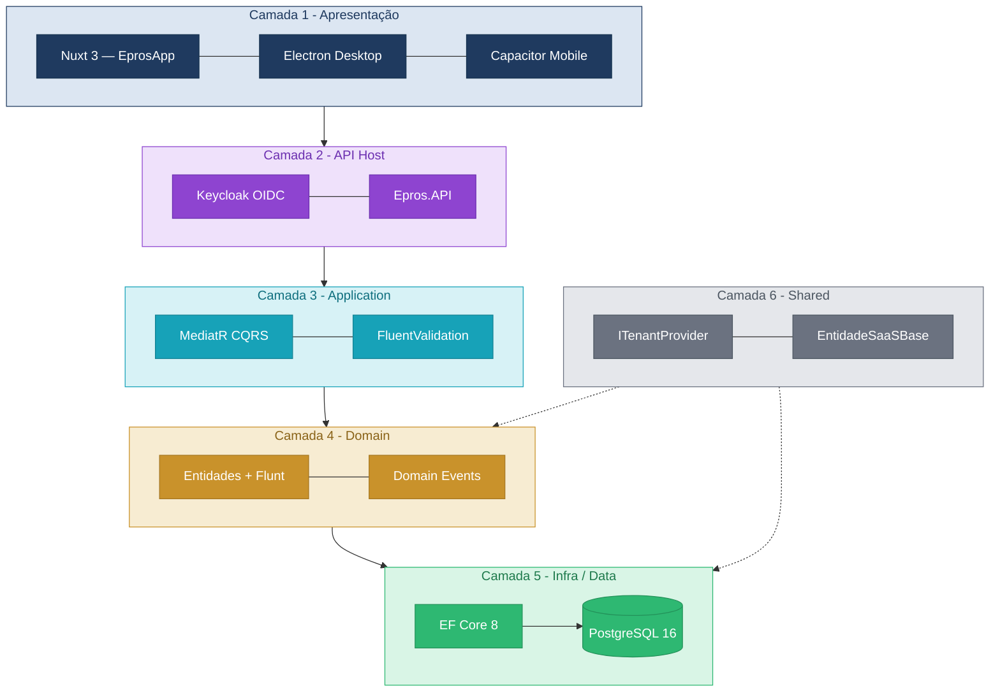

---

title: "Monólito modular: a arquitetura do Epros"
confluence_id: "193101827"
confluence_url: "https://rafaelbertuolo.atlassian.net/wiki/spaces/EprosWeb/pages/193101827/Mon+lito+modular+a+arquitetura+do+Epros"
last_updated: ""

---

**Por que monólito modular**

A decisão foi registrada em ADR e avaliada em 6 critérios:


| Critério                      | Monólito modular  | Microserviços                   |
| ----------------------------- | ----------------- | ------------------------------- |
| Transações ACID               | Nativo            | Saga/distribuída                |
| Audit log centralizado (LGPD) | Um lugar          | Correlação complexa             |
| Custo de infra inicial        | 1 cluster         | N serviços                      |
| Debugging                     | Stack trace local | Distributed tracing obrigatório |
| Tamanho do time (7 pessoas)   | Adequado          | Overhead operacional alto       |

> [!TIP]
> A fronteira lógica de hoje (schema PostgreSQL por módulo) é a fronteira física do microserviço de amanhã. Construímos para extrair, não para acoplar.

## **As 6 camadas**



| #   | Camada       | Responsabilidade                   | Tecnologias                    |
| --- | ------------ | ---------------------------------- | ------------------------------ |
| 1   | Apresentação | Interfaces por superfície          | Nuxt 4, Electron, Capacitor    |
| 2   | API Host  | Auth, entitlement, rate limit      | Keycloak, YARP, Swagger        |
| 3   | Application  | CQRS — Commands, Queries, Handlers | MediatR, FluentValidation      |
| 4   | Domain       | Entidades ricas, regras, eventos   | EntidadeSaaSBase, Flunt        |
| 5   | Infra / Data | Persistência, repositórios         | EF Core, PostgreSQL            |
| 6   | Shared       | Contratos e primitivos             | ITenantProvider, CommandResult |


---

## **Estrutura de um módulo**

Cada bounded context segue a mesma árvore de pastas:

```
src/Modules/{Modulo}/{SubModulo}/
├── Domain/
│   ├── Entities/
│   └── ValueObjects/
├── Application/
│   ├── Commands/
│   ├── Queries/
│   └── Handlers/
└── Infrastructure/
    ├── Data/
    │   ├── Mappings/
    │   └── Context.cs
    └── Repositories/
```

> [!IMPORTANT]
> Um módulo nunca injeta o `DbContext` de outro módulo. Comunicação entre contextos via Domain Events + Outbox.

---

## **Pipeline HTTP — 8 passos**

A ordem é **obrigatória**. Alterar a sequência quebra segurança ou auditoria. Lista canônica: [CONTEXT.md §9](../../CLAUDE.md).

> [!WARNING]
> Não reordene os middlewares sem ADR aprovada. `TenantSaaSMiddleware` e `AuditMiddleware` dependem da sequência documentada.


| #   | Middleware / passo              | Função                                           |
| --- | ------------------------------- | ------------------------------------------------ |
| 1   | `UseAuthentication`             | Valida JWT (Keycloak)                            |
| 2   | `ExcecaoGlobalMiddleware`       | ProblemDetails RFC 7807, sem stacktrace em prod  |
| 3   | `TenantSaaSMiddleware`       | Resolve `tenantId` do claim JWT                  |
| 4   | `ModuloTenantMiddleware`        | Verifica entitlement do módulo para o tenant     |
| 5   | `DataMaskingMiddleware`         | Mascara CPF/CNPJ/PAN nos logs (PCI DSS)          |
| 6   | `AuditMiddleware`               | `audit_trail` append-only (LGPD)                 |
| 7   | `UseAuthorization`              | Verifica roles/políticas                         |
| 8   | `MapControllers`                | Apenas `MediatR.Send()` — zero lógica de negócio |


> [!IMPORTANT]
> Controller recebe HTTP e despacha. Handler executa. Domínio decide. Repositório persiste.

---

## **Os três repositórios**


| Repositório   | Conteúdo                                                   |
| ------------- | ---------------------------------------------------------- |
| `src/` | Monólito modular — API, Modules, Shared, Infrastructure |
| `EprosApp/` | Nuxt 3 — `pages/erp|plataforma|area-cliente` |
| `Epros.Mobile/` | React Native (submódulo) |
| `docs/fabrica/` | Agentes, processo, skills, rules Cursor |


Em materiais antigos do projeto, você pode ver a pasta `PlataformaSaaS/` — é o mesmo conjunto de repositórios com nomenclatura anterior.

---

## **As 9 fases de desenvolvimento**

Cada feature passa por 9 fases com agente de IA, entregáveis e **gate** — nenhuma avança sem aprovação. Detalhe completo: [PIPELINE.md](../fabrica/processo/PIPELINE.md).


| Fase | Nome            | Agente       | Gate principal                                                                 |
| ---- | --------------- | ------------ | ------------------------------------------------------------------------------ |
| 01   | Estratégia      | Strategy     | Go aprovado + OKR vinculado                                                    |
| 02   | Discovery       | Discovery    | Problem Statement validado (≥5 entrevistas ou risco assumido)                  |
| 03   | Requisitos      | Requirements | DoR (S18): sem termo vago; fiscal + tenancy respondidos                        |
| 04   | Design UX       | UX           | Aprovado p/ dev (consistência + WCAG + confirmações fiscais)                   |
| 05   | Refinamento     | Planning     | Cabe na sprint (total ≤ velocity) ou replanejado                               |
| 06   | Arquitetura     | Architect    | Zero violação de padrão; spikes resolvidos *(pode pular se padrão existente)*  |
| 07   | Desenvolvimento | Dev          | Build verde + testes passando                                                  |
| 08   | Qualidade       | QA           | Zero P0/P1; cenários fiscais e de tenancy verdes                               |
| 09   | Operações       | Ops          | Checklist go-live 100% + rollback testado                                      |


> [!IMPORTANT]
> Cerimônias semanais, DoR e DoD estão no [Squads, cerimônias e como o time opera](07-squads-cerimonias.md). Gates, aprovação de PR e coordenação com o Guardião de Domínio estão na [Trilha Tech Lead — ADRs, fases e guardião de domínio](trilha-tech-lead.md).

---

**Próximo passo →** [A stack completa: 15 tecnologias, uma decisão por vez](03-a-stack-completa.md)
