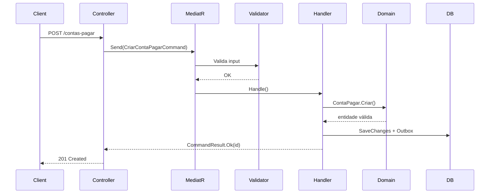

> [!NOTE]
> **O que você vai aprender:** o ciclo completo de uma feature no Epros — da entidade de domínio ao PR — usando o submódulo `Financeiro` / `ContasAPagar` (Contas a Pagar) como referência.

Um handler, um teste, um PR — o ciclo que todo dev backend repete dezenas de vezes por sprint.

Este artigo percorre o módulo **Contas a Pagar** na ordem em que você criaria os arquivos. É o módulo de referência: 8 testes de segurança passando, padrões completos de CQRS e DDD.

---

## Estrutura de pastas

```
src/Modules/Financeiro/ContasAPagar/
├── Domain/
│   ├── Entities/ContaPagar.cs
│   └── ValueObjects/ValorMonetario.cs
├── Application/
│   ├── Commands/
│   ├── Queries/
│   └── Handlers/
└── Infrastructure/
    ├── Data/
    └── Repositories/
```

Cada submódulo do ERP replica essa árvore. Aprenda uma vez, aplique em todos.

---

## Passo 1 — A entidade de domínio

A entidade herda `EntidadeSaaSBase` e expõe comportamentos, não setters públicos:

```csharp
public class ContaAPagar : EntidadeSaaSBase
{
    public Guid FornecedorId { get; private set; }
    public decimal Valor { get; private set; }
    public ContaPagarStatus Status { get; private set; }

    // Factory method — única forma de criar
    public static ContaAPagar Criar(
        string tenantId, string criadoPor,
        Guid fornecedorId, string descricao,
        decimal valor, DateOnly dataVencimento)
    {
        var cp = new ContaAPagar(tenantId, criadoPor);

        if (valor <= 0)
            cp.AddNotification("ContaAPagar.Valor", "Valor deve ser maior que zero");

        if (!cp.IsValid) return cp;

        cp.FornecedorId = fornecedorId;
        cp.Valor = valor;
        cp.Status = ContaPagarStatus.Aberta;
        return cp;
    }

    public void Baixar(decimal valorPago, string formaPagamento, string usuarioId)
    {
        if (Status != ContaPagarStatus.Aberta)
        {
            AddNotification("ContaAPagar.Status", $"Conta não pode ser baixada: {Status}");
            return;
        }
        // ... muda estado + dispara Domain Event
        AdicionarEvento(new ContaAPagarBaixada(Id, TenantId, ...));
    }
}
```

> [!TIP]
> Regras de negócio vivem na entidade. Handler orquestra; domínio decide.

---

## Passo 2 — Command e Validator

```csharp
// Command — record imutável
public record CriarContaAPagarCommand(
    Guid FornecedorId,
    string Descricao,
    decimal Valor,
    DateOnly DataVencimento
) : IRequest<CommandResult>;

// Validator — FluentValidation no pipeline MediatR
public class CriarContaAPagarValidator : AbstractValidator<CriarContaAPagarCommand>
{
    public CriarContaAPagarValidator()
    {
        RuleFor(x => x.FornecedorId).NotEmpty();
        RuleFor(x => x.Valor).GreaterThan(0).LessThanOrEqualTo(9_999_999.99m);
        RuleFor(x => x.DataVencimento)
            .GreaterThanOrEqualTo(DateOnly.FromDateTime(DateTime.Today));
    }
}
```

Validação de **input** (FluentValidation) é separada de validação de **domínio** (Flunt na entidade). Ambas podem falhar — em momentos diferentes.

> [!NOTE]
> FluentValidation roda no pipeline MediatR **antes** do handler. Flunt valida regras de negócio **dentro** da entidade — depois que o input já passou.

---

## Passo 3 — Handler

```csharp
public class CriarContaAPagarHandler : IRequestHandler<CriarContaAPagarCommand, CommandResult>
{
    private readonly IContaAPagarRepository _repo;
    private readonly IUnitOfWork _uow;
    private readonly ITenantProvider _tenant;
    private readonly ICurrentUser _currentUser;

    public async Task<CommandResult> Handle(CriarContaAPagarCommand cmd, CancellationToken ct)
    {
        var cp = ContaAPagar.Criar(
            _tenant.GetTenantId(),
            _currentUser.Id,
            cmd.FornecedorId, cmd.Descricao,
            cmd.Valor, cmd.DataVencimento);

        if (!cp.IsValid)
            return CommandResult.Falha(cp.Notifications.Select(n => n.Message).ToList());

        await _repo.AdicionarAsync(cp, ct);
        await _uow.CommitAsync(ct);  // Outbox grava Domain Events aqui

        return CommandResult.Ok(cp.Id);
    }
}
```

> [!IMPORTANT]
> O handler injeta `ITenantProvider` via DI — **nunca** variável estática de tenant.

---

## Passo 4 — Controller

```csharp
[ApiController]
[Route("api/financeiro/contas-a-pagar")]
public class ContasAPagarController : ControllerBase
{
    private readonly IMediator _mediator;

    [HttpPost]
    public async Task<IActionResult> Criar(
        [FromBody] CriarContaAPagarRequest request, CancellationToken ct)
    {
        var result = await _mediator.Send(
            new CriarContaAPagarCommand(
                request.FornecedorId, request.Descricao,
                request.Valor, request.DataVencimento), ct);

        return result.Sucesso
            ? CreatedAtAction(nameof(Obter), new { id = result.Id }, result)
            : BadRequest(result.Erros);
    }
}
```

> [!IMPORTANT]
> Controller = recebe HTTP, despacha, retorna status. **Zero lógica de negócio.**

---

## Passo 5 — Domain Events e Outbox

Quando `ContaPagar` é baixada, um evento notifica outros módulos:

```csharp
public record ContaAPagarBaixada(
    Guid ContaAPagarId,
    string TenantId,
    Guid FornecedorId,
    decimal ValorOriginal,
    decimal ValorPago,
    DateTime DataBaixa
) : DomainEvent;
```

O `UnitOfWork` grava o evento na tabela Outbox. O Quartz.NET processa e entrega — garantia de entrega at-least-once.

---

## Checklist antes de abrir o PR

- [ ] Entidade herda EntidadeSaaSBase
- [ ] Factory method para criação (sem new público)
- [ ] Command + Validator + Handler separados
- [ ] Controller só chama MediatR
- [ ] ITenantProvider via DI (nunca static)
- [ ] DateTime.UtcNow (nunca DateTime.Now)
- [ ] Guid para IDs (nunca long)
- [ ] Soft delete via entidade.Deletar() (nunca context.Remove())
- [ ] snake_case nas colunas PostgreSQL
- [ ] Domain Events via Outbox
- [ ] dotnet test → testes passando

## O fluxo em uma imagem




---

**Próximo passo →** [Multi-tenancy e os 8 testes que o CI bloqueia](05-multi-tenancy-8-testes.md)
