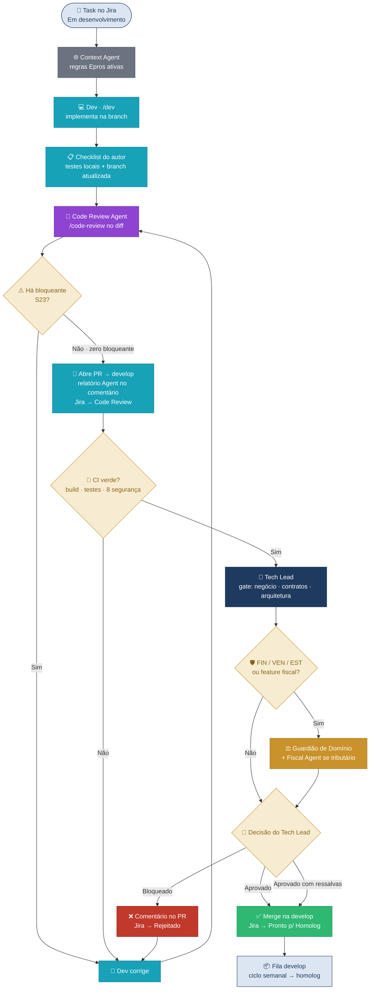

> [!NOTE]
> **O que você vai aprender:** o mapa dos 16 agentes de IA, como o Context Agent injeta o conhecimento do Epros no Cursor e o fluxo obrigatório antes de abrir um PR.

O Context Agent já sabe que você está no submódulo `Financeiro` / `ContasAPagar` antes de você digitar.

A IA no Epros não substitui o desenvolvedor. Ela **amplifica** quem já entende a arquitetura — gera menos código fora do padrão e acelera quem sabe o que quer.

Agentes IA cobrem gaps de capacidade — não substituem revisão humana de lógica de negócio.

---

## Com IA vs sem IA

```
Sem IA:  dev escreve → PR → Tech Lead revisa tudo → corrige → merge

Com IA:  Context Agent ativo → sugestões no padrão Epros
         → Code Review Agent antes do PR (S23)
         → Tech Lead gateia merge (negócio e arquitetura)
```

Checklist do autor antes do PR: [Code Review — checklist do autor](code-review-checklists-e-boas-praticas.md) · Gate do Tech Lead: [Tutorial Tech Lead](tech-lead/tutorial-tech-lead-arquiteto.md).
---

## Mapa dos 16 agentes

```
┌─────────────────────────────────────────────────┐
│            CONTEXT AGENT [GLOBAL]               │
│  .cursor/rules (meta + submódulos)              │
│   Injeta domain knowledge em TODOS os agentes   │
└─────────────────────────────────────────────────┘
         │
         ├── FASE (9 agentes — um por etapa)
         │   01 Strategy · 02 Discovery · 03 Requirements
         │   04 UX · 05 Planning · 06 Architect
         │   07 Dev · 08 QA · 09 Ops
         │
         └── TRANSVERSAIS / PROJETO (6)
             Security · Docs · Code Review
             Fiscal · Migration · Support
```

| Agente | Command / onde | Quem usa | Quando |
| --- | --- | --- | --- |
| **Context** | `.cursor/rules/00-epros-context.mdc` (raiz) · `epros-erp-*.mdc` (submódulos) | Todos | Sempre ativo |
| **Strategy** | `/strategy` (raiz) | PO, Tech Lead | Decisões e trade-offs |
| **Discovery** | `/discovery` (raiz) | PO | Investigar legado e domínio |
| **Requirements** | `/requirements` (raiz) | PO | ACs em Given/When/Then |
| **UX** | `/ux` (frontend) | Frontend, PO | Fluxo de telas |
| **Planning** | `/planning` (raiz) | PO, Tech Lead | Quebra épico em tasks |
| **Architect** | `/architect` (raiz / backend) | Tech Lead | Feature nova — ADR |
| **Dev** | `/dev` (backend / frontend) | Backend, Frontend | Durante o coding |
| **QA** | `/qa` (backend / frontend) | QA, Devs | Após US — plano de testes |
| **Ops** | `prompts/fase-09-ops.md` | Tech Lead, Ops | Go-live, runbook, rollback |
| **Security** | `/security` (backend) | Qualquer um | Auth, LGPD, endpoints sensíveis |
| **Docs** | `/docs` (backend) | Guardião, Devs | Após decisão de negócio |
| **Code Review** | `/code-review` | Todos | **Obrigatório** antes do PR |
| **Fiscal** | `/fiscal` (backend) | Guardião, Dev, QA, PO | Dúvida tributária; obrigatório nas fases 03 · 07 · 08 se a feature for fiscal |
| **Migration** | `/migration` (raiz) | Suporte / Migração | Plano ETL, de-para long→Guid, conciliação (S27) |
| **Support** | `/support` (raiz) | Suporte | Triagem de ticket (S29) |

Referência legível das personas: [`docs/fabrica/agentes/`](../fabrica/agentes/) (nem todos os 16 estão portados ainda).

Mapa por função: [GUIA-POR-FUNCAO.md](../fabrica/GUIA-POR-FUNCAO.md) · [Índice de tutoriais](indice-tutoriais.md).
Rules Cursor: [`docs/fabrica/cursor/cursor-install/rules/`](../fabrica/cursor/cursor-install/rules/).

---

## O Context Agent — o mais importante

Arquivos:

* Meta-repo (`epros`): `.cursor/rules/00-epros-context.mdc`
* Submódulos `backend/` e `frontend/`: regras `epros-erp-*.mdc`

O que ele injeta em toda interação:

**Regras invioláveis (SEMPRE):**

* Herdar `EntidadeSaaSBase`
* `DateTime.UtcNow` — nunca `DateTime.Now`
* `Guid` para IDs
* Soft delete via `entidade.Deletar()`
* `ITenantProvider` via DI — nunca static
* `snake_case` no PostgreSQL
* CQRS — zero lógica no Controller
* Outbox para Domain Events

**Regras invioláveis (NUNCA):**

* `context.Remove()` em entidade de domínio
* DbContext de outro módulo injetado
* JWT ou secret no código
* `IgnoreQueryFilters()` sem justificativa
* SQL raw sem parâmetros

Com as rules configuradas, o Cursor Tab já sugere código no padrão Epros enquanto você digita.

---

## Fluxo de um PR assistido por IA



| Cor | Quem / o quê |
| --- | --- |
| Cinza | Context Agent (sempre ativo) |
| Ciano | Dev — implementação e correção |
| Roxo | Code Review Agent (`/code-review`, S23) |
| Azul-escuro | Tech Lead — gate de merge |
| Âmbar | Guardião de Domínio (+ Fiscal Agent se tributário) |
| Verde | Merge autorizado na `develop` |
| Vermelho | PR bloqueado — volta ao Dev |

> [!IMPORTANT]
> **Gate obrigatório:** nenhum PR sem output do Code Review Agent no comentário.
> Feature fiscal: valide com `/fiscal` nas fases 03 · 07 · 08 antes do merge.

---

**Próximo passo →** [Squads, cerimônias e como o time opera](07-squads-cerimonias.md)
