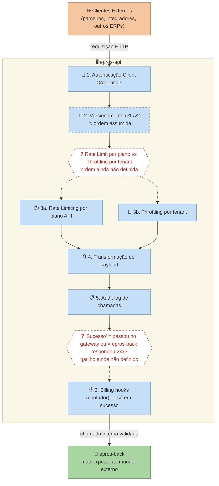

> [!NOTE]
> **Tecnologia:** YARP (Yet Another Reverse Proxy)

### Por que YARP e não Kong, Nginx, ou AWS API Gateway

| Critério | YARP | Kong | AWS API Gateway |
| --- | --- | --- | --- |
| Linguagem | C# (time já sabe) | Lua/Go | JSON/YAML gerenciado |
| Cloud-agnostic | ✅ | ✅ | ❌ Lock-in AWS |
| Open source | ✅ MIT | Parcialmente | ❌ |
| Customização | Máxima (é código) | Plugins | Limitada |
| Observabilidade | OpenTelemetry nativo | Separado | CloudWatch |
| Custo | Zero | Free tier limitado | Por chamada |

### Arquitetura do epros-api



### Configuração básica do YARP

```csharp
// Program.cs do epros-api
builder.Services.AddReverseProxy()
    .LoadFromConfig(builder.Configuration.GetSection("ReverseProxy"));
```

```json
// appsettings.json
{
  "ReverseProxy": {
    "Routes": {
      "epros-back-v1": {
        "ClusterId": "epros-back",
        "Match": {
          "Path": "/v1/{**catch-all}"
        },
        "Transforms": [
          { "PathPattern": "/api/v1/{**catch-all}" },
          { "RequestHeader": "X-API-Client", "Set": "{client_id}" }
        ]
      }
    },
    "Clusters": {
      "epros-back": {
        "Destinations": {
          "primary": {
            "Address": "http://epros-back:7000/"
          }
        }
      }
    }
  }
}
```

### Rate limiting por plano

```csharp
// Middleware customizado de rate limiting
public class ApiRateLimitMiddleware
{
    public async Task InvokeAsync(HttpContext context, RequestDelegate next)
    {
        var clientId = context.User.FindFirstValue("client_id");
        var plano = await _planService.GetApiPlan(clientId);

        var limite = plano switch
        {
            "starter" => 1_000,      // 1k chamadas/dia
            "business" => 10_000,    // 10k chamadas/dia
            "enterprise" => 100_000, // 100k chamadas/dia
            _ => 100                 // sem plano = 100/dia
        };

        var contadorKey = $"api:calls:{clientId}:{DateTime.UtcNow:yyyy-MM-dd}";
        var atual = await _valkey.IncrementAsync(contadorKey);

        if (atual == 1)
            await _valkey.ExpireAsync(contadorKey, TimeSpan.FromDays(1));

        if (atual > limite)
        {
            context.Response.StatusCode = 429;
            context.Response.Headers["X-RateLimit-Limit"] = limite.ToString();
            context.Response.Headers["X-RateLimit-Remaining"] = "0";
            context.Response.Headers["Retry-After"] = "86400";
            return;
        }

        context.Response.Headers["X-RateLimit-Limit"] = limite.ToString();
        context.Response.Headers["X-RateLimit-Remaining"] = (limite - atual).ToString();

        await next(context);
    }
}
```
