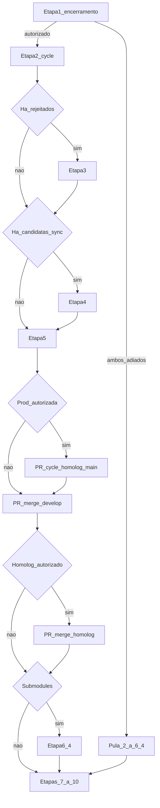

**Frequência:** Toda segunda-feira, ou primeiro dia útil da semana, sem exceção.

> **EprosERP:** ciclo Git em **um** repositório (`src/` + `Epros.App/`). Submódulo opcional: `Epros.Mobile`. Processo: [`docs/fabrica/`](../../fabrica/).

**Contexto:** cerimônia e status canônicos do Jira estão em [Fluxo de desenvolvimento — artigo 10](../10-fluxo-de-desenvolvimento.md) (pauta 75–90 min, blocos 0–5) e [Squads e cerimônias — artigo 07](../07-squads-cerimonias.md). Este documento é o **runbook pós-reunião** (Git, versões, Jira, release) e o detalhe operacional dos boards na reunião.

**Repositório:** execute as Etapas 2–6 no clone **EprosERP** (`src/` + `Epros.App/`).

**Serviços com versão independente** (só incremente o que mudou no ciclo):

| Serviço | Onde versionar |
| --- | --- |
| API | `Epros.ERP.API.csproj` → `<Version>` |
| DFe | `Epros.ERP.Dfe.API.csproj` → `<Version>` |
| RealTime | `Epros.Erp.RealTime.API.csproj` → `<Version>` |
| Front | `package.json` (`npm version … --no-git-tag-version`) |

## Visão do pós-reunião (não inverta)

```
1  Reunião
2  Abrir cycle/YYYY-MM-DD-homolog e cycle/YYYY-MM-DD-develop
3  Reverts          → nas cycle (não nas longas)
4  Sync hotfixes    → na cycle/…-develop
5  Versionar        → nas cycle (antes de qualquer PR de release)
6  Normalizar + merge/develop + PRs → main, develop e homolog
7–9 Jira, release notes, ordem da sprint
```

**Regra:** branches longas (`main`, `homolog`, `develop`) **só recebem** o trabalho do ciclo via **PR**. Revert, sync e bump de versão acontecem nas `cycle/…` (congeladas na reunião); `merge/…-develop` leva hotfixes de volta à `develop`. PR → `homolog` usa head **`cycle/…-develop`** (não há `merge/…-homolog`).

## Pré-condições, skip e abort

Use esta seção para decidir **o que executar** após o checklist de encerramento (Etapa 1). Não é obrigatório rodar todas as etapas Git toda segunda — só as que o gate e a tabela abaixo autorizarem.

### Gate global (antes da Etapa 2)

Deriva do checklist de encerramento (bloco 5):

| Decisão na reunião | O que fazer |
| --- | --- |
| **Ambos** os merges adiados (`cycle/…-homolog` → `main` **e** `cycle/…-develop` → `homolog`), com motivo registrado | **Não** executar Etapas 2–6. Siga para Etapas 7–9 apenas se acordado (Jira/release notes). |
| **Só** produção adiada | Abrir `cycle/…`, Etapas 3–5 se aplicável; **pular** PR → `main`; seguir PRs → `develop` / `homolog` se autorizados. |
| **Só** próximo homolog adiado | Seguir release → `main` se autorizado; **não** abrir/mergear PR `cycle/…-develop` → `homolog`. |
| Merges autorizados (total ou parcial conforme linhas acima) | Executar Etapas 2–6 conforme skip abaixo. |

**Repositório sem mudança no ciclo:** pule Etapas 2–6.

### Skip por etapa

| Etapa | Pular quando | Ainda fazer |
| --- | --- | --- |
| 2 Abrir `cycle/…` | Ciclo Git inteiro adiado (gate global) | Nada de `cycle/` / `merge/` |
| 3 Reverts | Lista de rejeitados vazia | Ir para Etapa 4 |
| 4 Sync hotfix | Listagem filtrada vazia em `main` **e** `homolog` (`git log` com `--grep='cycle/|merge/' --invert-grep`) | Ir para Etapa 5 |
| 5 Versionar | Nenhum serviço mudou **e** nenhum PR da Etapa 6 será aberto | Se houver qualquer PR da Etapa 6, versionar o que mudou |
| 6 PR → `main` | Zero itens **Pronto p/ Deploy** **ou** produção adiada | Demais PRs se autorizados |
| 6 PR → `develop` | Nada a propagar (sem reverts, sync nem versão na cycle) — raro | Avaliar caso a caso com TL |
| 6 PR → `homolog` | Próximo ciclo de homolog adiado | — |
| 7–9 | Fora do escopo Git | Seguir se o board/Jira/release notes foi acordado mesmo com Git adiado |

### Abort (parar o fluxo Git)

Abortar o **restante** do fluxo Git na segunda e **registrar** motivo (comentário na sprint no Jira, `#epros-produto` ou canal do TL):

* Dúvida reaberta sobre item já **Pronto p/ Deploy** — não mergear `main` ([artigo 10](../10-fluxo-de-desenvolvimento.md#regras-do-ciclo)).
* CI vermelho no PR de ciclo após tentativas razoáveis — não mergear; **não** abrir o próximo PR da [ordem 6.2](#62--ordem-dos-prs-não-inverta).
* Conflito em revert, sync ou versão na `cycle/…` sem resolução clara na segunda.
* PR 1 (`cycle/…-homolog` → `main`) já mergeado e PR 3 (`cycle/…-develop` → `homolog`) falhou — **não** desfazer `main` no susto; tratar homolog como incidente (ver [O que pode dar errado](#o-que-pode-dar-errado-e-vai)).

**Regra de ouro:** não inverta a ordem dos PRs (6.2). Se abortar no meio, deixe explícito o que já mergeou e o que ficou pendente.

### Fluxo resumido



## Etapa 1 — Reunião de alinhamento

A primeira coisa da segunda-feira é reunir o time. Não para atualizar status (isso o Jira faz), mas para **tomar decisões em conjunto** sobre o que está parado, o que precisa de aprovação e o que está travando o fluxo.

### 1.0 — Pauta completa (75–90 min)

**Fonte canônica:** [Reunião de segunda — pauta padrão (75–90 min)](../10-fluxo-de-desenvolvimento.md#reunião-de-segunda--pauta-padrão-7590-min) (tempos, donos e checklist de encerramento). **Não duplique** a tabela da pauta aqui — use o artigo 10 na reunião.

**Delta deste runbook (só Tech Lead na operação Git/Jira):**

| Bloco (artigo 10) | Onde aprofundar neste documento |
| --- | --- |
| 1 — Homolog | [1.1 — Quadro Homolog](#11--quadro-homolog-bloco-1) (links Jira, colunas, aprovar/rejeitar) |
| 2 — Rejeitados + fila | [1.2 — Quadro Desenvolvimento](#12--quadro-desenvolvimento-bloco-2) (CR >1 dia, Em desenvolvimento parado) |
| 5 — Encerramento | [Checklist](#checklist-de-encerramento-bloco-5) → link canônico; pós-reunião: [skip/abort](#pré-condições-skip-e-abort) |

**Regra do ciclo:** feature **não validada** até esta reunião é tratada como **rejeitada** — revert nas branches de ciclo e status **Rejeitado** no Jira ([artigo 10](../10-fluxo-de-desenvolvimento.md#ciclo-semanal)).

### Checklist de encerramento (bloco 5)

Antes de sair da reunião, percorra o [checklist de encerramento](../10-fluxo-de-desenvolvimento.md#checklist-de-encerramento) do artigo 10 (itens e merges `cycle/…` / `merge/…` já estão lá).

Só então execute as Etapas 2–10 conforme [Pré-condições, skip e abort](#pré-condições-skip-e-abort) (gate global e skip por etapa).

### 1.1 — Quadro Homolog (bloco 1)

🔗 [Abrir quadro Homolog](https://rafaelbertuolo.atlassian.net/jira/software/c/projects/EP/boards/140)

Percorra as colunas do board Homolog (equivalente ao status canônico **Em validação** no board Desenvolvimento — [mapeamento](../10-fluxo-de-desenvolvimento.md#mapeamento--board-homolog)):

* **Correção em homologação** — retrabalho após rejeição parcial; ainda **Em validação**
* **Homologação** — aguardando aprovação de negócio; ainda **Em validação**

**Objetivo:** aprovar ou rejeitar cada item com o time presente.

* ✅ **Aprovado:** no board Homolog, coluna **Aprovado** → status canônico **Pronto p/ Deploy**. O PO confirma pelo lado de negócio quando necessário.
* ❌ **Rejeitado:** preencha os [campos obrigatórios](../10-fluxo-de-desenvolvimento.md#campos-obrigatórios-ao-mover-para-rejeitado) (motivo, tipo, responsável pela correção, estimativa de esforço) e mova para **Rejeitado**. O código sai de `homolog` e `develop` na Etapa 3 (via `cycle/…`) e só volta às longas na Etapa 6; o dev retoma correção em **Em desenvolvimento** quando voltar a trabalhar na task.

> 🛑 **Nunca deixe cards nas colunas [Correção em homologação] e [Homologação]**.
> "Vou olhar depois" é o início do fim.

### 1.2 — Quadro Desenvolvimento (bloco 2)

🔗 [Abrir quadro Desenvolvimento](https://rafaelbertuolo.atlassian.net/jira/software/c/projects/EP/boards/5)

Verifique duas situações críticas:

**Tasks paradas em Em desenvolvimento**

* Identifique tarefas que não tiveram movimentação recente
* Objetivo: **resolver bloqueios**, tirar dúvidas, avaliar se o escopo está claro
* Se o dev está travado, essa é a hora de destravar — não sexta-feira

**Tasks paradas em Code Review**

* Nenhuma tarefa deve permanecer em **Code Review** por mais de um dia
* Se há algo parado: quem revisa? Está atribuído? Há dependência de outra pessoa?
* Resolva na reunião ou atribua explicitamente um responsável com prazo (gate humano: [Tutorial Tech Lead — gate do PR](tutorial-tech-lead-arquiteto.md#checklist-de-gate-do-pr))

> Code review não é uma fila infinita. É um gargalo que paralisa entrega. Trate como urgência.

## Etapa 2 — Abrir branches de ciclo

**Skip/abort:** [Pré-condições, skip e abort](#pré-condições-skip-e-abort) — não abra `cycle/…` se o ciclo Git inteiro foi adiado.

Logo após a reunião, **antes** de reverts e sync, abra o snapshot da semana em **cada repositório** afetado. Todo o preparo do ciclo (Etapas 3–5) acontece **nessas** branches — não faça push direto em `homolog`/`develop`.

Substitua `YYYY-MM-DD` pela data da reunião (ex.: `2026-07-20`):

```powershell
git fetch origin

git checkout -b cycle/YYYY-MM-DD-homolog origin/homolog
git push -u origin cycle/YYYY-MM-DD-homolog

git checkout -b cycle/YYYY-MM-DD-develop origin/develop
git push -u origin cycle/YYYY-MM-DD-develop
```

| Branch | Origem | Papel |
| --- | --- | --- |
| `cycle/YYYY-MM-DD-homolog` | `homolog` | Snapshot congelado na reunião; PR → **`main`** (produção) |
| `cycle/YYYY-MM-DD-develop` | `develop` | Snapshot congelado na reunião; Etapas 3–5; PR → **`homolog`** |

> Se o ciclo for adiado no checklist de encerramento, **não** abra as `cycle/…` — evite branches órfãs. Detalhe: [gate global](#gate-global-antes-da-etapa-2).

## Etapa 3 — Reverter tarefas rejeitadas (nas `cycle/…`)

**Skip/abort:** [Pré-condições, skip e abort](#pré-condições-skip-e-abort) — pule esta etapa se não houver rejeitados na lista da reunião.

Na reunião (Etapa 1), algumas tarefas foram marcadas como **Rejeitado**. Remova o código dessas tasks de **`cycle/…-homolog` e `cycle/…-develop`** em cada repositório afetado — do contrário, código com problema segue para produção ou para o próximo ciclo.

O revert é feito via commits de revert no Git para manter o histórico auditável. Nunca delete commits ou force-push em branches protegidas.

### 3.1 — Identificar o merge commit da task em `homolog`

O número da task está no nome da branch (`feature/EP-1245-...`). Prefira `git log --grep` (multiplataforma):

```powershell
# Substitua EP-1245 pelo número da task rejeitada
git log origin/homolog --oneline --merges --grep="EP-1245"
```

Exemplo de saída:

```
e4c2a10 Merge pull request #87 from feature/EP-1245-relatorio-dfe
```

Confirme o conteúdo do commit antes de reverter:

```powershell
git show e4c2a10 --stat
```

### 3.2 — Reverter em `cycle/…-homolog`

```powershell
git checkout cycle/YYYY-MM-DD-homolog
git pull origin cycle/YYYY-MM-DD-homolog

# -m 1 preserva o estado da cycle/homolog, descartando o que veio da feature branch
git revert -m 1 e4c2a10 --no-commit
git commit -m "EP-1245 revert(relatorio-dfe): reverte merge rejeitado no ciclo homolog"
git push origin cycle/YYYY-MM-DD-homolog
```

> O `-m 1` é obrigatório para reverter merge commits. Sem ele, o Git não sabe qual "lado" do merge preservar.

### 3.3 — Reverter em `cycle/…-develop`

Localize o merge commit da mesma task em `develop` (o hash será diferente do de `homolog`):

```powershell
git log origin/develop --oneline --merges --grep="EP-1245"
```

Exemplo de saída:

```
d9f1b22 Merge pull request #86 from feature/EP-1245-relatorio-dfe
```

Execute o revert:

```powershell
git checkout cycle/YYYY-MM-DD-develop
git pull origin cycle/YYYY-MM-DD-develop

git revert -m 1 d9f1b22 --no-commit
git commit -m "EP-1245 revert(relatorio-dfe): reverte merge rejeitado — aguardando correção"
git push origin cycle/YYYY-MM-DD-develop
```

### 3.4 — Atualizar o card no Jira

Com o revert aplicado nas duas `cycle/…` (no(s) repo(s) afetado(s)), atualize o card:

* Mantenha **Rejeitado** até o dev retomar; ao iniciar a correção, mova para **Em desenvolvimento** ([fluxo canônico](../10-fluxo-de-desenvolvimento.md#fluxo-de-uma-tarefa)).

Adicione um comentário no card com:

* O motivo da rejeição (registrado na reunião)
* Referência aos commits de revert (`revert e4c2a10 em cycle/…-homolog`, `revert d9f1b22 em cycle/…-develop`)
* O que precisa ser corrigido antes de retornar ao fluxo

> Depois que a Etapa 6 mergear a `cycle/…-develop` na `develop` longa, o dev retoma a partir de `develop`. Se a correção **reaplicar o mesmo código** que foi revertido (não só commits novos), será necessário **reverter o commit de revert** (ou equivalente) — o Git não reintroduz o patch automaticamente.

### Repita para cada task rejeitada

Execute as subetapas 3.1–3.4 para **cada tarefa rejeitada** e **cada repositório** antes de prosseguir. Não acumule reverts para depois — a Etapa 4 precisa das `cycle/…` limpas.

## Etapa 4 — Fechar hotfixes pendentes (sync → `cycle/…-develop`)

**Skip/abort:** [Pré-condições, skip e abort](#pré-condições-skip-e-abort) — pule se a listagem filtrada estiver vazia em `main` e `homolog`.

No bloco 0 da reunião você listou hotfixes já em `main` ou `homolog` que ainda não entraram em `develop`. Esta etapa **fecha essa fila na `cycle/…-develop`** antes de versionar e abrir PRs. Hotfix sempre nasce de `main` via PR — merge obrigatório depois em `homolog` e `develop` ([artigo 10](../10-fluxo-de-desenvolvimento.md#hotfix--fluxo-paralelo)).

**Filtro obrigatório:** ao listar merges ausentes na `cycle/…-develop`, **exclua** entradas cujo subject cite `cycle/` ou `merge/` (PRs do ciclo semanal). **Não** filtre por `hotfix/` — o dev pode ter nomeado a branch errado; o Tech Lead confirma cada candidata com `git show` antes de sincronizar.

**Shell:** use **Git Bash** no Windows (ou bash/zsh no Linux/macOS). O filtro abaixo é só `git log` — não use PowerShell para estes comandos.

```bash
# candidatas = merges em main ainda fora da cycle/develop,
# excluindo cycle/ e merge/ no subject (regex estendida)
git log cycle/YYYY-MM-DD-develop..origin/main --oneline --merges \
  --extended-regexp --grep='cycle/|merge/' --invert-grep
```

> Não mergeie PR de `cycle/…` ou `merge/…` de volta na cycle — isso é o próprio ciclo semanal, não correção pendente.

### 4.1 — Sincronizar hotfixes de `main` → `cycle/…-develop`

```bash
git checkout cycle/YYYY-MM-DD-develop
git pull origin cycle/YYYY-MM-DD-develop

git log cycle/YYYY-MM-DD-develop..origin/main --oneline --merges \
  --extended-regexp --grep='cycle/|merge/' --invert-grep
```

Exemplo de saída (após o filtro — **não** deve aparecer `cycle/…` nem `merge/…`):

```
a3f9c21 Merge pull request #12 from hotfix/EP-1190-nfe-timeout
b1d4e08 Merge pull request #10 from hotfix/EP-1183-pdv-crash-caixa
f7c3e91 Merge pull request #15 from bugfix/EP-1201-timeout-caixa
```

> A terceira linha ilustra branch mal nomeada (`bugfix/` em vez de `hotfix/`): permanece na lista para o TL decidir — por isso **não** filtramos por `hotfix/`.

Descartes típicos do filtro (não sincronizar):

```
c8e1f02 Merge pull request #99 from cycle/2026-07-13-homolog
a1b2c3d Merge pull request #100 from merge/2026-07-13-develop
d2a4b11 chore: merge cycle homolog → main [2026-07-13]
```

Para cada candidata, confirme o conteúdo (`git show`) e traga o patch para a **cycle** (padrão com auto-delete no GitHub — a branch de origem em geral **já não existe** no remoto):

```bash
git show a3f9c21 --stat

# Preferencial: cherry-pick do merge commit do PR (branch de origem já apagada)
# --no-commit evita amend sobre commit errado após conflito ou cherry-pick que já commitou
git cherry-pick -m 1 --no-commit a3f9c21
git commit -m "EP-1190 chore(sync): sincroniza hotfix → cycle/develop"

git cherry-pick -m 1 --no-commit b1d4e08
git commit -m "EP-1183 chore(sync): sincroniza hotfix → cycle/develop"

git push origin cycle/YYYY-MM-DD-develop
```

> `-m 1` no cherry-pick de merge commit traz o diff do hotfix (lado da branch mergeada). Use **`--no-commit`** e depois **`git commit -m`** com a mensagem final — **não** use `git commit --amend` neste fluxo. Conflito: resolva, `git add .`, `git cherry-pick --continue` (ou `--no-commit` + `git commit -m` se aplicável) · abortar: `git cherry-pick --abort`.

Se `origin/hotfix/EP-…` (ou a ref original) **ainda existir**, pode usar merge direto:

```bash
git merge --no-ff origin/hotfix/EP-1190-nfe-timeout -m "EP-1190 chore(sync): sincroniza hotfix → cycle/develop"
```

#### Divergência remanescente

Se a listagem abaixo (já sem `cycle/` e `merge/`) ainda mostrar commits **não-merge**, **não é fluxo normal**. Trate como dívida: identifique o PR de origem e sincronize via cherry-pick — nunca “commit direto” como prática.

```bash
git log cycle/YYYY-MM-DD-develop..origin/main --oneline --no-merges \
  --extended-regexp --grep='cycle/|merge/' --invert-grep

git cherry-pick c7a1b39
# conflito: git add . && git cherry-pick --continue  |  abortar: git cherry-pick --abort
```

#### Verificação final

```bash
# Fila fechada: nenhum merge pendente fora de cycle/ e merge/
git log cycle/YYYY-MM-DD-develop..origin/main --oneline --merges \
  --extended-regexp --grep='cycle/|merge/' --invert-grep
# Deve retornar vazio
```

### 4.2 — Sincronizar hotfixes de `homolog` → `cycle/…-develop`

Mesma lógica da 4.1 — excluir `cycle/` e `merge/`; revisar cada candidata (inclusive mal nomeada):

```bash
git checkout cycle/YYYY-MM-DD-develop
git pull origin cycle/YYYY-MM-DD-develop

git log cycle/YYYY-MM-DD-develop..origin/homolog --oneline --merges \
  --extended-regexp --grep='cycle/|merge/' --invert-grep
```

Para cada candidata, confirme e aplique na cycle com **`git cherry-pick -m 1 --no-commit`** do merge commit e **`git commit -m`** (mesma preferência da 4.1); use `git merge` da ref original só se ainda existir. Verificação final:

```bash
git log cycle/YYYY-MM-DD-develop..origin/homolog --oneline --merges \
  --extended-regexp --grep='cycle/|merge/' --invert-grep
# Deve retornar vazio
```

Somente com a fila fechada prossiga para a Etapa 5.

## Etapa 5 — Planejar release e versionar serviços (nas `cycle/…`)

**Skip/abort:** [Pré-condições, skip e abort](#pré-condições-skip-e-abort) — versionar antes de qualquer PR da Etapa 6 quando houver release ou homolog a abrir.

Com reverts e sync feitos, **não versione no escuro**. A rotina automatizada (`scripts/rotina-segunda-feira.mjs`, Etapa 5) executa:

1. **Diffs de produção** — o script gera `contexto-release.json` e os `.diff` por serviço (`cycle/YYYY-MM-DD-homolog` vs tags `deployed-prod-*`).
2. **IA (CLI ou chat)** — o script pergunta se tenta **Cursor CLI** (`agent ask`) antes do prompt manual; salva `resposta-planejamento-release.json`, valida e grava `planejamento-release.json`, `tarefas-sprint.json` e `analise-ia.json`.
3. **Gate humano** — confirme a sprint escolhida pela IA; depois aceite ou altere o bump de **produção** por serviço. O script calcula `X.Y.Z-homolog` e `X.Y.Z-dev`.
4. **Aplicação confirmada** — commits `chore(release): …` e push nas duas `cycle/…` (somente serviços com bump ≠ none).

**IA (planejamento):**

| Modo | Comportamento |
| --- | --- |
| Cursor CLI | `agent ask` escolhe sprint ATIVA, lê diffs e devolve JSON em `resposta-planejamento-release.json` |
| Chat manual | Prompt em `prompt-planejamento-release.txt` — lista sprints → você escolhe → última mensagem só JSON |

**Pré-requisito IA:** Cursor CLI autenticado **ou** chat Agent no Cursor IDE, ambos com MCP Atlassian (somente leitura no Jira).

**Artefatos temporários (gitignored):** `.tmp/rotina-segunda-feira/YYYY-MM-DD/` — `release-plan.json` alimenta a Etapa 8; se recusar a aplicação, considere versionamento manual e use o plano salvo.

### Regras (inalteradas)

* Versões são **independentes** por serviço (API, DFe, RealTime, Front).
* Incremente **somente** o serviço que mudou neste ciclo (major/minor/patch conforme o escopo).
* Aplique o **mesmo número** do serviço nas duas `cycle/…` do repo quando o serviço faz parte do release **e** do próximo homolog (caso típico).
* Não crie tag Git ainda — a tag aponta para o commit já mergeado em `main` (Etapa 6).

### 5.1 — Backend (`EprosERP (`src/`)`) — nas duas cycle

Em `cycle/YYYY-MM-DD-homolog` e, em seguida, em `cycle/YYYY-MM-DD-develop`:

1. Atualize `<Version>` nos `.csproj` dos serviços que mudaram (`Epros.ERP.API`, `Epros.ERP.Dfe.API`, `Epros.Erp.RealTime.API`).
2. Commit:

```powershell
git commit -am "chore(release): incrementa versão api/dfe/realtime do ciclo"
git push origin HEAD
```

(Ajuste a mensagem aos serviços realmente bumpados, ex.: `chore(release): incrementa versão da api`.)

### 5.2 — Frontend (`Epros.App`) — nas duas cycle

Em cada `cycle/…` do front que entra no ciclo:

```powershell
npm version [major|minor|patch] --no-git-tag-version
git add package.json package-lock.json
git commit -m "chore(release): incrementa versão do front do ciclo"
git push origin HEAD
```

> **Checklist:** as `cycle/…` estão prontas quando reverts + sync + versões estão commitados e pushed. Só então avance para a Etapa 6.

## Etapa 6 — Branches `merge/…` e PRs para as longas

**Skip/abort:** [Pré-condições, skip e abort](#pré-condições-skip-e-abort) — PR → `main`, → `develop` e → `homolog` conforme autorização na reunião; abort se CI/conflito/dúvida.

Com as `cycle/…` prontas, **não** mergeie por CLI em `main` / `homolog` / `develop`. Abra branches temporárias de integração e PRs.

A rotina (`scripts/rotina-segunda-feira.mjs`, Etapa 6) automatiza **6.0** (normalizar manifests nas `cycle/…`), **6.1** (criar `merge/…-develop` a partir de `cycle/…-develop` e normalizar `-dev` na merge) e **6.2** (`gh pr create` com confirmação — merge continua manual no GitHub). Heads de PR somem no remoto com **Automatically delete head branches** ao mergear cada PR.

**Ordem obrigatória na Etapa 6:** **6.0** (cycle) → **6.1** (criar merge + normalizar merge) → **6.2** (PRs). Não abra PRs antes de normalizar as branches `cycle/…`; não normalize `merge/…-develop` antes de criá-la.

**Normalização de versão (6.0 e conclusão em 6.1):**

| PR | Branch head | Versão nos manifests | Quando normalizar |
| --- | --- | --- | --- |
| `cycle/…-homolog` → `main` | `cycle/…-homolog` | **estável** `X.Y.Z` | **6.0** |
| `cycle/…-develop` → `homolog` | `cycle/…-develop` | `X.Y.Z-homolog` | **6.0** |
| `merge/…-develop` → `develop` | `merge/…-develop` | `X.Y.Z-dev` | **6.1** (após criar a merge) |

A rotina expõe `scripts/rotina-segunda-feira/etapas/06-normalizar-versoes-merge.mjs` para esses passos (confirmação por repo). Pipelines de deploy passam a respeitar versões já sufixadas no manifesto (`-homolog` / `-dev`) sem gerar `-rc.N` duplicado.

### 6.0 — Normalizar versões nas branches `cycle/…`

Com as `cycle/…` prontas (Etapas 3–5), ajuste manifests **antes** de criar `merge/…` ou abrir PRs:

- `cycle/YYYY-MM-DD-homolog` → versão **estável** (PR 1 → `main`)
- `cycle/YYYY-MM-DD-develop` → sufixo **`-homolog`** (PR 3 → `homolog`)

Commit + push em cada repo, com confirmação na rotina.

### 6.1 — Criar branches de merge

```powershell
git fetch origin

# Produção: parte da cycle homolog (já versionada e limpa)
# (PR pode usar a própria cycle/…-homolog como head — opcional criar merge/…-main)

# Integracao develop longa: hotfixes de volta (a partir da cycle develop)
git checkout -B merge/YYYY-MM-DD-develop origin/cycle/YYYY-MM-DD-develop
git push -u origin merge/YYYY-MM-DD-develop
```

Em seguida, na **`merge/YYYY-MM-DD-develop`**, normalize manifests para sufixo **`-dev`** (PR 2 → `develop`) — a rotina faz isso logo após o push, ainda na **6.1**.

| Branch | Head / origem | Base do PR | Objetivo |
| --- | --- | --- | --- |
| `cycle/YYYY-MM-DD-homolog` | snapshot `homolog` | `main` | Release de produção |
| `merge/YYYY-MM-DD-develop` | `cycle/…-develop` | `develop` | Hotfixes, reverts e versões na `develop` longa |
| `cycle/YYYY-MM-DD-develop` | snapshot `develop` | `homolog` | Próximo ciclo de validação em homolog |

### 6.2 — Ordem dos PRs (não inverta)

Substitua `YYYY-MM-DD` pela data do ciclo. Execute **em cada repo** (`EprosERP (`src/`)`, `Epros.App`) na ordem abaixo. Prefira **[GitHub CLI](https://cli.github.com/)** (`gh`) — mesmo fluxo da UI, com título padronizado e checagem de CI.

```bash
# No clone do repo (EprosERP (`src/`) ou Epros.App), com gh autenticado: gh auth status
DATE=YYYY-MM-DD
```

**1. `cycle/…-homolog` → `main`**

```bash
gh pr create \
  --base main \
  --head "cycle/${DATE}-homolog" \
  --title "chore: merge cycle homolog → main [${DATE}]" \
  --body "Release semanal — ciclo ${DATE}. Ver rotina Tech Lead Etapa 6."

gh pr checks --watch
# Após verde: merge no GitHub ou gh pr merge --merge --delete-branch
```

- Com **Automatically delete head branches**, o merge **remove** `cycle/…-homolog` do remoto  
- Deploy de produção: automático na **terça**  
- Após o merge: crie tags no GitHub no commit de `main`, **por serviço** bumpado (ex.: `api-1.0.9`, `dfe-1.0.8`, `realtime-1.0.8`, `front-2.5.0`)

**2. `merge/…-develop` → `develop`**

```bash
gh pr create \
  --base develop \
  --head "merge/${DATE}-develop" \
  --title "chore: merge cycle develop → develop [${DATE}]" \
  --body "Propaga reverts, sync hotfix e versões da cycle ${DATE}."

gh pr checks --watch
```

Garante que a fila de desenvolvimento herda reverts, hotfixes e versões.

**3. `cycle/…-develop` → `homolog`**

```bash
gh pr create \
  --base homolog \
  --head "cycle/${DATE}-develop" \
  --title "chore: merge cycle develop → homolog [${DATE}]" \
  --body "Abre ciclo de homologação ${DATE}. Gate TL antes do merge."

gh pr checks --watch
```

- Gate humano do Tech Lead — [checklist de gate do PR](tutorial-tech-lead-arquiteto.md#checklist-de-gate-do-pr)  
- Confirme o workflow **`[homolog] Deploy`** em **Actions** após o merge  
- Itens em **Pronto p/ Homolog** passam a **Em validação** ([artigo 10](../10-fluxo-de-desenvolvimento.md))

**Checar CI de um PR já aberto:** `gh pr list --head "cycle/${DATE}-develop"` · `gh pr checks <número>` · `gh pr view --web`

> **Proibido:** `git merge` local direto em `main` / `develop` / `homolog`. **`gh pr merge`** (ou botão no GitHub) após PR + checks verdes é o caminho correto.

**Ordem:** se houve mudança de contrato de API, mergeie commits/PRs de **`src/`** antes de **`Epros.App/`**.

## Etapa 7 — Atualizar Jira e ciclo de sprints

Esta etapa reorganiza cards e sprints para refletir o novo ciclo. A ordem das operações importa — não inverta.

A rotina (`scripts/rotina-segunda-feira.mjs`, **Etapa 7**) **não escreve no Jira**: gera o checklist passo a passo em `.tmp/rotina-segunda-feira/YYYY-MM-DD/etapa-7-jira-orientacao.md`, tenta abri-lo no editor e pede confirmação por subpasso (7.1–7.3) no terminal (sem despejar o roteiro completo).

**Estado inicial:**

```
SPR 1 [Release X1] 🟡 TESTE  → em andamento (itens em validação em homolog)
SPR 2 [Release X2] 🔵 ATIVA  → em andamento (itens em desenvolvimento)
SPR 3 [Release X3]            → futura
```

**Estado final:**

```
SPR 1 [Release X1]            → encerrada
SPR 2 [Release X2] 🟡 TESTE  → em andamento (novo ciclo de homolog)
SPR 3 [Release X3] 🔵 ATIVA  → iniciada
```

> **SPR 1 / 2 / 3** são **papéis do ciclo**, não o número literal no nome (ex.: `SPR 8 [Release 28/07] 🟡 TESTE` pode ser o papel SPR 1 nesta segunda). O checklist gerado pela rotina traz os passos de UI no Backlog.

### 7.1 — Mover tarefas entre sprints

No board **Desenvolvimento** → vista **Backlog**: para cada status, use o filtro rápido → selecione os cards → mova para a sprint destino (arrastar ou ação em massa). Destinos **com os nomes atuais** (antes do 7.3):

| Status atual | Sprint destino |
| --- | --- |
| A fazer | SPR 3 (futura) |
| Em desenvolvimento | SPR 3 (futura) |
| Code Review | SPR 3 (futura) |
| Rejeitado | SPR 3 (futura) |
| Bloqueado | SPR 3 (futura) — manter flag |
| Pronto p/ Homolog | SPR 2 (ATIVA atual) — após merge da Etapa 6; em 7.2 vira Em validação; no 7.3 a SPR 2 vira TESTE |
| Em validação | SPR 2 (vira TESTE no 7.3) — só o ciclo novo em homolog; não deixar na SPR 1 |
| Pronto p/ Deploy | permanece na SPR 1 (TESTE atual) até **Concluído** (após merge em `main` / deploy) |

### 7.2 — Atualizar status das tarefas

Aplique novos status conforme tabela abaixo (nomes canônicos do [artigo 10](../10-fluxo-de-desenvolvimento.md#status-no-jira)):

| Status atual | Novo status |
| --- | --- |
| Pronto p/ Deploy | **Concluído** (após merge `cycle/…-homolog` → `main`; se o deploy for só na terça, pode aguardar Actions verde) |
| Pronto p/ Homolog | **Em validação** (após merge `cycle/…-develop` → `homolog` e deploy homolog; cards já na SPR 2) |

### 7.3 — Renomear e encerrar sprints

Execute nesta ordem exata (Backlog → menu ⋯ da sprint → Editar / Completar / Iniciar):

1. **Renomear SPR 1** — remover emoji e tag TESTE

```
De: SPR 1 [Release X1] 🟡 TESTE
Para: SPR 1 [Release X1]
```

2. **Encerrar SPR 1** no Jira

3. **Renomear SPR 2** — substituir ATIVA por TESTE

```
De: SPR 2 [Release X2] 🔵 ATIVA
Para: SPR 2 [Release X2] 🟡 TESTE
```

4. **Renomear SPR 3** — adicionar ATIVA

```
De: SPR 3 [Release X3]
Para: SPR 3 [Release X3] 🔵 ATIVA
```

5. **Iniciar SPR 3** no Jira

> Encerre a SPR 1 antes de iniciar a SPR 3 — evita conflito de estados ativos no board.

## Etapa 8 — Gerar release notes

Com o ciclo fechado, gere release notes para os PRs de produção e para o changelog público (formato card do site).

A rotina (`scripts/rotina-segunda-feira.mjs`, **Etapa 8**) tenta **Cursor CLI** (`agent ask`) e, se falhar ou você recusar, cai no prompt manual (checklist **sprint-to-release-md**, MCP Jira somente leitura). O script valida `resposta-release-notes.json`, grava os artefatos em `.tmp/rotina-segunda-feira/YYYY-MM-DD/` e, com confirmação, **publica** no submódulo `changelog/` (`epros-changelog`).

| Arquivo | Uso |
| --- | --- |
| `release-notes-pr-main-EprosERP (`src/`).md` | Corpo **técnico** do PR 1 (`cycle/…-homolog` → `main`) no **EprosERP (`src/`)** |
| `release-notes-pr-main-Epros.App.md` | Corpo **técnico** do PR 1 no **Epros.App** |
| `release-notes-changelog.md` | Markdown público (cards) — base para `changelog/releases/YYYY-MM-DD.md` |

**Entrada preferencial:** artefatos da Etapa 5 (`release-plan.json`, `release-notes-draft.md`, diffs, etc.). Opcional: URLs dos PRs → `main` (perguntadas no terminal) e export CSV da sprint (`sprint-export.csv` no workspace ou anexo no chat).

**Referência:** checklist [sprint-to-release-md](../../fabrica/cursor/cursor-install/rules/S24-docs-changelog/checklists/sprint-to-release-md.md) (skill **S24**).

**IA (release notes):**

| Modo | Comportamento |
| --- | --- |
| Cursor CLI | `agent ask` lê artefatos do workspace e devolve JSON em `resposta-release-notes.json` |
| Chat manual | Prompt em `prompt-release-notes.txt` — última mensagem só JSON |

**Fluxo:**

1. Rode a Etapa 8 na rotina; confirme CLI ou use o chat manual.
2. No modo manual: chat novo no **EprosERP** com S24; anexe CSV da sprint encerrada se tiver; salve `resposta-release-notes.json`.
3. Cole os markdowns técnicos nos PRs → `main`.
4. Confirme a publicação: grava `changelog/releases/YYYY-MM-DD.md`, atualiza `releases/index.json`, e (com nova confirmação) commit/push no submódulo `epros-changelog`.

**Formato do changelog** (`release-notes-changelog.md` / site):

```markdown
---
date: "YYYY-MM-DD"
title: "Tema Dominante"
---

### Título claro orientado ao cliente
tags: Novidade
Primeira frase descrevendo o benefício ou a mudança.

### Outro item
tags: Melhoria
Descrição.

### Correção visível ao usuário
tags: Correção
O que parava de funcionar e que agora está correto.
```

> Frontmatter **sem** `version`/`services`. Tags: `Novidade` · `Melhoria` · `Correção`. Unificação e regras de reescrita: checklist sprint-to-release-md.

## Etapa 9 — Ordenar issues da nova sprint

Com a nova sprint **ATIVA**, o script busca issues na API Jira, gera **rascunho heurístico** (`ordem-sprint-rascunho.json`) e refina a **ordem sugerida com IA** conforme o checklist S20 [jira-sprint-order.md](../../fabrica/cursor/cursor-install/rules/S20-planning-breakdown/checklists/jira-sprint-order.md). Opcionalmente aplica **Rank** no board.

**Credenciais Jira (obrigatório):** na primeira execução sem `.tmp/jira.env`, a rotina:

1. Mostra e abre [Create API token](https://id.atlassian.com/manage-profile/security/api-tokens)
2. Pede e-mail e token colados no terminal
3. Salva `.tmp/jira.env` (gitignored)
4. Recarrega credenciais e segue

Também aceita variáveis `JIRA_EMAIL` + `JIRA_TOKEN` (ou `JIRA_API_TOKEN`) já definidas no ambiente.

**IA (ordem sugerida):**

| Modo | Comportamento |
| --- | --- |
| Cursor CLI | `agent ask` lê `sprint-ativa-issues.json` + rascunho; salva `resposta-ordem-sprint.json` |
| Chat manual | Prompt em `prompt-ordem-sprint.txt` — **Canvas** + JSON em `resposta-ordem-sprint.json` |
| Pular IA / cancelar | Usa heurística do rascunho |

**API:**

| Passo | Chamada |
| --- | --- |
| Sprint ATIVA | `GET /rest/agile/1.0/board/5/sprint?state=active` — prefere `🔵 ATIVA` |
| Issues | `GET /rest/agile/1.0/board/5/sprint/{id}/issue` (incl. `blockedBy` via links) |
| Rank (confirmado) | `PUT /rest/agile/1.0/issue/rank` (até 2 chamadas) |

**Artefatos** em `.tmp/rotina-segunda-feira/YYYY-MM-DD/`:

| Arquivo | Uso |
| --- | --- |
| `sprint-ativa-issues.json` | Snapshot da sprint |
| `ordem-sprint-rascunho.json` | Heurística (entrada da IA) |
| `prompt-ordem-sprint.txt` | Prompt copiável (modo manual) |
| `resposta-ordem-sprint.json` | JSON validado da IA |
| `ordem-sprint.json` | Ordem final + `source` |

**Fluxo:**

1. Confirmar Etapa 9.
2. Informar credenciais Jira se necessário.
3. Confirmar refinamento com IA (CLI ou chat).
4. Revisar preview no terminal.
5. Confirmar Rank no Jira.

> Story Points vazios contam como 1. Issues sem **Team** geram aviso — a IA deve pedir correção no Jira antes do JSON final quando aplicável.

## Slack pós-deploy (automático — fora do script)

A **Etapa 10 (comunicar build)** foi **descontinuada**. O aviso ao time continua via GitHub Actions após deploy bem-sucedido (`.github/scripts/notify-slack-deploy.mjs`):

| Ambiente | Workflow | Branch | Canal Slack | Secret |
| --- | --- | --- | --- | --- |
| Homolog | `[homolog] Deploy` | `homolog` | `#epros-produto` | `SLACK_WEBHOOK_EPROS_PRODUTO` |
| Produção | `[main] Deploy` | `main` | `#releases` | `SLACK_WEBHOOK_RELEASES` |

Repos: **EprosERP (`src/`)** e **Epros.App**. Contexto de negócio vem do changelog público (Etapa 8) e, se necessário, complemento manual na thread do Slack ([artigo 09](../09-slack-comunicacao-dia-a-dia.md)).

## Resumo da Sequência

Cada etapa Git (2–6) pode ser **pulada** ou o fluxo **abortado** — ver [Pré-condições, skip e abort](#pré-condições-skip-e-abort).

| Ordem | Etapa |
| --- | --- |
| 1 | Reunião (pauta artigo 10 + boards Homolog/Desenvolvimento) |
| 2 | Abrir `cycle/YYYY-MM-DD-homolog` e `cycle/YYYY-MM-DD-develop` |
| 3 | Reverter tasks rejeitadas **nas cycle** (back + front) |
| 4 | Fechar hotfixes pendentes **na cycle/develop** |
| 5 | Versionar serviços **nas cycle** (API / DFe / RealTime / Front) |
| 6 | Abrir `merge/…` + PRs → `main`, `develop`, `homolog` (+ tags em `main`; auto-delete das heads no GitHub) |
| 7 | Atualizar Jira e ciclo de sprints |
| 8 | Gerar release notes + publicar no `epros-changelog` (cards sprint-to-release-md) |
| 9 | Ordenar sprint ATIVA (Jira API + IA S20 + Rank) |

## Checklist de saída do runbook (pós-reunião)

Marque ao **encerrar a segunda** (ou no início da terça, para itens que dependem do deploy de produção). Use como evidência URLs, SHAs e links de workflow — não marque sem conferir.

### Git e ciclo (`EprosERP`)

- [ ] **Etapa 2–5** executadas ou **puladas** conforme [skip/abort](#pré-condições-skip-e-abort) (cycle abertas só se autorizado)
- [ ] **Etapa 6 — PR → `main`:** mergeado ou adiado com motivo · URL do PR: ___
- [ ] **Etapa 6 — PR → `develop`:** mergeado ou N/A · URL: ___
- [ ] **Etapa 6 — PR → `homolog`:** mergeado ou adiado · URL: ___
- [ ] **Tags em `main`** criadas por serviço bumpado (api/dfe/realtime/front): ___

### Deploy e Slack (automático)

- [ ] **`[homolog] Deploy`** verde em **back** e **front** (Actions) após merge em `homolog` · run: ___
- [ ] **Slack `#epros-produto`** recebeu post do `notify-slack-deploy.mjs` (homolog) em cada repo
- [ ] **`[main] Deploy`** verde após merge em `main` (terça) · run: ___
- [ ] **Slack `#releases`** recebeu post do script (produção) em cada repo

### Jira, release e sprint

- [ ] **Etapa 7:** sprints renomeadas/encerradas/iniciadas · status **Concluído** / **Em validação** aplicados
- [ ] **Etapa 8:** corpos PR → `main` colados · `changelog/releases/YYYY-MM-DD.md` publicado no [epros-changelog](https://github.com/SISER-PROSIS/epros-changelog) · URL/Pages: ___
- [ ] **Etapa 9:** sprint ATIVA ordenada (API + IA ou heurística + Rank) · `ordem-sprint.json`

> **Secrets (infra):** `SLACK_WEBHOOK_EPROS_PRODUTO` e `SLACK_WEBHOOK_RELEASES` nos repos **EprosERP (`src/`)** e **Epros.App**. Sem webhook, o script registra notice e não falha o pipeline.

## O que pode dar errado (e vai)

* **CI falha no deploy:** leia o log antes de entrar em pânico. 90% das vezes é algo óbvio
* **Conflito no merge:** não resolva no susto. Entenda o que conflitou e por quê — prefira resolver na `cycle/…` ou `merge/…`, não na longa
* **Build quebrado só em homolog:** reverta o PR `merge/…-homolog` → `homolog`, corrija na `develop`/`cycle`, abra novo ciclo ou PR de correção
* **Build quebrado após merge em `main`:** trate como incidente/hotfix — não “desfaça” o ciclo no susto
* **Versão faltando no release:** se o bump ficou só na `develop` longa, o M1 voltou — confira se a Etapa 5 rodou **nas duas** `cycle/…` antes dos PRs
* **Jira desatualizado:** o time toma decisões com base no que vê lá. Informação velha gera retrabalho

<!-- Manutenção Confluence: após alterar ciclo/branches nesta rotina, republicar wiki id 174850049 (confluence_url no frontmatter). -->
